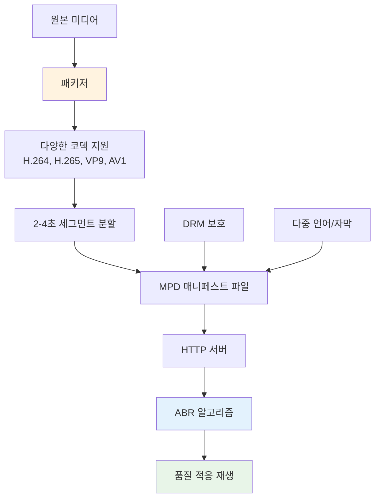
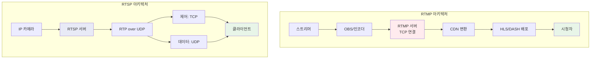
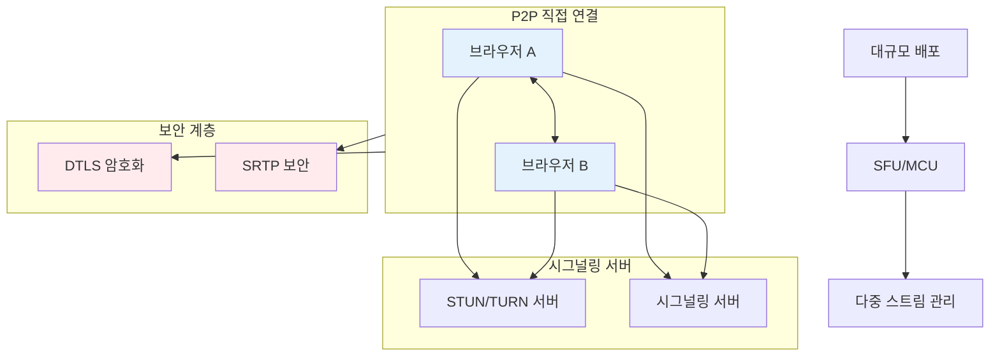
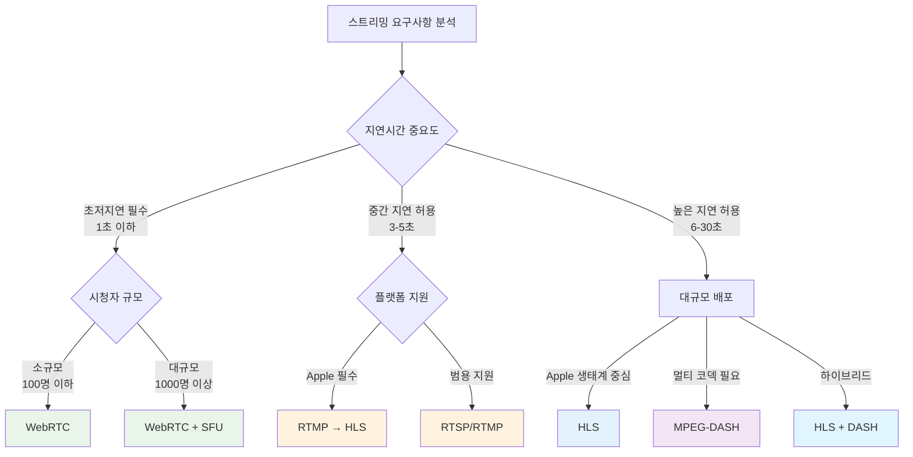

스트리밍 기술의 발전과 함께 다양한 프로토콜들이 각기 다른 특성과 장점을 가지고 시장에서 경쟁하고 있습니다. 본 분석에서는 2025년 현재 주요 스트리밍 방식들을 심층적으로 비교하고, 각각의 아키텍처, 성능, 비용, 그리고 실무 적용 방안을 살펴보겠습니다.

## 1. HLS (HTTP Live Streaming)

### 개요 및 기본 개념
HLS는 Apple에서 개발한 적응형 비트레이트 스트리밍 프로토콜로, 2025년 현재 인터넷 기반 비디오 전송의 **70% 이상**을 담당하는 가장 널리 사용되는 표준입니다. HTTP를 기반으로 하여 미디어 파일을 작은 세그먼트(통상 2-6초)로 분할하고, 다양한 품질 수준으로 인코딩하여 네트워크 상황에 따라 적응적으로 스트리밍을 제공합니다.

### 장점
#### 범용 호환성
HLS는 2025년 현재 **모든 주요 플랫폼과 디바이스**에서 지원되는 가장 안정적인 프로토콜입니다. iOS, Android, 웹 브라우저는 물론 스마트 TV, 셋톱박스까지 광범위한 생태계를 지원합니다.

#### 적응형 비트레이트 스트리밍
네트워크 상황 변화에 실시간으로 대응하여 비디오 품질을 자동 조정함으로써 **최적의 사용자 경험**을 제공합니다. 이는 버퍼링을 최소화하고 안정적인 재생을 보장합니다.

#### 모바일 최적화
모바일 우선 환경에서 HLS는 **배터리 수명 보존**과 **효율적인 데이터 사용**에 최적화되어 있어 모바일 중심 비즈니스에 큰 장점을 제공합니다.

#### 보안 및 콘텐츠 보호
AES-128, SAMPLE-AES 암호화 지원과 토큰 기반 인증, DRM 시스템과의 통합을 통해 **강력한 콘텐츠 보호**를 제공합니다.

### 단점
#### 지연시간 문제
기존 HLS는 **6-30초의 상당한 지연시간**을 가지며, 실시간 상호작용이 중요한 애플리케이션에는 제한적입니다. 저지연 HLS(LL-HLS)도 2-4초의 지연시간을 가집니다.

#### 코덱 제한
**H.264/H.265와 AAC로 제한**되어 있어 새로운 코덱 활용에 한계가 있습니다.

### 비용 분석
- **CDN 대역폭 비용**: 세그먼트 기반 전송으로 CDN 캐싱 효율성 높음
- **인프라 비용**: 표준 HTTP 인프라 활용으로 추가 비용 최소화
- **개발 비용**: 광범위한 지원으로 개발 및 유지보수 비용 절약

## 2. MPEG-DASH (Dynamic Adaptive Streaming over HTTP)

### 개요 및 기본 개념
MPEG-DASH는 **국제 표준**으로 제정된 최초의 적응형 비트레이트 HTTP 기반 스트리밍 솔루션입니다. 코덱에 구애받지 않는 유연성과 개방형 표준의 장점을 제공하며, YouTube, Netflix 등 주요 스트리밍 서비스에서 채택하고 있습니다.

### 장점
#### 코덱 유연성
MPEG-DASH는 **코덱 독립적**으로 설계되어 H.264, H.265, VP9, AV1 등 다양한 인코딩 형식을 지원합니다. 이는 새로운 코덱의 빠른 도입을 가능하게 합니다.

#### 국제 표준 준수
국제 표준 준수가 필요한 프로젝트에 적합하며, Apple 생태계 외부에서 널리 채택된 **신뢰할 수 있는 글로벌 솔루션**을 제공합니다.

#### 인프라 호환성
기존 HTTP 웹 서버 인프라를 활용하므로 **방화벽 문제가 거의 없고** 대부분의 인터넷 환경에서 원활하게 작동합니다.

### 단점
#### Apple 디바이스 지원 제한
**iPhone, iPad, Apple TV 등 Apple 제품에서 네이티브 지원되지 않음**은 가장 큰 제약사항입니다. 모바일 Safari 브라우저에서 MPEG-DASH 플레이어를 지원하지 않습니다.

#### 구현 복잡성
국제 표준이지만 파일 인코딩, 세그먼트 생성, DRM 신호 등에 대한 **구체적인 표준이 없어** 각 콘텐츠 제공업체마다 자체 솔루션을 개발해야 합니다.

#### 보안 취약점
표준 HTTP 프로토콜 사용으로 **중간자 공격과 DoS 공격** 등에 취약할 수 있습니다.

### 비용 분석
- **개발 비용**: 표준화 부족으로 인한 높은 초기 개발 비용
- **CPU 비용**: 비디오 세그먼트 디코딩에 높은 처리 능력 요구
- **플랫폼 비용**: Apple 생태계 지원을 위한 별도 HLS 인프라 필요

## 3. RTMP/RTSP

### 개요 및 기본 개념
RTMP(Real-Time Messaging Protocol)와 RTSP(Real-Time Streaming Protocol)는 **실시간 스트리밍**에 특화된 프로토콜들입니다. RTMP는 TCP 기반의 안정적인 연결을 통해 **3-5초의 저지연**을 달성하며, RTSP는 UDP를 활용해 **0.5-2초의 초저지연**을 실현합니다.

### RTMP 특성
#### 장점
- **높은 안정성**: TCP 기반으로 패킷 손실 없는 안정적 전송
- **저지연**: 3-5초의 상대적 저지연으로 실시간 상호작용 지원
- **플랫폼 지원**: YouTube, Facebook 등 주요 소셜 플랫폼에서 지원
- **고품질**: HD 비디오와 오디오 지원으로 우수한 시청 경험

#### 단점
- **브라우저 제한**: Flash 종료로 브라우저에서 직접 재생 불가
- **상대적 높은 지연**: 최신 초저지연 프로토콜 대비 높은 지연시간

### RTSP 특성
#### 장점
- **초저지연**: UDP 전송으로 **1초 미만**의 극저지연 달성 가능
- **제어 기능**: 재생, 일시정지, 정지 등 정밀한 미디어 제어
- **IP 카메라 표준**: 감시 시스템의 사실상 표준 프로토콜

#### 단점
- **브라우저 지원 제한**: 플러그인 없이는 웹에서 재생 어려움
- **복잡한 설정**: RTMP 대비 복잡한 네트워크 구성 필요
- **CDN 비친화적**: HTTP 기반 프로토콜 대비 CDN 활용도 낮음

### 비용 분석
- **RTMP 비용**: 소셜 플랫폼 연동으로 배포 비용 절약, 안정적인 인프라 요구
- **RTSP 비용**: 전용 서버 인프라 필요, 감시 시스템에서는 표준이므로 호환성 비용 절약

## 4. WebRTC (Web Real-Time Communication)

### 개요 및 기본 개념
WebRTC는 **W3C와 IETF에서 표준화**한 실시간 P2P 통신 기술로, 브라우저와 모바일 애플리케이션에서 플러그인 없이 직접적인 음성, 비디오, 데이터 통신을 가능하게 합니다. Google Meet, WhatsApp, Discord 등에서 활용되며 **초저지연과 보안성**이 핵심 장점입니다.

### 장점
#### 초저지연 통신
**P2P 직접 연결**로 서버 중개 없이 통신하여 **밀리초 단위의 극저지연**을 달성할 수 있습니다. 실시간 상호작용이 중요한 애플리케이션에 최적입니다.

#### 내장 보안
**DTLS와 SRTP 암호화**가 기본 탑재되어 모든 통신이 자동으로 암호화되며, P2P 구조로 서버 해킹 위험을 최소화합니다.

#### 범용 호환성
2025년 현재 **모든 주요 브라우저**에서 지원되며, 플러그인 설치 없이 웹페이지만으로 실시간 통신이 가능합니다.

#### 비용 효율성
P2P 구조로 **서버 대역폭 비용을 대폭 절감**하며, 중앙 서버 의존도를 낮춰 인프라 비용을 최소화합니다.

### 단점
#### 확장성 제약
**일대일 또는 소규모 그룹 통신**에 최적화되어 있어, 대규모 라이브 이벤트나 방송에는 SFU/MCU 등 추가 인프라가 필요합니다.

#### 네트워크 제약
**방화벽과 NAT 환경**에서 STUN/TURN 서버가 필요하며, 일부 기업 네트워크에서는 연결 제약이 있을 수 있습니다.

### 비용 분석
- **인프라 비용**: P2P 구조로 서버 대역폭 비용 최소화
- **개발 비용**: 브라우저 내장 API로 개발 시간 단축
- **확장 비용**: 대규모 서비스를 위한 SFU/MCU 도입 시 추가 비용 발생

## 스트리밍 방식 종합 비교

### 성능 비교표
| 프로토콜 | 지연시간 | 확장성 | 브라우저 지원 | Apple 지원 | 개발 복잡도 |
|---------|---------|---------|-------------|-------------|-------------|
| **HLS** | 3-30초 | 매우 높음 | 완전 지원 | 완전 지원 | 낮음 |
| **MPEG-DASH** | 3-30초 | 매우 높음 | 완전 지원 | 제한적 | 중간 |
| **RTMP** | 3-5초 | 높음 | 제한적 | 제한적 | 중간 |
| **RTSP** | 0.5-2초 | 중간 | 제한적 | 제한적 | 높음 |
| **WebRTC** | <1초 | 낮음* | 완전 지원 | 완전 지원 | 높음 |

*SFU/MCU 사용 시 확장 가능

### 사용 사례별 권장사항
#### 대규모 라이브 스트리밍
- **1순위**: HLS (범용성과 안정성)
- **2순위**: MPEG-DASH (코덱 유연성)
- **주요 고려사항**: CDN 최적화, 적응형 비트레이트

#### 실시간 인터랙티브 서비스
- **1순위**: WebRTC (초저지연)
- **2순위**: RTMP (중간 지연, 안정성)
- **주요 고려사항**: 네트워크 환경, 확장성

#### 보안 감시 시스템
- **1순위**: RTSP (IP 카메라 표준)
- **2순위**: RTMP (웹 통합 필요 시)
- **주요 고려사항**: 지연시간, 제어 기능

#### 모바일 우선 서비스
- **1순위**: HLS (모바일 최적화)
- **2순위**: WebRTC (앱 내 실시간 통신)
- **주요 고려사항**: 배터리 효율, 데이터 사용량

## 비용 효율성 분석

### CDN 및 대역폭 비용 (2025년)

```mermaid
gantt
    title 스트리밍 프로토콜별 비용 구조
    dateFormat X
    axisFormat %s
    
    section HLS
    CDN 캐싱 효율성 :done, hls1, 0, 85
    개발 비용 절약 :done, hls2, 0, 90
    인프라 호환성 :done, hls3, 0, 95
    
    section MPEG-DASH
    개발 복잡성 :crit, dash1, 0, 60
    멀티 코덱 효율 :done, dash2, 0, 80
    글로벌 표준 :done, dash3, 0, 75
    
    section RTMP/RTSP
    전용 인프라 비용 :crit, rtmp1, 0, 40
    저지연 가치 :done, rtmp2, 0, 85
    플랫폼 제한 :crit, rtmp3, 0, 30
    
    section WebRTC
    P2P 비용 절약 :done, webrtc1, 0, 95
    확장 인프라 비용 :crit, webrtc2, 0, 45
    개발 복잡성 :crit, webrtc3, 0, 50
```

### 2025년 시장 트렌드
#### 비용 상승 압박
**CDN 업계의 첫 번째 가격 인상**이 2025년에 예상되며, 2026년까지 더욱 뚜렷한 증가가 예상됩니다. 운영 비용이 효율성 향상을 앞지르면서 전력, 인력, 네트워크 연결, 컴퓨팅 자원이 CDN 가격의 주요 결정 요인이 되고 있습니다.

#### 대역폭 최적화 효과
- CDN 활용 시 **비디오 대역폭 사용량 60% 절감** 가능
- 효과적인 CDN 캐싱으로 **원본 서버 요청 50-60% 감소**
- 동적 계층 CDN으로 **스트리밍 비용 60-90% 절감** 달성 가능

#### 차세대 요구사항
2025년까지 **전체 인터넷 트래픽의 65% 이상**이 4K 이상의 초고비트레이트 비디오가 될 것으로 예상되며, 2030년까지 홀로그래픽 스트리밍과 볼류메트릭 비디오는 **단일 스트림당 100Mbps를 초과**할 것으로 전망됩니다.

## 로컬캐시 전략

### 세그먼트 기반 캐싱
#### HLS 캐싱 최적화
- **라이브 콘텐츠**: 6초 세그먼트, 매우 짧은 TTL (1-5초)
- **VOD 콘텐츠**: 10초 세그먼트, 중간 기간 캐시 유지
- **매니페스트 파일**: `Cache-Control: max-age=5` 설정으로 5초마다 갱신

#### MPEG-DASH 캐싱
- **저지연용**: 2-4초 세그먼트
- **안정성 우선**: 6-10초 세그먼트
- **MPD 파일**: 짧은 TTL로 빠른 업데이트 반영

### 2025년 진보된 캐싱 기술
#### CMAF 활용 효율성
**공통 미디어 애플리케이션 형식(CMAF)**으로 HLS와 DASH가 동일한 인코딩된 미디어 세그먼트를 공유하여 **CDN 캐싱 효율성을 극대화**하고 대역폭 사용량을 최적화할 수 있습니다.

#### AI 기반 예측 캐싱
**AI 기반 알고리즘**이 시청자 행동과 네트워크 상황을 예측하여 비트레이트 선택, 사전 버퍼링 전략, 콘텐츠 추천까지 동적으로 최적화하여 지연시간을 줄이고 QoS를 향상시킵니다.

## 실무 적용 가이드라인

### 프로토콜 선택 결정 트리

### 구현 단계별 체크리스트
#### 1단계: 요구사항 정의
- [ ] 목표 지연시간 명세 (초저지연/저지연/일반)
- [ ] 예상 동시 시청자 수
- [ ] 대상 플랫폼 및 디바이스
- [ ] 보안 요구사항 (DRM, 암호화)
- [ ] 예산 및 인프라 제약사항

#### 2단계: 아키텍처 설계
- [ ] CDN 전략 수립
- [ ] 인코딩 설정 (비트레이트, 해상도, 코덱)
- [ ] 캐싱 정책 정의
- [ ] 모니터링 및 분석 도구 선정
- [ ] 백업 및 장애 복구 계획

#### 3단계: 프로토콜별 최적화
#### HLS 최적화
- [ ] Apple Developer 가이드라인 준수
- [ ] LL-HLS 구현 검토
- [ ] 적응형 비트레이트 설정
- [ ] 세그먼트 길이 최적화

#### MPEG-DASH 최적화
- [ ] 다중 코덱 지원 구현
- [ ] Apple 디바이스 대안 방안
- [ ] DRM 통합 테스트
- [ ] MPD 최적화

#### WebRTC 최적화
- [ ] STUN/TURN 서버 구성
- [ ] SFU/MCU 확장 계획
- [ ] 브라우저 호환성 테스트
- [ ] NAT 트래버설 최적화

#### 4단계: 성능 모니터링
- [ ] QoE 메트릭 추적 (시작 시간, 버퍼링, 품질)
- [ ] 대역폭 사용량 모니터링
- [ ] CDN 히트율 측정
- [ ] 사용자 피드백 수집
- [ ] 비용 효율성 분석

## 결론

2025년 스트리밍 환경에서는 **단일 프로토콜로는 모든 요구사항을 충족하기 어려우며**, 서비스 특성에 따른 **하이브리드 접근법**이 최적의 해결책입니다.

**HLS**는 범용성과 안정성으로 대부분의 스트리밍 서비스에 적합하며, **MPEG-DASH**는 코덱 유연성이 필요한 글로벌 서비스에, **WebRTC**는 실시간 상호작용이 중요한 애플리케이션에, **RTMP/RTSP**는 전문적인 방송 및 감시 시스템에 각각 최적화되어 있습니다.

비용 효율성 측면에서는 **CDN 최적화와 캐싱 전략**이 핵심이며, AI 기반 예측 기술과 CMAF 표준 활용이 향후 경쟁력을 좌우할 것입니다. 2025년의 가격 상승 압박 속에서도 **적절한 프로토콜 선택과 최적화 전략**을 통해 비용 효율적인 고품질 스트리밍 서비스 구현이 가능합니다.