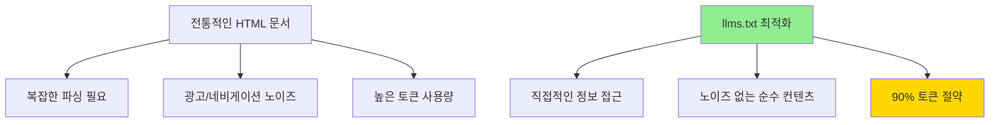

# LLM을 위한 SEO 문서화 사례 분석

최근 발견한 MediaBunny처럼 LLM을 위한 특별한 문서화가 급속히 확산되고 있는 트렌드입니다. 이는 AI 시대의 새로운 개발자 경험을 만들어가고 있습니다.

## 핵심 개념: `/llms.txt` 표준

`/llms.txt` 표준은 웹사이트가 LLM에게 자신을 소개하는 표준화된 방식입니다.

```
/robots.txt → 검색엔진용
/sitemap.xml → 크롤링용  
/llms.txt → LLM용
```

### 주요 목적

- **컨텍스트 윈도우 제한 해결**: 복잡한 HTML 대신 압축된 정보 제공
- **토큰 효율성**: HTML → Markdown 변환으로 **90% 토큰 절약**
- **정확성 향상**: 구조화된 문서로 AI 응답 품질 개선

## 주요 구현 사례들

### 대형 플랫폼

**Stripe** 🟢
- `/llms.txt` 구현으로 AI 도구 가이드 제공
- 모든 문서 URL에 `.md` 추가하여 plain text 버전 제공
- 예: `https://docs.stripe.com/building-with-llms.md`
- AI 에이전트 툴킷으로 OpenAI, Vercel AI SDK, LangChain 지원

**Vercel AI SDK** 🟢
- 컨텍스트 기반 API 엔드포인트 설명
- AI가 더 나은 결정을 내릴 수 있도록 상황별 가이드 제공
- Next.js 생태계와 완전 통합

**Supabase** 🟢
- 표준적인 llms.txt 구현
- Postgres, Auth, Storage 등 다양한 서비스 문서화
- Vercel과의 협업으로 AI 챗봇 템플릿 제공

**Cloudflare** 🟢
- 가장 광범위한 llms.txt 구현 중 하나
- "Easily build and deploy full-stack applications everywhere" 슬로건
- 통합된 compute, storage, networking 서비스 문서화

### AI 전문 회사들

**Anthropic** 🤖
- Claude 문서용 `llms-full.txt` 제공
- AI 안전성과 신뢰성에 중점을 둔 문서화

**ElevenLabs** 🎵
- 음성 AI API 문서 최적화
- TTS, STT, 음성 복제 기술 상세 가이드
- 32-99개 언어 지원 모델 문서화

**Cohere** 💼
- 엔터프라이즈 AI 플랫폼 문서
- 기업용 AI 솔루션에 특화된 가이드

### 개발자 도구들

**Zapier** ⚡
- AI Actions API 중심의 상세한 llms.txt
- 5,000+ 앱 연동 자동화 플랫폼
- API 엔드포인트 체계적 정리

**Codeium** 💻
- 무료 AI 코드 자동완성 도구
- 개발자 워크플로우 최적화 문서

**AgentQL** 🔍
- 자연어 쿼리로 AI 에이전트 구축
- 직관적인 쿼리 문법 가이드

## 구현 효과 및 이점

### 성능 개선
- **토큰 사용량 10배 감소**: Markdown vs HTML
- **응답 정확도 향상**: 구조화된 컨텍스트 제공
- **실시간 업데이트**: 최신 API 변경사항 즉시 반영

### 개발자 경험
- **AI 코딩 어시스턴트 정확도 향상**
- **에이전트 구축 효율성 증대**
- **문서 탐색 시간 단축**



## 도구 및 생태계

### 자동 생성 도구

**Mintlify** 📝
- 자동 llms.txt 및 llms-full.txt 생성
- 모든 문서를 AI 친화적 형태로 자동 변환
- 개발자 문서 플랫폼 통합

**Apidog** 🔧
- API 문서의 AI 친화적 변환 지원
- 공개된 API 문서를 llms.txt 형태로 자동 변환
- 개발팀 협업 도구와 통합

**llms-txt-generator** ⚙️
- Node.js 기반 라이브러리
- API 문서 인덱싱 자동화
- 다양한 프레임워크 지원

### 통합 플랫폼

**llms-txt-hub** 🌐
- AI 준비된 문서의 중앙 디렉토리
- 다양한 프로젝트와 플랫폼의 구현 사례 수집
- 커뮤니티 기여 및 표준화 추진

## 미래 전망

### 표준화 진행
- **Web Standard 후보**: robots.txt처럼 웹 표준으로 발전 가능성
- **플랫폼 네이티브 지원**: 주요 클라우드 플랫폼의 기본 기능화
- **IDE 통합**: 개발 환경에서의 자동 문서 fetching

### 기술 발전 방향
```
현재: 정적 텍스트 파일
   ↓
미래: 동적 API 엔드포인트
   ↓
궁극: AI-to-AI 통신 프로토콜
```

### 비즈니스 임팩트
- **개발자 온보딩 시간 단축**: 복잡한 API도 AI 도움으로 빠른 학습
- **API 채택률 증가**: 더 쉬운 통합으로 개발자 유입 증대
- **지원 비용 절감**: 자주 묻는 질문을 AI가 자동 해결

## 구현 모범 사례

### 파일 구조
```
/llms.txt          # 기본 정보 및 링크
/llms-full.txt     # 전체 문서 내용
/docs/*.md         # 개별 문서들
/api/docs.json     # API 스펙
```

### 내용 구성
1. **회사/제품 소개** (간결하게)
2. **주요 API 엔드포인트** (카테고리별)
3. **인증 방법** (단계별)
4. **예제 코드** (언어별)
5. **에러 처리** (일반적인 케이스)
6. **제한사항** (rate limiting 등)

## 실제 구현 예시

### 기본 llms.txt 구조

```markdown
# Company/Product Name

Brief description of what your company/product does.

## Getting Started

Quick start guide with essential information.

## API Reference

### Authentication
- API Key: Required for all requests
- Header: `Authorization: Bearer YOUR_API_KEY`

### Core Endpoints

#### POST /api/v1/generate
Generate content using our AI models.

**Parameters:**
- `prompt` (string): The input prompt
- `model` (string): Model to use (gpt-4, claude-3, etc.)
- `max_tokens` (integer): Maximum tokens to generate

**Example:**
```bash
curl -X POST https://api.example.com/v1/generate \
  -H "Authorization: Bearer YOUR_API_KEY" \
  -d '{"prompt": "Hello world", "model": "gpt-4"}'
```

## Rate Limits
- 100 requests per minute
- 1000 requests per hour

## Support
- Documentation: https://docs.example.com
- Support: support@example.com
```

### 고급 구현 팁

1. **컨텍스트 최적화**: 가장 중요한 정보를 앞쪽에 배치
2. **코드 예제 포함**: 실제 사용 가능한 코드 스니펫 제공
3. **에러 케이스 문서화**: 일반적인 오류와 해결책 포함
4. **업데이트 주기**: 최소 주 1회 업데이트 권장

> **핵심 인사이트**: LLM을 위한 문서화는 단순한 트렌드가 아닌, AI 시대의 필수 인프라로 자리잡고 있습니다. 개발자 경험의 혁신과 API 생태계의 효율성을 동시에 달성하는 핵심 전략입니다.