# 🏗️ BIM(Building Information Modeling) 기술 심층 분석

> 건설 산업의 디지털 전환을 이끄는 핵심 기술인 BIM에 대한 종합 분석 리포트
> 

---

# 📋 목차

1. BIM 개념과 정의
2. BIM의 필요성 및 배경
3. BIM의 장단점 분석
4. 글로벌 선도 기업
5. 국내 선도 기업 및 동향
6. 도메인 기술 스택
7. 개발 기술 스택
8. 그래픽스 기술 연관성
9. 3D 기술 연관성
10. 미래 전망 및 결론

---

# 1️⃣ BIM 개념과 정의

## 1.1 BIM이란?

**BIM(Building Information Modeling)**은 디지털 방식으로 건물의 하나 또는 그 이상의 정확한 가상 모델을 생성하는 기술입니다. 자재, 공정, 공사비, 제원정보 등 속성정보가 입력된 **3차원 입체 모델링**을 통해 설계·조달·시공 등 건설 전 과정에 필요한 정보를 통합 관리하는 **스마트건설 기술**입니다.

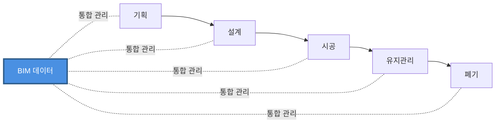

## 1.2 BIM의 핵심 특징

### 🔹 생애주기 관리

최초 디자인 단계에서부터 공사, 유지보수 및 빌딩 철거에 이르기까지 건축물 관련 자산의 **전체 수명주기**에 거쳐 관련 설계 정보를 통합 관리합니다.

### 🔹 협업 중심 프로세스

BIM은 단순히 한 분야의 전문가에 의한 진행이 아닌, **엔지니어, 시공사, 건물주, 설계사, 계약업체** 등 모두와 연관된 협력적 관리를 의미하며, 기본적으로 3차원(3D) 가상 건설 환경을 통해 이러한 모든 이해관계자와 관련 정보를 공유합니다.

### 🔹 다차원 정보 모델링

BIM은 다차원 가상공간에 기획, 설계, 엔지니어링(구조, 설비, 전기 등), 시공 및 유지관리, 폐기까지 가상으로 시설물을 모델링하는 과정을 의미합니다.

## 1.3 2026년 현재 상황

국토교통부는 BIM 도입이 빠른 도로 분야를 시작으로 철도·건축, 하천·항만 등 **1,000억원 이상 규모의 사업에 BIM을 순차 도입**하면서:

- **2026년**: 500억원 이상 공사로 적용 범위 확대
- **2028년**: 300억원 이상 공사로 확대
- **2030년**: 300억원 미만 공사까지 BIM 의무화

앞으로 모든 건설 프로젝트는 **건축 BIM 기반 설계 프로세스가 표준**이 될 것입니다.

**참고 자료:**

- [Tekla - BIM이란](https://www.tekla.com/kr/리소스/아티클/bim이란)
- [상상진화 - BIM 이란?](https://imbu.co.kr/bim/)
- [BSI - BIM 빌딩 정보 모델링](https://www.bsigroup.com/ko-KR/Building-Information-Modelling-BIM/)

---

# 2️⃣ BIM의 필요성 및 배경

## 2.1 건설 산업의 디지털 전환

### 🏗️ 건설 산업의 낮은 디지털화 문제

건설 산업의 낮은 디지�화로 인한 **생산성 저하 문제**를 개선하기 위해 국토교통부는 '스마트 건설 활성화 방안'을 공표하고 BIM 도입을 통한 건설산업 디지털화를 목표로 하고 있습니다.

### 📊 정부 로드맵

국가 차원에서 BIM 도입에 대해 강한 의지를 가지고 추진 중이며, BIM 시행지침 공개를 앞두고 있는 상황입니다.

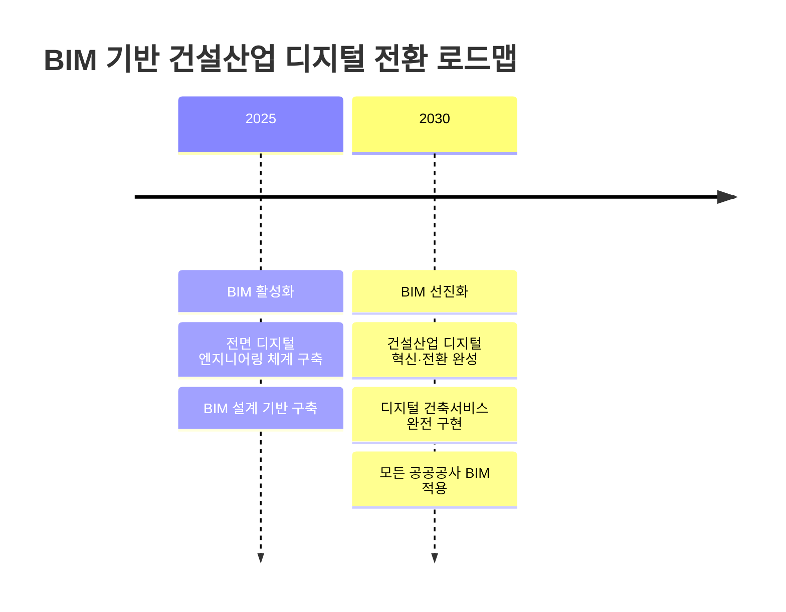

## 2.2 정부 정책 및 의무화

### 🎯 적용 대상

국토교통부는 '건설산업 BIM 기본지침'과 '건축 BIM 활성화 로드맵'을 발표하고 BIM의 적용대상을:

- 토목
- 건축
- 산업설비
- 조경
- 환경시설

등 **'건설산업진흥법'상 모든 건설산업**에 적용하는 것을 권고했습니다.

### 📈 단계별 확대

1천억 원 이상 공공공사의 의무도입을 단계별로 확대하는 등 속도를 높이고 있습니다.

## 2.3 글로벌 트렌드

전 세계적으로 건설 업계가 디지털 트랜스포메이션을 지속적으로 수용함에 따라 BIM 소프트웨어의 채택이 크게 증가하고 있습니다. 이러한 도입은:

- ✅ 효율성 향상
- ✅ 비용 절감
- ✅ 프로젝트 일정 단축

업계의 광범위한 목표에 부합합니다.

**참고 자료:**

- [국토교통부 BIM 기반 건설산업 디지털 전환 로드맵](https://resource.midasuser.com/ko/blog/bridge/bim_roadmap)
- [캐드앤그래픽스 - BIM 기반 건설산업 디지털 전환 로드맵](https://www.cadgraphics.co.kr/newsview.php?pages=lecture&sub=lecture03&catecode=9&num=69315)

---

# 3️⃣ BIM의 장단점 분석

## 3.1 BIM의 주요 장점

### ✅ 1. 3D 시각화 및 정확한 설계

BIM 소프트웨어에 의해 생성된 **3D 모델**은 여러 개의 2D 뷰에서 생성하지 않고 직접 설계를 통해 얻으며, 설계의 모든 단계에서 시각화가 가능합니다.

### ✅ 2. 비용 견적 및 물량 산출

모든 객체마다 가격 정보를 부여하면 모든 객체를 배치 후에 가격 정보를 뽑아보는 것이 가능합니다. 이는 **정확한 예산 관리**와 **원가 산정**을 가능하게 합니다.

### ✅ 3. 간섭 체크 및 오류 감소

BIM을 통해 설계 단계에서 발생할 수 있는 설계 요소 간의 **충돌을 미리 감지**하고 수정할 수 있어, 시공 중 발생할 수 있는 문제를 최소화합니다.

```
┌─────────────────────────────────────┐
│  설계 단계에서 간섭 검토            │
│                                     │
│  구조 ═══╬═══ 설비                 │
│          ║                          │
│         충돌 감지!                  │
│          ↓                          │
│      사전 수정으로                  │
│      시공 오류 방지                 │
└─────────────────────────────────────┘
```

### ✅ 4. 협업 향상

BIM 기술은 다양한 설계 분야와 **동시 작업**을 가능하게 하여, 프로젝트 참여자 간의 원활한 커뮤니케이션을 지원합니다.

### ✅ 5. 자동 업데이트

모든 객체가 연결되어 있기 때문에 **하나만 수정해도 알아서 도면과 일람표가 자동으로 변경**됩니다. 이는 설계 변경 시 막대한 시간 절약을 가져옵니다.

### ✅ 6. 공기 및 공사비 절감

BIM 사업별 통상 평균:

- **공기 12~50% 절감**
- **공사비 5~9% 절감**

효과가 있습니다.

## 3.2 BIM의 단점 및 한계점

### ❌ 1. 복잡성과 학습 곡선

아무리 기능이 좋아도 **결국 배워야 한다는 것이 문제**입니다. 현업에서 종사하는 분들 입장에서는 CAD 같은 기본 도구 말고 추가적인 학습을 하는데 시간적인 여유가 없기 때문에 BIM 기술이 나온지 오래 되었어도 적용하는 데에는 시간이 한참 걸립니다.

### ❌ 2. 국내 산업 특성과의 충돌

**시간과 비용의 단축을 극도로 요구하는 국내 산업 특성** 때문에 한국의 BIM이 다른 국가들보다 정착하기 어려운 점이 있습니다.

### ❌ 3. 통합 프로세스 부재

BIM의 최대 장점이 각 분야의 정보를 하나의 데이터로 프로젝트 전체를 볼 수 있는 것인데 이를 극대화 시키기 위해서는 **통합설계프로세스가 절실**합니다.

### ❌ 4. 분야별 차이 및 복잡성

토목분야의 경우 **비정형성이 높은 지반정보**를 다뤄야 하고 도로, 철도, 하천 등의 선형은 평면곡선, 종단곡선, 편경사가 있어 **기하학적으로 매우 복잡**합니다.

### ❌ 5. 초기 비용 부담

소프트웨어 라이선스 비용, 하드웨어 투자, 교육 비용 등 **초기 도입 비용이 상당**합니다.

### ❌ 6. 인력 및 인식 부족

- 발주처 등 공공 분야 담당자들의 BIM에 대한 **이해 및 인식 부족**
- **비용 대비 효과에 대한 공감대** 형성 미흡
- **BIM 전문 인력 부족**

### ❌ 7. 표준 및 가이드 부족

정부에서 BIM 발주를 확대하고 있으나 **표준이나 지침이 전무**하며, 가이드의 부족으로 적극적으로 활용하기 어려운 상황입니다.

## 3.3 과제 해결방안

### 🔧 1. 인식 전환

발주자들의 **비용 부담에 대한 인식 전환**이 필요하며, 건설 업체들은 장기적인 안목을 통해 비용 부담을 **투자라고 인식**해야 합니다.

### 🔧 2. 인력 육성

**BIM 전담인력 육성**이 필요하며, BIM은 기존작업의 전 과정을 변화시켜야 하기 때문에 많은 시간과 노력이 필요합니다.

### 🔧 3. 표준화 및 가이드라인

- 국내의 적합한 **표준 데이터 개발**
- 정확한 **라이브러리 구축**
- **BIM 활용 가이드라인 및 표준지침** 마련

### 🔧 4. 정책적 지원

- 공공 발주 확대
- 교육 및 자격 체계 개선
- BIM 전문 기업 육성
- **대가 기준 마련**

**참고 자료:**

- [상상진화 - BIM 이란?](https://imbu.co.kr/bim/)
- [나무위키 - BIM](https://namu.wiki/w/BIM)
- [Tekla - BIM이란](https://www.tekla.com/kr/리소스/아티클/bim이란)
- [국내 건설업에서의 BIM의 적용 문제점과 효율적인 적용방안에 관한 연구](https://scienceon.kisti.re.kr/srch/selectPORSrchArticle.do?cn=DIKO0012736840)

---

# 4️⃣ 글로벌 선도 기업

## 4.1 시장 개요

글로벌 BIM 소프트웨어 시장은 **5개 주요 기업**이 독점하고 있습니다:

- Autodesk
- Bentley Systems
- Dassault Systems
- Nemetschek Group
- Trimble

이들은 BIM 소프트웨어 및 관련 기술을 독점적으로 제공하고 있습니다.

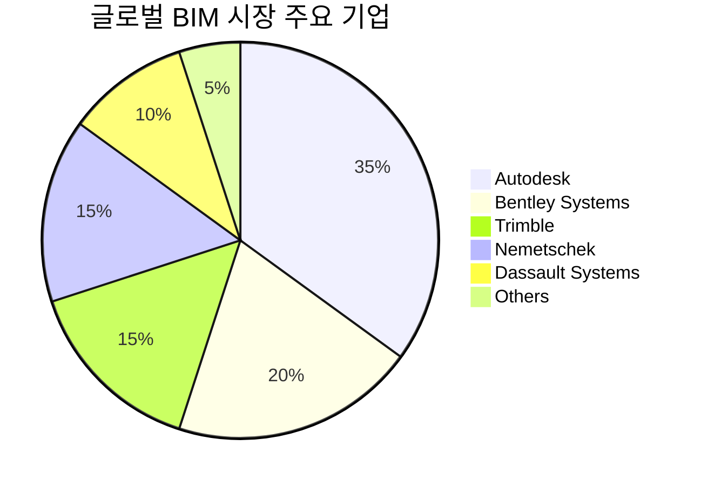

## 4.2 주요 기업 분석

### 🏢 Autodesk

**대표 제품:**

- **Revit**: 건축 BIM의 사실상 표준
- **Civil 3D**: 토목 설계 솔루션
- **AutoCAD**: 2D/3D CAD 소프트웨어
- **BIM 360 / Autodesk Construction Cloud (ACC)**: 클라우드 협업 플랫폼

**시장 점유율:**

- 한국 시장에서 Civil 3D와 Revit이 **80-90% 시장 점유율** 보유
- 글로벌 BIM 시장의 최상위 플레이어

**특징:**

- 가장 광범위한 BIM 생태계 보유
- 강력한 API 및 확장 기능 제공
- 클라우드 기반 협업 솔루션 선도

### 🏢 Bentley Systems

**대표 제품:**

- **OpenBuildings**: 건축 설계
- **OpenRoads**: 도로 및 토목 인프라
- **OpenRail**: 철도 인프라
- **MicroStation**: CAD 플랫폼

**특징:**

- **인프라 분야**에 특화
- 대규모 인프라 프로젝트에 강점
- 디지털 트윈 솔루션 제공

### 🏢 Trimble

**대표 제품:**

- **Tekla Structures**: 구조 엔지니어링 및 시공 관리
- **VICO Office**: 통합 관리 프로그램
- **SketchUp**: 3D 모델링 (건축 및 디자인)

**특징:**

- **시공 단계**에 강점
- 측량 및 위치 기술과의 통합
- 제조 및 조립 세부사항 제공

### 🏢 Nemetschek Group

**대표 제품:**

- **ARCHICAD**: 건축 설계
- **Allplan**: 건축 및 엔지니어링
- **Vectorworks**: 건축 및 엔터테인먼트

**특징:**

- 유럽 시장에 강세
- 다양한 전문 분야별 솔루션 포트폴리오

### 🏢 Dassault Systèmes

**대표 제품:**

- **CATIA**: 3D 설계 및 엔지니어링
- **SIMULIA**: 시뮬레이션 소프트웨어

**특징:**

- 제조업 배경의 강력한 3D 기술
- 복잡한 엔지니어링 프로젝트에 적합

## 4.3 시장 규모 및 전망

### 📊 현재 시장 규모 (2025년)

- **글로벌 BIM 시장**: 99억 3,000만 달러
- **건축 BIM 소프트웨어 시장**: 93억 4,000만 달러

### 📈 미래 전망 (2030년)

- **글로벌 BIM 시장**: 190억 4,000만 달러
- **연평균 성장률 (CAGR)**: 13.9%

### 📈 2033년 전망

- **건축 BIM 소프트웨어 시장**: 336억 4,000만 달러
- **연평균 성장률 (CAGR)**: 17.37%

**참고 자료:**

- [대한경제 - 글로벌 '빅5' 독식구조](https://m.dnews.co.kr/m_home/view.jsp?idxno=202202161414498600948)
- [Fortune Business Insights - BIM Market Size](https://www.fortunebusinessinsights.com/building-information-modelling-software-market-102986)
- [PRNewswire - BIM Software Industry Projections](https://www.prnewswire.com/news-releases/building-information-modeling-bim-software-industry-projections-2023-2027-with-shares-of-leading-bim-providers-including-autodesk-trimble-and-bentley-systems-301847094.html)

---

# 5️⃣ 국내 선도 기업 및 동향

## 5.1 주요 건설사

### 🏗️ DL이앤씨

- 스마트건설연합(Smart Construction Alliance) **BIM 기술위원회 위원장사**
- 국내 **최대 규모 BIM 전담팀** 운영
- 2020년 건설업계 최초로 **모든 공동주택 현장에 BIM 기술 적용**

### 🏗️ 현대건설

- BIM 기반 **디지털 플랫폼 도입**으로 스마트 건설 가속화
- **Autodesk BIM 360** 도입으로 협업 시스템 구축
- 건축 및 주택사업본부 전 현장에 클라우드 기반 BIM 협업 시스템 구축

### 🏗️ 현대엔지니어링

- BIM 관련 프로젝트 적극 추진
- 플랜트 및 인프라 분야 BIM 적용 확대

## 5.2 BIM 전문 기업

### 🔷 국보디자인

- 한국 **인테리어 디자인 업계 최초** BIM 국제 표준 인증 취득
- BIM을 활용한 입찰, 설계, 시공 관리 수행
- 다수 프로젝트에서 BIM 적용

### 🔷 한울씨앤비

- BIM **전문 컨설팅 기업**
- 건설 프로젝트의 BIM 환경 구축 및 컨설팅 제공
- 3D뿐만 아니라 **4D(공정), 5D(비용)** 시스템 구현

### 🔷 바이머블 (Bimable)

- BIM 전문가들의 젊은 기업
- BIM 및 IT 엔지니어링 서비스 제공
- 혁신적인 BIM 솔루션 개발

## 5.3 누적 BIM 적용 실적 (2009-2016)

| 분야 | 1위 기업 | 프로젝트 수 |
| --- | --- | --- |
| **건축설계 사무소** | ㈜정림건축종합건축사사무소 | 75개 |
| **엔지니어링 회사** | ㈜엠티엠디지털컨스트럭션 | 27개 |
| **IT & 소프트웨어** | ㈜두올테크 | 86개 |

## 5.4 산업 협회 및 기관

### 🏛️ (사)빌딩스마트협회

- 한국 건설 분야 BIM 및 선진 건설 IT **연구·보급·적용 촉진**을 위한 민간 대표 조직
- 국제 표준(IFC) 관리 및 보급
- BIM 교육 및 인증 프로그램 운영

### 🏛️ 한국건설기술연구원

- BIM 기술 R&D 수행
- **'코빔(CO-BIM)'** 클라우드 기반 BIM 협업 플랫폼 개발
- BIM 표준 및 가이드라인 제정

## 5.5 최신 동향

### 📊 투자 우선순위

현재 조사에 따르면 건설 기업의 **45.7%가 BIM 및 디지털 트윈 기술에 우선 투자**하고 있으며, 이는 전년 대비 **16.1%포인트 증가**한 수치입니다.

### 🎯 정부 정책

- 2025년: BIM 설계 기반 구축
- 2030년: 디지털 건축서비스 완전 구현
- 단계적 의무화 확대

### 🚀 기술 발전 방향

- **클라우드 기반 협업** 플랫폼 확대
- **AI 및 머신러닝** 통합
- **디지털 트윈** 기술과의 융합
- **IoT 센서 데이터** 연동

**참고 자료:**

- [산건 - 스마트건설의 핵심, BIM](https://www.sankun.com/blog/detail/295_스마트건설의_핵심__BIM___BIM_뜻__DL이앤씨__현대엔지니어링__국보디자인__한울씨앤비)
- [바이머블 공식 웹사이트](https://bimable.co.kr/)
- [빌딩스마트협회 - BIM 적용 용역실적 현황](https://buildingsmart.or.kr/Home/ServiceNewsDetail?Page=2&idx=2753)

---

# 6️⃣ 도메인 기술 스택

## 6.1 openBIM 표준

### 🔷 openBIM 개념

**openBIM**은 독점 벤더 데이터 형식, 원칙 또는 프로젝트 단계에 의해 제약을 받는 BIM 데이터의 기존 문제를 제거하며, **국제 표준 및 작업 절차를 준수**함으로써 공통적인 정렬 및 언어를 만들어 BIM 사용의 폭과 깊이를 확장합니다.

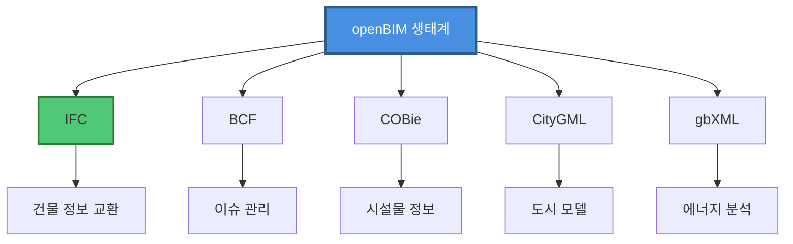

## 6.2 IFC (Industry Foundation Classes)

### 📋 IFC 개요

IFC 파일은 BIM을 위한 **사실상의 개방형 상호운용성 표준**으로, 동일한 언어를 사용하지 않는 데스크탑 저작 애플리케이션 간의 정보 교환을 가능하게 하는 디지털 파일 유형입니다.

### 🏗️ IFC 구조

IFC 파일은 **클래스의 전문화**를 기반으로 한 정확한 스키마에 따라 구조화되어 있으며, 각 요소는 특정 속성을 가진 일반 클래스에서 시작하여 이후 추가 속성을 가진 특정 하위 클래스로 나뉩니다.

### 📊 IFC 버전

- **IFC2x3**: 가장 많이 사용되는 형식
- **IFC4**: 최신 형식, 개선된 기능
- **IFC4.3** (2024년 봄 ISO 인증 예정):
    - 도로, 철도, 교량, 터널
    - 관련 경로 지정 (IfcAlignment)
    - 인프라 영역 통합

### 🌐 표준화

빌딩스마트에서 제정한 IFC 표준규격은 **2005년 국제표준화기구 ISO/PAS 16739 표준**으로 지정되었습니다.

## 6.3 BCF (BIM Collaboration Format)

**BCF**는 buildingSMART에서 관리하는 형식으로, **플랫폼 간 설계 이슈를 전달**하는 데 사용됩니다.

### 주요 기능:

- 이슈 및 코멘트 관리
- 뷰포인트 공유
- 버전 관리
- 작업 흐름 추적

## 6.4 LOD (Level of Development)

### 📊 LOD 레벨 개요

**Level of Development (LOD)**는 AEC 산업의 실무자들이 설계 및 시공 프로세스의 다양한 단계에서 **BIM의 내용과 신뢰성**을 명확하게 지정하고 표현할 수 있게 하는 참조 기준입니다.

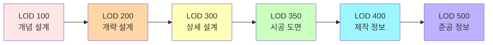

### 📋 LOD 상세 설명

| LOD | 명칭 | 설명 | 용도 |
| --- | --- | --- | --- |
| **100** | 개념 설계 | 기본 형태와 크기 | 초기 계획 및 매스 스터디 |
| **200** | 개략 설계 | 대략적인 수량 및 치수 | 스키매틱 디자인, 초기 견적 |
| **300** | 상세 설계 | 구체적인 조립 및 정확한 정보 | 설계 개발, 간섭 체크 |
| **350** | 시공 도면 | 시공 문서 및 샵 드로잉 | 시공 계획 수립 |
| **400** | 제작 및 조립 | 제작 세부 정보 | 실제 제작 및 설치 |
| **500** | 준공 | As-Built 조건 | 시설물 관리 및 유지보수 |

### 🔍 LOD vs LOI

- **LOD (Level of Development)**: 구성 요소의 사양, 형상 및 첨부 정보가 얼마나 잘 구상되었는지의 정도
- **LOI (Level of Information)**: 실제로 모델 요소에 포함된 세부 정보의 비율

## 6.5 BIM 차원 (Dimensions)

### 🌐 다차원 BIM 개념

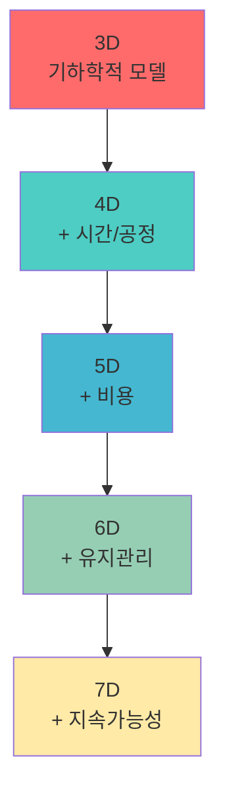

### 📊 차원별 상세 설명

### 3D BIM

- **내용**: 3차원 기하학적 모델
- **활용**: 시각화, 설계, 간섭 체크
- **효과**: 설계 오류 감소, 의사소통 개선

### 4D BIM (시공 관리)

- **내용**: 3D 모델 + 공정 정보
- **활용**: 공정 시뮬레이션, 진척률 관리, 계획 대비 실행 리뷰
- **효과**: 공기 12~50% 절감

### 5D BIM (비용 관리)

- **내용**: 3D 모델 + 물량 및 비용 정보
- **활용**: 예산 추정, 견적, 공사비 분석
- **효과**: 공사비 5~9% 절감, 정확한 원가 관리

### 6D BIM (시설물 관리)

- **내용**: 3D 모델 + 유지·관리 정보
- **활용**: 보수·운영 매뉴얼, 기술 사양, FM(Facility Management)
- **효과**: 생애주기 비용 최적화

### 7D BIM (지속가능성)

- **내용**: 3D 모델 + 환경 성능 정보
- **활용**: 에너지 효율, 탄소 배출, 친환경 인증
- **효과**: 지속가능한 건물 운영

## 6.6 주요 BIM 소프트웨어

### 🏗️ 건축용

- **Revit** (Autodesk) - 산업 표준
- **OpenBuilding** (Bentley)
- **ARCHICAD** (Graphisoft/Nemetschek)
- **Tekla Structures** (Trimble)
- **Allplan** (Nemetschek)

### 🚧 토목용

- **Civil 3D** (Autodesk)
- **OpenRoads** (Bentley)
- **OpenRail** (Bentley)
- **MIDAS CIM**
- **Infraworks** (Autodesk)

### 🆓 오픈소스

- **FreeCAD** - 설계
- **Blender (BIM 플러그인)** - 시뮬레이션
- **IfcOpenShell** - FreeCAD 및 BlenderBIM 백엔드

**참고 자료:**

- [BIMcollab - BIM File Formats Guide](https://www.bimcollab.com/en/resources/blog/bim-file-formats-openbim-native-guide/)
- [buildingSMART - IFC-BIM 기술 개요](https://www.buildingsmart.or.kr/Home/BimOverview)
- [United BIM - LOD 100, 200, 300, 350, 400, 500](https://www.united-bim.com/bim-level-of-development-lod-100-200-300-350-400-500/)
- [현대건설 - BIM 4D, 5D, 6D](https://www.hdec.kr/kr/newsroom/news_view.aspx?NewsSeq=731&NewsType=BRAND&NewsListType=news_clist)

---

# 7️⃣ 개발 기술 스택

## 7.1 프로그래밍 언어 및 API

### 🐍 Python

### 장점:

- **빠른 학습 곡선** - C#보다 쉽고 빠름
- 초보자가 빠르게 툴바 개발 가능
- **pyRevit** 등 강력한 프레임워크

### 주요 용도:

- Revit API 스크립팅
- Dynamo Python 노드
- 자동화 스크립트
- 데이터 처리 및 분석

### 학습 리소스:

- **LearnRevitAPI** - 초보자부터 고급까지 체계적 학습
- **Dynamo Python Primer** - Revit API 소개
- **AI-Powered Revit API Python Generator**

### 💠 C#

### 장점:

- Revit API의 **네이티브 언어**
- 강력한 타입 안전성
- 더 나은 성능
- 복잡한 플러그인 개발에 적합

### 주요 용도:

- Revit 애드인 개발
- 복잡한 BIM 애플리케이션
- 상용 소프트웨어 개발

### 학습 리소스:

- **Udemy - Learn to program the Revit API**
- **TheBuildingCoder** (Jeremy Tammik) - 상세한 가이드
- **Boost Your BIM** 강좌

### ⚡ JavaScript/TypeScript

### 용도:

- 웹 기반 BIM 뷰어
- 클라우드 협업 플랫폼
- 모바일 애플리케이션

## 7.2 BIM SDK 및 라이브러리

### 🔷 Autodesk Platform Services (APS)

**이전 명칭**: Forge Platform

### 주요 기능:

- **Model Derivative API** - 파일 변환 및 뷰어
- **Data Management API** - 클라우드 스토리지
- **Design Automation API** - 자동화 워크플로우
- **Viewer API** - 웹 기반 3D 뷰어

### 🔷 Spatial SDK

**AEC BIM 소프트웨어 개발의 과제** 해결:

- 상호 운용성
- 정밀 설계
- 3D 시각화

**제공 솔루션:**

- **BIM Suite** - BIM 기능 세트
- **3D InterOp** - 파일 변환 및 상호 운용성

**장점:**

Spatial SDK를 AEC 소프트웨어 개발에 통합하면 팀이 **모델링 커널 개발 및 유지 관리**나 **파일 변환기 업데이트**의 복잡성에 얽매이지 않고 **고유한 제품 기능 생성에 집중**할 수 있습니다.

### 🔷 IfcOpenShell

**오픈소스 IFC 라이브러리**

### 특징:

- C++ 및 Python 바인딩
- IFC 파일 읽기/쓰기
- 형상 처리
- FreeCAD 및 Blender 통합

## 7.3 데이터베이스 기술

### 🗄️ 관계형 데이터베이스

### PostgreSQL

**특징:**

- 오픈소스 기반의 **객체 관계형 DBMS (ORDBMS)**
- 복잡한 쿼리, 다양한 데이터 타입 지원
- 저장 프로시저, 뷰, 트리거, 트랜잭션 제공
- **확장성과 SQL 준수** 강조

**BIM 적용:**

- 프로젝트 메타데이터 관리
- 이력 추적
- 복잡한 관계 데이터

### 📦 NoSQL 데이터베이스

### MongoDB

**특징:**

- NoSQL 기반 **문서형 데이터베이스**
- JSON 형식 문서 저장
- 스키마 없는 유연한 데이터 모델
- 대용량 데이터 처리

**BIM 적용:**

- 비정형 BIM 데이터 저장
- 동적 속성 정보
- 빠른 읽기 성능

### 🔄 데이터베이스 선택 기준

```
┌─────────────────────────────────────────┐
│  데이터 특성에 따른 DBMS 선택          │
├─────────────────────────────────────────┤
│                                         │
│  정형 데이터, 복잡한 관계              │
│  ↓                                      │
│  PostgreSQL, MySQL                      │
│                                         │
│  비정형 데이터, 유연한 스키마          │
│  ↓                                      │
│  MongoDB                                │
│                                         │
│  고성능 캐싱                            │
│  ↓                                      │
│  Redis                                  │
│                                         │
└─────────────────────────────────────────┘
```

## 7.4 클라우드 플랫폼 기술

### ☁️ 국내 개발 플랫폼

### 코빔 (CO-BIM)

**개발 주체:**

- 한국건설기술연구원 BIM클러스터 연구팀
- 공동 개발: 베이시스소프트, 삼안, NHN인재INC, 상상진화, 한국도로공사

**특징:**

- 국내 최초 **클라우드 기반 BIM 협업 플랫폼**
- 웹상에서 이용 가능
- **ISO19650**와 **한국형 CDE 체계** 적용
- 자동 스케일 아웃으로 탄력적 운영

**주요 기능:**

- 다수 작업자 동시 작업
- 통합 뷰어로 문서, 도면, 모델 검토·공유
- Autodesk, Bentley 등 상용 BIM 소프트웨어 연계
- 데이터 버전 관리 및 이력 관리

### ☁️ 글로벌 플랫폼

### Autodesk Construction Cloud (ACC)

**개요:**

- BIM 360의 진화된 형태
- Autodesk의 **통합 현대 플랫폼**
- 설계자, 검토자, 시공팀, 마감 이해관계자를 하나의 데이터 환경에 연결

**핵심 제품:**

- **Autodesk Docs** - 공통 데이터 환경(CDE)
- **BIM Collaborate** - 설계 협업, 모델 통합, 조정
- **BIM Collaborate Pro** - Revit, Civil 3D, Plant 3D 클라우드 공동 작업

**개발 전략:**

- Autodesk는 **BIM 360 개발 중단**, ACC에 집중
- 모든 신규 프로젝트는 **ACC 플랫폼 권장**
- 프로젝트 생성 후 플랫폼 전환 불가

### Trimble Connect

**특징:**

- 클라우드 기반 프로젝트 협업
- Tekla, SketchUp 통합
- 모바일 지원

### 🔐 클라우드 기술 스택

```mermaid
graph TB
    A[프론트엔드] --> B[React/Vue/Angular]
    A --> C[Three.js/WebGL]
    
    D[백엔드] --> E[Node.js/[ASP.NET](http://ASP.NET) Core]
    D --> F[RESTful API/GraphQL]
    
    G[데이터베이스] --> H[PostgreSQL/MongoDB]
    G --> I[Redis Cache]
    
    J[클라우드 인프라] --> K[AWS/Azure/GCP]
    J --> L[Kubernetes]
    
    M[스토리지] --> N[S3/Azure Blob]
    M --> O[CDN]
    
    style A fill:#FF6B6B
    style D fill:#4ECDC4
    style G fill:#45B7D1
    style J fill:#96CEB4
    style M fill:#FFEAA7
```

**참고 자료:**

- [BIM Pure - 8 Steps to Get Started with Revit API and Python](https://www.bimpure.com/blog/8-tips-to-get-started-with-revit-api-and-python)
- [LearnRevitAPI Course](https://www.learnrevitapi.com/)
- [Spatial - AEC BIM SDK](https://www.spatial.com/industries/aec-bim)
- [대한경제 - BIM 기반 디지털 협업 플랫폼](https://www.dnews.co.kr/uhtml/view.jsp?idxno=202307131413591330465)
- [Autodesk - BIM 360](https://www.autodesk.com/bim-360/)

---

# 8️⃣ 그래픽스 기술 연관성

## 8.1 WebGL 기반 BIM 뷰어

### 🌐 WebGL 기술 개요

**WebGL**은 웹 브라우저에서 플러그인 없이 3D 그래픽을 렌더링할 수 있는 JavaScript API입니다. BIM 시각화에서 WebGL은 핵심 기술로 자리잡고 있습니다.

### 📊 성능 특징

```
┌──────────────────────────────────────┐
│  WebGL 렌더링 파이프라인            │
│                                      │
│  BIM 데이터 (IFC, glTF)             │
│       ↓                              │
│  JavaScript 처리                     │
│       ↓                              │
│  WebGL API                           │
│       ↓                              │
│  GPU 렌더링                          │
│       ↓                              │
│  실시간 3D 시각화                    │
│                                      │
│  * 수십만 개 객체 인터랙티브 렌더링 │
└──────────────────────────────────────┘
```

**특징:**

- **GPU 직접 실행** - 장치의 GPU에서 직접 실행
- **하드웨어 의존성** - 뷰어의 하드웨어에 따라 성능 차이
- **모바일 지원** - 주요 모바일 브라우저에서 작동

## 8.2 Three.js 라이브러리

### 🎨 Three.js 개념

**Three.js**는 WebGL을 추상화한 JavaScript 3D 라이브러리로, BIM 시각화에 널리 사용됩니다.

### 🔧 주요 기능

- **3D 객체 관리**: Scene, Camera, Renderer
- **조명 시스템**: Ambient, Directional, Point, Spot Light
- **재질 및 텍스처**: PBR 머티리얼 지원
- **애니메이션**: 카메라 경로, 객체 이동
- **상호작용**: 마우스/터치 이벤트 처리

### 📦 BIM 관련 로더

- **IFCLoader** - IFC 파일 직접 로드
- **GLTFLoader** - glTF/GLB 형식 지원
- **OBJLoader** - OBJ 형식 지원
- **ColladaLoader** - DAE 형식 지원

### 🛠️ 오픈소스 BIM 뷰어

### bim-viewer (GitHub: thingraph/bim-viewer)

**특징:**

- **WebGL 기반** BIM 뷰어
- **Three.js와 Vue** 조합
- 지원 형식: glTF, IFC, OBJ, DAE, STL

### WebGL-threeJS (opensourceBIM)

**특징:**

- [BIMserver.org](http://BIMserver.org)용 WebGL 뷰어
- Three.js 기반
- 오픈소스 커뮤니티 프로젝트

## 8.3 xeokit SDK

### 🚀 xeokit 개요

**xeokit SDK**는 복잡한 BIM 및 엔지니어링 모델을 시각화하기 위해 **특별히 설계된 자체 WebGL 엔진**을 보유하고 있습니다.

### 🎯 핵심 강점

### 대규모 모델 처리

- **수십만 개의 개별 부품**을 포함하는 모델을 인터랙티브하게 렌더링
- 모바일을 포함한 **모든 주요 브라우저**에서 작동

### 지원 형식

- **IFC** (2x3 & 4.3)
- **CityJSON**
- **glTF**
- **OBJ**
- **3DXML**
- **LAS, LAZ** (포인트 클라우드)
- **XKT** (xeokit 고유 형식)

### 🏗️ BIM 특화 기능

```jsx
// xeokit 예제 코드
const viewer = new Viewer({
    canvasId: "myCanvas",
    transparent: true
});

// IFC 모델 로드
const ifcModel = viewer.scene.models.create({
    id: "myModel",
    src: "model.ifc",
    edges: true
});

// 객체 선택 및 하이라이트
viewer.scene.setObjectsSelected(["wall-123"], true);
```

## 8.4 렌더링 기술

### 🎨 PBR (Physically Based Rendering)

**물리 기반 렌더링**은 BIM 시각화에서 사실적인 표현을 위해 사용됩니다.

### 주요 구성 요소:

- **Albedo** - 기본 색상
- **Metallic** - 금속성
- **Roughness** - 거칠기
- **Normal Map** - 표면 디테일
- **AO (Ambient Occlusion)** - 주변 차폐

### 💡 조명 기술

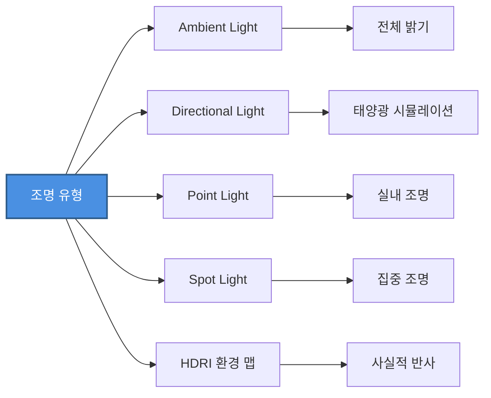

### 🖼️ 후처리 효과

- **SSAO** (Screen Space Ambient Occlusion) - 깊이감 향상
- **Bloom** - 빛 번짐 효과
- **Tone Mapping** - HDR to LDR 변환
- **Anti-aliasing** - 계단 현상 제거

## 8.5 BIM 전용 렌더링 최적화

### ⚡ 성능 최적화 기법

### 1. LOD (Level of Detail) 관리

```
거리에 따른 디테일 조절:
- 가까운 객체: 높은 폴리곤 수
- 중간 거리: 중간 폴리곤 수  
- 먼 객체: 낮은 폴리곤 수
```

### 2. Culling (컬링)

- **Frustum Culling** - 카메라 시야 밖 객체 제외
- **Occlusion Culling** - 가려진 객체 제외
- **Distance Culling** - 너무 먼 객체 제외

### 3. Instancing (인스턴싱)

```jsx
// 반복되는 객체 (창문, 기둥 등) 효율적 렌더링
const geometry = new THREE.BoxGeometry();
const instancedMesh = new THREE.InstancedMesh(
    geometry, 
    material, 
    1000  // 1000개 인스턴스
);
```

### 4. Batching (배칭)

- 유사한 재질의 객체를 하나의 드로우 콜로 통합
- GPU 호출 횟수 감소

### 📊 성능 지표

| 기법 | 객체 수 | FPS | 메모리 |
| --- | --- | --- | --- |
| 기본 | 10,000 | 15 | 2GB |
| + LOD | 10,000 | 30 | 1.5GB |
| + Culling | 10,000 | 45 | 1GB |
| + Instancing | 100,000 | 60 | 800MB |

## 8.6 Autodesk Viewer

### 🔷 Forge Viewer / APS Viewer

**Autodesk Platform Services (APS)**의 핵심 구성 요소로, 웹 기반 3D 뷰어를 제공합니다.

### 주요 기능:

- **70개 이상 파일 형식** 지원
- **Model Derivative API** 통한 변환
- **확장 시스템** - 커스텀 기능 추가
- **측정, 단면, 폭발뷰** 등 BIM 도구

### 기술 스택:

```jsx
// Autodesk Viewer 초기화
Autodesk.Viewing.Initializer(options, function() {
    const viewer = new Autodesk.Viewing.GuiViewer3D(
        document.getElementById('viewer')
    );
    viewer.start();
    
    // 모델 로드
    Autodesk.Viewing.Document.load(
        documentId,
        onDocumentLoadSuccess,
        onDocumentLoadFailure
    );
});
```

**참고 자료:**

- [GitHub - bim-viewer](https://github.com/egghunters/bim-viewer)
- [xeokit SDK](https://xeokit.io/)
- [Three.js - IFCLoader](https://threejs.org/examples/webgl_loader_ifc.html)
- [opensourceBIM - WebGL-threeJS](https://github.com/opensourcebim/WebGL-threeJS)

---

# 9️⃣ 3D 기술 연관성

## 9.1 게임 엔진 활용

### 🎮 Unreal Engine

### BIM 시각화에서의 강점

**Unreal Engine**은 건축 및 디자인 시각화에 혁명을 일으켰으며, **빠른 렌더링**과 **직관적인 라이트, 머티리얼, 지오메트리 설정**을 제공합니다.

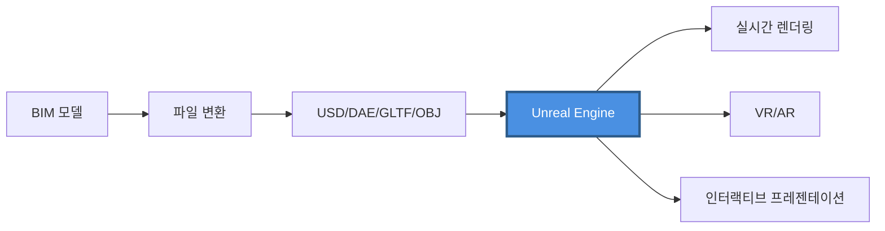

### 주요 기능

### 1. 사실적 렌더링

- **Lumen** - 실시간 글로벌 일루미네이션
- **Nanite** - 가상화된 지오메트리 (수백만 폴리곤 처리)
- **Ray Tracing** - 실시간 레이 트레이싱

### 2. VR/AR 지원

- HTC Vive, Oculus Rift 등 VR 헤드셋 연동
- **몰입형 건축 체험**
- 실시간 설계 리뷰

### 3. BIM 통합

- Revit, ArchiCAD 등 CAD/BIM 데이터 import
- **Datasmith** - BIM to Unreal 변환 도구
- IFC 파일 지원

### Twinmotion

**Twinmotion**은 Unreal Engine 기반의 건축 시각화 전용 도구입니다.

```
┌────────────────────────────────────┐
│  Twinmotion 주요 특징              │
├────────────────────────────────────┤
│                                    │
│  ✓ 실시간 3D 렌더링                │
│  ✓ VR 시뮬레이션                   │
│  ✓ CAD/BIM 프로그램 호환           │
│    - Revit                         │
│    - ArchiCAD                      │
│    - SketchUp                      │
│    - Rhino                         │
│  ✓ 원클릭 동기화                   │
│  ✓ 계절/시간/날씨 시뮬레이션       │
│  ✓ 고품질 에셋 라이브러리          │
│                                    │
└────────────────────────────────────┘
```

### 🎯 Unity

### BIM 시각화 특징

Unity는 **시각적 표현을 넘어** BIM 데이터를 **Reflect**를 통해 연결하여 인터랙티브 프레젠테이션을 만들 수 있으며, **완전히 진화하는 디지털 트윈**으로 작동할 수 있습니다.

### Unity Reflect

**Unity Reflect**는 BIM 데이터를 Unity로 실시간 스트리밍하는 솔루션입니다.

### 주요 기능:

- **실시간 동기화** - Revit 변경사항 즉시 반영
- **협업 기능** - 팀원과 실시간 리뷰
- **AR/VR 지원** - 모바일 및 헤드셋
- **클라우드 기반** - 어디서나 접근

### VR 개발 환경

**Unity vs Unreal Engine VR 비교**

| 항목 | Unity | Unreal Engine |
| --- | --- | --- |
| **학습 곡선** | 낮음 (C#) | 중간 (Blueprint/C++) |
| **그래픽 품질** | 좋음 | 매우 우수 |
| **VR 템플릿** | 풍부 | 풍부 |
| **모바일 VR** | 우수 | 좋음 |
| **커뮤니티** | 매우 큼 | 큼 |
| **BIM 통합** | Unity Reflect | Datasmith |

### 게임 엔진 선택 기준

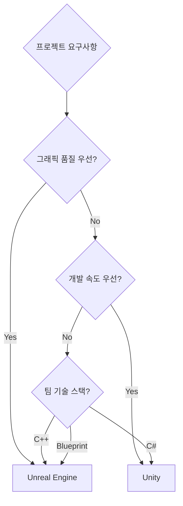

## 9.2 디지털 트윈 기술

### 🔄 BIM과 디지털 트윈의 관계

### 핵심 차이

**BIM (Building Information Modeling)**:

- 건물을 만드는 **디지털 정보 모델**
- 설계 및 시공 단계 중심
- 정적 데이터

**디지털 트윈 (Digital Twin)**:

- BIM을 기반으로 **실제 운영을 반영**한 확장된 환경
- 유지관리 및 운영 단계 중심
- **실시간 동기화 데이터**

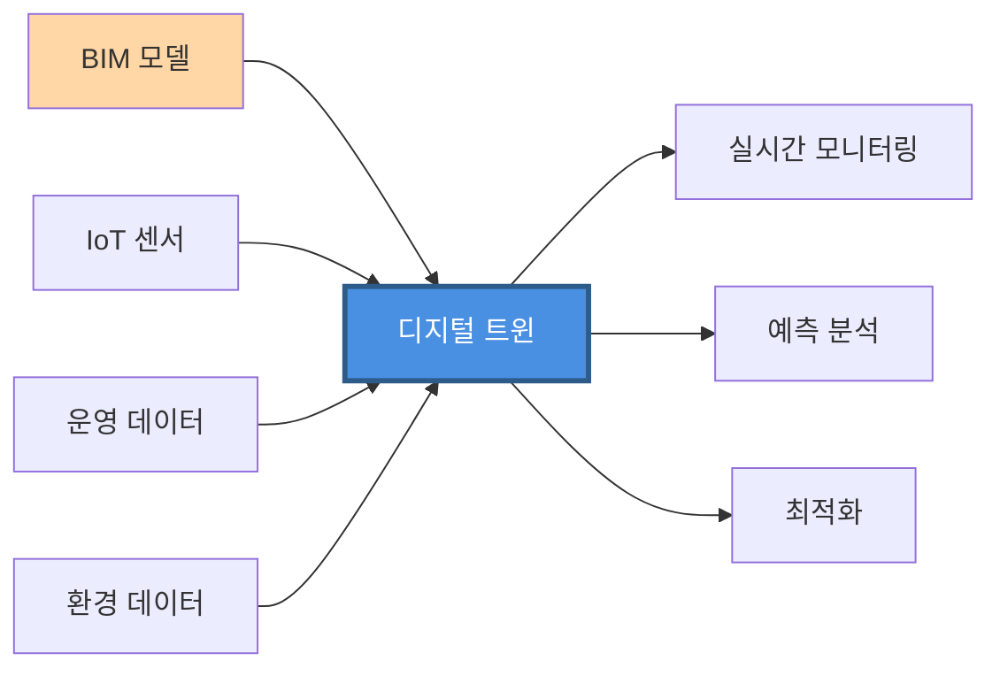

### 🏙️ 메타버스와의 구분

**메타버스**:

- 현실과 비슷한 3차원 가상 세계
- **아바타**로 다양한 경험
- 엔터테인먼트 및 소셜 중심

**디지털 트윈**:

- 현실과 가상 세계가 **실시간 동기화**
- **같은 데이터를 반영**하는 것이 핵심
- 산업 및 운영 효율화 중심

### 🏗️ BIM 기반 디지털 트윈 활용

### 생애주기 관리

디지털 트윈과 결합한 BIM을 통해 **초기 설계부터 폐기에 이르기까지 건물 수명주기 관리**가 가능합니다.

### 실시간 분석

```
┌─────────────────────────────────────┐
│  디지털 트윈 데이터 통합            │
├─────────────────────────────────────┤
│                                     │
│  물리적 건물 상태                   │
│       +                             │
│  환경 센서 데이터                   │
│       +                             │
│  설비 작동 정보                     │
│       ↓                             │
│  실시간 건물 상태 분석              │
│       ↓                             │
│  예측 및 최적화                     │
│                                     │
└─────────────────────────────────────┘
```

### AI 연동

- **IoT 센서**: 온도·습도·사용량 측정
- **AI 알고리즘**: 고장 예측 및 유지관리 일정 자동 생성
- **최적화**: 에너지 효율, 공간 활용

### 🌐 국내외 적용 사례

### 해외 사례

**싱가포르**:

- 국가 인프라 사업에 BIM 의무화
- 디지털 트윈 구축 적용
- **Virtual Singapore** 프로젝트

**영국**:

- **Crossrail** 프로젝트 - 철도 인프라
- BIM Level 2 의무화
- 디지털 트윈 기반 운영

**핀란드**:

- 병원 및 공공 시설
- 생애주기 관리

### 국내 사례

**철도 인프라**:

- BIM을 기반으로 **전분야에 걸쳐 데이터 통합**
- 모든 시설물의 생애주기 디지털 정보 연계
- 실시간 모니터링 및 유지관리

## 9.3 GIS와 BIM 통합

### 🗺️ GIS + BIM = 스마트시티

### 통합의 필요성

최근 **스마트시티와 디지털 트윈 기술**의 발전으로 **GIS와 BIM의 융합**이 도시 계획 및 건설 프로젝트에서 중요한 역할을 하고 있습니다.

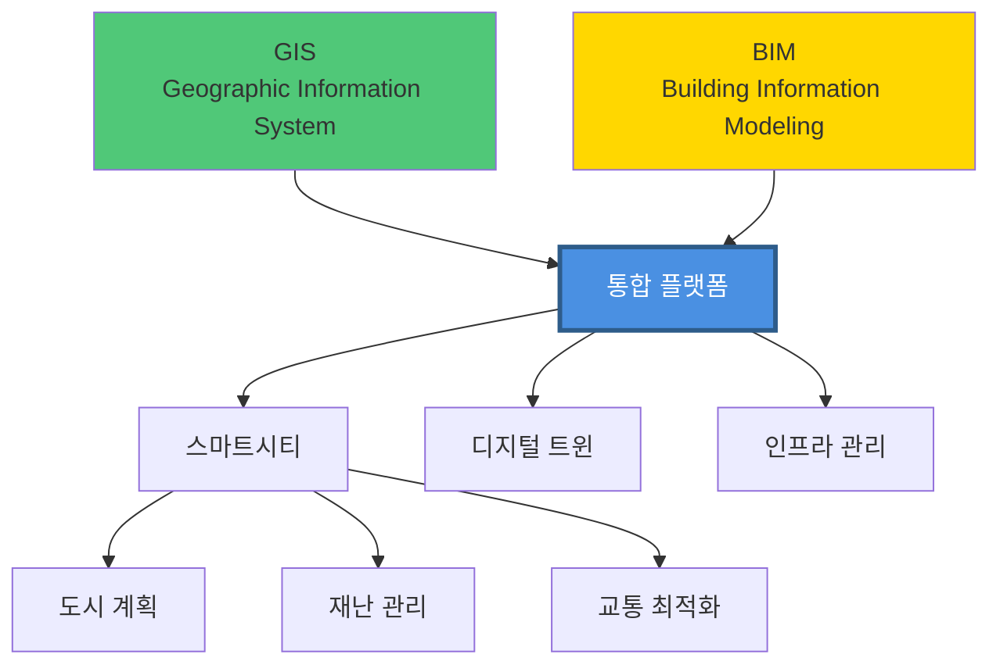

### GIS와 BIM의 차이

| 항목 | GIS | BIM |
| --- | --- | --- |
| **스케일** | 도시/지역 | 건물/시설 |
| **정밀도** | 낮음 (m 단위) | 높음 (mm 단위) |
| **데이터** | 지리 정보, 지형 | 건축 상세, 설비 |
| **좌표계** | 지리 좌표계 | 로컬 좌표계 |
| **활용** | 공간 분석, 도시 계획 | 설계, 시공, 운영 |

### 통합 기술

### 1. 좌표계 변환

```
BIM 로컬 좌표 → 지리 좌표계 (WGS84, UTM 등)
```

### 2. 데이터 포맷

- **IFC to CityGML** 변환
- **GeoJSON + IFC** 통합
- **3D Tiles** 스트리밍

### 3. 통합 플랫폼

- **ESRI ArcGIS** + BIM
- **FME (Feature Manipulation Engine)** - 데이터 변환
- **BIM/GIS 통합 플랫폼** (한국건설기술연구원)

### 🌆 스마트시티 구현

### All4Land 사례 (한국)

**All4Land**는 한국의 선도적인 지리공간 서비스 제공업체로, **2014년부터 BIM과 GIS 데이터를 결합한 3D 디지털 모델**을 구축해 왔습니다.

### 통합 효과

**정보 일관성**:

- 통합된 정보로 원활한 정보 교환
- 설계 단계부터 도시 계획까지 연계

**효율적 관리**:

- 시설물의 공간정보 활용
- 다양한 시설물 관리 및 분석 지원

**의사결정 지원**:

- 스마트한 결정 (Smarter Decisions)
- 설계 최적화 (Optimized Designs)
- 프로젝트 승인 가속화 (Accelerated Approvals)
- 비용 절감 (Reduced Costs)

### 과제

**상호운용성 확보**:

- 표준화 필요
- 프로젝트 통합 관리 방안
- IFC와 CityGML 간 매핑

## 9.4 AI 및 머신러닝 통합

### 🤖 AI 기반 BIM 활용

### 1. 건설 자동화 기술

**2025년 목표**:

- 3차원 설계기술인 BIM을 활용하여 **가상으로 시공(VR)**
- **3D 프린터**로 공장에서 건설 부재 모듈화 제작
- **AI 탑재 건설 로봇**에 의한 조립·시공

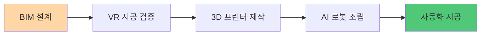

### 2. 설계 자동화 및 최적화

**BIM 데이터 기반**:

- 빅데이터 구축
- 인공지능 학습
- **설계 자동화** 활용

**AI 기반 최적화**:

- 에너지 효율
- 구조 안전성
- 시공성
- **최적의 설계안 도출**

### 3. AI 어시스턴트 통합

**CAD/BIM 도구 통합**:

- AI Assistant 모듈
- **이미지 생성형 AI** - 다양한 건물 내부 대안 생성
- **이미지 인식 LLM** - 가구 특징 추출

```jsx
// AI 기반 설계 제안 예시
const aiAssistant = new BimAiAssistant();

// 공간 요구사항 입력
const requirements = {
    roomType: "오피스",
    area: 100,  // m²
    capacity: 20,
    style: "모던"
};

// AI 설계 제안 생성
const proposals = await aiAssistant.generateDesign(requirements);
```

### 4. 지능형 BIM 프로세스

**자동 인식 및 생성**:

- AI가 **구조·공간 요소를 자동으로 인식**
- **3D BIM 모델 자동 생성**
- 충돌 검토
- 시공 가능성/법규 준수 분석 자동화

**공정 최적화**:

- AI가 **공정 데이터를 학습**
- 최적의 일정 제안
- 장비 배치 추천

### 5. 시설물 모니터링

**스마트 모니터링**:

- **드론** - 외부 점검
- **IoT 센서** - 실시간 데이터 수집
- **마이크로 로봇** - 좁은 공간 검사
- **AI 분석** - 이상 신속 검지 및 대응

### 🔮 미래 전망

**생성형 AI**:

- 설계 옵션 자동 생성
- 스타일 transfer
- 최적화 알고리즘

**예측 유지보수**:

- 고장 예측 모델
- 수명 예측
- 최적 교체 시기

**로봇 공학**:

- 자동 시공 로봇
- 3D 프린팅 건설
- 무인 건설 현장

**참고 자료:**

- [Leica Geosystems - South Korean smart cities combine BIM and GIS](https://leica-geosystems.com/en-us/case-studies/reality-capture/south-korean-smart-cities-combine-3d-digital-models-and-gis-and-bim)
- [ESRI Korea - BIM 및 GIS 통합](https://www.esrikr.com/ko-kr/industries/aec/overview/gis-and-bim)
- [KISTI - BIM/GIS 플랫폼 기반 건설공간정보 통합운영 기술 개발](https://scienceon.kisti.re.kr/srch/selectPORSrchReport.do?cn=TRKO201700000962)
- [DataDrivenConstruction.io](http://DataDrivenConstruction.io) [- Revit and IFC in Unreal Engine, Unity](https://datadrivenconstruction.io/2024/04/revit-and-ifc-in-unreal-engine-unity-oculus-visualization-rendering-metaverse-game-design/)
- [건축 BIM과 인공지능(AI)의 융합](https://bimgovinfo.com/건축-bim과-인공지능ai의-융합-그리고-미래)

---

# 🔟 미래 전망 및 결론

## 10.1 시장 성장 전망

### 📊 글로벌 시장 규모

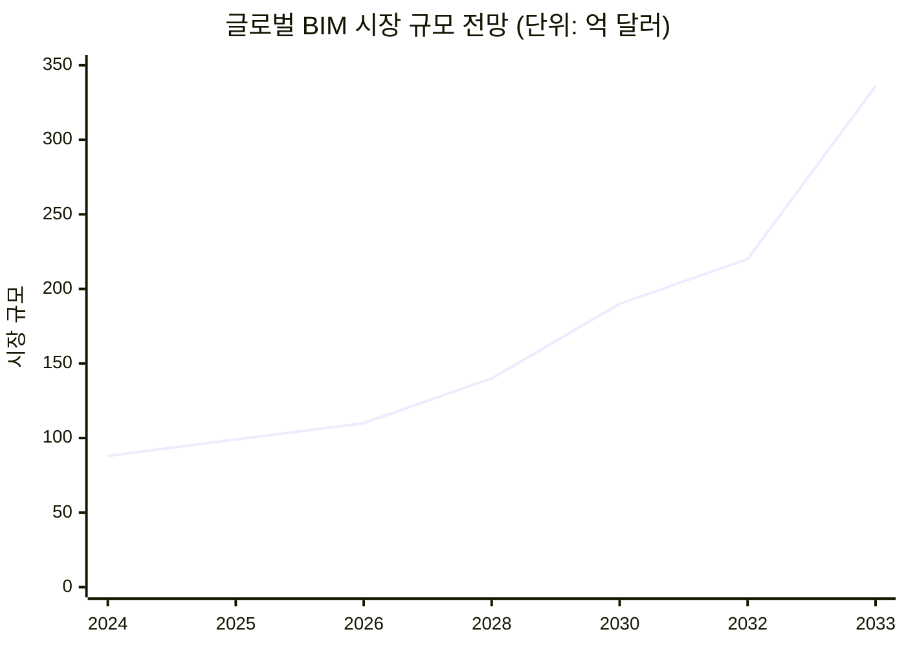

**시장 데이터**:

- **2024년**: 88.4억 달러
- **2025년**: 99.3억 달러
- **2030년**: 190.4억 달러 (CAGR 13.9%)
- **2033년**: 336.4억 달러 (건축 BIM, CAGR 17.37%)

### 🌍 지역별 성장

**북미**:

- 성숙한 시장
- 높은 기술 도입률
- 정부 의무화 정책

**유럽**:

- BIM Level 2 의무화 (영국 주도)
- 디지털 트윈 적극 도입

**아시아-태평양**:

- **가장 빠른 성장** 지역
- 중국, 일본, 한국 주도
- 대규모 인프라 투자

## 10.2 기술 발전 방향

### 🚀 핵심 트렌드

### 1. 클라우드 기반 협업

**특징**:

- 실시간 협업
- 어디서나 접근
- 자동 동기화
- 버전 관리

**주요 플랫폼**:

- Autodesk Construction Cloud (ACC)
- Trimble Connect
- 코빔 (CO-BIM)

### 2. AI 및 머신러닝 통합

**응용 분야**:

- 설계 자동화
- 충돌 검토 자동화
- 공정 최적화
- 예측 유지보수
- 비용 예측

**효과**:

- 설계 시간 단축 30-50%
- 오류 감소 70%
- 비용 예측 정확도 95%+

### 3. 디지털 트윈 확산

**적용 범위**:

- 개별 건물 → 캠퍼스 → 도시
- 신축 → 기존 건물 리트로핏
- 건축 → 인프라 → 도시 전체

**통합 기술**:

- IoT 센서
- 실시간 데이터 분석
- AI 기반 예측
- VR/AR 시각화

### 4. Reality Capture (현실 캡처)

**기술**:

- **LiDAR 스캐닝** - 정밀 측량
- **포토그래메트리** - 사진 기반 3D 모델링
- **드론 촬영** - 대규모 현장 데이터 수집

**활용**:

- As-Built 모델 생성
- 진행 상황 추적
- 품질 관리

### 5. 모바일 및 현장 기술

**트렌드**:

- 태블릿 기반 현장 관리
- AR 글래스를 통한 설계 오버레이
- 모바일 BIM 뷰어
- 오프라인 작업 지원

### 6. 오픈 BIM 표준화

**발전 방향**:

- IFC 4.3 확산 (인프라 지원)
- BCF API 표준화
- openBIM 워크플로우 확대
- 벤더 종속성 감소

## 10.3 산업별 적용 확대

### 🏗️ 건축

**현재**:

- 설계 및 시공 단계 BIM 활용
- 간섭 체크 및 물량 산출

**미래**:

- **생성형 AI 설계**
- **로봇 시공**
- **모듈화 건설**

### 🌉 인프라

**현재**:

- 도로, 철도, 교량 BIM 적용
- IFC 4.3 인프라 지원

**미래**:

- **스마트 인프라 관리**
- **디지털 트윈 기반 유지보수**
- **자율주행 차량 연계**

### 🏭 플랜트

**현재**:

- 복잡한 설비 모델링
- P&ID와 3D 모델 연계

**미래**:

- **AI 기반 설계 최적화**
- **디지털 트윈 운영**
- **예측 유지보수**

### 🏙️ 스마트시티

**현재**:

- BIM/GIS 통합 시범 사업
- 3D 도시 모델

**미래**:

- **도시 전체 디지털 트윈**
- **실시간 도시 관리**
- **AI 기반 도시 최적화**

## 10.4 한국의 BIM 미래

### 📅 정부 로드맵

**2025년**:

- BIM 설계 기반 구축
- 전면 디지털 엔지니어링 체계

**2030년**:

- BIM 선진화 완성
- 건설산업 디지털 혁신·전환
- 모든 공공공사 BIM 적용
- 300억원 미만 공사까지 의무화

### 🎯 과제 및 해결 방향

### 과제

1. **전문 인력 부족**
    - BIM 교육 확대
    - 자격증 제도 개선
    - 대학 교육과정 강화
2. **표준 및 가이드라인**
    - 한국형 BIM 표준 확립
    - 상세 가이드라인 제공
    - 라이브러리 구축
3. **비용 및 인식**
    - 장기적 관점의 투자 인식
    - 성공 사례 확산
    - 정부 지원 확대
4. **중소기업 적용**
    - 진입 장벽 낮추기
    - 클라우드 기반 저비용 솔루션
    - 컨설팅 지원

### 해결 방향

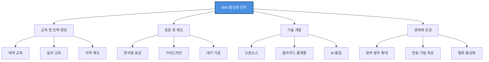

## 10.5 결론

### 💡 핵심 요약

### BIM의 본질

BIM은 단순한 3D 모델링 도구가 아니라, **건설 산업의 디지털 전환을 이끄는 핵심 플랫폼**입니다. 설계부터 시공, 유지관리, 폐기까지 **전체 생애주기**에 걸쳐 정보를 통합 관리하며, 모든 이해관계자 간의 **협업을 혁신**합니다.

### 기술적 진화

```
BIM 1.0 (2000년대)
  → 3D 모델링
  
BIM 2.0 (2010년대)
  → 4D/5D/6D 통합
  → 클라우드 협업
  
BIM 3.0 (2020년대)
  → AI 통합
  → 디지털 트윈
  → IoT 연계
  
BIM 4.0 (2030년대)
  → 완전 자동화
  → 로봇 시공
  → 스마트시티 통합
```

### 산업적 영향

**효율성**:

- 공기 단축 12-50%
- 공사비 절감 5-9%
- 설계 오류 감소 70%+

**협업**:

- 실시간 정보 공유
- 의사결정 속도 향상
- 분쟁 감소

**지속가능성**:

- 에너지 효율 분석
- 탄소 배출 관리
- 생애주기 최적화

### 🌟 미래 비전

### 2030년의 건설 현장

**설계 단계**:

- AI가 최적 설계안 자동 생성
- VR에서 실시간 리뷰 및 승인
- 클라우드에서 전 세계 협업

**시공 단계**:

- 로봇과 AI가 주도하는 자동화 시공
- 드론과 센서로 실시간 진행 상황 추적
- 디지털 트윈에서 시뮬레이션 검증

**운영 단계**:

- IoT 센서와 AI로 예측 유지보수
- 에너지 사용 실시간 최적화
- 거주자 경험 개인화

### 스마트시티 통합

도시 전체가 하나의 거대한 BIM-GIS 디지털 트윈으로 연결되어:

- 교통 흐름 최적화
- 에너지 그리드 관리
- 재난 대응 시뮬레이션
- 도시 계획 시나리오 분석

### 🚀 마지막 메시지

BIM은 더 이상 **선택이 아닌 필수**입니다. 건설 산업이 다른 산업처럼 **디지털화**되고 **자동화**되는 과정에서, BIM은 그 중심에 있습니다. 

**도전과제**:

- 학습 곡선
- 초기 비용
- 문화적 변화

**그러나 장기적 이점**:

- 효율성 향상
- 품질 개선
- 지속가능성
- 경쟁력 확보

이러한 이점은 도전과제를 훨씬 능가합니다.

**한국 건설 산업**이 글로벌 경쟁력을 유지하고 디지털 시대를 선도하기 위해서는, **지금 BIM에 투자**하고 **미래를 준비**해야 합니다.

---

## 📚 참고 문헌 종합

### 공식 문서 및 표준

- [buildingSMART - IFC 표준](https://www.buildingsmart.or.kr/)
- [ISO 19650 - BIM 정보 관리](https://www.iso.org/)

### 정부 및 공공 기관

- [국토교통부 - BIM 기반 건설산업 디지털 전환 로드맵](https://resource.midasuser.com/ko/blog/bridge/bim_roadmap)
- [한국건설기술연구원 - BIM 정보공유](https://www.kict.re.kr/)

### 글로벌 기업

- [Autodesk - BIM 솔루션](https://www.autodesk.com/kr/solutions/bim)
- [Bentley Systems](https://www.bentley.com/)
- [Trimble](https://www.trimble.com/)

### 기술 리소스

- [xeokit SDK](https://xeokit.io/)
- [Three.js](https://threejs.org/)
- [LearnRevitAPI](https://www.learnrevitapi.com/)

### 시장 조사

- [Fortune Business Insights - BIM Market](https://www.fortunebusinessinsights.com/building-information-modelling-software-market-102986)
- [GII Korea - BIM 시장 전망](https://www.giikorea.co.kr/)

---

# 🏁 문서 정보

**작성일**: 2026년 1월 12일

**작성자**: Claude (Anthropic)

**버전**: 1.0

**문서 유형**: 기술 분석 리포트

**페이지 설정**: 세리프 폰트, 작은 텍스트, 전체 너비

---

**#BIM #BuildingInformationModeling #스마트건설 #디지털트윈 #건설기술 #AEC #건축 #토목 #인프라 #디지털전환**