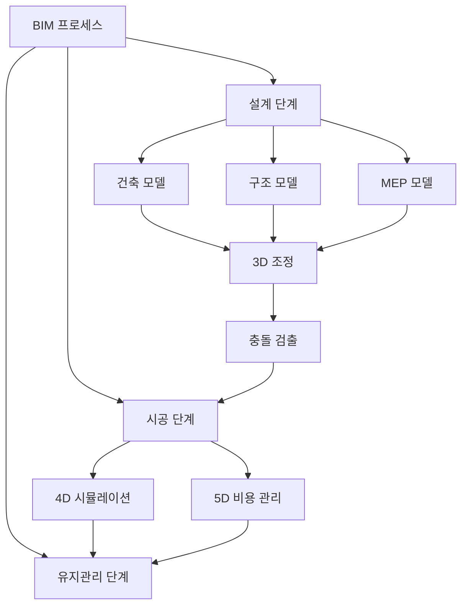
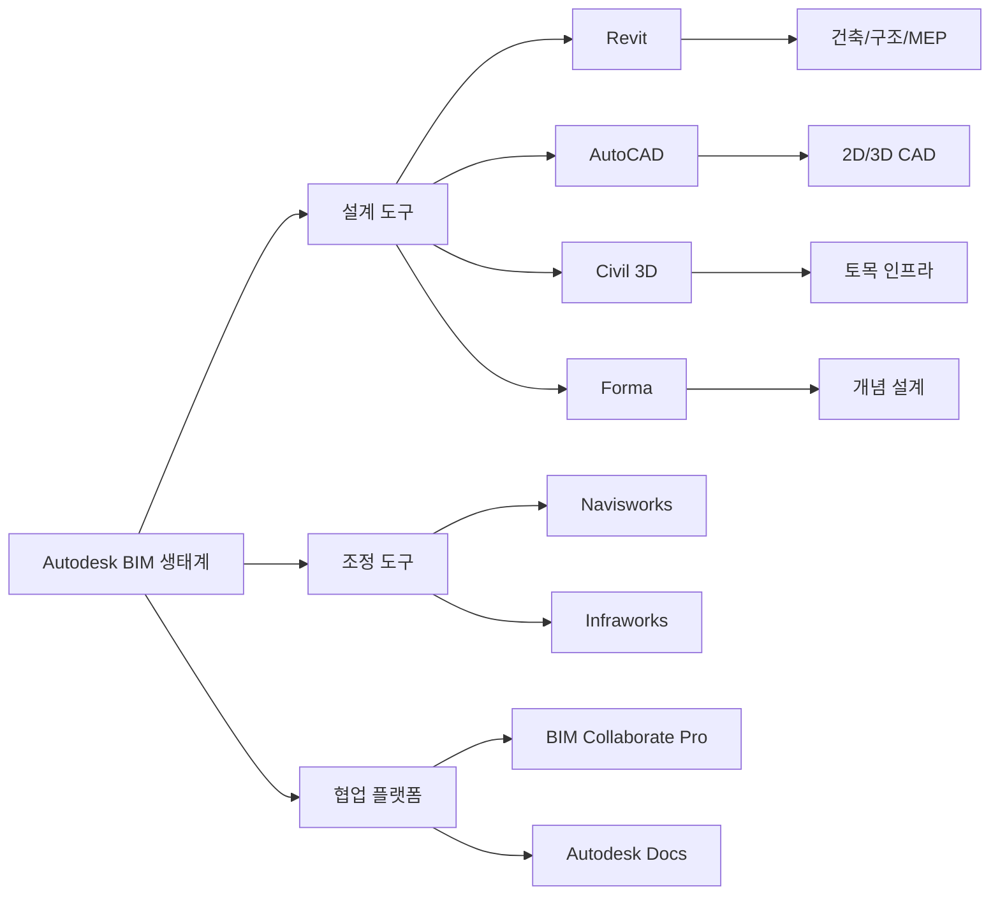
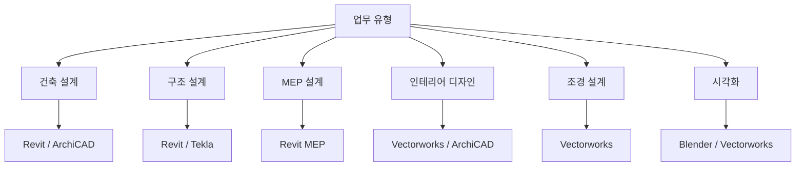

# BIM 편집툴 종합 비교 분석

건축 및 건설 산업에서 BIM(Building Information Modeling)은 이제 필수적인 기술로 자리잡았습니다. 이 글에서는 BIM 분야에서 가장 널리 사용되는 주요 편집툴들을 상세히 비교하고, 각 툴의 특징과 활용 방법을 소개합니다.

## 목차

1. BIM이란?
2. Autodesk Revit - 통합 BIM 플랫폼의 강자
3. Autodesk Navisworks - 프로젝트 조정 및 검토 전문
4. Autodesk 제품군 전체 라인업
5. 3D CAD vs BIM의 차이점
6. Blender BIM - 오픈소스의 가능성
7. 주요 BIM 소프트웨어 비교 (ArchiCAD, Vectorworks)
8. 한국 건설 현장의 BIM 도입 현황
9. 툴 선택 가이드

---

# 1. BIM(Building Information Modeling)이란?

BIM은 단순한 3D 모델링을 넘어선 개념입니다. 건물의 기하학적 형상뿐만 아니라 실제 건물 구성요소의 본질적인 관계, 메타데이터, 동작까지 포함하는 종합 정보 모델입니다.

## BIM과 3D CAD의 근본적 차이

**3D CAD**: 건물의 기하학적 표현에 집중

- 벽, 창문, 문 등을 단순히 3D 형상으로 표현
- 시각적 표현이 주목적

**BIM**: 기하학을 넘어선 정보 통합

- 각 구성요소의 관계와 메타데이터 포함
- 보증 기간, 내구성, 제조사, 가격, 담당자 등의 정보 저장
- 시공 일정, 비용 등 4D, 5D 정보 통합 가능



---

# 2. Autodesk Revit - 통합 BIM 플랫폼의 강자


Revit Logo

Revit은 Autodesk에서 개발한 BIM 소프트웨어로, 건축가가 생각하는 방식으로 작동하는 강력한 도구입니다.

## 주요 기능

### 2026년 신기능

**성능 향상**

- 3D 및 2D 뷰 탐색 속도 대폭 향상
- 가속화된 뷰의 활성화 시간 평균 27% 개선

**벽 및 구조 기능 개선**

- 복합 구조의 코어 레이어 요구 사항이 더 이상 필수가 아님
- 코어 레이어 삭제 및 레이어 이동이 더 쉬워짐
- 벽 세그먼트를 사용한 마감 건축 벽 작성 가능

**지형 및 부지 설계**

- 지형 솔리드 도구 향상
- 구획 업데이트 및 정확도 개선

**문서화 기능**

- 시트 모음을 매개변수와 일람표의 카테고리로 사용 가능
- 뷰 참조에서 공유 매개변수 레이블 포함 기능
- 인스턴스 기반 참조 레이블 개선

**MEP 기능**

- 제어 가능하고 사용자화 가능한 도체 및 케이블 구성
- 회로 배선 요구사항 관리 개선

**클라우드 협업**

- Autodesk Construction Cloud 통합 강화
- 프로젝트 파일의 하위 폴더로 바로 이동 가능

## BIM 워크플로우

Revit은 중앙 3D 모델을 사용하여 설계 프로세스를 간소화합니다. 한 뷰에서 변경한 내용이 모든 뷰와 인쇄 가능한 시트에 자동으로 업데이트됩니다.

## 장점

✅ **통합성**: 건축, 구조, MEP를 하나의 플랫폼에서 통합

✅ **자동 업데이트**: 모델 변경 시 모든 도면 자동 반영

✅ **협업**: 다분야 팀 협업에 최적화

✅ **대형 프로젝트**: 복잡한 상업/공공 시설에 강점

## 단점

❌ **비용**: 구독 비용이 높은 편

❌ **학습 곡선**: 초보자에게는 복잡할 수 있음

❌ **시스템 요구사항**: 고성능 하드웨어 필요

## 적합한 사용 사례

- 건축 + 구조 + MEP 통합 설계
- 대형 복합 건물 프로젝트
- 공공/상업 시설
- 다분야 협업이 필수적인 프로젝트

---

# 3. Autodesk Navisworks - 프로젝트 조정 및 검토 전문


Navisworks

Navisworks는 BIM 프로젝트의 검토 및 조정을 위한 전문 소프트웨어입니다. 설계 및 건설 데이터를 단일 통합 모델로 통합하여 건설 전에 문제를 발견하고 해결합니다.

## Revit과의 차이점

```
┌─────────────────────────────────────────────────────────┐
│                    BIM 워크플로우                          │
├─────────────────────┬───────────────────────────────────┤
│   REVIT (설계 생성)   │   NAVISWORKS (검토 및 조정)        │
├─────────────────────┼───────────────────────────────────┤
│ • 3D 모델 설계       │ • 모델 통합 및 검토                 │
│ • 상세 모델링        │ • 충돌 감지 (Clash Detection)      │
│ • 도면 작성         │ • 4D/5D 시뮬레이션                 │
│ • MEP 시스템 설계   │ • 일정 및 비용 시각화               │
│ • 협업 설계         │ • 다양한 파일 형식 통합             │
└─────────────────────┴───────────────────────────────────┘
```

## 주요 기능

### Clash Detection (충돌 감지)

- Navisworks Manage 전용 기능
- Clash Detective를 통한 3D 프로젝트 모델의 간섭 검사
- Autodesk Construction Cloud, Revit과 통합
- 현장 재작업 비용 절감

### 4D/5D 시뮬레이션

- 프로젝트 모델에 시간 데이터 통합 (4D)
- 비용 데이터 통합 (5D)
- 일정 및 예산 관리 개선

### 다양한 파일 형식 지원

- Revit, AutoCAD, MicroStation 등 통합
- 하나의 종합 모델로 결합
- 50개 이상의 CAD 파일 형식 지원

## 버전 종류

**Navisworks Simulate**

- 기본 검토 및 시각화 기능
- 4D 시뮬레이션

**Navisworks Manage**

- Simulate의 모든 기능 포함
- Clash Detection 기능 추가
- 고급 조정 도구

## 가격 정보

- 월 $140부터 시작 (미국 기준)
- 30일 무료 체험판 제공
- 한국 가격은 공식 대리점 문의 필요

## 상호 보완적 관계

> "Revit은 설계 생성에 관한 것이고, Navisworks는 설계가 프로젝트의 전체 그림에 맞는지 확인하는 것입니다."
> 

Revit과 Navisworks는 경쟁 관계가 아니라 **보완적 도구**입니다:

1. Revit에서 상세 모델 생성
2. Navisworks로 모델 통합 및 충돌 검사
3. 문제 발견 및 해결
4. Revit에서 수정
5. 반복

---

# 4. Autodesk 제품군 전체 라인업

Autodesk는 설계자, 엔지니어, 시공업체를 위한 포괄적인 BIM 및 CAD 도구를 제공합니다.

## 건축 분야

### Revit

- 빌딩 정보 모델링의 핵심 도구
- 건축, 구조, MEP 통합

### AutoCAD

- 2D 및 3D CAD의 표준
- AI 자동화 기능 (2026)
- 7가지 전문 툴셋 포함
- 데스크톱, 웹, 모바일 지원

### Forma

- AI 기반 사전 설계 도구
- 개념 설계를 위한 클라우드 소프트웨어
- 2026년 신제품

## 토목 인프라

### Civil 3D

- 토목용 BIM 소프트웨어
- 도로, 교량, 상하수도 설계

### Infraworks

- 개념 설계 및 시각화
- 대규모 인프라 프로젝트

### Navisworks

- 프로젝트 검토 및 조정
- 간섭 체크

## 협업 플랫폼

### BIM Collaborate Pro

- 클라우드 기반 협업 플랫폼
- Revit, Civil 3D, AutoCAD Plant 3D 통합
- 언제 어디서나 협업 가능

### Autodesk Docs

- 클라우드 기반 디지털 자산 관리
- 문서 버전 관리
- 팀 협업 지원



---

# 5. 3D CAD vs BIM - 무엇이 다른가?

많은 사람들이 3D CAD와 BIM을 혼동하지만, 두 접근 방식에는 근본적인 차이가 있습니다.

## 비교표

| 구분 | 3D CAD | BIM |
| --- | --- | --- |
| **목적** | 시각적 표현 | 정보 통합 관리 |
| **데이터** | 기하학적 형상 | 형상 + 메타데이터 + 관계 |
| **협업** | 파일 기반 | 중앙 모델 기반 |
| **변경 관리** | 수동 업데이트 필요 | 자동 업데이트 |
| **시공 정보** | 제한적 | 4D/5D 통합 가능 |
| **생애주기** | 설계 단계 | 설계-시공-유지관리 전체 |

## 주요 BIM 소프트웨어 (2026)

### Autodesk Revit

- 건축, 구조, MEP 통합 BIM 플랫폼
- 전 세계적으로 가장 널리 사용

### Graphisoft ArchiCAD

- 초기부터 BIM 개념을 구현
- 건축 설계 중심
- 직관적인 인터페이스

### Vectorworks Architect

- BIM + CAD + 그래픽 디자인 결합
- 설계 자유도와 시각화 표현력
- Mac OS 호환성 우수

### GstarCAD 2026

- 새로운 경쟁자로 부상
- 대규모 도면 즉시 열기
- 핵심 작업 속도 20% 향상
- 도면 열기 속도 40% 향상

## 선택 가이드

**통합적이고 복합 설계**

→ Revit

**설계 속도와 디자인 중심**

→ ArchiCAD

**CAD에서 BIM으로 전환**

→ Vectorworks

**디자인/그래픽 중심 작업**

→ Vectorworks

---

# 6. Blender BIM - 오픈소스의 가능성


Blender Logo

Blender는 원래 3D 모델링 및 애니메이션 소프트웨어로 유명하지만, BlenderBIM(현재 Bonsai) 애드온을 통해 본격적인 BIM 도구로 진화했습니다.

## BlenderBIM/Bonsai 애드온

### 주요 기능

**IFC 표준 지원**

- 네이티브 IFC 파일 생성 및 편집
- IfcOpenShell 기반의 강력한 백엔드
- 산업 표준 OpenBIM 워크플로우

**BIM 데이터 관리**

- 보증 기간, 내구성, 가격 등 메타데이터 저장
- 프로젝트 리더, 제조사, 문서 정보 관리
- Global ID 및 조건 정보 추적

**4D BIM 애니메이션**

- 시공 일정 시뮬레이션
- Primavera 데이터 가져오기
- IFC Work Schedules 도구

**2D 도면 생성**

- 평면도, 단면도, 입면도 생성
- 시트 작성 기능
- Revit/ArchiCAD만큼 완벽하지는 않지만 주요 기능 제공

**Excel 연동**

- 데이터 가져오기/내보내기
- 일람표 생성

## 건축 시각화 워크플로우

```
1. 모델링 (Modeling)
   ↓
   벽, 문, 창문 등 건축 요소 생성
   
2. 텍스처링 (Texturing)
   ↓
   재료 질감 추가 (나무, 유리, 콘크리트 등)
   
3. 조명 (Lighting)
   ↓
   자연광 및 인공 조명 설정
   
4. 렌더링 (Rendering)
   ↓
   최종 이미지/애니메이션 생성
```

## 렌더링 엔진

### Cycles

- 경로 추적 기반
- 글로벌 조명
- CPU 및 GPU 렌더링
- 포토리얼리스틱 품질

### Eevee

- 실시간 렌더링
- 즉각적인 피드백
- 빠른 디자인 반복

## 장점

✅ **무료 오픈소스**: 라이선스 비용 없음

✅ **강력한 시각화**: V-Ray 수준의 렌더링

✅ **통합 워크플로우**: 모델링부터 렌더링까지 하나의 소프트웨어

✅ **커뮤니티**: 활발한 개발자 및 사용자 커뮤니티

✅ **유연성**: Python 스크립팅으로 기능 확장

## 단점

❌ **BIM 기능 제한**: Revit/ArchiCAD 대비 부족

❌ **학습 곡선**: 독특한 UI/UX

❌ **산업 표준 아님**: 협업 시 호환성 문제 가능

❌ **기술 지원**: 상업용 소프트웨어 대비 제한적

## 적합한 사용 사례

- 건축 시각화 및 렌더링
- 콘셉트 디자인 및 매스 스터디
- 오픈소스 BIM 워크플로우 실험
- 소규모 프로젝트
- 비용 절감이 중요한 프로젝트

## 오픈소스 BIM 생태계

```
FreeCAD (설계)
    ↓
Blender + BlenderBIM (모델링 및 BIM)
    ↓
IfcOpenShell (IFC 처리)
    ↓
시뮬레이션 및 분석
```

---

# 7. 주요 BIM 소프트웨어 심층 비교

## ArchiCAD vs Revit vs Vectorworks

### Autodesk Revit

**강점**

- 건축 + 구조 + MEP 완벽 통합
- 모델 변경 시 자동 도면 업데이트
- 대형 프로젝트 및 다분야 협업에 최적
- 가장 넓은 사용자 기반 및 자료

**약점**

- 높은 구독 비용
- 가파른 학습 곡선
- 초보자에게 복잡

**추천 대상**

- 대형 설계사무소
- 복합 건물 프로젝트
- 공공/상업 시설
- 다분야 통합 필요 시

---

### Graphisoft ArchiCAD

**강점**

- Revit보다 직관적인 인터페이스
- 빠른 설계 속도
- 디자인 중심 작업에 효율적
- 대규모 파라메트릭 객체 라이브러리
- 맞춤 객체 생성 용이

**약점**

- 통합 렌더링이 다른 옵션보다 느림
- 문서화 기능이 Revit만큼 강력하지 않음
- MEP 기능 제한적

**추천 대상**

- 주택 및 소규모 건축
- 인테리어 디자인
- 리모델링 프로젝트
- 소형 설계사무소
- 설계 속도 우선 시

---

### Vectorworks Architect

**강점**

- Mac OS 완벽 호환
- 직관적인 인터페이스
- BIM + CAD + 그래픽 디자인 통합
- 고품질 렌더링
- 조경, 인테리어, 엔터테인먼트 디자인 지원
- 가장 많은 가져오기/내보내기 옵션
- Sketchup, Revit, Rhino, Photoshop 직접 연결

**약점**

- BIM 기능이 Revit/ArchiCAD보다 제한적
- 대규모 프로젝트에서 성능 저하
- 지연 및 속도 문제
- 3D 모델링 도구 개선 필요

**추천 대상**

- CAD에서 BIM으로 전환 시
- 디자인/그래픽 중심 작업
- 인테리어 및 조경 디자인
- 전시 공간 디자인
- Mac 사용자

## 비교 매트릭스

| 기준 | Revit | ArchiCAD | Vectorworks | Blender BIM |
| --- | --- | --- | --- | --- |
| **가격** | $$$ | $$$ | $$ | 무료 |
| **학습 난이도** | 어려움 | 중간 | 중간 | 어려움 |
| **BIM 기능** | ⭐⭐⭐⭐⭐ | ⭐⭐⭐⭐ | ⭐⭐⭐ | ⭐⭐ |
| **렌더링** | ⭐⭐⭐ | ⭐⭐ | ⭐⭐⭐⭐ | ⭐⭐⭐⭐⭐ |
| **협업** | ⭐⭐⭐⭐⭐ | ⭐⭐⭐⭐ | ⭐⭐⭐ | ⭐⭐ |
| **MEP** | ⭐⭐⭐⭐⭐ | ⭐⭐⭐ | ⭐⭐ | ⭐ |
| **문서화** | ⭐⭐⭐⭐⭐ | ⭐⭐⭐⭐ | ⭐⭐⭐⭐ | ⭐⭐ |
| **사용자 기반** | 매우 큼 | 큼 | 중간 | 소규모 |

---

# 8. 한국 건설 현장의 BIM 도입 현황

## 국내 BIM 시장 동향

한국의 BIM 기술은 빠르게 발전하고 있지만, 다른 국가들보다 정착하기 어려운 점도 있습니다. 이는 국내 건설 산업의 극심한 시간 및 비용 절감 요구 때문입니다.

## 주요 건설사 BIM 활용

### 현대건설

현대건설은 현재까지 약 **70여 개**가 넘는 국내외 건축 및 토목 프로젝트에 BIM 기술을 적용하여 업계 최고의 기술력을 쌓아가고 있습니다.

### BIM 통합정보관리실

대형 건설사들은 건설 현장에 **디지털 통합정보관리실(BIM)**을 운영하며, 이를 통해:

- 설계 오류 사전 검토
- 시공 일정 시뮬레이션
- 현장 안전 관리
- 품질 관리 강화

## 국내에서 사용되는 BIM 소프트웨어

### 건축용 (구조물)

- **Revit** (Autodesk) - 가장 널리 사용
- **ARCHICAD** (Graphisoft)
- **Tekla Structures**
- **OpenBuilding**
- **Allplan**

### 토목용

- **Civil 3D** (Autodesk)
- **OpenRoads**
- **OpenRail**
- **MIDAS CIM**
- **Infraworks**

### 검토용 (Review)

- **Navisworks** - 가장 널리 사용되는 간섭 체크 도구
- **Navigator**
- **Solibri**
- **BIMsight**
- **Synchro 4D**

## 국내 BIM 도입의 과제

**시간 압박**

- 빠른 설계 및 시공 일정
- BIM 모델링 시간 확보 어려움

**비용 압박**

- 초기 투자 비용 부담
- 소프트웨어 라이선스 비용

**인력 양성**

- BIM 전문 인력 부족
- 기존 인력의 재교육 필요

**협업 문화**

- 분절된 설계-시공 프로세스
- 정보 공유 문화 미흡

---

# 9. BIM 툴 선택 가이드

프로젝트와 조직에 맞는 BIM 툴을 선택하는 것이 성공의 핵심입니다.

## 프로젝트 규모별 추천

### 소규모 프로젝트 (주택, 소형 상업 건물)

**1순위: ArchiCAD**

- 빠른 설계 속도
- 직관적인 인터페이스
- 적당한 BIM 기능

**2순위: Vectorworks**

- 디자인 자유도
- 좋은 렌더링
- CAD 친화적

**3순위: Blender BIM**

- 무료
- 뛰어난 시각화
- 소규모 팀에 적합

---

### 중대형 프로젝트 (상업 시설, 공공 건물)

**1순위: Revit**

- 완벽한 BIM 기능
- 다분야 통합
- 협업 도구

**2순위: ArchiCAD**

- 건축 설계 중심
- 효율적인 워크플로우

**검토 도구: Navisworks (필수)**

- 충돌 감지
- 4D/5D 시뮬레이션

---

### 인프라/토목 프로젝트

**필수: Civil 3D**

- 토목 BIM 표준
- 도로, 교량, 상하수도

**보조: Infraworks**

- 개념 설계
- 대규모 시각화

**검토: Navisworks**

- 프로젝트 조정

---

## 예산별 추천

### 제한된 예산

**Blender BIM (무료)**

- 완전 무료 오픈소스
- IFC 지원
- 뛰어난 렌더링

**단계적 도입**

- AutoCAD LT로 시작
- 점진적으로 Revit으로 전환

---

### 충분한 예산

**Revit + Navisworks**

- 완벽한 BIM 워크플로우
- 설계부터 시공까지

**Autodesk Construction Cloud**

- 클라우드 협업
- 프로젝트 관리

---

## 팀 규모별 추천

### 1-5인 소규모 팀

- **ArchiCAD** 또는 **Vectorworks**
- 학습 곡선이 완만
- 빠른 ROI

### 10인 이상 중대형 팀

- **Revit**
- 표준화된 워크플로우
- 협업 도구 필수

---

## 업무 유형별 추천



---

# 결론

## 핵심 요약

**Autodesk Revit**

- BIM의 산업 표준
- 대형 복합 프로젝트에 최적
- 높은 비용과 학습 곡선

**Autodesk Navisworks**

- 프로젝트 조정 및 검토 전문
- Revit과 완벽한 조합
- 충돌 감지의 표준 도구

**ArchiCAD**

- 직관적이고 빠른 설계
- 소중형 건축 프로젝트
- 설계 중심 워크플로우

**Vectorworks**

- 디자인과 BIM의 균형
- 조경, 인테리어, 전시
- Mac 사용자 친화적

**Blender BIM**

- 무료 오픈소스
- 뛰어난 시각화
- 실험적 BIM 워크플로우

## 최종 조언

각 툴의 장단점을 정확히 파악하고, 프로젝트와 조직에 맞춰 선택한다면 BIM 기반 설계와 시공, 유지관리의 효율성, 품질, 협업력 모두를 동시에 향상시킬 수 있습니다.

**성공적인 BIM 도입을 위한 3가지 원칙**

1. **명확한 목표 설정**: 무엇을 위해 BIM을 도입하는가?
2. **단계적 접근**: 한 번에 모든 것을 바꾸지 말고 점진적으로
3. **지속적인 교육**: 소프트웨어는 도구일 뿐, 사람이 핵심

---

# 참고 자료

## Navisworks 관련

- [Navisworks 공식 사이트](https://www.autodesk.com/products/navisworks/overview)
- [Navisworks 가격 정보](https://www.trustradius.com/products/navisworks/pricing)
- [Navisworks vs Revit 비교](https://www.novatr.com/blog/revit-vs-navisworks-in-bim-mep-workflows)
- [Navisworks 한국어 가이드](https://letsbim.co.kr/navisworks/)

## Revit 관련

- [Revit 2026 새로운 기능](https://help.autodesk.com/cloudhelp/2026/KOR/Revit-WhatsNew/files/GUID-C81929D7-02CB-4BF7-A637-9B98EC9EB38B.htm)
- [Revit 공식 사이트](https://www.autodesk.com/products/revit/overview)
- [Revit 기능 소개](https://www.autodesk.com/products/revit/features)

## Autodesk 제품군

- [Autodesk BIM 솔루션](https://www.autodesk.com/kr/solutions/bim)
- [Autodesk Docs 2026](https://www.autodesk.com/products/autodesk-docs/features)
- [Autodesk 건축 솔루션](https://www.autodesk.com/industry/architecture)

## BIM 소프트웨어 비교

- [최고의 BIM 소프트웨어 5가지 비교](https://min-terior.com/entry/최고의-BIM-소프트웨어-5가지-Revit-ArchiCAD-Tekla-Structures-Vectorworks-Allplan-비교)
- [건축 BIM 주요 소프트웨어 비교](https://bimgovinfo.com/건축-bim-주요-소프트웨어-비교)
- [3D CAD와 BIM의 차이점](https://www.archline.co.kr/slide/site/faq/3dcad_bim_difference)
- [GstarCAD 2026 신제품](https://blog.gstarcad.net/gstarsoft-unveils-new-product-lineup-and-global-strategy-setting-a-new-benchmark-for-industrial-software/)

## Blender BIM

- [Bonsai BIM 공식 사이트](https://bonsaibim.org/)
- [BlenderBIM Addon](https://extensions.blender.org/add-ons/bonsai/)
- [Blender 건축 시각화 가이드](https://www.foxrenderfarm.com/news/blender-for-architectural-visualization/)
- [BlenderBIM 6가지 이유](https://milichikhinrv.medium.com/6-reasons-to-think-about-blenderbim-add-on-a61344f4bda7)

## 한국 BIM 현황

- [BIM 시장 및 솔루션 동향](https://buildingsmart.or.kr/thebim/pdf/The_BIM_20/TB_20_38_한국건설기술연구원(강태욱).pdf)
- [현대건설 BIM 뉴스룸](https://www.hdec.kr/kr/newsroom/news_view.aspx?NewsSeq=731&NewsType=BRAND&NewsListType=news_list)
- [BIM 나무위키](https://namu.wiki/w/BIM)

## BIM 워크플로우

- [BIM 워크플로우 다이어그램](https://www.researchgate.net/figure/Diagram-of-a-Building-Information-Modeling-BIM-work-process_fig1_339097240)
- [BIM 실행 계획 가이드](https://psu.pb.unizin.org/bimprojectexecutionplanning/chapter/process/)
- [BIM 360 워크플로우](https://www.scribd.com/document/657595412/BIM-360-Workflow-Diagrams)

---

**작성일**: 2026년 1월 20일

**작성자**: Claude AI

**버전**: 1.0