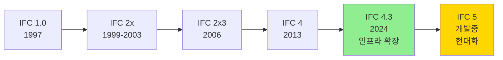
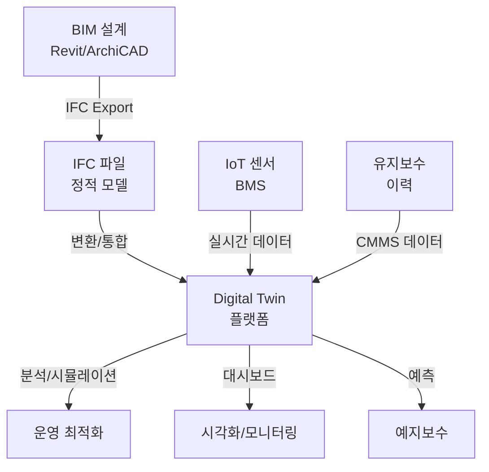

# 🗂️ IFC (Industry Foundation Classes) 포맷 완전 가이드

## 📚 목차
1. [개요 및 소개](#개요-및-소개)
2. [역사와 발전 과정](#역사와-발전-과정)
3. [필요성](#필요성)
4. [장점](#장점)
5. [단점](#단점)
6. [IFC 스키마 구조](#ifc-스키마-구조)
7. [기하학 표현 방식](#기하학-표현-방식)
8. [파일 포맷](#파일-포맷)
9. [MVD (Model View Definition)](#mvd-model-view-definition)
10. [사용법](#사용법)
11. [IfcOpenShell 프로그래밍](#ifcopenshell-프로그래밍)
12. [인프라 확장 (IFC 4.3)](#인프라-확장-ifc-43)
13. [Digital Twin 연계](#digital-twin-연계)
14. [미래 전망 (IFC 5)](#미래-전망-ifc-5)
15. [출처](#출처)

---

## 🧭 개요 및 소개

### 🧭 IFC란 무엇인가

**IFC (Industry Foundation Classes)**는 건축, 토목, 설비 관리 산업에서 사용되는 개방형 국제 표준 데이터 포맷입니다. BIM(Building Information Modeling) 소프트웨어 간의 상호 운용성을 가능하게 하는 중립적인 파일 포맷으로, 건물과 인프라 시설의 디지털 정보를 표준화된 방식으로 교환할 수 있게 합니다.

IFC는 단순한 기하학적 형상뿐만 아니라 건물의 의미론적(semantic) 정보까지 포함합니다. 예를 들어, 벽(Wall)은 단순한 3D 박스가 아니라 "벽"이라는 객체로 인식되며, 해당 벽의 재질, 내화 등급, 구조적 특성 등의 속성 정보를 함께 저장합니다.

### 🔹 buildingSMART와의 관계

IFC는 **buildingSMART International** (이전 명칭: International Alliance for Interoperability, IAI)에서 개발하고 유지 관리하는 표준입니다. buildingSMART는 건설 산업의 디지털 전환을 위해 OpenBIM 표준을 개발하는 국제 비영리 단체입니다.

buildingSMART는 IFC뿐만 아니라 다음과 같은 표준들도 관리합니다:

- **IDS (Information Delivery Specification)**: 정보 교환 요구사항 정의
- **BCF (BIM Collaboration Format)**: BIM 협업을 위한 이슈 관리 포맷
- **bSDD (buildingSMART Data Dictionary)**: 건설 데이터 사전

```
┌─────────────────────────────────────────────────────────┐
│            buildingSMART International                   │
│                                                           │
│  ┌──────────┐  ┌──────────┐  ┌──────────┐  ┌─────────┐ │
│  │   IFC    │  │   IDS    │  │   BCF    │  │  bSDD   │ │
│  │  표준    │  │  정보    │  │  협업    │  │  데이터 │ │
│  │  스키마  │  │  명세    │  │  포맷    │  │  사전   │ │
│  └──────────┘  └──────────┘  └──────────┘  └─────────┘ │
│                                                           │
│         OpenBIM 생태계의 핵심 표준들                      │
└─────────────────────────────────────────────────────────┘
```

### 🔹 최신 버전 현황

#### ▫️ IFC 4.3 (현재 공식 버전)

**IFC 4.3.2.0 (IFC4X3_ADD2)**는 2024년에 ISO 16739-1:2024 표준으로 승인된 최신 공식 버전입니다. 이 버전은 기존 건축 분야뿐만 아니라 **인프라 도메인**으로 확장되었습니다:

- **Railways (철도)**: 선로, 신호 시스템, 전력 공급
- **Roads (도로)**: 도로 구조, 배수 시스템
- **Ports & Waterways (항만 및 수로)**: 해양 구조물
- **Bridges (교량)**: 교량 구조 요소

IFC 4.3은 1,300개 이상의 엔티티와 타입, 750개 이상의 속성 세트로 구성된 2,500개 이상의 속성을 포함하고 있습니다.

#### ▫️ IFC 5 (개발 중)

**IFC 5**는 현재 buildingSMART에서 개발 중인 차세대 IFC 표준입니다. IFC 5의 주요 목표는:

1. **언어 독립적 스키마**: STEP(ISO 10303-21)에 대한 의존성 제거
2. **API 중심 접근**: RESTful API 및 웹 서비스 통합
3. **IDS 및 BCF 통합**: 정보 교환 명세 및 협업 포맷의 깊은 통합
4. **코어 구조 단순화**: IFC의 핵심 구조를 명확하게 재정의
5. **현대화 및 표준화**: 새로운 유스케이스 지원

중요한 점은 IFC 5가 새로운 도메인을 추가하지 않으며, IFC 4.3과 동일한 의미론적 범위를 유지한다는 것입니다. IFC 5는 기술적 현대화에 초점을 맞추고 있습니다.



### 🔹 ISO 16739 국제 표준

IFC는 2013년부터 **ISO 16739**로 등록된 공식 국제 표준입니다. 현재는 ISO 16739-1:2024로 업데이트되었습니다.

ISO 표준으로 등록된 것은 다음과 같은 의미를 갖습니다:

- **공식 인증**: 국제적으로 인정받는 표준
- **장기 안정성**: 표준의 지속적인 유지 관리 보장
- **공공 조달**: 많은 국가에서 공공 프로젝트에 IFC 사용 의무화
- **법적 효력**: 계약 및 법적 문서에서 참조 가능

---

## 🕰️ 역사와 발전 과정

### 🔹 1994년: 시작

IFC의 역사는 1994년 **Autodesk**가 통합 애플리케이션 개발을 지원하는 C++ 클래스 세트 개발에 대해 자문할 산업 컨소시엄을 구성하면서 시작되었습니다.

**창립 멤버**:
- Autodesk
- AT&T
- Archibus
- Carrier Corporation
- Hellmuth, Obata & Kassabaum (HOK)
- Honeywell
- Jaros, Baum & Bolles (JB&B)
- Lawrence Berkeley Laboratory
- Primavera Systems
- Softdesk
- Timberline Software Corp
- Tishman Research Corp

### 🔹 1995년: IAI 결성

1995년 9월, **Industry Alliance for Interoperability (IAI)**가 모든 이해관계자에게 개방되면서 공식적으로 출범했습니다. 이 조직은 비영리 산업 주도 단체로 재구성되었으며, 건축, 엔지니어링, 건설(AEC) 분야의 중립적인 제품 모델로서 IFC를 발행하는 것을 목표로 삼았습니다.

### 🔹 1997년: IFC 1.0 발표

**1997년 1월**, 최초의 IFC 표준인 **IFC 1.0**이 발표되었습니다. 이는 BIM 소프트웨어 간의 상호 운용성을 위한 첫 번째 공식 시도였습니다.

같은 해 조직 이름이 **International Alliance for Interoperability**로 변경되어 국제적인 성격을 강조했습니다.

### 🔹 1999-2006년: IFC 2x 시리즈

- **IFC 2.0 (1999)**: 두 번째 주요 릴리스
- **IFC 2x (2000)**: 첫 번째 마이너 업데이트
- **IFC 2x2 (2003)**: 개선 및 확장
- **IFC 2x3 (2006)**: 가장 널리 사용된 버전, 많은 소프트웨어에서 장기간 지원

IFC 2x3은 건축 분야에서 가장 안정적이고 널리 채택된 버전으로, 10년 이상 업계 표준으로 자리 잡았습니다.

### 🔹 2005-2006년: buildingSMART로 재브랜딩

2005년에 IAI는 **buildingSMART**로 이름을 변경했습니다. 이 변화는 단순한 기술적 상호 운용성을 넘어 **비즈니스 가치와 OpenBIM**을 강조하는 방향 전환을 의미했습니다.

재브랜딩의 주요 목적:
- 통합 설계 및 시공 프로세스의 비즈니스 이점 강조
- OpenBIM 철학의 확산
- 글로벌 네트워크 구축 (각국 지부 설립)

### 🔹 2013년: IFC 4 및 ISO 표준화

**IFC 4 (IFC4 ADD2 TC1)**가 출시되었으며, 이는 **ISO 16739-1:2018**로 국제 표준에 등록되었습니다. IFC 4는 다음과 같은 주요 개선 사항을 포함했습니다:

- 더욱 명확한 데이터 스키마
- 기하학적 표현 개선
- 구조 해석 도메인 추가
- MEP (기계, 전기, 배관) 도메인 강화

### 🔹 2018-2024년: IFC 4.x 시리즈

- **IFC 4.1 (2018)**: 마이너 개선
- **IFC 4.2 (2019)**: 추가 기능
- **IFC 4.3 (2024)**: 인프라 도메인 대폭 확장

### 🔭 현재와 미래: IFC 5 개발

2021년부터 buildingSMART는 IFC 5 개발을 시작했습니다. [GitHub 저장소](https://github.com/buildingSMART/IFC5-development)에서 활발한 개발이 진행 중이며, STEP 의존성 제거와 API 중심 아키텍처 구축에 초점을 맞추고 있습니다.

```
1994 ──┬─→ Autodesk 컨소시엄 구성
       │
1995 ──┼─→ IAI 설립
       │
1997 ──┼─→ IFC 1.0 발표
       │   (International Alliance for Interoperability)
       │
2000s ─┼─→ IFC 2x 시리즈 개발
       │   (2x, 2x2, 2x3)
       │
2005 ──┼─→ buildingSMART로 재브랜딩
       │   (OpenBIM 철학 강조)
       │
2013 ──┼─→ IFC 4 + ISO 16739 표준화
       │
2024 ──┼─→ IFC 4.3 (인프라 확장)
       │   ISO 16739-1:2024
       │
2026 ──┴─→ IFC 5 개발 진행 중
           (언어 독립, API 중심)
```

---

## 🎯 필요성

### 🏢 BIM 데이터 상호 운용성 문제

현대 건설 프로젝트는 수십 개의 서로 다른 소프트웨어를 사용합니다:

- **설계**: Revit, ArchiCAD, Vectorworks, Allplan
- **구조**: Tekla Structures, ETABS, SAP2000, RFEM
- **MEP**: Revit MEP, MagiCAD, DDS-CAD
- **시공**: Navisworks, Synchro, Solibri
- **시설 관리**: FM:Systems, Archibus, Planon

각 소프트웨어는 고유한 네이티브 파일 포맷을 사용합니다:
- Autodesk Revit: .rvt
- Graphisoft ArchiCAD: .pln
- Trimble Tekla: .db1
- Bentley MicroStation: .dgn

이러한 **벤더 종속(vendor lock-in)** 상황에서 프로젝트 참여자 간의 데이터 교환은 매우 어렵습니다. 각 소프트웨어가 다른 소프트웨어의 네이티브 포맷을 지원해야 한다면, n개의 소프트웨어가 있을 때 **n(n-1)개의 변환기**가 필요합니다.

```
문제: 네이티브 포맷 직접 교환
┌──────────┐    ┌──────────┐
│  Revit   │◄──►│ ArchiCAD │
│  (.rvt)  │    │  (.pln)  │
└─────┬────┘    └────┬─────┘
      │◄────────────►│
      │              │
      ▼              ▼
┌──────────┐    ┌──────────┐
│  Tekla   │◄──►│  RFEM    │
│  (.db1)  │    │  (.rf5)  │
└──────────┘    └──────────┘

필요한 변환기 수: n(n-1) = 4×3 = 12개

해결책: IFC 중립 포맷 사용
┌──────────┐    ┌──────────┐
│  Revit   │    │ ArchiCAD │
│  (.rvt)  │    │  (.pln)  │
└─────┬────┘    └────┬─────┘
      │              │
      └───►┌────┐◄───┘
           │IFC │
      ┌───►│.ifc│◄───┐
      │    └────┘    │
      │              │
┌─────┴────┐    ┌────┴─────┐
│  Tekla   │    │  RFEM    │
│  (.db1)  │    │  (.rf5)  │
└──────────┘    └──────────┘

필요한 변환기 수: 2n = 2×4 = 8개
```

### 🏢 OpenBIM의 중요성

**OpenBIM**은 buildingSMART가 주도하는 이니셔티브로, 개방형 표준과 상호 운용성을 촉진합니다.

OpenBIM의 핵심 원칙:

1. **중립성**: 특정 벤더에 종속되지 않음
2. **투명성**: 데이터 구조가 공개되고 문서화됨
3. **협업**: 모든 이해관계자가 동일한 데이터에 접근
4. **지속가능성**: 장기적인 데이터 보존 가능
5. **품질**: 표준화된 검증 프로세스

OpenBIM vs ClosedBIM:

| 구분 | OpenBIM (IFC) | ClosedBIM (네이티브) |
|------|---------------|----------------------|
| **표준** | 국제 표준 (ISO 16739) | 벤더 고유 포맷 |
| **접근성** | 모든 소프트웨어에서 지원 가능 | 특정 소프트웨어만 완벽 지원 |
| **데이터 소유권** | 프로젝트 팀 소유 | 소프트웨어 벤더 의존 |
| **장기 보존** | 50년+ 보장 | 벤더 정책에 따라 변동 |
| **협업** | 모든 참여자 평등 | 동일 소프트웨어 사용자 우대 |
| **비용** | 소프트웨어 선택 자유 | 벤더 종속 비용 증가 |

### 🎯 산업 표준화 필요성

#### ▫️ 공공 프로젝트 의무화

많은 국가에서 공공 건설 프로젝트에 IFC 사용을 의무화하고 있습니다:

**유럽**:
- **영국**: 2016년부터 모든 공공 프로젝트에 BIM Level 2 (IFC 포함) 의무화
- **프랑스**: 2017년부터 공공 건물에 BIM/IFC 요구
- **독일**: 2020년부터 연방 인프라 프로젝트에 BIM/IFC 의무화
- **네덜란드**: Rijksvastgoedbedrijf (정부 건물 관리) IFC 표준 사용
- **노르웨이**: Statsbygg (국가 건설청) 2010년부터 IFC 요구

**아시아**:
- **싱가포르**: 2013년부터 BCA (Building and Construction Authority) IFC 제출 요구
- **대한민국**: 2016년부터 일정 규모 이상 공공 건축물 BIM 의무화
- **홍콩**: 정부 프로젝트에 IFC 제출 요구

**북미**:
- **미국**: GSA (General Services Administration) BIM 가이드에 IFC 포함
- **캐나다**: 여러 주정부에서 IFC 채택

#### ▫️ 법적 요구사항 증가

- **건축 인허가**: 일부 도시에서 디지털 인허가 제출 시 IFC 요구
- **준공 문서**: as-built 문서를 IFC로 제출
- **시설물 유지관리**: 공공 시설의 운영 단계 데이터를 IFC로 관리
- **에너지 시뮬레이션**: 건물 에너지 성능 계산 시 IFC 데이터 활용

### 🔹 장기 데이터 보존

건물과 인프라는 **50-100년 이상**의 생애주기를 가집니다. 이 기간 동안 소프트웨어는 여러 번 바뀔 수 있습니다.

**문제 사례**:
- 1990년대 AutoCAD R12로 작성된 도면을 현재 열 수 없는 경우
- 2000년대 특정 BIM 소프트웨어 버전의 파일이 최신 버전에서 호환되지 않는 경우
- 소프트웨어 회사가 폐업하거나 제품 지원을 중단하는 경우

**IFC의 해결책**:
- **개방형 표준**: 포맷 스펙이 공개되어 누구나 리더/라이터 개발 가능
- **ISO 표준**: 국제 표준 기구의 유지 관리 보장
- **텍스트 기반**: IFC-SPF는 텍스트 파일로 장기 보존에 유리
- **버전 호환성**: 구 버전 IFC 파일도 최신 소프트웨어에서 읽기 가능

```
건물 생애주기 vs 소프트웨어 생명주기

건물 생애주기: 50-100년
├─ 설계 (1-2년)
├─ 시공 (2-5년)
└─ 운영/유지관리 (40-95년)

소프트웨어 생명주기: 5-10년
├─ Ver 1.0 ─ Ver 2.0 ─ Ver 3.0 ... Ver N
│
├─ 포맷 변경, 호환성 이슈
├─ 회사 인수합병, 제품 단종
└─ 새로운 소프트웨어로 대체

IFC 생명주기: 무기한
└─ ISO 표준으로 영구 보존
    개방형 스펙으로 언제든 접근 가능
```

---

## ✅ 장점

### 🔹 1. 소프트웨어 독립성

IFC의 가장 큰 장점은 **벤더 중립성(vendor neutrality)**입니다. 프로젝트 팀은 각자에게 가장 적합한 소프트웨어를 자유롭게 선택할 수 있습니다.

**이점**:
- **비용 절감**: 특정 벤더에 종속되지 않아 라이선스 협상력 확보
- **전문성 활용**: 각 분야별로 최적의 도구 선택 가능
- **유연성**: 프로젝트 중간에도 소프트웨어 변경 가능
- **경쟁 촉진**: 소프트웨어 벤더 간 경쟁으로 품질 향상

**실무 예시**:
```
프로젝트 팀 구성:
- 건축 설계사: ArchiCAD (Mac 환경 선호)
- 구조 설계사: Tekla Structures (철골 전문)
- MEP 설계사: Revit MEP (BIM 360 협업)
- 시공사: Navisworks (4D/5D 시뮬레이션)
- 발주처: Solibri (품질 검증)

→ 모두 IFC로 데이터 교환하여 원활한 협업
```

### 🔹 2. 의미론적 정보 보존

IFC는 단순한 기하학적 형상이 아닌 **의미론적(semantic) 정보**를 포함합니다.

**기하학 vs 의미론**:

```
DWG/DXF (기하학만):
- 벽 = 선(Line) + 해치(Hatch) 집합
- 정보 손실: 무엇이 벽인지 알 수 없음
- 자동화 불가: 벽 목록 추출 불가능

IFC (의미론 포함):
- 벽 = IfcWall 객체
  - 기하학: 3D 형상
  - 속성: 내화등급, 구조/비구조, 재질
  - 관계: 어떤 층에 속하는지, 어떤 공간을 구분하는지
- 자동화 가능: 벽 목록, 물량 산출, 법규 검토
```

**포함되는 의미론적 정보**:

1. **객체 타입**: IfcWall, IfcColumn, IfcBeam, IfcDoor, IfcWindow 등
2. **속성(Properties)**: 내화등급, 음향 성능, 열전도율, 하중지지 여부
3. **관계(Relationships)**:
   - 공간 관계: 어떤 층(IfcBuildingStorey)에 속하는가
   - 포함 관계: 문이 벽에 포함됨(IfcRelVoidsElement)
   - 연결 관계: 파이프가 장비에 연결됨(IfcRelConnects)
4. **분류(Classification)**: Uniclass, OmniClass, MasterFormat 등
5. **재질(Material)**: 콘크리트, 강재, 목재 등의 세부 정보

### 🔹 3. 국제 표준 (ISO 16739)

**ISO 표준의 의미**:

- **공신력**: 국제 표준화 기구(ISO)의 공식 인증
- **지속성**: 표준의 장기적인 유지 관리 보장
- **법적 효력**: 계약서 및 법률 문서에서 명확한 참조 가능
- **글로벌 호환**: 전 세계 어디서나 동일한 표준 적용

**ISO 16739 구성**:
- **ISO 16739-1**: 데이터 스키마 (IFC 엔티티 정의)
- **ISO 16739-2**: 미래 확장을 위한 예약

### 🔹 4. 확장 가능성

IFC는 **확장 가능한(extensible)** 구조를 가지고 있습니다.

**확장 메커니즘**:

1. **Property Sets (Pset)**: 사용자 정의 속성 추가 가능
   ```
   Pset_WallCommon (표준):
   - IsExternal (외벽 여부)
   - LoadBearing (내력벽 여부)
   - FireRating (내화등급)

   Pset_CompanySpecific (사용자 정의):
   - CostCode (비용 코드)
   - Manufacturer (제조사)
   - WarrantyPeriod (보증 기간)
   ```

2. **IfcProxy**: 표준에 정의되지 않은 객체를 임시로 표현

3. **Classification**: 외부 분류 체계 연결
   - Uniclass 2015 (영국)
   - OmniClass (북미)
   - CoClass (스웨덴)

4. **bSDD 연동**: buildingSMART Data Dictionary와 연결하여 국가별/프로젝트별 속성 정의

### 🗂️ 5. 다양한 파일 포맷 지원

IFC는 용도에 따라 여러 인코딩 포맷을 지원합니다:

| 포맷 | 확장자 | 특징 | 용도 |
|------|--------|------|------|
| **IFC-SPF** | .ifc | 텍스트, 컴팩트 | 일반적인 교환 (기본) |
| **IFC-XML** | .ifcxml | XML 구조, 읽기 쉬움 | 웹 애플리케이션, 파싱 |
| **IFC-ZIP** | .ifczip | 압축된 SPF | 파일 크기 감소 (50-80%) |
| **ifcJSON** | .ifcjson | JSON 형식, 웹 친화적 | 웹 앱, JavaScript |
| **ifcHDF5** | .hdf5 | 바이너리, 고성능 | 대규모 모델, 빅데이터 |

### 🔹 6. 풍부한 생태계

**IFC 생태계**:

- **소프트웨어 지원**: 150개 이상의 BIM 소프트웨어가 IFC 지원
- **오픈소스 도구**:
  - IfcOpenShell: Python 라이브러리
  - BlenderBIM: 무료 BIM 저작 도구
  - xBIM Toolkit: .NET 라이브러리
- **검증 도구**:
  - Solibri: 모델 검증 및 품질 관리
  - BIMcollab: 이슈 관리 및 협업
  - Simplebim: IFC 최적화 및 변환
- **뷰어**:
  - BIM Vision (무료)
  - BIMcollab ZOOM (무료)
  - Solibri Anywhere (웹 기반)

### 🔍 7. 자동화 및 분석 가능

IFC의 구조화된 데이터는 **자동화 및 분석**을 가능하게 합니다:

**자동화 가능한 작업**:
- **물량 산출**: 자동으로 벽 면적, 콘크리트 부피 계산
- **법규 검토**: 층고, 피난 거리, 채광 면적 자동 검증
- **클래시 검토**: 구조/설비 간섭 자동 탐지
- **에너지 해석**: 건물 형상 및 재질 정보로 에너지 시뮬레이션
- **시공 계획**: 4D 시뮬레이션 (시간+3D)
- **견적**: 자동 물량 기반 개략 견적

**Python 예시**:
```python
import ifcopenshell

# IFC 파일 열기
ifc_file = ifcopenshell.open("building.ifc")

# 모든 벽 객체 추출
walls = ifc_file.by_type("IfcWall")

# 벽 면적 자동 계산
total_area = 0
for wall in walls:
    for definition in wall.IsDefinedBy:
        if definition.is_a("IfcRelDefinesByProperties"):
            property_set = definition.RelatingPropertyDefinition
            if property_set.Name == "Qto_WallBaseQuantities":
                for quantity in property_set.Quantities:
                    if quantity.Name == "NetSideArea":
                        total_area += quantity.AreaValue

print(f"총 벽 면적: {total_area:.2f} m²")
```

---

## ⚠️ 단점

IFC가 많은 장점을 가지고 있지만, 실무에서 사용 시 주의해야 할 단점들도 존재합니다.

### 🔹 1. 데이터 손실 가능성

**주요 데이터 손실 원인**:

#### 🗂️ (1) 네이티브 포맷 → IFC 변환 시

각 BIM 소프트웨어는 고유한 기능과 데이터 구조를 가지고 있습니다. IFC는 표준화된 교집합이므로, 소프트웨어 고유 기능은 변환되지 않을 수 있습니다.

**손실되기 쉬운 정보**:
- **파라메트릭 관계**: Revit 패밀리의 파라미터 수식
- **구속 조건**: ArchiCAD의 벽 연결 규칙
- **사용자 정의 객체**: 벤더 특화 컴포넌트
- **복잡한 재질**: 고급 렌더링 재질
- **뷰 설정**: 2D 도면 뷰의 그래픽 설정

**예시**:
```
Revit 네이티브:
- 벽 높이 = 층고 - 100mm (파라메트릭)
- 층고 변경 시 벽 높이 자동 업데이트

IFC 변환 후:
- 벽 높이 = 2900mm (고정값)
- 파라메트릭 관계 소실
```

#### 🗂️ (2) IFC → 네이티브 포맷 임포트 시

역변환 시에도 문제가 발생할 수 있습니다:

- **기하학 해석 오류**: 복잡한 NURBS 곡면이 단순화됨
- **속성 매핑 실패**: IFC 속성이 대상 소프트웨어의 속성과 1:1 매칭되지 않음
- **관계 단절**: 공간 포함 관계, 그룹핑 정보 손실
- **레이어/카테고리**: IFC 객체가 잘못된 레이어에 배치

#### ▫️ (3) Round-trip 문제

IFC 파일을 받아서 수정한 후 다시 IFC로 내보내는 "왕복(round-trip)"은 **권장되지 않습니다**:

```
Revit → IFC → ArchiCAD → IFC → Revit
      ▼        ▼         ▼        ▼
    손실 1   손실 2    손실 3   누적 손실

결과: 원본과 크게 달라진 모델
```

**올바른 OpenBIM 워크플로우**:
- IFC는 참조(reference) 용도로만 사용
- 각자 네이티브 파일에서 작업
- 변경사항은 IFC로 export하여 공유
- IFC를 직접 편집하지 않음

### 🔹 2. 변환 시 매핑 문제

**소프트웨어별 IFC 구현 차이**:

각 소프트웨어는 IFC 스키마를 다르게 해석할 수 있습니다:

| 객체 | Revit | ArchiCAD | Tekla |
|------|-------|----------|-------|
| 커튼월 | IfcCurtainWall | IfcCurtainWall | IfcWall + IfcPlate |
| 계단 | IfcStair | IfcStair | IfcStairFlight만 |
| 난간 | IfcRailing | IfcRailing | IfcMember로 표현 |

**속성 매핑 이슈**:
```
Revit "Fire Rating" 파라미터
→ IFC: Pset_WallCommon.FireRating (올바름)
→ IFC: Pset_BuildingElementCommon.FireRating (혼동)
→ IFC: Custom Property Set (인식 불가)

ArchiCAD에서 임포트 시:
- 어떤 속성을 읽어야 하는지 불명확
- 여러 곳에 중복 정보 존재 가능
```

### 🗂️ 3. 파일 크기

IFC-SPF는 텍스트 기반 포맷이므로 바이너리 포맷에 비해 파일 크기가 클 수 있습니다.

**파일 크기 비교 (예시)**:
```
대형 프로젝트 (50,000개 객체):
- Revit .rvt: 120 MB
- IFC .ifc: 450 MB (3.75배)
- IFC .ifczip: 85 MB (압축 시 더 작음)
- IFC-XML .ifcxml: 1,200 MB (10배)
```

**해결 방법**:
1. **IFC-ZIP 사용**: 압축으로 50-80% 크기 감소
2. **기하학 단순화**: LOD(Level of Detail) 조정
3. **필터링**: 필요한 객체만 export
4. **MVD 활용**: Reference View (경량화 버전)

### 🔹 4. 구현 일관성 문제

**buildingSMART 인증 프로그램**이 있지만, 모든 소프트웨어가 IFC를 동일하게 구현하지는 않습니다.

**불일치 사례**:
- **좌표계**: 일부 소프트웨어는 Z축 방향이 반대
- **단위**: 밀리미터 vs 미터 혼동
- **GUID**: GlobalId 생성 방식 차이
- **기하학**: Brep vs SweptSolid 선호도 차이

**테스트 필요**:
```
프로젝트 시작 전 체크리스트:
□ 각 소프트웨어에서 테스트 모델 export
□ 다른 소프트웨어에서 import 검증
□ 주요 객체 타입 확인 (벽, 슬라브, 문 등)
□ 속성 전달 확인
□ 좌표계 및 단위 확인
□ 실제 프로젝트 시작
```

### 🔹 5. 학습 곡선

IFC는 복잡한 표준이므로 **학습에 시간이 필요**합니다.

**학습해야 할 내용**:
- IFC 스키마 구조 (4계층)
- 주요 엔티티 이해 (200개 이상)
- MVD 개념
- Export 설정 최적화
- 검증 및 품질 관리

**초보자 실수**:
1. **모든 것을 export**: 불필요한 2D 주석, 숨김 객체 포함 → 파일 비대화
2. **MVD 미설정**: Design Transfer View vs Reference View 차이 모름
3. **검증 생략**: export 후 뷰어로 확인하지 않음
4. **Round-trip 시도**: IFC를 편집 가능한 포맷으로 오해
5. **속성 미매핑**: 중요한 속성을 IFC Property Set에 매핑하지 않음

**학습 리소스**:
- buildingSMART 공식 문서: https://technical.buildingsmart.org/
- IfcOpenShell Academy: https://academy.ifcopenshell.org/
- OSArch Wiki: https://wiki.osarch.org/

### ⚡ 6. 성능 문제

대규모 모델의 경우 IFC 파일 처리 성능이 저하될 수 있습니다:

**성능 이슈**:
- **로딩 시간**: 10만 개 이상 객체 모델은 열기만 수 분 소요
- **메모리 사용**: 대형 IFC 파일은 8GB+ RAM 필요
- **파싱 속도**: 텍스트 파일 파싱이 바이너리보다 느림

**대안**:
- **모델 분할**: 건물을 동/층별로 분할
- **참조 모델**: 전체 모델 대신 간략화된 참조 모델 사용
- **ifcHDF5**: 대규모 모델에 바이너리 포맷 사용
- **서버 기반**: IFC 파일을 서버에서 처리하고 웹으로 뷰잉

---

## 🏗️ IFC 스키마 구조

IFC 스키마는 **4계층 아키텍처(Four-Layer Architecture)**로 구성됩니다. 각 계층은 추상화 수준이 다르며, 하위 계층은 상위 계층의 기반이 됩니다.

### 🏗️ 4계층 아키텍처

```
┌─────────────────────────────────────────────────┐
│         Layer 4: Domain Layer                   │
│  (특정 분야 전문 스키마)                          │
│                                                   │
│  - IfcArchitectureDomain                        │
│  - IfcStructuralAnalysisDomain                  │
│  - IfcHvacDomain                                │
│  - IfcElectricalDomain                          │
│  - IfcRailwayDomain (IFC 4.3+)                  │
│  - IfcRoadDomain (IFC 4.3+)                     │
└───────────────┬─────────────────────────────────┘
                │
┌───────────────▼─────────────────────────────────┐
│      Layer 3: Interoperability Layer            │
│  (분야 간 공유 스키마)                            │
│                                                   │
│  - IfcSharedBldgElements (벽, 슬라브, 문...)   │
│  - IfcSharedComponentElements (패스너, 피팅...)│
│  - IfcSharedMgmtElements (비용, 자산...)        │
│  - IfcSharedFacilitiesElements (가구, 장비...)  │
└───────────────┬─────────────────────────────────┘
                │
┌───────────────▼─────────────────────────────────┐
│         Layer 2: Core Layer                     │
│  (핵심 확장 스키마)                               │
│                                                   │
│  - IfcKernel (가장 추상적인 클래스)             │
│  - IfcProductExtension (제품 확장)              │
│  - IfcProcessExtension (프로세스 확장)          │
│  - IfcControlExtension (제어 확장)              │
└───────────────┬─────────────────────────────────┘
                │
┌───────────────▼─────────────────────────────────┐
│        Layer 1: Resource Layer                  │
│  (기본 데이터 타입 및 리소스)                     │
│                                                   │
│  - IfcGeometryResource (기하학)                 │
│  - IfcMaterialResource (재질)                   │
│  - IfcDateTimeResource (날짜/시간)              │
│  - IfcMeasureResource (측정 단위)               │
│  - IfcQuantityResource (수량)                   │
│  - IfcPropertyResource (속성)                   │
└─────────────────────────────────────────────────┘
```

### 🔹 Layer 1: Resource Layer (리소스 계층)

가장 하위 계층으로, **재사용 가능한 기본 데이터 타입**을 정의합니다. 이 계층의 엔티티는 **GlobalId를 갖지 않으며** 독립적으로 사용될 수 없습니다.

**주요 스키마**:

1. **IfcGeometryResource**: 점, 선, 곡선, 표면 등 기하학적 요소
   ```
   - IfcCartesianPoint: 3D 좌표
   - IfcDirection: 방향 벡터
   - IfcPolyline: 폴리라인
   - IfcTrimmedCurve: 잘려진 곡선
   ```

2. **IfcMaterialResource**: 재질 정의
   ```
   - IfcMaterial: 단일 재질 (콘크리트, 강재)
   - IfcMaterialLayer: 재질 레이어 (벽 구성층)
   - IfcMaterialLayerSet: 레이어 세트
   - IfcMaterialList: 재질 목록
   ```

3. **IfcMeasureResource**: 측정 단위 및 값
   ```
   - IfcLengthMeasure: 길이 (mm, m)
   - IfcAreaMeasure: 면적 (m²)
   - IfcVolumeMeasure: 부피 (m³)
   - IfcMassMeasure: 질량 (kg, ton)
   ```

4. **IfcPropertyResource**: 속성 정의
   ```
   - IfcProperty: 속성 기본 클래스
   - IfcPropertySingleValue: 단일 값 속성
   - IfcPropertyEnumeratedValue: 열거형 속성
   ```

### 🔹 Layer 2: Core Layer (핵심 계층)

IFC 아키텍처의 **핵심**으로, 가장 추상적인 클래스를 정의합니다. 이 계층의 엔티티는 **GlobalId를 가지며** 독립적으로 존재할 수 있습니다.

**IfcKernel (커널 스키마)**:

최상위 추상 클래스들:

```
IfcRoot (모든 IFC 엔티티의 최상위 부모)
├─ GlobalId: 전역 고유 식별자 (GUID)
├─ OwnerHistory: 소유자 및 히스토리
├─ Name: 이름
└─ Description: 설명

IfcRoot의 자식:
├─ IfcObjectDefinition (객체 정의)
│   ├─ IfcObject (객체)
│   │   ├─ IfcProduct (제품: 물리적 객체)
│   │   ├─ IfcProcess (프로세스: 작업, 이벤트)
│   │   ├─ IfcResource (리소스: 인력, 장비)
│   │   └─ IfcControl (제어: 비용, 일정)
│   └─ IfcTypeObject (타입 정의)
├─ IfcRelationship (관계)
│   ├─ IfcRelAssociates (연관)
│   ├─ IfcRelDecomposes (분해)
│   ├─ IfcRelDefines (정의)
│   └─ IfcRelConnects (연결)
└─ IfcPropertyDefinition (속성 정의)
```

**주요 개념**:

1. **IfcProduct** (제품): 물리적 또는 공간적 객체
   - IfcSpatialElement: 공간 요소 (건물, 층, 공간)
   - IfcElement: 건축 요소 (벽, 기둥, 문)

2. **IfcProcess** (프로세스): 시간 관련 활동
   - IfcTask: 작업
   - IfcProcedure: 절차
   - IfcEvent: 이벤트

3. **IfcRelationship** (관계): 객체 간 관계 정의
   - IfcRelContainedInSpatialStructure: 공간 포함 관계
   - IfcRelAggregates: 집합 관계
   - IfcRelConnects: 연결 관계

### 🔹 Layer 3: Interoperability Layer (상호운용 계층)

분야 간 공유되는 **일반적인 객체**를 정의합니다.

**IfcSharedBldgElements** (공유 건축 요소):

```
- IfcWall: 벽
- IfcSlab: 슬라브 (바닥, 지붕)
- IfcColumn: 기둥
- IfcBeam: 보
- IfcDoor: 문
- IfcWindow: 창문
- IfcStair: 계단
- IfcRailing: 난간
- IfcRoof: 지붕
- IfcCurtainWall: 커튼월
```

**IfcSharedBldgServiceElements** (공유 설비 요소):

```
- IfcFlowSegment: 배관/덕트 세그먼트
- IfcFlowFitting: 피팅 (엘보, 티)
- IfcFlowTerminal: 터미널 (확산기, 조명)
- IfcFlowController: 제어 장치 (밸브, 댐퍼)
- IfcEnergyConversionDevice: 에너지 변환 (보일러, 칠러)
```

### 🔹 Layer 4: Domain Layer (도메인 계층)

특정 분야에 특화된 **전문 객체**를 정의합니다.

**주요 도메인 스키마**:

1. **IfcArchitectureDomain** (건축):
   - IfcPermeableCoveringProperties: 투과성 덮개 (커튼, 블라인드)
   - IfcDoorLiningProperties: 문틀 속성
   - IfcWindowLiningProperties: 창틀 속성

2. **IfcStructuralAnalysisDomain** (구조 해석):
   - IfcStructuralAnalysisModel: 구조 해석 모델
   - IfcStructuralLoadGroup: 하중 그룹
   - IfcStructuralResultGroup: 해석 결과

3. **IfcHvacDomain** (공조):
   - IfcAirTerminal: 공기 터미널
   - IfcBoiler: 보일러
   - IfcChiller: 칠러
   - IfcCoil: 코일

4. **IfcElectricalDomain** (전기):
   - IfcCableSegment: 케이블 세그먼트
   - IfcLightFixture: 조명 기구
   - IfcSwitchingDevice: 스위치

5. **IfcRailwayDomain** (철도, IFC 4.3+):
   - IfcRailway: 철도 시설
   - IfcRail: 레일
   - IfcTrackElement: 선로 요소

6. **IfcRoadDomain** (도로, IFC 4.3+):
   - IfcRoad: 도로
   - IfcPavement: 포장
   - IfcKerb: 연석

### 🔹 계층 간 의존성

```
상위 계층은 하위 계층에 의존:

IfcWall (Layer 3)
├─ 사용: IfcShapeRepresentation (Layer 2)
│   └─ 사용: IfcExtrudedAreaSolid (Layer 1)
│       └─ 사용: IfcCartesianPoint (Layer 1)
├─ 사용: IfcMaterialLayerSetUsage (Layer 1)
└─ 포함: IfcPropertySet (Layer 2)

하위 계층은 상위 계층을 알지 못함:
IfcCartesianPoint는 IfcWall의 존재를 모름
```

이러한 계층 구조는 **모듈성**과 **재사용성**을 제공하며, 표준의 확장과 유지 관리를 용이하게 합니다.

---

## 📌 기하학 표현 방식

IFC는 다양한 **기하학 표현(Geometric Representation)** 방식을 지원합니다. 각 방식은 장단점과 적합한 사용 사례가 다릅니다.

### 🔹 주요 기하학 표현 타입

```
IFC 기하학 표현 계층:

RepresentationType (표현 타입)
├─ SweptSolid (압출 솔리드)
│   └─ 가장 일반적, 효율적
├─ Brep (경계 표현)
│   └─ 정밀한 자유 곡면
├─ CSG (구성적 입체 기하학)
│   └─ 불리언 연산 조합
├─ Clipping (클리핑)
│   └─ SweptSolid + 불리언 차집합
├─ SurfaceModel (표면 모델)
│   └─ 쉘 기반 표현
└─ BoundingBox (경계 박스)
    └─ 간략화된 박스
```

### 🔹 1. SweptSolid (압출 솔리드)

**가장 일반적이고 효율적인** 방식으로, 2D 프로파일을 경로를 따라 이동시켜 3D 형상을 생성합니다.

**타입**:

1. **IfcExtrudedAreaSolid** (직선 압출):
   ```
   2D 프로파일 (단면)
        │
        │ ← 압출 방향 (ExtrudedDirection)
        │ ← 압출 거리 (Depth)
        ▼
   3D 솔리드

   예: 벽, 기둥, 보
   ```

2. **IfcRevolvedAreaSolid** (회전):
   ```
   2D 프로파일
        │
        │ ← 회전축 (Axis)
        │ ← 회전각 (Angle)
        ▼
   3D 회전체

   예: 원형 기둥, 둥근 손잡이
   ```

3. **IfcSurfaceCurveSweptAreaSolid** (곡선 압출):
   ```
   2D 프로파일
        │
        │ ← 3D 곡선 경로 (Directrix)
        ▼
   3D 곡선 솔리드

   예: 난간 손잡이, 파이프
   ```

**장점**:
- 데이터 크기 작음 (프로파일 + 압출 파라미터만 저장)
- 수정 용이 (파라메트릭)
- 정확한 치수
- 빠른 처리 속도

**단점**:
- 복잡한 자유 곡면 표현 불가
- 불규칙한 형상 제한

**예시 (Python IfcOpenShell)**:
```python
import ifcopenshell
import ifcopenshell.api

# 파일 생성
model = ifcopenshell.api.run("project.create_file")

# 컨텍스트 설정
context = ifcopenshell.api.run("context.add_context", model,
    context_type="Model")
body = ifcopenshell.api.run("context.add_context", model,
    context_type="Model", context_identifier="Body",
    target_view="MODEL_VIEW", parent=context)

# 벽 생성
wall = ifcopenshell.api.run("root.create_entity", model,
    ifc_class="IfcWall")

# 2D 프로파일 생성 (사각형)
profile = model.create_entity("IfcRectangleProfileDef",
    ProfileType="AREA",
    XDim=3000.0,  # 3m 길이
    YDim=200.0    # 200mm 두께
)

# 압출 방향 및 거리
direction = model.create_entity("IfcDirection", DirectionRatios=(0., 0., 1.))
extrusion_depth = 2800.0  # 2.8m 높이

# SweptSolid 생성
solid = model.create_entity("IfcExtrudedAreaSolid",
    SweptArea=profile,
    ExtrudedDirection=direction,
    Depth=extrusion_depth
)

# 형상 표현 연결
representation = model.create_entity("IfcShapeRepresentation",
    ContextOfItems=body,
    RepresentationIdentifier="Body",
    RepresentationType="SweptSolid",
    Items=[solid]
)

# 저장
model.write("wall_sweptsolid.ifc")
```

### 🔹 2. Brep (Boundary Representation, 경계 표현)

**정밀한 3D 표면**을 명시적으로 정의하는 방식입니다. NURBS 곡면 등 복잡한 형상을 표현할 수 있습니다.

**구성 요소**:
```
IfcFacetedBrep (단순화된 Brep)
└─ IfcClosedShell (닫힌 쉘)
    └─ IfcFace[] (면 리스트)
        └─ IfcFaceBound (면 경계)
            └─ IfcPolyLoop (폴리곤 루프)
                └─ IfcCartesianPoint[] (점 리스트)

IfcAdvancedBrep (고급 Brep)
└─ NURBS 곡면 지원
```

**예시 구조**:
```
단순 박스 (1m x 1m x 1m):
- 6개 면 (IfcFace)
- 각 면은 4개 점으로 정의된 사각형
- 총 8개 고유 점 (IfcCartesianPoint)
```

**장점**:
- 자유 곡면 표현 가능
- CAD에서 익스포트된 복잡한 형상 정확히 전달
- NURBS 곡면 지원 (IfcAdvancedBrep)

**단점**:
- 파일 크기 대폭 증가 (모든 표면 점 저장)
- 처리 속도 느림
- 수정 어려움 (파라메트릭 정보 없음)

**사용 사례**:
- 복잡한 곡면 외피
- 조각 같은 자유형 디자인
- 스캔 데이터 (Point Cloud → Mesh)
- CAD 임포트 (SolidWorks, CATIA)

### ⚠️ 3. CSG (Constructive Solid Geometry, 구성적 입체 기하학)

**기본 입체(Primitive)**와 **불리언 연산(Boolean Operations)**으로 복잡한 형상을 표현합니다.

**기본 입체**:
```
- IfcBlock: 직육면체
- IfcSphere: 구
- IfcRightCircularCone: 원뿔
- IfcRightCircularCylinder: 원기둥
```

**불리언 연산**:
```
IfcBooleanResult
├─ Operator: UNION (합집합), DIFFERENCE (차집합), INTERSECTION (교집합)
├─ FirstOperand: 첫 번째 입체
└─ SecondOperand: 두 번째 입체

예시: 구멍 뚫린 벽
= 벽 (Block) - 문 개구부 (Block)
```

**예시**:
```
문이 있는 벽 = CSG 차집합

   ┌──────────────┐
   │              │
   │              │ ← 벽 (Block)
   │    ┌────┐    │
   │    │    │    │ ← 문 개구부 (Block)
   │    └────┘    │
   └──────────────┘

IFC 표현:
IfcBooleanResult(
  Operator = DIFFERENCE,
  FirstOperand = 벽 Block,
  SecondOperand = 문 Block
)
```

**장점**:
- 직관적 (CAD의 불리언 연산과 동일)
- 파라메트릭 유지 가능

**단점**:
- 소프트웨어마다 불리언 연산 구현 차이
- 복잡한 연산은 오류 발생 가능

### 🔹 4. Clipping (클리핑)

SweptSolid에 **Half Space (반공간)** 불리언 차집합을 적용한 방식입니다. 지붕 경사 등에 주로 사용됩니다.

**구조**:
```
IfcBooleanClippingResult
├─ FirstOperand: IfcExtrudedAreaSolid (압출 벽)
└─ SecondOperand: IfcHalfSpaceSolid (절단면)

예시: 경사 지붕에 맞춰 잘린 벽
```

**예시**:
```
압출된 벽:          클리핑 평면:        결과:
┌────────┐              /           ┌────────┐
│        │             /            │       /
│        │            /             │      /
│        │           /              │     /
│        │          /               │    /
└────────┘         /                └───/
```

**장점**:
- SweptSolid의 효율성 유지
- 경사 절단 등 특정 상황에 최적

**단점**:
- 제한된 용도

### 🛠️ 5. 기하학 표현 선택 가이드

| 형상 타입 | 권장 표현 | 이유 |
|-----------|-----------|------|
| **단순 압출** (벽, 기둥, 보) | SweptSolid | 효율적, 파라메트릭 |
| **경사 지붕에 맞춘 벽** | Clipping | SweptSolid + 절단 |
| **곡선 난간 손잡이** | SweptSolid (곡선) | 경로 따라 압출 |
| **자유 곡면 외피** | Brep (NURBS) | 정밀한 곡면 표현 |
| **구멍 뚫린 객체** | CSG (DIFFERENCE) | 불리언 차집합 |
| **참조 모델** | BoundingBox | 최소 정보만 |

### 🔹 소프트웨어별 선호 표현

| 소프트웨어 | 선호 표현 | 특징 |
|-----------|-----------|------|
| **Revit** | SweptSolid | 패밀리 기반 압출 |
| **ArchiCAD** | SweptSolid | GDL 압출 객체 |
| **Tekla** | SweptSolid, Brep | 구조 프로파일 압출 |
| **Rhino/Grasshopper** | Brep (NURBS) | 자유 곡면 설계 |
| **Bentley** | Brep, CSG | CAD 호환성 |

### 🛠️ Export 설정 권장

대부분의 BIM 소프트웨어는 Export 시 기하학 표현 방식을 선택할 수 있습니다:

**Revit IFC Export 설정**:
```
Geometry:
- [ ] Export as Brep (모든 객체를 Brep으로)
- [x] Export as SweptSolid (기본, 권장)
    └─ [x] Use Extrusion if possible
    └─ [x] Tessellate only when necessary
```

**ArchiCAD IFC Export 설정**:
```
Geometry Conversion:
- [x] Prefer extrusions (압출 선호, 권장)
- [ ] Prefer tessellation (삼각화, 파일 커짐)
```

**Tekla IFC Export 설정**:
```
Geometry Type:
- [x] Auto (자동: 가능하면 SweptSolid, 불가능하면 Brep)
- [ ] Brep (항상 Brep)
- [ ] SweptSolid (항상 압출, 실패 시 오류)
```

**권장 설정**:
- **기본**: Auto 또는 SweptSolid 우선
- **참조 모델**: BoundingBox (경량화)
- **자유 곡면**: Brep 허용
- **Round-trip 금지**: 어떤 설정이든 IFC는 참조용

---

## 🗂️ 파일 포맷

IFC는 동일한 데이터를 여러 **인코딩 포맷**으로 저장할 수 있습니다. 각 포맷은 용도와 특성이 다릅니다.

### 🔹 1. IFC-SPF (STEP Physical File)

**가장 일반적인 IFC 포맷**으로, ISO 10303-21 (STEP) 표준을 기반으로 합니다.

**특징**:
- **텍스트 기반**: 사람이 읽을 수 있음
- **확장자**: `.ifc`
- **컴팩트**: 다른 텍스트 포맷 대비 작은 크기
- **호환성**: 모든 IFC 소프트웨어 지원

**구조 예시**:
```ifc
ISO-10303-21;
HEADER;
FILE_DESCRIPTION(('ViewDefinition [CoordinationView]'),'2;1');
FILE_NAME('example.ifc','2024-03-15T10:30:00',('Architect'),('Company'),'IfcOpenShell','IfcOpenShell','');
FILE_SCHEMA(('IFC4'));
ENDSEC;

DATA;
#1=IFCPROJECT('2YBqaV3jz1QhwJnlPz5K0k',$,'Project Name',$,$,$,$,(#2),#3);
#2=IFCGEOMETRICREPRESENTATIONCONTEXT($,'Model',3,1.0E-5,#4,$);
#3=IFCUNITASSIGNMENT((#5,#6,#7));
#4=IFCAXIS2PLACEMENT3D(#8,$,$);
#5=IFCSIUNIT(*,.LENGTHUNIT.,.MILLI.,.METRE.);
#6=IFCSIUNIT(*,.AREAUNIT.,$,.SQUARE_METRE.);
#7=IFCSIUNIT(*,.VOLUMEUNIT.,$,.CUBIC_METRE.);
#8=IFCCARTESIANPOINT((0.,0.,0.));
#9=IFCBUILDING('0fhz7Wra91_QF1VTSykPrP',$,'Building',$,$,#10,$,$,.ELEMENT.,$,$,$);
#10=IFCLOCALPLACEMENT($,#11);
#11=IFCAXIS2PLACEMENT3D(#8,$,$);
#12=IFCWALL('3oKDjNQ475VO42X7nUaVIE',$,'Wall',$,$,#13,#14,$,.SOLIDWALL.);
...
ENDSEC;
END-ISO-10303-21;
```

**구조 설명**:
- `HEADER`: 파일 메타데이터 (작성자, 날짜, 스키마 버전)
- `DATA`: 실제 IFC 엔티티 (# 번호로 참조)
- 각 엔티티는 `#번호=클래스명(속성들);` 형식

**장점**:
- 표준적, 안정적
- 텍스트 편집기로 열람 가능
- Git 등 버전 관리 가능 (diff 확인)
- 파싱 라이브러리 풍부

**단점**:
- 파일 크기 상대적으로 큼
- 대용량 모델 로딩 느림

### 🔹 2. IFC-XML

XML 형식으로 인코딩된 IFC 포맷입니다.

**특징**:
- **확장자**: `.ifcxml`
- **계층적 구조**: XML 트리로 표현
- **읽기 쉬움**: 명확한 태그 구조

**구조 예시**:
```xml
<?xml version="1.0" encoding="UTF-8"?>
<ifcXML xmlns="http://www.buildingsmart-tech.org/ifcXML/IFC4/final"
        id="ifcXML4">
  <IfcProject id="i1" GlobalId="2YBqaV3jz1QhwJnlPz5K0k"
              Name="Project Name">
    <UnitsInContext>
      <IfcUnitAssignment id="i3">
        <Units>
          <IfcSIUnit UnitType="lengthunit" Prefix="milli" Name="metre"/>
          <IfcSIUnit UnitType="areaunit" Name="square_metre"/>
        </Units>
      </IfcUnitAssignment>
    </UnitsInContext>
  </IfcProject>

  <IfcBuilding id="i9" GlobalId="0fhz7Wra91_QF1VTSykPrP"
               Name="Building">
    <ObjectPlacement>
      <IfcLocalPlacement id="i10">
        ...
      </IfcLocalPlacement>
    </ObjectPlacement>
  </IfcBuilding>

  <IfcWall id="i12" GlobalId="3oKDjNQ475VO42X7nUaVIE"
           Name="Wall">
    ...
  </IfcWall>
</ifcXML>
```

**장점**:
- XML 도구 활용 가능 (XPath, XSLT)
- 웹 애플리케이션 통합 용이
- 계층 구조 명확

**단점**:
- **파일 크기 매우 큼** (SPF 대비 3-5배)
- 로딩 및 파싱 느림
- 실무에서 거의 사용 안 됨

**사용 사례**:
- 웹 서비스 API
- XML 데이터베이스 통합
- 특정 XML 워크플로우

### 🔹 3. IFC-ZIP

압축된 IFC-SPF 파일입니다.

**특징**:
- **확장자**: `.ifczip`
- **압축률**: 50-80% 크기 감소
- **내용**: ZIP 압축된 `.ifc` 파일

**크기 비교 예시**:
```
대형 프로젝트 파일 크기:
- example.ifc (SPF): 450 MB
- example.ifczip (ZIP): 95 MB (79% 감소)
- example.ifcxml (XML): 1,350 MB
```

**장점**:
- 파일 전송 시간 단축
- 저장 공간 절약
- 대부분의 IFC 소프트웨어 직접 지원

**단점**:
- 압축/해제 시간 필요 (미미함)
- 텍스트 편집 불가 (압축 해제 필요)

**사용 사례**:
- 이메일 첨부
- 클라우드 업로드
- 아카이빙

### 🔹 4. ifcJSON

JSON 형식으로 인코딩된 IFC 포맷입니다 (최신 추가, 후보 표준).

**특징**:
- **확장자**: `.ifcjson`, `.json`
- **웹 친화적**: JavaScript 네이티브 지원
- **현대적**: RESTful API에 적합

**구조 예시**:
```json
{
  "ifcJSON4": {
    "IfcProject": [{
      "globalId": "2YBqaV3jz1QhwJnlPz5K0k",
      "name": "Project Name",
      "unitsInContext": {
        "ifcUnitAssignment": {
          "units": [
            {
              "ifcSIUnit": {
                "unitType": "LENGTHUNIT",
                "prefix": "MILLI",
                "name": "METRE"
              }
            }
          ]
        }
      }
    }],
    "IfcBuilding": [{
      "globalId": "0fhz7Wra91_QF1VTSykPrP",
      "name": "Building",
      "objectPlacement": {
        ...
      }
    }],
    "IfcWall": [{
      "globalId": "3oKDjNQ475VO42X7nUaVIE",
      "name": "Wall",
      ...
    }]
  }
}
```

**장점**:
- JavaScript 직접 파싱 가능
- 웹 애플리케이션 최적화
- RESTful API 통합 용이
- JSON 도구 활용 (jq, JSON Schema 검증)

**단점**:
- 아직 후보 표준 (IFC5에서 정식화 예정)
- 소프트웨어 지원 제한적
- 파일 크기 SPF보다 큼

**사용 사례**:
- 웹 기반 BIM 뷰어
- BIM 데이터 API
- Node.js 애플리케이션

### 🔹 5. ifcHDF5

HDF5 (Hierarchical Data Format 5) 바이너리 포맷입니다 (ISO 10303-26 기반).

**특징**:
- **확장자**: `.hdf5`, `.h5`
- **바이너리**: 이진 데이터
- **고성능**: 대용량 데이터 처리 최적화

**장점**:
- **빠른 읽기/쓰기**: 바이너리 포맷
- **대용량 최적화**: 수십만 객체 모델
- **부분 로딩**: 필요한 부분만 메모리에 로드
- **빅데이터 호환**: HDF5 생태계 활용

**단점**:
- 사람이 읽을 수 없음
- 소프트웨어 지원 매우 제한적
- 아직 후보 표준

**사용 사례**:
- 대규모 인프라 프로젝트 (수십 km 도로/철도)
- 데이터 분석 (Python pandas, NumPy 연동)
- Digital Twin 데이터 스트리밍

### 🗂️ 포맷 비교 표

| 포맷 | 확장자 | 타입 | 크기 | 속도 | 호환성 | 사용 권장 |
|------|--------|------|------|------|--------|-----------|
| **IFC-SPF** | .ifc | 텍스트 | 기준 | 보통 | ★★★★★ | **기본 선택** |
| **IFC-ZIP** | .ifczip | 압축 | ↓70% | 보통 | ★★★★☆ | 파일 전송 |
| **IFC-XML** | .ifcxml | XML | ↑300% | 느림 | ★★☆☆☆ | XML 워크플로우 |
| **ifcJSON** | .ifcjson | JSON | ↑50% | 보통 | ★★☆☆☆ | 웹 앱 (미래) |
| **ifcHDF5** | .hdf5 | 바이너리 | ↓50% | 빠름 | ★☆☆☆☆ | 대용량 (미래) |

### 🔹 실무 권장 사항

**일반적인 사용**:
```
export: .ifc (IFC-SPF)
  └─ 모든 소프트웨어 지원
  └─ 안정적

전송/아카이브: .ifczip
  └─ 파일 크기 70% 감소
  └─ 이메일 첨부, 클라우드 업로드
```

**특수 목적**:
```
웹 앱: .ifcjson (IFC5 대비)
대용량: .hdf5 (실험적)
XML 통합: .ifcxml (필요 시만)
```

**변환 도구**:
```python
import ifcopenshell

# IFC → ifcJSON
ifc_file = ifcopenshell.open("model.ifc")
# (IfcOpenShell은 아직 JSON export 미지원, IFC5 대기)

# IFC → ZIP (OS 도구 사용)
import zipfile
with zipfile.ZipFile("model.ifczip", "w", zipfile.ZIP_DEFLATED) as zf:
    zf.write("model.ifc")
```

---

## 📌 MVD (Model View Definition)

**MVD (Model View Definition)**는 IFC 스키마의 **하위 집합(subset)**을 정의하는 표준입니다. 전체 IFC 스키마는 매우 방대하므로, 특정 **유스케이스(use case)**에 필요한 엔티티와 속성만 선택하여 정의합니다.

### 🎯 MVD의 필요성

**문제**: IFC 4.3은 1,300개 이상의 엔티티를 포함합니다. 모든 소프트웨어가 모든 엔티티를 지원하는 것은 불가능하고 비효율적입니다.

**해결**: MVD를 통해 특정 워크플로우에 필요한 최소한의 엔티티 세트를 정의합니다.

```
전체 IFC 스키마 (1,300+ 엔티티)
├─ MVD: Reference View (경량, 참조 모델)
│   └─ 사용: 건축, 구조, MEP 조정
│   └─ 포함: ~200개 엔티티
│
├─ MVD: Design Transfer View (상세, 편집 가능)
│   └─ 사용: 설계 데이터 교환
│   └─ 포함: ~600개 엔티티
│
└─ MVD: Custom (프로젝트 특화)
    └─ 사용: 특정 프로젝트 요구사항
    └─ 포함: 사용자 정의
```

### 🔹 주요 공식 MVD

#### 🔗 1. Reference View (참조 뷰)

**목적**: 경량화된 참조 모델, 조정 및 충돌 검토용

**특징**:
- **기하학**: Tessellated (삼각화된 메시) 또는 간단한 Brep
- **편집 불가**: 파라메트릭 정보 없음
- **경량**: 파일 크기 최소화
- **빠른 로딩**: 뷰어 및 충돌 검토 도구 최적화

**사용 사례**:
- 건축/구조/MEP 간 조정 (Coordination)
- 클래시 디텍션 (Clash Detection)
- 시각화 및 리뷰
- 모바일 앱 뷰잉

**포함 엔티티**:
```
- IfcBuilding, IfcBuildingStorey, IfcSpace
- IfcWall, IfcSlab, IfcColumn, IfcBeam
- IfcDoor, IfcWindow
- IfcFlowSegment (간단한 MEP)
- IfcMaterial (기본 재질만)
- Property Sets (주요 속성만)
```

**제외**:
- 파라메트릭 관계
- 상세한 패밀리 정보
- 고급 구조 해석 데이터

#### ▫️ 2. Design Transfer View (설계 전달 뷰)

**목적**: 완전한 설계 정보 교환, 편집 가능한 모델

**특징**:
- **기하학**: SweptSolid (파라메트릭 압출)
- **편집 가능**: 임포트 후 수정 가능
- **완전한 정보**: 모든 속성 및 관계 포함

**사용 사례**:
- 설계 데이터 전달 (Architect → Engineer)
- 파라메트릭 정보 유지 필요 시
- 수량 산출 및 분석

**포함 엔티티**:
- Reference View의 모든 엔티티
- IfcWallType, IfcDoorType (타입 정보)
- IfcOpeningElement (개구부 보이드)
- IfcMaterialLayerSet (레이어 구성)
- IfcRelVoidsElement (보이드 관계)

#### ▫️ 3. 기타 MVD

- **Structural Analysis View**: 구조 해석용
- **HVAC View**: 공조 설비 상세
- **COBie View**: 시설물 관리 데이터 (준공 단계)
- **Quantity Take-off View**: 물량 산출 전용

### 🛠️ MVD 선택 가이드

| 유스케이스 | 권장 MVD | 이유 |
|------------|----------|------|
| **조정 회의** | Reference View | 빠른 로딩, 시각화 중심 |
| **충돌 검토** | Reference View | 기하학만 필요 |
| **설계 전달** | Design Transfer View | 파라메트릭 유지 |
| **견적** | Quantity Take-off | 물량 정보 중심 |
| **시설관리** | COBie View | 운영 데이터 중심 |
| **구조 해석** | Structural Analysis | FEM 모델 연동 |

### 🔹 Concept Templates

MVD는 **Concept Templates (개념 템플릿)**으로 구성됩니다. 각 템플릿은 특정 개념(예: "객체는 속성을 가져야 한다")을 정의합니다.

**주요 Concept Templates**:

1. **Object Occurrence Predefined Type**:
   ```
   규칙: IfcWall.PredefinedType은 반드시 정의되어야 함
   값: SOLIDWALL, PARTITIONING, MOVABLE 등
   ```

2. **Property Sets**:
   ```
   규칙: IfcWall은 Pset_WallCommon을 가져야 함
   속성: IsExternal, LoadBearing, FireRating
   ```

3. **Quantity Sets**:
   ```
   규칙: IfcWall은 Qto_WallBaseQuantities를 가져야 함
   수량: Length, Width, Height, GrossVolume, NetVolume
   ```

4. **Object Typing**:
   ```
   규칙: IfcWall은 IfcWallType과 연결되어야 함
   관계: IfcRelDefinesByType
   ```

### 🔹 mvdXML

MVD는 **mvdXML** 포맷으로 정의됩니다. 이는 기계 판독 가능한 XML 파일로, 소프트웨어가 자동으로 검증할 수 있습니다.

**mvdXML 구조 예시**:
```xml
<mvd xmlns="http://buildingsmart-tech.org/mvd/XML/1.1">
  <name>Reference View</name>
  <ConceptRoot>
    <applicableEntity ref="IfcWall"/>
    <Concepts>
      <Concept name="Property Sets for Objects">
        <Template ref="Pset_WallCommon"/>
        <Requirements>
          <Requirement applicability="mandatory">
            <Parameter name="IsExternal"/>
          </Requirement>
        </Requirements>
      </Concept>
    </Concepts>
  </ConceptRoot>
</mvd>
```

### 🛠️ IFC Export 시 MVD 설정

대부분의 BIM 소프트웨어는 Export 시 MVD를 선택할 수 있습니다.

**Revit IFC Export**:
```
IFC Version: IFC4
Exchange Requirement: [드롭다운]
  - Architectural Reference View
  - Coordination View 2.0
  - Design Transfer View
  - Custom (사용자 정의)
```

**ArchiCAD IFC Export**:
```
IFC 번역기 선택:
  - IFC 4 Reference View (조정용)
  - IFC 4 Design Transfer View (설계 전달)
```

### 🔹 검증 도구

MVD 준수 여부를 확인하는 도구들:

1. **IfcDoc**: buildingSMART 공식 MVD 편집/검증 도구
2. **Solibri**: MVD 기반 자동 검증
3. **BIMcollab**: IDS (Information Delivery Specification)와 연동
4. **IfcOpenShell**: Python으로 커스텀 검증 스크립트

**Python 예시 (Pset 검증)**:
```python
import ifcopenshell

ifc_file = ifcopenshell.open("model.ifc")

# 모든 벽 체크
walls = ifc_file.by_type("IfcWall")

for wall in walls:
    has_pset = False
    for definition in wall.IsDefinedBy:
        if definition.is_a("IfcRelDefinesByProperties"):
            pset = definition.RelatingPropertyDefinition
            if pset.Name == "Pset_WallCommon":
                has_pset = True
                # IsExternal 속성 체크
                has_is_external = any(
                    p.Name == "IsExternal"
                    for p in pset.HasProperties
                )
                if not has_is_external:
                    print(f"경고: {wall.GlobalId} - IsExternal 속성 없음")

    if not has_pset:
        print(f"오류: {wall.GlobalId} - Pset_WallCommon 없음")
```

### 🔹 IDS (Information Delivery Specification)

**IDS**는 MVD의 후속 표준으로, 더욱 유연하고 프로젝트 맞춤형 요구사항을 정의할 수 있습니다.

**IDS vs MVD**:
- MVD: 범용 유스케이스 (표준화된 워크플로우)
- IDS: 프로젝트 특화 (발주처/프로젝트별 요구사항)

**IDS 예시**:
```xml
<ids xmlns="http://standards.buildingsmart.org/IDS">
  <specification name="외벽 내화등급 필수">
    <applicability>
      <entity>
        <name>IFCWALL</name>
      </entity>
      <property>
        <propertySet>Pset_WallCommon</propertySet>
        <name>IsExternal</name>
        <value>TRUE</value>
      </property>
    </applicability>
    <requirements>
      <property>
        <propertySet>Pset_WallCommon</propertySet>
        <name>FireRating</name>
        <value minOccurs="1"/>
      </property>
    </requirements>
  </specification>
</ids>
```

**해석**: "외벽(IsExternal=TRUE)은 반드시 FireRating 속성을 가져야 한다."

---

## 🛠️ 사용법

### 🔹 Revit에서 IFC Export

Autodesk Revit은 가장 널리 사용되는 BIM 소프트웨어 중 하나입니다.

**Export 단계**:

1. **File → Export → IFC**
   - 또는 `R` (Revit 명령어) → "Export IFC" 입력

2. **IFC Export 설정**:
   ```
   Setup:
   ├─ IFC Version: IFC4 (권장) 또는 IFC2x3
   ├─ File Type: IFC
   ├─ Exchange Requirement:
   │   ├─ Architectural Reference View (조정용, 권장)
   │   ├─ Coordination View 2.0 (구버전 호환)
   │   └─ Design Transfer View (설계 전달용)
   └─ Project Origin:
       ├─ Internal Origin (내부 원점, 기본)
       └─ Shared Coordinates (공유 좌표계)
   ```

3. **Geometry 설정**:
   ```
   Geometry:
   ├─ Level of Detail: Medium (기본)
   ├─ □ Export rooms/spaces as: IfcSpace
   ├─ ☑ Export bounding box (경계 박스 포함)
   └─ ☑ Split walls and columns by level (층별 분할)
   ```

4. **Property Sets**:
   ```
   Property Sets:
   ├─ ☑ Export Revit property sets (Revit 속성 포함)
   ├─ ☑ Export IFC common property sets (IFC 표준 속성)
   ├─ ☑ Export schedules as property sets (스케줄 → 속성)
   └─ □ Export only elements visible in view (보이는 것만)
   ```

**Best Practices**:

```python
# Revit에서 Export 전 체크리스트

□ 모델 정리:
  - 경고(Warnings) 해결
  - 미사용 뷰/시트 삭제
  - 숨김 요소 확인

□ 분류(Classification) 확인:
  - 모든 요소에 적절한 Category 지정
  - Type/Instance 속성 정리

□ 좌표계 설정:
  - Survey Point 위치 확인
  - Shared Coordinates 설정 (필요 시)

□ Export 설정 저장:
  - Custom Setup 생성 및 저장
  - 프로젝트 전체에서 일관된 설정 사용

□ Export 후 검증:
  - IFC 뷰어로 열어서 확인
  - 주요 요소 누락 여부 체크
  - 속성 전달 확인
```

### 🔹 ArchiCAD에서 IFC Export

Graphisoft ArchiCAD는 IFC 지원이 우수한 것으로 알려져 있습니다.

**Export 단계**:

1. **File → Save As... → IFC 4.0**
   - 또는 File → Interoperability → IFC → IFC Translator

2. **IFC 번역기(Translator) 선택**:
   ```
   사전 정의된 번역기:
   ├─ IFC 4 Reference View (조정용, 경량)
   ├─ IFC 4 Design Transfer View (설계 전달)
   ├─ IFC 2x3 Coordination View 2.0 (구버전)
   └─ Custom Translator (사용자 정의)
   ```

3. **기하학 설정**:
   ```
   Geometry Conversion:
   ├─ ☑ Prefer extrusions (압출 선호, 권장)
   ├─ □ Prefer tessellation (삼각화, 파일 커짐)
   └─ Tessellation settings:
       ├─ Normal tolerance: 2° (기본)
       └─ Max deviation: 0.1 mm (기본)
   ```

4. **필터링**:
   ```
   Elements to Export:
   ├─ ☑ Visible elements only (보이는 것만)
   ├─ ☑ Elements on stories (층에 있는 요소)
   └─ □ 2D elements (2D 요소, 일반적으로 체크 해제)
   ```

**ArchiCAD 장점**:
- IFC 번역기 커스터마이징 용이
- 왕복(round-trip) 테스트 통과율 높음
- 속성 매핑이 명확함

### 🔹 Tekla Structures에서 IFC Export

Trimble Tekla Structures는 구조 설계 및 철골 제작에 특화되어 있습니다.

**Export 단계**:

1. **File → Export → IFC**

2. **Export View 선택**:
   ```
   Export View:
   ├─ Coordination View 2.0 (기본, 권장)
   │   └─ 편집/수정 가능한 모델
   ├─ Surface Geometry
   │   └─ 참조 전용 (편집 불가)
   ├─ Steel Fabrication View
   │   └─ 철골 제작 상세
   └─ Coordination View 1.0 (구버전)
   ```

3. **설정 파일 사용**:
   ```
   Tekla는 XML 설정 파일 사용:
   - 기본 위치: C:\ProgramData\Trimble\Tekla Structures\[버전]\environments\common\inp
   - Revit용 프리셋: "export_config_revit.xml"
   - 커스터마이징 가능
   ```

4. **Revit 협업 시 주의사항**:
   ```
   Tekla → Revit:
   ├─ Base Point 설정 중요
   │   └─ Export용 Base Point 별도 설정
   ├─ Assemblies 체크 해제
   │   └─ 중복 요소 방지
   └─ Object Type: Auto (SweptSolid 우선, Brep 대체)
   ```

### 🔹 IFC Import 모범 사례

**Import 전 준비**:

1. **IFC 파일 검증**:
   ```python
   import ifcopenshell

   # 파일 열기 테스트
   try:
       ifc_file = ifcopenshell.open("model.ifc")
       print(f"IFC 버전: {ifc_file.schema}")
       print(f"총 엔티티: {len(list(ifc_file))}")

       # 주요 객체 수 확인
       walls = ifc_file.by_type("IfcWall")
       slabs = ifc_file.by_type("IfcSlab")
       print(f"벽: {len(walls)}, 슬라브: {len(slabs)}")
   except Exception as e:
       print(f"오류: {e}")
   ```

2. **무료 뷰어로 미리보기**:
   - BIM Vision (Windows, 무료)
   - BIMcollab ZOOM (웹 기반, 무료)
   - Solibri Anywhere (웹 기반)

3. **좌표계 확인**:
   - IFC 파일의 원점 위치 확인
   - 프로젝트 좌표계와 일치 여부 체크

**Revit에서 IFC Import**:

```
Insert → Link IFC (권장, 참조로 링크)
  또는
Open → IFC file (비권장, 네이티브로 변환)

Link IFC 설정:
├─ Positioning:
│   ├─ Origin to Origin (원점 맞춤)
│   └─ Center to Center (중심 맞춤)
├─ ☑ Create Revit views (뷰 생성)
└─ □ Exclude list (제외 목록 사용)

주의: Link를 사용하면 원본 IFC가 업데이트될 때 Reload 가능
```

**ArchiCAD에서 IFC Import**:

```
File → Interoperability → Merge... → IFC

Import 설정:
├─ Element conversion:
│   ├─ Convert to ArchiCAD elements (편집 가능)
│   └─ Keep as reference (참조만)
├─ Layer mapping (레이어 매핑 설정)
└─ Property mapping (속성 매핑 설정)

Best Practice:
- 참조 모델은 Reference로 유지
- 편집 필요 시에만 Convert
```

### 🔹 일반적인 문제 및 해결

#### ▫️ 문제 1: 좌표계 불일치

**증상**: IFC 파일을 열면 모델이 예상과 다른 위치에 표시됨

**원인**:
- Export 시 Internal Origin vs Shared Coordinates 설정 차이
- Survey Point vs Project Base Point 혼동

**해결**:
```
1. Export 소프트웨어에서 좌표계 확인:
   - Revit: Manage → Coordinates → Specify Coordinates at Point
   - Survey Point 위치 문서화

2. Import 시 동일한 기준점 사용

3. 또는 IFC 파일에서 IfcSite의 RefLatitude/RefLongitude 확인:
   import ifcopenshell
   ifc = ifcopenshell.open("model.ifc")
   site = ifc.by_type("IfcSite")[0]
   print(site.RefLatitude, site.RefLongitude)
```

#### ▫️ 문제 2: 객체가 누락되거나 잘못된 카테고리로 표시

**증상**: 벽이 Generic Model로 표시되거나 특정 요소가 보이지 않음

**원인**:
- Export 시 필터 설정 문제
- 올바른 IFC 클래스로 매핑되지 않음
- MVD 불일치

**해결**:
```
1. Export 설정에서 "Visible elements only" 체크 해제

2. Revit: IFC Export Classes 확인
   - Manage → Additional Settings → IFC Export Classes
   - Revit Category → IFC Entity 매핑 확인

3. IFC 파일 검증:
   import ifcopenshell
   ifc = ifcopenshell.open("model.ifc")

   # 모든 IfcBuildingElement 나열
   for elem in ifc.by_type("IfcBuildingElement"):
       print(f"{elem.is_a()}: {elem.Name}")
```

#### ▫️ 문제 3: 속성이 전달되지 않음

**증상**: IFC에는 있지만 Import 후 속성이 보이지 않음

**원인**:
- Property Set 매핑 설정 누락
- 대상 소프트웨어가 해당 속성을 지원하지 않음

**해결**:
```
1. Export 설정에서 "Export IFC common property sets" 체크

2. Custom Property Sets 매핑:
   Revit: Export IFC Options → Property Sets tab
   - Add custom property set mappings

3. Import 후 속성 확인:
   - Revit: Element Properties → IFC Parameters
   - ArchiCAD: Element Settings → IFC Properties
```

#### 🗂️ 문제 4: 파일 크기가 너무 큼

**증상**: IFC 파일이 수백 MB 이상

**원인**:
- 불필요한 2D 요소, 주석 포함
- Tessellation(삼각화)이 너무 세밀함
- 숨김 요소 포함

**해결**:
```
1. Export 전 모델 정리:
   - 2D 주석, 치수선 제외
   - 숨김 카테고리 제외
   - 사용하지 않는 뷰/시트 제외

2. LOD(Level of Detail) 조정:
   - Revit: Level of Detail → Coarse/Medium
   - ArchiCAD: Tessellation tolerance 증가

3. MVD 변경:
   - Reference View 사용 (경량)

4. 압축 사용:
   - .ifczip 포맷으로 저장 (50-80% 감소)
```

---

## 📌 IfcOpenShell 프로그래밍

**IfcOpenShell**은 IFC 파일을 프로그래밍 방식으로 읽고, 쓰고, 수정할 수 있는 오픈소스 Python 라이브러리입니다.

### 🛠️ 설치

```bash
# pip를 통한 설치
pip install ifcopenshell

# 최신 개발 버전 (GitHub)
pip install git+https://github.com/IfcOpenShell/IfcOpenShell.git
```

**지원 IFC 버전**:
- IFC2x3 TC1
- IFC4 Add2 TC1
- IFC4x1
- IFC4x2
- IFC4x3 Add2 (최신)

### 🛠️ 기본 사용법

#### 🗂️ 1. IFC 파일 열기 및 탐색

```python
import ifcopenshell

# IFC 파일 열기
ifc_file = ifcopenshell.open("C:/projects/building.ifc")

# 기본 정보 확인
print(f"IFC 스키마: {ifc_file.schema}")  # IFC4, IFC2X3 등
print(f"총 엔티티 수: {len(list(ifc_file))}")

# 프로젝트 정보
project = ifc_file.by_type("IfcProject")[0]
print(f"프로젝트 이름: {project.Name}")
print(f"GlobalId: {project.GlobalId}")

# 건물 정보
buildings = ifc_file.by_type("IfcBuilding")
for building in buildings:
    print(f"건물: {building.Name}")
    print(f"  주소: {building.BuildingAddress}")
```

#### ▫️ 2. 특정 타입의 모든 객체 가져오기

```python
# 모든 벽 가져오기
walls = ifc_file.by_type("IfcWall")
print(f"총 벽 개수: {len(walls)}")

# 첫 번째 벽 상세 정보
wall = walls[0]
print(f"\n벽 정보:")
print(f"  GlobalId: {wall.GlobalId}")
print(f"  Name: {wall.Name}")
print(f"  Description: {wall.Description}")
print(f"  ObjectType: {wall.ObjectType}")
print(f"  Tag: {wall.Tag}")

# 여러 타입 한번에 가져오기
structural_elements = ifc_file.by_type("IfcWall", "IfcColumn", "IfcBeam")
print(f"구조 요소 총 {len(structural_elements)}개")
```

#### ▫️ 3. GlobalId로 특정 객체 찾기

```python
# GlobalId로 검색
guid = "2YBqaV3jz1QhwJnlPz5K0k"
element = ifc_file.by_guid(guid)
print(f"발견: {element.is_a()} - {element.Name}")

# 여러 GUID 한번에 검색
guids = ["2YBqaV3jz1QhwJnlPz5K0k", "3oKDjNQ475VO42X7nUaVIE"]
elements = [ifc_file.by_guid(g) for g in guids]
```

#### ▫️ 4. 속성(Property Sets) 읽기

```python
import ifcopenshell.util.element as Element

# 벽의 모든 속성 가져오기
wall = ifc_file.by_type("IfcWall")[0]

# 방법 1: 수동으로 순회
for definition in wall.IsDefinedBy:
    if definition.is_a("IfcRelDefinesByProperties"):
        property_set = definition.RelatingPropertyDefinition
        print(f"\n속성 세트: {property_set.Name}")

        if property_set.is_a("IfcPropertySet"):
            for prop in property_set.HasProperties:
                if prop.is_a("IfcPropertySingleValue"):
                    print(f"  {prop.Name}: {prop.NominalValue.wrappedValue if prop.NominalValue else 'None'}")

# 방법 2: 유틸리티 함수 사용 (간편)
psets = Element.get_psets(wall)
print("\n모든 속성:")
for pset_name, properties in psets.items():
    print(f"\n{pset_name}:")
    for prop_name, prop_value in properties.items():
        if prop_name != "id":  # 내부 ID 제외
            print(f"  {prop_name}: {prop_value}")
```

#### ▫️ 5. 수량(Quantities) 읽기

```python
# 벽의 수량 정보
wall = ifc_file.by_type("IfcWall")[0]

for definition in wall.IsDefinedBy:
    if definition.is_a("IfcRelDefinesByProperties"):
        qty_set = definition.RelatingPropertyDefinition

        if qty_set.is_a("IfcElementQuantity"):
            print(f"\n수량 세트: {qty_set.Name}")
            for quantity in qty_set.Quantities:
                if quantity.is_a("IfcQuantityLength"):
                    print(f"  {quantity.Name}: {quantity.LengthValue} m")
                elif quantity.is_a("IfcQuantityArea"):
                    print(f"  {quantity.Name}: {quantity.AreaValue} m²")
                elif quantity.is_a("IfcQuantityVolume"):
                    print(f"  {quantity.Name}: {quantity.VolumeValue} m³")
```

#### ▫️ 6. 재질(Material) 정보 읽기

```python
import ifcopenshell.util.element as Element

wall = ifc_file.by_type("IfcWall")[0]

# 재질 정보 가져오기
materials = Element.get_materials(wall)
print(f"벽 재질: {materials}")

# 재질 레이어 (다층 구조)
for relationship in wall.HasAssociations:
    if relationship.is_a("IfcRelAssociatesMaterial"):
        material_select = relationship.RelatingMaterial

        if material_select.is_a("IfcMaterialLayerSetUsage"):
            layer_set = material_select.ForLayerSet
            print(f"\n벽 구성 ({len(layer_set.MaterialLayers)}개 레이어):")

            for i, layer in enumerate(layer_set.MaterialLayers, 1):
                mat_name = layer.Material.Name if layer.Material else "없음"
                thickness = layer.LayerThickness
                print(f"  레이어 {i}: {mat_name} ({thickness}mm)")
```

#### ▫️ 7. 공간 관계 탐색

```python
# 건물 계층 구조 탐색
project = ifc_file.by_type("IfcProject")[0]

# 프로젝트 → 사이트 → 건물 → 층
for site_rel in project.IsDecomposedBy:
    sites = site_rel.RelatedObjects
    for site in sites:
        if site.is_a("IfcSite"):
            print(f"사이트: {site.Name}")

            for building_rel in site.IsDecomposedBy:
                buildings = building_rel.RelatedObjects
                for building in buildings:
                    if building.is_a("IfcBuilding"):
                        print(f"  건물: {building.Name}")

                        for storey_rel in building.IsDecomposedBy:
                            storeys = storey_rel.RelatedObjects
                            for storey in storeys:
                                if storey.is_a("IfcBuildingStorey"):
                                    print(f"    층: {storey.Name} (높이: {storey.Elevation}m)")

                                    # 해당 층에 포함된 요소들
                                    for contains_rel in storey.ContainsElements:
                                        elements = contains_rel.RelatedElements
                                        print(f"      요소 {len(elements)}개")
```

#### ▫️ 8. 기하학 정보 추출

```python
import ifcopenshell.geom

# 기하학 설정
settings = ifcopenshell.geom.settings()
settings.set(settings.USE_WORLD_COORDS, True)

# 벽의 3D 형상 추출
wall = ifc_file.by_type("IfcWall")[0]
shape = ifcopenshell.geom.create_shape(settings, wall)

# 기하학 정보
print(f"형상 타입: {shape.geometry.id}")
print(f"정점 개수: {len(shape.geometry.verts) // 3}")
print(f"면 개수: {len(shape.geometry.faces) // 3}")

# 정점 좌표 (x, y, z 순서)
verts = shape.geometry.verts
print("\n처음 3개 정점:")
for i in range(0, 9, 3):
    x, y, z = verts[i], verts[i+1], verts[i+2]
    print(f"  정점 {i//3}: ({x:.2f}, {y:.2f}, {z:.2f})")

# Bounding Box
bbox = shape.geometry.bounds
print(f"\nBounding Box:")
print(f"  Min: ({bbox[0]:.2f}, {bbox[1]:.2f}, {bbox[2]:.2f})")
print(f"  Max: ({bbox[3]:.2f}, {bbox[4]:.2f}, {bbox[5]:.2f})")
```

### 🗂️ IFC 파일 생성 및 수정

#### 🗂️ 9. 새 IFC 파일 생성

```python
import ifcopenshell
import ifcopenshell.api

# 새 IFC 4 파일 생성
model = ifcopenshell.api.run("project.create_file", version="IFC4")

# 프로젝트 생성
project = ifcopenshell.api.run("root.create_entity", model, ifc_class="IfcProject", name="New Project")

# 단위 설정 (미터법)
ifcopenshell.api.run("unit.assign_unit", model, length={"is_metric": True, "raw": "METERS"})

# 컨텍스트 생성 (3D 모델용)
model_context = ifcopenshell.api.run("context.add_context", model, context_type="Model")
body_context = ifcopenshell.api.run("context.add_context", model,
    context_type="Model", context_identifier="Body",
    target_view="MODEL_VIEW", parent=model_context)

# 사이트 생성
site = ifcopenshell.api.run("root.create_entity", model, ifc_class="IfcSite", name="Site")
ifcopenshell.api.run("aggregate.assign_object", model, relating_object=project, product=site)

# 건물 생성
building = ifcopenshell.api.run("root.create_entity", model, ifc_class="IfcBuilding", name="Building A")
ifcopenshell.api.run("aggregate.assign_object", model, relating_object=site, product=building)

# 층 생성 (1층, 높이 0m)
storey = ifcopenshell.api.run("root.create_entity", model, ifc_class="IfcBuildingStorey", name="Level 1")
storey.Elevation = 0.0
ifcopenshell.api.run("aggregate.assign_object", model, relating_object=building, product=storey)

# 파일 저장
model.write("C:/projects/new_building.ifc")
print("IFC 파일 생성 완료!")
```

#### ▫️ 10. 벽 생성 (파라메트릭)

```python
import ifcopenshell
import ifcopenshell.api
import ifcopenshell.util.placement as Placement

# 기존 파일 열기 또는 새로 생성
model = ifcopenshell.open("C:/projects/new_building.ifc")
# 또는 위 예시처럼 새로 생성

# 컨텍스트 가져오기
body = model.by_type("IfcGeometricRepresentationSubContext")[0]
storey = model.by_type("IfcBuildingStorey")[0]

# 벽 생성
wall = ifcopenshell.api.run("root.create_entity", model, ifc_class="IfcWall", name="External Wall")

# 벽 위치 설정 (원점)
matrix = [[1., 0., 0., 0.],  # X축
          [0., 1., 0., 0.],  # Y축
          [0., 0., 1., 0.],  # Z축
          [0., 0., 0., 1.]]  # 원점
ifcopenshell.api.run("geometry.edit_object_placement", model, product=wall, matrix=matrix)

# 공간 구조에 추가
ifcopenshell.api.run("spatial.assign_container", model, relating_structure=storey, product=wall)

# 2D 프로파일 생성 (사각형 단면)
profile = model.create_entity("IfcRectangleProfileDef",
    ProfileType="AREA",
    ProfileName="Wall Profile",
    XDim=5000.0,  # 5m 길이
    YDim=200.0    # 200mm 두께
)

# 압출 방향 (Z축)
direction = model.create_entity("IfcDirection", DirectionRatios=[0., 0., 1.])
position = model.create_entity("IfcCartesianPoint", Coordinates=[0., 0., 0.])
axis = model.create_entity("IfcAxis2Placement3D", Location=position, Axis=direction)

# 압출 솔리드 생성
extrusion = model.create_entity("IfcExtrudedAreaSolid",
    SweptArea=profile,
    Position=axis,
    ExtrudedDirection=direction,
    Depth=2800.0  # 2.8m 높이
)

# 형상 표현
representation = model.create_entity("IfcShapeRepresentation",
    ContextOfItems=body,
    RepresentationIdentifier="Body",
    RepresentationType="SweptSolid",
    Items=[extrusion]
)

# 제품 형상 연결
product_shape = model.create_entity("IfcProductDefinitionShape", Representations=[representation])
wall.Representation = product_shape

# 속성 추가 (Pset_WallCommon)
pset = ifcopenshell.api.run("pset.add_pset", model, product=wall, name="Pset_WallCommon")
ifcopenshell.api.run("pset.edit_pset", model, pset=pset, properties={
    "IsExternal": True,
    "LoadBearing": True,
    "FireRating": "F120"
})

# 저장
model.write("C:/projects/building_with_wall.ifc")
print("벽이 추가된 IFC 파일 저장 완료!")
```

#### ▫️ 11. 기존 객체 수정

```python
import ifcopenshell

# 파일 열기
model = ifcopenshell.open("C:/projects/building.ifc")

# 특정 벽 찾기
walls = model.by_type("IfcWall")
wall = walls[0]

# 이름 수정
wall.Name = "Modified Wall Name"
wall.Description = "This wall has been modified"

# 속성 수정
import ifcopenshell.api

# 기존 Pset 찾기 또는 생성
psets = ifcopenshell.util.element.get_psets(wall)
if "Pset_WallCommon" in psets:
    # 기존 Pset 수정
    for definition in wall.IsDefinedBy:
        if definition.is_a("IfcRelDefinesByProperties"):
            pset = definition.RelatingPropertyDefinition
            if pset.Name == "Pset_WallCommon":
                ifcopenshell.api.run("pset.edit_pset", model, pset=pset, properties={
                    "FireRating": "F180"  # 내화등급 변경
                })
else:
    # 새 Pset 추가
    pset = ifcopenshell.api.run("pset.add_pset", model, product=wall, name="Pset_WallCommon")
    ifcopenshell.api.run("pset.edit_pset", model, pset=pset, properties={
        "IsExternal": True,
        "LoadBearing": True,
        "FireRating": "F180"
    })

# 저장
model.write("C:/projects/building_modified.ifc")
print("수정 완료!")
```

#### ▫️ 12. 객체 복사

```python
import ifcopenshell
import ifcopenshell.util.element as Element

model = ifcopenshell.open("C:/projects/building.ifc")

# 원본 벽
original_wall = model.by_type("IfcWall")[0]

# 얕은 복사 (형상과 배치 공유)
copied_wall = Element.copy(model, original_wall)
copied_wall.Name = "Copied Wall"
copied_wall.GlobalId = ifcopenshell.guid.new()

# 깊은 복사 (모든 것 독립적으로 복사)
deep_copied_wall = Element.copy_deep(model, original_wall)
deep_copied_wall.Name = "Deep Copied Wall"
deep_copied_wall.GlobalId = ifcopenshell.guid.new()

model.write("C:/projects/building_with_copies.ifc")
```

### 🔹 실용 스크립트 예시

#### ▫️ 13. 모든 벽의 물량 산출

```python
import ifcopenshell
import ifcopenshell.util.element as Element

model = ifcopenshell.open("C:/projects/building.ifc")
walls = model.by_type("IfcWall")

print(f"총 벽 개수: {len(walls)}\n")
print("=" * 80)
print(f"{'이름':<30} {'길이(m)':<12} {'높이(m)':<12} {'부피(m³)':<12}")
print("=" * 80)

total_volume = 0.0

for wall in walls:
    name = wall.Name or "이름 없음"

    # 수량 정보 가져오기
    qtos = Element.get_psets(wall, qtos_only=True)

    length = height = volume = 0.0

    if "Qto_WallBaseQuantities" in qtos:
        qto = qtos["Qto_WallBaseQuantities"]
        length = qto.get("Length", 0.0)
        height = qto.get("Height", 0.0)
        volume = qto.get("NetVolume", 0.0)

    print(f"{name:<30} {length:<12.2f} {height:<12.2f} {volume:<12.3f}")
    total_volume += volume

print("=" * 80)
print(f"{'총 부피':<30} {'':<12} {'':<12} {total_volume:<12.3f}")
print("=" * 80)
```

#### ▫️ 14. 특정 층의 모든 공간(IfcSpace) 나열

```python
import ifcopenshell

model = ifcopenshell.open("C:/projects/building.ifc")

# 특정 층 찾기
storeys = model.by_type("IfcBuildingStorey")
target_storey_name = "Level 2"
target_storey = None

for storey in storeys:
    if storey.Name == target_storey_name:
        target_storey = storey
        break

if not target_storey:
    print(f"층 '{target_storey_name}'을(를) 찾을 수 없습니다.")
    exit()

print(f"층: {target_storey.Name} (높이: {target_storey.Elevation}m)\n")

# 해당 층의 공간들
spaces = []
for rel in target_storey.ContainsElements:
    for element in rel.RelatedElements:
        if element.is_a("IfcSpace"):
            spaces.append(element)

print(f"총 공간 개수: {len(spaces)}\n")
print("=" * 60)
print(f"{'공간 이름':<30} {'면적(m²)':<15} {'부피(m³)':<15}")
print("=" * 60)

for space in spaces:
    name = space.Name or "이름 없음"

    # 수량 정보
    area = volume = 0.0
    for definition in space.IsDefinedBy:
        if definition.is_a("IfcRelDefinesByProperties"):
            qto = definition.RelatingPropertyDefinition
            if qto.is_a("IfcElementQuantity") and qto.Name == "Qto_SpaceBaseQuantities":
                for qty in qto.Quantities:
                    if qty.Name == "NetFloorArea":
                        area = qty.AreaValue
                    elif qty.Name == "NetVolume":
                        volume = qty.VolumeValue

    print(f"{name:<30} {area:<15.2f} {volume:<15.2f}")

print("=" * 60)
```

#### 🧠 15. 충돌(Clash) 간단 검출

```python
import ifcopenshell
import ifcopenshell.geom

model = ifcopenshell.open("C:/projects/building.ifc")

# 기하학 설정
settings = ifcopenshell.geom.settings()
settings.set(settings.USE_WORLD_COORDS, True)

# 벽과 파이프 가져오기
walls = model.by_type("IfcWall")
pipes = model.by_type("IfcPipeSegment")

print(f"벽 {len(walls)}개, 파이프 {len(pipes)}개 검사 중...\n")

clashes = []

for wall in walls:
    try:
        wall_shape = ifcopenshell.geom.create_shape(settings, wall)
        wall_bbox = wall_shape.geometry.bounds
        # (min_x, min_y, min_z, max_x, max_y, max_z)

        for pipe in pipes:
            try:
                pipe_shape = ifcopenshell.geom.create_shape(settings, pipe)
                pipe_bbox = pipe_shape.geometry.bounds

                # 간단한 Bounding Box 충돌 검사
                if (wall_bbox[0] <= pipe_bbox[3] and wall_bbox[3] >= pipe_bbox[0] and
                    wall_bbox[1] <= pipe_bbox[4] and wall_bbox[4] >= pipe_bbox[1] and
                    wall_bbox[2] <= pipe_bbox[5] and wall_bbox[5] >= pipe_bbox[2]):

                    clashes.append({
                        "wall": wall.Name or wall.GlobalId,
                        "pipe": pipe.Name or pipe.GlobalId
                    })
            except:
                pass  # 기하학 생성 실패 무시
    except:
        pass

print(f"발견된 충돌: {len(clashes)}개\n")
for i, clash in enumerate(clashes, 1):
    print(f"{i}. 벽 '{clash['wall']}' <-> 파이프 '{clash['pipe']}'")
```

### 🔹 학습 리소스

**공식 문서**:
- IfcOpenShell 문서: https://docs.ifcopenshell.org/
- API 레퍼런스: https://blenderbim.org/docs-python/

**튜토리얼**:
- OSArch Wiki 코드 예시: https://wiki.osarch.org/index.php?title=IfcOpenShell_code_examples
- IfcOpenHouse 튜토리얼: https://community.osarch.org/discussion/1471/
- Think Moult 블로그: https://thinkmoult.com/using-ifcopenshell-parse-ifc-files-python.html

**커뮤니티**:
- OSArch 포럼: https://community.osarch.org/
- GitHub Issues: https://github.com/IfcOpenShell/IfcOpenShell/issues

---

## 📌 인프라 확장 (IFC 4.3)

**IFC 4.3**은 IFC 표준을 **인프라 도메인**으로 대폭 확장한 버전입니다. 2024년 ISO 16739-1:2024로 승인되었습니다.

### 🕰️ 인프라 확장 배경

기존 IFC 2x3 및 IFC 4는 주로 **건축(Vertical Assets)**에 초점을 맞추었습니다. 그러나 도로, 철도, 교량, 터널 등 **인프라(Horizontal Assets)**의 디지털화 필요성이 증가하면서 IFC 4.3 개발이 시작되었습니다.

```
Vertical Assets (건축)           Horizontal Assets (인프라)
├─ 건물 (Buildings)              ├─ 도로 (Roads)
├─ 주택 (Houses)                 ├─ 철도 (Railways)
├─ 공장 (Factories)              ├─ 교량 (Bridges)
└─ 병원, 학교 등                 ├─ 터널 (Tunnels)
                                 ├─ 항만 (Ports)
                                 └─ 수로 (Waterways)

IFC 2x3/4: 주로 Vertical        IFC 4.3: Vertical + Horizontal
```

### 🔹 IFC 4.3 인프라 도메인

#### ▫️ 1. IFC Rail (철도)

**주요 엔티티**:

```
철도 시설:
├─ IfcRailway: 철도 시설 전체
├─ IfcRail: 레일(궤도)
├─ IfcTrackElement: 선로 요소
│   ├─ 침목 (Sleeper)
│   ├─ 체결구 (Fastener)
│   └─ 도상 (Ballast)
├─ IfcSignal: 신호기
├─ IfcSignalType: 신호기 타입
└─ IfcRailwayPart: 철도 부분 (역, 차량기지 등)
```

**유스케이스**:
- 선로 설계 및 시공
- 신호 시스템 배치
- 전력 공급 설비 (Catenary)
- 통신 설비
- 유지보수 계획

**Alignment (선형)**:
IFC 4.3은 **IfcAlignment**를 도입하여 곡선 경로를 정밀하게 표현합니다.

```
IfcAlignment (철도 선형)
├─ Horizontal Alignment (평면 선형)
│   ├─ 직선 (Line)
│   ├─ 원곡선 (Circular Arc)
│   ├─ 완화곡선 (Clothoid/Spiral)
│   └─ 복합곡선 (Composite Curve)
├─ Vertical Alignment (종단 선형)
│   ├─ 기울기 (Constant Gradient)
│   └─ 종곡선 (Vertical Curve)
└─ Cant Alignment (캔트, 궤도 기울기)
    └─ 철도 전용
```

#### ▫️ 2. IFC Road (도로)

**주요 엔티티**:

```
도로 시설:
├─ IfcRoad: 도로 전체
├─ IfcRoadPart: 도로 부분
│   ├─ ROADSIDEPART (길어깨)
│   ├─ CARRIAGEWAY (차도)
│   ├─ TRAFFICLANE (차선)
│   ├─ SIDEWALK (보도)
│   └─ INTERSECTION (교차로)
├─ IfcPavement: 포장
│   ├─ 아스팔트
│   ├─ 콘크리트
│   └─ 블록
├─ IfcKerb: 연석
├─ IfcSign: 표지판
└─ IfcEarthworksCut/IfcEarthworksFill: 절토/성토
```

**도로 횡단면 (Cross Section)**:
```
       ┌─────── 길어깨 (Shoulder) ───┐
       │                              │
┌──────┴──────┐              ┌───────┴───────┐
│   차선 1    │    차선 2     │   길어깨      │
│ (Lane 1)    │  (Lane 2)    │  (Shoulder)   │
└─────────────┴──────────────┴───────────────┘
 <─ Carriageway (차도) ───────────────────────>

IFC 표현:
IfcRoad
└─ IfcRoadPart (type=CARRIAGEWAY)
    ├─ IfcRoadPart (type=TRAFFICLANE, name="Lane 1")
    ├─ IfcRoadPart (type=TRAFFICLANE, name="Lane 2")
    └─ IfcRoadPart (type=ROADSIDEPART, name="Shoulder")
```

**유스케이스**:
- 도로 설계 (평면/종단/횡단)
- 포장 구조 설계
- 배수 시스템
- 교통 시뮬레이션
- 유지보수 관리

#### ▫️ 3. IFC Bridge (교량)

**주요 엔티티**:

```
교량 구조:
├─ IfcBridge: 교량 전체
├─ IfcBridgePart: 교량 부분
│   ├─ SUBSTRUCTURE (하부구조)
│   │   ├─ 교대 (Abutment)
│   │   └─ 교각 (Pier)
│   ├─ SUPERSTRUCTURE (상부구조)
│   │   ├─ 주형 (Girder)
│   │   ├─ 바닥판 (Deck)
│   │   └─ 케이블 (Cable, 현수교/사장교)
│   ├─ DECK (바닥판)
│   ├─ FOUNDATION (기초)
│   └─ APPROACH (접속부)
├─ IfcBearing: 받침
├─ IfcBeam (교량 보)
└─ IfcSlab (교량 바닥판)
```

**교량 타입별 구조**:

```
단순 거더교:
┌───────────────────────┐
│       바닥판 (Deck)   │ ← IfcBridgePart (DECK)
├───┬───────────────┬───┤
│주형│               │주형│ ← IfcBeam (Girder)
└┬──┘               └──┬┘
 │교각 (Pier)       교각│ ← IfcBridgePart (SUBSTRUCTURE)
 └────────────────────┘

현수교:
      케이블 (Cable)
     /│\           /│\
    / │ \         / │ \
   /  │  \       /  │  \
  ┌───┴───┐     ┌───┴───┐ ← 주탑 (Pylon)
  │       │     │       │
┌─┴───────┴─────┴───────┴─┐ ← 바닥판
└───────────────────────────┘
```

**유스케이스**:
- 교량 설계 (상세 구조)
- 구조 해석 연동
- 시공 시뮬레이션
- 유지보수 점검

#### ▫️ 4. IFC Ports & Waterways (항만 및 수로)

**주요 엔티티**:

```
해양 구조물:
├─ IfcMarineFacility: 해양 시설 전체
├─ IfcMarinePart: 해양 부분
│   ├─ CREST (제방 마루)
│   ├─ WATERFIELD (수역)
│   └─ BELOWWATERLINE (수중부)
├─ IfcQuayWall: 안벽
├─ IfcDock: 부두
├─ IfcNavigationalElement: 항해 요소
│   ├─ 항로표지
│   └─ 부표 (Buoy)
└─ IfcMooringDevice: 계류 장치
```

**유스케이스**:
- 항만 설계
- 부두 구조물
- 준설 작업
- 항로 관리

#### ▫️ 5. Tunnel (터널, IFC 4.4 예정)

IFC 4.3에는 포함되지 않았으나, **IFC 4.4**에 터널 도메인이 추가될 예정입니다.

**예상 엔티티**:
```
터널 구조 (IFC 4.4):
├─ IfcTunnel: 터널 전체
├─ IfcTunnelPart: 터널 부분
│   ├─ PORTAL (갱문)
│   ├─ TUNNEL (본갱)
│   └─ SHAFT (수직갱)
├─ IfcLining: 라이닝 (터널 내벽)
└─ IfcSegment: 세그먼트 (쉴드 터널)
```

### 🔹 Alignment (선형) 상세

**IfcAlignment**는 IFC 4.3의 핵심 개념으로, 도로와 철도의 **3D 경로**를 정밀하게 정의합니다.

**3가지 구성 요소**:

```
1. Horizontal Alignment (평면 선형)
   - 2D 평면에서의 경로 (X-Y 평면)
   - 직선, 원곡선, 완화곡선 조합

2. Vertical Alignment (종단 선형)
   - 높이 변화 (Z축)
   - 종단 기울기, 종곡선

3. Cant Alignment (캔트, 철도 전용)
   - 레일의 좌우 높이 차
   - 곡선 구간에서 원심력 상쇄
```

**Python 예시 (IfcOpenShell로 Alignment 읽기)**:

```python
import ifcopenshell

model = ifcopenshell.open("C:/projects/railway.ifc")

# Alignment 찾기
alignments = model.by_type("IfcAlignment")
print(f"선형 개수: {len(alignments)}")

for alignment in alignments:
    print(f"\n선형: {alignment.Name}")

    # Horizontal Alignment
    if alignment.Axis:
        print("  평면 선형 (Horizontal):")
        # IfcCompositeCurve로 구성
        # 각 세그먼트 파싱 필요 (복잡)

    # Vertical Alignment
    for rel in alignment.IsNestedBy:
        for nested in rel.RelatedObjects:
            if nested.is_a("IfcAlignmentVertical"):
                print("  종단 선형 (Vertical):")
                # IfcGradientCurve 분석
```

### 🏢 IFC 4.3 실무 적용

**소프트웨어 지원**:

| 소프트웨어 | IFC 4.3 지원 | 도메인 |
|-----------|--------------|--------|
| **OpenRoads** (Bentley) | ○ | Road, Bridge |
| **Civil 3D** (Autodesk) | △ (부분) | Road |
| **Tekla** (Trimble) | ○ | Bridge |
| **12d Model** | ○ | Road, Rail |
| **MOUS** (Rail) | ○ | Rail |
| **FreeCAD + BlenderBIM** | ○ (오픈소스) | All |

**프로젝트 사례**:

1. **네덜란드 철도 (ProRail)**:
   - IFC 4.3 Rail 파일럿 프로젝트
   - 신호 시스템 및 전력 공급 설비 BIM

2. **영국 HS2 (고속철도)**:
   - IFC 4.3 기반 정보 관리
   - 교량 및 터널 구조물

3. **스칸디나비아 도로청**:
   - IFC Road 표준화
   - 도로 유지보수 데이터

### ✅ 인프라 vs 건축 차이점

| 항목 | 건축 (IFC 4) | 인프라 (IFC 4.3) |
|------|-------------|------------------|
| **형상** | 박스형, 수직 | 곡선, 수평 연장 |
| **핵심 요소** | 벽, 슬라브, 기둥 | Alignment, 포장, 레일 |
| **좌표계** | 건물 내부 좌표 | 측지 좌표계 (위경도) |
| **규모** | 수백 m | 수십 km |
| **LOD** | 상세 (가구까지) | 거시적 (구조물 중심) |
| **생애주기** | 50-100년 | 100년+ |

### 🔹 IFC 4.3 학습 리소스

- **공식 문서**: https://ifc43-docs.standards.buildingsmart.org/
- **buildingSMART 인프라 룸**: https://www.buildingsmart.org/standards/rooms/infrastructure/
- **IFC Rail 프로젝트**: https://www.buildingsmart.org/standards/bsi-standards/industry-foundation-classes/ifc-for-infrastructure/
- **GitHub**: https://github.com/buildingSMART/IFC4.3.x-development

---

## 📌 Digital Twin 연계

**Digital Twin (디지털 트윈)**은 물리적 자산의 **디지털 복제본**으로, 실시간 데이터를 통해 자산의 상태를 모니터링하고 시뮬레이션할 수 있습니다. IFC는 Digital Twin의 **정적 기하학 및 의미론적 기반**을 제공합니다.

### 🔹 Digital Twin과 IFC의 관계

```
┌─────────────────────────────────────────────────┐
│           Digital Twin 구성 요소                │
│                                                   │
│  ┌──────────────┐  ┌──────────────┐             │
│  │  정적 모델   │  │  동적 데이터 │             │
│  │  (Static)    │  │  (Dynamic)   │             │
│  │              │  │              │             │
│  │  • IFC       │  │  • IoT 센서  │             │
│  │  • 기하학    │  │  • BMS       │             │
│  │  • 속성      │  │  • 실시간    │             │
│  │  • 분류      │  │    온도/습도 │             │
│  └──────┬───────┘  └──────┬───────┘             │
│         │                  │                     │
│         └──────┬───────────┘                     │
│                ▼                                 │
│       ┌────────────────┐                         │
│       │  Digital Twin  │                         │
│       │  플랫폼        │                         │
│       │  (통합/분석)   │                         │
│       └────────────────┘                         │
└─────────────────────────────────────────────────┘
```

### 🔹 IFC가 Digital Twin에 제공하는 것

1. **3D 기하학**: 건물/인프라의 정확한 형상
2. **의미론적 정보**: 객체 타입, 속성, 관계
3. **공간 구조**: 층, 공간, 존(Zone) 정보
4. **자산 정보**: 장비 목록, 제조사, 모델명
5. **as-built 데이터**: 준공 시점의 정확한 상태

### 🔹 IFC 기반 Digital Twin 워크플로우



### 🔹 IFC와 IoT 데이터 연결

**핵심 과제**: IFC의 **정적 객체**와 IoT **센서 데이터**를 어떻게 연결할 것인가?

**해결 방법 1: Property Sets에 센서 ID 포함**

```python
import ifcopenshell
import ifcopenshell.api

model = ifcopenshell.open("building.ifc")

# HVAC 유닛 찾기
hvac_units = model.by_type("IfcUnitaryEquipment")

for unit in hvac_units:
    # Custom Pset에 센서 ID 추가
    pset = ifcopenshell.api.run("pset.add_pset", model,
        product=unit,
        name="Pset_IoTIntegration"
    )

    ifcopenshell.api.run("pset.edit_pset", model, pset=pset, properties={
        "SensorID_Temperature": "TEMP_SENSOR_001",
        "SensorID_Pressure": "PRES_SENSOR_042",
        "BMS_ControllerID": "CTRL_HVAC_05",
        "MQTT_Topic": "building/hvac/unit05"
    })

model.write("building_with_sensors.ifc")
```

**Digital Twin 플랫폼에서 활용**:
```python
# Digital Twin 플랫폼 측 의사 코드

# IFC에서 센서 매핑 로드
ifc_model = load_ifc("building_with_sensors.ifc")
hvac_units = ifc_model.get_all("IfcUnitaryEquipment")

for unit in hvac_units:
    sensor_id = unit.get_property("Pset_IoTIntegration", "SensorID_Temperature")

    # 센서 데이터 구독
    subscribe_to_sensor(sensor_id, callback=lambda data: {
        update_digital_twin(unit.guid, temperature=data.value)
    })
```

**해결 방법 2: bSDD (buildingSMART Data Dictionary) 활용**

bSDD를 통해 표준화된 속성 이름과 센서 데이터를 매핑합니다.

```
IfcUnitaryEquipment
└─ Classification: "AirHandlingUnit" (bSDD)
    └─ Properties (from bSDD):
        ├─ OperatingTemperature → 센서: TEMP_001
        ├─ AirFlowRate → 센서: FLOW_003
        └─ PowerConsumption → 센서: PWR_012
```

### 🔹 IFC 기반 Digital Twin 사례

#### ▫️ 사례 1: 빌딩 에너지 관리

**목표**: 실시간 에너지 소비 모니터링 및 최적화

**워크플로우**:
1. BIM 모델에서 IFC Export (공간, HVAC, 조명 포함)
2. IFC를 Digital Twin 플랫폼으로 import
3. 각 공간/장비에 에너지 미터 연결
4. 실시간 대시보드:
   - 공간별 온도/습도
   - 장비별 전력 소비
   - 이상 감지 알림

**Python 예시 (공간별 에너지 소비 시각화)**:
```python
import ifcopenshell
import pandas as pd
import matplotlib.pyplot as plt

# IFC에서 공간 정보 추출
ifc = ifcopenshell.open("building.ifc")
spaces = ifc.by_type("IfcSpace")

space_data = []
for space in spaces:
    # 공간 정보
    name = space.Name
    area = 0.0

    # 면적 가져오기
    for definition in space.IsDefinedBy:
        if definition.is_a("IfcRelDefinesByProperties"):
            qto = definition.RelatingPropertyDefinition
            if qto.is_a("IfcElementQuantity"):
                for qty in qto.Quantities:
                    if qty.Name == "NetFloorArea":
                        area = qty.AreaValue

    # (시뮬레이션) IoT에서 에너지 데이터 가져오기
    energy_kwh = get_energy_consumption(space.GlobalId)  # 가상 함수

    space_data.append({
        "name": name,
        "area": area,
        "energy": energy_kwh,
        "energy_per_m2": energy_kwh / area if area > 0 else 0
    })

# DataFrame 생성
df = pd.DataFrame(space_data)

# 시각화
df.plot(x="name", y="energy_per_m2", kind="bar",
        title="공간별 단위면적당 에너지 소비 (kWh/m²)")
plt.ylabel("kWh/m²")
plt.xticks(rotation=45)
plt.tight_layout()
plt.show()
```

#### ▫️ 사례 2: 인프라 유지보수 (교량)

**목표**: 교량 구조물의 상태 모니터링 및 예지보수

**워크플로우**:
1. IFC 4.3 Bridge 모델 (상세 구조 포함)
2. 변형률 센서, 진동 센서 설치
3. Digital Twin에서 실시간 응력 분석
4. 임계값 초과 시 알림
5. 점검 이력 기록

**센서 데이터 통합**:
```
IfcBridge
└─ IfcBridgePart (SUPERSTRUCTURE)
    └─ IfcBeam (주형 #3)
        ├─ Pset_IoTIntegration
        │   ├─ StrainSensor_ID: "STR_BEAM_003_A"
        │   └─ VibrationSensor_ID: "VIB_BEAM_003"
        └─ Pset_StructuralHealth
            ├─ MaxAllowableStrain: 0.002
            └─ LastInspectionDate: "2026-01-15"

Digital Twin:
- 실시간 변형률 모니터링
- 설계 허용치(MaxAllowableStrain)와 비교
- 초과 시 알림 → 점검 작업 지시
```

### 🔹 IFC + Digital Twin 표준

#### ▫️ ISO 23247 (Digital Twin Framework)

ISO 23247은 Digital Twin의 표준 프레임워크를 정의합니다. IFC는 이 프레임워크의 **Entity Information Model** 부분에 해당합니다.

```
ISO 23247 Digital Twin 구조:
├─ Observable Manufacturing Elements (OME): 물리적 자산
├─ Entity Information Model: 디지털 모델 (← IFC 여기)
├─ Data Management: 데이터 저장/관리
├─ Communication Infrastructure: 데이터 전송
└─ Services: 분석/시뮬레이션
```

#### ▫️ DTDL (Digital Twins Definition Language)

Microsoft Azure Digital Twins에서 사용하는 JSON 기반 언어입니다. IFC 데이터를 DTDL로 변환하여 클라우드 Digital Twin 플랫폼과 통합할 수 있습니다.

**IFC → DTDL 변환 예시**:
```json
{
  "@context": "dtmi:dtdl:context;2",
  "@id": "dtmi:com:building:HVACUnit;1",
  "@type": "Interface",
  "displayName": "HVAC Unit",
  "contents": [
    {
      "@type": "Property",
      "name": "temperature",
      "schema": "double",
      "comment": "Current operating temperature (°C)"
    },
    {
      "@type": "Telemetry",
      "name": "powerConsumption",
      "schema": "double",
      "comment": "Real-time power consumption (kW)"
    },
    {
      "@type": "Relationship",
      "name": "isLocatedIn",
      "target": "dtmi:com:building:Space;1"
    }
  ]
}
```

### 🔭 IFC + Digital Twin 미래 방향

**IFC 5의 Digital Twin 지원**:

IFC 5는 API 중심 아키텍처로, Digital Twin 플랫폼과의 통합이 더욱 쉬워질 것입니다.

```
IFC 5 Digital Twin 연계:
├─ RESTful API: HTTP 기반 IFC 데이터 접근
├─ GraphQL: 필요한 속성만 쿼리
├─ WebSocket: 실시간 데이터 스트리밍
└─ Event-driven: 변경 사항 자동 동기화
```

**시장 규모**:
- 2025년 Digital Twin 시장: 358억 달러
- 2026년 예상: 494억 달러
- 2033년 예상: 3,285억 달러 (CAGR 31.1%)

**주요 트렌드 (2026)**:
1. **거버넌스 우선**: 기술보다 데이터 품질/표준화 중시
2. **System-level Twins**: 개별 객체 → 시스템 전체 통합
3. **AI/ML 통합**: 예측 분석 고도화
4. **IFC 표준화**: BIM → Digital Twin의 표준 경로

---

## 🔭 미래 전망 (IFC 5)

**IFC 5**는 buildingSMART가 개발 중인 차세대 IFC 표준으로, **기술적 현대화**에 초점을 맞추고 있습니다.

### 🔹 IFC 5의 목표

#### ▫️ 1. STEP 의존성 제거

**현재 (IFC 4.x)**:
- EXPRESS 언어로 스키마 정의
- ISO 10303-21 (STEP) 기반 파일 포맷
- 1990년대 제조업 CAD 표준에 뿌리

**문제점**:
- EXPRESS 언어가 구식이고 배우기 어려움
- STEP 파일 형식이 웹 환경에 부적합
- 현대적 API/웹 서비스와 통합 어려움

**IFC 5 해결책**:
```
언어 독립적 스키마:
├─ JSON Schema로 재정의
├─ 자동 코드 생성 (Python, C#, Java, TypeScript 등)
└─ GraphQL 스키마 자동 생성

파일 포맷 다양화:
├─ JSON (기본)
├─ XML
├─ HDF5
└─ Protobuf (Google)
```

#### 💻 2. API 중심 접근

**IFC 5 API 아키텍처**:
```
RESTful API:
GET /projects/{projectId}/buildings/{buildingId}/walls
POST /walls
PUT /walls/{wallId}
DELETE /walls/{wallId}

GraphQL:
query {
  building(id: "abc123") {
    name
    storeys {
      name
      walls {
        name
        material {
          name
        }
      }
    }
  }
}

WebSocket (실시간):
ws://server.com/ifc/subscribe?projectId=abc123
→ 변경 사항 실시간 푸시
```

#### ▫️ 3. IDS 및 BCF 깊은 통합

**IFC 5 통합 생태계**:
```
┌─────────────────────────────────────────┐
│            IFC 5 Core                   │
│  (기하학 + 의미론적 정보)               │
└──────────┬──────────────┬───────────────┘
           │              │
  ┌────────▼──────┐  ┌───▼──────────────┐
  │  IDS          │  │  BCF             │
  │  (정보 요구) │  │  (협업/이슈)     │
  └────────┬──────┘  └───┬──────────────┘
           │              │
           └──────┬───────┘
                  ▼
        ┌─────────────────┐
        │  통합 검증/협업  │
        │  플랫폼          │
        └─────────────────┘
```

**IDS 통합**:
- IFC 파일 내에 IDS 요구사항 임베드
- Export 시 자동 검증
- 프로젝트별 맞춤 검증 규칙

**BCF 통합**:
- IFC 객체와 BCF 이슈 직접 링크
- 이슈 상태가 IFC 속성으로 반영
- 협업 워크플로우 자동화

#### 🏗️ 4. 코어 구조 단순화

**현재 IFC 4의 문제**:
- 복잡한 관계(Relationship) 구조
- 중복된 개념 (예: Pset vs Qto)
- 불명확한 엔티티 계층

**IFC 5 개선**:
```
명확한 추상화:
├─ Product (물리적 객체)
│   └─ 기하학 + 위치
├─ Process (작업/활동)
│   └─ 시간 + 리소스
├─ Resource (인력/장비/재료)
│   └─ 가용성 + 비용
└─ Control (제약/요구사항)
    └─ 규칙 + 검증

관계 단순화:
- IsDecomposedBy → contains
- IsDefinedBy → hasProperty
- ContainsElements → spatiallyContains
```

#### ▫️ 5. 의미론적 범위 동일 유지

**중요**: IFC 5는 **새로운 도메인을 추가하지 않습니다**.

```
IFC 4.3 도메인 = IFC 5 도메인
├─ 건축 (Architecture)
├─ 구조 (Structural)
├─ MEP (Mechanical/Electrical/Plumbing)
├─ 도로 (Road)
├─ 철도 (Rail)
├─ 교량 (Bridge)
└─ 항만 (Ports & Waterways)

IFC 5는 "어떻게 표현하는가" 개선
      (새로운 "무엇을" 추가하지 않음)
```

### 🔹 IFC 5 개발 현황 (2026년 1월 기준)

**GitHub 저장소**:
- https://github.com/buildingSMART/IFC5-development
- 활발한 개발 진행 중
- Issue 및 Pull Request 공개

**주요 마일스톤**:
```
2021-2023: 연구 및 POC (Proof of Concept)
2024-2025: 코어 스키마 재설계
2026-2027: 소프트웨어 벤더 구현 (예상)
2028+:     공식 릴리스 (예상)
```

**커뮤니티 참여**:
- buildingSMART International 회원 주도
- 소프트웨어 벤더 (Autodesk, Nemetschek, Trimble 등)
- 오픈소스 커뮤니티 (IfcOpenShell, BlenderBIM)

### ⚖️ IFC 4.x vs IFC 5 비교

| 항목 | IFC 4.x | IFC 5 |
|------|---------|-------|
| **스키마 언어** | EXPRESS | JSON Schema, 언어 독립 |
| **파일 포맷** | STEP (.ifc) 중심 | JSON, XML, HDF5, Protobuf |
| **API** | 없음 (파일 기반) | RESTful, GraphQL, WebSocket |
| **웹 통합** | 어려움 | 네이티브 지원 |
| **IDS/BCF** | 별도 표준 | 깊은 통합 |
| **학습 곡선** | 가파름 | 완만함 (현대 개발자 친화적) |
| **도메인** | 건축 + 인프라 (4.3) | 동일 (변화 없음) |

### 🔹 IFC 5 채택 전략

**소프트웨어 벤더**:
```
단계적 마이그레이션:
1. IFC 4.3 지원 유지 (필수)
2. IFC 5 Export 추가 (JSON 포맷)
3. IFC 5 API 통합
4. IFC 4.x → IFC 5 자동 변환 도구 제공
```

**프로젝트 관리자**:
```
준비 사항:
□ IFC 4.3 워크플로우 확립 (현재)
□ IDS 기반 요구사항 정의 학습
□ Digital Twin 플랫폼 고려
□ IFC 5 파일럿 프로젝트 참여 (2027+)
```

**개발자**:
```
기술 스택 준비:
□ JSON/GraphQL 숙지
□ REST API 설계 경험
□ IfcOpenShell 최신 버전 추적
□ IFC 5 GitHub 저장소 Watch
```

### 🔹 IFC 5 이후 비전 (IFCx)

buildingSMART는 IFC 5를 넘어 **IFCx (IFC next generation)** 비전을 제시합니다.

**IFCx 핵심 아이디어**:
```
1. Micro-services 아키텍처
   - 모놀리식 IFC 파일 → 서비스별 분산

2. Real-time collaboration
   - Google Docs처럼 실시간 동시 편집

3. Blockchain integration
   - 변경 이력 불변 기록
   - 스마트 계약 (프로젝트 마일스톤)

4. AI-native
   - AI가 IFC 데이터 직접 소비/생성
   - 자동 BIM 품질 검증

5. Metaverse/XR 통합
   - 가상현실 협업 공간
   - IFC를 3D 메타버스에 스트리밍
```

**타임라인 (예상)**:
```
2026-2028: IFC 5 개발 완료 및 초기 채택
2029-2032: IFC 5 성숙 및 광범위한 사용
2033+:     IFCx 연구 및 차세대 표준화
```

---

## 🔗 출처

이 가이드는 다음 출처들을 바탕으로 작성되었습니다.

### 🔹 buildingSMART 공식 자료

1. [Industry Foundation Classes (IFC) - buildingSMART International](https://www.buildingsmart.org/standards/bsi-standards/industry-foundation-classes/)
2. [Industry Foundation Classes (IFC) - buildingSMART Technical](https://technical.buildingsmart.org/standards/ifc/)
3. [IFC 4.3.2 Documentation](https://ifc43-docs.standards.buildingsmart.org/)
4. [IFC Release Notes](https://technical.buildingsmart.org/standards/ifc/ifc-schema-specifications/ifc-release-notes/)
5. [Model View Definitions (MVD) - buildingSMART](https://technical.buildingsmart.org/standards/ifc/mvd/)
6. [IFC Formats - buildingSMART Technical](https://technical.buildingsmart.org/standards/ifc/ifc-formats/)

### 🔹 ISO 표준

7. [ISO 16739-1:2024 - Industry Foundation Classes (IFC)](https://www.iso.org/standard/84123.html)
8. [ISO 16739-1:2018 - IFC for data sharing](https://www.iso.org/standard/70303.html)

### 🕰️ IFC 역사 및 발전

9. [Industry Foundation Classes - Wikipedia](https://en.wikipedia.org/wiki/Industry_Foundation_Classes)
10. [BuildingSMART - Wikipedia](https://en.wikipedia.org/wiki/BuildingSMART)
11. [The IFC Standard - A Review of History, Development, and Standardization (PDF)](https://www.itcon.org/papers/2012_9.content.01913.pdf)
12. [Chapter 1.2 – The history of IFC - OpenBIM Knowledge Base](https://openbim-knowledgebase.org/en/docs/bimcert-manual-2024/chapter-1-introduction-openbim-and-buildingsmart/chapter-1-2-the-history-of-ifc/)

### 🔹 IFC 5 개발

13. [The Evolution of IFC: The path to IFC5 - buildingSMART Spain](https://www.buildingsmart.es/2024/12/03/the-evolution-of-ifc-the-path-to-ifc5/)
14. [GitHub - buildingSMART/IFC5-development](https://github.com/buildingSMART/IFC5-development)
15. [Five Years of Progress - buildingSMART International](https://www.buildingsmart.org/five-years-of-progress-from-individual-use-case-standards-to-industry-wide-interoperability/)
16. [Future of the Industry Foundation Classes: towards IFC 5 (PDF)](https://www.buildingsmart.org/wp-content/uploads/2021/06/IFC_5.pdf)

### 🏗️ IFC 스키마 및 구조

17. [IFC Schemas - Intellicad ODA Documentation](https://docs.intellicad.org/files/oda/2022_12/oda_ifc_docs/ifc_overview_schemas.html)
18. [The IFC Schema: Inside an IFC File – Structure and Entities (Part 2) - Domosoft](https://www.domosoft.ch/blog/the-ifc-schema-structure-and-entities-part-2/)
19. [IFC data schema architecture diagram - ResearchGate](https://www.researchgate.net/figure/The-IFC-data-schema-architecture-with-conceptual-layers-as-displayed-in-the-introduction_fig2_320077313)

### 🔹 기하학 표현

20. [Shape Representation in IFC File Format - SCIA Engineer](https://resources.scia.net/en/articles/modelling/shape_representation_in_ifc.htm)
21. [IfcShapeRepresentation - buildingSMART Standards](https://standards.buildingsmart.org/IFC/DEV/IFC4_2/FINAL/HTML/schema/ifcrepresentationresource/lexical/ifcshaperepresentation.htm)
22. [IfcAdvancedBrep - IFC 4.3 Documentation](https://ifc43-docs.standards.buildingsmart.org/IFC/RELEASE/IFC4x3/HTML/lexical/IfcAdvancedBrep.htm)

### 🔹 MVD (Model View Definition)

23. [MVD Database - buildingSMART Technical](https://technical.buildingsmart.org/standards/ifc/mvd/mvd-database/)
24. [Model View Definitions (MVD) - Autodesk IFC Manual](https://autodesk.ifc-manual.com/understanding-ifc/model-view-definitions-mvd)
25. [Model View Definition (MVD) and BIM data exchange - BibLus](https://biblus.accasoftware.com/en/model-view-definition-mvd-and-bim-data-exchange/)

### 🔹 데이터 손실 및 Best Practices

26. [IFC Export rules. Part 1: Why is it important? - BIM Corner](https://bimcorner.com/ifc-export-rules-part-1-why-is-it-important/)
27. [10 Common IFC Export Mistakes to avoid - part 1 - BIM Corner](https://bimcorner.com/10-common-ifc-export-mistakes-to-avoid-part-1/)
28. [10 Common IFC Export Mistakes to avoid - part 2 - BIM Corner](https://bimcorner.com/10-common-ifc-export-mistakes-to-avoid-part-2/)
29. [Convert IFC Files to Revit/DWG Without Losing Data](https://ifcfiles.com/how-to-convert-ifc-files-to-revit-or-dwg-without-losing-data/)
30. [Common Issues in IFC File Editing and How to Address Them - BibLus](https://biblus.accasoftware.com/en/common-issues-in-ifc-file-editing-and-how-to-address-them/)

### 🔹 소프트웨어별 Export/Import

31. [Export a Tekla Structures model to an IFC file - BIM Corner](https://bimcorner.com/export-a-tekla-structures-model-to-an-ifc-file/)
32. [Export in IFC format - Trimble Tekla Support](https://support.tekla.com/doc/tekla-structures/2025/int_exporting_into_ifc)
33. [What Revit Wants: Better Tekla IFC Export Settings - Revit Forum](https://www.revitforum.org/forum/revit-all-flavors/out-there/blog-feeds/29306-what-revit-wants-better-tekla-ifc-export-settings-for-revit-coordination)
34. [Revit Tip: Mastering IFC File Management in Revit - Novedge](https://novedge.com/blogs/design-news/revit-tip-mastering-ifc-file-management-in-revit-for-enhanced-bim-collaboration)

### 🔹 IfcOpenShell

35. [IfcOpenShell 0.8.4 Documentation - Code examples](https://docs.ifcopenshell.org/ifcopenshell-python/code_examples.html)
36. [IfcOpenShell GitHub Repository](https://github.com/IfcOpenShell/IfcOpenShell)
37. [Using IfcOpenShell to parse IFC files with Python - Think Moult](https://thinkmoult.com/using-ifcopenshell-parse-ifc-files-python.html)
38. [IfcOpenShell code examples - Wiki.OSArch](https://wiki.osarch.org/index.php?title=IfcOpenShell_code_examples)
39. [IfcOpenHouse Tutorial - OSArch Community](https://community.osarch.org/discussion/1471/ifcopenhouse-step-by-step-tutorial-with-the-ifcopenshell-python-api)
40. [IfcOpenShell - The open source IFC toolkit](https://ifcopenshell.org/)
41. [IfcOpenShell Academy](https://academy.ifcopenshell.org/)

### 🔹 IFC 인프라 (4.3)

42. [IFC for infrastructure - AEC Magazine](https://aecmag.com/collaboration/ifc-for-infrastructure/)
43. [All you need to know about IFC 4.3 for infrastructure - BIM Corner](https://bimcorner.com/ifc-4-3-for-infrastructure/)
44. [IFC 4.3, the new IFC standard for exchanging openBIM models - BibLus](https://biblus.accasoftware.com/en/ifc-4-3-the-new-ifc-standard-for-exchanging-openbim-models-of-infrastructural-works/)
45. [The status of IFC 4.3 and the benefit of further extensions - buildingSMART](https://www.buildingsmart.org/the-status-of-ifc-4-3-and-the-benefit-of-further-extensions-as-ifc-4-4/)
46. [BuildingSmart publishes IFC4.3 for infrastructure - Construction Management](https://constructionmanagement.co.uk/buildingsmart-international-publishes-ifc-4-3-for-infrastructure/)

### 🔹 Digital Twin 연계

47. [Frontiers - Digital twin modeling method based on IFC standards](https://www.frontiersin.org/journals/energy-research/articles/10.3389/fenrg.2024.1334192/full)
48. [Unlocking the Potential of Digital Twin Technology - MDPI Sustainability](https://www.mdpi.com/2071-1050/18/1/541)
49. [Digital Twin Market Size And Share Report 2033](https://www.grandviewresearch.com/industry-analysis/digital-twin-market)
50. [Kicking off 2026: Four global perspectives on digital twin progress - Digital Twin Hub](https://digitaltwinhub.co.uk/kicking-off-2026-four-global-perspectives-digital-twin-progress/)
51. [20 Digital Twin Applications by Industry in 2026 - AI Multiple](https://research.aimultiple.com/digital-twin-applications/)

### 🔹 일반 IFC 정보

52. [IFC format and Open BIM, all you need to know - BibLus](https://biblus.accasoftware.com/en/ifc-format-and-open-bim-all-you-need-to-know/)
53. [IFC - Industry Foundation Classes - Wiki.OSArch](https://wiki.osarch.org/index.php/IFC_-_Industry_Foundation_Classes)
54. [What is IFC in BIM? Key Benefits for Collaboration - BIMcollab](https://www.bimcollab.com/en/resources/blog/what-is-ifc/)
55. [Everything worth knowing about the IFC format - Bim Corner](https://bimcorner.com/everything-worth-knowing-about-the-ifc-format/)

---

## 📌 마치며

IFC (Industry Foundation Classes)는 건설 산업의 **디지털 전환을 위한 핵심 표준**입니다. 1994년 시작되어 30년 이상 발전해 온 IFC는 건축, 구조, MEP뿐만 아니라 도로, 철도, 교량 등 인프라 분야까지 확장되었습니다.

**핵심 요점**:

1. **OpenBIM의 중심**: 소프트웨어 독립적인 협업 가능
2. **국제 표준**: ISO 16739로 장기 안정성 보장
3. **의미론적 정보**: 단순 기하학을 넘어 의미 있는 데이터
4. **인프라 확장**: IFC 4.3으로 수평 자산 지원
5. **Digital Twin 기반**: 정적 모델의 기초 제공
6. **미래 지향**: IFC 5로 현대화 진행 중

**실무 적용 조언**:

- **시작**: Reference View로 조정 워크플로우 구축
- **학습**: IfcOpenShell로 자동화 스크립트 작성
- **품질**: 검증 도구 (Solibri, BIMcollab) 활용
- **표준**: 프로젝트 BEP에 IFC 요구사항 명시
- **미래 대비**: IDS 학습 및 Digital Twin 계획

IFC는 **단순한 파일 포맷이 아니라 건설 산업의 공통 언어**입니다. 지속적인 학습과 실무 적용을 통해 프로젝트의 효율성과 협업 품질을 크게 향상시킬 수 있습니다.

---

**문서 정보**:
- 작성일: 2026년 1월 29일
- 버전: 1.0
- 기준: IFC 4.3.2.0 (ISO 16739-1:2024), IFC 5 개발 중
- 작성: Claude Sonnet 4.5 with Claude Code
