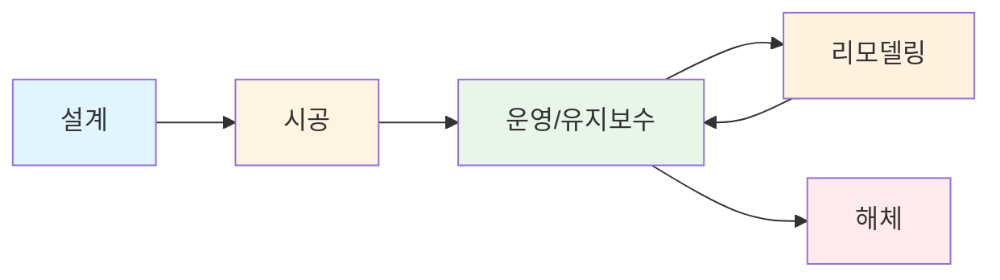

# 🛠️ 260129 Revit BIM 완전 가이드

## 📚 목차
1. [간략 소개](#간략-소개)
2. [상세 소개](#상세-소개)
3. [필요성](#필요성)
4. [사용 분야](#사용-분야)
5. [주요 기능](#주요-기능)
6. [파일 형식](#파일-형식)
7. [자료 구조](#자료-구조)
8. [외부 도구 호환성](#외부-도구-호환성)
9. [참고자료](#참고자료)

---

## 🧭 간략 소개

**Autodesk Revit**는 건축, 엔지니어링, 건설(AEC, Architecture, Engineering, Construction) 산업을 위한 대표적인 **BIM(Building Information Modeling)** 소프트웨어입니다. 2000년 4월 5일 처음 출시된 이후 2026년 현재까지 25년간 BIM 혁신을 선도해온 플랫폼으로, 건물의 설계, 문서화, 관리를 통합된 3D 환경에서 수행할 수 있게 합니다.

Revit는 단순한 3D 모델링 도구를 넘어서, 건물의 전체 생애주기(설계-시공-운영-유지보수)에 걸친 정보를 중앙집중식으로 관리하는 **파라메트릭 모델링** 시스템입니다. 모든 변경사항이 자동으로 전체 프로젝트에 반영되며, 다양한 전문 분야(건축, 구조, MEP)가 하나의 통합 모델에서 협업할 수 있습니다.

---

## 🧭 상세 소개

### 🏢 BIM의 핵심 개념과 Revit의 역할

**BIM(Building Information Modeling)**은 건축물의 물리적, 기능적 특성을 디지털 방식으로 표현하는 프로세스입니다. 전통적인 CAD가 단순히 선과 도형을 그리는 것에 집중했다면, BIM은 건축 요소 자체를 **지능형 객체(Intelligent Objects)**로 다룹니다.

Revit는 BIM 개념을 구현하는 대표적인 소프트웨어로서 다음과 같은 핵심 특징을 가집니다:

#### ▫️ 1. 파라메트릭 모델링 (Parametric Modeling)

Revit의 모든 요소는 **파라미터(매개변수)**를 통해 정의됩니다. 벽, 문, 창문, 기둥 등의 건축 요소는 고정된 형상이 아니라 **규칙과 관계**로 정의됩니다.

```
예시: 벽에 설치된 문의 파라메트릭 관계
- 벽의 위치가 이동 → 문도 자동으로 함께 이동
- 벽의 두께가 변경 → 문틀의 두께도 자동 조정
- 문의 크기가 변경 → 개구부도 자동으로 재계산
```

이러한 파라메트릭 관계는 **양방향(Bidirectional)**으로 작동합니다. 평면도에서 벽을 이동하면 입면도, 단면도, 3D 뷰가 자동으로 업데이트되며, 반대로 3D 뷰에서 수정하면 모든 2D 도면이 즉시 반영됩니다.

#### 🏗️ 2. 중앙 집중식 데이터베이스 구조

Revit 프로젝트는 본질적으로 **단일 파일 데이터베이스**입니다. 모든 뷰(평면도, 입면도, 단면도, 3D 뷰, 일람표 등)는 동일한 중앙 데이터를 다른 방식으로 시각화한 것입니다.

```
┌─────────────────────────────────────┐
│    Revit Central File Database      │
│  (모든 프로젝트 정보의 중앙 저장소)     │
└──────────────┬──────────────────────┘
               │
       ┌───────┴───────┐
       ▼               ▼
   [평면도]         [3D 뷰]
       ▼               ▼
   [입면도]         [일람표]
       ▼               ▼
   [단면도]         [상세도]
```

이 구조는 다음과 같은 이점을 제공합니다:
- **데이터 일관성**: 한 곳에서 수정하면 모든 뷰가 자동 업데이트
- **중복 제거**: 동일한 정보를 여러 번 입력할 필요 없음
- **실시간 협업**: 여러 사용자가 동시에 작업하며 변경사항 즉시 공유

#### ▫️ 3. 지능형 패밀리 시스템

Revit의 모든 건축 요소는 **패밀리(Family)**라는 단위로 구성됩니다. 패밀리는 단순한 블록이 아니라 **파라미터, 제약조건, 동작 규칙**을 포함하는 지능형 컴포넌트입니다.

**패밀리의 세 가지 유형:**

1. **시스템 패밀리 (System Families)**
   - Revit에 기본 내장되어 있으며 프로젝트 내에서만 존재
   - 예: 벽, 바닥, 지붕, 천장, 계단
   - 프로젝트 파일에 내장되어 별도 파일로 저장 불가

2. **로드 가능한 패밀리 (Loadable Families)**
   - 별도의 .rfa 파일로 저장 가능
   - 프로젝트 간 재사용 가능
   - 예: 문, 창문, 가구, 설비 기기, 조명
   - 사용자가 직접 생성하거나 외부에서 다운로드 가능

3. **현장 패밀리 (In-Place Families)**
   - 특정 프로젝트 내에서만 사용되는 고유한 요소
   - 다른 프로젝트로 이전 불가
   - 예: 독특한 형태의 커튼월, 특수 구조물

#### 🏗️ 4. 파라미터 시스템의 구조

Revit의 파라미터는 두 가지 레벨로 작동합니다:

**타입 파라미터 (Type Parameters)**
- 동일한 타입의 모든 인스턴스에 동일하게 적용
- 예: "900x2100 단일문" 타입의 모든 문은 동일한 너비와 높이

**인스턴스 파라미터 (Instance Parameters)**
- 각 개별 인스턴스마다 독립적으로 설정 가능
- 예: 문의 위치, 높이 오프셋, 마감재

```
패밀리 계층 구조:
┌──────────────────────┐
│   문 (Door) 카테고리   │
└──────────┬───────────┘
           │
    ┌──────┴──────┐
    ▼             ▼
[단일문]      [양개문]  ← 패밀리 (Family)
    │             │
 ┌──┴──┐      ┌──┴──┐
 ▼     ▼      ▼     ▼
900x2100  1200x2100  ← 타입 (Type)
 │
 ├─ 1층 101호실 문  ← 인스턴스 (Instance)
 ├─ 1층 102호실 문
 └─ 2층 201호실 문
```

#### ▫️ 5. 워크셰어링 (Worksharing) 협업 시스템

Revit는 대규모 프로젝트에서 여러 사용자가 동시에 작업할 수 있도록 **워크셰어링** 기능을 제공합니다.

**워크셰어링 구조:**

```
                    ┌─────────────────────┐
                    │  Central File       │
                    │  (서버에 저장)        │
                    │  - Master 데이터     │
                    └──────────┬──────────┘
                               │
              ┌────────────────┼────────────────┐
              ▼                ▼                ▼
        ┌──────────┐     ┌──────────┐     ┌──────────┐
        │ Local 1  │     │ Local 2  │     │ Local 3  │
        │ (건축팀)  │     │ (구조팀)  │     │ (MEP팀)  │
        └──────────┘     └──────────┘     └──────────┘
             │                │                │
             └────────────────┼────────────────┘
                              ▼
                    Sync with Central
                    (변경사항 동기화)
```

**워크셰어링의 핵심 메커니즘:**

1. **Central File (중앙 파일)**
   - 파일 서버에 저장되는 마스터 파일
   - 모든 프로젝트 데이터의 최종 저장소

2. **Local File (로컬 파일)**
   - 각 사용자의 컴퓨터에 저장되는 작업 복사본
   - 중앙 파일의 캐시된 버전

3. **Worksets (작업세트)**
   - 프로젝트를 논리적 영역으로 분할
   - 예: "1층", "2층", "외벽", "내벽", "MEP 시스템"
   - 각 사용자는 특정 작업세트를 차용(Borrow)하여 배타적으로 편집

4. **Sync with Central (중앙과 동기화)**
   - 로컬에서 작업한 변경사항을 중앙 파일로 업로드
   - 다른 사용자의 변경사항을 로컬로 다운로드

#### ▫️ 6. 다학제 통합 (Multidisciplinary Integration)

Revit는 단일 플랫폼 내에서 여러 전문 분야를 통합합니다:

**건축 (Architecture)**
- 공간 계획, 벽, 바닥, 지붕, 계단
- 문, 창문, 커튼월 시스템
- 마감재, 가구, 조경

**구조 (Structure)**
- 기둥, 보, 슬래브, 기초
- 철근 상세, 연결부 디테일
- 구조 해석을 위한 데이터 추출

**MEP (Mechanical, Electrical, Plumbing)**
- 기계: HVAC 시스템, 덕트, 배관
- 전기: 조명, 전력 분배, 케이블 트레이
- 배관: 급수, 배수, 소화 시스템

각 분야는 동일한 건물 모델에서 작업하며, **링크 모델(Linked Models)** 기능을 통해 상호 조정됩니다.

#### 🕰️ 7. 25년의 발전 역사 (2000-2026)

Revit는 2000년 처음 출시된 이후 지속적으로 발전해왔습니다:

**초기 (2000-2005)**
- 파라메트릭 모델링 개념 도입
- 건축 중심 기능

**중기 (2006-2015)**
- Autodesk 인수 (2002년)
- 구조, MEP 모듈 추가
- 클라우드 협업 기능 도입

**현재 (2016-2026)**
- AI/ML 기반 자동화
- 실시간 렌더링 통합 (Twinmotion)
- OpenUSD/Hydra 기반 차세대 그래픽 엔진
- 대규모 포인트 클라우드 처리 (ReCap 통합)

---

## 🎯 필요성

### ⚠️ 1. 전통적 CAD 방식의 한계

**2D CAD의 근본적 문제점:**

전통적인 2D CAD(예: AutoCAD) 방식에서는 평면도, 입면도, 단면도, 상세도가 **독립적인 도면**으로 존재합니다. 이는 다음과 같은 심각한 문제를 야기합니다:

```
문제 시나리오:
1. 건축주가 1층 로비의 벽 위치 변경 요청
2. 건축가는 다음을 모두 수동으로 수정해야 함:
   - 1층 평면도
   - 관련된 모든 입면도 (4개 방향)
   - 관련된 모든 단면도
   - 상세도면
   - 마감표
   - 면적 계산
   - 문/창호 일람표

결과:
- 수정 시간: 2-3시간
- 오류 발생 가능성: 높음
- 누락 위험: 높음
```

**Revit에서 동일한 시나리오:**

```
1. 평면도에서 벽을 드래그하여 이동
2. 모든 뷰가 자동으로 업데이트됨
3. 일람표와 수량이 자동 재계산됨

결과:
- 수정 시간: 30초
- 오류 발생 가능성: 없음
- 누락 위험: 없음
```

### 🔹 2. 프로젝트 복잡도 증가에 대한 대응

현대 건축 프로젝트는 점점 더 복잡해지고 있습니다:

**복잡도 증가 요인:**
- **규모**: 초고층 빌딩, 대형 복합시설
- **시스템 통합**: 스마트 빌딩, 에너지 관리, IoT
- **규제**: 녹색건축인증, 에너지 절약 설계기준, 장애인 접근성
- **이해관계자**: 건축주, 설계사, 시공사, 감리, 인허가 기관

**BIM 없이는 불가능한 작업들:**

1. **충돌 감지 (Clash Detection)**
   - 구조 기둥과 MEP 덕트의 간섭 자동 검출
   - 시공 전 문제 해결로 현장 재작업 방지

2. **에너지 시뮬레이션**
   - 건물의 3D 형상, 재료 정보를 바탕으로 에너지 소비 예측
   - 다양한 설계 대안의 성능 비교

3. **물량 산출 (Quantity Takeoff)**
   - 모델에서 자동으로 정확한 물량 추출
   - 비용 견적의 정확도 향상

4. **시공 시뮬레이션 (4D BIM)**
   - 3D 모델에 시간 정보(공정) 결합
   - 시공 단계별 시각화

### 🔹 3. 협업과 의사소통의 혁신

**전통적 방식의 의사소통 문제:**

```
건축주: "이 공간이 너무 좁은 것 같은데요?"
건축가: [2D 도면을 가리키며] "실제로는 충분합니다"
건축주: [이해하지 못함]

결과: 건축주는 준공 후에야 공간을 이해하고 불만 제기
```

**BIM 방식의 의사소통:**

```
건축가: [실시간 3D 모델을 회전하며 보여줌]
       [가상현실(VR)로 공간 체험 제공]
건축주: [직관적으로 이해하고 즉시 피드백]

결과: 설계 단계에서 문제 해결, 고객 만족도 향상
```

### 🔹 4. 생애주기 관리 (Lifecycle Management)

BIM 모델은 설계와 시공에서 끝나지 않습니다. 건물의 **전체 생애주기**에 걸쳐 활용됩니다:

**설계 단계 (Design Phase)**
- 개념 설계, 기본 설계, 실시 설계
- 다양한 대안 검토 및 성능 시뮬레이션

**시공 단계 (Construction Phase)**
- 시공 도면 생성
- 물량 산출 및 견적
- 공정 관리 (4D BIM)
- 현장 문제 해결

**운영 단계 (Operation Phase)**
- 시설물 유지보수 정보 관리
- 공간 활용 최적화
- 에너지 관리
- 리모델링 계획

**해체 단계 (Demolition Phase)**
- 폐기물 관리
- 재활용 자재 분류



### 🔹 5. 산업 표준화와 정부 정책

전 세계적으로 BIM은 **법적 요구사항**이 되어가고 있습니다:

**국가별 BIM 의무화:**
- **영국**: 2016년부터 모든 공공 프로젝트에 BIM Level 2 의무화
- **싱가포르**: 2015년부터 일정 규모 이상 건축 허가에 BIM 제출 필수
- **한국**: 2016년부터 500억 원 이상 공공 건축에 BIM 적용 의무화
- **미국**: GSA(연방조달청) 공공 프로젝트 BIM 요구
- **EU**: Horizon 2020 등 연구 프로젝트에서 BIM 장려

**산업 표준:**
- ISO 19650: BIM 정보 관리 국제 표준
- IFC (Industry Foundation Classes): 개방형 BIM 데이터 교환 표준
- COBie (Construction Operations Building Information Exchange): 시설물 정보 전달 표준

### 🎯 6. 경제적 필요성

**McKinsey 연구 결과:**
- 건설 산업의 생산성은 지난 20년간 거의 정체
- BIM 도입으로 **15-20% 비용 절감** 가능
- 프로젝트 일정 **5-15% 단축** 가능

**ROI (투자 대비 수익) 분석:**

```
초기 투자:
- Revit 라이선스: 연간 약 $2,870
- 교육 비용: 직원당 약 $1,000-2,000
- 하드웨어 업그레이드: 워크스테이션당 약 $2,000

절감 효과:
- 재작업 감소: 프로젝트당 10-15%
- 도면 조정 시간 단축: 50-70%
- 물량 산출 정확도 향상: 95% 이상
- 충돌 감지로 현장 변경 감소: 30-40%

중형 프로젝트(50억 원) 기준:
- 절감액: 약 5-10억 원
- 투자 회수 기간: 1-2개 프로젝트
```

### 🔹 7. 지속가능성과 환경

BIM은 **녹색 건축**과 **탄소 중립** 목표 달성에 필수적입니다:

**에너지 성능 최적화:**
- 일조 분석, 일사량 계산
- 냉난방 부하 시뮬레이션
- 다양한 외피 시스템 성능 비교

**자재 최적화:**
- 정확한 물량으로 자재 낭비 최소화
- 재활용 가능 자재 추적
- 탄소 발자국 계산

**LEED, BREEAM 등 녹색건축인증:**
- 인증 요구 서류를 BIM 모델에서 자동 생성
- 성능 기준 충족 여부 실시간 검증

---

## 📌 사용 분야

### 🔹 1. 건축 설계 (Architectural Design)

#### ▫️ 개념 설계 (Conceptual Design)
Revit의 **Massing(매스 스터디)** 도구를 사용하여 초기 볼륨 스터디를 수행합니다.

**주요 활용:**
- 대지 분석 및 매스 배치
- 용적률, 건폐율 자동 계산
- 일조권, 조망권 시뮬레이션
- 프로그램 면적 검증

**워크플로우:**
```
1. 대지 모델링 (Toposolid로 지형 생성)
2. 매스 생성 (개념적 볼륨)
3. 면적 계산 및 검증
4. 대안 비교
5. 선택된 안을 상세 모델로 발전
```

#### ▫️ 기본 설계 (Schematic Design)
건축 요소를 구체화하는 단계입니다.

**모델링 요소:**
- 벽, 바닥, 지붕, 천장
- 문, 창문, 커튼월
- 계단, 경사로, 난간
- 방(Room) 객체로 공간 정의

**생성 산출물:**
- 평면도, 입면도, 단면도
- 3D 투시도
- 면적 일람표
- 문/창호 일람표

#### ▫️ 실시 설계 (Detailed Design)
시공을 위한 상세 정보를 추가합니다.

**상세화 작업:**
- 벽체 레이어 상세(단열, 방수, 마감)
- 접합부 디테일
- 마감재 지정
- 상세도면 작성

**BIM 라이브러리 활용:**
- 제조사 BIM 객체 다운로드
- 실제 제품 사양이 반영된 컴포넌트
- LOD (Level of Development) 400-500 수준

### 🏗️ 2. 구조 설계 (Structural Engineering)

#### 🏗️ 구조 시스템 모델링
**Revit Structure** 모듈을 사용하여 구조 시스템을 설계합니다.

**구조 요소:**
- 기초: 독립기초, 복합기초, 매트기초
- 기둥: RC 기둥, 철골 기둥
- 보: RC 보, 철골 보, 트러스
- 슬래브: RC 슬래브, 데크플레이트
- 브레이싱, 전단벽

**파라메트릭 철근 배근:**
```
Revit 2026 신기능: Parametric Rebar Cranking
- 복잡한 배근 상황에서 철근 크랭킹 자동 처리
- 간섭 회피를 위한 철근 형상 조정
- 시공 가능성을 고려한 배근 상세
```

#### 🏗️ 구조 해석 연동
Revit 모델을 구조 해석 소프트웨어로 전달:

**지원 소프트웨어:**
- ETABS, SAP2000 (CSI)
- MIDAS Gen, MIDAS Civil
- Robot Structural Analysis (Autodesk)
- Tekla Structural Designer

**양방향 워크플로우:**
```
Revit → 구조 해석 S/W → 부재 설계 → Revit 업데이트
```

#### ▫️ 철근 상세 및 물량
**철근 모델링:**
- Rebar (철근) 객체로 상세 배근
- 스터럽, 주근, 배력근 등 모든 철근 3D 모델링
- 철근 일람표 자동 생성
- 철근 가공도 (Bar Bending Schedule) 출력

**철근 물량 산출:**
- 직경별, 길이별 자동 집계
- 중량 계산
- 절단 최적화

### 🏢 3. MEP 설계 (기계/전기/배관)

#### ▫️ 기계 설비 (Mechanical)
**Revit MEP**를 사용한 HVAC 시스템 설계:

**시스템 구성요소:**
- 공조기(AHU), 팬코일유닛(FCU)
- 덕트 시스템 (공급, 환기, 배기)
- 배관 시스템 (냉수, 온수)
- 그릴, 디퓨저

**자동 배관/덕트 라우팅:**
```
1. 기기 배치
2. 시스템 정의 (급기/환기)
3. 자동 라우팅 실행
4. 간섭 검토 후 경로 조정
5. 사이징 및 압력 계산
```

#### ▫️ 전기 설비 (Electrical)
**전력 분배 시스템:**
- 분전반, 배전반
- 전선관, 케이블 트레이
- 조명기구
- 콘센트, 스위치

**전력 부하 계산:**
- 회로별 부하 집계
- 변압기 용량 산정
- 패널 스케줄 자동 생성

**조명 설계:**
- 조도 시뮬레이션
- 에너지 효율 분석
- 조명 제어 시스템

#### ▫️ 배관 설비 (Plumbing/Fire Protection)
**급배수 시스템:**
- 급수관, 배수관
- 위생기구 (세면대, 변기, 샤워기)
- 펌프, 탱크

**소화 시스템:**
- 스프링클러 헤드 자동 배치
- 소화수 배관
- 소화전

### ⚠️ 4. 건설 관리 (Construction Management)

#### ▫️ 시공 계획
**4D BIM (3D + 시간):**
```
BIM 모델 + 공정표 = 4D 시뮬레이션

활용 도구:
- Autodesk Navisworks
- Synchro Pro
- VICO Office
```

**시공 시뮬레이션 효과:**
- 공정 간섭 사전 파악
- 장비 동선 계획
- 자재 적치 계획
- 안전 계획

#### ▫️ 물량 산출 및 견적
**5D BIM (4D + 비용):**

**자동 물량 산출:**
```
Revit 일람표 → Excel → 견적 시스템

물량 추출 예시:
- 콘크리트: 부재별, 강도별 체적
- 거푸집: 부재별 면적
- 철근: 직경별 중량
- 마감재: 재료별 면적/개수
```

**정확도 향상:**
- 전통적 방법: 85-90% 정확도
- BIM 기반: 95-98% 정확도
- 차이: 대형 프로젝트에서 수억~수십억 원

#### ▫️ 시공 도면 생성
**Shop Drawing (제작도):**
- 철골 제작도
- 커튼월 제작도
- MEP 상세도

**협력사 조정:**
- 각 협력사에게 모델 영역 할당
- 상세 모델 제출 받아 통합
- 간섭 검토 및 조정

### 🔹 5. 시설물 관리 (Facility Management)

#### ▫️ As-Built 모델
시공 완료 후 **준공 모델(As-Built Model)**을 생성:

**포함 정보:**
- 실제 시공된 치수
- 설치된 장비의 제조사, 모델명, 일련번호
- 유지보수 매뉴얼 링크
- 보증 기간 정보

#### ▫️ CAFM/CMMS 연동
**Computer-Aided Facility Management:**

```
BIM 모델 → COBie 형식 → CAFM 시스템

전달 정보:
- 공간 정보 (방 번호, 면적, 용도)
- 자산 목록 (장비, 가구)
- 유지보수 일정
- 부품 재고 관리
```

**활용 사례:**
- 공간 활용 최적화
- 예방 정비 스케줄링
- 에너지 모니터링
- 긴급 상황 대응 (비상구 경로)

#### ▫️ 리모델링 계획
기존 건물 개보수 시 BIM 활용:

**워크플로우:**
```
1. 기존 건물 스캔 (3D 레이저 스캐닝)
2. 포인트 클라우드 → Revit 모델 변환
3. 리모델링 설계
4. 기존/신규 비교 분석
5. 철거/신설 물량 산출
```

**Revit 2026 ReCap Mesh Plugin:**
- 대용량 메쉬 데이터를 Revit에 통합
- 성능 저하 없이 현황 모델 작업
- 적응적 재사용(Adaptive Reuse) 프로젝트 지원

### 🔹 6. 도시 계획 및 인프라

#### ▫️ 대규모 부지 계획
**Toposolid (지형 솔리드):**
```
Revit 2026 개선사항:
- 포인트 임계값: 10,000 → 20,000 (기본)
- 최대 50,000 포인트 지원 (Revit.ini 설정)
- 세분화 기능 개선 (음수 값 설정 가능)
- 재료 대신 타입 선택 가능
```

**활용:**
- 도로 계획
- 조경 계획
- 부지 배수 계획
- 토공량 계산

#### ▫️ Revit과 Civil 3D 연동
**인프라 프로젝트:**
- Civil 3D에서 도로, 교량 설계
- Revit에서 건축 구조물 설계
- 통합 모델로 조정

### 🔹 7. 특수 분야

#### 🕰️ 역사 건축물 보존
**디지털 아카이빙:**
- 3D 스캔 → BIM 모델
- 문화재 디지털 트윈
- 보수/복원 계획

#### ▫️ 프리패브/모듈러 건축
**공장 제작 부재:**
- Revit에서 모듈 설계
- 제작 정보 직접 전달
- 현장 조립 시뮬레이션

#### ▫️ 의료 시설
**복잡한 MEP 요구사항:**
- 의료 가스 시스템
- 정밀 공조 (수술실, ICU)
- 전자기 차폐

---

## 📌 주요 기능

### 🔹 1. Revit 2026 최신 기능

#### 🎮 가속 그래픽 기술 미리보기 (Accelerated Graphics Tech Preview)

**혁신적 성능 향상:**
- **4-5배** 2D/3D 뷰 응답성 개선
- Pixar의 **Hydra** 렌더링 아키텍처 기반
- **OpenUSD(Universal Scene Description)** 프레임워크 활용

**기술 스택:**
```
Revit Accelerated Graphics Engine
         ↓
    Hydra (고성능 렌더링)
         ↓
     OpenUSD (장면 표현)
         ↓
    GPU 가속 (CUDA/DirectX)
```

**사용자 경험 개선:**
- 대규모 모델에서도 부드러운 회전/패닝/줌
- 실시간 음영 처리
- 복잡한 패밀리의 빠른 로딩

**오픈 표준 기반:**
- 향후 외부 렌더러와의 통합 용이
- 영화/VFX 산업의 검증된 기술 활용
- 커뮤니티 기여 가능

#### ▫️ 벽 생성 개선 (Wall Creation Improvements)

**자동 벽 생성:**
```
기존 방식:
1. 벽을 하나씩 그림
2. 길이와 위치를 수동 조정
3. 모서리 접합 수동 처리

Revit 2026:
1. 닫힌 영역 선택 (방 경계)
2. 자동으로 모든 벽 생성
3. 코너 자동 처리
```

**기존 요소로부터 벽 생성:**
- 기존 벽과 기둥 선택
- 새로운 벽이 정확한 위치에 자동 생성
- 높이, 타입 등 속성 상속 가능

#### ▫️ 뷰-시트 배치 및 자동 정렬 (View to Sheet Positioning)

**정밀한 뷰 배치:**
- 시트에서 뷰의 정확한 X, Y 좌표 지정
- 여러 시트에 걸쳐 일관된 배치
- 템플릿 기반 자동 배치

**생산성 향상:**
```
기존: 각 뷰를 드래그하여 수동 정렬 → 시간 소모, 불일치
2026: 규칙 기반 자동 배치 → 일관성, 시간 절약
```

**도면 품질 개선:**
- 모든 평면도가 동일한 기준점 정렬
- 도면 번호, 스케일 위치 표준화
- 전문성 있는 도면 세트 생성

#### 🎮 ReCap Mesh Revit Plugin

**리트로핏 및 재사용 프로젝트:**
```
워크플로우:
1. 기존 건물 3D 스캔 (레이저 스캐너)
2. ReCap Pro로 메쉬 생성
3. Revit에 메쉬 링크 (성능 영향 없음)
4. 메쉬에서 Revit Family 생성
```

**주요 기능:**
- **대용량 메쉬 처리**: 수백만 폴리곤도 원활
- **파라메트릭 패밀리 생성**: 메쉬 형상에서 추출
- **연결점 추가**: 메쉬와 신규 요소 통합
- **압출, 모델선 추가**: 메쉬 위에 파라미터 부여

**환경 영향 최소화:**
- 기존 건물 재활용 설계 지원
- 철거 최소화
- 지속가능한 건축 실현

#### ▫️ 파라메트릭 철근 크랭킹 (Parametric Rebar Cranking)

**구조 엔지니어링 혁신:**

**크랭킹(Cranking)이란?**
- 철근을 의도적으로 구부려 간섭 회피
- 복잡한 배근 영역에서 필수적

**자동화 기능:**
```
기존: 수동으로 각 철근의 굽힘 형상 설계
2026: 파라미터로 크랭킹 규칙 정의 → 자동 적용
```

**장점:**
- 시공 가능성 확보
- 배근 간섭 자동 해결
- 철근 가공도 정확도 향상

### 🔹 2. 핵심 모델링 기능

#### ▫️ 파라메트릭 컴포넌트

**파라미터 유형:**

1. **치수 파라미터 (Dimensional Parameters)**
   ```
   폭 = 900mm
   높이 = 2100mm
   깊이 = 벽두께
   ```

2. **참조 평면 (Reference Planes)**
   - 파라메트릭 형상의 골격
   - 치수 변경 시 형상이 참조 평면을 따라 조정

3. **제약조건 (Constraints)**
   - 정렬: 두 요소를 정렬 상태로 유지
   - 고정: 요소를 특정 위치에 잠금
   - 등간격: 여러 요소를 균등 분배

4. **수식 (Formulas)**
   ```
   개구부_폭 = 문틀_폭 - 5mm * 2
   손잡이_높이 = IF(장애인용, 900mm, 1000mm)
   ```

**패밀리 편집기:**
- 전용 패밀리 편집 환경
- 2D 스케치 → 3D 형상 (압출, 회전, 블렌드, 스윕)
- 중첩 패밀리 (Nested Families): 패밀리 안에 패밀리

#### ▫️ 매스 스터디 (Massing)

**개념적 매스 도구:**
```
형상 생성 방법:
1. In-Place Mass: 프로젝트 내에서 직접 생성
2. Conceptual Mass Family: 별도 파일로 생성 후 로드
```

**매스에서 건물 요소 생성:**
- 매스 표면 선택 → 벽 생성
- 매스 레벨 자르기 → 바닥 생성
- 커튼 시스템 자동 적용

**면적 계산:**
- 매스 바닥(Mass Floors) 정의
- 용적률, 건폐율 자동 계산
- 프로그램 면적 검증

### 🔹 3. 문서화 기능

#### ▫️ 뷰 관리

**뷰 유형:**
- 평면도 (Floor Plans)
- 천장 평면도 (Ceiling Plans)
- 입면도 (Elevations)
- 단면도 (Sections)
- 3D 뷰 (3D Views)
- 상세도 (Drafting Views)
- 일람표 (Schedules)
- 범례 (Legends)

**뷰 템플릿 (View Templates):**
```
템플릿 정의:
- 축척: 1/100
- 상세 수준: 상세
- 표시/그래픽: 벽은 굵은 선, 가구는 얇은 선
- 필터: 철거 요소는 빨간색

적용:
- 모든 평면도에 일괄 적용
- 변경 시 모든 뷰가 자동 업데이트
```

**가시성/그래픽 재정의:**
- 카테고리별 표시 제어 (벽, 문, 창 등)
- 선 두께, 색상, 패턴 설정
- 반투명도, 할로우 표시

#### ▫️ 주석 및 치수

**지능형 치수:**
- 치수는 실제 형상과 연결
- 형상 변경 시 치수 자동 업데이트
- 등거리 치수열(Aligned/Linear Dimensions)

**주석 요소:**
- 텍스트 노트
- 태그 (방 태그, 문 태그, 마감 태그 등)
- 심볼
- 상세 선 및 영역

**키노트 (Keynotes):**
```
재료/시공법을 코드로 관리
예: 09 51 13 - 음향 타일 천장

장점:
- 일관된 명명
- 다국어 지원
- 사양서와 연동
```

#### ▫️ 일람표 (Schedules)

**자동 데이터 집계:**
```
문 일람표 예시:
┌─────┬──────────┬──────────┬─────┬────────┐
│번호 │  타입    │   크기   │개수 │ 재료   │
├─────┼──────────┼──────────┼─────┼────────┤
│ D1  │ 단일문   │ 900x2100 │  15 │ 강재   │
│ D2  │ 양개문   │1800x2100 │   3 │ 알루미늄│
└─────┴──────────┴──────────┴─────┴────────┘

모델 변경 시 자동 업데이트
```

**수식 계산:**
- 계산된 값: `면적 = 길이 × 너비`
- 조건문: `단가 = IF(재료="대리석", 500000, 100000)`

**그룹화 및 정렬:**
- 다중 레벨 그룹화
- 소계, 합계 자동 계산
- 필터링

#### ▫️ 시트 구성

**시트 관리:**
- A0, A1, A2 등 표준 용지 크기
- 타이틀 블록 패밀리
- 뷰포트(Viewport)로 뷰 배치

**도면 목록:**
- 시트 일람표 자동 생성
- 도면 번호, 제목, 작성자, 일자
- 프로젝트 브라우저와 연동

### 🔹 4. 협업 기능

#### ▫️ 워크셰어링 (Worksharing)

**세부 메커니즘:**

**작업세트 (Worksets):**
```
프로젝트 분할 예시:
- Workset 1: 외벽
- Workset 2: 내벽
- Workset 3: 코어
- Workset 4: 가구
- Workset 5: MEP
```

**요소 차용 (Borrowing):**
- **편집 가능**: 현재 사용자만 수정 가능
- **편집 요청**: 다른 사용자에게 요청
- **해제**: 수동 또는 SWC(Sync with Central) 시 자동

**동기화 옵션:**
```
SWC 옵션:
□ 변경사항을 중앙에 저장
□ 중앙에서 변경사항 가져오기
□ 내 작업세트 유지
□ 모든 작업세트 유지
```

#### 🗂️ 링크 파일 (Linked Files)

**Revit 링크:**
```
건축 모델 (메인 파일)
  ↓ 링크
구조 모델 (링크 파일)
  ↓ 링크
MEP 모델 (링크 파일)
```

**링크 옵션:**
- **Overlay**: 현재 파일에서만 보임
- **Attachment**: 이 파일을 링크하는 파일에서도 보임

**좌표계:**
- **원점 기준**: 파일 원점 정렬
- **공유 좌표**: 실제 측지 좌표계 사용

**Revit 2026 개선:**
- 링크된 조정 모델(Coordination Models)의 세밀한 표시 제어
- 요소별 색상, 가시성 제어
- 링크 관리 대화상자에 CAD 파일 통합

#### ⚠️ Revit Server / BIM 360 / Autodesk Construction Cloud

**클라우드 협업:**

**BIM 360 / ACC 기능:**
- 웹 브라우저에서 모델 뷰어
- 이슈 추적 및 할당
- 모델 조정 (Coordination)
- 버전 관리

**모바일 지원:**
- 태블릿/스마트폰에서 모델 검토
- 현장에서 이슈 등록
- RFI (Request for Information) 관리

### ⚡ 5. 성능 및 시뮬레이션

#### ▫️ 에너지 해석

**Revit 내장 에너지 분석:**
```
워크플로우:
1. BIM 모델 생성 (벽, 창, 지붕 등)
2. 에너지 설정 정의
   - 위치 (위도/경도)
   - 기상 데이터
   - 건물 용도
   - HVAC 시스템
3. 에너지 모델 생성
4. 클라우드 분석 실행
5. 결과 검토
   - 연간 에너지 소비
   - 냉난방 부하
   - 일사량
```

**외부 도구 연동:**
- **IES VE**: 상세 에너지 시뮬레이션
- **DesignBuilder**: EnergyPlus 기반 분석
- **Sefaira**: 실시간 성능 피드백

#### 🔍 조명 분석

**일조 및 음영 연구:**
- 특정 일시의 태양 위치 시뮬레이션
- 연중 음영 패턴 분석
- 일조권 검토

**인공조명:**
- Revit 내 기본 렌더링
- 조도 계산 (lux)

#### 🏗️ 구조 해석

**하중 정의:**
- 고정하중 (자중)
- 활하중 (사용 하중)
- 풍하중
- 지진하중

**해석 모델 생성:**
- 물리적 모델 → 해석 모델 변환
- 절점, 부재, 경계조건
- 해석 S/W로 전달

### 🔹 6. 시각화 및 프레젠테이션

#### 🎮 렌더링

**Revit 내장 렌더러:**
- **Raytrace**: CPU 기반 레이 트레이싱
- **Cloud Rendering**: Autodesk 클라우드 활용

**재료 및 조명:**
- 물리 기반 재료 (Physically Based Rendering)
- 반사, 굴절, 거칠기
- 인공조명 + 자연광

#### 🎮 외부 렌더러 연동

**Twinmotion 실시간 링크 (Revit 2026):**
```
Revit ↔ Twinmotion 라이브 링크:
- Revit에서 변경 → Twinmotion 즉시 반영
- 고품질 자산 자동 대체
- 실시간 렌더링
- VR 체험
```

**기타 렌더러:**
- **Enscape**: 가장 인기 있는 Revit 플러그인
- **V-Ray**: 고품질 포토리얼리스틱 렌더링
- **Lumion**: 빠른 렌더링과 애니메이션

#### ▫️ 가상현실 (VR)

**VR 익스포트:**
- Enscape → Oculus, HTC Vive
- Twinmotion → 다양한 VR 헤드셋
- Unity/Unreal Engine → 커스텀 VR 경험

**디자인 리뷰:**
- 클라이언트가 VR로 공간 체험
- 실시간 수정 및 피드백
- 1:1 스케일 공간 인지

---

## 🗂️ 파일 형식

### 🗂️ 1. 주요 Revit 파일 형식

#### ▫️ .RVT (Revit Project File)

**개요:**
- Revit의 **메인 프로젝트 파일**
- 모든 3D 형상, 2D 주석, 일람표, 시트 포함
- 독점 바이너리 형식 (공개되지 않음)

**파일 구조 (추정):**
```
.RVT 파일 (독점 형식)
├─ 프로젝트 메타데이터
│  ├─ 프로젝트 정보
│  ├─ 위치 정보
│  └─ 설정
├─ 요소 데이터베이스
│  ├─ 벽 (id, 타입, 파라미터, 형상)
│  ├─ 문 (id, 타입, 파라미터, 위치)
│  ├─ ...
│  └─ 패밀리 인스턴스
├─ 뷰 정의
│  ├─ 평면도 (카메라, 클립 박스, 가시성)
│  ├─ 단면도
│  └─ 3D 뷰
├─ 시트
│  └─ 뷰포트 배치 정보
└─ 링크 파일 참조
```

**파일 크기:**
- 소규모 프로젝트: 10-50 MB
- 중규모 프로젝트: 50-200 MB
- 대규모 프로젝트: 200 MB - 1 GB+
- 초대형 프로젝트: 수 GB (성능 이슈 가능)

**성능 고려사항:**
- **파일 압축**: Revit은 자동으로 압축하지만 한계 존재
- **모델 정리**: 불필요한 뷰, 패밀리, CAD 링크 제거
- **감사(Audit)**: 파일 손상 복구
- **퍼지(Purge)**: 사용하지 않는 요소 삭제

#### ▫️ .RFA (Revit Family File)

**개요:**
- **로드 가능한 패밀리** 파일
- 문, 창, 가구, 장비 등 재사용 가능한 컴포넌트
- 프로젝트 간 공유 가능

**패밀리 템플릿:**
```
문 패밀리 예시:
- 카테고리: Doors
- 호스트: 벽
- 참조 평면: 중심선, 개구부
- 타입: 900x2100, 1000x2100, ...
- 파라미터: 폭, 높이, 프레임 두께, 재료
- 형상: 3D 솔리드, 스윕, 블렌드
```

**패밀리 라이브러리:**
- Autodesk 기본 제공 패밀리
- 제조사 BIM 라이브러리 (문, 조명, 가전 등)
- 커뮤니티 리소스 (BIMsmith, RevitCity, NBS)
- 사내 표준 패밀리

#### ▫️ .RTE (Revit Template File)

**개요:**
- **프로젝트 템플릿** 파일
- 새 프로젝트 시작 시 기본 설정 제공

**템플릿 내용:**
```
회사 표준 템플릿:
├─ 뷰 설정
│  ├─ 뷰 템플릿
│  └─ 브라우저 구성
├─ 패밀리
│  ├─ 타이틀 블록
│  ├─ 주석 심볼
│  └─ 표준 문/창
├─ 재료
│  └─ 회사 표준 재료 라이브러리
├─ 선 스타일, 패턴
├─ 필터
└─ 프로젝트 파라미터
```

**사용 사례:**
- 모든 프로젝트의 일관성 유지
- 새 프로젝트 시작 시간 단축
- 회사 표준 강제

#### ▫️ .RVG (Revit Group File)

**개요:**
- **그룹**을 별도 파일로 저장
- 반복되는 요소 집합 (모델 그룹, 상세 그룹)

**사용 예시:**
```
호텔 객실 그룹:
- 벽 레이아웃
- 가구
- 조명기구
- 배관 설비

→ 50개 객실에 동일 그룹 배치
→ 그룹 수정 시 모든 인스턴스 자동 업데이트
```

### 🗂️ 2. 백업 및 버전 파일

#### ▫️ .RVT.backup

**자동 백업:**
- 파일 저장 시 이전 버전을 `.rvt.backup`으로 자동 저장
- 최대 3개까지 백업 유지 가능 (설정 변경 가능)

**복구 방법:**
```
1. .rvt.backup을 .rvt로 확장자 변경
2. Revit으로 열기
```

#### ▫️ Central File과 Local File

**워크셰어링 환경:**

```
서버:
  Project_Central.rvt (중앙 파일)

사용자 A 컴퓨터:
  Project_사용자A.rvt (로컬 파일)

사용자 B 컴퓨터:
  Project_사용자B.rvt (로컬 파일)
```

**백업 폴더:**
- 중앙 파일과 같은 위치에 자동 생성
- `Project_Central_backup/`
- 각 SWC(Sync with Central)마다 백업 생성

### 🔹 3. 내보내기 형식

#### ▫️ IFC (Industry Foundation Classes)

**개요:**
- **개방형 BIM 표준** (ISO 16739)
- 소프트웨어 간 상호운용성

**IFC 버전:**
- **IFC2x3**: 가장 널리 지원됨 (2006년)
- **IFC4**: 최신 표준, 향상된 기능 (2013년)
- **IFC4.3**: 인프라 지원 추가 (2021년)

**Revit IFC Export:**
```
내보내기 설정:
- IFC 버전: IFC2x3 / IFC4
- 파일 형식: .ifc / .ifcxml / .ifczip
- 공간 경계 (Space Boundaries)
- 기본 수량 (Base Quantities)
- 속성 세트 매핑
```

**오픈소스 IFC Exporter:**
- Autodesk가 오픈소스로 공개 (2011년~)
- GitHub: `Autodesk/revit-ifc`
- LGPL v2.1 라이선스
- 커스터마이징 가능

**IFC 활용:**
```
Revit → IFC → Tekla Structures (구조 상세)
Revit → IFC → Solibri (모델 검증)
Revit → IFC → ArchiCAD (협업)
Revit → IFC → BIM 뷰어 (검토)
```

#### ▫️ DWG/DXF (AutoCAD)

**2D CAD 호환:**
- Revit 뷰를 2D DWG로 내보내기
- 레이어 매핑 (Revit 카테고리 → AutoCAD 레이어)

**내보내기 옵션:**
```
- 하나의 DWG로 내보내기
- 뷰/시트별 개별 DWG
- 레이어 구조 설정
- 선 두께, 색상 매핑
```

**AutoCAD 링크:**
- DWG 파일을 Revit에 링크/가져오기
- 기존 CAD 도면 위에 BIM 모델링
- 참조용 도면 (부지 경계, 기존 건물)

#### ▫️ NWC/NWD (Navisworks)

**모델 조정:**
```
Revit → .nwc 캐시 파일 자동 생성
       ↓
Navisworks Manage에서 통합
       ↓
충돌 감지, 4D 시뮬레이션
```

**Navisworks 기능:**
- 여러 소프트웨어의 모델 통합 (Revit, AutoCAD, Tekla 등)
- Clash Detection (간섭 검사)
- TimeLiner (4D 시공 시뮬레이션)
- Animator (카메라 애니메이션)

#### ▫️ FBX (Filmbox)

**3D 모델 교환:**
- 3D 형상과 재료 정보
- 3ds Max, Maya, Unity, Unreal Engine 등으로 전달

**사용 사례:**
- 고품질 렌더링 (V-Ray in 3ds Max)
- 게임 엔진 (Unity/Unreal)
- VR/AR 콘텐츠 제작

#### ▫️ PDF

**2D 도면 출판:**
- 시트를 PDF로 내보내기
- 벡터 기반 (확대해도 선명)
- 주석, 하이퍼링크 포함 가능

#### ▫️ Excel

**데이터 교환:**
- 일람표를 Excel로 내보내기
- Excel에서 수정 후 다시 가져오기 (제한적)
- 물량 데이터를 견적 시스템으로 전달

### 🔹 4. 고급 데이터 형식

#### ⚠️ COBie (Construction Operations Building Information Exchange)

**개요:**
- 시설물 정보 전달 표준
- BIM → FM(Facility Management) 시스템

**COBie 스프레드시트 구조:**
```
시트 구성:
- Facility: 건물 정보
- Floor: 층 정보
- Space: 공간 정보
- Component: 장비/부품 정보
- Type: 타입 정보
- Attribute: 속성
- Document: 문서 링크
- ...
```

**Revit에서 COBie 생성:**
- COBie Extension for Revit 사용
- 파라미터 매핑
- Excel 또는 IFC-COBie 형식으로 내보내기

#### ▫️ gbXML (Green Building XML)

**에너지 분석:**
- 건물 형상 및 에너지 속성
- 에너지 시뮬레이션 S/W로 전달

**포함 정보:**
- 건물 형상 (벽, 창, 지붕)
- 재료 열 속성
- 공간 정보 (용도, 스케줄)
- HVAC 시스템

```
Revit → gbXML → IES VE / DesignBuilder / eQuest
```

---

## 🏗️ 자료 구조

### 🔹 1. Revit 데이터 모델 개념

#### 🏗️ 요소 기반 아키텍처 (Element-Based Architecture)

Revit의 모든 것은 **Element(요소)**입니다. 요소는 Revit 데이터베이스의 기본 단위입니다.

**요소 계층 구조:**

```
Element (최상위 추상 클래스)
│
├─ GraphicalElement (그래픽 요소)
│  ├─ ModelElement (모델 요소)
│  │  ├─ HostObject (호스트 객체)
│  │  │  ├─ Wall (벽)
│  │  │  ├─ Floor (바닥)
│  │  │  ├─ RoofBase (지붕)
│  │  │  └─ Ceiling (천장)
│  │  │
│  │  ├─ FamilyInstance (패밀리 인스턴스)
│  │  │  ├─ Door (문)
│  │  │  ├─ Window (창)
│  │  │  ├─ FurnitureInstance (가구)
│  │  │  └─ Equipment (장비)
│  │  │
│  │  ├─ Column (기둥)
│  │  ├─ Beam (보)
│  │  └─ ...
│  │
│  └─ AnnotationElement (주석 요소)
│     ├─ TextNote (텍스트)
│     ├─ Dimension (치수)
│     ├─ Tag (태그)
│     └─ ...
│
└─ DataStorage (데이터 저장소)
   ├─ View (뷰)
   ├─ Family (패밀리)
   ├─ Material (재료)
   └─ ...
```

#### ▫️ 고유 식별자 (ElementId)

모든 요소는 **고유한 ID**를 가집니다:

```csharp
ElementId id = new ElementId(123456);
Element element = document.GetElement(id);
```

**특성:**
- 프로젝트 내에서 영구적
- 파일 간에는 다름 (링크 모델, 복사한 프로젝트)
- 음수 ID: 시스템 정의 요소 (카테고리, 내장 파라미터 등)

### 🔹 2. 파라미터 시스템

#### 🏗️ 파라미터 저장 구조

**파라미터의 4가지 유형:**

1. **내장 파라미터 (Built-in Parameters)**
   ```
   Revit에 미리 정의된 파라미터
   예: WALL_TOP_OFFSET, DOOR_WIDTH, ROOM_AREA

   API 접근:
   Parameter param = wall.get_Parameter(BuiltInParameter.WALL_TOP_OFFSET);
   ```

2. **프로젝트 파라미터 (Project Parameters)**
   ```
   프로젝트 전체에서 사용 가능
   특정 카테고리에 바인딩

   예: "시공사" 파라미터를 모든 문에 추가
   ```

3. **공유 파라미터 (Shared Parameters)**
   ```
   .txt 파일로 정의 (SharedParameters.txt)
   여러 프로젝트와 패밀리에서 공통 사용
   일람표, COBie 등에서 일관된 이름 보장

   형식:
   *META	VERSION	MINVERSION
   META	2	1
   *GROUP	ID	NAME
   GROUP	1	Identity Data
   *PARAM	GUID	NAME	DATATYPE	DATACATEGORY	GROUP	VISIBLE
   PARAM	f8e8e013-71a6-42e8-8ac1-d3c1e1a5d5c5	AssetID	TEXT		1	1
   ```

4. **패밀리 파라미터 (Family Parameters)**
   ```
   패밀리 내에서만 사용
   타입 또는 인스턴스 파라미터
   수식 가능
   ```

#### ▫️ 파라미터 데이터 타입

```
ParameterType:
- Text: 문자열
- Integer: 정수
- Number: 실수
- Length: 길이 (단위 변환 자동)
- Area: 면적
- Volume: 체적
- Angle: 각도
- YesNo: 부울 (체크박스)
- Material: 재료
- URL: 하이퍼링크
- Image: 이미지
- ...
```

### 🔹 3. 형상 표현 (Geometry Representation)

#### 🏗️ 형상 계층 구조

```
GeometryElement (형상 요소)
│
├─ GeometryInstance (패밀리 인스턴스 형상)
│  └─ 변환 행렬 + 심볼 형상
│
├─ Solid (솔리드)
│  ├─ Faces (면 집합)
│  ├─ Edges (모서리 집합)
│  └─ Vertices (꼭짓점 집합)
│
├─ Mesh (메쉬)
│  └─ 삼각형 집합
│
├─ Curve (곡선)
│  ├─ Line (직선)
│  ├─ Arc (호)
│  ├─ Ellipse (타원)
│  ├─ NurbSpline (NURBS 곡선)
│  └─ HermiteSpline
│
└─ PolyLine (폴리라인)
```

#### ▫️ BREP (Boundary Representation)

Revit는 **BREP** 방식으로 3D 형상을 표현합니다:

```
Solid (솔리드)
├─ Face 1 (면)
│  ├─ Surface (기본 곡면: 평면, 원통, 구 등)
│  └─ EdgeLoops (경계 루프)
│     └─ Edge (모서리)
│        └─ Curve (곡선)
│
├─ Face 2
├─ Face 3
└─ ...
```

**예: 직육면체 벽**
```
Solid:
- 6개 Face (앞, 뒤, 좌, 우, 위, 아래)
- 12개 Edge
- 8개 Vertex
```

#### ▫️ 파라메트릭 형상 생성

패밀리에서 형상은 **파라미터와 제약조건**으로 정의됩니다:

```
형상 생성 프로세스:
1. 참조 평면 정의
2. 2D 스케치 (프로파일)
3. 3D 작업 (압출, 회전, 스윕, 블렌드)
4. 파라미터 할당
5. 제약조건 설정

예: 압출로 벽 생성
- 프로파일: 벽 단면 (폭 × 높이)
- 압출 길이: 벽 길이 파라미터
- 재료: 벽 재료 파라미터
```

### 🔹 4. 뷰와 투영

#### 🏗️ 뷰의 데이터 구조

뷰는 3D 모델의 **투영 및 필터링**입니다:

```
View:
├─ ViewType (평면도, 입면도, 단면도, 3D 등)
├─ ViewRange (뷰 범위)
│  ├─ TopClipPlane (상단 절단 평면)
│  ├─ CutPlane (절단 평면)
│  ├─ BottomClipPlane (하단 절단 평면)
│  └─ ViewDepth (뷰 깊이)
│
├─ ViewDirection (뷰 방향)
├─ Scale (축척)
├─ DetailLevel (상세 수준: Coarse/Medium/Fine)
│
├─ VisibilityGraphics (가시성/그래픽)
│  └─ CategoryOverrides (카테고리별 재정의)
│
└─ Filters (뷰 필터)
   └─ Rules (필터 규칙)
```

**뷰 범위 예시 (평면도):**
```
         ← Top Clip Plane (2500mm)
             상부 잘림

         ← Cut Plane (1200mm)
             절단 평면 (두껍게 표시)

         ← Bottom Clip Plane (0mm)
             하부 잘림

         ← View Depth (-500mm)
             보이는 깊이
```

#### 🎮 그래픽 표현

각 요소는 뷰에서 **그래픽 오버라이드** 가능:

```
GraphicOverrides:
- ProjectionLineColor (투영선 색상)
- ProjectionLineWeight (투영선 두께)
- ProjectionLinePattern (투영선 패턴)
- CutLineColor (절단선 색상)
- CutLineWeight (절단선 두께)
- SurfaceTransparency (표면 투명도)
- SurfacePattern (표면 패턴)
- Halftone (반색조)
```

### 🏗️ 5. 패밀리 구조

#### ▫️ 패밀리 계층

```
Family (패밀리)
│
├─ FamilySymbol (타입)
│  │
│  ├─ TypeParameters (타입 파라미터)
│  │  - Width = 900mm
│  │  - Height = 2100mm
│  │  - Material = Steel
│  │
│  └─ FamilyInstance (인스턴스)
│     │
│     └─ InstanceParameters (인스턴스 파라미터)
│        - Location = (10.5, 20.3, 0.0)
│        - Orientation = 90°
│        - Sill Height = 100mm
```

**메모리 효율:**
- 형상 데이터는 FamilySymbol에 저장 (공유)
- 각 FamilyInstance는 변환 행렬과 인스턴스 파라미터만 저장
- 동일 타입 1000개 인스턴스도 형상은 1번만 메모리에 로드

#### ▫️ 중첩 패밀리 (Nested Families)

```
문 패밀리
├─ 문틀 패밀리 (중첩)
├─ 문짝 패밀리 (중첩)
└─ 손잡이 패밀리 (중첩)
   └─ 손잡이 상세 패밀리 (2단계 중첩)
```

**공유 중첩 (Shared Nesting):**
- 중첩 패밀리가 프로젝트에서도 개별적으로 로드 가능
- 일람표에 표시 가능

### 🔹 6. 링크 및 참조

#### 🗂️ 링크 파일 참조

```
Host Document (메인 파일)
│
├─ RevitLinkInstance 1 (구조 모델)
│  ├─ Transform (위치/회전/스케일)
│  └─ → Linked Document
│
├─ RevitLinkInstance 2 (MEP 모델)
│  └─ → Linked Document
│
└─ ImportInstance (CAD 링크)
   └─ → DWG File
```

**링크 타입:**
- **Revit Link**: 다른 Revit 파일
- **CAD Link**: DWG, DXF, DGN
- **Point Cloud**: RCS, RCP (3D 스캔)
- **IFC Link**: IFC 파일

#### ▫️ 참조 평면과 치수

```
ReferencePlane (참조 평면)
├─ Name: "Center"
├─ IsReference: Yes (외부에서 참조 가능)
└─ Plane (3D 평면 정의)

Dimension (치수)
├─ References (참조 집합)
│  ├─ Reference 1 (벽 면)
│  └─ Reference 2 (벽 면)
└─ Value (계산된 거리)
```

### 🏗️ 7. 워크셰어링 데이터 구조

#### ▫️ 작업세트 (Worksets)

```
Central Model:
├─ Workset 1: "외벽"
│  ├─ Owner: None (사용 가능)
│  └─ Elements: [벽_id1, 벽_id2, ...]
│
├─ Workset 2: "1층 내벽"
│  ├─ Owner: "사용자A" (차용됨)
│  └─ Elements: [벽_id10, 문_id5, ...]
│
└─ Workset 3: "MEP"
   ├─ Owner: "사용자B"
   └─ Elements: [덕트_id1, 배관_id2, ...]
```

#### ▫️ 변경 추적

워크셰어링 환경에서 Revit는 **델타(변경분)**를 추적합니다:

```
SWC (Sync with Central) 시:
1. 로컬 변경사항 수집
   - 추가된 요소
   - 수정된 요소
   - 삭제된 요소
2. 중앙 파일 업데이트
3. 다른 사용자의 변경사항 다운로드
4. 충돌 해결 (동일 요소 동시 수정 시)
```

---

## 📌 외부 도구 호환성

### 🔹 1. IFC 기반 개방형 상호운용성

#### ▫️ IFC Import/Export

**Autodesk 오픈소스 IFC:**

GitHub 저장소: `Autodesk/revit-ifc`
라이선스: LGPL v2.1
최초 공개: 2011년 (Export), 2014년 (Import 추가)

**주요 기능:**
```csharp
// API를 통한 IFC Export
IFCExportOptions options = new IFCExportOptions();
options.FileVersion = IFCVersion.IFC2x3;
options.ExportBaseQuantities = true;
options.FilterViewId = viewId;

Document.Export(folder, filename, options);
```

**프로그래매틱 IFC 링크:**
```csharp
// Revit API로 IFC 파일 링크
RevitLinkType.CreateFromIFC(
    document,
    ifcFilePath,
    ifcFileName,
    importPlacement
);
```

**커스터마이징:**
- IFC Property Set 매핑 수정
- 커스텀 내보내기 규칙
- 회사별 BIM 표준에 맞춤

#### ▫️ 주요 IFC 호환 소프트웨어

**구조 설계:**
```
Revit ←IFC→ Tekla Structures
- 철골 상세 설계
- 철근 상세
- 제작 도면
```

**모델 검증:**
```
Revit ←IFC→ Solibri Office
- 규칙 기반 모델 검증
- 품질 관리
- 규정 준수 확인
```

**경쟁 BIM 플랫폼:**
```
Revit ←IFC→ ArchiCAD
Revit ←IFC→ Vectorworks
Revit ←IFC→ Allplan
```

### 🔹 2. Autodesk 제품군 통합

#### ▫️ Civil 3D 연동

**토목-건축 통합:**
```
Civil 3D (도로, 지형, 인프라)
    ↓ 공유 좌표계
Revit (건축, 구조)
```

**워크플로우:**
1. Civil 3D에서 지형, 도로 설계
2. Revit로 지형 가져오기 (Toposolid)
3. 건물 배치 및 설계
4. 양방향 업데이트

#### ▫️ Navisworks 조정

**Navisworks Manage 핵심 기능:**

**1. Clash Detection (충돌 감지):**
```
검사 유형:
- Hard Clash: 물리적 충돌
  예: 구조 기둥 ∩ HVAC 덕트

- Soft Clash (Clearance): 최소 이격 거리 위반
  예: 배관과 전선관 간격 < 100mm

- 4D Clash: 시간상 충돌
  예: 동시에 같은 공간에서 2개 작업
```

**결과 보고서:**
- 충돌 위치 (3D 좌표)
- 관련 요소 (ID, 이름)
- 중요도 (Critical/Warning)
- 할당 (담당자, 기한)

**2. TimeLiner (4D 시뮬레이션):**
```
MS Project / Primavera 공정표 연동
    ↓
BIM 요소에 작업 연결
    ↓
시간별 시공 상태 시각화
```

#### ▫️ AutoCAD Interop

**DWG Underlay:**
- AutoCAD 도면을 Revit에 배경으로 링크
- 기존 2D 도면 위에 BIM 모델링
- 동기화: AutoCAD 변경 시 Revit에서 재로드

**Revit → AutoCAD:**
- 평면도, 입면도를 DWG로 내보내기
- 협력사에게 2D 도면 제공
- 레이어 매핑 표준 적용

### 🏗️ 3. 구조 해석 소프트웨어

#### 🏗️ Revit → 구조 해석 S/W 워크플로우

**물리적 모델 vs. 해석 모델:**
```
물리적 모델 (Revit):
- 실제 부재 치수 (300×600 RC 보)
- 3D 솔리드 형상

해석 모델 (구조 S/W):
- 중심선 모델 (1D 요소)
- 절점과 부재
- 단면 속성
```

**Revit Structural Analysis Toolkit:**
- 물리적 모델 → 해석 모델 자동 변환
- 해석 S/W로 내보내기

#### ▫️ 지원 소프트웨어

**ETABS / SAP2000 (CSI):**
```
Revit → .e2k (ETABS 파일)
Revit → .s2k (SAP2000 파일)

양방향 워크플로우:
Revit → ETABS → 구조 설계 → 부재 크기 업데이트 → Revit
```

**MIDAS Gen / Civil:**
```
Revit → .mgt (MIDAS Gen)
Revit → .mct (MIDAS Civil)

특징:
- 한국 시장에서 널리 사용
- 국내 설계 기준 지원
```

**Robot Structural Analysis (Autodesk):**
```
Revit ↔ Robot (네이티브 연동)

장점:
- Autodesk 제품군 통합
- 양방향 실시간 연동
- 하중 조합 자동 전달
```

**Tekla Structural Designer:**
```
Revit → Tekla SD (IFC 또는 전용 커넥터)

특징:
- 철근 콘크리트 및 철골 설계
- 상세 배근
- 제작 도면
```

### 🏢 4. MEP 엔지니어링 도구

#### ▫️ 에너지 시뮬레이션

**IES VE (Virtual Environment):**
```
Revit → gbXML → IES VE

분석 내용:
- 동적 열 시뮬레이션
- 조명 분석
- 기류 (CFD)
- LEED / BREEAM 인증 지원
```

**DesignBuilder:**
```
Revit → gbXML → DesignBuilder → EnergyPlus

특징:
- 직관적 UI
- 상세 에너지 모델링
- HVAC 시스템 최적화
```

**Sefaira:**
```
Revit 플러그인 형태

실시간 피드백:
- 설계 변경 시 즉시 에너지 성능 업데이트
- 다중 대안 비교
- 개념 설계 단계에 최적
```

#### ▫️ 유체 시뮬레이션

**Autodesk CFD:**
```
Revit MEP 모델 → CFD

분석:
- 기류 패턴
- 온도 분포
- 연기 시뮬레이션 (화재 안전)
```

### 🎮 5. 시각화 및 렌더링

#### 🎮 실시간 렌더링

**Enscape:**
```
Revit 플러그인 (가장 인기)

특징:
- 1-click 실시간 렌더링
- VR 지원 (Oculus, Vive)
- 비디오 애니메이션
- 독립 실행형 .exe 내보내기 (클라이언트 공유)
```

**Twinmotion (Epic Games):**
```
Revit 2026: Live Link 개선

기능:
- Revit ↔ Twinmotion 실시간 동기화
- Revit Family → Twinmotion 고품질 자산 자동 대체
- Unreal Engine 기반
- 포토리얼리스틱 렌더링
- VR Presentation
```

**Lumion:**
```
Revit → LiveSync → Lumion

특징:
- 빠른 렌더링
- 풍부한 조경 라이브러리
- 날씨, 시간 효과
- 360° 파노라마
```

#### 🎮 포토리얼리스틱 렌더링

**V-Ray for Revit (Chaos):**
```
플러그인 설치

기능:
- 물리 기반 렌더링 (PBR)
- GPU 가속
- 분산 렌더링
- 고급 조명, 재료
```

**3ds Max 연동:**
```
Revit → FBX → 3ds Max → V-Ray

워크플로우:
1. Revit에서 기본 모델
2. 3ds Max에서 상세 재료, 조명
3. V-Ray 렌더팜으로 렌더링
```

### 🔹 6. VR/AR 플랫폼

#### ▫️ 게임 엔진

**Unity:**
```
Revit → FBX → Unity

활용:
- 인터랙티브 VR 워크스루
- 건축 비주얼라이제이션
- 실시간 설계 리뷰
```

**Unreal Engine:**
```
Revit → Datasmith → Unreal Engine

Datasmith:
- Revit 메타데이터 보존
- 재료, 조명 자동 변환
- 높은 품질
```

#### ▫️ 전용 VR 플랫폼

**IrisVR (Prospect):**
```
Revit → Prospect

특징:
- 다중 사용자 VR 미팅
- 주석 및 마크업
- 거리 측정
```

### 🔹 7. 클라우드 플랫폼

#### ⚠️ Autodesk Construction Cloud (ACC)

**BIM 360 후속:**
```
기능:
- Docs: 문서 관리
- Model Coordination: 모델 조정, 충돌 감지
- Build: 현장 관리
- Insight: 프로젝트 분석
```

**Revit 연동:**
- 클라우드 워크셰어링
- 모델 브라우저 뷰어
- 이슈 추적
- RFI 관리

#### ▫️ Autodesk Platform Services (APS)

**구 Forge Platform:**
```
API 기반:
- Model Derivative API: 파일 변환 (RVT → SVF2)
- Viewer API: 웹 3D 뷰어
- Design Automation API: Revit 자동화 (서버에서 Revit 실행)
```

**사용 사례:**
```javascript
// 웹 브라우저에서 Revit 모델 표시
var viewer = new Autodesk.Viewing.GuiViewer3D(container);
viewer.loadModel(urn);
```

### 🔹 8. 제조사 데이터 통합

#### 🏢 BIM 라이브러리

**BIMsmith:**
```
플러그인 설치 → Revit 내에서 제품 검색

특징:
- 수십만 개 제조사 BIM 객체
- 실제 제품 사양
- 자동 다운로드 및 삽입
```

**NBS National BIM Library (영국):**
```
영국 표준 기반

내용:
- 제조사 객체
- 일반 객체
- NBS 사양 연동
```

**Autodesk Seek (단종 → BIMsmith로 대체):**

#### 💻 Revit API 및 Add-ins

**Revit API (.NET):**
```csharp
// 커스텀 플러그인 개발
using Autodesk.Revit.DB;
using Autodesk.Revit.UI;

[Transaction(TransactionMode.Manual)]
public class MyCommand : IExternalCommand
{
    public Result Execute(
        ExternalCommandData commandData,
        ref string message,
        ElementSet elements)
    {
        Document doc = commandData.Application.ActiveUIDocument.Document;
        // 커스텀 로직
        return Result.Succeeded;
    }
}
```

**Dynamo:**
```
비주얼 프로그래밍 환경

활용:
- 반복 작업 자동화
- 파라메트릭 패턴
- 데이터 기반 디자인
- Excel ↔ Revit 연동
```

**Grasshopper (Rhino) 연동:**
```
Rhino.Inside.Revit

기능:
- Grasshopper를 Revit 내에서 실행
- 복잡한 파라메트릭 형상
- Rhino 모델링 능력 + Revit BIM 환경
```

### 🔹 9. 데이터베이스 및 견적 시스템

#### ▫️ Excel 연동

**일람표 → Excel:**
```
1. Revit 일람표 작성
2. Export → CSV/TXT
3. Excel에서 가공
4. 견적 시스템으로 전달
```

**양방향 데이터:**
- Excel에서 파라미터 값 수정
- Revit로 재가져오기 (제한적)

#### ▫️ ERP 연동

**건설 ERP 시스템:**
```
Revit 물량 → API → ERP

자동화:
- 물량 산출서
- 견적
- 발주
- 공정 관리
```

**API 개발:**
- Revit API로 물량 추출
- REST API로 ERP 전달
- 실시간 동기화

### 🔹 10. 점군(Point Cloud) 및 현실 캡처

#### ▫️ ReCap Pro 통합

**워크플로우:**
```
3D 레이저 스캐닝
    ↓
.rcs / .rcp 파일 (ReCap Point Cloud)
    ↓
Revit에 링크
    ↓
점군 위에 BIM 모델링
```

**Revit 2026 ReCap Mesh Plugin:**
- 점군 → 메쉬 변환
- 메쉬를 Revit에 고성능 통합
- 메쉬에서 Family 생성

#### ▫️ 사진 측량 (Photogrammetry)

**ReCap Photo:**
```
사진 → 3D 메쉬
    ↓
Revit에 텍스처 메쉬 링크
    ↓
현황 모델 생성
```

---

## 🔗 참고자료

### 🔗 웹 검색 출처

**Revit 2026 신기능:**
- [AEC Tech Drop - What's New in Revit 2026](https://www.autodesk.com/blogs/aec/2025/04/02/whats-new-in-revit-2026/)
- [Layer App - Autodesk Revit 2026: New Features and Improvements](https://layer.team/blog/what-s-new-in-revit-2026)
- [BIMsmith - Revit 2026: Here's What You Need to Know](https://blog.bimsmith.com/Revit-2026-Heres-What-You-Need-to-Know-about-the-Latest-Release-of-Autodesk-Revit)
- [BIM Pure - Top 10 Best New Features in Revit 2026](https://www.bimpure.com/blog/revit-2026)
- [Architosh - Revit 2026 marks 25 years of BIM innovation](https://architosh.com/2025/04/revit-2026-marks-25-years-of-bim-innovation-whats-new/)

**파일 형식 및 데이터 구조:**
- [FileFormat - RVT File Format](https://docs.fileformat.com/cad/rvt/)
- [Spatial - Revit File Format Glossary](https://www.spatial.com/glossary/revit-file-format)
- [Microsol Resources - Revit File Types Explained](https://microsolresources.com/tech-resources/article/revit-file-types/)
- [Autodesk - Revit file types](https://www.autodesk.com/support/technical/article/caas/sfdcarticles/sfdcarticles/Revit-file-types.html)

**IFC 및 상호운용성:**
- [GitHub - Autodesk/revit-ifc](https://github.com/Autodesk/revit-ifc)
- [BIM42 - Using the Revit IFC Export in your own add-on](https://www.bim42.com/2017/09/using-the-revit-ifc-export-in-your-own-add-on/)
- [Autodesk APS - Export IFC from RVT using Revit Automation API](https://aps.autodesk.com/blog/export-ifc-rvt-using-design-automation-api-revit-part-i)

**BIM 워크플로우:**
- [VDCI - What is Revit? What is Revit Used For?](https://vdci.edu/blog/what-is-revit-and-what-is-it-used-for)
- [Elogic Tech - Benefits of Using BIM with Revit](https://www.elogictech.com/blog/benefits-of-using-bim-with-revit/)
- [Virtual Building Studio - The Role of Revit BIM Modeling](https://www.virtualbuildingstudio.com/blog/revit-bim-modeling-in-construction/)

**파라메트릭 패밀리:**
- [Medium - Parametric Families in Revit](https://medium.com/@salahea43/parametric-families-in-revit-understanding-and-generating-them-58c5fe55a802)
- [Revit Gamers - Create Revit Parametric Family](https://revitgamers.com/create-revit-parametric-family/)
- [Engineering.com - How to Create Simple Parameters in Revit](https://www.engineering.com/modeling-basics-how-to-create-simple-parameters-in-revit/)

### 🔹 추가 학습 자료

**공식 문서:**
- Autodesk Revit 도움말: https://help.autodesk.com/view/RVT/
- Revit API 문서: https://www.revitapidocs.com/
- Autodesk University: https://www.autodesk.com/autodesk-university/

**커뮤니티:**
- Revit Forum: https://forums.autodesk.com/t5/revit-forum/bd-p/160
- r/Revit (Reddit): https://www.reddit.com/r/Revit/
- The Building Coder (Jeremy Tammik): https://thebuildingcoder.typepad.com/

**교육:**
- LinkedIn Learning Revit 강좌
- Udemy Revit 강좌
- YouTube 채널: Balkan Architect, The Revit Kid

---

**문서 생성일:** 2026-01-29
**키워드:** Revit, BIM, Autodesk, 건축설계, 구조설계, MEP, 파라메트릭모델링, IFC, 건설관리
**문서 버전:** 1.0
