# 🛠️ 260130 암호화 기술 종합 가이드: 양자 암호화, RSA, AES

> 💡 본 문서는 양자 암호화 기술과 기존 암호화 기술(RSA, AES)에 대한 종합적인 리서치 자료입니다.

---

## 📚 목차
1. [양자 암호화 기술](#1-양자-암호화-기술)
   - [양자 난수 생성](#11-양자-난수-생성-qrng)
   - [양자 키 분배](#12-양자-키-분배-qkd)
   - [양자 내성 암호](#13-양자-내성-암호-pqc)
2. [비대칭키 암호화](#2-비대칭키-암호화)
   - [개요](#21-개요)
   - [시퀀스 다이어그램](#22-시퀀스-다이어그램)
   - [RSA 상세 설명](#23-rsa-상세-설명)
3. [대칭키 암호화](#3-대칭키-암호화)
   - [개요](#31-개요)
   - [시퀀스 다이어그램](#32-시퀀스-다이어그램)
   - [AES 상세 설명](#33-aes-상세-설명)

---

## 🔐 1. 양자 암호화 기술

양자 암호화는 양자역학의 원리를 활용하여 기존 암호화 방식보다 높은 수준의 보안을 제공하는 차세대 암호화 기술입니다. 양자컴퓨팅 시대를 대비한 필수적인 보안 기술로 주목받고 있습니다.

### 🔹 1.1 양자 난수 생성 (QRNG)

#### ▫️ 개념 및 원리

양자 난수 생성기(QRNG, Quantum Random Number Generator)는 양자역학의 원리를 이용하여 예측 불가능한 난수를 생성하는 장치입니다. 양자 수준에서의 서브원자 입자의 행동은 본질적으로 무작위이며, 이는 자연에서 완전히 무작위인 몇 가지 프로세스 중 하나입니다.

```
┌─────────────────────────────────────────────────────────────┐
│                    QRNG 동작 원리                           │
├─────────────────────────────────────────────────────────────┤
│                                                             │
│  [레이저 광원]                                              │
│       │                                                     │
│       ├─→ [광 감쇠기] → 단일 광자 레벨로 변환                │
│       │                                                     │
│       ├─→ [빔 분할기] → 광자 경로 분기                       │
│       │                                                     │
│       └─→ [단일 광자 검출기 (SPD)]                          │
│                  │                                          │
│                  ├─→ 검출 시간 빈 기록                       │
│                  │                                          │
│                  └─→ [난수 출력: 0 또는 1]                   │
│                                                             │
└─────────────────────────────────────────────────────────────┘
```

#### ⚖️ 기존 의사난수 생성기(PRNG)와의 비교

| 구분 | PRNG (의사난수 생성기) | QRNG (양자 난수 생성기) |
|------|----------------------|------------------------|
| **생성 원리** | 결정론적 알고리즘 기반 | 양자역학적 무작위성 |
| **예측 가능성** | 시드값 알면 예측 가능 | 원리적으로 예측 불가능 |
| **패턴 존재** | 일정한 패턴 존재 | 패턴 없음 |
| **보안성** | 알고리즘 해석 시 복호화 가능 | 양자컴퓨터로도 예측 불가능 |
| **초기값 영향** | 동일 시드 → 동일 난수 순서 | 초기값과 무관하게 무작위 |
| **구현 복잡도** | 낮음 (소프트웨어) | 높음 (하드웨어 필요) |
| **속도** | 매우 빠름 | 상대적으로 느림 |

**핵심 차이점:**
- PRNG는 수학적 알고리즘에 녹아 있는 패턴이 있어 이를 파악하면 복호화 키를 만들 수 있습니다.
- QRNG는 양자역학의 원리를 이용하여 패턴이 없어 해킹이 어렵습니다.
- 연산 능력이 뛰어난 양자컴퓨터가 상용화되면 PRNG의 패턴 파악은 더욱 쉬워지지만, QRNG는 양자컴퓨팅 시대를 대비하는 최적의 암호화 소재입니다.

#### 🔐 양자 난수는 RSA 키가 되는가? AES 키가 되는가?

**결론: 양자 난수는 RSA와 AES 모두의 키로 사용 가능하지만, 장기적 의미는 다릅니다.**

##### AES 키로 사용 (적극 권장)
- **호환성**: 양자 난수는 AES-128, AES-192, AES-256의 키로 직접 사용 가능
- **양자 내성**: AES는 양자컴퓨팅 시대에도 안전
  - Grover 알고리즘으로 키 검색 속도가 향상되지만
  - AES-256 기준: 키 공간 2^256 → 2^128로 감소하나 여전히 안전
- **장기 전략**: 2030년 전후 "PQC + AES/SHA-3" 조합이 표준이 될 전망
- **보안 강화**: QRNG로 생성한 AES 키는 PRNG 대비 훨씬 안전

##### RSA 키로 사용 (단기적으로만 의미)
- **기술적 가능**: 소수 생성 시 QRNG 사용 가능
  - RSA는 두 개의 큰 소수 p, q를 필요로 함
  - QRNG로 더 안전한 소수 생성 가능
- **근본적 한계**: RSA 자체가 양자컴퓨터에 취약
  - Shor 알고리즘이 소인수분해를 다항 시간에 해결
  - 키 생성이 안전해도 알고리즘 자체가 무용지물
- **전환 필요**: 장기적으로 양자 내성 암호(PQC)로 전환 필수

##### 실용적 적용 사례
- **삼성전자 갤럭시 퀀텀 시리즈**: SK텔레콤의 양자난수생성칩 탑재
  - 스마트폰에서 진짜 난수를 생성하여 암호화 키 생성
  - 대칭키 암호화 및 인증에 활용

**권장 사항:**
- 현재: QRNG + AES (대칭키 암호화)
- 향후: QRNG + PQC (양자 내성 비대칭키) + AES

#### 🕰️ 최신 발전 동향 (2026)

- **속도 개선**: KAUST와 KACST 연구진이 기존 대비 약 1000배 빠른 QRNG 개발
- **상용화**: ID Quantique, Quside 등 기업의 상용 QRNG 솔루션 출시
- **클라우드 서비스**: QRNG-as-a-Service 등장
- **모바일 통합**: 스마트폰 칩셋에 QRNG 내장 추세

### 🔹 1.2 양자 키 분배 (QKD)

#### ▫️ 개념 및 원리

양자 키 분배(QKD, Quantum Key Distribution)는 양자역학의 원리를 활용하여 두 통신 당사자 간에 암호화 키를 안전하게 공유하는 기술입니다. 양자 상태의 특성을 활용해 물리 법칙에 의해 보호되는 강력한 보안을 제공합니다.

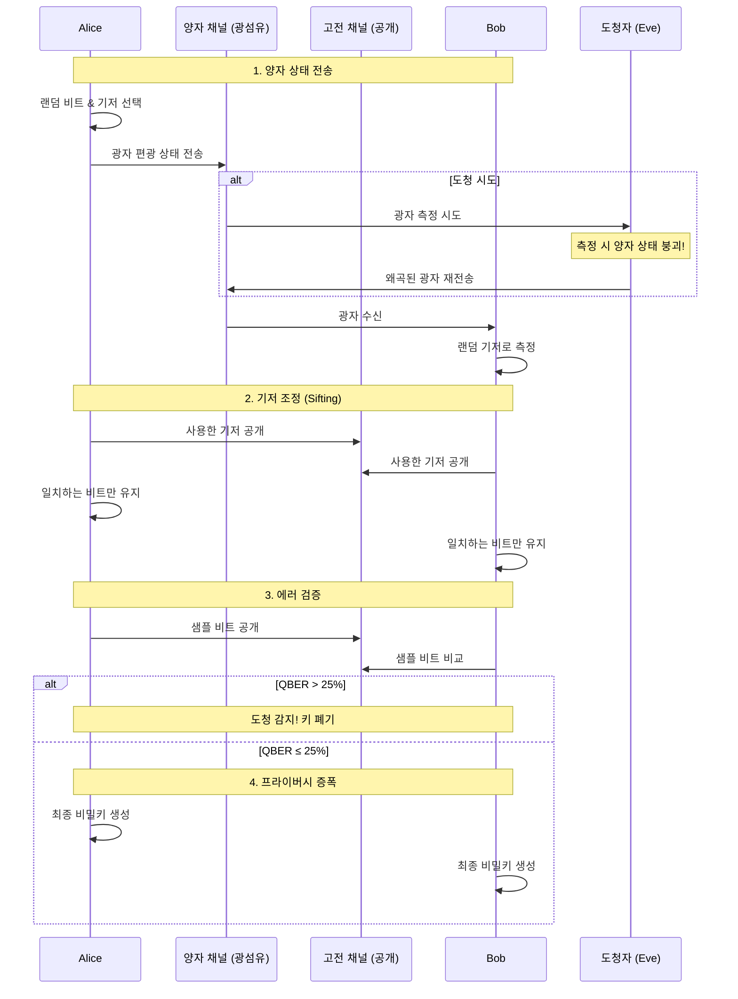

#### ▫️ BB84 프로토콜

BB84는 1984년 Charles Bennett과 Gilles Brassard가 개발한 최초의 QKD 프로토콜입니다.

**동작 과정:**

1. **준비 단계**
   - Alice가 랜덤 비트열 선택
   - 각 비트에 대해 랜덤하게 기저 선택 (직선 또는 대각선)
   - 선택한 기저로 광자의 편광 상태 설정

2. **전송 단계**
   - 광섬유를 통해 광자를 하나씩 Bob에게 전송
   - Bob이 랜덤하게 기저를 선택하여 각 광자 측정

3. **기저 조정 (Sifting)**
   - Alice와 Bob이 공개 채널에서 사용한 기저 공개
   - 기저가 일치한 비트만 유지
   - 약 50%의 비트가 폐기됨

4. **에러 검증**
   - 일부 비트를 샘플로 공개하여 에러율(QBER) 계산
   - QBER > 25%이면 도청 의심, 키 폐기
   - QBER ≤ 25%이면 다음 단계 진행

5. **에러 정정 및 프라이버시 증폭**
   - 남은 에러 제거
   - 도청자가 알 수 있는 정보 최소화
   - 최종 비밀키 생성

**편광 기저와 비트 매핑:**
```
직선 기저 (Rectilinear):
  0° (→) = 비트 0
  90° (↑) = 비트 1

대각선 기저 (Diagonal):
  45° (↗) = 비트 0
  135° (↖) = 비트 1
```

#### ▫️ MITM 공격 방어 원리

QKD가 중간자(Man-in-the-Middle) 공격을 방어하는 핵심 원리는 양자역학의 두 가지 법칙입니다.

##### 1. 복제 불가능성 원리 (No-Cloning Theorem)
- 미지의 양자 상태를 완벽하게 복제하는 것은 불가능
- 공격자가 광자를 가로채도 동일한 복사본을 만들 수 없음

##### 2. 측정 후 붕괴 (Wave Function Collapse)
- 양자 상태를 측정하면 원래 상태가 붕괴됨
- 공격자의 측정이 양자 상태를 왜곡
- 단일 광자를 정확하게 측정할 기회는 단 한 번

**도청 감지 메커니즘:**

```
정상 통신 (도청 없음):
Alice → [광자: ↗, 기저: ×] → Bob [기저: ×] → 측정: ↗
일치율: 기저 일치 시 거의 100%

도청 시도:
Alice → [광자: ↗, 기저: ×]
    → Eve [기저: + (잘못된 기저)] → 측정: → or ↑ (50% 확률로 오류)
    → Eve가 재전송 → Bob → 추가 오류 발생
일치율: 기저 일치 시에도 75% 이하로 하락
→ QBER 상승으로 도청 감지
```

공격자가 신호를 측정하는 과정에서 실수를 하게 되면 신호가 왜곡되어:
- 정확한 정보를 측정하지 못함
- 왜곡된 신호를 통해 도청자의 존재가 발각됨

##### MITM 공격의 한계점

**QKD의 약점:**
- QKD 프로토콜에 **인증 절차가 결합되지 않으면** MITM 공격을 막을 방법이 없음
- 공격자가 Alice와 Bob 각각과 독립적인 QKD 세션을 수립할 수 있음

**해결책:**
- 사전 공유 비밀키를 이용한 인증
- 양자 디지털 서명 결합
- 양자 ID 인증 프로토콜 사용

#### ⚖️ 전용선 통신과의 비교

| 구분 | QKD | 전용선 (Leased Line) |
|------|-----|---------------------|
| **물리 매체** | 광섬유 (양자 채널) | 광섬유/전용 회선 |
| **보안 원리** | 양자역학 법칙 | 물리적 격리 |
| **도청 감지** | 자동 실시간 감지 | 물리적 감시 필요 |
| **키 분배** | 자동 암호화 키 생성 | 별도 키 관리 필요 |
| **전송 속도** | 수백~수천 bps (키만) | Gbps 이상 (데이터) |
| **거리 제한** | 140km (중계 없이) | 수천 km 가능 |
| **비용** | 매우 높음 | 높음 |
| **주 용도** | 키 분배 | 데이터 전송 |

**핵심 차이:**
- 전용선: 물리적 접근 차단으로 보안, 도청 시 감지 어려움
- QKD: 양자역학 법칙으로 도청 자동 감지, 키 분배만 담당

#### ⚖️ 기존 이더넷, WiFi와의 비교

| 구분 | QKD | 이더넷 | WiFi |
|------|-----|--------|------|
| **전송 매체** | 전용 광섬유 | 유선 네트워크 | 무선 전파 |
| **연결 방식** | Point-to-Point | 공유/전용 | 공유 |
| **전송 속도** | 수백~수천 bps | Gbps | 수백 Mbps |
| **거리** | ~140km (중계 없이) | 100m (구리), km (광) | 수십~수백 m |
| **중계** | 양자 중계소 필요 | 일반 라우터/스위치 | AP, 리피터 |
| **보안 방식** | 양자역학 | 암호화 프로토콜 | WPA3 등 암호화 |
| **도청 가능성** | 감지 가능 | 감지 어려움 | 감지 어려움 |
| **멀티캐스트** | 불가능 | 가능 | 가능 |
| **주 용도** | 암호화 키 분배 | 데이터 통신 | 데이터 통신 |
| **비용** | 매우 높음 | 낮음 | 매우 낮음 |

**근본적 차이점:**

1. **물리적 구조**
   - QKD: 광자 단위 정보 전송, 전용 광케이블 필수
   - 이더넷/WiFi: 전기/전파 신호, 공유 가능

2. **보안 모델**
   - QKD: 물리 법칙 기반 보안, 도청 시 자동 감지
   - 이더넷/WiFi: 수학적 암호화, 도청 감지 불가

3. **네트워크 구조**
   - QKD: Point-to-Point만 가능, 네트워크 확장 어려움
   - 이더넷/WiFi: 다중 연결, 유연한 네트워크 구성

**실제 네트워크 성능:**
- 14km 링크: 2,493 bps 키 생성 속도
- 43km 링크: 612 bps 키 생성 속도
- 25km마다 중계소 설치 필요

**결론:**
WiFi나 이더넷 같은 공유 네트워크 환경에서는 QKD의 물리적 원리(광자의 양자 상태 활용)를 구현하기 어렵습니다. QKD는 일반 데이터 통신을 대체하는 것이 아니라, **암호화 키를 안전하게 분배**하는 보조 채널로 사용됩니다.

#### ⚠️ 실용적 한계 및 과제

**주요 제약사항:**
- 전송 손실로 인한 거리 제한
- 낮은 키 생성 속도
- 단일 광자 검출기의 기술적 한계
- 높은 구축 및 운영 비용
- 기존 네트워크 인프라와의 통합 어려움

**최신 발전 (2026):**
- 양자 중계기 기술 개발
- 후양자 암호와의 하이브리드 방식
- 위성 기반 QKD 실용화
- 상용 장비 성능 개선

### 🔐 1.3 양자 내성 암호 (PQC)

#### 🎯 개념 및 필요성

양자 내성 암호(PQC, Post-Quantum Cryptography)는 양자컴퓨터의 공격에도 안전한 암호화 알고리즘입니다. 기존 RSA와 ECC는 양자컴퓨터에 의해 무력화될 위험이 있어 PQC로의 전환이 시급한 상황입니다.

#### ▫️ 양자컴퓨터의 위협

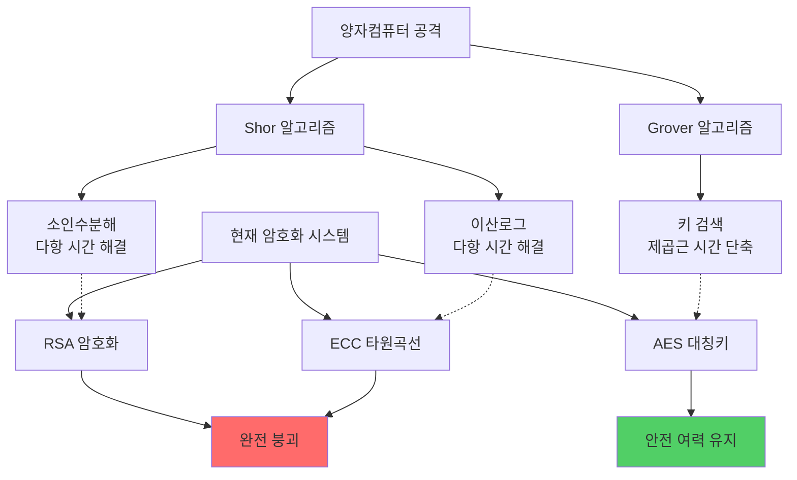

**위협 타임라인:**
- **2026년 현재**: 양자컴퓨터 실용화 임박
- **2030~2035년**: 충분한 성능의 양자컴퓨터 등장 예상
- **Harvest Now, Decrypt Later**: 현재 암호화된 데이터를 수집하여 미래에 복호화하는 위협

#### ⚖️ 기존 RSA와의 비교

| 구분 | RSA | PQC (예: ML-KEM, ML-DSA) |
|------|-----|-------------------------|
| **수학적 기반** | 소인수분해의 어려움 | 격자 문제, 코드 문제 등 |
| **양자컴퓨터 내성** | **취약** (Shor 알고리즘) | **안전** |
| **키 크기** | 2048~4096 비트 | 수 KB (훨씬 큼) |
| **연산 복잡도** | 상대적으로 낮음 | 높음 |
| **성능** | 빠름 | 상대적으로 느림 |
| **표준화** | 오래 확립됨 | 2024 NIST 표준화 완료 |
| **호환성** | 광범위한 지원 | 제한적 (확대 중) |
| **장기 안전성** | 2030년대 위험 | 장기적으로 안전 |

**RSA의 치명적 약점:**

```
RSA 원리:
1. 두 큰 소수 p, q 선택
2. n = p × q 계산 (쉬움)
3. n을 p, q로 분해 (고전컴퓨터로 매우 어려움)

Shor 알고리즘:
→ 양자컴퓨터로 소인수분해를 다항 시간에 해결
→ RSA 암호 완전 무력화
```

#### ▫️ NIST PQC 표준 (2024-2025)

NIST는 2016년부터 8년 이상의 검증 과정을 거쳐 2024년 8월 PQC 표준을 공식 발표했습니다.

**채택된 알고리즘:**

1. **ML-KEM (Module-Lattice-based Key-Encapsulation Mechanism)**
   - 구 명칭: Kyber
   - 용도: 키 교환
   - 기반: 격자 기반 암호

2. **ML-DSA (Module-Lattice-based Digital Signature Algorithm)**
   - 구 명칭: Dilithium
   - 용도: 디지털 서명
   - 기반: 격자 기반 암호

3. **SLH-DSA (Stateless Hash-based Digital Signature Algorithm)**
   - 구 명칭: SPHINCS+
   - 용도: 디지털 서명 (백업)
   - 기반: 해시 기반 암호

4. **HQC (Hamming Quasi-Cyclic)**
   - 추가 시기: 2025년 3월
   - 용도: 키 교환 (대안)
   - 기반: 코드 기반 암호

**수학적 기반 다양화:**
- 격자 문제 (Lattice-based)
- 코드 문제 (Code-based)
- 해시 함수 (Hash-based)
- 다변수 다항식 (Multivariate)

#### ▫️ 마이그레이션 전략

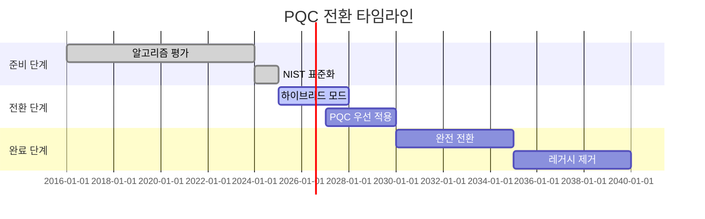

**단계별 전환 전략:**

1. **2025-2028: 하이브리드 암호화**
   - 기존 RSA/ECC + PQC 동시 사용
   - 호환성 유지하며 안전성 강화
   - 점진적 인프라 업그레이드

2. **2027-2030: PQC 우선 적용**
   - 새로운 시스템은 PQC 필수
   - 중요 데이터는 PQC로 재암호화
   - RSA/ECC는 레거시 지원만

3. **2030-2035: 완전 전환**
   - PQC를 기본 암호화로 전환
   - RSA/ECC 단계적 폐기

**권장 조합 (2026 기준):**
```
데이터 암호화: AES-256 (양자 내성)
키 교환: ML-KEM + RSA (하이브리드)
디지털 서명: ML-DSA + ECDSA (하이브리드)
해시: SHA-3
난수: QRNG
```

#### ▫️ 기술적 과제

**주요 챌린지:**
- **매우 큰 키 크기**: 수 KB로 네트워크 오버헤드 증가
- **높은 연산 복잡도**: CPU/메모리 사용량 증가
- **구현 복잡성**: 기존 시스템과의 통합 어려움
- **긴 전환 기간**: 10-20년 소요 예상
- **불확실한 타임라인**: 양자컴퓨터 실용화 시점 불확실

**최신 동향 (2026):**
- **미국 정부**: 2025년 1월 행정명령으로 연방기관 PQC 준비 의무화
- **산업계**: Google, Microsoft, AWS 등 PQC 지원 시작
- **Red Hat OpenShift 4.20**: PQC 지원 추가
- **자원 제약 환경**: IoT 디바이스용 경량 PQC 연구 활발

#### 🔐 보안 전략 권고사항

**즉시 시작할 사항:**
1. 암호화 자산 목록 작성
2. PQC 전환 로드맵 수립
3. 하이브리드 암호화 테스트
4. 직원 교육 및 인식 제고

**중장기 계획:**
1. 레거시 시스템 식별 및 업그레이드 계획
2. 공급망 PQC 준비 상태 확인
3. 규제 준수 요구사항 모니터링
4. 양자컴퓨터 발전 상황 추적

---

## 🔐 2. 비대칭키 암호화

### 🧭 2.1 개요

비대칭키 암호화(공개키 암호화)는 암호화와 복호화에 서로 다른 키를 사용하는 암호화 방식입니다. 1978년 로널드 리베스트, 아디 샤미르, 레너드 애들먼이 개발한 RSA가 최초의 실용적인 공개키 암호화 알고리즘입니다.

#### ▫️ 핵심 개념

**키 쌍 구조:**
- **공개키 (Public Key)**: 누구에게나 공개, 암호화에 사용
- **개인키 (Private Key)**: 소유자만 보관, 복호화에 사용

**수학적 원리:**
- 한 방향 함수(one-way function) 활용
- 공개키로 암호화한 데이터는 개인키로만 복호화 가능
- 개인키로 서명한 데이터는 공개키로만 검증 가능

#### ✨ 주요 특징

**장점:**
- 키 배포 문제 해결
- 디지털 서명 가능
- 키 관리가 상대적으로 용이 (n명이 통신할 때 n쌍의 키만 필요)

**단점:**
- 대칭키 대비 느린 속도
- 더 큰 키 크기 필요
- 높은 연산 복잡도

**실용적 활용:**
- 주로 대칭키를 안전하게 교환하는 데 사용
- 실제 데이터는 교환된 대칭키로 암호화
- TLS/SSL, 디지털 인증서 등에 활용

### 🔹 2.2 시퀀스 다이어그램

#### 🔐 암호화 통신 시퀀스

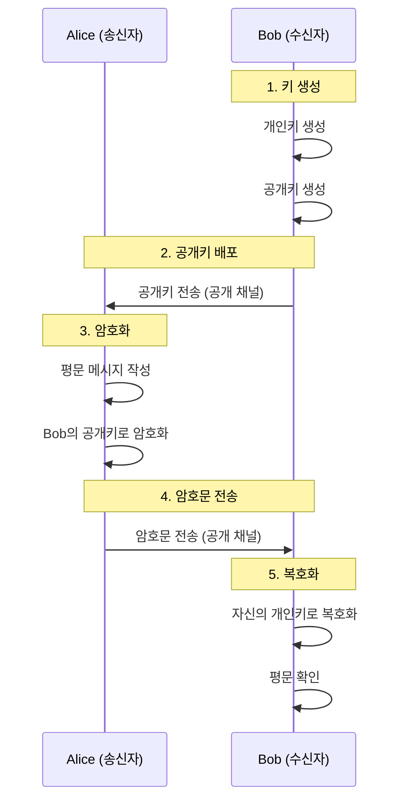

#### ▫️ 디지털 서명 시퀀스

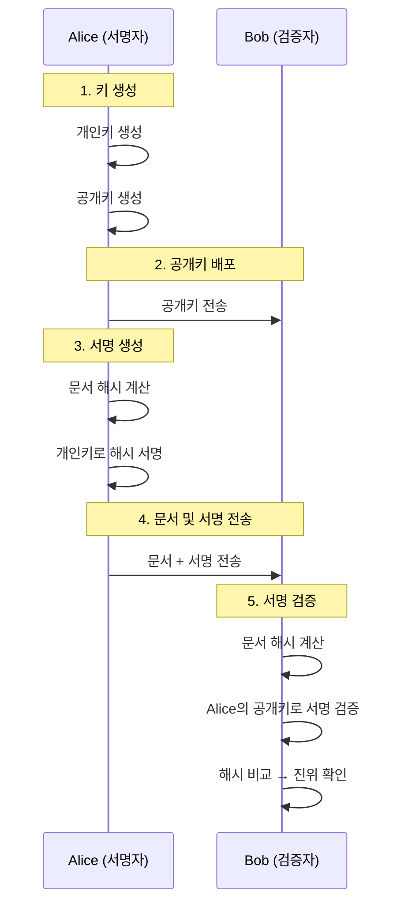

#### 🔐 하이브리드 암호화 시퀀스 (실무)

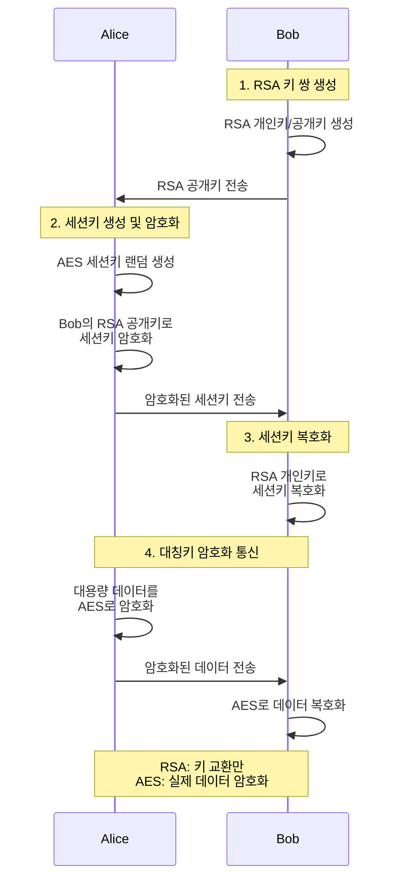

### 🔐 2.3 RSA 상세 설명

#### 🧠 수학적 원리

RSA는 **큰 수의 소인수분해가 어렵다**는 수학적 난제에 기반합니다.

**핵심 아이디어:**
- 두 큰 소수를 곱하기는 쉬움: p × q = n
- n을 다시 p와 q로 분해하기는 매우 어려움 (고전컴퓨터 기준)

**수학적 기반:**
- 페르마의 소정리
- 오일러의 정리
- 합동식과 모듈러 연산

#### ▫️ 키 생성 과정

```
1. 소수 선택
   - 두 개의 큰 소수 p, q를 랜덤하게 선택
   - 예: p = 61, q = 53 (실제로는 수백 자리 소수)

2. 모듈러스 계산
   - n = p × q
   - 예: n = 61 × 53 = 3233

3. 오일러 함수 계산
   - φ(n) = (p-1) × (q-1)
   - 예: φ(3233) = 60 × 52 = 3120

4. 공개 지수 선택
   - 1 < e < φ(n)이고 gcd(e, φ(n)) = 1인 e 선택
   - 일반적으로 e = 65537 (2^16 + 1) 사용
   - 예: e = 17

5. 개인 지수 계산
   - d × e ≡ 1 (mod φ(n))를 만족하는 d 계산
   - 확장 유클리드 호제법 사용
   - 예: d = 2753 (17 × 2753 mod 3120 = 1)

6. 키 쌍 생성
   - 공개키: (e, n) = (17, 3233)
   - 개인키: (d, n) = (2753, 3233)
   - p, q, φ(n)은 폐기
```

#### 🔐 암호화 및 복호화

```
암호화 (공개키 사용):
  C = M^e mod n

  예: 평문 M = 123
      C = 123^17 mod 3233 = 855

복호화 (개인키 사용):
  M = C^d mod n

  예: 암호문 C = 855
      M = 855^2753 mod 3233 = 123
```

**수학적 증명:**
```
M = C^d mod n
  = (M^e)^d mod n
  = M^(ed) mod n

ed ≡ 1 (mod φ(n))이므로
ed = 1 + k·φ(n) (k는 정수)

오일러 정리에 의해:
M^(ed) = M^(1 + k·φ(n))
       = M · (M^φ(n))^k
       ≡ M · 1^k
       ≡ M (mod n)
```

#### 🧪 구현 예제

```python
def gcd(a: int, b: int) -> int:
    """최대공약수 계산"""
    while b:
        a, b = b, a % b
    return a

def extended_gcd(a: int, b: int) -> tuple:
    """확장 유클리드 호제법"""
    if a == 0:
        return b, 0, 1
    gcd_val, x1, y1 = extended_gcd(b % a, a)
    x = y1 - (b // a) * x1
    y = x1
    return gcd_val, x, y

def mod_inverse(e: int, phi: int) -> int:
    """모듈러 역원 계산"""
    gcd_val, x, _ = extended_gcd(e, phi)
    if gcd_val != 1:
        raise ValueError("역원이 존재하지 않습니다")
    return x % phi

def generate_keypair(p: int, q: int) -> tuple:
    """RSA 키 쌍 생성"""
    # n 계산
    n = p * q

    # φ(n) 계산
    phi = (p - 1) * (q - 1)

    # e 선택 (일반적으로 65537 사용)
    e = 65537
    if gcd(e, phi) != 1:
        raise ValueError("e와 φ(n)이 서로소가 아닙니다")

    # d 계산
    d = mod_inverse(e, phi)

    # 공개키: (e, n), 개인키: (d, n)
    return ((e, n), (d, n))

def encrypt(public_key: tuple, plaintext: int) -> int:
    """RSA 암호화"""
    e, n = public_key
    return pow(plaintext, e, n)

def decrypt(private_key: tuple, ciphertext: int) -> int:
    """RSA 복호화"""
    d, n = private_key
    return pow(ciphertext, d, n)

# 사용 예제
if __name__ == "__main__":
    # 키 생성 (실제로는 훨씬 큰 소수 사용)
    p = 61
    q = 53
    public_key, private_key = generate_keypair(p, q)

    print(f"공개키: {public_key}")
    print(f"개인키: {private_key}")

    # 암호화
    message = 123
    encrypted = encrypt(public_key, message)
    print(f"평문: {message}")
    print(f"암호문: {encrypted}")

    # 복호화
    decrypted = decrypt(private_key, encrypted)
    print(f"복호화: {decrypted}")
```

#### 🔐 보안 강도

**키 크기별 보안 수준:**
```
RSA-1024: 약 80비트 보안 (더 이상 권장 안 됨)
RSA-2048: 약 112비트 보안 (현재 최소 권장)
RSA-3072: 약 128비트 보안 (권장)
RSA-4096: 약 140비트 보안 (고보안)
```

**양자컴퓨터 영향:**
- Shor 알고리즘: O(log n)^3 시간에 소인수분해
- 충분한 큐비트 양자컴퓨터 등장 시 RSA 완전 무력화
- 예상 시기: 2030~2035년

#### ▫️ 실제 사용 사례

**TLS/SSL 핸드셰이크:**
1. 클라이언트가 서버 인증서에서 RSA 공개키 획득
2. 클라이언트가 랜덤 세션키 생성
3. RSA 공개키로 세션키 암호화하여 전송
4. 서버가 RSA 개인키로 세션키 복호화
5. 이후 세션키로 AES 대칭키 암호화 통신

**디지털 서명:**
- 문서 해시를 개인키로 서명
- 공개키로 서명 검증
- 인증서, 소프트웨어 서명 등에 사용

**키 교환:**
- 대칭키를 안전하게 전달
- 실제 데이터는 대칭키로 암호화
- 성능과 보안의 균형

**현재 상태 (2026):**
- 여전히 광범위하게 사용 중
- 하이브리드 PQC 전환 시작
- 2030년대 단계적 폐기 예정

---

## 🔐 3. 대칭키 암호화

### 🧭 3.1 개요

대칭키 암호화는 암호화와 복호화에 **동일한 키**를 사용하는 암호화 방식입니다. 가장 오래되고 기본적인 암호화 방식으로, 빠른 속도와 효율성이 특징입니다.

#### ▫️ 핵심 개념

**단일 키 구조:**
- 암호화 키 = 복호화 키
- 양 당사자가 동일한 비밀키 공유 필요

**동작 원리:**
- 평문 + 비밀키 → 암호문 (암호화)
- 암호문 + 비밀키 → 평문 (복호화)

#### ✨ 주요 특징

**장점:**
- 매우 빠른 암호화/복호화 속도
- 낮은 연산 복잡도
- CPU/메모리 사용량 적음
- 구현이 상대적으로 간단
- 대용량 데이터 처리에 적합

**단점:**
- 키 배포 문제 (n명이 통신 시 n(n-1)/2개의 키 필요)
- 키 관리의 어려움
- 비대칭키 없이는 안전한 키 교환 어려움
- 부인 방지 기능 없음

**실용적 활용:**
- 대용량 파일 암호화
- 데이터베이스 암호화
- 디스크 암호화
- VPN 통신
- 실시간 스트리밍 암호화

### 🔹 3.2 시퀀스 다이어그램

#### 🔐 기본 대칭키 암호화 시퀀스

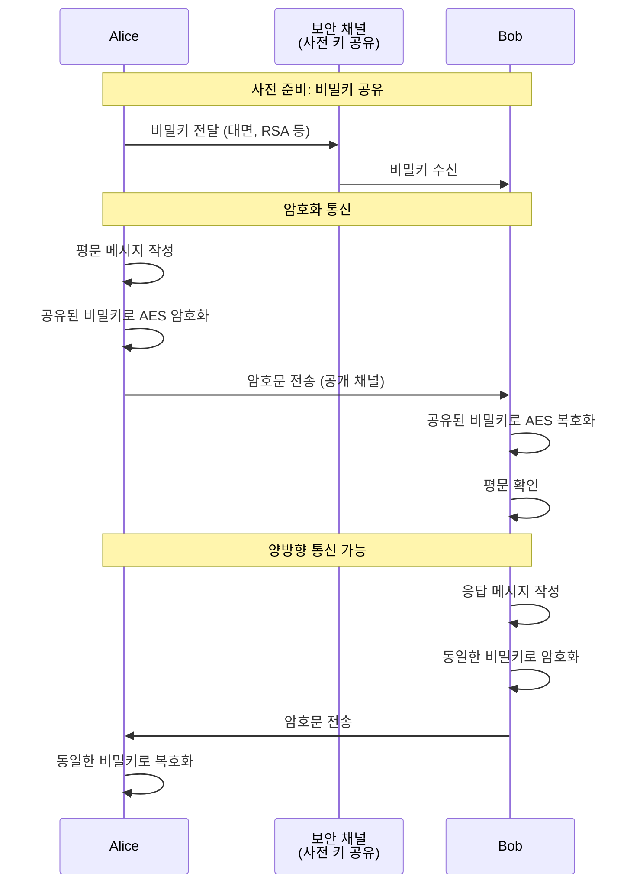

#### 🔐 실무 키 교환 시퀀스 (RSA + AES)

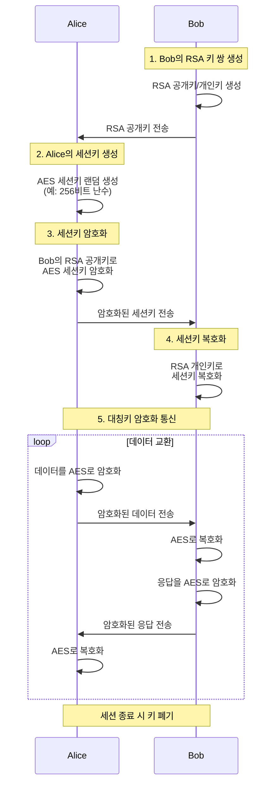

#### 🔐 Diffie-Hellman 키 교환 + AES

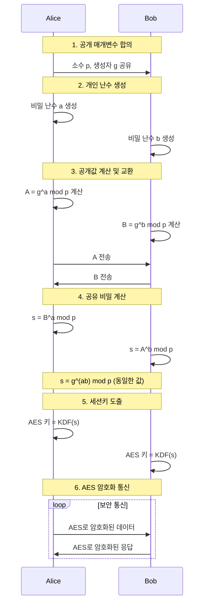

### 🔐 3.3 AES 상세 설명

#### 🧭 AES 개요

AES(Advanced Encryption Standard)는 2001년 미국 NIST가 채택한 표준 대칭키 암호화 알고리즘입니다. DES를 대체하기 위해 개발되었으며, 현재 전 세계에서 가장 널리 사용되는 암호화 알고리즘입니다.

**기본 사양:**
- 블록 크기: 128비트 고정
- 키 크기: 128, 192, 256비트 선택 가능
- 구조: SPN (Substitution-Permutation Network)
- 라운드 수: 키 크기에 따라 10, 12, 14 라운드

#### 🔐 AES 변형

| 변형 | 키 크기 | 블록 크기 | 라운드 수 | 보안 수준 |
|------|---------|----------|----------|----------|
| AES-128 | 128비트 | 128비트 | 10 | 128비트 |
| AES-192 | 192비트 | 128비트 | 12 | 192비트 |
| AES-256 | 256비트 | 128비트 | 14 | 256비트 |

**양자컴퓨터 내성:**
- Grover 알고리즘: 키 검색을 √N 시간으로 단축
- AES-128: 128비트 → 64비트 보안 수준 (취약)
- AES-256: 256비트 → 128비트 보안 수준 (안전)
- **권장**: 양자컴퓨팅 시대에는 AES-256 사용

#### 🏗️ AES 구조

AES는 데이터를 4×4 바이트 행렬(State)로 처리합니다.

```
평문 (128비트 = 16바이트):
┌────┬────┬────┬────┐
│ b0 │ b4 │ b8 │b12 │
├────┼────┼────┼────┤
│ b1 │ b5 │ b9 │b13 │
├────┼────┼────┼────┤
│ b2 │ b6 │b10 │b14 │
├────┼────┼────┼────┤
│ b3 │ b7 │b11 │b15 │
└────┴────┴────┴────┘
(열 우선 배열)
```

#### ▫️ 키 스케줄 (Key Expansion)

128/192/256비트의 마스터 키를 확장하여 각 라운드에서 사용할 라운드 키를 생성합니다.

```
AES-128 예제:
마스터 키 (128비트)
  ↓
키 확장 알고리즘
  ↓
11개의 라운드 키 (각 128비트)
  - 초기 라운드 키 (0라운드)
  - 10개의 라운드 키 (1~10라운드)
```

#### 🏗️ AES 라운드 구조

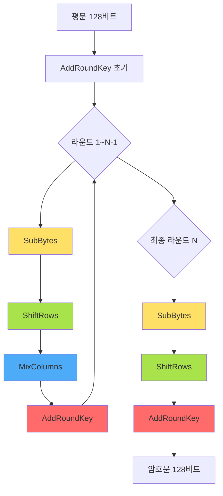

#### ▫️ 4가지 라운드 연산

##### 1. SubBytes (바이트 치환)

각 바이트를 S-Box(Substitution Box) 룩업 테이블을 사용하여 다른 바이트로 치환합니다.

```
원리: 비선형 변환으로 혼돈(confusion) 제공

예제:
입력 바이트: 0x53
S-Box[0x53] = 0xED
출력 바이트: 0xED

┌────┬────┐      ┌────┬────┐
│ 53 │ 30 │      │ ED │ 04 │
├────┼────┤ S-Box├────┼────┤
│ 01 │ 67 │  →   │ 7C │ C5 │
└────┴────┘      └────┴────┘
```

##### 2. ShiftRows (행 이동)

행렬의 각 행을 왼쪽으로 순환 이동합니다.

```
원리: 확산(diffusion) 제공

이동 규칙:
- 1행: 이동 없음
- 2행: 1바이트 왼쪽 이동
- 3행: 2바이트 왼쪽 이동
- 4행: 3바이트 왼쪽 이동

예제:
┌────┬────┬────┬────┐      ┌────┬────┬────┬────┐
│ b0 │ b4 │ b8 │b12 │      │ b0 │ b4 │ b8 │b12 │
├────┼────┼────┼────┤      ├────┼────┼────┼────┤
│ b1 │ b5 │ b9 │b13 │  →   │ b5 │ b9 │b13 │ b1 │
├────┼────┼────┼────┤      ├────┼────┼────┼────┤
│ b2 │ b6 │b10 │b14 │      │b10 │b14 │ b2 │ b6 │
├────┼────┼────┼────┤      ├────┼────┼────┼────┤
│ b3 │ b7 │b11 │b15 │      │b15 │ b3 │ b7 │b11 │
└────┴────┴────┴────┘      └────┴────┴────┴────┘
```

##### 3. MixColumns (열 혼합)

각 열에 대해 갈루아 필드 상의 행렬 곱셈을 수행합니다.

```
원리: 각 열의 4바이트를 혼합하여 확산 강화

수학적 연산:
┌────┐   ┌────────────────┐   ┌────┐
│ s0'│   │ 02 03 01 01  │   │ s0 │
│ s1'│ = │ 01 02 03 01  │ × │ s1 │ (GF(2^8))
│ s2'│   │ 01 01 02 03  │   │ s2 │
│ s3'│   │ 03 01 01 02  │   │ s3 │
└────┘   └────────────────┘   └────┘

주의: 최종 라운드에서는 생략
```

##### 4. AddRoundKey (라운드 키 추가)

현재 State와 라운드 키를 XOR 연산합니다.

```
원리: 키 의존성 추가

연산:
State ⊕ RoundKey = NewState

예제:
  ┌────┬────┐     ┌────┬────┐     ┌────┬────┐
  │ A4 │ 68 │     │ 2B │ 7E │     │ 8F │ 16 │
  ├────┼────┤  ⊕  ├────┼────┤  =  ├────┼────┤
  │ 37 │ 94 │     │ 15 │ 16 │     │ 22 │ 82 │
  └────┴────┘     └────┴────┘     └────┴────┘
  State        RoundKey        NewState
```

#### 🔐 AES 암호화 전체 과정

```
입력: 평문 (128비트), 마스터 키 (128/192/256비트)

1. 키 확장
   마스터 키 → 라운드 키 배열 생성

2. 초기 라운드
   AddRoundKey(State, RoundKey[0])

3. 메인 라운드 (1 ~ N-1 라운드)
   FOR round = 1 TO N-1:
       SubBytes(State)
       ShiftRows(State)
       MixColumns(State)
       AddRoundKey(State, RoundKey[round])

4. 최종 라운드 (N 라운드)
   SubBytes(State)
   ShiftRows(State)
   AddRoundKey(State, RoundKey[N])  // MixColumns 생략

5. 출력: 암호문 (128비트)

N = 10 (AES-128), 12 (AES-192), 14 (AES-256)
```

#### ▫️ 복호화 과정

AES 복호화는 암호화의 역과정입니다.

```
역변환 사용:
- InvSubBytes (역 S-Box 사용)
- InvShiftRows (오른쪽으로 이동)
- InvMixColumns (역행렬 사용)
- AddRoundKey (XOR은 자기 역원)

복호화 순서:
1. AddRoundKey(State, RoundKey[N])
2. FOR round = N-1 DOWNTO 1:
       InvShiftRows(State)
       InvSubBytes(State)
       AddRoundKey(State, RoundKey[round])
       InvMixColumns(State)
3. InvShiftRows(State)
   InvSubBytes(State)
   AddRoundKey(State, RoundKey[0])
```

#### ▫️ 운영 모드 (Modes of Operation)

AES는 블록 암호이므로 여러 블록을 암호화하기 위한 운영 모드가 필요합니다.

##### 1. ECB (Electronic Codebook)

```
특징: 각 블록을 독립적으로 암호화
장점: 병렬 처리 가능, 간단
단점: 동일 평문 → 동일 암호문 (패턴 노출)
권장: 사용하지 말 것!

┌────────┐    ┌────────┐    ┌────────┐
│ Block1 │    │ Block2 │    │ Block3 │
└───┬────┘    └───┬────┘    └───┬────┘
    │ AES-E      │ AES-E      │ AES-E
    ↓             ↓             ↓
┌───────┐    ┌────────┐    ┌────────┐
│Cipher1│    │Cipher2 │    │Cipher3 │
└───────┘    └────────┘    └────────┘
```

##### 2. CBC (Cipher Block Chaining)

```
특징: 이전 암호문을 다음 평문과 XOR
장점: 동일 평문 → 다른 암호문
단점: 순차 처리 필요
권장: 일반적인 용도에 적합

IV (Initialization Vector)
 │
 ↓  ⊕
┌────────┐    ┌────────┐
│ Block1 │    │ Block2 │
└───┬────┘    └───┬────┘
    │ AES-E      ↑ AES-E
    ↓            │
┌───────┐────────┘
│Cipher1│
└───────┘
```

##### 3. CTR (Counter)

```
특징: 카운터를 암호화하여 키스트림 생성
장점: 병렬 처리 가능, 랜덤 액세스
단점: 카운터 관리 필요
권장: 고성능 환경에 적합

Nonce+Counter1  Nonce+Counter2  Nonce+Counter3
     ↓ AES-E         ↓ AES-E         ↓ AES-E
 KeyStream1      KeyStream2      KeyStream3
     ↓ ⊕             ↓ ⊕             ↓ ⊕
   Block1          Block2          Block3
     ↓               ↓               ↓
  Cipher1         Cipher2         Cipher3
```

##### 4. GCM (Galois/Counter Mode)

```
특징: CTR + 인증 태그
장점: 암호화 + 무결성 검증
단점: 구현 복잡
권장: TLS 1.3 표준, 최신 시스템

암호화: CTR 모드
인증: GMAC (Galois Message Authentication Code)
출력: 암호문 + 인증 태그
```

#### 🔐 보안 강도

**현재 상태 (2026):**
- AES-128: 고전 컴퓨터에는 안전, 양자 컴퓨터에는 취약
- AES-192: 고전 컴퓨터에 안전, 양자 컴퓨터에 부분 안전
- AES-256: 고전 및 양자 컴퓨터에 모두 안전

**공격 시나리오:**
- 전수 공격(Brute Force): 2^128, 2^192, 2^256 시도 필요
- 관련 키 공격: 이론적 약점 존재하나 실용적 위협 아님
- 부채널 공격: 구현 취약점 공격 (타이밍, 전력 분석 등)

**권장 사항:**
- 일반 용도: AES-128 또는 AES-256
- 고보안: AES-256
- 양자 대비: AES-256
- 운영 모드: GCM 또는 CBC (IV 필수)
- 키 관리: QRNG 또는 안전한 PRNG 사용

#### ▫️ 실제 사용 사례

**1. 디스크 암호화**
- BitLocker (Windows): AES-128/256
- FileVault (macOS): AES-256
- LUKS (Linux): AES-256 (기본)

**2. 네트워크 통신**
- TLS 1.3: AES-128-GCM, AES-256-GCM
- VPN (IPsec): AES-256-CBC, AES-256-GCM
- WPA3 (WiFi): AES-256-GCM

**3. 파일 암호화**
- 7-Zip: AES-256
- VeraCrypt: AES, 다중 암호화 지원
- GnuPG: AES-128/192/256

**4. 데이터베이스**
- MySQL: AES-128/192/256
- PostgreSQL: AES-256
- Oracle TDE: AES-256

**5. 클라우드 스토리지**
- AWS S3: AES-256
- Google Cloud: AES-256
- Azure Storage: AES-256

#### 🧪 구현 예제 (Python)

```python
from Crypto.Cipher import AES
from Crypto.Random import get_random_bytes
from Crypto.Util.Padding import pad, unpad

def aes_encrypt(plaintext: bytes, key: bytes) -> tuple:
    """AES-256-CBC 암호화"""
    # IV 생성 (16바이트 랜덤)
    iv = get_random_bytes(AES.block_size)

    # AES 암호화 객체 생성
    cipher = AES.new(key, AES.MODE_CBC, iv)

    # 평문을 16바이트 배수로 패딩
    padded_plaintext = pad(plaintext, AES.block_size)

    # 암호화
    ciphertext = cipher.encrypt(padded_plaintext)

    return iv, ciphertext

def aes_decrypt(iv: bytes, ciphertext: bytes, key: bytes) -> bytes:
    """AES-256-CBC 복호화"""
    # AES 복호화 객체 생성
    cipher = AES.new(key, AES.MODE_CBC, iv)

    # 복호화
    padded_plaintext = cipher.decrypt(ciphertext)

    # 패딩 제거
    plaintext = unpad(padded_plaintext, AES.block_size)

    return plaintext

# 사용 예제
if __name__ == "__main__":
    # AES-256 키 생성 (32바이트 = 256비트)
    key = get_random_bytes(32)
    print(f"키 (hex): {key.hex()}")

    # 평문
    message = b"Hello, AES-256 Encryption!"
    print(f"평문: {message.decode()}")

    # 암호화
    iv, ciphertext = aes_encrypt(message, key)
    print(f"IV (hex): {iv.hex()}")
    print(f"암호문 (hex): {ciphertext.hex()}")

    # 복호화
    decrypted = aes_decrypt(iv, ciphertext, key)
    print(f"복호화: {decrypted.decode()}")
```

#### 🧪 GCM 모드 예제

```python
from Crypto.Cipher import AES
from Crypto.Random import get_random_bytes

def aes_gcm_encrypt(plaintext: bytes, key: bytes, aad: bytes = b"") -> tuple:
    """AES-256-GCM 암호화 (인증 포함)"""
    # Nonce 생성 (12바이트 권장)
    nonce = get_random_bytes(12)

    # AES-GCM 암호화 객체 생성
    cipher = AES.new(key, AES.MODE_GCM, nonce=nonce)

    # 추가 인증 데이터 (AAD) 추가
    if aad:
        cipher.update(aad)

    # 암호화 및 태그 생성
    ciphertext, tag = cipher.encrypt_and_digest(plaintext)

    return nonce, ciphertext, tag

def aes_gcm_decrypt(nonce: bytes, ciphertext: bytes, tag: bytes,
                    key: bytes, aad: bytes = b"") -> bytes:
    """AES-256-GCM 복호화 (인증 검증)"""
    # AES-GCM 복호화 객체 생성
    cipher = AES.new(key, AES.MODE_GCM, nonce=nonce)

    # AAD 추가
    if aad:
        cipher.update(aad)

    # 복호화 및 태그 검증
    plaintext = cipher.decrypt_and_verify(ciphertext, tag)

    return plaintext

# 사용 예제
if __name__ == "__main__":
    # AES-256 키 생성
    key = get_random_bytes(32)

    # 평문 및 추가 인증 데이터
    message = b"Confidential Data"
    aad = b"metadata:version=1.0"

    # 암호화
    nonce, ciphertext, tag = aes_gcm_encrypt(message, key, aad)
    print(f"Nonce: {nonce.hex()}")
    print(f"암호문: {ciphertext.hex()}")
    print(f"인증 태그: {tag.hex()}")

    # 복호화
    try:
        decrypted = aes_gcm_decrypt(nonce, ciphertext, tag, key, aad)
        print(f"복호화 성공: {decrypted.decode()}")
    except ValueError:
        print("인증 실패! 데이터가 변조되었습니다.")
```

---

## 📌 요약 및 권장사항

### 🛠️ 암호화 기술 선택 가이드 (2026)

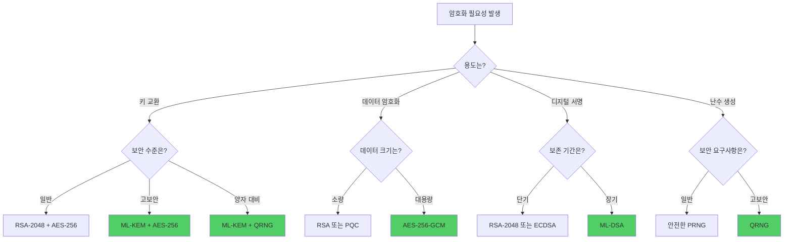

### 🔹 시기별 권장 전략

**2026-2028 (현재-단기):**
- 대칭키: AES-256-GCM
- 비대칭키: RSA-2048 + PQC 하이브리드
- 디지털 서명: ECDSA + ML-DSA 하이브리드
- 난수: QRNG (가능 시) 또는 안전한 PRNG
- 해시: SHA-256 또는 SHA-3

**2028-2030 (중기):**
- 대칭키: AES-256-GCM
- 비대칭키: PQC 우선, RSA 보조
- 디지털 서명: ML-DSA 우선
- 난수: QRNG 우선
- QKD: 고보안 환경에 선택적 도입

**2030+ (장기):**
- 대칭키: AES-256 또는 차세대 알고리즘
- 비대칭키: PQC만 사용
- 디지털 서명: ML-DSA, SLH-DSA
- 난수: QRNG 표준
- QKD: 정부/금융 등 확대
- RSA/ECC: 레거시 지원만

### 🔹 핵심 메시지

1. **양자 위협은 현실**
   - 2030년대 충분한 성능의 양자컴퓨터 등장 예상
   - "Harvest Now, Decrypt Later" 위협
   - 지금부터 PQC 전환 준비 필수

2. **AES는 여전히 안전**
   - AES-256은 양자컴퓨터에도 안전
   - 대칭키 암호화는 계속 사용 가능
   - QRNG로 키 생성 시 보안 강화

3. **RSA는 단계적 퇴출**
   - RSA/ECC는 양자컴퓨터에 취약
   - PQC로 단계적 전환 필요
   - 하이브리드 모드로 안전성 유지

4. **양자 기술의 역할**
   - QRNG: 진정한 난수 생성
   - QKD: 완벽한 키 분배 (제한적)
   - PQC: 양자컴퓨터 내성 암호

5. **실용적 접근**
   - 현재: RSA + AES (안전)
   - 전환기: RSA/PQC 하이브리드 + AES
   - 미래: PQC + AES

---

## 🔗 참고 자료

### 🔹 양자 난수 생성 (QRNG)
- [양자난수생성기 – ID Quantique](https://idquantique.co.kr/random-number-generation/random-number-generation/)
- [암호학: 양자 난수 생성기(QRNG) 구현](https://www.jaenung.net/tree/7916)
- [난수생성 - 나무위키](https://namu.wiki/w/%EB%82%9C%EC%88%98%EC%83%9D%EC%84%B1)
- [빛으로 스마트폰 암호를 만든다? 양자보안의 세계 – SK텔레콤](https://news.sktelecom.com/123142)
- [Quantum Random Number Generator - BYU](https://camacholab.byu.edu/qrng)
- [QRNG Overview - ID Quantique](https://www.idquantique.com/random-number-generation/overview/)

### 🔹 양자 키 분배 (QKD)
- [양자 키 분배 - 위키백과](https://ko.wikipedia.org/wiki/%EC%96%91%EC%9E%90_%ED%82%A4_%EB%B6%84%EB%B0%B0)
- [양자 키 분배(QKD)란 무엇인가 | 포티넷](https://www.fortinet.com/resources/cyberglossary/quantum-key-distribution)
- [QKD (Quantum Key Distribution) | Fasoo](https://www.fasoo.com/glossary/q/qkd-quantum-key-distribution-%EC%96%91%EC%9E%90-%ED%82%A4-%EB%B6%84%EB%B0%B0)
- [양자 암호화란 무엇인가요? - IBM](https://www.ibm.com/think/topics/quantum-cryptography)
- [BB84 Protocol - Wikipedia](https://en.wikipedia.org/wiki/BB84)
- [Quantum Key Distribution and BB84 Protocol - Medium](https://medium.com/quantum-untangled/quantum-key-distribution-and-bb84-protocol-6f03cc6263c5)

### 🔐 양자 내성 암호 (PQC)
- [양자 내성 암호 (PQC) 현실적인 심층 분석 - 본헤럴드](https://www.bonhd.net/news/articleView.html?idxno=17554)
- [2025년 최신 양자 내성 암호(PQC) 표준 | Penta Security](https://www.pentasecurity.co.kr/insight/2025-post-quantum-cryptography-standard/)
- [PQC - 나무위키](https://namu.wiki/w/PQC)
- [Post-Quantum Cryptography: Purpose and Encryption Standards | Entrust](https://www.entrust.com/resources/learn/post-quantum-cryptography)
- [Post-quantum cryptography: The future of encryption | NordVPN](https://nordvpn.com/blog/post-quantum-cryptography/)
- [Quantum Computing Threat: The Ultimate 2026 PQC Survival Guide](https://techgenyz.com/quantum-computing-post-quantum-cryptography-threat/)

### 🔐 RSA 암호화
- [RSA 암호 - 위키백과](https://ko.wikipedia.org/wiki/RSA_%EC%95%94%ED%98%B8)
- [RSA 암호화 - 나무위키](https://namu.wiki/w/RSA%20%EC%95%94%ED%98%B8%ED%99%94)
- [RSA 암호의 원리](https://blog.sechack.kr/117)
- [RSA 암호화 3분 만에 이해하기](https://velog.io/@480/RSA-%EC%95%94%ED%98%B8%ED%99%94-3%EB%B6%84-%EB%A7%8C%EC%97%90-%EC%9D%B4%ED%95%B4%ED%95%98%EA%B8%B0)
- [RSA Algorithm in Cryptography - GeeksforGeeks](https://www.geeksforgeeks.org/computer-networks/rsa-algorithm-cryptography/)
- [What is RSA encryption? | NordVPN](https://nordvpn.com/blog/rsa-encryption/)

### 🔐 AES 암호화
- [AES - 나무위키](https://namu.wiki/w/AES)
- [고급 암호화 표준 - 위키백과](https://ko.wikipedia.org/wiki/%EA%B3%A0%EA%B8%89_%EC%95%94%ED%98%B8%ED%99%94_%ED%91%9C%EC%A4%80)
- [AES(Advanced Encryption Standard) 개념, 원리, 장단점](https://onecoin-life.com/73)
- [AES 암호 알고리즘 - Crocus](https://www.crocus.co.kr/1230)
- [Advanced Encryption Standard (AES) - GeeksforGeeks](https://www.geeksforgeeks.org/computer-networks/advanced-encryption-standard-aes/)
- [Advanced Encryption Standard - Wikipedia](https://en.wikipedia.org/wiki/Advanced_Encryption_Standard)

### ⚖️ 대칭키 vs 비대칭키
- [공개 키 암호화 방식 - 나무위키](https://namu.wiki/w/%EA%B3%B5%EA%B0%9C%20%ED%82%A4%20%EC%95%94%ED%98%B8%ED%99%94%20%EB%B0%A9%EC%8B%9D)
- [대칭 키 암호 - 위키백과](https://ko.wikipedia.org/wiki/%EB%8C%80%EC%B9%AD_%ED%82%A4_%EC%95%94%ED%98%B8)
- [공개키 암호화와 대칭키 암호화 이해하기](https://store-kr.dcentwallet.com/blogs/post/%EA%B3%B5%EA%B0%9C%ED%82%A4-%EB%8C%80%EC%B9%AD%ED%82%A4-%EC%95%94%ED%98%B8%ED%99%94-%EC%9D%B4%ED%95%B4%ED%95%98%EA%B8%B0)
- [양자컴퓨팅 시대의 암호기술: AES, SHA-3, PQC | PLURA](https://blog.plura.io/ko/column/quantum-era-cryptography/)

---

*본 문서는 2026년 1월 30일 기준으로 작성되었으며, 최신 웹 검색 결과를 바탕으로 작성되었습니다.*
