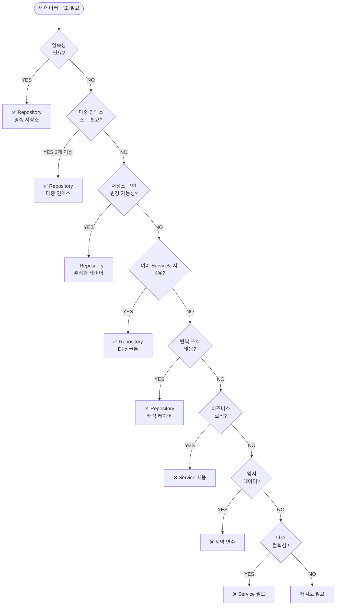

# 🔍 Repository 패턴 사용 기준 분석

## 🧪 1. 코드베이스의 Repository 현황

### 🗄️ 1.1 존재하는 Repository 목록

| Repository | 인터페이스 | 구현체 | 저장소 타입 | 용도 |
|-----------|----------|--------|------------|------|
| **DbRepository** | IDbRepository | DbRepository | **LiteDB (영속)** | BtCollision 데이터 캐싱 |
| **DocumentRepository** | IDocumentRepository | DocumentRepository | **메모리** | Document 엔티티 관리 |
| **ModelRepository** | IModelRepository | ModelRepository | **메모리** | Model 엔티티 관리 |
| **ModelItemRepository** | IModelItemRepository | ModelItemRepository | **메모리 (다중 인덱스)** | ModelItem 엔티티 관리 |

---

## 🔍 2. Repository가 있는 경우 상세 분석

### 🗂️ 2.1 DbRepository (영속 저장소)

#### 🗂️ 저장소 구현
```csharp
public class DbRepository : IDbRepository
{
    private BLiteDbEx _db;  // LiteDB 래퍼
    private string _dbFilePath;
}
```

#### ✨ 주요 특징
- **영속성**: 파일 시스템에 데이터 저장 (`{modelName}.mepia_db`)
- **비동기 초기화**: DocumentRepository에서 Document가 로드될 때까지 대기
- **CRUD 지원**: Query, Get, Count, Upsert, Delete
- **데이터 타입**: BtCollision (충돌/연결 상태 캐싱)

#### 🧪 코드 예시
```csharp
// 위치: Assets\Scripts\Core\Data\Repositories\Implementations\DbRepository.cs

private async void _Init(IDocumentRepository documentRepository)
{
    IReadOnlyList<Document> documents;

    while (true)
    {
        await UniTask.Delay(100);
        documents = await documentRepository.GetAllAsync();

        if (documents.Any())
            break;
    }

    var modelName = documents.First().Models.First().Name;
    _dbFilePath = Path.Combine(Application.persistentDataPath, $"{modelName}.mepia_db");
    _db = new BLiteDbEx(_dbFilePath);
    _db.InitTable<BtCollision>();
}

public BtCollision GetCollision(string id)
{
    var collisionCollection = _db.GetCollection<BtCollision>();
    var res = collisionCollection.FindById(id);
    return res;
}
```

#### ▫️ 사용 사례
```csharp
// ConnectionAnalyzer.GetConnectionStateWithBurst (162-203번 라인)
if (dbRepository != null)
{
    var idStr = string.Compare(item1.UniqueIdKey, item2.UniqueIdKey, StringComparison.Ordinal) > 0
        ? $"{item1.UniqueIdKey}_{item2.UniqueIdKey}"
        : $"{item1.UniqueIdKey}_{item2.UniqueIdKey}";
    var collision = dbRepository.GetCollision(idStr);

    if (collision != null)
    {
        return collision.state switch
        {
            BtCollision.State.NONE => ConnectionState.None,
            BtCollision.State.CONNECT => ConnectionState.Connected,
            BtCollision.State.CLASH => ConnectionState.Clash,
        };
    }
}
```

---

### 🗂️ 2.2 DocumentRepository (메모리 저장소)

#### 🗂️ 저장소 구현
```csharp
public class DocumentRepository : IDocumentRepository
{
    private readonly List<Document> _documents = new();
    private readonly object _lock = new();  // 스레드 안전성
}
```

#### ✨ 주요 특징
- **메모리 전용**: 런타임 데이터만 관리
- **스레드 안전**: lock을 사용한 동시성 제어
- **비동기 API**: UniTask 기반 async 메서드 제공
- **단순 CRUD**: Add, Get, GetAll, GetCount, Clear

#### 🧪 코드 예시
```csharp
// 위치: Assets\Scripts\Core\Data\Repositories\Implementations\DocumentRepository.cs

public UniTask AddAsync(Document document, CancellationToken cancellation = default)
{
    lock (_lock)
    {
        if (!_documents.Contains(document))
        {
            _documents.Add(document);
        }
    }
    return UniTask.CompletedTask;
}

public UniTask<IReadOnlyList<Document>> GetAllAsync(CancellationToken cancellation = default)
{
    lock (_lock)
    {
        return UniTask.FromResult<IReadOnlyList<Document>>(_documents.ToList());
    }
}
```

---

### 🗂️ 2.3 ModelRepository (메모리 저장소)

#### 🗂️ 저장소 구현
```csharp
public class ModelRepository : IModelRepository
{
    private readonly List<Model> _models = new();
    private readonly object _lock = new();
}
```

#### ✨ 주요 특징
- **메모리 전용**: Document와 유사한 패턴
- **동기/비동기 API**: 동기(Add, Get, GetAll)와 비동기(AddAsync, GetAsync, GetAllAsync) 모두 지원
- **스레드 안전**: lock 사용

#### 🧪 코드 예시
```csharp
// 위치: Assets\Scripts\Core\Data\Repositories\Implementations\ModelRepository.cs

public void Add(Model model)
{
    if (_models.Contains(model))
    {
        return;
    }

    _models.Add(model);
}

public IReadOnlyList<Model> GetAll()
{
    return _models.ToList().AsReadOnly();
}
```

---

### 🗂️ 2.4 ModelItemRepository (다중 인덱스 메모리 저장소)

#### 🗂️ 저장소 구현
```csharp
public class ModelItemRepository : IModelItemRepository
{
    // 다중 인덱스 딕셔너리
    private readonly Dictionary<string, ModelItem> _itemsById = new();
    private readonly Dictionary<GameObject, ModelItem> _itemsByGameObject = new();
    private readonly Dictionary<string, ModelItem> _itemsByGuid = new();
    private readonly Dictionary<(int, int), ModelItem> _itemsByNodeInstanceIdPair = new();
    private readonly Dictionary<int, ModelItem> _itemsByNodeInstanceId = new();

    // 캐시 최적화
    private readonly List<ModelItem> _cachedAllItems = new();
    private bool _isDirty = false;

    private readonly object _lock = new();
}
```

#### ✨ 주요 특징
- **다중 인덱스**: 5가지 키로 빠른 조회 지원
  1. `Id` (ULID)
  2. `GameObject` (Unity 참조)
  3. `UniqueIdKey` (Navisworks GUID)
  4. `NodeInstanceId` (단일)
  5. `NodeInstanceIdPair` (부모 포함)
- **캐시 최적화**: Dirty Flag 패턴으로 GetAll() 성능 최적화
- **배치 처리**: AddBatch, AddBatchAsync 지원
- **타입 필터링**: GetAllByType<T>() 제네릭 메서드

#### 🧪 코드 예시
```csharp
// 위치: Assets\Scripts\Core\Data\Repositories\Implementations\ModelItemRepository.cs (28-74번 라인)

public void Add(ModelItem item)
{
    lock (_lock)
    {
        if (_itemsById.ContainsKey(item.Id))
        {
            Debug.LogWarning($"[ModelItemRepository] Id already exists. ({item.Id})");
            return;
        }

        var nodeInstanceIdPair = (item.NodeInstanceId, item.ParentNodeInstanceId);

        if (string.IsNullOrEmpty(item.UniqueIdKey))
        {
            Debug.LogWarning($"[ModelItemRepository] UniqueIdKey is empty. ({item.NodeInstanceId}) ({item.GameObjectRef?.name})");
            return;
        }

        if (_itemsByGuid.ContainsKey(item.UniqueIdKey))
        {
            Debug.LogWarning($"[ModelItemRepository] UniqueIdKey already exists. ({item.UniqueIdKey}) ({item.GameObjectRef?.name})");
            return;
        }

        // 5가지 인덱스에 모두 등록
        if (!_itemsByNodeInstanceId.ContainsKey(item.NodeInstanceId))
        {
            _itemsByNodeInstanceId[item.NodeInstanceId] = item;
        }

        _itemsById[item.Id] = item;
        _itemsByGuid[item.UniqueIdKey] = item;

        if (item.GameObjectRef != null)
        {
            _itemsByGameObject[item.GameObjectRef] = item;
        }

        _itemsByNodeInstanceIdPair[nodeInstanceIdPair] = item;

        MarkDirty();  // 캐시 무효화
    }
}
```

#### 🚀 캐시 최적화 로직
```csharp
// 위치: Assets\Scripts\Core\Data\Repositories\Implementations\ModelItemRepository.cs (336-361번 라인)

public IReadOnlyList<ModelItem> GetAll()
{
    lock (_lock)
    {
        if (_isDirty)
        {
            // 1. 기존 리스트를 비웁니다 (메모리 해제 없이 내부 배열 재사용)
            _cachedAllItems.Clear();

            // 2. 딕셔너리 크기에 맞춰 용량 확보 (불필요한 리사이징 방지)
            if (_cachedAllItems.Capacity < _itemsById.Count)
            {
                _cachedAllItems.Capacity = _itemsById.Count;
            }

            // 3. Values를 복사 (여전히 O(N)이지만, 리스트 할당 오버헤드가 없음)
            _cachedAllItems.AddRange(_itemsById.Values);

            // 4. 플래그 해제
            _isDirty = false;
        }

        // 5. 캐싱된 리스트 반환 (메모리 할당 0)
        return _cachedAllItems;
    }
}
```

---

## 🔍 3. Repository가 없는 경우 분석

### 🔹 3.1 Service 레이어 (비즈니스 로직)

Service 클래스들은 Repository 패턴을 사용하지 않습니다. 대신 Repository를 **사용하는** 계층입니다.

#### ▫️ Service 목록
- `BurstCollisionService` - 고성능 충돌 검출
- `ClashDetectionService` - 충돌 검출 워크플로우
- `ConnectionService` - 연결 관리
- `ModelService` - 모델 로딩 및 관리
- `MovementService` - 객체 이동 로직
- `FittingService` - 피팅 생성
- `SelectionService` - 선택 관리
- 등...

#### ▫️ 예시: ConnectionService
```csharp
// Service는 Repository를 의존성으로 받음
public class ConnectionService : IConnectionService
{
    private readonly IModelItemRepository _modelItemRepository;
    private readonly IBurstCollisionService _burstCollisionService;
    private readonly IDbRepository _dbRepository;

    public ConnectionService(
        IModelItemRepository modelItemRepository,
        IBurstCollisionService burstCollisionService,
        IDbRepository dbRepository)
    {
        _modelItemRepository = modelItemRepository;
        _burstCollisionService = burstCollisionService;
        _dbRepository = dbRepository;
    }

    // 비즈니스 로직: Repository를 활용하여 연결 분석
    public List<ModelItem> FindConnectedItems(ModelItem item)
    {
        return ConnectionAnalyzer.AnalyzeConnectionsWithBurst(
            item,
            _burstCollisionService);
    }
}
```

---

### 🔹 3.2 Domain Model (엔티티)

Domain Model 자체는 Repository 패턴을 사용하지 않습니다. 대신 Repository의 **관리 대상**입니다.

#### ▫️ Domain Model 목록
- `Document` - 문서 엔티티
- `Model` - 모델 엔티티
- `ModelItem` - 모델 아이템 엔티티 (추상)
  - `MepItem` - MEP 아이템
  - `ArchitectureItem` - 건축 아이템
  - `StructureItem` - 구조 아이템

#### ✨ 특징
- **자기 참조 관계**: Document → Models → ModelItems
- **이벤트 발행**: ModelsChanged, ModelItemsChanged
- **비즈니스 메서드**: AddModel, RemoveModel, GetAllMepItems 등

```csharp
// 위치: Assets\Scripts\Model\Document.cs
public class Document
{
    public string Name { get; set; }
    public string FilePath { get; set; }
    public List<Model> Models { get; private set; }
    public event Action<List<Model>> ModelsChanged;

    public void AddModel(Model model)
    {
        if (model == null) return;

        if (!Models.Contains(model))
        {
            Models.Add(model);
            UpdateModifiedTime();
            ModelsChanged?.Invoke(Models);  // 이벤트 발행
        }
    }
}
```

---

### 🔹 3.3 DTO (Data Transfer Object)

DTO는 데이터 전송용 객체이므로 Repository가 필요하지 않습니다.

#### ▫️ DTO 목록
- `BtCollision` - 충돌 데이터 (DbRepository로 관리됨)
- `CollisionResult` - Burst 충돌 검출 결과 (임시 데이터)
- `MepMetadata` - MEP 메타데이터
- Protocol Buffer 메시지들

#### ▫️ BtCollision (예외 케이스)
```csharp
// 위치: Assets\Scripts\DTO\Impl\BtCollision.cs
public class BtCollision : BtBase
{
    public enum State
    {
        UNDEFINED,
        NONE,
        CONNECT,
        CLASH,
    }

    [BtLiteDbColumnIndex] public State state = State.UNDEFINED;
    [BtLiteDbColumnIndex] public string modelItemGuidA;
    [BtLiteDbColumnIndex] public string modelItemGuidB;
    public Vector3 localContactPositionA = Vector3.zero;
    public Vector3 localContactPositionB = Vector3.zero;
}
```

**BtCollision은 DTO이지만 DbRepository로 관리됩니다**:
- LiteDB에 영속 저장
- 인덱싱 지원 (`[BtLiteDbColumnIndex]`)
- 충돌 상태 캐싱 용도

---

### 🏗️ 3.4 임시 데이터 구조

임시 계산 결과나 중간 데이터는 Repository가 필요하지 않습니다.

#### ▫️ 예시
- `CollisionResult` (Burst 충돌 검출 결과)
- `ConnectionNode` (연결 그래프 노드)
- `NativeArray`, `NativeList` (Burst Job 데이터)

---

## 🗄️ 4. Repository 생성 기준

### 🗄️ 4.1 Repository를 만들어야 하는 경우

#### ✅ 1. 영속성 관리가 필요한 엔티티
**기준**: 애플리케이션 종료 후에도 데이터가 유지되어야 함

**예시**:
- `DbRepository` → BtCollision 데이터를 LiteDB에 저장

**판단 방법**:
```
질문: "이 데이터는 앱 재시작 후에도 필요한가?"
YES → Repository (영속 저장소)
NO  → 다음 기준 확인
```

---

#### ✅ 2. 복잡한 쿼리 패턴이 필요한 엔티티
**기준**: 다양한 방식으로 데이터를 조회해야 함

**예시**:
- `ModelItemRepository` → 5가지 인덱스로 조회
  - `GetById(string id)`
  - `GetByGameObject(GameObject go)`
  - `GetByGuid(string guid)`
  - `GetByNodeInstanceId(int nodeInstanceId)`
  - `GetByNodeInstanceIdPair((int, int) pair)`

**판단 방법**:
```
질문: "이 엔티티를 조회하는 방식이 3가지 이상인가?"
YES → Repository (다중 인덱스)
NO  → 다음 기준 확인
```

---

#### ✅ 3. 데이터 추상화가 필요한 경우
**기준**: 저장소 구현을 숨기고 싶음 (메모리 vs DB vs 외부 API)

**예시**:
- `IDocumentRepository` → 현재는 메모리, 나중에 DB로 변경 가능
- `IDbRepository` → LiteDB, 나중에 SQLite로 변경 가능

**판단 방법**:
```
질문: "저장소 구현을 나중에 변경할 가능성이 있는가?"
YES → Repository (추상화 레이어)
NO  → 다음 기준 확인
```

---

#### ✅ 4. DI 컨테이너 통합이 필요한 경우
**기준**: 의존성 주입을 통해 테스트 가능성을 높이고 싶음

**예시**:
```csharp
// GameSceneLifetimeScope.cs
builder.Register<ModelItemRepository>(Lifetime.Singleton).As<IModelItemRepository>();
builder.Register<ModelRepository>(Lifetime.Singleton).As<IModelRepository>();
builder.Register<DocumentRepository>(Lifetime.Singleton).As<IDocumentRepository>();
builder.Register<DbRepository>(Lifetime.Singleton).As<IDbRepository>();
```

**판단 방법**:
```
질문: "이 데이터를 여러 Service에서 공유하는가?"
YES → Repository (DI로 싱글톤 관리)
NO  → 다음 기준 확인
```

---

#### ✅ 5. 캐싱 최적화가 필요한 경우
**기준**: 동일한 데이터를 반복 조회하는 경우가 많음

**예시**:
- `ModelItemRepository.GetAll()` → Dirty Flag 패턴으로 캐싱
- `DbRepository.GetCollision()` → LiteDB 인덱스 활용

**판단 방법**:
```
질문: "이 데이터를 반복적으로 읽는 경우가 많은가?"
YES → Repository (캐싱 레이어)
NO  → Repository 불필요
```

---

### 🗄️ 4.2 Repository를 만들지 않아야 하는 경우

#### ❌ 1. 비즈니스 로직인 경우
**Service 레이어로 구현**

**예시**:
- `ConnectionService` - 연결 분석 로직
- `ClashDetectionService` - 충돌 검출 워크플로우

**잘못된 예**:
```csharp
// ❌ Bad: Repository에 비즈니스 로직
public class ConnectionRepository
{
    public List<ModelItem> FindConnectedItems(ModelItem item)
    {
        // 비즈니스 로직이 Repository에 있음
        return ConnectionAnalyzer.AnalyzeConnectionsWithBurst(item, ...);
    }
}

// ✅ Good: Service에 비즈니스 로직
public class ConnectionService : IConnectionService
{
    private readonly IModelItemRepository _modelItemRepository;

    public List<ModelItem> FindConnectedItems(ModelItem item)
    {
        // Repository는 데이터 조회만, 로직은 Service에
        var allItems = _modelItemRepository.GetAll();
        return ConnectionAnalyzer.AnalyzeConnectionsWithBurst(item, ...);
    }
}
```

---

#### ❌ 2. 임시 데이터인 경우
**지역 변수나 메서드 반환값으로 충분**

**예시**:
- `CollisionResult` - Burst Job 결과 (즉시 처리)
- `List<(ModelItem, Vector3)>` - ContactPoint 쌍 (메서드 반환)

**잘못된 예**:
```csharp
// ❌ Bad: 임시 데이터를 Repository로 관리
public class CollisionResultRepository
{
    private List<CollisionResult> _results = new();

    public void AddResult(CollisionResult result)
    {
        _results.Add(result);
    }
}

// ✅ Good: 메서드 반환값으로 충분
public List<CollisionResult> DetectCollisions()
{
    var results = burstCollisionSystem.QueryOverlappingObjectsWithContactPoints(item);
    return ProcessResults(results);  // 즉시 처리
}
```

---

#### ❌ 3. DTO인 경우 (영속성 불필요)
**데이터 전송용이므로 Repository 불필요**

**예시**:
- Protocol Buffer 메시지
- `MepMetadata` - MepItem의 일부

**예외**:
- `BtCollision` - DTO이지만 캐싱이 필요하여 DbRepository로 관리

---

#### ❌ 4. 단순 컬렉션 래퍼인 경우
**List<T>나 Dictionary<K,V>로 충분한 경우**

**잘못된 예**:
```csharp
// ❌ Bad: 단순 리스트 래퍼
public class SelectedItemRepository
{
    private List<ModelItem> _selectedItems = new();

    public void Add(ModelItem item) => _selectedItems.Add(item);
    public List<ModelItem> GetAll() => _selectedItems;
}

// ✅ Good: Service에 List 필드로 충분
public class SelectionService
{
    private readonly List<ModelItem> _selectedItems = new();

    public void SelectItem(ModelItem item)
    {
        if (!_selectedItems.Contains(item))
            _selectedItems.Add(item);
    }
}
```

---

## 🗄️ 5. Repository 설계 패턴

### 🔹 5.1 인터페이스 분리

모든 Repository는 인터페이스를 가집니다.

```csharp
// 인터페이스
namespace Mepia.Core.Data.Repositories
{
    public interface IModelItemRepository
    {
        void Add(ModelItem item);
        ModelItem GetById(string id);
        IReadOnlyList<ModelItem> GetAll();
        void Clear();
    }
}

// 구현체
namespace Mepia.Core.Data.Repositories.Implementations
{
    public class ModelItemRepository : IModelItemRepository
    {
        // 구현...
    }
}
```

**장점**:
- 테스트 시 Mock 구현 가능
- 구현체 교체 용이
- DI 컨테이너 통합 용이

---

### 💻 5.2 동기/비동기 API

Repository는 동기와 비동기 API를 모두 제공합니다.

```csharp
public interface IModelRepository
{
    // 동기 API
    void Add(Model model);
    Model Get(int id);
    IReadOnlyList<Model> GetAll();

    // 비동기 API
    UniTask AddAsync(Model model, CancellationToken cancellation = default);
    UniTask<Model> GetAsync(int id, CancellationToken cancellation = default);
    UniTask<IReadOnlyList<Model>> GetAllAsync(CancellationToken cancellation = default);
}
```

**장점**:
- 동기 API: 단순한 경우 사용
- 비동기 API: I/O 작업이 필요한 경우 사용

---

### 🔹 5.3 스레드 안전성

모든 메모리 Repository는 `lock`을 사용합니다.

```csharp
public class DocumentRepository : IDocumentRepository
{
    private readonly List<Document> _documents = new();
    private readonly object _lock = new();

    public UniTask AddAsync(Document document, CancellationToken cancellation = default)
    {
        lock (_lock)  // 스레드 안전성 보장
        {
            if (!_documents.Contains(document))
            {
                _documents.Add(document);
            }
        }
        return UniTask.CompletedTask;
    }
}
```

---

### 🔹 5.4 DI 등록

모든 Repository는 VContainer로 싱글톤 등록됩니다.

```csharp
// ProjectRootLifetimeScope.cs
protected override void Configure(IContainerBuilder builder)
{
    // Repositories
    builder.Register<DocumentRepository>(Lifetime.Singleton).As<IDocumentRepository>();
    builder.Register<ModelRepository>(Lifetime.Singleton).As<IModelRepository>();
    builder.Register<ModelItemRepository>(Lifetime.Singleton).As<IModelItemRepository>();
    builder.Register<DbRepository>(Lifetime.Singleton).As<IDbRepository>();
}
```

---

## 📌 6. 의사결정 플로우차트



---

## 📌 7. 실전 예시

### 🔹 예시 1: ConnectionNode

**질문**: ConnectionNode를 위한 Repository가 필요한가?

```csharp
// ConnectedMove/ConnectedMoveData.cs
public class ConnectionNode
{
    public ModelItem Item;
    public HashSet<ConnectionNode> Neighbors = new();
    public bool IsProcessed = false;
}
```

**분석**:
1. 영속성 필요? ❌ (연결 이동 시에만 임시로 사용)
2. 다중 인덱스 조회? ❌ (그래프 순회만 필요)
3. 저장소 변경 가능성? ❌
4. 여러 Service에서 공유? ❌ (ConnectedMoveData 내부에서만 사용)
5. 반복 조회? ❌ (한 번 구축 후 순회)

**결론**: ❌ Repository 불필요, ConnectedMoveData 내부 필드로 충분

```csharp
public class ConnectedMoveData
{
    private Dictionary<ModelItem, ConnectionNode> _nodes = new();

    public void BuildGraph(List<ModelItem> items)
    {
        // 그래프 구축
        foreach (var item in items)
        {
            _nodes[item] = new ConnectionNode { Item = item };
        }
    }
}
```

---

### 🔹 예시 2: Snapshot 데이터

**질문**: Snapshot을 위한 Repository가 필요한가?

```csharp
public class Snapshot
{
    public Dictionary<string, Vector3> OriginalPositions;
    public DateTime CapturedAt;
}
```

**분석**:
1. 영속성 필요? ✅ (Undo/Redo를 위해 여러 Snapshot 저장)
2. 다중 인덱스 조회? ❌ (최근 순 조회만 필요)
3. 저장소 변경 가능성? ✅ (나중에 디스크 저장 가능)
4. 여러 Service에서 공유? ✅ (MovementService, SnapshotService)
5. 반복 조회? ✅ (Undo/Redo 시 반복 접근)

**결론**: ✅ Repository 필요

**구현 제안**:
```csharp
public interface ISnapshotRepository
{
    void Add(Snapshot snapshot);
    Snapshot GetLatest();
    List<Snapshot> GetRecent(int count);
    void Clear();
}

public class SnapshotRepository : ISnapshotRepository
{
    private readonly Stack<Snapshot> _snapshots = new();

    public void Add(Snapshot snapshot)
    {
        _snapshots.Push(snapshot);
    }

    public Snapshot GetLatest()
    {
        return _snapshots.Count > 0 ? _snapshots.Peek() : null;
    }
}
```

---

### 🔹 예시 3: 선택된 아이템 목록

**질문**: 선택된 아이템을 위한 Repository가 필요한가?

```csharp
// 현재 구현: SelectionService
public class SelectionService : ISelectionManager
{
    private readonly List<ModelItem> _selectedItems = new();

    public void SelectItem(ModelItem item)
    {
        if (!_selectedItems.Contains(item))
            _selectedItems.Add(item);
    }
}
```

**분석**:
1. 영속성 필요? ❌ (런타임에만 필요)
2. 다중 인덱스 조회? ❌ (리스트 순회만 필요)
3. 저장소 변경 가능성? ❌
4. 여러 Service에서 공유? ✅ (SelectionService, MovementService 등)
5. 반복 조회? ✅

**결론**: ⚖️ 경계선 케이스

**현재 접근**: SelectionService가 상태 관리 + 비즈니스 로직을 모두 처리
**대안**: ISelectionManager 인터페이스로 추상화 (이미 구현됨)

**현재 구현이 적절한 이유**:
- 선택 로직이 단순함 (Add/Remove/Clear)
- Repository로 분리해도 얻는 이점이 적음
- SelectionService 자체가 DI로 싱글톤 관리됨

---

## 📌 8. 요약 및 체크리스트

### 🗄️ 8.1 Repository를 만들어야 하는 경우

다음 중 **2개 이상** 해당하면 Repository 생성을 고려하세요:

- [ ] 영속성 관리가 필요함 (파일/DB 저장)
- [ ] 3가지 이상의 조회 방식이 필요함
- [ ] 저장소 구현을 나중에 변경할 가능성이 있음
- [ ] 여러 Service에서 데이터를 공유함
- [ ] 동일한 데이터를 반복적으로 조회함
- [ ] 복잡한 캐싱 로직이 필요함

### 🗄️ 8.2 Repository를 만들지 말아야 하는 경우

다음 중 **1개라도** 해당하면 Repository 생성을 피하세요:

- [ ] 비즈니스 로직을 포함함 → **Service 사용**
- [ ] 메서드 내에서만 사용하는 임시 데이터 → **지역 변수 사용**
- [ ] 단순 컬렉션 래퍼에 불과함 → **Service 필드 사용**
- [ ] 데이터 전송용 DTO → **DTO 그대로 사용**

### 🧪 8.3 코드베이스 현황

| 구분 | Repository 있음 | Repository 없음 |
|-----|---------------|---------------|
| **엔티티** | Document, Model, ModelItem | - |
| **캐시 데이터** | BtCollision (DB) | CollisionResult (임시) |
| **비즈니스 로직** | - | Service 레이어 |
| **선택 상태** | - | SelectionService 필드 |
| **그래프 데이터** | - | ConnectedMoveData 필드 |

---

**작성일**: 2026-02-02
**작성자**: Claude Code Analysis
**분석 대상**: Repository 패턴 사용 기준
