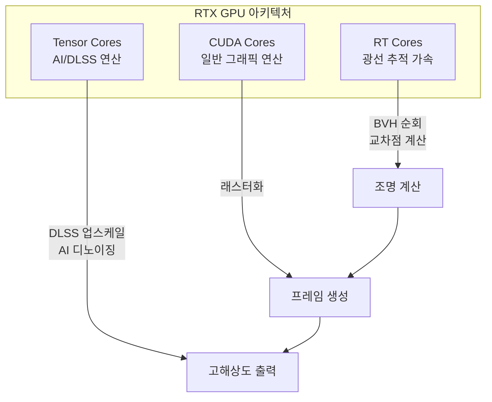
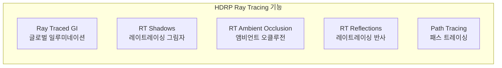

# 🛠️ 레이트레이싱(Ray Tracing) 완벽 가이드

> 💡 GPU 가속 레이트레이싱의 원리부터 Unity, Unreal Engine 설정까지

---

## 📌 1. 레이트레이싱이란?

레이트레이싱(Ray Tracing)은 **빛의 물리적 경로를 시뮬레이션**하여 사실적인 이미지를 생성하는 렌더링 기술입니다. 카메라의 시점에서 광선(Ray)을 발사하여, 물체에 반사·굴절되면서 광원에 도달하는 경로를 추적합니다.

### 🔹 핵심 원리

```
┌─────────────────────────────────────────────────────────────┐
│                     Ray Tracing 원리                         │
├─────────────────────────────────────────────────────────────┤
│                                                             │
│    [카메라] ──Ray──▶ [물체] ──반사Ray──▶ [물체] ──▶ [광원]    │
│       👁️              🟦                🟧          💡      │
│                                                             │
│    각 픽셀마다 광선을 추적하여 색상값을 계산                   │
│                                                             │
└─────────────────────────────────────────────────────────────┘
```

### ⚖️ 레이트레이싱 vs 래스터화 비교

| 항목 | Ray Tracing | Rasterization |
|------|-------------|---------------|
| **원리** | 빛의 물리적 시뮬레이션 | 기하학적 투영 및 픽셀 변환 |
| **사실성** | 매우 높음 (물리 기반) | 보통 (근사치 기반) |
| **성능** | 느림 (연산 집약적) | 빠름 |
| **하드웨어 요구** | 고사양 필수 (RTX GPU) | 저~중사양 가능 |
| **반사/굴절** | 물리적으로 정확 | 스크린 스페이스 근사 |
| **그림자** | 소프트 섀도우 자연스러움 | 섀도우 맵 기반 |

### 🔹 레이트레이싱이 가능하게 하는 효과들

- **정확한 반사(Reflections)**: 거울, 금속 표면의 실제 반사
- **굴절(Refraction)**: 유리, 물을 통과하는 빛의 굴절
- **소프트 섀도우(Soft Shadows)**: 광원 크기에 따른 자연스러운 그림자
- **글로벌 일루미네이션(GI)**: 간접광에 의한 조명 효과
- **앰비언트 오클루전(AO)**: 구석진 곳의 자연스러운 어두움
- **코스틱스(Caustics)**: 유리잔을 통과한 빛의 무늬

---

## 🎮 2. GPU와 레이트레이싱

### 🎯 왜 GPU가 필요한가?

레이트레이싱은 **화면의 모든 픽셀에 대해 광선을 추적**해야 합니다. 1920x1080 해상도 기준으로도 약 200만 개의 픽셀이 있고, 각 픽셀당 여러 개의 광선이 필요합니다. 이러한 **병렬 연산**에 GPU가 최적화되어 있습니다.

### 🏗️ NVIDIA RTX 아키텍처



### 🔹 RT Core (레이트레이싱 코어)

**역할**: 광선-삼각형 교차 검사 및 BVH(Bounding Volume Hierarchy) 순회 가속

- **1세대 (Turing, RTX 20 시리즈)**: 최초 도입
- **2세대 (Ampere, RTX 30 시리즈)**: 2배 성능 향상
- **3세대 (Ada Lovelace, RTX 40 시리즈)**: 추가 최적화
- **4세대 (Blackwell, RTX 50 시리즈)**: 이전 대비 2배 빠른 레이트레이싱

### 🔹 Tensor Core (텐서 코어)

**역할**: 행렬 연산 가속 → DLSS, AI 디노이징

```
┌─────────────────────────────────────────────────────────────┐
│                   Tensor Core 동작                          │
├─────────────────────────────────────────────────────────────┤
│                                                             │
│    [4x4 FP16 행렬 A] × [4x4 FP16 행렬 B] + [4x4 FP32 행렬 C] │
│                                                             │
│    → 1 GPU clock에 완료 (CUDA Core 대비 수십 배 효율)        │
│                                                             │
└─────────────────────────────────────────────────────────────┘
```

### 🔹 DLSS (Deep Learning Super Sampling)

RT Core와 Tensor Core의 협업 워크플로우:

1. **RT Core**: 낮은 해상도(예: 1080p)로 레이트레이싱 렌더링
2. **Tensor Core**: AI 모델로 고해상도(예: 4K)로 업스케일
3. **결과**: 4K 레이트레이싱 품질을 1080p 성능으로 구현

### 🎮 GPU 요구사양

| GPU 등급 | 레이트레이싱 지원 | 성능 수준 |
|----------|-------------------|-----------|
| RTX 20 시리즈 | ✅ 1세대 RT Core | 기본 |
| RTX 30 시리즈 | ✅ 2세대 RT Core | 우수 |
| RTX 40 시리즈 | ✅ 3세대 RT Core | 최상 |
| RTX 50 시리즈 | ✅ 4세대 RT Core | 차세대 |
| AMD RX 6000+ | ✅ Ray Accelerator | 중간 |
| GTX/Non-RTX | ❌ 소프트웨어 방식만 | 매우 느림 |

---

## 📌 3. Unity에서의 레이트레이싱

Unity에서 레이트레이싱은 **HDRP(High Definition Render Pipeline)**에서만 지원됩니다.

### 🔹 지원 요건

- **렌더 파이프라인**: HDRP 필수 (URP, Built-in 미지원)
- **그래픽 API**: DirectX 12 필수
- **GPU**: RTX 시리즈 또는 DXR 지원 GPU
- **OS**: Windows 10/11 64-bit

### 🛠️ 설정 방법

#### ▫️ Step 1: DirectX 12 활성화

```
Edit > Project Settings > Player > Other Settings
  └─ Rendering
       └─ "Auto Graphics API for Windows" 체크 해제
       └─ Graphics APIs for Windows에서 Direct3d12 추가 및 맨 위로 이동
```

#### ▫️ Step 2: HDRP Wizard 사용

```
Window > Rendering > HDRP Wizard
  └─ HDRP + DXR 탭 선택
  └─ "Fix All" 버튼 클릭
```

#### 🛠️ Step 3: HDRP Asset 설정

```
Project 창에서 HDRP Asset 선택
  └─ Inspector > Rendering
       └─ "Realtime Ray Tracing" 활성화
```

#### ▫️ Step 4: Frame Settings 활성화

```
Project Settings > Pipeline Specific Settings > HDRP
  └─ Frame Settings (Default Values)
       └─ Camera > Rendering
            └─ Ray Tracing 활성화
```

### 🔹 Unity 레이트레이싱 기능



### 💻 Volume Override 추가

```
Hierarchy에서 Volume 오브젝트 선택
  └─ Add Override > Ray Tracing
       └─ Ray Traced Global Illumination
       └─ Ray Traced Reflections
       └─ Ray Traced Ambient Occlusion
       └─ Ray Traced Shadows
```

### ⚠️ 주의사항

- **Static Batching 비활성화 필요**: HDRP는 레이트레이싱과 Static Batching을 동시에 지원하지 않음
- **빌드 시 64-bit 필수**: File > Build Settings > Architecture → x86_64

---

## 📌 4. Unreal Engine에서의 레이트레이싱

Unreal Engine 5는 **Lumen**이라는 글로벌 일루미네이션 시스템과 함께 하드웨어 레이트레이싱을 지원합니다.

### 🔹 Lumen이란?

Lumen은 UE5의 **동적 글로벌 일루미네이션 및 반사 시스템**입니다.

```
┌─────────────────────────────────────────────────────────────┐
│                    Lumen 동작 모드                           │
├─────────────────────────────────────────────────────────────┤
│                                                             │
│  [Software Ray Tracing]                                     │
│    └─ Mesh Distance Fields 사용                             │
│    └─ 넓은 하드웨어 호환성                                   │
│    └─ 제한된 지오메트리/머티리얼 지원                        │
│                                                             │
│  [Hardware Ray Tracing]                                     │
│    └─ RT Core 활용 (RTX GPU)                                │
│    └─ 더 높은 품질                                          │
│    └─ 복잡한 지오메트리 완벽 지원                            │
│                                                             │
└─────────────────────────────────────────────────────────────┘
```

### 🛠️ 설정 방법

#### ▫️ Step 1: Hardware Ray Tracing 활성화

```
Project Settings > Engine > Rendering > Hardware Ray Tracing
  └─ "Support Hardware Ray Tracing" 체크
```

#### 🛠️ Step 2: Lumen 설정

```
Project Settings > Engine > Rendering > Global Illumination
  └─ Dynamic Global Illumination Method: Lumen

Project Settings > Engine > Rendering > Reflections
  └─ Reflection Method: Lumen
```

#### ▫️ Step 3: Hardware Ray Tracing for Lumen 활성화

```
Project Settings > Engine > Rendering > Lumen
  └─ "Use Hardware Ray Tracing when available" 체크
```

#### 🛠️ Step 4: Ray Lighting Mode 설정 (고품질 반사)

```
Project Settings > Engine > Rendering > Lumen
  └─ Ray Lighting Mode: Hit Lighting for Reflections
```

### 🛠️ Lumen 주요 설정 옵션

| 설정 | 설명 | 권장값 |
|------|------|--------|
| **Lumen Scene Detail** | 작은 오브젝트 조명 기여도 | 기본값 유지 |
| **Final Gather Quality** | 스크린 프로브 밀도 | 1.0 (모바일) ~ 2.0 (PC) |
| **Max Trace Distance** | 레이 추적 최대 거리 | 씬 크기에 맞춤 |
| **Ray Lighting Mode** | 반사 품질 모드 | Hit Lighting (고품질) |

### ⚖️ Software vs Hardware Ray Tracing


### 🛠️ 필수 설정 체크리스트

- [x] Support Hardware Ray Tracing 활성화
- [x] Generate Mesh Distance Fields 활성화 (자동)
- [x] 라이트를 Stationary 또는 Movable로 설정
- [x] 에디터 재시작 (설정 변경 후)

---

## ⚡ 5. 성능 최적화 팁

### 🚀 공통 최적화 전략

1. **선택적 레이트레이싱**: 모든 효과를 켜지 말고 필요한 것만 선택
2. **DLSS/FSR 활용**: AI 업스케일링으로 성능 확보
3. **광선 수 제한**: Samples per Pixel 조절
4. **거리 제한**: Max Trace Distance 적절히 설정

### 🚀 Unity HDRP 최적화

```
Volume Override 설정:
  └─ Max Ray Length: 50-100m (씬 크기에 따라)
  └─ Sample Count: 1-2 (성능) ~ 4-8 (품질)
  └─ Denoise: 활성화 (적은 샘플로도 깨끗한 결과)
```

### 🚀 Unreal Engine 최적화

```
Post Process Volume:
  └─ Lumen Global Illumination
       └─ Quality: 1.0 (기본) ~ 4.0 (최대)
  └─ Lumen Reflections
       └─ Quality: 1.0 (기본)
```

---

## 📌 6. 결론

레이트레이싱은 **물리 기반의 사실적인 렌더링**을 가능하게 하는 핵심 기술입니다.

| 엔진 | 레이트레이싱 시스템 | 특징 |
|------|---------------------|------|
| **Unity** | HDRP + DXR | 직접적인 RT 효과 제어 |
| **Unreal** | Lumen + HW RT | SW/HW 하이브리드 자동 전환 |

2025년 현재, **하이브리드 렌더링**(래스터화 + 선택적 레이트레이싱)이 표준이 되었으며, DLSS 4와 같은 AI 기술과 결합하여 **4K 60fps 레이트레이싱**이 현실화되고 있습니다.

---

## 🔗 참고 자료

### 🔹 일반 레이트레이싱
- [Unreal Engine - 리얼타임 레이 트레이싱이란?](https://www.unrealengine.com/ko/explainers/ray-tracing/what-is-real-time-ray-tracing)
- [NVIDIA Blog - Ray Tracing vs Rasterization 차이점](https://blogs.nvidia.com/blog/whats-difference-between-ray-tracing-rasterization/)
- [NVIDIA RTX Technology](https://www.nvidia.com/en-us/geforce/rtx/)

### 🏗️ GPU 아키텍처
- [NVIDIA Tensor Cores](https://www.nvidia.com/en-us/data-center/tensor-cores/)
- [Profolus - CUDA vs Tensor vs RT Cores](https://www.profolus.com/topics/nvidia-gpus-cuda-cores-vs-tensor-cores-vs-rt-cores/)
- [NVIDIA Blog Korea - DLSS 4와 레이트레이싱](https://blogs.nvidia.co.kr/blog/gamescom-2025-dlss-4-ray-tracing/)

### 🔹 Unity
- [Unity HDRP Ray Tracing Setup (v17.0)](https://docs.unity3d.com/Packages/com.unity.render-pipelines.high-definition@17.0/manual/Ray-Tracing-Getting-Started.html)
- [Unity HDRP 레이트레이싱 설정 (한국어)](https://docs.unity3d.com/kr/Packages/com.unity.render-pipelines.high-definition@10.5/manual/Ray-Tracing-Settings.html)
- [TheGamedev.Guru - Unity Ray Tracing Tutorial](https://thegamedev.guru/unity-ray-tracing/get-started-now/)

### 🔹 Unreal Engine
- [UE5 Hardware Ray Tracing Documentation](https://dev.epicgames.com/documentation/en-us/unreal-engine/hardware-ray-tracing-in-unreal-engine)
- [UE5 Lumen Global Illumination](https://dev.epicgames.com/documentation/en-us/unreal-engine/lumen-global-illumination-and-reflections-in-unreal-engine)
- [NVIDIA UE5.4 Raytracing Guide (PDF)](https://dlss.download.nvidia.com/uebinarypackages/Documentation/UE5+Raytracing+Guideline+v5.4.pdf)

---

*작성일: 2026-02-03*
