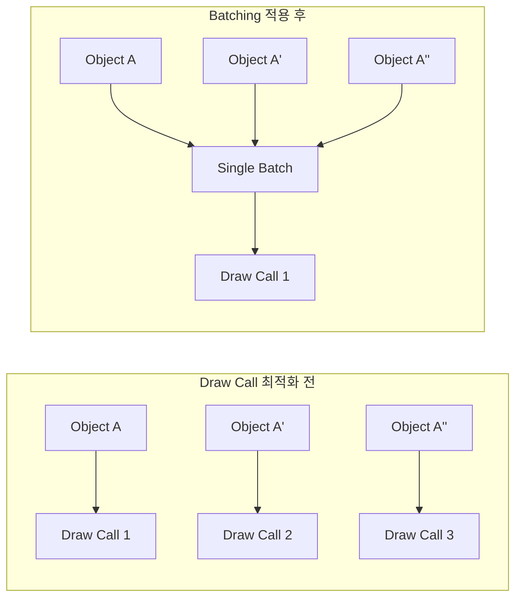

# 🛠️ 260205 Unity IDE 내장 디버깅 솔루션 완벽 가이드

Unity 개발 시 성능 최적화와 디버깅을 위한 내장 도구들을 체계적으로 정리했습니다.

---

## 📚 목차

1. [프로파일러(Profiler) 사용법](#1-프로파일러profiler-사용법)
2. [Stats 창과 FPS 모니터링](#2-stats-창과-fps-모니터링)
3. [기즈모(Gizmos) 시각적 디버깅](#3-기즈모gizmos-시각적-디버깅)
4. [GC 발생 횟수 모니터링](#4-gc-발생-횟수-모니터링)
5. [배치콜(Batch/Draw Call) 모니터링](#5-배치콜batchdraw-call-모니터링)
6. [메모리 프로파일링](#6-메모리-프로파일링)
7. [CPU 프로파일링](#7-cpu-프로파일링)

---

## 🗂️ 1. 프로파일러(Profiler) 사용법

### 🗂️ 프로파일러 열기

```
Window > Analysis > Profiler
단축키: Ctrl+7 (Windows) / Cmd+7 (Mac)
```

### 🏗️ 프로파일러 구조

```
┌─────────────────────────────────────────────────────────────┐
│  Unity Profiler                                              │
├─────────────────────────────────────────────────────────────┤
│  [CPU] [GPU] [Rendering] [Memory] [Audio] [Video] ...       │
├─────────────────────────────────────────────────────────────┤
│  ████████████████████████████████████████ (Timeline Chart)  │
│  ████████░░░░████████░░░░████████░░░░████                   │
├─────────────────────────────────────────────────────────────┤
│  Hierarchy View / Timeline View                              │
│  ├─ PlayerLoop                                               │
│  │   ├─ Update.ScriptRunBehaviourUpdate                     │
│  │   ├─ FixedUpdate.PhysicsFixedUpdate                      │
│  │   └─ Rendering.DrawScene                                 │
└─────────────────────────────────────────────────────────────┘
```

### 🛠️ 핵심 설정

| 설정 | 설명 |
|------|------|
| **Record** | 프로파일링 데이터 기록 시작/중지 |
| **Deep Profile** | 모든 스크립트 함수 호출 추적 (오버헤드 있음) |
| **Call Stacks** | GC.Alloc 발생 위치 콜스택 표시 |
| **Clear** | 기록된 데이터 삭제 |

### 🔹 중요 팁

- **에디터가 아닌 타겟 디바이스에서 프로파일링** 필수
- **Standalone Profiler** (Unity 2020.1+): 별도 프로세스로 에디터 부하 제거
- 기본 300프레임 기록, 최대 2,000프레임까지 설정 가능 (Edit > Preferences)

---

## 📌 2. Stats 창과 FPS 모니터링

### 🔹 Stats 창 열기

Game View 우측 상단 **Stats** 버튼 클릭

### 🔹 Stats 창 정보

```
┌──────────────────────────────────────┐
│ Statistics                           │
├──────────────────────────────────────┤
│ FPS: 60.0 (16.7ms)                   │
│ CPU: main 14.2ms  render thread 8.5ms│
├──────────────────────────────────────┤
│ Batches: 125                         │
│ Saved by batching: 340               │
│ Tris: 1.2M  Verts: 800K              │
│ SetPass calls: 45                    │
├──────────────────────────────────────┤
│ Shadow casters: 12                   │
│ Visible skinned meshes: 5            │
│ Animation components playing: 3      │
└──────────────────────────────────────┘
```

### 🔹 주요 지표

| 지표 | 설명 | 목표값 |
|------|------|--------|
| **FPS** | 초당 프레임 수 | 60fps (모바일 30fps) |
| **Batches** | 드로우콜 배치 수 | 가능한 낮게 |
| **SetPass calls** | 쉐이더 상태 변경 횟수 | 최소화 |
| **Tris/Verts** | 삼각형/버텍스 수 | 플랫폼별 적정선 |

### ⚠️ FPS 주의사항

Stats 창의 FPS는 **CPU 측면만** 고려하며, GPU와 디스플레이를 무시합니다. 실제 프레임 레이트는 더 낮을 수 있습니다.

### 🔹 대안: Graphy (무료 에셋)

더 정확한 FPS 모니터링이 필요하면 [Graphy](https://github.com/Tayx94/graphy) 사용을 권장합니다.

---

## 📌 3. 기즈모(Gizmos) 시각적 디버깅

### 🔹 기즈모란?

Scene View에서만 나타나는 시각적 디버깅 도구입니다. 빌드에는 포함되지 않습니다.

### 🛠️ 기본 사용법

```csharp
public class DebugVisualizer : MonoBehaviour
{
    public float _detectionRadius = 5f;
    public Vector3 _targetDirection;

    // 항상 그리기
    void OnDrawGizmos()
    {
        Gizmos.color = Color.yellow;
        Gizmos.DrawWireSphere(transform.position, _detectionRadius);
    }

    // 선택 시에만 그리기
    void OnDrawGizmosSelected()
    {
        Gizmos.color = Color.red;
        Gizmos.DrawRay(transform.position, _targetDirection * 10f);
    }
}
```

### 🔹 주요 Gizmos 메서드

```
┌─────────────────────────────────────────────────────────────┐
│  Gizmos API                                                  │
├─────────────────────────────────────────────────────────────┤
│                                                              │
│  DrawSphere(center, radius)     ●  채워진 구                │
│  DrawWireSphere(center, radius) ○  와이어프레임 구          │
│  DrawCube(center, size)         ■  채워진 큐브              │
│  DrawWireCube(center, size)     □  와이어프레임 큐브        │
│  DrawRay(from, direction)       →  레이(선분)               │
│  DrawLine(from, to)             ─  두 점 사이 선            │
│  DrawIcon(center, name)         ⚑  아이콘                   │
│  DrawMesh(mesh, pos, rot)       △  메쉬                     │
│                                                              │
└─────────────────────────────────────────────────────────────┘
```

### 🏢 활용 예시

```csharp
// AI 시야 범위 시각화
void OnDrawGizmos()
{
    Gizmos.color = new Color(1, 0, 0, 0.3f);
    Gizmos.DrawSphere(transform.position, _viewDistance);

    // 시야 방향
    Gizmos.color = Color.blue;
    var leftDir = Quaternion.Euler(0, -_viewAngle/2, 0) * transform.forward;
    var rightDir = Quaternion.Euler(0, _viewAngle/2, 0) * transform.forward;
    Gizmos.DrawRay(transform.position, leftDir * _viewDistance);
    Gizmos.DrawRay(transform.position, rightDir * _viewDistance);
}
```

### 🔹 기즈모 표시 토글

Scene View 상단의 **Gizmos** 버튼으로 표시 여부 제어

---

## 📌 4. GC 발생 횟수 모니터링

### 🔹 GC(Garbage Collection)란?

관리 힙에서 더 이상 사용되지 않는 메모리를 자동으로 해제하는 과정입니다. GC 발생 시 **스파이크(끊김)**가 발생할 수 있습니다.

### 🗂️ 프로파일러에서 GC 확인

```
┌─────────────────────────────────────────────────────────────┐
│  CPU Usage Profiler > Hierarchy View                         │
├─────────────────────────────────────────────────────────────┤
│  Overview  │ Total │ Self  │ Calls │ GC Alloc │ Time ms    │
├────────────┼───────┼───────┼───────┼──────────┼────────────┤
│  PlayerLoop│ 16.2ms│ 0.1ms │   1   │   0 B    │            │
│  ├─Update  │ 12.1ms│ 0.5ms │   1   │  2.4 KB  │ ◀ 확인!   │
│  │ ├─MyFunc│  8.2ms│ 8.2ms │  100  │  2.4 KB  │ ◀ 범인!   │
│  ...                                                        │
└─────────────────────────────────────────────────────────────┘
```

### 🔹 GC.Alloc 콜스택 활성화

1. Profiler 창 > **Call Stacks** 버튼 활성화
2. 또는 스크립트에서:

```csharp
using UnityEngine.Profiling;

Profiler.enableAllocationCallstacks = true;
Profiler.enabled = true;
```

### 🔹 Memory Profiler 모듈에서 확인

Memory 모듈의 **빨간색 라인**이 매 프레임 관리 힙 할당을 표시합니다.

```
┌─────────────────────────────────────────────────────────────┐
│  Memory Profiler Module                                      │
├─────────────────────────────────────────────────────────────┤
│  ▄▄▄▄▄▄▄▄▄▄▄▄▄▄▄▄▄▄▄▄▄▄▄▄▄▄▄▄▄▄▄▄ Total Allocated           │
│  ████████████████████████████████ Used Total                 │
│  ░░░░░▓░░░░░░░░░▓░░░░░░░░▓░░░░░░░ GC Allocated (빨간색)      │
│       ↑         ↑        ↑                                   │
│       GC 스파이크 발생 지점                                  │
└─────────────────────────────────────────────────────────────┘
```

### 🚀 최적화 목표

**매 프레임 GC Alloc = 0 Bytes**가 이상적입니다.

### 🔹 GC 모드 (Unity 2019+)

```csharp
// Incremental GC (기본값) - 여러 프레임에 분산
// Edit > Project Settings > Player > Other Settings
// "Use incremental GC" 체크

// 수동 GC 트리거 (로딩 화면 등에서)
System.GC.Collect();
```

---

## 📌 5. 배치콜(Batch/Draw Call) 모니터링

### ⚖️ Draw Call vs Batch



### 🔹 모니터링 방법

#### ▫️ 1. Stats 창

Game View > Stats 버튼
- **Batches**: 현재 배치 수
- **Saved by batching**: 배칭으로 절약된 드로우콜 수

#### 💻 2. Frame Debugger

```
Window > Analysis > Frame Debugger
```

```
┌─────────────────────────────────────────────────────────────┐
│  Frame Debugger                                              │
├─────────────────────────────────────────────────────────────┤
│  [Enable]                                                    │
├─────────────────────────────────────────────────────────────┤
│  Draw Calls: 125                                             │
│  ├─ 1. Clear (color+Z+stencil)                              │
│  ├─ 2. Draw Mesh (Combined Mesh - Static Batch)             │
│  ├─ 3. Draw Mesh Characters/Hero                            │
│  ├─ 4. Draw Dynamic Batch (15 objects)                      │
│  ├─ 5. GPU Instancing (100 trees)                           │
│  ...                                                         │
└─────────────────────────────────────────────────────────────┘
```

### 🚀 배칭 최적화 방법

| 방법 | 대상 | 특징 |
|------|------|------|
| **Static Batching** | 움직이지 않는 오브젝트 | 빌드 시 메쉬 결합, 매우 효율적 |
| **Dynamic Batching** | 작은 움직이는 오브젝트 | CPU 오버헤드로 권장하지 않음 |
| **GPU Instancing** | 동일 메쉬 다수 | Material에서 "Enable GPU Instancing" |
| **SRP Batcher** | URP/HDRP | 자동 활성화, Dynamic Batching보다 효율적 |

### 🚀 배칭 조건

같은 배치로 묶이려면:
- ✅ 동일한 Material 사용
- ✅ 동일한 Texture 사용
- ✅ Static Batching: Static 플래그 체크
- ✅ GPU Instancing: 동일한 Mesh

---

## 🗂️ 6. 메모리 프로파일링

### 🔹 도구 선택

| 도구 | 용도 |
|------|------|
| **Memory Profiler 모듈** | 실시간 메모리 사용량 개요 |
| **Memory Profiler 패키지** | 상세한 스냅샷 분석, 메모리 누수 탐지 |

### 🛠️ Memory Profiler 패키지 설치

```
Window > Package Manager > Memory Profiler
```

### 🔹 Memory Profiler 열기

```
Window > Analysis > Memory Profiler
```

### 🔹 주요 워크플로우

```
┌─────────────────────────────────────────────────────────────┐
│  Memory Profiler                                             │
├─────────────────────────────────────────────────────────────┤
│  [Capture] [Import] [Compare]                                │
├─────────────────────────────────────────────────────────────┤
│                                                              │
│  ┌─────────┐  ┌─────────┐  ┌─────────┐                      │
│  │ Summary │  │ Unity   │  │ All of  │                      │
│  │         │  │ Objects │  │ Memory  │                      │
│  └─────────┘  └─────────┘  └─────────┘                      │
│                                                              │
│  Summary View:                                               │
│  ┌─────────────────────────────────────────────────────┐    │
│  │ Total Resident on Device: 1.2 GB                    │    │
│  │ ├─ Native Memory:    850 MB                         │    │
│  │ │   ├─ Textures:     420 MB                         │    │
│  │ │   ├─ Meshes:       180 MB                         │    │
│  │ │   └─ Audio:         50 MB                         │    │
│  │ ├─ Managed Memory:   150 MB                         │    │
│  │ └─ Graphics:         200 MB                         │    │
│  └─────────────────────────────────────────────────────┘    │
│                                                              │
└─────────────────────────────────────────────────────────────┘
```

### ⚖️ 스냅샷 비교로 메모리 누수 탐지

1. 게임 시작 시 스냅샷 캡처
2. 일정 시간 플레이
3. 같은 상태로 돌아온 후 스냅샷 캡처
4. **Compare** 기능으로 두 스냅샷 비교
5. 증가한 오브젝트가 **메모리 누수** 후보

### 🔹 핵심 지표

- **Total Resident on Device**: 실제 디바이스 메모리 사용량
- **Textures**: 가장 많은 메모리 차지 (압축 필수)
- **Managed Heap**: GC 대상 메모리

---

## 🗂️ 7. CPU 프로파일링

### 🔹 CPU Usage Profiler 모듈

```
Window > Analysis > Profiler > CPU Usage
```

### 🔹 뷰 모드

#### ▫️ Timeline View (기본)

```
┌─────────────────────────────────────────────────────────────┐
│  Timeline View                                               │
├─────────────────────────────────────────────────────────────┤
│  Main Thread ─────────────────────────────────────────────  │
│  │████│░░│███████│░░░│██│░░░░│████████│                     │
│   Update  Wait  Physics    Render                           │
│                                                              │
│  Render Thread ───────────────────────────────────────────  │
│       │░░░░░│███████████│░░░░│████████│                     │
│              Draw calls                                      │
│                                                              │
│  Job Worker 0 ────────────────────────────────────────────  │
│            │████│░░░░░░░│████│                               │
│                                                              │
└─────────────────────────────────────────────────────────────┘
```

#### ▫️ Hierarchy View

함수별 시간 소요 트리 구조로 표시

### 🔹 Deep Profiling

모든 함수 호출을 추적하지만 **높은 오버헤드** 발생

```
Profiler 창 > Deep Profile 버튼 활성화
```

### 🔹 Call Stacks (권장)

Deep Profile보다 가벼우면서 GC.Alloc 발생 위치 확인 가능

```
Profiler 창 > Call Stacks 버튼 활성화
```

### 🗂️ 프로파일링 베스트 프랙티스

```
┌─────────────────────────────────────────────────────────────┐
│  Top-Down 접근법                                            │
├─────────────────────────────────────────────────────────────┤
│                                                              │
│  1단계: 카테고리별 개요 확인                                │
│         ├─ Rendering (GPU bound?)                           │
│         ├─ Scripts (CPU bound?)                             │
│         ├─ Physics                                           │
│         └─ GC Allocations                                   │
│                     ▼                                        │
│  2단계: 문제 영역 심층 분석                                 │
│         ├─ Timeline에서 긴 마커 확인                        │
│         └─ Hierarchy에서 Self 시간 확인                     │
│                     ▼                                        │
│  3단계: 코드 레벨 최적화                                    │
│         ├─ 핫스팟 함수 개선                                 │
│         └─ GC Alloc 제거                                    │
│                                                              │
└─────────────────────────────────────────────────────────────┘
```

### 🗂️ 외부 CPU 프로파일러

| 도구 | 플랫폼 |
|------|--------|
| **Intel VTune** | Windows/Linux |
| **JetBrains dotTrace** | Rider 통합 |
| **Xcode Instruments** | macOS/iOS |

---

## 🔗 참고 자료

### 🔹 Unity 공식 문서
- [프로파일러 개요](https://docs.unity3d.com/kr/2022.3/Manual/Profiler.html)
- [프로파일러 창](https://docs.unity3d.com/kr/current/Manual/ProfilerWindow.html)
- [CPU 사용 프로파일러](https://docs.unity3d.com/kr/2018.4/Manual/ProfilerCPU.html)
- [메모리 프로파일러 모듈](https://docs.unity3d.com/kr/2021.3/Manual/ProfilerMemory.html)
- [Rendering Statistics](https://docs.unity3d.com/Manual/RenderingStatistics.html)
- [Gizmos API](https://docs.unity3d.com/ScriptReference/Gizmos.html)
- [GC 추적](https://docs.unity3d.com/6000.2/Documentation/Manual/performance-track-garbage-collection.html)
- [Draw Call 배칭](https://docs.unity3d.com/Manual/DrawCallBatching.html)

### 🛠️ Unity 블로그 및 가이드
- [유용한 고급 프로파일링 팁](https://unity.com/kr/blog/games/pick-up-these-helpful-tips-on-advanced-profiling)
- [Unity 프로파일 애널라이저로 게임 최적화하기](https://unity.com/kr/how-to/optimize-your-game-unity-profile-analyzer)
- [Memory Profiler 1.0.0](https://blog.unity.com/kr/engine-platform/everything-you-need-to-know-about-memory-profiler)
- [메모리 프로파일링 툴 사용 방법](https://unity.com/how-to/use-memory-profiling-unity)
- [프로파일링 베스트 프랙티스](https://unity.com/how-to/best-practices-for-profiling-game-performance)

### 🔹 커뮤니티 자료
- [유니티 성능 프로파일링 가이드 (IGC16)](https://www.slideshare.net/ozlael/ss-67878933)
- [Graphy - FPS Counter](https://github.com/Tayx94/graphy)
- [Visual Debugging with Gizmos](https://onewheelstudio.com/blog/2023/9/13/visual-debugging-with-gizmos)
- [Unity Draw Call Optimization](https://thegamedev.guru/unity-performance/draw-call-optimization/)
- [Garbage Collection in Unity](https://gamedevbeginner.com/garbage-collection-in-unity-what-it-is-and-how-to-avoid-it/)

---

*작성일: 2026-02-05*
