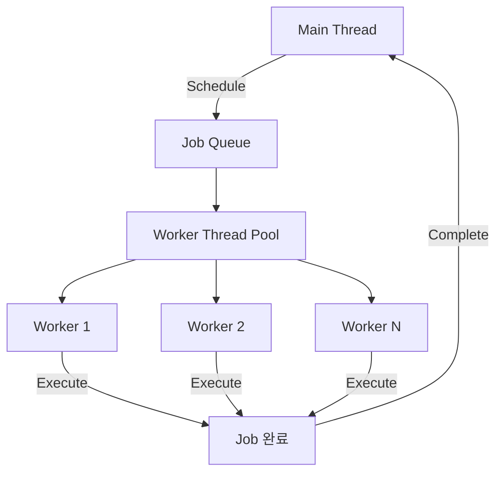

# 🛠️ 260205 Unity Job System 완벽 가이드

## 🧭 1. 소개

### 🔹 Unity Job System이란?

Unity Job System은 **멀티스레드 코드를 안전하고 간단하게 작성**할 수 있게 해주는 시스템입니다. 모든 CPU 코어를 활용하여 게임 성능을 극대화할 수 있습니다.

```
┌─────────────────────────────────────────────────────────────────┐
│                     Traditional Approach                         │
│  ┌──────────────────────────────────────────────────────────┐   │
│  │                    Main Thread                            │   │
│  │  [Task1] [Task2] [Task3] [Task4] [Task5] [Task6]         │   │
│  └──────────────────────────────────────────────────────────┘   │
│                        순차 실행 → 느림                          │
├─────────────────────────────────────────────────────────────────┤
│                      Job System Approach                         │
│  ┌──────────────────┐                                           │
│  │   Main Thread    │ [Schedule] ──→ [Complete]                 │
│  └──────────────────┘                                           │
│  ┌──────────────────┐                                           │
│  │  Worker Thread 1 │ [Task1] [Task4]                           │
│  └──────────────────┘                                           │
│  ┌──────────────────┐                                           │
│  │  Worker Thread 2 │ [Task2] [Task5]                           │
│  └──────────────────┘                                           │
│  ┌──────────────────┐                                           │
│  │  Worker Thread 3 │ [Task3] [Task6]                           │
│  └──────────────────┘                                           │
│                        병렬 실행 → 빠름                          │
└─────────────────────────────────────────────────────────────────┘
```

### 🔹 필수 네임스페이스

```csharp
using Unity.Jobs;           // Job 인터페이스
using Unity.Burst;          // Burst 컴파일러
using Unity.Collections;    // NativeArray 등
using Unity.Mathematics;    // SIMD 최적화 수학 함수
```

---

## 📌 2. 원리

### 🏗️ 2.1 Job System 아키텍처



### 🔹 2.2 핵심 구성 요소

| 구성 요소 | 설명 |
|----------|------|
| **Job Struct** | `IJob` 또는 `IJobParallelFor` 인터페이스 구현 |
| **NativeContainer** | 스레드 안전한 데이터 컨테이너 (NativeArray, NativeList 등) |
| **JobHandle** | Job의 스케줄링과 의존성 관리 |
| **Worker Thread** | CPU 코어당 하나씩 자동 생성 |

### 🔹 2.3 데이터 흐름

```
┌─────────────┐    Schedule()    ┌─────────────┐    Execute()    ┌─────────────┐
│ Main Thread │ ───────────────→ │ Job Queue   │ ───────────────→ │ Worker      │
│             │                  │             │                  │ Thread      │
│ NativeArray │ ←─────────────── │             │ ←─────────────── │             │
│ 결과 사용    │    Complete()    │             │    작업 완료      │ NativeArray │
└─────────────┘                  └─────────────┘                  └─────────────┘
```

### 🔹 2.4 Safety System

Unity Job System은 **Race Condition**을 방지하기 위한 안전 시스템을 내장:

```csharp
// [ReadOnly] - 여러 Job이 동시에 읽기 가능
[ReadOnly] public NativeArray<float> inputData;

// [WriteOnly] - 해당 Job만 쓰기 가능
[WriteOnly] public NativeArray<float> outputData;

// 기본값 - Read/Write (단일 Job만 접근 가능)
public NativeArray<float> data;
```

---

## ⚠️ 3. 장단점

### ✅ 장점

| 장점 | 설명 |
|------|------|
| **성능 향상** | 모든 CPU 코어 활용, 15 FPS → 70 FPS 사례 보고 |
| **안전성** | Safety System으로 Race Condition 자동 방지 |
| **Burst 통합** | SIMD 최적화로 5ms → 0.1ms 성능 향상 |
| **간단한 API** | Schedule/Complete 패턴으로 쉬운 사용 |
| **자동 스레드 관리** | Worker Thread 수동 관리 불필요 |

### ⚠️ 단점

| 단점 | 설명 |
|------|------|
| **Blittable 타입만** | class, string 등 managed 타입 사용 불가 |
| **NativeContainer 필수** | 일반 배열 대신 NativeArray 사용 필요 |
| **메모리 수동 관리** | Dispose() 호출 필수 |
| **디버깅 복잡** | 멀티스레드 디버깅의 일반적 어려움 |
| **학습 곡선** | 새로운 패턴과 제약사항 학습 필요 |

### 🔹 Blittable 타입이란?

```csharp
// ✅ 사용 가능 (Blittable)
int, float, bool, byte
Vector3, Quaternion (Unity 구조체)
float3, quaternion (Unity.Mathematics)
사용자 정의 struct (Blittable 필드만 포함)

// ❌ 사용 불가 (Non-Blittable)
string
class
object[]
List<T>
Dictionary<K,V>
```

---

## 🧪 4. 간단한 예제

### 🔹 4.1 IJob - 단일 작업

```csharp
using Unity.Jobs;
using Unity.Burst;
using Unity.Collections;

// 두 숫자를 더하는 간단한 Job
[BurstCompile]
public struct AddNumbersJob : IJob
{
    public float a;
    public float b;
    public NativeArray<float> result;

    public void Execute()
    {
        result[0] = a + b;
    }
}

// 사용법
public class SimpleJobExample : MonoBehaviour
{
    void Start()
    {
        // 1. 결과를 저장할 NativeArray 생성
        var result = new NativeArray<float>(1, Allocator.TempJob);

        // 2. Job 생성 및 데이터 설정
        var job = new AddNumbersJob
        {
            a = 10f,
            b = 20f,
            result = result
        };

        // 3. Job 스케줄링
        JobHandle handle = job.Schedule();

        // 4. Job 완료 대기
        handle.Complete();

        // 5. 결과 사용
        Debug.Log($"Result: {result[0]}");  // 출력: Result: 30

        // 6. 메모리 해제 (필수!)
        result.Dispose();
    }
}
```

### 🔹 4.2 IJobParallelFor - 병렬 배열 처리

```csharp
using Unity.Jobs;
using Unity.Burst;
using Unity.Collections;

// 배열의 각 요소에 값을 더하는 병렬 Job
[BurstCompile]
public struct AddValueJob : IJobParallelFor
{
    public float valueToAdd;

    [ReadOnly] public NativeArray<float> input;
    [WriteOnly] public NativeArray<float> output;

    // index: 현재 처리 중인 배열 인덱스 (자동 할당)
    public void Execute(int index)
    {
        output[index] = input[index] + valueToAdd;
    }
}

// 사용법
public class ParallelJobExample : MonoBehaviour
{
    void Start()
    {
        int dataLength = 10000;

        // 입력/출력 배열 생성
        var input = new NativeArray<float>(dataLength, Allocator.TempJob);
        var output = new NativeArray<float>(dataLength, Allocator.TempJob);

        // 입력 데이터 초기화
        for (int i = 0; i < dataLength; i++)
            input[i] = i;

        // Job 생성
        var job = new AddValueJob
        {
            valueToAdd = 100f,
            input = input,
            output = output
        };

        // 병렬 Job 스케줄링 (배열 길이, 배치 크기)
        // 배치 크기 64: 64개씩 묶어서 Worker Thread에 분배
        JobHandle handle = job.Schedule(dataLength, 64);

        handle.Complete();

        // 결과 확인
        Debug.Log($"output[0] = {output[0]}");      // 100
        Debug.Log($"output[9999] = {output[9999]}"); // 10099

        input.Dispose();
        output.Dispose();
    }
}
```

### 🔹 4.3 Job 의존성 체인

```csharp
// Job A의 결과를 Job B가 사용하는 경우
JobHandle handleA = jobA.Schedule();
JobHandle handleB = jobB.Schedule(handleA);  // A 완료 후 B 실행

handleB.Complete();  // B가 완료되면 A도 완료됨
```

---

## 🧪 5. 실용적이고 복잡한 예제

### 🧠 5.1 실제 프로젝트: OBB 충돌 검사 (IJobParallelFor)

아래는 현재 프로젝트(`mepia`)에서 사용 중인 **OBB(Oriented Bounding Box) 충돌 검사 Job**입니다.

```csharp
using Unity.Burst;
using Unity.Collections;
using Unity.Jobs;
using Unity.Mathematics;

/// <summary>
/// OBB-OBB 교차 검사 Job (Separating Axis Theorem 기반)
/// Broad Phase에서 Spatial Hash 후보 쌍을 정밀 필터링
/// </summary>
[BurstCompile]
public struct ObbIntersectionJob : IJobParallelFor
{
    // 객체 데이터 (ReadOnly - 여러 스레드가 동시 읽기 가능)
    [ReadOnly] public NativeArray<float3> Centers;
    [ReadOnly] public NativeArray<float3> HalfExtents;
    [ReadOnly] public NativeArray<quaternion> Rotations;
    [ReadOnly] public NativeArray<bool> IsValid;

    // 입력: Spatial Hash에서 추출된 후보 쌍
    [ReadOnly] public NativeArray<int2> CandidatePairs;

    // 출력: OBB 교차를 통과한 쌍 (ParallelWriter로 스레드 안전 쓰기)
    [WriteOnly] public NativeList<int2>.ParallelWriter PassedPairs;

    // 설정: OBB 확장 마진
    public float Tolerance;

    public void Execute(int pairIndex)
    {
        int2 pair = CandidatePairs[pairIndex];
        int indexA = pair.x;
        int indexB = pair.y;

        // 유효성 검사 (early return)
        if (!IsValid[indexA] || !IsValid[indexB])
            return;

        // OBB 데이터 추출
        float3 centerA = Centers[indexA];
        float3 halfExtentsA = HalfExtents[indexA];
        quaternion rotationA = Rotations[indexA];

        float3 centerB = Centers[indexB];
        float3 halfExtentsB = HalfExtents[indexB];
        quaternion rotationB = Rotations[indexB];

        // SAT 기반 OBB-OBB 교차 검사
        if (ObbCollisionMath.IntersectOBB(
            centerA, halfExtentsA, rotationA,
            centerB, halfExtentsB, rotationB,
            Tolerance))
        {
            // 충돌한 쌍만 결과에 추가
            PassedPairs.AddNoResize(pair);
        }
    }
}
```

**사용 방법:**

```csharp
public class CollisionSystem
{
    public NativeList<int2> DetectCollisions(
        NativeArray<int2> candidatePairs,
        CollisionDataStore dataStore,
        float tolerance)
    {
        // 결과 리스트 생성 (최대 크기 미리 할당)
        var passedPairs = new NativeList<int2>(
            candidatePairs.Length,
            Allocator.TempJob);

        // Job 설정
        var job = new ObbIntersectionJob
        {
            Centers = dataStore.Centers,
            HalfExtents = dataStore.HalfExtents,
            Rotations = dataStore.Rotations,
            IsValid = dataStore.IsValid,
            CandidatePairs = candidatePairs,
            PassedPairs = passedPairs.AsParallelWriter(),
            Tolerance = tolerance
        };

        // 스케줄링 (배치 크기 32)
        JobHandle handle = job.Schedule(candidatePairs.Length, 32);
        handle.Complete();

        return passedPairs;
    }
}
```

### 🔹 5.2 실제 프로젝트: 배치 레이캐스트 (IJobParallelFor)

여러 개의 Ray를 동시에 처리하는 복잡한 Job 예제입니다.

```csharp
/// <summary>
/// 배치 레이캐스트 Job
/// 여러 레이를 병렬로 처리
/// </summary>
[BurstCompile]
public unsafe struct BatchRaycastJob : IJobParallelFor
{
    // 입력: 처리할 레이 배열
    [ReadOnly] public NativeArray<BurstRay> Rays;
    public float CellSize;
    public bool TrianglePrecision;
    public int LayerMask;

    // 씬 데이터 (ReadOnly)
    [ReadOnly] public NativeArray<float3> Centers;
    [ReadOnly] public NativeArray<float3> HalfExtents;
    [ReadOnly] public NativeArray<quaternion> Rotations;
    [ReadOnly] public NativeArray<bool> IsValid;
    [ReadOnly] public NativeArray<int> Layers;
    [ReadOnly] public NativeArray<ObjectMeshInfo> MeshInfos;

    // Spatial Hash Map (공간 분할 가속 구조)
    [ReadOnly] public NativeParallelMultiHashMap<uint, int> SpatialMap;

    // 출력: 각 레이의 충돌 결과
    [WriteOnly] public NativeArray<BurstRaycastHit> Results;

    public void Execute(int rayIndex)
    {
        var ray = Rays[rayIndex];
        var bestHit = BurstRaycastHit.NoHit;

        // DDA 알고리즘으로 공간 순회
        var checkedIndices = new NativeHashSet<int>(64, Allocator.Temp);

        int3 currentCell = (int3)math.floor(ray.Origin / CellSize);
        // ... DDA 순회 로직 ...

        while (/* 조건 */)
        {
            // 현재 셀의 객체들 검사
            uint hash = math.hash(currentCell);
            if (SpatialMap.TryGetFirstValue(hash, out int objIndex, out var iterator))
            {
                do
                {
                    if (IsValid[objIndex] && !checkedIndices.Contains(objIndex))
                    {
                        checkedIndices.Add(objIndex);

                        // LayerMask 필터링
                        if (LayerMask != -1 && ((1 << Layers[objIndex]) & LayerMask) == 0)
                            continue;

                        // OBB 충돌 검사 후 삼각형 정밀 검사
                        // ... 충돌 로직 ...
                    }
                } while (SpatialMap.TryGetNextValue(out objIndex, ref iterator));
            }

            // 다음 셀로 이동 (DDA)
            // ...
        }

        checkedIndices.Dispose();
        Results[rayIndex] = bestHit;
    }
}
```

### 🔹 5.3 단일 레이캐스트 (IJob)

복잡한 단일 작업에는 `IJob`을 사용합니다.

```csharp
/// <summary>
/// 단일 레이캐스트 Job
/// DDA 알고리즘으로 Spatial Hash 셀 순회 후 OBB/BVH 테스트
/// </summary>
[BurstCompile]
public unsafe struct SingleRaycastJob : IJob
{
    // 입력
    public BurstRay Ray;
    public float CellSize;
    public bool TrianglePrecision;
    public int LayerMask;

    // 데이터 참조 (ReadOnly)
    [ReadOnly] public NativeArray<float3> Centers;
    [ReadOnly] public NativeArray<float3> HalfExtents;
    [ReadOnly] public NativeArray<quaternion> Rotations;
    [ReadOnly] public NativeArray<bool> IsValid;
    [ReadOnly] public NativeArray<int> Layers;

    [ReadOnly] public NativeParallelMultiHashMap<uint, int> SpatialMap;

    // 출력
    public NativeArray<BurstRaycastHit> Result;

    public void Execute()
    {
        var bestHit = BurstRaycastHit.NoHit;

        // DDA 알고리즘
        int3 startCell = (int3)math.floor(Ray.Origin / CellSize);
        float t = 0f;

        while (t < Ray.MaxDistance)
        {
            // 이미 찾은 충돌보다 멀면 조기 종료
            if (bestHit.HasHit && t > bestHit.Distance)
                break;

            // 현재 셀의 객체 테스트
            uint hash = math.hash(currentCell);
            if (SpatialMap.TryGetFirstValue(hash, out int objIndex, out var iterator))
            {
                do
                {
                    // OBB 테스트 → 삼각형 테스트
                    // ...
                } while (SpatialMap.TryGetNextValue(out objIndex, ref iterator));
            }

            // 다음 셀로 이동
            // ...
        }

        Result[0] = bestHit;
    }
}
```

---

## ⚡ 6. 성능 최적화 팁

### 🚀 6.1 Burst Compiler 활용

```csharp
// 기본 Burst 적용
[BurstCompile]
public struct MyJob : IJob { }

// 최적화 옵션 지정
[BurstCompile(OptimizeFor = OptimizeFor.Performance)]
public struct HighPerfJob : IJob { }

// 옵션 종류
// OptimizeFor.Balanced     - 기본값, 균형 잡힌 최적화
// OptimizeFor.Performance  - 최대 성능 (컴파일 느림)
// OptimizeFor.Size         - 최소 코드 크기
// OptimizeFor.FastCompilation - 빠른 컴파일 (최적화 최소)
```

### 🔹 6.2 Unity.Mathematics 사용

```csharp
// ❌ 비효율적
Vector3 a = new Vector3(1, 2, 3);
Vector3 b = a * 2;

// ✅ SIMD 최적화
float3 a = new float3(1, 2, 3);
float3 b = a * 2;

// float4 사용 시 최대 성능 (SIMD 4-wide)
float4 simdData = new float4(1, 2, 3, 4);
```

### 🛠️ 6.3 배치 크기 가이드

```csharp
// 가벼운 작업 (벡터 덧셈 등)
job.Schedule(length, 128);  // 큰 배치

// 무거운 작업 (충돌 검사 등)
job.Schedule(length, 32);   // 작은 배치

// 매우 무거운 작업
job.Schedule(length, 1);    // 개별 처리
```

### 🔹 6.4 메모리 할당 전략

```csharp
// Allocator 종류
Allocator.Temp        // 1프레임 내 사용 (가장 빠름)
Allocator.TempJob     // Job 내에서 사용 (4프레임 유효)
Allocator.Persistent  // 장기간 사용 (가장 느림)

// 예시
var tempData = new NativeArray<float>(100, Allocator.Temp);      // Update 내
var jobData = new NativeArray<float>(100, Allocator.TempJob);    // Job에 전달
var cached = new NativeArray<float>(100, Allocator.Persistent);  // 캐싱용
```

---

## ⚠️ 7. 주의사항 체크리스트

```
[✓] Dispose() 호출 확인
[✓] Blittable 타입만 사용
[✓] [ReadOnly] / [WriteOnly] 적절히 사용
[✓] Complete() 호출 후 결과 접근
[✓] NativeContainer 범위 초과 접근 금지
[✓] Job 내에서 managed 객체 참조 금지
[✓] static 변수 접근 금지
[✓] 디버그 모드에서 Safety Checks 활성화
```

---

## 📌 Sources

- [Unity Manual: Job System Overview](https://docs.unity3d.com/6000.0/Documentation/Manual/job-system-overview.html)
- [Unity Manual: Create and run a job](https://docs.unity3d.com/6000.0/Documentation/Manual/job-system-creating-jobs.html)
- [Unity Manual: Parallel jobs](https://docs.unity3d.com/6000.0/Documentation/Manual/job-system-parallel-for-jobs.html)
- [Unity Learn: Get started with Unity's job system](https://learn.unity.com/course/basics-dots-jobs-entities/tutorial/get-started-with-unitys-job-system)
- [Kodeco: Unity Job System and Burst Compiler Getting Started](https://www.kodeco.com/7880445-unity-job-system-and-burst-compiler-getting-started)
- [Medium: Unity Job System in Practice - 15 to 70 FPS](https://medium.com/@RetroStyle_Games/unity-job-system-in-practice-how-we-increased-fps-from-15-to-70-in-our-game-d6984c8de905)
- [Medium: Improve Performance with C# Job System and Burst Compiler](https://realerichu.medium.com/improve-performance-with-c-job-system-and-burst-compiler-in-unity-eecd2a69dbc8)
- [Unity Blog: Improving job system performance scaling](https://unity.com/blog/engine-platform/improving-job-system-performance-2022-2-part-1)
