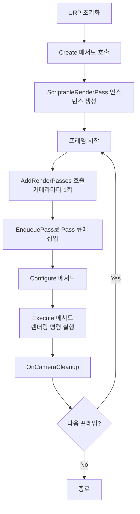

# 🛠️ 260205 Unity URP Render Feature 완벽 가이드

Unity의 Universal Render Pipeline(URP)에서 제공하는 Render Feature는 커스텀 렌더링 로직을 파이프라인에 주입할 수 있는 강력한 확장 메커니즘입니다. 이 가이드에서는 Render Feature의 개념부터 실전 활용까지 포괄적으로 다룹니다.

---

## 🧭 1. Render Feature 소개

### ✨ Render Feature란?

**Render Feature**는 URP Renderer에 추가적인 Render Pass를 삽입하여 커스텀 렌더링 효과를 구현할 수 있게 해주는 에셋입니다. 기본적으로 Unity의 렌더링 파이프라인은 정해진 순서대로 렌더링을 수행하지만, Render Feature를 통해 이 파이프라인의 특정 지점에 개발자가 원하는 렌더링 로직을 추가할 수 있습니다.

### 🔹 핵심 구성 요소

Render Feature는 두 가지 핵심 클래스로 구성됩니다:

```
┌─────────────────────────────────────────────┐
│       ScriptableRendererFeature             │
│  (Renderer Feature의 인터페이스 역할)         │
│                                             │
│  - Create() : Pass 인스턴스 생성             │
│  - AddRenderPasses() : Pass를 큐에 삽입      │
└─────────────────────────────────────────────┘
                    │
                    │ 생성 및 관리
                    ▼
┌─────────────────────────────────────────────┐
│        ScriptableRenderPass                 │
│   (실제 렌더링 작업을 수행)                   │
│                                             │
│  - Configure() : 렌더 타겟 설정              │
│  - Execute() : 렌더링 명령 실행              │
│  - OnCameraCleanup() : 정리 작업             │
└─────────────────────────────────────────────┘
```

### ✨ Render Feature의 역할

1. **ScriptableRendererFeature**: 파이프라인과의 인터페이스 역할을 하며, Render Pass의 생성 및 큐잉을 담당합니다.
2. **ScriptableRenderPass**: 실제 렌더링 작업을 수행하는 클래스로, 프레임마다 실행됩니다.

---

## 📌 2. 작동 원리

### ✨ Render Feature의 실행 흐름

Render Feature의 실행은 다음과 같은 생명주기를 따릅니다:



### 🔹 주요 메서드 설명

#### ▫️ Create()
- URP가 Renderer를 초기화할 때 한 번 호출됩니다
- ScriptableRenderPass 인스턴스를 생성하고 초기화합니다

#### ▫️ AddRenderPasses()
- 매 프레임마다 각 카메라당 한 번씩 호출됩니다
- ScriptableRenderPass 인스턴스를 Renderer의 큐에 삽입합니다
- `renderer.EnqueuePass(pass)`를 통해 Pass를 등록합니다

#### ▫️ Configure()
- Render Pass가 실행되기 전에 호출됩니다
- 렌더 타겟 및 클리어 상태를 설정합니다
- 임시 렌더 텍스처를 생성합니다

#### ▫️ Execute()
- 매 프레임마다 실행되는 핵심 메서드입니다
- CommandBuffer를 통해 렌더링 명령을 기록합니다
- 실제 렌더링 로직이 구현되는 곳입니다

#### ▫️ OnCameraCleanup()
- Render Pass 실행 후 정리 작업을 수행합니다
- 임시 리소스를 해제합니다

### 🔹 RenderPassEvent

Render Pass가 실행되는 타이밍을 제어합니다:

```csharp
public enum RenderPassEvent
{
    BeforeRendering,              // 렌더링 시작 전
    BeforeRenderingShadows,       // 그림자 렌더링 전
    AfterRenderingShadows,        // 그림자 렌더링 후
    BeforeRenderingPrePasses,     // Pre-pass 전
    AfterRenderingPrePasses,      // Pre-pass 후
    BeforeRenderingOpaques,       // 불투명 오브젝트 렌더링 전
    AfterRenderingOpaques,        // 불투명 오브젝트 렌더링 후
    BeforeRenderingSkybox,        // 스카이박스 렌더링 전
    AfterRenderingSkybox,         // 스카이박스 렌더링 후
    BeforeRenderingTransparents,  // 투명 오브젝트 렌더링 전
    AfterRenderingTransparents,   // 투명 오브젝트 렌더링 후
    BeforeRenderingPostProcessing,// 포스트 프로세싱 전
    AfterRenderingPostProcessing, // 포스트 프로세싱 후
    AfterRendering                // 렌더링 완료 후
}
```

---

## 🎯 3. 필요성

### 🎯 왜 Render Feature가 필요한가?

#### 🎮 1. **커스텀 렌더링 효과 구현**
- 기본 URP로는 구현할 수 없는 특수한 시각 효과를 만들 수 있습니다
- 예: 커스텀 포스트 프로세싱, 아웃라인 효과, 블러 효과 등

#### 🎮 2. **선택적 렌더링**
- Layer Mask를 활용하여 특정 오브젝트만 별도로 렌더링할 수 있습니다
- 예: 캐릭터 실루엣, 특정 레이어만 별도 처리

#### ▫️ 3. **카메라 독립적 효과**
- 일반 셰이더와 달리 카메라에 독립적으로 작동합니다
- 씬마다 설정할 필요 없이 프로젝트 전체에 적용 가능합니다

#### 🏗️ 4. **렌더링 파이프라인 확장**
- URP의 렌더링 순서에 커스텀 로직을 삽입할 수 있습니다
- 렌더링 파이프라인을 완전히 새로 만들 필요 없이 기능을 확장합니다

#### ⚡ 5. **성능 최적화**
- 특정 렌더링 작업을 분리하여 효율적으로 처리할 수 있습니다
- 조건부 렌더링으로 불필요한 연산을 줄일 수 있습니다

### 🔹 실제 사용 사례

- **게임 UI 효과**: 캐릭터가 장애물 뒤에 있을 때 실루엣 표시
- **포스트 프로세싱**: 커스텀 블러, 글로우, 아웃라인 효과
- **스타일라이즈드 렌더링**: 툰 셰이딩, NPR(Non-Photorealistic Rendering)
- **스텐실 효과**: 특정 영역에만 렌더링되는 효과
- **다중 카메라 렌더링**: 미니맵, 리플렉션, 포털 효과

---

## ⚠️ 4. 장단점

### ✅ 장점

#### ✅ **높은 유연성**
- 렌더링 파이프라인의 거의 모든 단계에 커스텀 로직을 삽입할 수 있습니다
- RenderPassEvent를 통해 정확한 타이밍을 제어할 수 있습니다

#### ✅ **재사용성**
- 한 번 작성한 Render Feature는 여러 프로젝트에서 재사용 가능합니다
- 모듈화된 구조로 유지보수가 용이합니다

#### ✅ **성능 효율성**
- 필요한 경우에만 실행되도록 조건부 로직을 구현할 수 있습니다
- GPU 인스턴싱 및 배칭과 호환됩니다

#### ✅ **Shader Graph 통합**
- HLSL을 직접 작성하지 않고 Shader Graph를 활용할 수 있습니다
- 비프로그래머도 시각적으로 셰이더를 작성 가능합니다

#### ✅ **크로스 플랫폼 지원**
- URP의 크로스 플랫폼 특성을 그대로 활용합니다
- 모바일부터 콘솔, PC, WebGL까지 모두 지원합니다

### ⚠️ 단점

#### ❌ **학습 곡선**
- 렌더링 파이프라인에 대한 깊은 이해가 필요합니다
- CommandBuffer, RenderTexture 등 저수준 API 지식이 요구됩니다

#### ❌ **디버깅 어려움**
- 렌더링 오류를 추적하기가 일반 코드보다 어렵습니다
- Frame Debugger를 활용한 디버깅 기술이 필요합니다

#### ❌ **성능 오버헤드 가능성**
- 잘못 구현하면 성능 저하를 일으킬 수 있습니다
- 불필요한 렌더 타겟 전환이나 메모리 할당은 성능에 악영향을 줍니다

#### ❌ **버전 의존성**
- Unity 버전에 따라 API가 변경될 수 있습니다
- Unity 6부터는 Render Graph API 사용을 권장하여 구 방식은 더 이상 개선되지 않습니다

#### ❌ **에디터 통합 제한**
- 실시간 프리뷰가 제한적일 수 있습니다
- 파라미터 조정 시 Scene View에 즉시 반영되지 않을 수 있습니다

### ⚡ 성능 고려사항

```
┌─────────────────────────────────────────────┐
│           성능 최적화 팁                      │
├─────────────────────────────────────────────┤
│ • 불필요한 렌더 타겟 전환 최소화              │
│ • 임시 텍스처는 재사용 고려                   │
│ • Depth/Stencil 버퍼 공유                    │
│ • 조건부 실행으로 불필요한 Pass 스킵          │
│ • CommandBuffer 명령 최적화                  │
│ • 해상도 스케일링 활용 (필요시)               │
└─────────────────────────────────────────────┘
```

---

## 🛠️ 5. 사용법

### ✨ 5.1 Render Feature 생성하기

#### ▫️ Step 1: Renderer Asset 찾기

1. Project 창에서 `Settings/UniversalRP-` 로 시작하는 Renderer Asset을 찾습니다
2. 또는 `Edit > Project Settings > Graphics`에서 현재 사용 중인 Renderer를 확인합니다

#### ✨ Step 2: Render Feature 추가

1. Renderer Asset을 선택합니다
2. Inspector 창 하단의 `Add Renderer Feature` 버튼을 클릭합니다
3. 내장 Render Feature를 선택하거나 커스텀 Feature를 추가합니다

### ✨ 5.2 커스텀 Render Feature 스크립트 작성

#### 🏗️ 기본 구조

```csharp
using UnityEngine;
using UnityEngine.Rendering;
using UnityEngine.Rendering.Universal;

// Render Feature 클래스
public class CustomRenderFeature : ScriptableRendererFeature
{
    // Inspector에 노출될 설정
    [System.Serializable]
    public class Settings
    {
        public RenderPassEvent renderPassEvent = RenderPassEvent.AfterRenderingOpaques;
        public Material material;
    }

    public Settings settings = new Settings();
    private CustomRenderPass _customPass;

    // Renderer 초기화 시 한 번 호출
    public override void Create()
    {
        _customPass = new CustomRenderPass(settings);
        _customPass.renderPassEvent = settings.renderPassEvent;
    }

    // 매 프레임 각 카메라마다 호출
    public override void AddRenderPasses(ScriptableRenderer renderer, ref RenderingData renderingData)
    {
        // 조건부 실행 (예: 게임 카메라에만 적용)
        if (renderingData.cameraData.cameraType == CameraType.Game)
        {
            renderer.EnqueuePass(_customPass);
        }
    }
}

// Render Pass 클래스
public class CustomRenderPass : ScriptableRenderPass
{
    private CustomRenderFeature.Settings _settings;
    private RenderTargetIdentifier _source;
    private RenderTargetHandle _tempTexture;

    public CustomRenderPass(CustomRenderFeature.Settings settings)
    {
        _settings = settings;
        _tempTexture.Init("_TempTexture");
    }

    // Pass 실행 전 설정
    public override void Configure(CommandBuffer cmd, RenderTextureDescriptor cameraTextureDescriptor)
    {
        // 임시 렌더 텍스처 생성
        cmd.GetTemporaryRT(_tempTexture.id, cameraTextureDescriptor);
    }

    // 실제 렌더링 명령 실행
    public override void Execute(ScriptableRenderContext context, ref RenderingData renderingData)
    {
        CommandBuffer cmd = CommandBufferPool.Get("CustomRenderPass");

        // 렌더링 로직 구현
        // ...

        context.ExecuteCommandBuffer(cmd);
        CommandBufferPool.Release(cmd);
    }

    // 정리 작업
    public override void OnCameraCleanup(CommandBuffer cmd)
    {
        cmd.ReleaseTemporaryRT(_tempTexture.id);
    }
}
```

### ✨ 5.3 Renderer Feature 활성화

1. 스크립트를 작성한 후 컴파일이 완료되면 Renderer Asset의 `Add Renderer Feature` 목록에 나타납니다
2. 커스텀 Feature를 선택하여 추가합니다
3. Inspector에서 설정값을 조정합니다

### ✨ 5.4 내장 Render Feature 활용

URP는 몇 가지 유용한 내장 Render Feature를 제공합니다:

#### ▫️ **Render Objects**
- 특정 레이어의 오브젝트를 별도로 렌더링합니다
- 오버라이드 Material을 적용할 수 있습니다
- 스텐실 설정 가능합니다

#### ▫️ **Decal**
- 데칼 렌더링을 지원합니다
- 표면에 스티커처럼 텍스처를 적용합니다

#### ▫️ **Screen Space Ambient Occlusion (SSAO)**
- 화면 공간 주변광 차폐 효과입니다
- 깊이감과 리얼리즘을 향상시킵니다

---

## 🧪 6. 간단한 예제: 풀스크린 컬러 틴트

화면 전체에 색상 틴트를 적용하는 간단한 Render Feature를 만들어보겠습니다.

### 🔹 6.1 셰이더 작성

먼저 간단한 Blit 셰이더를 작성합니다:

```shader
Shader "Custom/ColorTint"
{
    Properties
    {
        _MainTex ("Texture", 2D) = "white" {}
        _TintColor ("Tint Color", Color) = (1, 1, 1, 1)
        _Intensity ("Intensity", Range(0, 1)) = 0.5
    }

    SubShader
    {
        Tags { "RenderType"="Opaque" "RenderPipeline"="UniversalPipeline" }

        Pass
        {
            Name "ColorTint"

            HLSLPROGRAM
            #pragma vertex vert
            #pragma fragment frag

            #include "Packages/com.unity.render-pipelines.universal/ShaderLibrary/Core.hlsl"

            struct Attributes
            {
                float4 positionOS : POSITION;
                float2 uv : TEXCOORD0;
            };

            struct Varyings
            {
                float4 positionCS : SV_POSITION;
                float2 uv : TEXCOORD0;
            };

            TEXTURE2D(_MainTex);
            SAMPLER(sampler_MainTex);

            float4 _TintColor;
            float _Intensity;

            Varyings vert(Attributes input)
            {
                Varyings output;
                output.positionCS = TransformObjectToHClip(input.positionOS.xyz);
                output.uv = input.uv;
                return output;
            }

            half4 frag(Varyings input) : SV_Target
            {
                // 원본 색상 샘플링
                half4 color = SAMPLE_TEXTURE2D(_MainTex, sampler_MainTex, input.uv);

                // 틴트 색상과 블렌딩
                color.rgb = lerp(color.rgb, color.rgb * _TintColor.rgb, _Intensity);

                return color;
            }
            ENDHLSL
        }
    }
}
```

### ✨ 6.2 Render Feature 스크립트

```csharp
using UnityEngine;
using UnityEngine.Rendering;
using UnityEngine.Rendering.Universal;

public class ColorTintFeature : ScriptableRendererFeature
{
    [System.Serializable]
    public class Settings
    {
        public Material material;
        public Color tintColor = Color.white;
        [Range(0f, 1f)]
        public float intensity = 0.5f;
    }

    public Settings settings = new Settings();
    private ColorTintPass _tintPass;

    public override void Create()
    {
        _tintPass = new ColorTintPass(settings);
        _tintPass.renderPassEvent = RenderPassEvent.BeforeRenderingPostProcessing;
    }

    public override void AddRenderPasses(ScriptableRenderer renderer, ref RenderingData renderingData)
    {
        if (settings.material == null)
        {
            Debug.LogWarning("Color Tint Material is missing!");
            return;
        }

        _tintPass.Setup(renderer.cameraColorTarget);
        renderer.EnqueuePass(_tintPass);
    }
}

public class ColorTintPass : ScriptableRenderPass
{
    private ColorTintFeature.Settings _settings;
    private RenderTargetIdentifier _source;
    private RenderTargetHandle _tempTexture;

    private static readonly int TintColorID = Shader.PropertyToID("_TintColor");
    private static readonly int IntensityID = Shader.PropertyToID("_Intensity");

    public ColorTintPass(ColorTintFeature.Settings settings)
    {
        _settings = settings;
        _tempTexture.Init("_ColorTintTemp");
    }

    public void Setup(RenderTargetIdentifier source)
    {
        _source = source;
    }

    public override void Configure(CommandBuffer cmd, RenderTextureDescriptor cameraTextureDescriptor)
    {
        // 임시 렌더 텍스처 생성 (카메라와 동일한 해상도)
        cmd.GetTemporaryRT(_tempTexture.id, cameraTextureDescriptor);
    }

    public override void Execute(ScriptableRenderContext context, ref RenderingData renderingData)
    {
        CommandBuffer cmd = CommandBufferPool.Get("Color Tint Pass");

        // 셰이더 프로퍼티 설정
        _settings.material.SetColor(TintColorID, _settings.tintColor);
        _settings.material.SetFloat(IntensityID, _settings.intensity);

        // Blit: source -> temp texture
        cmd.Blit(_source, _tempTexture.Identifier(), _settings.material, 0);

        // Blit: temp texture -> source (결과를 원본에 다시 복사)
        cmd.Blit(_tempTexture.Identifier(), _source);

        context.ExecuteCommandBuffer(cmd);
        CommandBufferPool.Release(cmd);
    }

    public override void OnCameraCleanup(CommandBuffer cmd)
    {
        // 임시 텍스처 해제
        cmd.ReleaseTemporaryRT(_tempTexture.id);
    }
}
```

### 🔹 6.3 사용 방법

1. 셰이더를 프로젝트에 추가하고 Material을 생성합니다
2. ColorTintFeature 스크립트를 프로젝트에 추가합니다
3. URP Renderer Asset에서 `Add Renderer Feature > Color Tint Feature`를 선택합니다
4. Material 슬롯에 생성한 Material을 할당합니다
5. Tint Color와 Intensity를 조정하여 효과를 확인합니다

---

## 🧪 7. 실용적인 예제: 캐릭터 실루엣 효과

캐릭터가 장애물 뒤에 있을 때 실루엣을 표시하는 실용적인 예제입니다.

### 🔹 7.1 개념

```
일반 렌더링:
┌──────────────┐
│   벽   캐릭터 │  → 캐릭터가 완전히 가려짐
└──────────────┘

실루엣 렌더링:
┌──────────────┐
│   벽  [캐릭터]│  → 벽 뒤의 캐릭터 실루엣 표시
└──────────────┘
```

### 🔹 7.2 실루엣 셰이더

```shader
Shader "Custom/CharacterSilhouette"
{
    Properties
    {
        _SilhouetteColor ("Silhouette Color", Color) = (0, 0.5, 1, 0.5)
    }

    SubShader
    {
        Tags
        {
            "RenderType"="Transparent"
            "Queue"="Transparent"
            "RenderPipeline"="UniversalPipeline"
        }

        Pass
        {
            Name "Silhouette"

            // 깊이 테스트는 수행하되, 깊이 쓰기는 하지 않음
            ZWrite Off
            ZTest Greater  // 가려진 부분만 렌더링

            Blend SrcAlpha OneMinusSrcAlpha

            HLSLPROGRAM
            #pragma vertex vert
            #pragma fragment frag

            #include "Packages/com.unity.render-pipelines.universal/ShaderLibrary/Core.hlsl"

            struct Attributes
            {
                float4 positionOS : POSITION;
            };

            struct Varyings
            {
                float4 positionCS : SV_POSITION;
            };

            float4 _SilhouetteColor;

            Varyings vert(Attributes input)
            {
                Varyings output;
                output.positionCS = TransformObjectToHClip(input.positionOS.xyz);
                return output;
            }

            half4 frag(Varyings input) : SV_Target
            {
                return _SilhouetteColor;
            }
            ENDHLSL
        }
    }
}
```

### ✨ 7.3 Render Feature 구현

```csharp
using UnityEngine;
using UnityEngine.Rendering;
using UnityEngine.Rendering.Universal;

public class CharacterSilhouetteFeature : ScriptableRendererFeature
{
    [System.Serializable]
    public class Settings
    {
        public LayerMask characterLayer;  // 캐릭터 레이어
        public Material silhouetteMaterial;
        public Color silhouetteColor = new Color(0, 0.5f, 1, 0.5f);
    }

    public Settings settings = new Settings();
    private SilhouettePass _silhouettePass;

    public override void Create()
    {
        _silhouettePass = new SilhouettePass(settings);

        // 불투명 오브젝트 렌더링 후, 투명 오브젝트 렌더링 전에 실행
        _silhouettePass.renderPassEvent = RenderPassEvent.AfterRenderingOpaques;
    }

    public override void AddRenderPasses(ScriptableRenderer renderer, ref RenderingData renderingData)
    {
        if (settings.silhouetteMaterial == null)
        {
            Debug.LogWarning("Silhouette Material is missing!");
            return;
        }

        renderer.EnqueuePass(_silhouettePass);
    }
}

public class SilhouettePass : ScriptableRenderPass
{
    private CharacterSilhouetteFeature.Settings _settings;
    private FilteringSettings _filteringSettings;
    private RenderStateBlock _renderStateBlock;

    // 셰이더 태그와 일치하는 오브젝트만 렌더링
    private readonly ShaderTagId _shaderTagId = new ShaderTagId("UniversalForward");

    private static readonly int SilhouetteColorID = Shader.PropertyToID("_SilhouetteColor");

    public SilhouettePass(CharacterSilhouetteFeature.Settings settings)
    {
        _settings = settings;

        // 캐릭터 레이어의 불투명 오브젝트만 필터링
        _filteringSettings = new FilteringSettings(RenderQueueRange.opaque, _settings.characterLayer);

        // 렌더 스테이트 설정
        _renderStateBlock = new RenderStateBlock(RenderStateMask.Nothing);
    }

    public override void Execute(ScriptableRenderContext context, ref RenderingData renderingData)
    {
        // 셰이더 프로퍼티 설정
        _settings.silhouetteMaterial.SetColor(SilhouetteColorID, _settings.silhouetteColor);

        CommandBuffer cmd = CommandBufferPool.Get("Character Silhouette");

        // Drawing Settings 구성
        var drawingSettings = CreateDrawingSettings(
            _shaderTagId,
            ref renderingData,
            SortingCriteria.CommonOpaque
        );

        // 오버라이드 Material 설정 (모든 캐릭터를 실루엣 셰이더로 렌더링)
        drawingSettings.overrideMaterial = _settings.silhouetteMaterial;
        drawingSettings.overrideMaterialPassIndex = 0;

        // 렌더링 실행
        context.DrawRenderers(
            renderingData.cullResults,
            ref drawingSettings,
            ref _filteringSettings,
            ref _renderStateBlock
        );

        context.ExecuteCommandBuffer(cmd);
        CommandBufferPool.Release(cmd);
    }
}
```

### 🛠️ 7.4 설정 및 사용

#### 🛠️ Step 1: 레이어 설정
1. 캐릭터 오브젝트에 전용 레이어를 지정합니다 (예: "Character")

#### ▫️ Step 2: Material 생성
1. CharacterSilhouette 셰이더로 Material을 생성합니다
2. Silhouette Color를 원하는 색상으로 설정합니다 (예: 반투명 파란색)

#### ✨ Step 3: Render Feature 추가
1. URP Renderer Asset에서 `Add Renderer Feature > Character Silhouette Feature`를 선택합니다
2. Character Layer에 캐릭터 레이어를 설정합니다
3. Silhouette Material 슬롯에 Material을 할당합니다

#### ▫️ Step 4: 테스트
1. 캐릭터를 벽 뒤로 이동시킵니다
2. 가려진 부분에 실루엣이 표시되는지 확인합니다

### 🔹 7.5 개선 아이디어

```csharp
// 거리에 따른 실루엣 페이드
float distance = Vector3.Distance(characterPos, cameraPos);
float alpha = Mathf.Clamp01(1.0f - (distance / maxDistance));
silhouetteColor.a = alpha;

// 실루엣 펄스 애니메이션
float pulse = Mathf.Sin(Time.time * pulseSpeed) * 0.5f + 0.5f;
silhouetteColor.a *= pulse;

// 조건부 활성화 (특정 상황에서만 표시)
if (isPlayerNearby && isCharacterOccluded)
{
    renderer.EnqueuePass(_silhouettePass);
}
```

---

## 📌 8. 추가 학습 리소스

### 🔹 공식 문서
- [Unity Manual: Scriptable Renderer Feature](https://docs.unity3d.com/6000.1/Documentation/Manual/urp/renderer-features/create-custom-renderer-feature.html)
- [Unity Manual: Inject a Render Pass](https://docs.unity3d.com/6000.3/Documentation/Manual/urp/renderer-features/scriptable-renderer-features/inject-a-pass-using-a-scriptable-renderer-feature.html)
- [Unity Learn: Custom Render Passes with URP](https://learn.unity.com/tutorial/custom-render-passes-with-urp)

### 🔹 고급 주제
- **Render Graph API**: Unity 6부터 권장되는 새로운 렌더링 API
- **URP Batcher**: 렌더링 성능 최적화
- **Frame Debugger**: Render Feature 디버깅 도구
- **Shader Graph**: 비주얼 셰이더 작성 도구

### 🔹 커뮤니티 리소스
- [samdriver.xyz - Scriptable Renderer Feature](https://samdriver.xyz/article/scriptable-render)
- [danielilett.com - Outline Post Process](https://danielilett.com/2023-03-21-tut7-1-fullscreen-outlines/)
- [ameye.dev - Custom Render Passes](https://ameye.dev/notes/scriptable-render-passes/)

---

## 📌 9. 모범 사례 및 팁

### ✅ DO

1. **CommandBufferPool 사용**
   ```csharp
   CommandBuffer cmd = CommandBufferPool.Get("PassName");
   // ... 사용 ...
   context.ExecuteCommandBuffer(cmd);
   CommandBufferPool.Release(cmd);
   ```

2. **조건부 실행**
   ```csharp
   public override void AddRenderPasses(ScriptableRenderer renderer, ref RenderingData renderingData)
   {
       // 게임 카메라에만 적용
       if (renderingData.cameraData.cameraType == CameraType.Game)
       {
           renderer.EnqueuePass(_pass);
       }
   }
   ```

3. **임시 텍스처 정리**
   ```csharp
   public override void OnCameraCleanup(CommandBuffer cmd)
   {
       cmd.ReleaseTemporaryRT(_tempTexture.id);
   }
   ```

4. **Shader Property ID 캐싱**
   ```csharp
   private static readonly int ColorID = Shader.PropertyToID("_Color");
   ```

### ❌ DON'T

1. **Execute에서 무거운 연산 수행**
   - Execute는 매 프레임 실행되므로 최적화가 중요합니다

2. **임시 리소스 누수**
   - GetTemporaryRT로 생성한 텍스처는 반드시 ReleaseTemporaryRT로 해제해야 합니다

3. **불필요한 Blit**
   - Blit은 비용이 큰 작업이므로 최소화해야 합니다

4. **Material 인스턴스 생성**
   - Execute 내부에서 Material 인스턴스를 생성하면 메모리 누수가 발생합니다

---

## 📌 10. 결론

Unity URP의 Render Feature는 강력하고 유연한 렌더링 확장 메커니즘입니다. 초기 학습 곡선은 있지만, 한 번 익히면 다양한 커스텀 렌더링 효과를 구현할 수 있습니다.

### 🔹 핵심 요약

```
┌─────────────────────────────────────────────┐
│         Render Feature 핵심 개념             │
├─────────────────────────────────────────────┤
│ 1. ScriptableRendererFeature               │
│    - 파이프라인 인터페이스                   │
│    - Pass 생성 및 관리                       │
│                                             │
│ 2. ScriptableRenderPass                    │
│    - 실제 렌더링 로직                        │
│    - CommandBuffer로 명령 기록               │
│                                             │
│ 3. RenderPassEvent                         │
│    - 실행 타이밍 제어                        │
│    - 파이프라인 단계 선택                    │
│                                             │
│ 4. 활용 분야                                │
│    - 포스트 프로세싱                         │
│    - 커스텀 렌더링 효과                      │
│    - 선택적 렌더링                           │
│    - 스타일라이즈드 렌더링                   │
└─────────────────────────────────────────────┘
```

### 🔹 다음 단계

1. **기본 예제 실습**: 컬러 틴트, 블러 등 간단한 효과부터 시작합니다
2. **Frame Debugger 활용**: 렌더링 과정을 시각화하고 이해합니다
3. **Shader Graph 학습**: HLSL 없이 셰이더를 작성하는 방법을 배웁니다
4. **Render Graph API**: Unity 6의 최신 렌더링 API를 탐구합니다
5. **성능 프로파일링**: Profiler로 렌더링 성능을 측정하고 최적화합니다

Render Feature를 마스터하면 Unity URP의 렌더링 파이프라인을 자유자재로 확장할 수 있으며, 독창적이고 최적화된 시각 효과를 구현할 수 있습니다.

---

## 🔗 참고 자료 (Sources)

### 🔹 공식 Unity 문서
- [Introduction to URP for advanced creators (Unity 6 edition)](https://unity.com/resources/introduction-to-urp-advanced-creators-unity-6)
- [Unity Manual: Example of a complete Scriptable Renderer Feature in URP](https://docs.unity3d.com/6000.1/Documentation/Manual/urp/renderer-features/create-custom-renderer-feature.html)
- [Unity Manual: Inject a render pass with a Scriptable Renderer Feature in URP](https://docs.unity3d.com/6000.3/Documentation/Manual/urp/renderer-features/scriptable-renderer-features/inject-a-pass-using-a-scriptable-renderer-feature.html)
- [Unity Manual: Add a Renderer Feature to a URP Renderer](https://docs.unity3d.com/6000.3/Documentation/Manual/urp/urp-renderer-feature.html)
- [Unity Learn: Custom Render Passes with URP](https://learn.unity.com/tutorial/custom-render-passes-with-urp)
- [Unity Learn: Introduction to URP](https://learn.unity.com/tutorial/introduction-to-urp)
- [Unity Learn: Up and Running with URP](https://learn.unity.com/project/up-and-running-with-urp)
- [URP Renderer Feature Documentation](https://docs.unity3d.com/Packages/com.unity.render-pipelines.universal@10.1/manual/urp-renderer-feature.html)

### 🏗️ 렌더링 파이프라인 비교
- [Unity: Understanding URP, HDRP, and Built-In Render Pipeline](https://www.wayline.io/blog/unity-understanding-urp-hdrp-built-in)
- [Unity Manual: Render pipeline feature comparison](https://docs.unity3d.com/6000.3/Documentation/Manual/render-pipelines-feature-comparison.html)
- [Choosing Between HDRP, URP, and Built-in Render Pipelines in Unity](https://kridabytes.com/choosing-between-hdrp-urp-and-built-in-render-pipelines-in-unity/)

### 🧪 실용 예제 및 튜토리얼
- [Scriptable Renderer Feature - samdriver.xyz](https://samdriver.xyz/article/scriptable-render)
- [Setting up for a URP Fullscreen Outline Effect](https://fazz.dev/articles/outline-shader-urp)
- [Outline Shaders in Unity's URP - ACM Studio](https://studio.uclaacm.com/byte-sized-tutorials/unity-urp-outline-shaders)
- [Outline Post Process in Unity Shader Graph (URP)](https://danielilett.com/2023-03-21-tut7-1-fullscreen-outlines/)
- [Creating a Full-Screen Outline Shader in Unity URP](https://medium.com/@chitranshnishad27/creating-a-full-screen-outline-shader-in-unity-urp-6c70744932c1)
- [Custom Render Passes in Unity](https://ameye.dev/notes/scriptable-render-passes/)

### 🏗️ 아키텍처 및 고급 주제
- [Analysis of Unity Rendering Pipeline Technology: URP Architecture Design and Implementation Principles](https://www.oreateai.com/blog/analysis-of-unity-rendering-pipeline-technology-urp-architecture-design-and-implementation-principles/6971ac9ac5ee7c2e0390ae27d7fbc437)
- [Custom Renderer Features - Cyanilux Shader Tutorials](https://www.cyanilux.com/tutorials/custom-renderer-features/)
- [Understanding Unity's Render Pipelines](https://www.4rknova.com/blog/2025/08/04/unity-render-pipelines)

### 🔹 GitHub 리포지토리
- [Unity-outline: Object outlines for Built-in and URP](https://github.com/Snapchip/Unity-outline)
- [Unity-URP-Outlines: Screen space outlines](https://github.com/Robinseibold/Unity-URP-Outlines)
- [UnityFx.Outline: Screen-space outlines](https://github.com/Arvtesh/UnityFx.Outline)

---

**작성일**: 2026년 2월 5일
**대상**: Unity URP를 사용하는 개발자
**난이도**: 중급 ~ 고급
**Unity 버전**: Unity 6 (2023.x 이상 호환)
