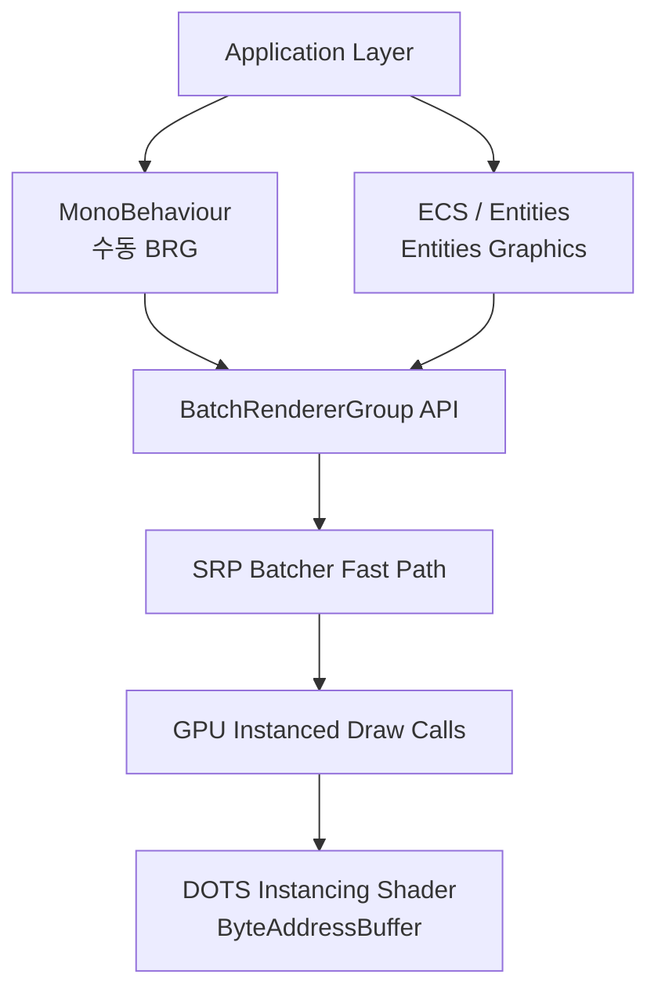
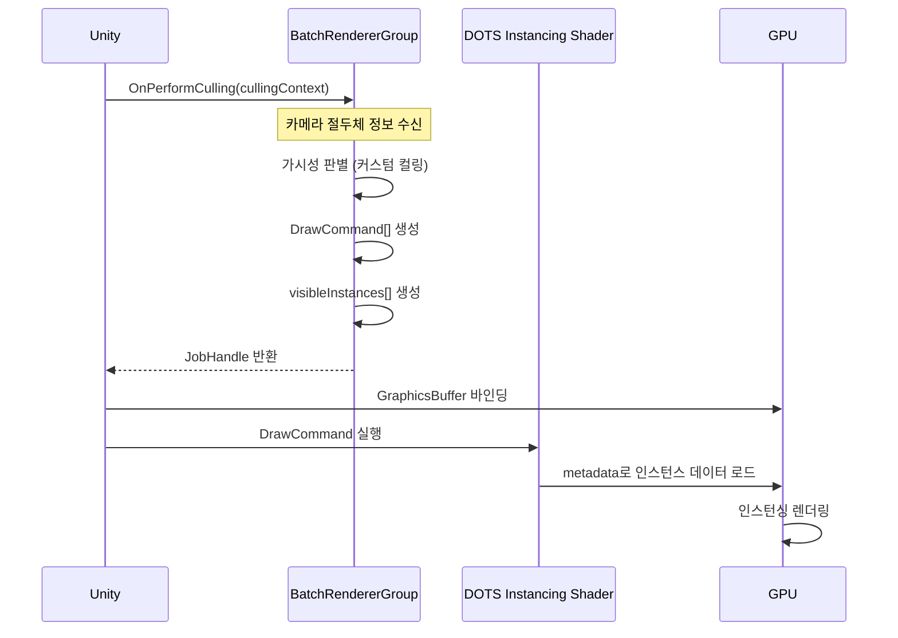

# 🛠️ 260211 Unity BRG(BatchRendererGroup) 완벽 가이드

## 📚 목차
1. [BRG 소개](#1-brg-소개)
2. [BRG의 필요성](#2-brg의-필요성)
3. [기존 방식과 차이점](#3-기존-방식과-차이점)
4. [장단점](#4-장단점)
5. [아키텍처와 내부 동작 원리](#5-아키텍처와-내부-동작-원리)
6. [간단한 개념 예제](#6-간단한-개념-예제)
7. [실용적 예제 - 동적 인스턴스](#7-실용적-예제---동적-인스턴스)
8. [실무 주의사항 및 팁](#8-실무-주의사항-및-팁)
9. [버전별 지원 현황](#9-버전별-지원-현황)

---

## 🧭 1. BRG 소개

**BatchRendererGroup(BRG)** 은 Unity 2022.1에서 도입된 **고성능 커스텀 렌더링 API**이다. SRP(Scriptable Render Pipeline) 및 SRP Batcher와 연동하여, C# 코드에서 직접 GPU 인스턴싱 draw call을 효율적으로 생성할 수 있게 해준다.

### 🔹 핵심 개념

BRG의 핵심은 **draw command**이다. Unity가 렌더링을 수행할 때마다 `OnPerformCulling` 콜백을 호출하고, 개발자는 이 콜백에서 가시성 판별과 draw command 목록을 생성한다.

### 🔹 주요 특성

- **DOTS Instancing 셰이더** 사용 (단, DOTS/ECS 패키지는 필수 아님)
- **Burst 컴파일러** 및 **C# Job System**과 함께 사용 가능
- **GameObject 없이** 대량의 인스턴스를 렌더링
- URP, HDRP 모두 지원 (Built-in RP는 미지원)

### 🔹 BRG와 DOTS/ECS의 관계

BRG는 독립적으로 사용 가능한 **저수준 렌더링 API**이다. ECS가 없어도 MonoBehaviour에서 직접 사용할 수 있다.



- **Entities Graphics** 패키지는 내부적으로 BRG를 사용하여 ECS Entity를 렌더링
- **BRG 단독 사용 시**: MonoBehaviour에서 직접 GraphicsBuffer를 관리하고 draw command를 생성
- **Unity 6 GPU Resident Drawer**: BRG를 내부적으로 사용하여 일반 GameObject(MeshRenderer)를 자동으로 GPU 인스턴싱

---

## 🎯 2. BRG의 필요성

대규모 인스턴스 렌더링 시나리오에서 기존 방식들의 한계를 극복하기 위해 BRG가 만들어졌다.

### 🔹 기존 방식의 문제점

| 문제 | 설명 |
|------|------|
| **GameObject 오버헤드** | 수천 개의 오브젝트를 개별 관리하면 Transform 업데이트, PostLateUpdate 등 CPU 비용이 막대 |
| **GC 압박** | `Graphics.DrawMeshInstanced()`는 매 프레임 managed 배열을 요구하여 GC를 유발 |
| **매 프레임 데이터 업로드** | 기존 인스턴싱은 매 프레임 CPU→GPU로 행렬 데이터를 전송해야 함 |
| **커스터마이징 제약** | 인스턴스별 속성 변경에 별도의 커스텀 셰이더 작성이 필요 |

### 🔹 BRG가 해결하는 것

- **영속적 GPU 메모리**: GraphicsBuffer를 여러 프레임에 걸쳐 재사용. 변경분만 업데이트
- **Managed Memory 제거**: NativeArray 기반으로 GC 부담 없음
- **Burst 호환**: managed memory를 사용하지 않으므로 Burst로 CPU 측 로직 최적화 가능
- **인스턴스별 속성 자유도**: 커스텀 셰이더 없이 인스턴스별 색상, 값 등을 지정 가능

### 🔹 대표적 사용 사례

- 절차적으로 배치된 식물, 바위, 풀 등 **대량 환경 오브젝트**
- **군중 시뮬레이션**, 파티클 대체
- **인터랙티브 물리 기반 장면** (수천 개의 큐브 등)

---

## ✅ 3. 기존 방식과 차이점

### ⚖️ 렌더링 방식 비교표

| 항목 | GameObject 기반 | Graphics.DrawMeshInstanced | BRG |
|------|:-:|:-:|:-:|
| **인스턴스 수 한계** | 수백~수천 (CPU 병목) | ~1023 per call | 수천~수만+ |
| **메모리 방식** | Managed (GC 발생) | Managed 배열 (GC 발생) | Unmanaged (GC 없음) |
| **GPU 데이터 관리** | Unity 자동 관리 | 매 프레임 업로드 | 영속적 GraphicsBuffer |
| **Burst 호환** | X | X | O |
| **Job System 호환** | 제한적 | 제한적 | 완전 호환 |
| **커스텀 셰이더** | 불필요 | 인스턴스별 속성 시 필요 | 불필요 (DOTS_INSTANCING_ON 자동) |
| **컬링** | Unity 자동 | 없음 | 개발자 직접 구현 |
| **SRP Batcher** | 호환 | 비호환 | 완전 통합 |
| **Transform 오버헤드** | 큼 | 없음 | 없음 |

### ⚖️ 데이터 흐름 비교

```
[Graphics.DrawMeshInstanced]
매 프레임: CPU → Matrix4x4[] 생성(managed) → GPU 업로드 → Draw Call
           ↑ 매번 GC 부담 + 전체 재업로드

[BatchRendererGroup]
초기화:   GraphicsBuffer 할당 → 데이터 업로드 (1회)
매 프레임: OnPerformCulling → DrawCommand 생성 → GPU 기존 버퍼 재사용
변경 시:  GraphicsBuffer.SetData()로 변경분만 업데이트
          ↑ GC 없음 + 부분 업데이트 가능
```

### ⚡ 성능 벤치마크 사례

**모바일 (Unity 공식 테스트)**
- Samsung Galaxy A51 (2019, 저가형), Mali G72-MP3, GLES 3.0
- 애니메이션 큐브 + 미사일 + 구체 + 파편 파티클 포함 씬에서 **안정적 60fps** 달성

**데스크톱 (2,000 인스턴스 기준)**
- BRG 방식이 `Graphics.DrawMeshInstanced()`보다 렌더링 단계에서 측정 가능한 성능 향상
- Job System 병렬화 적용 시 Update() 오버헤드가 **3.67ms → 인스턴싱 수준**으로 감소

---

## ⚠️ 4. 장단점

### ✅ 장점

1. **극한의 성능**: Burst + Job System + 영속 GPU 버퍼 조합으로 CPU/GPU 양쪽 최적화
2. **GC 프리**: managed memory를 사용하지 않아 GC spike 없음
3. **대규모 인스턴싱**: 단일 DrawCommand로 수천 개 인스턴스 렌더링 가능
4. **인스턴스별 속성 자유도**: 색상, 크기 등을 인스턴스별로 자유롭게 지정
5. **ECS 불필요**: DOTS Instancing 셰이더를 사용하지만 Entities 패키지 불필요
6. **SRP Batcher 완전 통합**: draw call 최적화의 이점을 최대로 활용

### ⚠️ 단점

1. **높은 진입 장벽**: unsafe 코드, 수동 메모리 관리, GPU 버퍼 레이아웃 직접 설계
2. **컬링 직접 구현**: Unity가 frustum/occlusion culling을 수행하지 않음
3. **GLES 제한**: vertex stage SSBO 접근 불가한 기기에서 Constant Buffer 폴백 (16KiB 제한)
4. **디버깅 어려움**: 버퍼 레이아웃 오류, 메타데이터 설정 실수 등 추적이 어려움
5. **Built-in RP 미지원**: URP, HDRP, Custom SRP에서만 동작
6. **복잡한 셋업**: 단순한 렌더링에도 상당한 보일러플레이트 코드 필요

---

## 🏗️ 5. 아키텍처와 내부 동작 원리

### 🏗️ 5.1 전체 아키텍처

```
  ┌─────────────────────────────────────────────────────┐
  │                   Application Layer                  │
  │                                                      │
  │  ┌──────────────┐    ┌──────────────────────────┐   │
  │  │ MonoBehaviour │    │   ECS / Entities          │   │
  │  │ (수동 BRG)    │    │   (Entities Graphics)     │   │
  │  └──────┬───────┘    └────────────┬─────────────┘   │
  │         │                         │                  │
  │         v                         v                  │
  │  ┌─────────────────────────────────────────────┐    │
  │  │        BatchRendererGroup API                │    │
  │  │  · GraphicsBuffer (unity_DOTSInstanceData)   │    │
  │  │  · MetadataValue (property → byte offset)    │    │
  │  │  · OnPerformCulling (draw command 생성)       │    │
  │  └──────────────────┬──────────────────────────┘    │
  │                     │                                │
  │                     v                                │
  │  ┌─────────────────────────────────────────────┐    │
  │  │         SRP Batcher (Fast Path)              │    │
  │  │  · Render state 변경 최소화                    │    │
  │  │  · Material data GPU 영속 유지                 │    │
  │  └──────────────────┬──────────────────────────┘    │
  │                     │                                │
  │                     v                                │
  │  ┌─────────────────────────────────────────────┐    │
  │  │      GPU Instanced Draw Calls                │    │
  │  │  · DOTS Instancing Shader                    │    │
  │  │  · ByteAddressBuffer unity_DOTSInstanceData  │    │
  │  └─────────────────────────────────────────────┘    │
  └─────────────────────────────────────────────────────┘
```

### 🔹 5.2 GraphicsBuffer 메모리 레이아웃

BRG의 핵심은 **GraphicsBuffer**이다. GPU 측 SSBO(Shader Storage Buffer Object)로 동작하며, 모든 인스턴스 데이터를 보관한다.

**Structure of Arrays (SoA) 레이아웃:**

```
바이트 오프셋    내용                              크기 (인스턴스당)
──────────────────────────────────────────────────────────
0               64바이트 제로                       - (BRG 규약)
64              패딩 (정렬용)                       -
96              unity_ObjectToWorld[0..N]           48B (float3x4)
96 + 48*N       unity_WorldToObject[0..N]           48B (float3x4)
96 + 96*N       _BaseColor[0..N]                    16B (float4)
...             추가 커스텀 속성들                    -
```

> 💡 **중요**: 처음 64바이트는 반드시 0으로 초기화해야 한다. metadata value가 기본값 0일 때 셰이더가 address 0에서 로드하면 0을 반환하게 하는 BRG 규약이다.

### 🔹 5.3 PackedMatrix (float3x4)

SRP 셰이더는 4x4가 아닌 **3x4(12 float)** 형식을 기대한다. w 컴포넌트(항상 0,0,0,1)를 생략하여 메모리를 절약:

```csharp
struct PackedMatrix
{
    public float c0x, c0y, c0z;  // column 0
    public float c1x, c1y, c1z;  // column 1
    public float c2x, c2y, c2z;  // column 2
    public float c3x, c3y, c3z;  // column 3 (position)

    public PackedMatrix(Matrix4x4 m)
    {
        c0x = m.m00; c0y = m.m10; c0z = m.m20;
        c1x = m.m01; c1y = m.m11; c1z = m.m21;
        c2x = m.m02; c2y = m.m12; c2z = m.m22;
        c3x = m.m03; c3y = m.m13; c3z = m.m23;
    }
}
```

### 🔹 5.4 MetadataValue와 주소 인코딩

```csharp
MetadataValue {
    int NameID;   // Shader.PropertyToID("unity_ObjectToWorld") 등
    uint Value;   // 바이트 주소 | 0x80000000
}
```

**Value 필드 32비트 인코딩 규칙:**

```
Bit 31 (MSB)    Bits 0-30
────────────    ─────────────────────────────────────
0               byte address → 모든 인스턴스가 같은 주소에서 로드 (상수)
1               byte address → address + sizeof(Type) * instanceID (per-instance 배열)
```

- **MSB = 1 (0x80000000)**: 인스턴스별 고유 데이터가 있음을 의미 (가장 일반적)
- **MSB = 0**: 모든 인스턴스가 동일한 값을 공유 (상수 프로퍼티)

### 🔹 5.5 셰이더 측 동작

BRG는 `DOTS_INSTANCING_ON` 키워드가 활성화된 특수 셰이더 변형을 사용한다.

```hlsl
// 셰이더에서 DOTS Instancing 프로퍼티 선언
UNITY_DOTS_INSTANCING_START(MaterialPropertyMetadata)
    UNITY_DOTS_INSTANCED_PROP(float4, _BaseColor)
UNITY_DOTS_INSTANCING_END(MaterialPropertyMetadata)

// 프래그먼트 셰이더에서 접근
float4 color = UNITY_ACCESS_DOTS_INSTANCED_PROP_WITH_DEFAULT(float4, _BaseColor);
```

**셰이더 접근 매크로:**

| 매크로 | 동작 |
|--------|------|
| `UNITY_ACCESS_DOTS_INSTANCED_PROP` | 버퍼에서 직접 로드 |
| `UNITY_ACCESS_DOTS_INSTANCED_PROP_WITH_DEFAULT` | MSB=0이면 material property로 폴백 |
| `UNITY_ACCESS_DOTS_INSTANCED_PROP_WITH_CUSTOM_DEFAULT` | MSB=0이면 커스텀 기본값 사용 |

### 🏗️ 5.6 컬링 파이프라인

Unity는 BRG 인스턴스에 대해 **자동 컬링을 수행하지 않는다**. `OnPerformCulling` 콜백에서 `BatchCullingContext`를 통해 카메라 위치, 절두체 평면, LOD 파라미터를 제공하며, 개발자가 직접 구현해야 한다.



---

## 🧪 6. 간단한 개념 예제

3개의 큐브를 서로 다른 위치와 색상으로 렌더링하는 최소 예제이다.

```csharp
using System;
using Unity.Collections;
using Unity.Collections.LowLevel.Unsafe;
using Unity.Jobs;
using UnityEngine;
using UnityEngine.Rendering;

public class SimpleBRGExample : MonoBehaviour
{
    public Mesh mesh;
    public Material material;

    private BatchRendererGroup _brg;
    private GraphicsBuffer _instanceData;
    private BatchID _batchID;
    private BatchMeshID _meshID;
    private BatchMaterialID _materialID;

    // 상수 정의
    private const int kSizeOfPackedMatrix = sizeof(float) * 4 * 3; // 48B (float3x4)
    private const int kSizeOfFloat4 = sizeof(float) * 4;           // 16B
    private const int kNumInstances = 3;

    // float3x4 패킹 구조체
    struct PackedMatrix
    {
        public float c0x, c0y, c0z;
        public float c1x, c1y, c1z;
        public float c2x, c2y, c2z;
        public float c3x, c3y, c3z;

        public PackedMatrix(Matrix4x4 m)
        {
            c0x = m.m00; c0y = m.m10; c0z = m.m20;
            c1x = m.m01; c1y = m.m11; c1z = m.m21;
            c2x = m.m02; c2y = m.m12; c2z = m.m22;
            c3x = m.m03; c3y = m.m13; c3z = m.m23;
        }
    }

    void OnEnable()
    {
        // BRG 생성 및 메시/머터리얼 등록
        _brg = new BatchRendererGroup(OnPerformCulling, IntPtr.Zero);
        _meshID = _brg.RegisterMesh(mesh);
        _materialID = _brg.RegisterMaterial(material);

        // GraphicsBuffer 할당
        // 레이아웃: [64B 제로] [32B 패딩] [O2W * 3] [W2O * 3] [Color * 3]
        int totalBytes = 64 + 32
            + kSizeOfPackedMatrix * kNumInstances  // ObjectToWorld
            + kSizeOfPackedMatrix * kNumInstances  // WorldToObject
            + kSizeOfFloat4 * kNumInstances;       // Color
        var bufferCountInInts = (totalBytes + 3) / 4;

        _instanceData = new GraphicsBuffer(
            GraphicsBuffer.Target.Raw,
            bufferCountInInts,
            sizeof(int));

        // 인스턴스별 위치 행렬 생성
        var matrices = new Matrix4x4[]
        {
            Matrix4x4.Translate(new Vector3(-2, 0, 0)),
            Matrix4x4.Translate(new Vector3( 0, 0, 0)),
            Matrix4x4.Translate(new Vector3( 2, 0, 0)),
        };

        var objectToWorld = new PackedMatrix[kNumInstances];
        var worldToObject = new PackedMatrix[kNumInstances];
        for (var i = 0; i < kNumInstances; i++)
        {
            objectToWorld[i] = new PackedMatrix(matrices[i]);
            worldToObject[i] = new PackedMatrix(matrices[i].inverse);
        }

        // 인스턴스별 고유 색상
        var colors = new Vector4[]
        {
            new Vector4(1, 0, 0, 1), // 빨강
            new Vector4(0, 1, 0, 1), // 초록
            new Vector4(0, 0, 1, 1), // 파랑
        };

        // 버퍼 오프셋 계산 및 데이터 업로드
        uint byteAddressO2W = kSizeOfPackedMatrix * 2; // 96
        uint byteAddressW2O = byteAddressO2W + (uint)(kSizeOfPackedMatrix * kNumInstances);
        uint byteAddressColor = byteAddressW2O + (uint)(kSizeOfPackedMatrix * kNumInstances);

        // 처음 64바이트를 0으로 초기화 (BRG 규약)
        _instanceData.SetData(new Matrix4x4[] { Matrix4x4.zero }, 0, 0, 1);

        // 행렬 및 색상 데이터 GPU 업로드
        _instanceData.SetData(objectToWorld, 0,
            (int)(byteAddressO2W / kSizeOfPackedMatrix), kNumInstances);
        _instanceData.SetData(worldToObject, 0,
            (int)(byteAddressW2O / kSizeOfPackedMatrix), kNumInstances);
        _instanceData.SetData(colors, 0,
            (int)(byteAddressColor / kSizeOfFloat4), kNumInstances);

        // 메타데이터 설정 (0x80000000 = per-instance 배열 표시)
        var metadata = new NativeArray<MetadataValue>(3, Allocator.Temp);
        metadata[0] = new MetadataValue
        {
            NameID = Shader.PropertyToID("unity_ObjectToWorld"),
            Value = 0x80000000 | byteAddressO2W,
        };
        metadata[1] = new MetadataValue
        {
            NameID = Shader.PropertyToID("unity_WorldToObject"),
            Value = 0x80000000 | byteAddressW2O,
        };
        metadata[2] = new MetadataValue
        {
            NameID = Shader.PropertyToID("_BaseColor"),
            Value = 0x80000000 | byteAddressColor,
        };

        // 배치 등록
        _batchID = _brg.AddBatch(metadata, _instanceData.bufferHandle);
    }

    void OnDisable()
    {
        _instanceData.Dispose();
        _brg.Dispose();
    }

    // 컬링 콜백 - Unity가 렌더링 시마다 호출
    public unsafe JobHandle OnPerformCulling(
        BatchRendererGroup rendererGroup,
        BatchCullingContext cullingContext,
        BatchCullingOutput cullingOutput,
        IntPtr userContext)
    {
        var drawCommands =
            (BatchCullingOutputDrawCommands*)cullingOutput.drawCommands.GetUnsafePtr();

        var alignment = UnsafeUtility.AlignOf<long>();

        // 메모리 할당 (TempJob 필수 - Unity가 렌더링 후 자동 해제)
        drawCommands->drawCommands = (BatchDrawCommand*)UnsafeUtility.Malloc(
            UnsafeUtility.SizeOf<BatchDrawCommand>(), alignment, Allocator.TempJob);
        drawCommands->drawRanges = (BatchDrawRange*)UnsafeUtility.Malloc(
            UnsafeUtility.SizeOf<BatchDrawRange>(), alignment, Allocator.TempJob);
        drawCommands->visibleInstances = (int*)UnsafeUtility.Malloc(
            kNumInstances * sizeof(int), alignment, Allocator.TempJob);
        drawCommands->drawCommandPickingEntityIds = null;

        drawCommands->drawCommandCount = 1;
        drawCommands->drawRangeCount = 1;
        drawCommands->visibleInstanceCount = kNumInstances;
        drawCommands->instanceSortingPositions = null;
        drawCommands->instanceSortingPositionFloatCount = 0;

        // DrawCommand 설정 - 3개 인스턴스를 하나의 draw call로
        drawCommands->drawCommands[0].visibleOffset = 0;
        drawCommands->drawCommands[0].visibleCount = (uint)kNumInstances;
        drawCommands->drawCommands[0].batchID = _batchID;
        drawCommands->drawCommands[0].materialID = _materialID;
        drawCommands->drawCommands[0].meshID = _meshID;
        drawCommands->drawCommands[0].submeshIndex = 0;
        drawCommands->drawCommands[0].splitVisibilityMask = 0xff;
        drawCommands->drawCommands[0].flags = 0;
        drawCommands->drawCommands[0].sortingPosition = 0;

        // DrawRange 설정
        drawCommands->drawRanges[0].drawCommandsBegin = 0;
        drawCommands->drawRanges[0].drawCommandsCount = 1;
        drawCommands->drawRanges[0].filterSettings = new BatchFilterSettings
        {
            renderingLayerMask = 0xffffffff,
        };

        // 모든 인스턴스를 가시(visible)로 설정
        for (var i = 0; i < kNumInstances; ++i)
            drawCommands->visibleInstances[i] = i;

        return new JobHandle();
    }
}
```

### 🛠️ 사용법

1. 빈 GameObject에 `SimpleBRGExample` 컴포넌트를 추가
2. Inspector에서 `mesh`에 Cube Mesh, `material`에 URP Lit Material을 할당
3. 플레이 → 3개의 색이 다른 큐브가 나란히 렌더링됨

---

## 🧪 7. 실용적 예제 - 동적 인스턴스

1000개의 큐브가 그리드 형태로 배치되어 사인파로 출렁이는 애니메이션 예제이다.

```csharp
using System;
using Unity.Collections;
using Unity.Collections.LowLevel.Unsafe;
using Unity.Jobs;
using UnityEngine;
using UnityEngine.Rendering;

public class DynamicBRGExample : MonoBehaviour
{
    public Mesh mesh;
    public Material material;

    private BatchRendererGroup _brg;
    private GraphicsBuffer _instanceData;
    private BatchID _batchID;
    private BatchMeshID _meshID;
    private BatchMaterialID _materialID;

    private const int kSizeOfPackedMatrix = sizeof(float) * 4 * 3;
    private const int kSizeOfFloat4 = sizeof(float) * 4;
    private const int kGridSize = 32;
    private const int kNumInstances = kGridSize * kGridSize; // 1024개

    // CPU 측 shadow copy (매 프레임 업데이트 후 GPU에 전송)
    private PackedMatrix[] _objectToWorld;
    private PackedMatrix[] _worldToObject;

    private uint _byteAddressO2W;
    private uint _byteAddressW2O;

    struct PackedMatrix
    {
        public float c0x, c0y, c0z;
        public float c1x, c1y, c1z;
        public float c2x, c2y, c2z;
        public float c3x, c3y, c3z;

        public PackedMatrix(Matrix4x4 m)
        {
            c0x = m.m00; c0y = m.m10; c0z = m.m20;
            c1x = m.m01; c1y = m.m11; c1z = m.m21;
            c2x = m.m02; c2y = m.m12; c2z = m.m22;
            c3x = m.m03; c3y = m.m13; c3z = m.m23;
        }
    }

    void OnEnable()
    {
        _brg = new BatchRendererGroup(OnPerformCulling, IntPtr.Zero);
        _meshID = _brg.RegisterMesh(mesh);
        _materialID = _brg.RegisterMaterial(material);

        // 버퍼 크기 계산 및 할당
        var totalBytes = 64 + 32
            + kSizeOfPackedMatrix * kNumInstances * 2
            + kSizeOfFloat4 * kNumInstances;
        var bufferCountInInts = (totalBytes + 3) / 4;

        _instanceData = new GraphicsBuffer(
            GraphicsBuffer.Target.Raw,
            bufferCountInInts,
            sizeof(int));

        // 오프셋 계산
        _byteAddressO2W = kSizeOfPackedMatrix * 2; // 96
        _byteAddressW2O = _byteAddressO2W + (uint)(kSizeOfPackedMatrix * kNumInstances);
        var byteAddressColor = _byteAddressW2O + (uint)(kSizeOfPackedMatrix * kNumInstances);

        // 제로 초기화 (BRG 규약)
        _instanceData.SetData(new Matrix4x4[] { Matrix4x4.zero }, 0, 0, 1);

        // CPU 측 shadow copy 배열 초기화
        _objectToWorld = new PackedMatrix[kNumInstances];
        _worldToObject = new PackedMatrix[kNumInstances];

        // 그리드 형태로 초기 위치 설정
        for (var i = 0; i < kNumInstances; i++)
        {
            var row = i / kGridSize;
            var col = i % kGridSize;
            var pos = new Vector3(col * 1.5f, 0, row * 1.5f);
            var m = Matrix4x4.Translate(pos);
            _objectToWorld[i] = new PackedMatrix(m);
            _worldToObject[i] = new PackedMatrix(m.inverse);
        }

        // 초기 행렬 업로드
        _instanceData.SetData(_objectToWorld, 0,
            (int)(_byteAddressO2W / kSizeOfPackedMatrix), kNumInstances);
        _instanceData.SetData(_worldToObject, 0,
            (int)(_byteAddressW2O / kSizeOfPackedMatrix), kNumInstances);

        // 인스턴스별 색상 (그라디언트)
        var colors = new Vector4[kNumInstances];
        for (var i = 0; i < kNumInstances; i++)
        {
            var t = (float)i / kNumInstances;
            colors[i] = new Vector4(t, 1f - t, 0.5f, 1f);
        }
        _instanceData.SetData(colors, 0,
            (int)(byteAddressColor / kSizeOfFloat4), kNumInstances);

        // 메타데이터 설정
        var metadata = new NativeArray<MetadataValue>(3, Allocator.Temp);
        metadata[0] = new MetadataValue
        {
            NameID = Shader.PropertyToID("unity_ObjectToWorld"),
            Value = 0x80000000 | _byteAddressO2W,
        };
        metadata[1] = new MetadataValue
        {
            NameID = Shader.PropertyToID("unity_WorldToObject"),
            Value = 0x80000000 | _byteAddressW2O,
        };
        metadata[2] = new MetadataValue
        {
            NameID = Shader.PropertyToID("_BaseColor"),
            Value = 0x80000000 | byteAddressColor,
        };

        _batchID = _brg.AddBatch(metadata, _instanceData.bufferHandle);
    }

    void Update()
    {
        // 매 프레임: 사인파로 Y축 애니메이션
        var time = Time.time;
        for (var i = 0; i < kNumInstances; i++)
        {
            var row = i / kGridSize;
            var col = i % kGridSize;

            // 파동 효과: 위치에 따라 위상 차이
            var y = Mathf.Sin(time * 2f + col * 0.3f + row * 0.3f) * 0.5f;
            var pos = new Vector3(col * 1.5f, y, row * 1.5f);
            var m = Matrix4x4.Translate(pos);
            _objectToWorld[i] = new PackedMatrix(m);
            _worldToObject[i] = new PackedMatrix(m.inverse);
        }

        // 변경된 행렬만 GPU로 업로드
        _instanceData.SetData(_objectToWorld, 0,
            (int)(_byteAddressO2W / kSizeOfPackedMatrix), kNumInstances);
        _instanceData.SetData(_worldToObject, 0,
            (int)(_byteAddressW2O / kSizeOfPackedMatrix), kNumInstances);
    }

    void OnDisable()
    {
        _instanceData.Dispose();
        _brg.Dispose();
    }

    // 컬링 콜백
    public unsafe JobHandle OnPerformCulling(
        BatchRendererGroup rendererGroup,
        BatchCullingContext cullingContext,
        BatchCullingOutput cullingOutput,
        IntPtr userContext)
    {
        var drawCommands =
            (BatchCullingOutputDrawCommands*)cullingOutput.drawCommands.GetUnsafePtr();

        var alignment = UnsafeUtility.AlignOf<long>();

        drawCommands->drawCommands = (BatchDrawCommand*)UnsafeUtility.Malloc(
            UnsafeUtility.SizeOf<BatchDrawCommand>(), alignment, Allocator.TempJob);
        drawCommands->drawRanges = (BatchDrawRange*)UnsafeUtility.Malloc(
            UnsafeUtility.SizeOf<BatchDrawRange>(), alignment, Allocator.TempJob);
        drawCommands->visibleInstances = (int*)UnsafeUtility.Malloc(
            kNumInstances * sizeof(int), alignment, Allocator.TempJob);
        drawCommands->drawCommandPickingEntityIds = null;

        drawCommands->drawCommandCount = 1;
        drawCommands->drawRangeCount = 1;
        drawCommands->visibleInstanceCount = kNumInstances;
        drawCommands->instanceSortingPositions = null;
        drawCommands->instanceSortingPositionFloatCount = 0;

        // 단일 DrawCommand로 1024개 인스턴스 렌더링
        drawCommands->drawCommands[0].visibleOffset = 0;
        drawCommands->drawCommands[0].visibleCount = (uint)kNumInstances;
        drawCommands->drawCommands[0].batchID = _batchID;
        drawCommands->drawCommands[0].materialID = _materialID;
        drawCommands->drawCommands[0].meshID = _meshID;
        drawCommands->drawCommands[0].submeshIndex = 0;
        drawCommands->drawCommands[0].splitVisibilityMask = 0xff;
        drawCommands->drawCommands[0].flags = 0;
        drawCommands->drawCommands[0].sortingPosition = 0;

        drawCommands->drawRanges[0].drawCommandsBegin = 0;
        drawCommands->drawRanges[0].drawCommandsCount = 1;
        drawCommands->drawRanges[0].filterSettings = new BatchFilterSettings
        {
            renderingLayerMask = 0xffffffff,
        };

        for (var i = 0; i < kNumInstances; ++i)
            drawCommands->visibleInstances[i] = i;

        return new JobHandle();
    }
}
```

### 🔹 결과

32x32 그리드의 큐브 1024개가 파도처럼 출렁이며, 각 큐브마다 다른 그라디언트 색상이 적용된다. **단 1개의 draw call**로 렌더링된다.

---

## ⚠️ 8. 실무 주의사항 및 팁

### 🛠️ 필수 프로젝트 설정

| 설정 | 위치 | 값 |
|------|------|-----|
| SRP Batcher | URP/HDRP Asset | **Enabled** |
| BRG Variants | Project Settings > Graphics | **Keep All** |
| Unsafe Code | Player Settings | **Allow 'unsafe' Code** 체크 |
| Strip Unused Variants | URP Global Settings | **비활성화** (DOTS variant 스트립 방지) |

### ⚠️ 렌더링 관련 주의사항

- **컬링 직접 구현 필수**: Unity는 frustum/occlusion culling을 수행하지 않음
- **Point Light 지원이 제한적**:
  - HDRP: 지원
  - URP Forward+: 지원
  - URP Forward (기본): point light 미지원
- **Built-in RP 미지원**: URP, HDRP, Custom SRP만 가능

### 🔹 메모리 관련

- **첫 64바이트 0 초기화** 필수 (BRG 규약)
- OnPerformCulling에서 할당하는 메모리는 **Allocator.TempJob** 필수 (Unity가 자동 해제)
- GraphicsBuffer는 OnDisable에서 명시적 `Dispose()` 필요

### ⚡ 성능 최적화 팁

| 팁 | 효과 |
|----|------|
| Burst + Job System으로 컬링 구현 | CPU 측 대폭 성능 향상 |
| Shadow Copy 패턴 | 시스템 메모리에서 처리 후 SetData()로 한번에 업로드 |
| Indirect DrawCommand 사용 (Unity 2023.3+) | 10만+ 인스턴스 처리 가능 |
| IJobParallelFor로 매트릭스 복사 | 3.67ms → 인스턴싱 수준 감소 |

### 🔹 흔한 오류

- **"wrong cbuffer setup. Missing DOTS_INSTANCING_ON variant"**
  → 셰이더에 `#pragma multi_compile _ DOTS_INSTANCING_ON`이 없거나, Graphics Settings에서 BRG variants가 Strip됨
- **빌드 시간 증가**
  → BRG shader variant를 모두 유지하므로 발생. 정상적인 동작

---

## 📌 9. 버전별 지원 현황

### 🔹 Unity 버전별

| Unity 버전 | BRG 상태 | 주요 변경 |
|-----------|---------|----------|
| **2022.1** | 새 API 도입 | 기존 Hybrid Renderer의 BRG API를 완전 재설계 |
| **2022.2** | 안정화 | Draw command 생성 문서화 |
| **2022.3 LTS** | 안정 지원 | 프로덕션 사용 권장 |
| **2023.1~2023.2** | 기능 개선 | 추가 최적화 |
| **2023.3 (Unity 6 Preview)** | Indirect 지원 | `BatchDrawCommandIndirect` 추가 |
| **Unity 6000.0** | LTS 포함 | GPU Resident Drawer 통합 |

### 🔹 Render Pipeline별

| 파이프라인 | 지원 여부 | 비고 |
|-----------|:--------:|------|
| URP | O | Forward+ 모드에서 최상 |
| HDRP | O | 완전 지원 |
| Custom SRP | O | SRP Batcher 구현 필요 |
| Built-in RP | **X** | SRP 전용 |

### 💻 Graphics API별

| API | 지원 | 비고 |
|-----|:----:|------|
| Direct3D 11/12 | O | |
| Vulkan | O | |
| Metal | O | |
| GLES 3.0+ | O | 모바일 저가형에서도 60fps 검증 |
| OpenGL ES 2.0 | X | |
| WebGL | 제한적 | |

### 🛠️ Unity 6 GPU Resident Drawer 설정

```
1. Project Settings > Graphics > BatchRendererGroup Variants = "Keep All"
2. URP Asset > SRP Batcher = Enabled
3. URP Asset > GPU Resident Drawer = "Instanced Drawing"
4. Universal Renderer > Rendering Path = "Forward+"
```

---

## 🔗 참고 자료

### 🔹 Unity 공식 문서
- [BatchRendererGroup API](https://docs.unity3d.com/Manual/batch-renderer-group.html)
- [Getting Started with BRG](https://docs.unity3d.com/6000.3/Documentation/Manual/batch-renderer-group-getting-started.html)
- [Creating Batches](https://docs.unity3d.com/6000.3/Documentation/Manual/batch-renderer-group-creating-batches.html)
- [Creating Draw Commands](https://docs.unity3d.com/6000.0/Documentation/Manual/batch-renderer-group-creating-draw-commands.html)
- [DOTS Instancing Shaders](https://docs.unity3d.com/2022.3/Documentation/Manual/dots-instancing-shaders.html)
- [SRP Batcher](https://docs.unity3d.com/6000.3/Documentation/Manual/SRPBatcher.html)
- [GPU Resident Drawer](https://docs.unity3d.com/6000.0/Documentation/Manual/urp/gpu-resident-drawer.html)

### 🔹 Unity 블로그
- [BRG Sample: High frame rate on budget devices](https://unity.com/blog/engine-platform/batchrenderergroup-sample-high-frame-rate-on-budget-devices)

### 🔹 커뮤니티 및 GitHub
- [Trying out BRG (gamedev.center)](https://gamedev.center/trying-out-new-unity-api-batchrenderergroup/)
- [SimpleBRGExample.cs - Unity Graphics GitHub](https://github.com/Unity-Technologies/Graphics/blob/master/Tests/SRPTests/Projects/BatchRendererGroup_URP/Assets/SampleScenes/SimpleExample/SimpleBRGExample.cs)
- [New BRG API for 2022.1 (Unity Discussions)](https://discussions.unity.com/t/new-batchrenderergroup-api-for-2022-1/869646)
- [BRG instancecount (Unity Discussions)](https://discussions.unity.com/t/batchrenderergroup-instancecount/1680273)
- [Boost Performance with GPU Resident Drawer](https://theknightsofu.com/boost-performance-of-your-game-in-unity-6-with-gpu-resident-drawer/)
