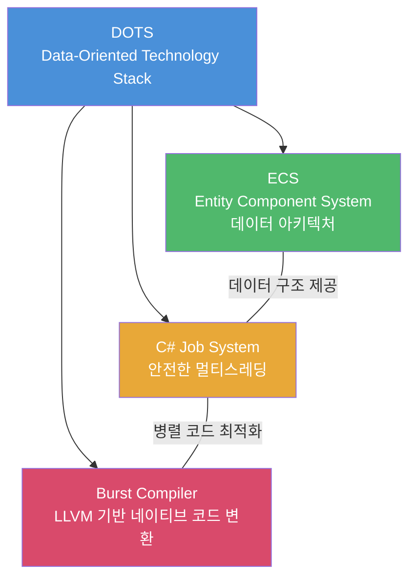
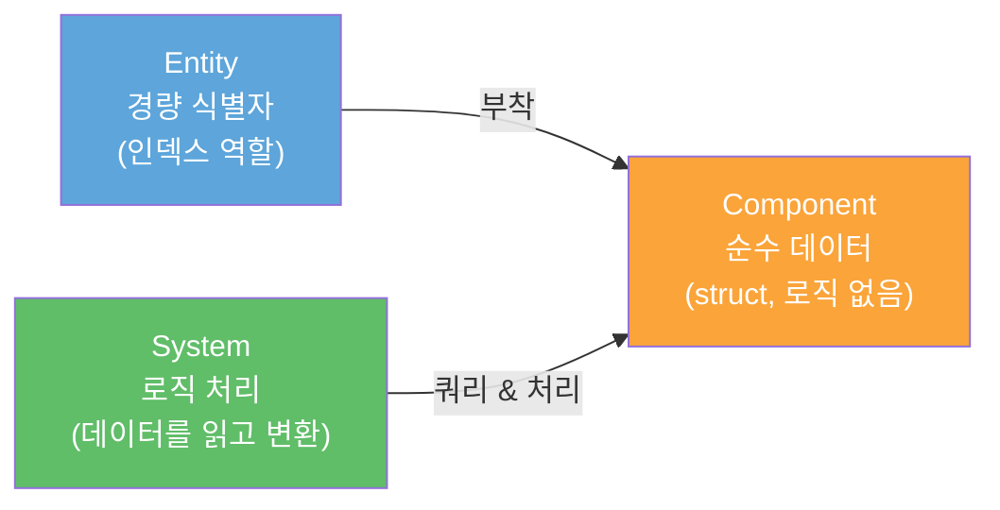
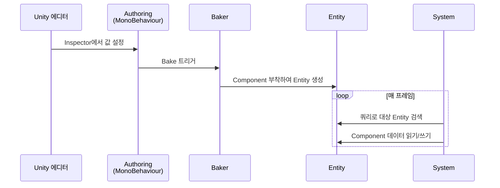
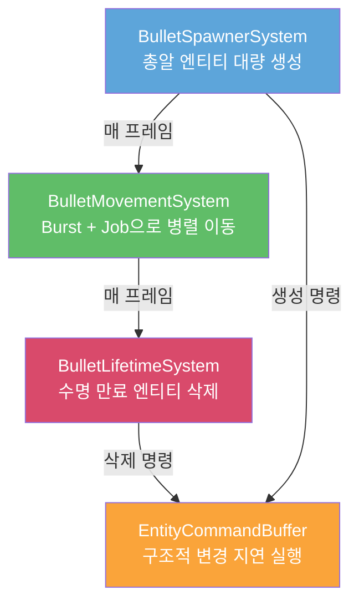

# 🛠️ 260211 Unity ECS (Entity Component System) 완벽 가이드

## 🧭 1. Unity ECS 소개

Unity ECS(Entity Component System)는 Unity의 **DOTS(Data-Oriented Technology Stack)** 핵심 프레임워크로, 데이터 지향 설계(DOP)를 기반으로 대규모 게임 오브젝트를 고성능으로 처리하는 아키텍처다.

### 🔹 DOTS 기술 스택 구성



| 기술 | 역할 |
|------|------|
| **ECS** | Entity, Component, System 기반의 데이터 아키텍처 |
| **C# Job System** | 멀티코어를 활용한 안전한 병렬 처리 |
| **Burst Compiler** | C# → LLVM 기반 고도로 최적화된 네이티브 코드 변환 |

### 🔹 ECS 3요소



- **Entity**: 게임 오브젝트의 경량 대체재. 자체적으로 데이터나 행동이 없고 단순 인덱스 역할
- **Component**: 엔티티에 부착되는 순수 데이터 컨테이너 (IComponentData struct)
- **System**: 특정 컴포넌트 조합을 가진 엔티티들에 로직을 실행하는 처리 단위
- **Archetype**: 동일 컴포넌트 조합을 가진 엔티티 그룹. 메모리 할당의 기본 단위
- **Chunk**: 16KB 메모리 블록. 동일 Archetype 엔티티들이 연속 배치

---

## 📌 2. ECS가 필요한 이유

### ⚠️ 기존 방식의 한계

MonoBehaviour 방식은 수천~수만 개 오브젝트를 동시 처리할 때 심각한 성능 저하가 발생한다. 원인은 세 가지다:

1. **GC(Garbage Collection) 부하** — 오브젝트 생성/파괴마다 힙 할당, GC 스파이크 유발
2. **캐시 미스** — 각 GameObject의 컴포넌트가 메모리에 산발적으로 흩어져 CPU 캐시 활용도 저하
3. **싱글 스레드 병목** — Update()가 메인 스레드에서 순차 실행, 멀티코어 활용 불가

### ⚡ 성능 비교 벤치마크

**100,000개 Boid 시뮬레이션 결과:**

| 항목 | MonoBehaviour | DOTS (ECS + Burst + Jobs) |
|------|:---:|:---:|
| FPS | 7~8 | 안정적 60+ |
| 처리 방식 | 단일 코어, 순차 | 멀티 코어, 병렬 |
| 성능 배율 | 기준 | **50~100배 향상** |

### 🏢 주요 활용 사례

- 수천 개 엔티티의 군집(Boid) 시뮬레이션
- 대량 총알/파티클 처리 (탄막 슈팅)
- 복잡한 AI 시스템
- 절차적 생성 (Procedural Generation)
- 물리 집약적 게임
- 대규모 멀티플레이어 환경
- 저사양 기기 최적화

---

## ✅ 3. 기존 MonoBehaviour 방식과 차이점

### ⚖️ 설계 패러다임 비교

| 항목 | MonoBehaviour (OOP) | ECS (DOP) |
|------|:---:|:---:|
| 패러다임 | 객체 지향 | 데이터 지향 |
| 기본 단위 | GameObject + MonoBehaviour | Entity + Component + System |
| 데이터와 로직 | 하나의 클래스에 결합 | 완전 분리 |
| 구조 | 클래스 상속 기반 | 컴포지션(조합) 기반 |

### ⚖️ 메모리 배치 차이

```
═══ MonoBehaviour (AoS - Array of Structures) ═══

  힙 메모리 (산발적 배치)
  ┌──────────┐   ┌──────────┐   ┌──────────┐
  │ ObjA     │   │ ObjB     │   │ ObjC     │
  │ Transform│   │ Transform│   │ Transform│
  │ Renderer │   │ Renderer │   │ Renderer │
  │ Script   │   │ Script   │   │ Script   │
  └──────────┘   └──────────┘   └──────────┘
       ↑               ↑               ↑
       └───── 캐시 미스 빈번 ─────────┘

═══ ECS (SoA - Chunk 기반 연속 배치) ═══

  Chunk (16KB)
  ┌─────────────────────────────────────────────┐
  │ [Pos A][Pos B][Pos C] ...  연속 메모리      │
  │ [Vel A][Vel B][Vel C] ...  연속 메모리      │
  │ [HP  A][HP  B][HP  C] ...  연속 메모리      │
  └─────────────────────────────────────────────┘
       ↑
       └── CPU 캐시 프리페칭 최적화, 캐시 히트율 극대화
```

핵심: ECS는 동일 타입 컴포넌트 데이터를 **연속 메모리에 밀집 배치**하여 CPU 캐시 라인 활용도를 극대화한다. 엔티티 삭제 시에도 마지막 엔티티 데이터가 빈 슬롯으로 이동하여 항상 빈 공간 없이 밀집 상태를 유지한다.

---

## ⚠️ 4. 장단점

### ✅ 장점

- **압도적 성능** — CPU 바운드에서 50~100배 향상. 대규모 시뮬레이션에서 진가 발휘
- **메모리 효율성** — Chunk 기반 캐시 친화적 배치, GC 압력 제거로 프레임 스파이크 감소
- **멀티코어 활용** — Job System 결합으로 현대 CPU 병렬 처리 능력 극대화
- **Burst 컴파일** — C# 코드에서 네이티브 코드 수준 성능 달성
- **결정론적 실행** — 멀티플레이어 동기화에 유리
- **낮은 결합도** — 시스템 간 의존성 최소, 기능 독립적 관리 가능

### ⚠️ 단점

- **높은 러닝 커브** — OOP에서 DOP로의 사고방식 전환 필요
- **디버깅 난이도** — 멀티스레딩 환경 디버깅이 복잡
- **제한된 C# 기능** — Burst 사용 시 Reflection 불가, struct 기반 필수
- **생태계 미성숙** — MonoBehaviour 대비 서드파티 라이브러리/학습 자료 부족
- **소규모 프로젝트 과잉** — 간단한 게임에서는 MonoBehaviour가 더 효율적

### 🔹 사용 판단 기준

| 상황 | 권장 |
|------|:---:|
| 소규모 / 프로토타입 | MonoBehaviour |
| 대규모 오브젝트 시뮬레이션 | **ECS** |
| 복잡한 AI / 물리 연산 | **ECS** |
| 멀티플레이어 동기화 | **ECS** |
| 저사양 기기 최적화 | **ECS** |
| 빠른 개발 / 반복 | MonoBehaviour |

---

## 🧪 5. 간단한 개념 예제

### 🔹 5-1. Component 정의 (순수 데이터)

```csharp
using Unity.Entities;
using Unity.Mathematics;

// 컴포넌트는 순수 데이터만 저장하는 struct
public struct Spawner : IComponentData
{
    public Entity Prefab;        // 스폰할 프리팹 엔티티
    public float3 SpawnPosition; // 스폰 위치
    public float NextSpawnTime;  // 다음 스폰 시간
    public float SpawnRate;      // 스폰 간격
}

// 태그 컴포넌트: 데이터 없이 엔티티 분류용
public struct EnemyTag : IComponentData { }
```

### 🔹 5-2. Authoring + Baker (에디터 → ECS 변환 브릿지)

```csharp
using UnityEngine;
using Unity.Entities;

// Authoring: 에디터에서 값을 설정하는 MonoBehaviour
class SpawnerAuthoring : MonoBehaviour
{
    public GameObject Prefab;
    public float SpawnRate;
}

// Baker: Authoring 값을 ECS Component로 변환
class SpawnerBaker : Baker<SpawnerAuthoring>
{
    public override void Bake(SpawnerAuthoring authoring)
    {
        // 현재 엔티티 가져오기
        var entity = GetEntity(TransformUsageFlags.None);

        // ECS 컴포넌트를 엔티티에 추가
        AddComponent(entity, new Spawner
        {
            Prefab = GetEntity(authoring.Prefab, TransformUsageFlags.Dynamic),
            SpawnPosition = authoring.transform.position,
            NextSpawnTime = 0.0f,
            SpawnRate = authoring.SpawnRate
        });
    }
}
```

### 🔹 5-3. System (로직 처리)

```csharp
using Unity.Entities;
using Unity.Transforms;
using Unity.Burst;

[BurstCompile]
public partial struct SpawnerSystem : ISystem
{
    public void OnCreate(ref SystemState state) { }
    public void OnDestroy(ref SystemState state) { }

    [BurstCompile]
    public void OnUpdate(ref SystemState state)
    {
        // Spawner 컴포넌트를 가진 모든 엔티티 순회
        foreach (RefRW<Spawner> spawner in SystemAPI.Query<RefRW<Spawner>>())
        {
            // 스폰 시간 확인
            if (spawner.ValueRO.NextSpawnTime < SystemAPI.Time.ElapsedTime)
            {
                // 프리팹으로부터 새 엔티티 생성
                var newEntity = state.EntityManager.Instantiate(spawner.ValueRO.Prefab);

                // 위치 설정
                state.EntityManager.SetComponentData(newEntity,
                    LocalTransform.FromPosition(spawner.ValueRO.SpawnPosition));

                // 다음 스폰 시간 갱신
                spawner.ValueRW.NextSpawnTime =
                    (float)SystemAPI.Time.ElapsedTime + spawner.ValueRO.SpawnRate;
            }
        }
    }
}
```

### 🔹 ECS 핵심 패턴 흐름



---

## 🧪 6. 실용적 예제 — 대량 총알 시스템

수만 발의 총알을 동시에 처리하는 실용적인 ECS 예제다. MonoBehaviour 방식과 비교하여 ECS + Burst + Job의 위력을 확인한다.

### 🔹 6-1. MonoBehaviour 방식 (전통적)

```csharp
// 오브젝트당 하나의 스크립트가 붙는 전통적 방식
// 1000발 = 1000번의 Update 호출 오버헤드
public class Bullet : MonoBehaviour
{
    public Vector3 velocity;
    public float lifetime = 3f;

    void Update()
    {
        transform.Translate(velocity * Time.deltaTime);
        lifetime -= Time.deltaTime;
        if (lifetime <= 0f)
            Destroy(gameObject);
    }
}
```

**문제점:**
- 1,000개 → Update 1,000번 개별 호출, 메모리 산발 배치, 캐시 미스
- 10,000개 이상은 사실상 처리 불가

### 🔹 6-2. ECS 방식 — 컴포넌트 정의

```csharp
using Unity.Entities;
using Unity.Mathematics;

// 속도 컴포넌트
public struct Velocity : IComponentData
{
    public float3 Value;
}

// 수명 컴포넌트
public struct BulletLifetime : IComponentData
{
    public float RemainingTime;
}

// 총알 태그
public struct BulletTag : IComponentData { }
```

### 🚀 6-3. ECS 방식 — 이동 시스템 (Burst + 멀티스레드)

```csharp
using Unity.Entities;
using Unity.Transforms;
using Unity.Burst;

[BurstCompile]
public partial struct BulletMovementSystem : ISystem
{
    public void OnCreate(ref SystemState state) { }
    public void OnDestroy(ref SystemState state) { }

    [BurstCompile]
    public void OnUpdate(ref SystemState state)
    {
        // IJobEntity로 멀티스레드 병렬 실행
        var moveJob = new MoveBulletJob
        {
            deltaTime = SystemAPI.Time.DeltaTime
        };
        state.Dependency = moveJob.ScheduleParallel(state.Dependency);
    }

    // Burst 컴파일 + 멀티코어 병렬 실행 Job
    [BurstCompile]
    private partial struct MoveBulletJob : IJobEntity
    {
        public float deltaTime;

        // Velocity를 가진 모든 엔티티에 대해 자동 병렬 실행
        public void Execute(ref LocalTransform transform, in Velocity velocity)
        {
            transform.Position += velocity.Value * deltaTime;
        }
    }
}
```

### 🔹 6-4. ECS 방식 — 수명 관리 및 제거 시스템

```csharp
using Unity.Entities;
using Unity.Burst;

[BurstCompile]
public partial struct BulletLifetimeSystem : ISystem
{
    public void OnCreate(ref SystemState state) { }
    public void OnDestroy(ref SystemState state) { }

    [BurstCompile]
    public void OnUpdate(ref SystemState state)
    {
        // EntityCommandBuffer: 구조적 변경(생성/삭제)을 지연 실행
        var ecbSingleton = SystemAPI
            .GetSingleton<BeginSimulationEntityCommandBufferSystem.Singleton>();
        var ecb = ecbSingleton.CreateCommandBuffer(state.WorldUnmanaged);

        // 수명 만료 총알 제거 Job
        var lifetimeJob = new DestroyExpiredBulletJob
        {
            deltaTime = SystemAPI.Time.DeltaTime,
            Ecb = ecb.AsParallelWriter()
        };
        state.Dependency = lifetimeJob.ScheduleParallel(state.Dependency);
    }

    [BurstCompile]
    private partial struct DestroyExpiredBulletJob : IJobEntity
    {
        public float deltaTime;
        public EntityCommandBuffer.ParallelWriter Ecb;

        public void Execute(
            [ChunkIndexInQuery] int chunkIndex,
            Entity entity,
            ref BulletLifetime lifetime)
        {
            // 남은 수명 감소
            lifetime.RemainingTime -= deltaTime;

            // 수명 만료시 삭제 명령 등록
            if (lifetime.RemainingTime <= 0f)
            {
                Ecb.DestroyEntity(chunkIndex, entity);
            }
        }
    }
}
```

### 🔹 6-5. 대량 스포너 시스템

```csharp
using Unity.Entities;
using Unity.Transforms;
using Unity.Burst;

[BurstCompile]
public partial struct BulletSpawnerSystem : ISystem
{
    public void OnCreate(ref SystemState state) { }
    public void OnDestroy(ref SystemState state) { }

    [BurstCompile]
    public void OnUpdate(ref SystemState state)
    {
        // ECB로 메인 스레드 부하 없이 엔티티 생성
        var ecbSingleton = SystemAPI
            .GetSingleton<BeginSimulationEntityCommandBufferSystem.Singleton>();
        var ecb = ecbSingleton
            .CreateCommandBuffer(state.WorldUnmanaged).AsParallelWriter();

        // 스포너 Job 스케줄링
        new ProcessSpawnerJob
        {
            ElapsedTime = SystemAPI.Time.ElapsedTime,
            Ecb = ecb
        }.ScheduleParallel();
    }
}

[BurstCompile]
public partial struct ProcessSpawnerJob : IJobEntity
{
    public EntityCommandBuffer.ParallelWriter Ecb;
    public double ElapsedTime;

    private void Execute([ChunkIndexInQuery] int chunkIndex, ref Spawner spawner)
    {
        // 스폰 시간 확인
        if (spawner.NextSpawnTime < ElapsedTime)
        {
            // ECB를 통해 새 엔티티 생성
            var newEntity = Ecb.Instantiate(chunkIndex, spawner.Prefab);

            // 위치 설정
            Ecb.SetComponent(chunkIndex, newEntity,
                LocalTransform.FromPosition(spawner.SpawnPosition));

            // 다음 스폰 시간 갱신
            spawner.NextSpawnTime = (float)ElapsedTime + spawner.SpawnRate;
        }
    }
}
```

### 🔹 전체 시스템 실행 흐름



### ⚡ 성능 비교 요약

| 항목 | MonoBehaviour | ECS (Burst + Jobs) |
|------|:---:|:---:|
| 데이터 구조 | class (힙, 산발 배치) | struct (Chunk 연속 배치) |
| 로직 위치 | 각 오브젝트 Update() | System이 일괄 처리 |
| 멀티스레딩 | 불가 | IJobEntity + ScheduleParallel |
| Burst 컴파일 | 불가 | [BurstCompile] 네이티브 수준 |
| 1,000개 오브젝트 | 프레임 드롭 | 안정 60fps |
| 100,000개 오브젝트 | 7~8fps | **안정 60fps** |

---

## 📌 2026 로드맵

Unity 6.4부터 ECS가 **코어 엔진 패키지**로 승격되며, ECS와 GameObject의 **통합 Transform 시스템**이 도입될 예정이다. 기존 프로젝트를 재설계하지 않고도 ECS 컴포넌트를 GameObject에 직접 부착할 수 있게 된다.

---

## 🔗 참고 자료

- [Unity 공식 DOTS 페이지](https://unity.com/dots)
- [Unity 공식 ECS 페이지](https://unity.com/ecs)
- [Unity Entities 1.0 공식 문서](https://docs.unity3d.com/Packages/com.unity.entities@1.0/manual/index.html)
- [EntityComponentSystemSamples (GitHub)](https://github.com/Unity-Technologies/EntityComponentSystemSamples)
- [Wayline - Unity DOTS Explained](https://www.wayline.io/blog/unity-dots-data-oriented-technology-stack-explained)
- [Generalist Programmer - ECS Complete Tutorial 2025](https://generalistprogrammer.com/tutorials/entity-component-system-complete-ecs-architecture-tutorial)
- [Unity Discussions - ECS Development Status 2025](https://discussions.unity.com/t/ecs-development-status-milestones-march-2025/1615810)
- [Unity Discussions - November 2025 ECS Stack Review](https://discussions.unity.com/t/november-2025-ecs-stack-review/1694077)
- [Unity - Introduction to DOTS eBook](https://unity.com/resources/introduction-to-dots-ebook)
- [Digital Production - Unity's 2026 Roadmap](https://digitalproduction.com/2025/11/26/unitys-2026-roadmap-coreclr-verified-packages-fewer-surprises/)
