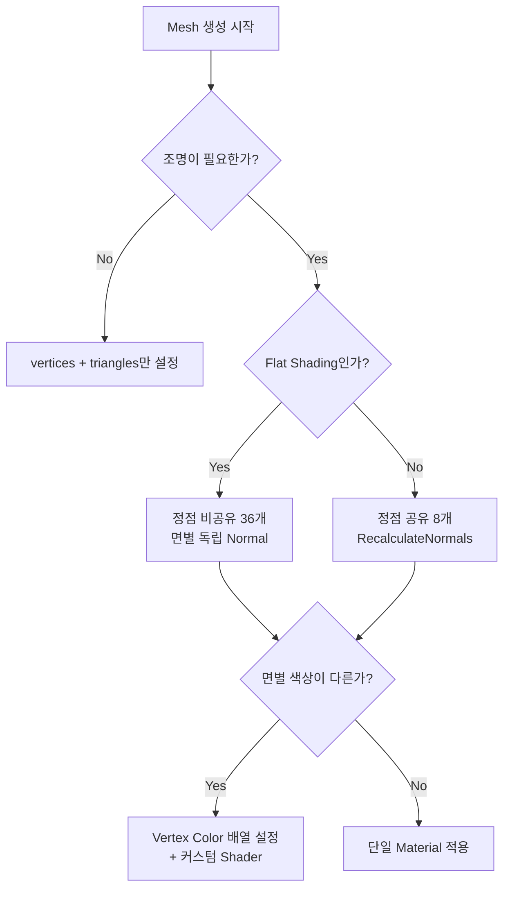

# 🛠️ 260211 Unity Mesh와 Normal의 관계 완벽 가이드

## 📌 1. Unity에서 3D 객체를 그리는 원리

Unity에서 3D 객체를 화면에 렌더링하려면, 결국 **Mesh 데이터**가 필요하다. `.fbx`, `.obj` 같은 모델 파일을 임포트하든, 스크립트에서 직접 생성하든, 최종적으로 GPU에 전달되는 것은 **Mesh** 구조체다.

Mesh는 크게 다음 요소로 구성된다:

| 요소 | 필수 여부 | 설명 |
|------|----------|------|
| **vertices** (정점) | **필수** | 3D 공간의 좌표 배열 (`Vector3[]`) |
| **triangles** (삼각형) | **필수** | 정점 인덱스 배열 (`int[]`), 3개씩 묶어 삼각형 정의 |
| **normals** (법선) | 선택* | 각 정점의 표면 방향 벡터 (`Vector3[]`) |
| **uv** (텍스처 좌표) | 선택 | 텍스처 매핑용 2D 좌표 |
| **colors** (정점 색상) | 선택 | 정점별 색상 (`Color[]`) |

> 💡 *normals는 기술적으로 선택이지만, **조명이 있는 씬에서는 사실상 필수**다.

```
최소 Mesh = vertices + triangles
완전한 Mesh = vertices + triangles + normals + uv + colors + tangents + ...
```

---

## 📌 2. 삼각형 리스트만으로 충분한가?

### 🔹 핵심 답변: "그리기만" 한다면 충분하다

Mesh의 최소 요구사항은 **정점 위치(vertices)**와 **삼각형 인덱스(triangles)** 두 가지다.

```
삼각형이 n개인 도형:
├── 정점 공유 없이: 3 × n 개의 정점
└── 정점 공유 시:   3 × n 보다 훨씬 적은 정점
```

### ⚖️ 정점 공유 vs 비공유

```
[ 정점 공유 방식 (Shared Vertices) ]

    v0 ──── v1          정점 8개로 직육면체 표현
    │╲      │           인접한 면이 같은 정점을 참조
    │  ╲    │           → 메모리 효율적
    │    ╲  │           → 단, 면 경계에서 부드러운 쉐이딩
    v2 ──── v3


[ 정점 비공유 방식 (Separate Vertices) ]

    v0 ──── v1          정점 36개로 직육면체 표현 (면당 4개 × 6면 = 24, 또는 삼각형당 3개 × 12 = 36)
    │╲      │           각 면이 독립적인 정점 보유
    │  ╲    │           → 메모리 더 사용
    │    ╲  │           → 면별 독립적 색상/노말 가능
    v2 ──── v3          → Flat Shading에 적합
```

---

## 🎯 3. Normal은 왜 필요한가?

### 🔹 Normal이 없을 때

```csharp
// Normal 없이 Mesh 생성
mesh.vertices = vertices;
mesh.triangles = triangles;
// mesh.normals = ???  ← 생략
```

이렇게 하면 Unity는 **normal 배열을 빈 배열로 반환**하고, 조명 계산이 제대로 되지 않는다. 결과적으로 객체가 **검은색**으로 보이거나 조명에 전혀 반응하지 않는다.

### 🔹 Normal의 역할

```
        Light Source ☀️
            │
            │  입사각
            ▼
    ─────────────────── Surface
            ↑
            │ Normal (법선벡터)
            │
```

Normal은 **"이 표면이 어느 방향을 바라보고 있는가"**를 GPU에게 알려준다.

- **조명 계산**: 빛의 입사각과 Normal의 각도로 밝기 결정
- **반사 계산**: Specular 반사 방향 결정
- **Smooth/Flat Shading 제어**: 같은 위치의 정점이라도 Normal이 다르면 다른 밝기로 렌더링

### ⚖️ Smooth Shading vs Flat Shading

```
[ Smooth Shading ]                    [ Flat Shading ]

  정점 공유, Normal 평균화              정점 비공유, 면별 독립 Normal

       N↑                                 N1↑    N2↑
       /|\                                 |      |
      / | \                              ──┤    ├──
     /  |  \                             면1│    │면2
    ────┴────                            ──┘    └──

  → 부드러운 곡면 표현                  → 딱딱한 모서리 표현
  → 구, 원통 등에 적합                  → 직육면체, 다이아몬드 등에 적합
```

**직육면체의 경우**: 각 면의 경계가 뚜렷한 **Flat Shading**이 자연스럽다. 이를 위해서는 **정점을 면별로 분리**해야 한다.

### 🔹 RecalculateNormals()

직접 Normal을 계산하기 어려울 때, Unity가 제공하는 편의 메서드:

```csharp
mesh.RecalculateNormals();
```

이 메서드는 삼각형의 면 방향을 기반으로 자동 계산해 준다. 단, 정점을 공유하는 경우 **인접 삼각형의 Normal을 평균**하므로 Smooth Shading 결과가 나온다.

---

## 🧪 4. 직육면체 예제: 12 삼각형, 36 정점

### 🎯 왜 36개의 정점인가?

```
직육면체
├── 6개의 면 (Face)
│   ├── 각 면 = 2개의 삼각형
│   └── 총 12개의 삼각형
│
├── 정점 공유 시: 8개의 정점 (큐브의 꼭짓점)
│   └── 단, 면 경계에서 Normal 공유 → Smooth Shading (부자연스러움)
│
└── 정점 비공유 시: 36개의 정점 (삼각형당 3개 × 12)
    └── 또는 24개의 정점 (면당 4개 × 6)
    └── 면별 독립 Normal → Flat Shading (자연스러움)
```

실제로는 면당 4개의 정점(24개)이 효율적이지만, 여기서는 **삼각형당 3개(36개)** 방식으로 구현한다.

### 🧪 전체 구현 코드

```csharp
using UnityEngine;

[RequireComponent(typeof(MeshFilter))]
[RequireComponent(typeof(MeshRenderer))]
public class CubeGenerator : MonoBehaviour
{
    void Start()
    {
        // 메쉬 필터 가져오기
        var meshFilter = GetComponent<MeshFilter>();
        var mesh = new Mesh();
        meshFilter.mesh = mesh;

        // 직육면체 크기 정의
        var size = 1f;
        var h = size / 2f;

        // 8개의 기본 꼭짓점 좌표
        var p0 = new Vector3(-h, -h, -h);
        var p1 = new Vector3( h, -h, -h);
        var p2 = new Vector3( h, -h,  h);
        var p3 = new Vector3(-h, -h,  h);
        var p4 = new Vector3(-h,  h, -h);
        var p5 = new Vector3( h,  h, -h);
        var p6 = new Vector3( h,  h,  h);
        var p7 = new Vector3(-h,  h,  h);

        // 36개의 정점 (면별 독립, 삼각형당 3개)
        var vertices = new Vector3[]
        {
            // 앞면 (Front, z = -h) - 삼각형 2개
            p0, p4, p1,   p1, p4, p5,
            // 뒷면 (Back, z = +h)
            p2, p6, p3,   p3, p6, p7,
            // 윗면 (Top, y = +h)
            p4, p7, p5,   p5, p7, p6,
            // 아랫면 (Bottom, y = -h)
            p0, p1, p3,   p3, p1, p2,
            // 왼쪽면 (Left, x = -h)
            p3, p7, p0,   p0, p7, p4,
            // 오른쪽면 (Right, x = +h)
            p1, p5, p2,   p2, p5, p6,
        };

        // 삼각형 인덱스 (0~35, 순서대로)
        var triangles = new int[36];
        for (var i = 0; i < 36; i++)
            triangles[i] = i;

        // 면별 Normal 벡터 (Flat Shading)
        var normals = new Vector3[]
        {
            // 앞면 Normal: (0, 0, -1)
            Vector3.back, Vector3.back, Vector3.back,
            Vector3.back, Vector3.back, Vector3.back,
            // 뒷면 Normal: (0, 0, 1)
            Vector3.forward, Vector3.forward, Vector3.forward,
            Vector3.forward, Vector3.forward, Vector3.forward,
            // 윗면 Normal: (0, 1, 0)
            Vector3.up, Vector3.up, Vector3.up,
            Vector3.up, Vector3.up, Vector3.up,
            // 아랫면 Normal: (0, -1, 0)
            Vector3.down, Vector3.down, Vector3.down,
            Vector3.down, Vector3.down, Vector3.down,
            // 왼쪽면 Normal: (-1, 0, 0)
            Vector3.left, Vector3.left, Vector3.left,
            Vector3.left, Vector3.left, Vector3.left,
            // 오른쪽면 Normal: (1, 0, 0)
            Vector3.right, Vector3.right, Vector3.right,
            Vector3.right, Vector3.right, Vector3.right,
        };

        // 메쉬에 데이터 할당
        mesh.vertices = vertices;
        mesh.triangles = triangles;
        mesh.normals = normals;
    }
}
```

---

## 📌 5. 조명 추가

위 코드만으로는 화면에 보이긴 하지만, 제대로 된 조명 효과를 보려면 **Material**과 **Light**가 필요하다.

### 🔹 씬에 조명 추가 (스크립트)

```csharp
using UnityEngine;

public class SceneSetup : MonoBehaviour
{
    void Start()
    {
        // 디렉셔널 라이트 생성
        var lightObj = new GameObject("Directional Light");
        var light = lightObj.AddComponent<Light>();
        light.type = LightType.Directional;
        light.intensity = 1.0f;
        light.color = Color.white;

        // 위에서 비스듬히 비추도록 회전
        lightObj.transform.rotation = Quaternion.Euler(50f, -30f, 0f);
    }
}
```

### 🛠️ Material 설정

```csharp
// CubeGenerator.Start() 안에 추가
var renderer = GetComponent<MeshRenderer>();

// 기본 URP Lit 또는 Standard 쉐이더 사용
renderer.material = new Material(Shader.Find("Standard"));
renderer.material.color = Color.gray;
```

조명과 Normal이 있으면, 각 면이 빛의 방향에 따라 **서로 다른 밝기**로 렌더링된다:

```
        ☀️ 빛 방향
         ╲
          ╲
    ┌──────────┐
    │  밝음     │╲
    │  (윗면)   │ │ 중간 (오른쪽면)
    │          │ │
    └──────────┘ │
      ╲─────────╲┘
       어두움 (앞면)
```

---

## 📌 6. 면별 서로 다른 색상 입히기

면별로 다른 색상을 입히려면 **Vertex Color**를 사용한다. 핵심 포인트: 정점이 면별로 분리되어 있어야 면별 독립 색상이 가능하다. 우리의 36정점 방식은 이미 이 조건을 만족한다.

### 🔹 Vertex Color 지원 Shader 필요

기본 Standard Shader는 Vertex Color를 무시한다. 다음 중 하나를 사용해야 한다:

1. **Particles/Standard Unlit** — 가장 간단
2. **커스텀 Shader** — 조명 + Vertex Color 동시 지원

### 🔹 조명 + Vertex Color 커스텀 쉐이더

```csharp
// 쉐이더 코드를 문자열로 정의하여 런타임 생성
static string vertexColorShaderSource = @"
Shader ""Custom/VertexColorLit""
{
    SubShader
    {
        Tags { ""RenderType""=""Opaque"" }
        LOD 200

        CGPROGRAM
        #pragma surface surf Lambert vertex:vert

        struct Input
        {
            float4 vertColor;
        };

        void vert(inout appdata_full v, out Input o)
        {
            UNITY_INITIALIZE_OUTPUT(Input, o);
            o.vertColor = v.color;
        }

        void surf(Input IN, inout SurfaceOutput o)
        {
            o.Albedo = IN.vertColor.rgb;
            o.Alpha = IN.vertColor.a;
        }
        ENDCG
    }
    FallBack ""Diffuse""
}
";
```

### 🧪 면별 색상이 적용된 전체 코드

```csharp
using UnityEngine;

[RequireComponent(typeof(MeshFilter))]
[RequireComponent(typeof(MeshRenderer))]
public class ColoredCubeGenerator : MonoBehaviour
{
    void Start()
    {
        var meshFilter = GetComponent<MeshFilter>();
        var mesh = new Mesh();
        meshFilter.mesh = mesh;

        var h = 0.5f;

        // 8개의 기본 꼭짓점
        var p0 = new Vector3(-h, -h, -h);
        var p1 = new Vector3( h, -h, -h);
        var p2 = new Vector3( h, -h,  h);
        var p3 = new Vector3(-h, -h,  h);
        var p4 = new Vector3(-h,  h, -h);
        var p5 = new Vector3( h,  h, -h);
        var p6 = new Vector3( h,  h,  h);
        var p7 = new Vector3(-h,  h,  h);

        // 36개의 정점 (면별 독립)
        var vertices = new Vector3[]
        {
            // 앞면 (Front)
            p0, p4, p1,   p1, p4, p5,
            // 뒷면 (Back)
            p2, p6, p3,   p3, p6, p7,
            // 윗면 (Top)
            p4, p7, p5,   p5, p7, p6,
            // 아랫면 (Bottom)
            p0, p1, p3,   p3, p1, p2,
            // 왼쪽면 (Left)
            p3, p7, p0,   p0, p7, p4,
            // 오른쪽면 (Right)
            p1, p5, p2,   p2, p5, p6,
        };

        // 삼각형 인덱스
        var triangles = new int[36];
        for (var i = 0; i < 36; i++)
            triangles[i] = i;

        // 면별 Normal (Flat Shading)
        var normals = new Vector3[]
        {
            Vector3.back,    Vector3.back,    Vector3.back,
            Vector3.back,    Vector3.back,    Vector3.back,
            Vector3.forward, Vector3.forward, Vector3.forward,
            Vector3.forward, Vector3.forward, Vector3.forward,
            Vector3.up,      Vector3.up,      Vector3.up,
            Vector3.up,      Vector3.up,      Vector3.up,
            Vector3.down,    Vector3.down,    Vector3.down,
            Vector3.down,    Vector3.down,    Vector3.down,
            Vector3.left,    Vector3.left,    Vector3.left,
            Vector3.left,    Vector3.left,    Vector3.left,
            Vector3.right,   Vector3.right,   Vector3.right,
            Vector3.right,   Vector3.right,   Vector3.right,
        };

        // 면별 색상 정의
        var faceColors = new Color[]
        {
            Color.red,      // 앞면
            Color.blue,     // 뒷면
            Color.green,    // 윗면
            Color.yellow,   // 아랫면
            Color.cyan,     // 왼쪽면
            Color.magenta,  // 오른쪽면
        };

        // 정점별 색상 배열 생성 (면의 6개 정점에 같은 색상)
        var colors = new Color[36];
        for (var face = 0; face < 6; face++)
        {
            for (var v = 0; v < 6; v++)
            {
                colors[face * 6 + v] = faceColors[face];
            }
        }

        // 메쉬에 데이터 할당
        mesh.vertices = vertices;
        mesh.triangles = triangles;
        mesh.normals = normals;
        mesh.colors = colors;

        // Vertex Color를 지원하는 Material 적용
        var renderer = GetComponent<MeshRenderer>();
        renderer.material = new Material(Shader.Find("Custom/VertexColorLit"));

        // 커스텀 쉐이더가 없으면 Particles/Standard Unlit 대체 사용
        if (renderer.material.shader.name == "Hidden/InternalErrorShader")
        {
            renderer.material = new Material(Shader.Find("Particles/Standard Unlit"));
            renderer.material.SetFloat("_ColorMode", 1); // Multiply
        }
    }
}
```

### 🔹 결과 모습

```
    ┌──────────┐
    │  초록     │╲
    │  (윗면)   │ │ 보라 (오른쪽면)
    │  Green   │ │ Magenta
    └──────────┘ │
      ╲──────────╲┘
       빨강 (앞면)
       Red

    6개 면 각각:
    ┌─────────┬─────────┬──────────┐
    │ 앞: 빨강 │ 뒤: 파랑 │ 위: 초록  │
    ├─────────┼─────────┼──────────┤
    │ 아래: 노랑│ 왼: 청록 │ 오른: 보라│
    └─────────┴─────────┴──────────┘
```

---

## 📌 7. 모서리 색상 표현과 Normal의 관계

### 🔹 질문: 모서리를 잘 표현하려면 Normal이 더 필요한가?

**결론부터: 아니다. 36개 정점 + 면별 Normal로 이미 충분하다.**

### 🎯 왜 충분한가?

직육면체의 모서리가 뚜렷하게 보이려면 **인접한 두 면의 밝기가 서로 달라야** 한다. 이것은 Normal이 면별로 독립적일 때 자연스럽게 달성된다.

```
[ 36정점 방식 — 모서리가 뚜렷함 ]

    면A (Normal: ←)  │  면B (Normal: ↑)
    어두움            │  밝음
                     │
              모서리 경계: 밝기가 불연속적으로 변함
              → 날카로운 모서리로 인식됨
```

우리의 36정점 구조에서는:
- 같은 물리적 꼭짓점이라도 **면마다 별도의 정점**으로 존재
- 각 정점의 Normal은 해당 **면의 방향만** 가리킴
- GPU가 렌더링할 때 면 경계에서 **밝기가 불연속** → 모서리가 선명

### 🔹 만약 정점을 공유했다면? (8정점 방식)

```
[ 8정점 방식 — 모서리가 뭉개짐 ]

    면A와 면B가 같은 정점을 공유
    ↓
    RecalculateNormals()가 인접 면의 Normal을 평균화
    ↓
    모서리 근처에서 밝기가 부드럽게 보간
    ↓
    직육면체인데 구처럼 둥글게 보임 ← 부자연스러움
```

```
    정점 공유 (8개)              정점 독립 (36개)

    ╭───────────╮               ┌───────────┐
    │           │               │           │
    │  부드러운  │               │  날카로운  │
    │  모서리    │               │  모서리    │
    │           │               │           │
    ╰───────────╯               └───────────┘
    Smooth Shading              Flat Shading
```

### 🔹 Normal과 색상은 독립적인 문제

중요한 포인트: **Normal은 조명(밝기)에만 영향**을 주고, **색상은 Vertex Color가 결정**한다.

```
최종 픽셀 색상 = Vertex Color × 조명 계산(Normal 기반)

├── Vertex Color: 면의 기본 색상 (빨강, 파랑 등)
└── 조명 계산: Normal과 Light 방향의 내적 → 밝기 계수

예시:
  앞면 (빨강, Normal=Back) + 정면 조명 → 밝은 빨강
  윗면 (초록, Normal=Up)   + 정면 조명 → 어두운 초록
```

### 🔹 모서리에 Normal을 더 추가하면?

이론적으로 모서리를 **베벨(Bevel)** 처리하여 추가 삼각형과 Normal을 넣을 수 있지만, 이는 직육면체가 아닌 **둥근 모서리 큐브**를 만드는 것이다. 일반적인 직육면체에서는 불필요하다.

```
[ 베벨 처리된 모서리 — 과잉 ]

    면A  ╱ 베벨면 ╲  면B        추가 삼각형 + 추가 Normal 필요
        ╱         ╲            직육면체의 정체성이 사라짐
                               → 보통 불필요
```

### 🔹 정리

| 구성 | 정점 수 | Normal 수 | 모서리 표현 | 면별 색상 |
|------|---------|-----------|------------|----------|
| 정점 공유 | 8 | 8 (평균화) | 뭉개짐 | 불가 |
| **정점 독립 (우리 방식)** | **36** | **36 (면별)** | **선명** | **가능** |
| 베벨 추가 | 72+ | 72+ | 과도하게 부드러움 | 가능 |

**36개 정점 + 36개 Normal이 직육면체의 최적 구성이다.**

---

## 📌 8. 핵심 요약

```
Q: Mesh 데이터만으로 3D 객체를 그릴 수 있는가?
A: YES — vertices + triangles 만으로 최소한의 렌더링 가능

Q: 삼각형 리스트만으로 충분한가?
A: YES — n개의 삼각형이면 3×n개의 정점 + 인덱스로 표현 가능

Q: Normal은 반드시 필요한가?
A: 조명 없이: 불필요 / 조명 있으면: 필수
   RecalculateNormals()로 자동 계산 가능

Q: 직육면체는 12삼각형, 36정점으로 충분한가?
A: YES — Flat Shading을 위해 오히려 36정점 방식이 적합

Q: 면별 다른 색상을 입히려면?
A: 정점 분리 (36정점) + Vertex Color + 커스텀 쉐이더
```

### 🔹 의사결정 플로우차트



---

## 🔗 참고 자료

- [Unity Scripting API: Mesh.normals](https://docs.unity3d.com/ScriptReference/Mesh-normals.html)
- [Unity Manual: Anatomy of a Mesh](https://docs.unity3d.com/Manual/AnatomyofaMesh.html)
- [Procedural Meshes in Unity: Normals and Tangents – code-spot](https://www.code-spot.co.za/2020/11/25/procedural-meshes-in-unity-normals-and-tangents/)
- [Creating a Cube Mesh in Unity3D – ilkinulas](http://ilkinulas.github.io/development/unity/2016/04/30/cube-mesh-in-unity3d.html)
- [Catlike Coding: Creating a Mesh](https://catlikecoding.com/unity/tutorials/procedural-meshes/creating-a-mesh/)
- [Unity Forum: Set different color for each face](https://discussions.unity.com/t/set-different-color-for-each-face/626572)
- [Unity Scripting API: Mesh.colors](https://docs.unity3d.com/ScriptReference/Mesh-colors.html)
