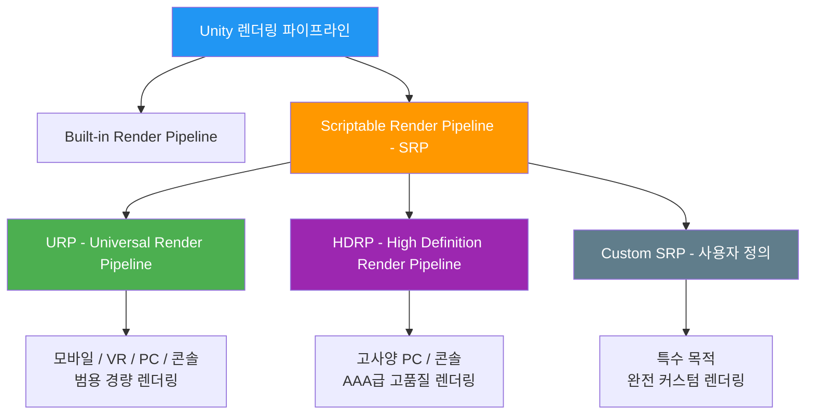
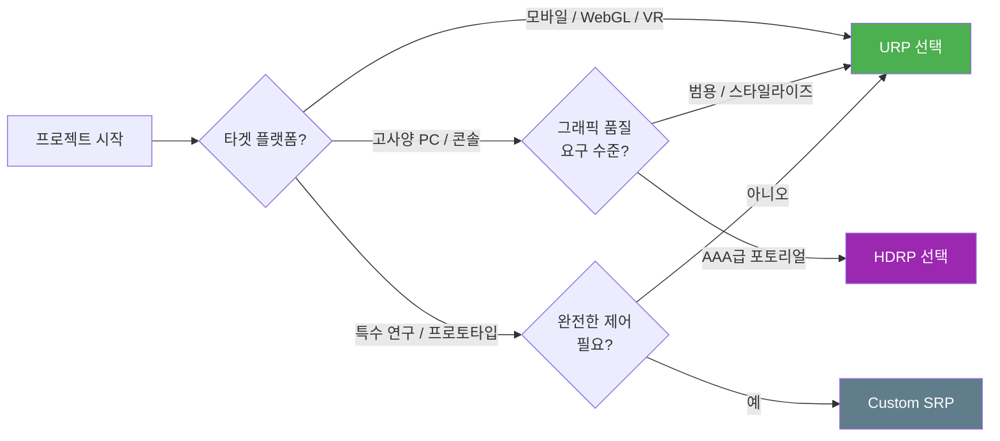
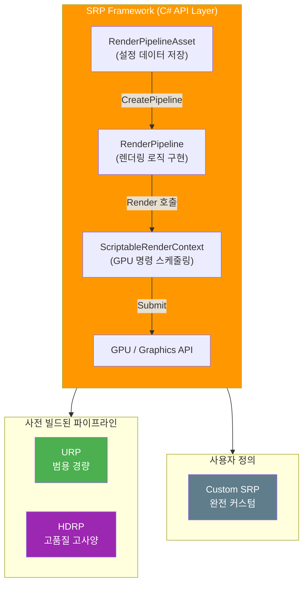
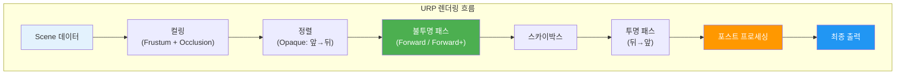
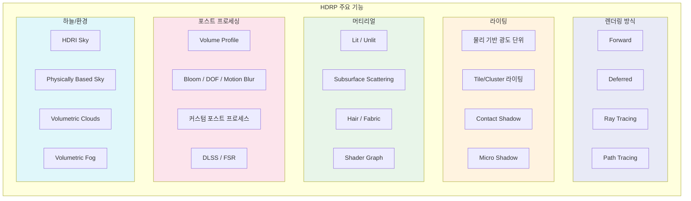
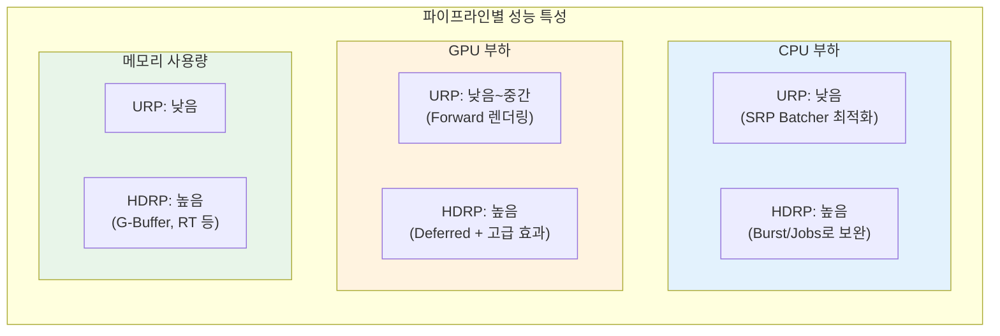
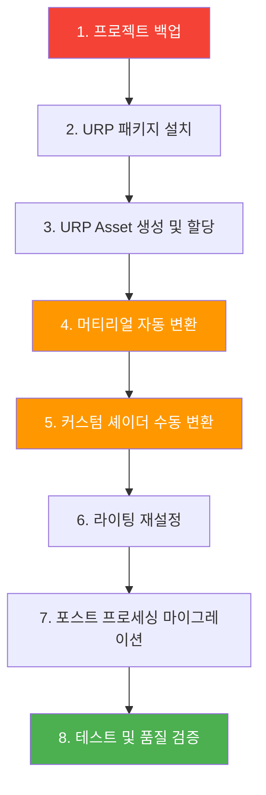

# 🏗️ 260215 Unity 렌더링 파이프라인 가이드

## 📚 목차

1. [소개](#1-소개)
2. [필요성](#2-필요성)
3. [렌더링 파이프라인 종류](#3-렌더링-파이프라인-종류)
4. [SRP - Scriptable Render Pipeline](#4-srp---scriptable-render-pipeline)
5. [URP - Universal Render Pipeline](#5-urp---universal-render-pipeline)
6. [HDRP - High Definition Render Pipeline](#6-hdrp---high-definition-render-pipeline)
7. [파이프라인 비교표](#7-파이프라인-비교표)
8. [마이그레이션 가이드](#8-마이그레이션-가이드)
9. [결론](#9-결론)
10. [참고 자료](#10-참고-자료)

---

## 🧭 1. 소개

Unity 렌더링 파이프라인(Render Pipeline)은 **3D/2D 장면의 오브젝트를 화면에 그려내는 일련의 과정**을 정의하는 시스템이다. 카메라가 바라보는 장면에서 어떤 오브젝트를 어떤 순서로, 어떤 조명과 셰이더를 적용하여 최종 픽셀로 변환할 것인지를 결정하는 핵심 아키텍처다.

Unity는 크게 다음 네 가지 렌더링 파이프라인을 제공한다.

| 파이프라인 | 설명 |
|---|---|
| **Built-in Render Pipeline** | Unity 초기부터 제공된 기본 렌더러. 커스터마이징에 제약이 있다 |
| **SRP (Scriptable Render Pipeline)** | C# 스크립트로 렌더링 과정을 제어할 수 있는 프레임워크 |
| **URP (Universal Render Pipeline)** | SRP 기반의 범용 경량 파이프라인 |
| **HDRP (High Definition Render Pipeline)** | SRP 기반의 고품질 AAA급 파이프라인 |



Unity 6(6000.x) 이후로 **URP가 기본 렌더링 파이프라인**으로 채택되었으며, Built-in Render Pipeline은 더 이상 적극적으로 업데이트되지 않는다. 새 프로젝트를 시작한다면 URP 또는 HDRP 중 하나를 선택하는 것이 권장된다.

---

## 🎯 2. 필요성

### 🎯 2.1 왜 렌더링 파이프라인을 이해해야 하는가

렌더링 파이프라인의 선택은 프로젝트 초기에 결정해야 하는 **아키텍처 수준의 의사결정**이다. 프로젝트 중간에 파이프라인을 변경하면 셰이더, 머티리얼, 라이팅 설정, 포스트 프로세싱 등 거의 모든 시각적 요소를 재작업해야 하기 때문이다.

### 🔹 2.2 프로젝트 선택 시 고려 사항



**렌더링 파이프라인 이해가 필요한 핵심 이유:**

1. **성능 최적화** - 파이프라인마다 배칭(Batching), 컬링(Culling), 드로우콜(Draw Call) 처리 방식이 다르다. URP는 SRP Batcher를 통해 Built-in 대비 약 15% 성능 향상을 제공한다.
2. **셰이더 호환성** - Built-in, URP, HDRP 각각 사용하는 셰이더 라이브러리와 문법이 다르다. `CGPROGRAM`(Built-in) vs `HLSLPROGRAM`(SRP 계열)이 대표적이다.
3. **기능 범위** - 레이 트레이싱(Ray Tracing)은 HDRP에서만 지원되고, 2D 라이팅은 URP에서만 지원되는 등 파이프라인별 기능 차이가 존재한다.
4. **팀 생산성** - 아티스트가 Shader Graph로 작업할 때, 어떤 파이프라인을 쓰느냐에 따라 노드 구성과 출력 결과가 달라진다.
5. **유지보수성** - Built-in은 Unity의 적극적 업데이트 대상에서 제외되었으므로, 장기 프로젝트라면 SRP 계열로 전환을 고려해야 한다.

---

## 🏗️ 3. 렌더링 파이프라인 종류

### 🏗️ 3.1 전체 아키텍처 구조



SRP는 **렌더링 명령을 스케줄링하고 구성하는 얇은 API 계층**이다. URP와 HDRP는 모두 SRP 위에 구축된 사전 빌드 파이프라인이며, 개발자는 SRP API를 직접 사용하여 완전히 새로운 커스텀 파이프라인을 만들 수도 있다.

### 🧭 3.2 세 파이프라인 개요

| 항목 | SRP (Custom) | URP | HDRP |
|---|---|---|---|
| **목적** | 완전 커스텀 렌더링 | 범용 멀티플랫폼 | 고품질 AAA |
| **난이도** | 상 | 하~중 | 중~상 |
| **플랫폼** | 제한 없음 | 모바일~콘솔 전체 | 고사양 PC/콘솔 |
| **렌더링 방식** | 자유 선택 | Forward / Forward+ | Forward / Deferred / 하이브리드 |
| **셰이더 모델** | 자유 구현 | Shader Graph + 코드 | Shader Graph + 코드 |

---

## 📌 4. SRP - Scriptable Render Pipeline

### ✨ 4.1 개념 및 특징

SRP(Scriptable Render Pipeline)는 Unity의 렌더링 과정을 **C# 스크립트로 완전히 제어**할 수 있게 해주는 프레임워크다. "Scriptable"이라는 이름 그대로, 기존 Built-in 파이프라인에서는 블랙박스였던 렌더링 루프를 개발자가 직접 작성할 수 있다.

**핵심 구성 요소:**

| 구성 요소 | 역할 |
|---|---|
| `RenderPipelineAsset` | 파이프라인 설정 데이터를 저장하는 ScriptableObject. `CreatePipeline()` 메서드로 파이프라인 인스턴스 생성 |
| `RenderPipeline` | 실제 렌더링 로직을 구현하는 클래스. `Render()` 메서드에서 모든 카메라의 렌더링 수행 |
| `ScriptableRenderContext` | C# 코드와 Unity 저수준 그래픽스 코드 사이의 인터페이스. 렌더링 명령을 지연 실행(Deferred Execution) 방식으로 스케줄링 |
| `CommandBuffer` | GPU에 전달할 렌더링 명령을 묶어놓은 버퍼 |

**주요 특징:**

- 렌더링 루프를 처음부터 직접 설계할 수 있음
- 프로젝트에 불필요한 렌더링 단계를 제거하여 극한의 최적화 가능
- 그래픽스 프로그래밍에 대한 깊은 이해가 필요
- URP/HDRP가 커버하지 못하는 특수 요구사항에 적합

### 🔹 4.2 적합한 프로젝트 유형

- 기술 연구 및 프로토타이핑
- 특수 시각화 도구 (과학, 의료, 건축 등)
- 극도로 최적화된 렌더링이 필요한 임베디드 시스템
- 교육 목적의 렌더링 엔진 학습

### ⚠️ 4.3 장단점

| 장점 | 단점 |
|---|---|
| 렌더링 파이프라인의 완전한 제어 | 높은 진입 장벽 (그래픽스 지식 필수) |
| 불필요한 기능 제거로 극한 최적화 가능 | 모든 기능을 직접 구현해야 함 |
| 프로젝트 특화 파이프라인 설계 가능 | URP/HDRP 대비 생태계(에셋, 튜토리얼) 부족 |
| 렌더링 엔진 학습에 최적 | 유지보수 부담이 전적으로 개발자에게 |

### 🏗️ 4.4 간단 개념 예제 - 최소 커스텀 파이프라인

아래 예제는 SRP의 핵심 구조를 이해하기 위한 **최소한의 커스텀 렌더 파이프라인**이다. 화면을 단색으로 클리어하는 것만 수행한다.

**Step 1: RenderPipelineAsset 생성**

```csharp
// CustomRenderPipelineAsset.cs
// 커스텀 파이프라인의 설정 데이터를 저장하는 ScriptableObject
using UnityEngine;
using UnityEngine.Rendering;

// Unity 에디터의 메뉴에서 에셋 생성 가능
[CreateAssetMenu(menuName = "Rendering/Custom Render Pipeline")]
public class CustomRenderPipelineAsset : RenderPipelineAsset
{
    // 파이프라인 설정값 (Inspector에서 편집 가능)
    public Color clearColor = Color.black;

    // 파이프라인 인스턴스 생성 - Unity가 렌더링 시 호출
    protected override RenderPipeline CreatePipeline()
    {
        return new CustomRenderPipeline(this);
    }
}
```

**Step 2: RenderPipeline 인스턴스 구현**

```csharp
// CustomRenderPipeline.cs
// 실제 렌더링 로직을 담당하는 파이프라인 인스턴스
using UnityEngine;
using UnityEngine.Rendering;
using System.Collections.Generic;

public class CustomRenderPipeline : RenderPipeline
{
    private CustomRenderPipelineAsset pipelineAsset;

    public CustomRenderPipeline(CustomRenderPipelineAsset asset)
    {
        pipelineAsset = asset;
    }

    // 매 프레임 호출 - 모든 활성 카메라에 대해 렌더링 수행
    protected override void Render(
        ScriptableRenderContext context, List<Camera> cameras)
    {
        // 각 카메라에 대해 렌더링 실행
        foreach (Camera camera in cameras)
        {
            RenderCamera(context, camera);
        }
    }

    private void RenderCamera(ScriptableRenderContext context, Camera camera)
    {
        // 카메라 속성 설정 (VP 행렬 등)
        context.SetupCameraProperties(camera);

        // CommandBuffer를 사용하여 렌더 타겟 클리어
        CommandBuffer cmd = new CommandBuffer { name = "Clear" };
        cmd.ClearRenderTarget(
            clearDepth: true,
            clearColor: true,
            backgroundColor: pipelineAsset.clearColor
        );

        // 명령 실행 및 버퍼 해제
        context.ExecuteCommandBuffer(cmd);
        cmd.Release();

        // 스카이박스 그리기
        context.DrawSkybox(camera);

        // 모든 스케줄된 명령을 GPU에 제출
        context.Submit();
    }
}
```

**Step 3: 활성화 방법**

1. `Assets > Create > Rendering > Custom Render Pipeline`으로 에셋 생성
2. `Edit > Project Settings > Graphics`에서 생성한 에셋을 **Scriptable Render Pipeline Settings**에 할당

### 🧪 4.5 실용 예제 - 컬링과 불투명 오브젝트 렌더링

실무 수준에서 사용 가능한 커스텀 SRP 예제로, **컬링(Culling), 불투명 오브젝트 드로잉, 스카이박스**를 포함한 기본 렌더 루프를 구현한다.

```csharp
// CameraRenderer.cs
// 개별 카메라의 렌더링을 처리하는 클래스
using UnityEngine;
using UnityEngine.Rendering;

public class CameraRenderer
{
    // 프로파일러에 표시될 이름
    private const string BufferName = "Render Camera";

    // 재사용 가능한 CommandBuffer
    private CommandBuffer buffer = new CommandBuffer { name = BufferName };

    private ScriptableRenderContext context;
    private Camera camera;
    private CullingResults cullingResults;

    // Unlit 셰이더 태그 ID
    private static ShaderTagId unlitShaderTagId = new ShaderTagId("SRPDefaultUnlit");
    // Lit 셰이더 태그 ID
    private static ShaderTagId litShaderTagId = new ShaderTagId("UniversalForward");

    /// <summary>
    /// 카메라 렌더링 진입점
    /// </summary>
    public void Render(ScriptableRenderContext context, Camera camera)
    {
        this.context = context;
        this.camera = camera;

        // 1단계: 컬링 - 카메라에 보이지 않는 오브젝트 제외
        if (!Cull())
            return;

        // 2단계: 초기 설정
        Setup();

        // 3단계: 가시 지오메트리 그리기
        DrawVisibleGeometry();

        // 4단계: GPU에 명령 제출
        Submit();
    }

    /// <summary>
    /// 컬링 수행 - 카메라 절두체(Frustum) 밖의 오브젝트 제외
    /// </summary>
    private bool Cull()
    {
        if (camera.TryGetCullingParameters(out ScriptableCullingParameters parameters))
        {
            cullingResults = context.Cull(ref parameters);
            return true;
        }
        return false;
    }

    /// <summary>
    /// 렌더 타겟 초기화 및 카메라 속성 설정
    /// </summary>
    private void Setup()
    {
        // 카메라의 뷰/프로젝션 행렬 설정
        context.SetupCameraProperties(camera);

        // 렌더 타겟 클리어 (깊이 + 색상)
        CameraClearFlags flags = camera.clearFlags;
        buffer.ClearRenderTarget(
            flags <= CameraClearFlags.Depth,
            flags <= CameraClearFlags.Color,
            flags == CameraClearFlags.Color ? camera.backgroundColor.linear : Color.clear
        );

        // 프로파일러 샘플 시작
        buffer.BeginSample(BufferName);
        ExecuteBuffer();
    }

    /// <summary>
    /// 가시 지오메트리 드로잉 - 불투명 > 스카이박스 > 투명 순서
    /// </summary>
    private void DrawVisibleGeometry()
    {
        // --- 불투명 오브젝트 (앞에서 뒤로 정렬) ---
        var sortingSettings = new SortingSettings(camera)
        {
            criteria = SortingCriteria.CommonOpaque
        };
        var drawingSettings = new DrawingSettings(unlitShaderTagId, sortingSettings);
        drawingSettings.SetShaderPassName(1, litShaderTagId);
        var filteringSettings = new FilteringSettings(RenderQueueRange.opaque);

        context.DrawRenderers(cullingResults, ref drawingSettings, ref filteringSettings);

        // --- 스카이박스 ---
        context.DrawSkybox(camera);

        // --- 투명 오브젝트 (뒤에서 앞으로 정렬) ---
        sortingSettings.criteria = SortingCriteria.CommonTransparent;
        drawingSettings.sortingSettings = sortingSettings;
        filteringSettings.renderQueueRange = RenderQueueRange.transparent;

        context.DrawRenderers(cullingResults, ref drawingSettings, ref filteringSettings);
    }

    /// <summary>
    /// 스케줄된 모든 명령을 GPU에 제출
    /// </summary>
    private void Submit()
    {
        buffer.EndSample(BufferName);
        ExecuteBuffer();
        context.Submit();
    }

    /// <summary>
    /// CommandBuffer 실행 후 초기화
    /// </summary>
    private void ExecuteBuffer()
    {
        context.ExecuteCommandBuffer(buffer);
        buffer.Clear();
    }
}
```

```csharp
// CustomRenderPipelineAdvanced.cs
// CameraRenderer를 사용하는 파이프라인 인스턴스
using UnityEngine;
using UnityEngine.Rendering;
using System.Collections.Generic;

public class CustomRenderPipelineAdvanced : RenderPipeline
{
    // CameraRenderer 인스턴스 재사용
    private CameraRenderer renderer = new CameraRenderer();

    protected override void Render(
        ScriptableRenderContext context, List<Camera> cameras)
    {
        // 모든 활성 카메라에 대해 렌더링
        for (int i = 0; i < cameras.Count; i++)
        {
            renderer.Render(context, cameras[i]);
        }
    }
}
```

---

## 🎮 5. URP - Universal Render Pipeline

### ✨ 5.1 개념 및 특징

URP(Universal Render Pipeline)는 SRP 프레임워크 위에 구축된 **범용 렌더링 파이프라인**이다. "Universal"이라는 이름처럼 모바일, PC, 콘솔, VR/AR까지 **모든 플랫폼에서 동작**하도록 설계되었다. Unity 6 이후로는 **기본 렌더링 파이프라인**으로 지정되었다.

**핵심 특징:**

- **단일 패스 포워드 렌더링(Single-pass Forward Rendering)**: 오브젝트당 라이트 컬링으로 드로우콜 감소
- **Forward+ 렌더링**: Unity 6에서 추가된 고급 포워드 렌더링. 다수의 실시간 조명을 효율적으로 처리
- **SRP Batcher**: 셰이더 바인딩 최적화로 CPU 렌더링 비용 절감
- **Shader Graph**: 노드 기반 시각적 셰이더 제작 도구 내장
- **Renderer Feature**: 렌더 패스를 코드로 추가하여 커스텀 효과 구현
- **GPU Resident Drawer / GPU Occlusion Culling**: Unity 6에서 추가된 고급 최적화 기능
- **Adaptive Probe Volumes(APV)**: 실시간 글로벌 일루미네이션과 주/야간 라이팅 시나리오 블렌딩



### 🔹 5.2 적합한 프로젝트 유형

| 프로젝트 유형 | 적합도 | 설명 |
|---|---|---|
| 모바일 게임 | 매우 높음 | 경량 렌더링으로 배터리/발열 최적화 |
| VR/AR | 매우 높음 | Single Pass Instanced 렌더링 지원 |
| 2D 게임 | 매우 높음 | 2D Renderer + 2D Light 시스템 전용 제공 |
| 인디 PC 게임 | 높음 | 충분한 그래픽 품질 + 낮은 하드웨어 요구 |
| WebGL | 높음 | 경량 파이프라인으로 브라우저 환경 최적 |
| 스타일라이즈드 그래픽 | 높음 | Shader Graph로 다양한 비주얼 스타일 구현 |
| AAA PC/콘솔 게임 | 보통 | 고급 기능 일부 부재 (레이 트레이싱 등) |

### ⚠️ 5.3 장단점

| 장점 | 단점 |
|---|---|
| 모든 플랫폼 지원 (모바일~콘솔) | 레이 트레이싱 미지원 |
| Built-in 대비 약 15% 성능 향상 | HDRP 수준의 포토리얼리즘 달성 어려움 |
| Renderer Feature로 쉬운 커스터마이징 | 일부 Built-in 셰이더/기능 미지원 |
| Shader Graph 완전 지원 | Surface Shader 미지원 (Shader Graph로 대체) |
| SRP Batcher 기본 활성화 | Forward+ 모드에서도 조명 수 제한 존재 |
| 2D 렌더러 전용 지원 | |
| Unity의 적극적 업데이트 대상 | |

### 🧪 5.4 간단 개념 예제 - URP 기본 Unlit Shader

URP에서 동작하는 가장 기본적인 Unlit(조명 없는) 셰이더다. Built-in과의 차이점에 주석을 달았다.

```hlsl
// URP 기본 Unlit 셰이더
// Built-in의 CGPROGRAM 대신 HLSLPROGRAM을 사용한다
Shader "Custom/URPBasicUnlit"
{
    // 머티리얼 Inspector에 표시될 프로퍼티
    Properties
    {
        _BaseColor("기본 색상", Color) = (1, 1, 1, 1)
        _BaseMap("기본 텍스처", 2D) = "white" {}
    }

    SubShader
    {
        // URP 파이프라인임을 선언하는 태그 (필수)
        Tags
        {
            "RenderType" = "Opaque"
            "RenderPipeline" = "UniversalPipeline"
        }

        Pass
        {
            // HLSL 블록 시작 (Built-in의 CGPROGRAM 대신)
            HLSLPROGRAM
            #pragma vertex vert
            #pragma fragment frag

            // URP 코어 라이브러리 포함 (Built-in의 UnityCG.cginc 대신)
            #include "Packages/com.unity.render-pipelines.universal/ShaderLibrary/Core.hlsl"

            // SRP Batcher 호환을 위한 상수 버퍼 선언
            CBUFFER_START(UnityPerMaterial)
                float4 _BaseMap_ST;    // 텍스처 타일링/오프셋
                half4 _BaseColor;      // 기본 색상
            CBUFFER_END

            // URP 방식의 텍스처 선언 (tex2D 대신 매크로 사용)
            TEXTURE2D(_BaseMap);
            SAMPLER(sampler_BaseMap);

            // 버텍스 입력 구조체
            struct Attributes
            {
                float4 positionOS : POSITION;  // 오브젝트 공간 위치
                float2 uv         : TEXCOORD0; // UV 좌표
            };

            // 프래그먼트 입력 구조체
            struct Varyings
            {
                float4 positionHCS : SV_POSITION; // 클립 공간 위치
                float2 uv          : TEXCOORD0;
            };

            // 버텍스 셰이더
            Varyings vert(Attributes IN)
            {
                Varyings OUT;
                // TransformObjectToHClip: URP의 좌표 변환 함수
                // (Built-in의 UnityObjectToClipPos 대체)
                OUT.positionHCS = TransformObjectToHClip(IN.positionOS.xyz);
                OUT.uv = TRANSFORM_TEX(IN.uv, _BaseMap);
                return OUT;
            }

            // 프래그먼트 셰이더
            half4 frag(Varyings IN) : SV_Target
            {
                // SAMPLE_TEXTURE2D: URP의 텍스처 샘플링 매크로
                // (Built-in의 tex2D 대체)
                half4 texColor = SAMPLE_TEXTURE2D(
                    _BaseMap, sampler_BaseMap, IN.uv);
                return texColor * _BaseColor;
            }
            ENDHLSL
        }
    }
}
```

### 🧪 5.5 실용 예제 - URP Custom Renderer Feature (블러 효과)

실무에서 자주 사용하는 패턴인 **Renderer Feature**를 활용한 풀스크린 블러 효과 구현 예제다.

**Part 1: Renderer Feature (C#)**

```csharp
// BlurRendererFeature.cs
// URP에 블러 포스트 프로세싱 효과를 추가하는 Renderer Feature
using System;
using UnityEngine;
using UnityEngine.Rendering;
using UnityEngine.Rendering.Universal;

public class BlurRendererFeature : ScriptableRendererFeature
{
    // Inspector에서 설정할 블러 파라미터
    [SerializeField] private BlurSettings settings;
    [SerializeField] private Shader blurShader;

    private Material blurMaterial;
    private BlurRenderPass blurPass;

    /// <summary>
    /// Renderer Feature 초기화 - 패스 생성
    /// </summary>
    public override void Create()
    {
        if (blurShader == null) return;

        blurMaterial = new Material(blurShader);
        blurPass = new BlurRenderPass(blurMaterial, settings);

        // 스카이박스 이후에 블러 적용
        blurPass.renderPassEvent = RenderPassEvent.AfterRenderingSkybox;
    }

    /// <summary>
    /// 매 프레임 호출 - 렌더 패스를 큐에 등록
    /// </summary>
    public override void AddRenderPasses(
        ScriptableRenderer renderer, ref RenderingData renderingData)
    {
        // 게임 카메라에서만 적용 (Scene뷰 등 제외)
        if (renderingData.cameraData.cameraType == CameraType.Game)
        {
            renderer.EnqueuePass(blurPass);
        }
    }

    /// <summary>
    /// 리소스 해제
    /// </summary>
    protected override void Dispose(bool disposing)
    {
        blurPass?.Dispose();
        if (blurMaterial != null)
            CoreUtils.Destroy(blurMaterial);
    }
}

/// <summary>
/// 블러 설정 데이터
/// </summary>
[Serializable]
public class BlurSettings
{
    [Range(0f, 0.4f)] public float horizontalBlur = 0.1f;
    [Range(0f, 0.4f)] public float verticalBlur = 0.1f;
}
```

**Part 2: Render Pass (C#)**

```csharp
// BlurRenderPass.cs
// 실제 블러 렌더링을 수행하는 패스
using UnityEngine;
using UnityEngine.Rendering;
using UnityEngine.Rendering.Universal;

public class BlurRenderPass : ScriptableRenderPass
{
    // 셰이더 프로퍼티 ID 캐싱 (문자열 검색 비용 제거)
    private static readonly int HorizontalBlurId =
        Shader.PropertyToID("_HorizontalBlur");
    private static readonly int VerticalBlurId =
        Shader.PropertyToID("_VerticalBlur");

    private BlurSettings settings;
    private Material material;
    private RenderTextureDescriptor descriptor;
    private RTHandle blurTexture;

    public BlurRenderPass(Material material, BlurSettings settings)
    {
        this.material = material;
        this.settings = settings;
        descriptor = new RenderTextureDescriptor(
            Screen.width, Screen.height,
            RenderTextureFormat.Default, 0);
    }

    /// <summary>
    /// 렌더 텍스처 설정 - 카메라 해상도에 맞춤
    /// </summary>
    public override void Configure(
        CommandBuffer cmd, RenderTextureDescriptor cameraDescriptor)
    {
        descriptor.width = cameraDescriptor.width;
        descriptor.height = cameraDescriptor.height;
        RenderingUtils.ReAllocateIfNeeded(ref blurTexture, descriptor);
    }

    /// <summary>
    /// 매 프레임 실행 - 2패스 블러 적용
    /// </summary>
    public override void Execute(
        ScriptableRenderContext context, ref RenderingData renderingData)
    {
        CommandBuffer cmd = CommandBufferPool.Get("BlurPass");

        RTHandle cameraTarget =
            renderingData.cameraData.renderer.cameraColorTargetHandle;

        // 블러 강도 설정
        material.SetFloat(HorizontalBlurId, settings.horizontalBlur);
        material.SetFloat(VerticalBlurId, settings.verticalBlur);

        // 패스 0: 수평 블러 (카메라 -> 임시 텍스처)
        Blit(cmd, cameraTarget, blurTexture, material, 0);
        // 패스 1: 수직 블러 (임시 텍스처 -> 카메라)
        Blit(cmd, blurTexture, cameraTarget, material, 1);

        context.ExecuteCommandBuffer(cmd);
        CommandBufferPool.Release(cmd);
    }

    /// <summary>
    /// 리소스 해제
    /// </summary>
    public void Dispose()
    {
        blurTexture?.Release();
    }
}
```

**Part 3: 블러 셰이더 (HLSL)**

```hlsl
// Blur.shader
// 2패스 가우시안 블러 셰이더
Shader "Custom/URPBlur"
{
    Properties
    {
        _MainTex("메인 텍스처", 2D) = "white" {}
    }

    SubShader
    {
        Tags
        {
            "RenderType" = "Opaque"
            "RenderPipeline" = "UniversalPipeline"
        }

        // 공통 HLSL 코드
        HLSLINCLUDE
        #include "Packages/com.unity.render-pipelines.universal/ShaderLibrary/Core.hlsl"

        TEXTURE2D(_MainTex);
        SAMPLER(sampler_MainTex);

        float _HorizontalBlur;
        float _VerticalBlur;

        struct Attributes
        {
            float4 positionOS : POSITION;
            float2 uv         : TEXCOORD0;
        };

        struct Varyings
        {
            float4 positionHCS : SV_POSITION;
            float2 uv          : TEXCOORD0;
        };

        Varyings vert(Attributes IN)
        {
            Varyings OUT;
            OUT.positionHCS = TransformObjectToHClip(IN.positionOS.xyz);
            OUT.uv = IN.uv;
            return OUT;
        }
        ENDHLSL

        // 패스 0: 수평 블러
        Pass
        {
            Name "HorizontalBlur"
            HLSLPROGRAM
            #pragma vertex vert
            #pragma fragment fragHorizontal

            half4 fragHorizontal(Varyings IN) : SV_Target
            {
                // 5탭 수평 가우시안 블러
                float offsets[5] = { -2.0, -1.0, 0.0, 1.0, 2.0 };
                float weights[5] = { 0.06136, 0.24477, 0.38774, 0.24477, 0.06136 };

                half4 color = 0;
                for (int i = 0; i < 5; i++)
                {
                    float2 offset = float2(offsets[i] * _HorizontalBlur, 0);
                    color += SAMPLE_TEXTURE2D(
                        _MainTex, sampler_MainTex,
                        IN.uv + offset) * weights[i];
                }
                return color;
            }
            ENDHLSL
        }

        // 패스 1: 수직 블러
        Pass
        {
            Name "VerticalBlur"
            HLSLPROGRAM
            #pragma vertex vert
            #pragma fragment fragVertical

            half4 fragVertical(Varyings IN) : SV_Target
            {
                // 5탭 수직 가우시안 블러
                float offsets[5] = { -2.0, -1.0, 0.0, 1.0, 2.0 };
                float weights[5] = { 0.06136, 0.24477, 0.38774, 0.24477, 0.06136 };

                half4 color = 0;
                for (int i = 0; i < 5; i++)
                {
                    float2 offset = float2(0, offsets[i] * _VerticalBlur);
                    color += SAMPLE_TEXTURE2D(
                        _MainTex, sampler_MainTex,
                        IN.uv + offset) * weights[i];
                }
                return color;
            }
            ENDHLSL
        }
    }
}
```

**사용 방법:**
1. URP Renderer Data 에셋의 Inspector에서 `Add Renderer Feature` 클릭
2. `BlurRendererFeature` 선택
3. Blur Shader 필드에 위 셰이더 할당
4. 수평/수직 블러 강도 조절

---

## 📌 6. HDRP - High Definition Render Pipeline

### ✨ 6.1 개념 및 특징

HDRP(High Definition Render Pipeline)는 SRP 프레임워크 위에 구축된 **고품질 렌더링 파이프라인**이다. **AAA급 콘솔/PC 게임**, **건축 시각화**, **영화 프리비즈** 등 최고 수준의 시각적 품질이 요구되는 프로젝트를 위해 설계되었다.

**핵심 특징:**

- **하이브리드 렌더링 아키텍처**: Tile/Cluster 기반의 Deferred/Forward 하이브리드 라이팅
- **물리 기반 라이팅(PBL)**: 물리적 광도 단위(Lux, Lumen, Candela) 사용
- **레이 트레이싱/패스 트레이싱**: 실시간 반사, GI, AO, 그림자에 하드웨어 가속 레이 트레이싱 적용
- **고급 머티리얼 시스템**: Subsurface Scattering, 이방성(Anisotropy), 무지개빛(Iridescence), 테셀레이션 지원
- **Volume 시스템**: 공간별 포스트 프로세싱 및 환경 설정
- **DLSS / FSR 통합**: NVIDIA DLSS, AMD FSR 등 최신 업스케일링 알고리즘 내장
- **Volumetric Fog/Clouds**: 물리 기반 볼류메트릭 효과



### 🔹 6.2 적합한 프로젝트 유형

| 프로젝트 유형 | 적합도 | 설명 |
|---|---|---|
| AAA 콘솔/PC 게임 | 매우 높음 | 포토리얼 렌더링의 모든 기능 활용 가능 |
| 건축 시각화 | 매우 높음 | 물리 기반 조명 + 레이 트레이싱으로 사실적 표현 |
| 자동차/제품 시각화 | 매우 높음 | 머티리얼 정밀도(이방성, SSS 등)가 뛰어남 |
| 영화 프리비즈/시네마틱 | 높음 | Path Tracing으로 오프라인 렌더러 수준 품질 |
| 모바일 게임 | 부적합 | 하드웨어 요구사항이 높아 모바일 미지원 |
| WebGL | 부적합 | Compute Shader 필수로 웹 미지원 |
| VR (스탠드얼론) | 부적합 | 성능 부담이 커 Quest 등 독립형 VR 미지원 |

### ⚠️ 6.3 장단점

| 장점 | 단점 |
|---|---|
| 최고 수준의 시각적 품질 | 고사양 하드웨어 필수 (Compute Shader 필수) |
| 레이 트레이싱 / 패스 트레이싱 지원 | 모바일, WebGL, 저사양 기기 미지원 |
| 물리 기반 라이팅 (실세계 광도 단위) | 학습 곡선이 가파름 |
| Volume 시스템으로 공간별 환경 제어 | URP 대비 높은 CPU/GPU 부하 |
| 고급 머티리얼 (SSS, Hair, Fabric 등) | 에셋 스토어 호환 에셋이 상대적으로 적음 |
| DLSS/FSR 통합 업스케일링 | 프로젝트 설정 복잡도가 높음 |
| Rendering Debugger로 상세 디버깅 | |

### 🛠️ 6.4 간단 개념 예제 - HDRP Volume 설정

HDRP에서 가장 기본적인 작업인 **Volume Profile을 통한 포스트 프로세싱 설정** 예제다.

**Step 1: Volume Profile 스크립트 설정**

```csharp
// HDRPVolumeSetup.cs
// HDRP Volume Profile을 코드로 설정하는 예제
using UnityEngine;
using UnityEngine.Rendering;
using UnityEngine.Rendering.HighDefinition;

public class HDRPVolumeSetup : MonoBehaviour
{
    private Volume volume;
    private VolumeProfile profile;

    void Start()
    {
        // Volume 컴포넌트 추가
        volume = gameObject.AddComponent<Volume>();
        volume.isGlobal = true; // 전역 적용
        volume.priority = 1;

        // Volume Profile 생성
        profile = ScriptableObject.CreateInstance<VolumeProfile>();
        volume.profile = profile;

        // Bloom 효과 추가
        SetupBloom();

        // Tonemapping 설정
        SetupTonemapping();

        // Ambient Occlusion 설정
        SetupAmbientOcclusion();
    }

    private void SetupBloom()
    {
        var bloom = profile.Add<Bloom>();
        bloom.active = true;
        bloom.intensity.value = 0.3f;           // 블룸 강도
        bloom.intensity.overrideState = true;
        bloom.scatter.value = 0.7f;              // 블룸 확산 범위
        bloom.scatter.overrideState = true;
        bloom.threshold.value = 1.0f;            // HDR 임계값
        bloom.threshold.overrideState = true;
    }

    private void SetupTonemapping()
    {
        var tonemap = profile.Add<Tonemapping>();
        tonemap.active = true;
        tonemap.mode.value = TonemappingMode.ACES; // 영화 산업 표준 톤맵핑
        tonemap.mode.overrideState = true;
    }

    private void SetupAmbientOcclusion()
    {
        // HDRP의 Screen Space Ambient Occlusion
        var ssao = profile.Add<ScreenSpaceAmbientOcclusion>();
        ssao.active = true;
        ssao.intensity.value = 1.0f;
        ssao.intensity.overrideState = true;
        ssao.radius.value = 2.0f;
        ssao.radius.overrideState = true;
    }

    void OnDestroy()
    {
        // 런타임 생성 프로파일 정리
        if (profile != null)
            DestroyImmediate(profile);
    }
}
```

### 🧪 6.5 실용 예제 - HDRP 커스텀 포스트 프로세싱 (GrayScale)

실무에서 자주 사용하는 **커스텀 포스트 프로세싱 효과**를 구현하는 예제다. Volume 시스템과 연동되어 Inspector에서 강도를 조절할 수 있다.

**Part 1: C# Volume Component**

```csharp
// GrayScale.cs
// HDRP 커스텀 포스트 프로세싱 - 그레이스케일 효과
using UnityEngine;
using UnityEngine.Rendering;
using UnityEngine.Rendering.HighDefinition;
using System;

// Volume 메뉴에 등록 - Inspector에서 Add Override로 추가 가능
[Serializable, VolumeComponentMenu("Post-processing/Custom/GrayScale")]
public sealed class GrayScale
    : CustomPostProcessVolumeComponent, IPostProcessComponent
{
    // Volume에서 조절할 파라미터 (0~1 범위 제한)
    [Tooltip("그레이스케일 효과 강도를 조절합니다.")]
    public ClampedFloatParameter intensity =
        new ClampedFloatParameter(0f, 0f, 1f);

    private Material material;

    /// <summary>
    /// 이 효과가 활성 상태인지 판단
    /// intensity가 0이면 렌더링을 건너뛰어 성능 절약
    /// </summary>
    public bool IsActive() => material != null && intensity.value > 0f;

    /// <summary>
    /// 포스트 프로세싱 주입 시점 설정
    /// AfterPostProcess: Unity 내장 포스트 프로세싱 이후 적용
    /// </summary>
    public override CustomPostProcessInjectionPoint injectionPoint =>
        CustomPostProcessInjectionPoint.AfterPostProcess;

    /// <summary>
    /// 초기화 - 셰이더로부터 머티리얼 생성
    /// </summary>
    public override void Setup()
    {
        Shader shader = Shader.Find("Hidden/Shader/GrayScale");
        if (shader != null)
            material = new Material(shader);
    }

    /// <summary>
    /// 매 프레임 렌더링 실행
    /// </summary>
    public override void Render(
        CommandBuffer cmd, HDCamera camera,
        RTHandle source, RTHandle destination)
    {
        if (material == null) return;

        // 셰이더에 강도 파라미터 전달
        material.SetFloat("_Intensity", intensity.value);

        // source -> destination으로 풀스크린 블릿
        cmd.Blit(source, destination, material, 0);
    }

    /// <summary>
    /// 머티리얼 정리
    /// </summary>
    public override void Cleanup()
    {
        CoreUtils.Destroy(material);
    }
}
```

**Part 2: HLSL 풀스크린 셰이더**

```hlsl
// GrayScale.shader
// HDRP 커스텀 포스트 프로세싱 - 그레이스케일 풀스크린 셰이더
Shader "Hidden/Shader/GrayScale"
{
    Properties
    {
        _MainTex("메인 텍스처", 2DArray) = "grey" {}
    }

    HLSLINCLUDE

    // 타겟 셰이더 모델 4.5 이상 (Compute Shader 지원 플랫폼)
    #pragma target 4.5
    #pragma only_renderers d3d11 playstation xboxone xboxseries vulkan metal switch

    // HDRP 필수 라이브러리
    #include "Packages/com.unity.render-pipelines.core/ShaderLibrary/Common.hlsl"
    #include "Packages/com.unity.render-pipelines.core/ShaderLibrary/Color.hlsl"
    #include "Packages/com.unity.render-pipelines.high-definition/Runtime/ShaderLibrary/ShaderVariables.hlsl"
    #include "Packages/com.unity.render-pipelines.high-definition/Runtime/PostProcessing/Shaders/FXAA.hlsl"
    #include "Packages/com.unity.render-pipelines.high-definition/Runtime/PostProcessing/Shaders/RTUpscale.hlsl"

    // 버텍스 입력 - 풀스크린 삼각형용
    struct Attributes
    {
        uint vertexID : SV_VertexID;            // 버텍스 인덱스
        UNITY_VERTEX_INPUT_INSTANCE_ID          // 인스턴싱 지원
    };

    // 프래그먼트 입력
    struct Varyings
    {
        float4 positionCS : SV_POSITION;        // 클립 공간 위치
        float2 texcoord   : TEXCOORD0;          // UV 좌표
        UNITY_VERTEX_OUTPUT_STEREO              // VR 스테레오 지원
    };

    // 버텍스 셰이더 - 풀스크린 삼각형 생성
    Varyings Vert(Attributes input)
    {
        Varyings output;
        UNITY_SETUP_INSTANCE_ID(input);
        UNITY_INITIALIZE_VERTEX_OUTPUT_STEREO(output);

        // HDRP 유틸리티 함수로 풀스크린 삼각형 좌표 계산
        output.positionCS = GetFullScreenTriangleVertexPosition(input.vertexID);
        output.texcoord = GetFullScreenTriangleTexCoord(input.vertexID);
        return output;
    }

    // 셰이더 유니폼
    float _Intensity;                   // 그레이스케일 강도 (C#에서 전달)
    TEXTURE2D_X(_MainTex);             // 입력 텍스처 (스테레오 지원)

    // 프래그먼트 셰이더 - 그레이스케일 변환
    float4 CustomPostProcess(Varyings input) : SV_Target
    {
        UNITY_SETUP_STEREO_EYE_INDEX_POST_VERTEX(input);

        // 원본 색상 샘플링
        float3 sourceColor = SAMPLE_TEXTURE2D_X(
            _MainTex, s_linear_clamp_sampler, input.texcoord).xyz;

        // Luminance 함수로 밝기값 계산 후 원본과 보간
        // _Intensity = 0이면 원본 색상, 1이면 완전 그레이스케일
        float3 color = lerp(sourceColor, Luminance(sourceColor), _Intensity);

        return float4(color, 1);
    }

    ENDHLSL

    SubShader
    {
        Pass
        {
            Name "GrayScale"

            // 풀스크린 패스 설정
            ZWrite Off      // 깊이 쓰기 끄기
            ZTest Always    // 깊이 테스트 항상 통과
            Blend Off       // 블렌딩 끄기
            Cull Off        // 컬링 끄기 (양면 렌더링)

            HLSLPROGRAM
                #pragma fragment CustomPostProcess
                #pragma vertex Vert
            ENDHLSL
        }
    }

    Fallback Off
}
```

**사용 방법:**
1. 위 두 파일의 이름을 동일하게 맞춘다 (GrayScale.cs, GrayScale.shader)
2. `Edit > Project Settings > HDRP Default Settings` 에서 **After Post Process** 목록에 GrayScale 추가
3. Scene의 Volume에서 `Add Override > Post-processing > Custom > GrayScale` 선택
4. Intensity 슬라이더로 효과 강도 조절

---

## 🏗️ 7. 파이프라인 비교표

### ⚖️ 7.1 종합 비교

| 비교 항목 | SRP (Custom) | URP | HDRP |
|---|---|---|---|
| **렌더링 방식** | 자유 구현 | Forward / Forward+ | Forward / Deferred / 하이브리드 |
| **플랫폼 지원** | 자유 설정 | 모바일~콘솔 전체 | 고사양 PC / 콘솔 |
| **모바일 지원** | 구현에 따라 다름 | 지원 | 미지원 |
| **WebGL 지원** | 구현에 따라 다름 | 지원 | 미지원 |
| **VR/AR 지원** | 구현에 따라 다름 | 지원 (Single Pass Instanced) | PC VR만 지원 |
| **레이 트레이싱** | 직접 구현 필요 | 미지원 | 지원 |
| **물리 기반 라이팅** | 직접 구현 필요 | 기본 PBR | 고급 PBR (물리 광도 단위) |
| **Shader Graph** | 미지원 | 지원 | 지원 |
| **Surface Shader** | 미지원 | 미지원 | 미지원 |
| **SRP Batcher** | 직접 구현 | 기본 활성화 | 기본 활성화 |
| **2D 렌더러** | 직접 구현 필요 | 전용 2D Renderer 제공 | 미지원 |
| **포스트 프로세싱** | 직접 구현 필요 | 내장 (Volume) | 내장 (Volume, 고급) |
| **볼류메트릭 효과** | 직접 구현 필요 | 기본 Fog | Volumetric Fog/Clouds |
| **DLSS/FSR** | 미지원 | FSR 지원 | DLSS + FSR 지원 |
| **학습 곡선** | 매우 가파름 | 완만 | 가파름 |
| **커뮤니티/에셋** | 매우 적음 | 풍부 | 보통 |

### ⚡ 7.2 성능 비교



### ⚖️ 7.3 기능 영역별 상세 비교

| 기능 영역 | URP | HDRP |
|---|---|---|
| **조명 타입** | Directional, Point, Spot | Directional, Point, Spot, Area(Rectangle, Tube) |
| **그림자** | Cascade Shadow Map | Cascade + Contact Shadow + Micro Shadow |
| **GI (글로벌 일루미네이션)** | Light Probes, APV | Light Probes, APV, Ray Traced GI |
| **반사** | Reflection Probes, SSR(제한적) | Reflection Probes, SSR, Ray Traced Reflections |
| **하늘** | Skybox Material | HDRI Sky, Physically Based Sky, Gradient Sky |
| **안개** | 기본 Fog | Volumetric Fog, Exponential Fog |
| **구름** | 미지원 | Volumetric Clouds |
| **물** | 미지원 (에셋 활용) | Water System 내장 |
| **머티리얼 고급 기능** | Lit, Unlit, 기본 | SSS, Translucency, Anisotropy, Iridescence, Hair, Fabric |
| **안티앨리어싱** | FXAA, MSAA | FXAA, TAA, SMAA |
| **업스케일링** | FSR | DLSS, FSR |
| **디버깅** | Frame Debugger | Rendering Debugger (상세) |

---

## 🛠️ 8. 마이그레이션 가이드

### 🎮 8.1 Built-in에서 URP로 전환

#### ▫️ 8.1.1 전환 전 체크리스트



#### ▫️ 8.1.2 머티리얼 자동 변환

Unity 에디터에서 다음 메뉴를 사용한다:

- **전체 변환**: `Edit > Rendering > Materials > Convert All Built-in Materials to URP`
- **선택 변환**: `Edit > Rendering > Materials > Convert Selected Built-in Materials to URP`

> ⚠️ **주의**: 자동 변환은 Standard / Standard (Specular setup) 등 기본 셰이더에만 적용된다. 커스텀 셰이더는 수동 변환이 필요하다.

#### ▫️ 8.1.3 커스텀 셰이더 수동 변환

아래 표는 Built-in에서 URP로 셰이더를 변환할 때 변경해야 하는 핵심 사항이다.

| 변경 항목 | Built-in (Before) | URP (After) |
|---|---|---|
| **셰이더 블록** | `CGPROGRAM` / `ENDCG` | `HLSLPROGRAM` / `ENDHLSL` |
| **코어 라이브러리** | `#include "UnityCG.cginc"` | `#include "Packages/com.unity.render-pipelines.universal/ShaderLibrary/Core.hlsl"` |
| **파이프라인 태그** | (없음) | `"RenderPipeline" = "UniversalPipeline"` |
| **좌표 변환** | `UnityObjectToClipPos()` | `TransformObjectToHClip()` |
| **텍스처 선언** | `sampler2D _MainTex` | `TEXTURE2D(_BaseMap)` + `SAMPLER(sampler_BaseMap)` |
| **텍스처 샘플링** | `tex2D(_MainTex, uv)` | `SAMPLE_TEXTURE2D(_BaseMap, sampler_BaseMap, uv)` |
| **텍스처 이름** | `_MainTex` | `_BaseMap` (권장) |
| **프로퍼티 버퍼** | (없음) | `CBUFFER_START(UnityPerMaterial)` ... `CBUFFER_END` |
| **고정밀도 타입** | `fixed4` | `half4` (fixed는 URP에서 미지원) |
| **입력 구조체** | `appdata_base`, `v2f` | `Attributes`, `Varyings` |

**변환 예제:**

```hlsl
// ==========================================
// Before: Built-in 셰이더
// ==========================================
Shader "Custom/BuiltInExample"
{
    Properties
    {
        _MainTex ("Texture", 2D) = "white" {}
        _Color ("Color", Color) = (1,1,1,1)
    }
    SubShader
    {
        Tags { "RenderType"="Opaque" }
        Pass
        {
            CGPROGRAM
            #pragma vertex vert
            #pragma fragment frag
            #include "UnityCG.cginc"

            sampler2D _MainTex;
            float4 _MainTex_ST;
            fixed4 _Color;

            struct appdata
            {
                float4 vertex : POSITION;
                float2 uv : TEXCOORD0;
            };

            struct v2f
            {
                float2 uv : TEXCOORD0;
                float4 vertex : SV_POSITION;
            };

            v2f vert(appdata v)
            {
                v2f o;
                o.vertex = UnityObjectToClipPos(v.vertex);
                o.uv = TRANSFORM_TEX(v.uv, _MainTex);
                return o;
            }

            fixed4 frag(v2f i) : SV_Target
            {
                fixed4 col = tex2D(_MainTex, i.uv) * _Color;
                return col;
            }
            ENDCG
        }
    }
}
```

```hlsl
// ==========================================
// After: URP 변환 셰이더
// ==========================================
Shader "Custom/URPExample"
{
    Properties
    {
        _BaseMap ("텍스처", 2D) = "white" {}        // _MainTex -> _BaseMap
        _BaseColor ("색상", Color) = (1,1,1,1)      // _Color -> _BaseColor
    }
    SubShader
    {
        Tags
        {
            "RenderType" = "Opaque"
            "RenderPipeline" = "UniversalPipeline"  // URP 태그 추가
        }
        Pass
        {
            HLSLPROGRAM                              // CGPROGRAM -> HLSLPROGRAM
            #pragma vertex vert
            #pragma fragment frag
            // UnityCG.cginc -> URP Core.hlsl
            #include "Packages/com.unity.render-pipelines.universal/ShaderLibrary/Core.hlsl"

            // SRP Batcher 호환 상수 버퍼
            CBUFFER_START(UnityPerMaterial)
                float4 _BaseMap_ST;
                half4 _BaseColor;                    // fixed4 -> half4
            CBUFFER_END

            // 텍스처 매크로 선언
            TEXTURE2D(_BaseMap);
            SAMPLER(sampler_BaseMap);

            struct Attributes                        // appdata -> Attributes
            {
                float4 positionOS : POSITION;        // vertex -> positionOS
                float2 uv : TEXCOORD0;
            };

            struct Varyings                          // v2f -> Varyings
            {
                float2 uv : TEXCOORD0;
                float4 positionHCS : SV_POSITION;    // vertex -> positionHCS
            };

            Varyings vert(Attributes IN)
            {
                Varyings OUT;
                // UnityObjectToClipPos -> TransformObjectToHClip
                OUT.positionHCS = TransformObjectToHClip(IN.positionOS.xyz);
                OUT.uv = TRANSFORM_TEX(IN.uv, _BaseMap);
                return OUT;
            }

            half4 frag(Varyings IN) : SV_Target      // fixed4 -> half4
            {
                // tex2D -> SAMPLE_TEXTURE2D
                half4 col = SAMPLE_TEXTURE2D(
                    _BaseMap, sampler_BaseMap, IN.uv) * _BaseColor;
                return col;
            }
            ENDHLSL                                   // ENDCG -> ENDHLSL
        }
    }
}
```

### 🔹 8.2 Built-in에서 HDRP로 전환

#### ▫️ 8.2.1 전환 전 체크리스트

1. **하드웨어 확인**: Compute Shader를 지원하는 GPU가 필수 (DX11+, Vulkan, Metal)
2. **프로젝트 백업**: 변환 전 전체 프로젝트를 반드시 백업
3. **HDRP 패키지 설치**: Package Manager에서 `High Definition RP` 설치
4. **HDRP Wizard 실행**: `Window > Rendering > HDRP Wizard`로 프로젝트 설정 자동 구성

#### ▫️ 8.2.2 머티리얼 자동 변환

- **전체 변환**: `Edit > Rendering > Materials > Convert All Built-in Materials to HDRP`
- **선택 변환**: `Edit > Rendering > Materials > Convert Selected Built-in Materials to HDRP`

#### ⚠️ 8.2.3 주의사항

| 항목 | 내용 |
|---|---|
| **커스텀 셰이더** | 자동 변환 불가. 수동으로 HDRP 셰이더 라이브러리에 맞춰 재작성 필요 |
| **파티클 셰이더** | HDRP는 Built-in 파티클 셰이더 미지원. Shader Graph로 대체 |
| **Surface Shader** | HDRP 미지원. Shader Graph 또는 HLSL 코드로 대체 |
| **라이트맵** | 기존 라이트맵 데이터 호환되지 않음. 재베이킹 필요 |
| **포스트 프로세싱** | Built-in Post Processing Stack v2 제거 후 HDRP Volume으로 재설정 |
| **Skybox** | Built-in Skybox 머티리얼 대신 HDRP의 Sky 시스템(HDRI Sky 등) 사용 |
| **반사 프로브** | 기존 설정이 호환되지 않을 수 있음. 재설정 필요 |

### 🎮 8.3 URP에서 HDRP로 전환 (또는 반대)

URP와 HDRP 간 직접 전환 도구는 공식적으로 제공되지 않는다. 다음과 같은 단계가 필요하다:

1. 셰이더/머티리얼을 수동으로 재작성
2. 라이팅 설정을 파이프라인에 맞게 재구성
3. 포스트 프로세싱 Volume 설정을 재생성
4. Renderer Feature(URP) / Custom Pass(HDRP) 코드를 대상 파이프라인에 맞게 변환

> ✨ **핵심 권고**: 파이프라인 전환은 프로젝트 규모가 커질수록 비용이 기하급수적으로 증가한다. **프로젝트 시작 단계에서 적절한 파이프라인을 선택하는 것이 가장 중요하다.**

---

## 📌 9. 결론

Unity 렌더링 파이프라인의 선택은 프로젝트의 시각적 품질, 성능, 타겟 플랫폼을 결정짓는 근본적인 아키텍처 결정이다.

**프로젝트 유형별 권장 파이프라인:**

| 시나리오 | 권장 파이프라인 | 이유 |
|---|---|---|
| 모바일 게임 | **URP** | 경량 렌더링, 배터리/발열 최적화 |
| 2D 게임 | **URP** | 전용 2D Renderer 제공 |
| 인디 PC/콘솔 게임 | **URP** | 충분한 품질 + 범용성 |
| VR/AR | **URP** | Single Pass Instanced 렌더링 |
| WebGL | **URP** | 경량 파이프라인, Compute Shader 불필요 |
| AAA PC/콘솔 게임 | **HDRP** | 최고 수준 포토리얼 렌더링 |
| 건축/제품 시각화 | **HDRP** | 물리 기반 조명 + 레이 트레이싱 |
| 연구/교육 | **Custom SRP** | 렌더링 엔진 원리 학습 |
| 확실하지 않을 때 | **URP** | 가장 안전한 범용 선택 |

**요약하면**, 새로운 프로젝트를 시작할 때 **확실하지 않다면 URP를 선택**하는 것이 가장 안전하다. HDRP는 포토리얼 품질이 명확히 필요하고 타겟 하드웨어가 고사양인 경우에만 선택한다. Custom SRP는 그래픽스 프로그래밍에 깊은 이해가 있고, 기존 파이프라인이 커버하지 못하는 특수한 요구사항이 있을 때만 고려한다.

---

## 🔗 10. 참고 자료

### 🔹 공식 문서

- [Unity SRP 공식 페이지](https://unity.com/srp)
- [SRP 기본 개념 - Unity Manual](https://docs.unity3d.com/6000.3/Documentation/Manual/scriptable-render-pipeline-introduction.html)
- [RenderPipelineAsset 생성 가이드](https://docs.unity3d.com/Packages/com.unity.render-pipelines.core@17.0/manual/srp-creating-render-pipeline-asset-and-render-pipeline-instance.html)
- [ScriptableRenderContext 사용법](https://docs.unity3d.com/Packages/com.unity.render-pipelines.core@17.0/manual/srp-using-scriptable-render-context.html)
- [URP 공식 페이지](https://unity.com/features/srp/universal-render-pipeline)
- [URP 소개 - Unity Manual](https://docs.unity3d.com/6000.0/Documentation/Manual/urp/urp-introduction.html)
- [URP Unlit Shader 작성법](https://docs.unity3d.com/6000.1/Documentation/Manual/urp/writing-shaders-urp-basic-unlit-structure.html)
- [URP Custom Renderer Feature 예제](https://docs.unity3d.com/Packages/com.unity.render-pipelines.universal@16.0/manual/renderer-features/create-custom-renderer-feature.html)
- [URP 커스텀 셰이더 업그레이드 가이드](https://docs.unity3d.com/Packages/com.unity.render-pipelines.universal@16.0/manual/urp-shaders/birp-urp-custom-shader-upgrade-guide.html)
- [HDRP 공식 페이지](https://unity.com/features/srp/high-definition-render-pipeline)
- [HDRP 개요 - Unity Manual](https://docs.unity3d.com/6000.3/Documentation/Manual/high-definition-render-pipeline.html)
- [HDRP 기능 개요](https://docs.unity3d.com/Packages/com.unity.render-pipelines.high-definition@17.2/manual/index.html)
- [HDRP 커스텀 포스트 프로세싱](https://docs.unity3d.com/Packages/com.unity.render-pipelines.high-definition@14.0/manual/Custom-Post-Process.html)
- [렌더 파이프라인 기능 비교표](https://docs.unity3d.com/6000.0/Documentation/Manual/render-pipelines-feature-comparison.html)
- [Built-in에서 HDRP로 업그레이드](https://docs.unity3d.com/Packages/com.unity.render-pipelines.high-definition@14.0/manual/Upgrading-To-HDRP.html)
- [머티리얼 에셋 업그레이드 가이드](https://docs.unity3d.com/6000.2/Documentation/Manual/upgrade-material.html)

### 🔹 튜토리얼 및 블로그

- [Catlike Coding - Custom SRP 튜토리얼](https://catlikecoding.com/unity/tutorials/custom-srp/custom-render-pipeline/)
- [Unity 렌더 파이프라인 이해하기 (4rknova)](https://www.4rknova.com/blog/2025/08/04/unity-render-pipelines)
- [URP 셰이더 코드 작성법 (Cyanilux)](https://www.cyanilux.com/tutorials/urp-shader-code/)
- [URP 셰이더 기초 (Daniel Ilett)](https://danielilett.com/2021-04-02-basics-3-shaders-in-urp/)
- [HDRP Custom Passes (GitHub)](https://github.com/alelievr/HDRP-Custom-Passes)
- [URP Shader Code Templates (GitHub)](https://github.com/Cyanilux/URP_ShaderCodeTemplates)
- [Unity Graphics Repository (GitHub)](https://github.com/Unity-Technologies/Graphics)
- [Unity HDRP vs URP vs Built-in 2025 가이드 (Canixel Arts)](https://canixelarts.com/blog?post_id=64)
- [Unity 렌더 파이프라인 비교 (Wayline)](https://www.wayline.io/blog/unity-understanding-urp-hdrp-built-in)
- [URP for Advanced Creators - Unity 6 Edition](https://unity.com/resources/introduction-to-urp-advanced-creators-unity-6)

---

- 프롬프트
  ```text
  unity 렌더링 파이프라인
  - 소개
  - 필요성
  - 종류
    - srp
    - urp
    - hdrp
  - 각 항목별
    - 간단 개념 예제
    - 실용 예제
  ```
