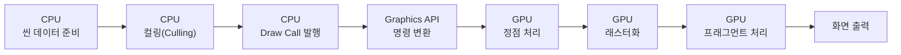
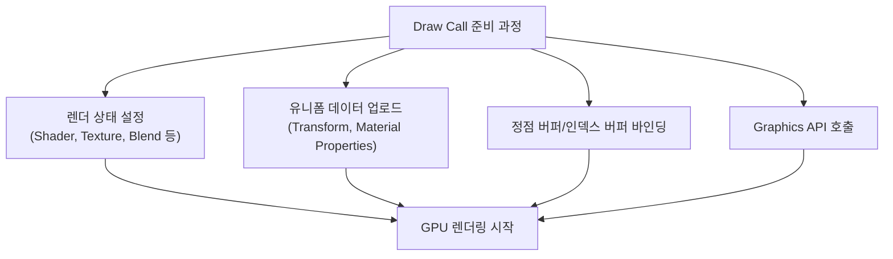
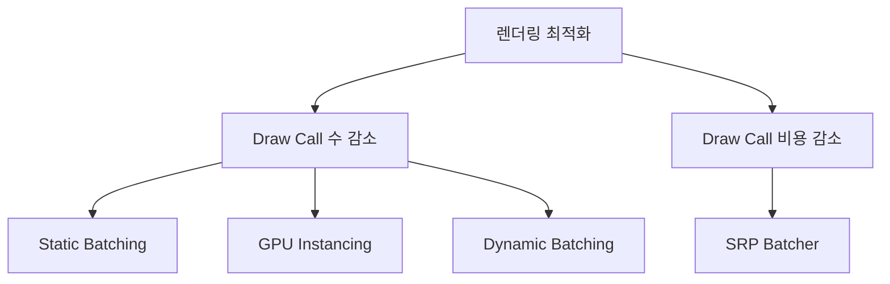
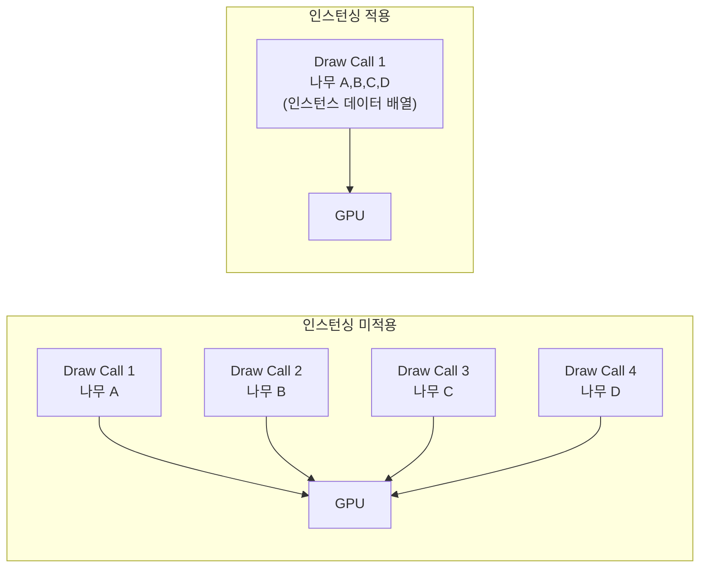
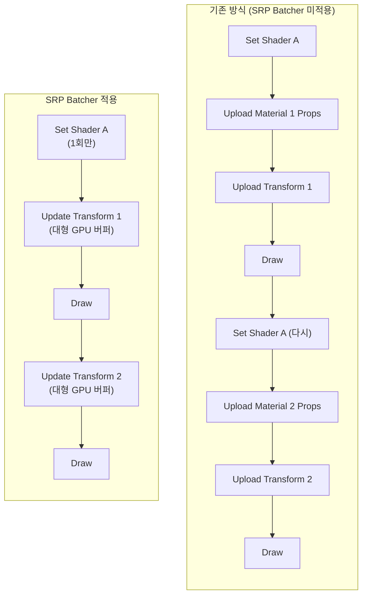
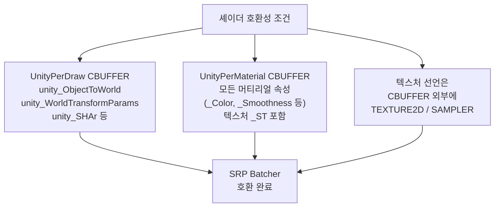
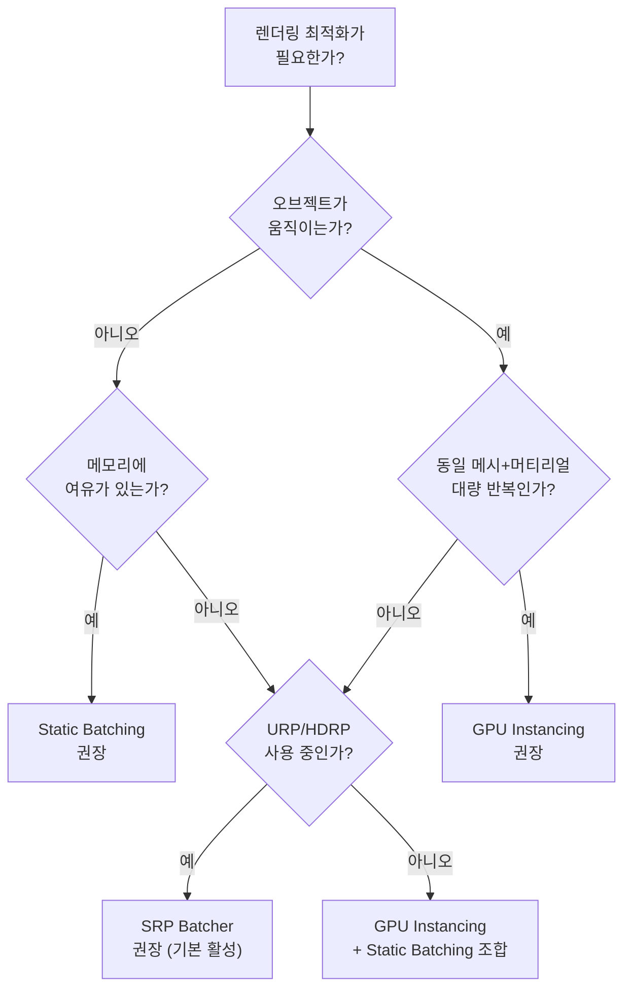

# 🛠️ 260216 Unity 렌더링 최적화 기법 가이드

> ✨ Unity에서 대량의 오브젝트를 효율적으로 렌더링하기 위한 핵심 최적화 기법(GPU Instancing, SRP Batcher, Static Batching)을 상세히 분석한다.

---

## 📚 목차

1. [소개 - Unity 렌더링 파이프라인 개요](#1-소개---unity-렌더링-파이프라인-개요)
2. [필요성 - 렌더링 최적화가 중요한 이유](#2-필요성---렌더링-최적화가-중요한-이유)
3. [다양한 기법 개관](#3-다양한-기법-개관)
4. [GPU Instancing 상세](#4-gpu-instancing-상세)
5. [SRP Batcher 상세](#5-srp-batcher-상세)
6. [Static Batching 상세](#6-static-batching-상세)
7. [기법 간 비교 및 선택 가이드](#7-기법-간-비교-및-선택-가이드)
8. [실전 팁 및 주의사항](#8-실전-팁-및-주의사항)
9. [참고 자료](#9-참고-자료)

---

## 🧭 1. 소개 - Unity 렌더링 파이프라인 개요

Unity의 렌더링 파이프라인은 씬(Scene)의 3D 콘텐츠를 2D 화면에 표시하기 위한 일련의 과정이다. 이 과정은 크게 **CPU 측 처리**와 **GPU 측 처리**로 나뉜다.

### 🧭 렌더링 흐름 개요



**핵심 과정을 단계별로 설명하면 다음과 같다.**

1. **씬 데이터 준비**: CPU가 씬에 존재하는 모든 오브젝트의 메시, 머티리얼, 트랜스폼 정보를 수집한다.
2. **컬링(Culling)**: 카메라 시야(Frustum) 밖의 오브젝트를 제거하고, 오클루전 컬링(Occlusion Culling)을 통해 다른 오브젝트에 가려진 것들을 배제한다.
3. **Draw Call 발행**: CPU가 Graphics API(DirectX, Vulkan, Metal, OpenGL)를 통해 GPU에 "이 메시를, 이 셰이더로, 이 텍스처와 함께 그려라"라는 명령을 보낸다. 이것이 **Draw Call**이다.
4. **GPU 렌더링**: GPU가 정점 셰이더, 래스터라이저, 프래그먼트 셰이더를 거쳐 최종 픽셀을 계산하고 화면에 출력한다.

### 🏗️ Unity 렌더 파이프라인 종류

| 파이프라인 | 특징 | 권장 대상 |
|:---:|:---|:---|
| **Built-in RP** | 레거시 파이프라인. 범용적이나 커스터마이징 제한적 | 기존 프로젝트 유지보수 |
| **URP** (Universal RP) | 경량, 높은 호환성. 모바일부터 콘솔까지 | 대부분의 신규 프로젝트 |
| **HDRP** (High Definition RP) | 고품질 그래픽. 고사양 PC/콘솔 타겟 | AAA급 비주얼 프로젝트 |

URP와 HDRP는 **Scriptable Render Pipeline(SRP)** 기반이며, 이 문서에서 다루는 SRP Batcher는 이 SRP 기반 파이프라인에서만 동작한다.

---

## 🎯 2. 필요성 - 렌더링 최적화가 중요한 이유

### 🔹 Draw Call의 비용

Draw Call 자체는 GPU에게 보내는 단순한 명령이지만, 문제는 **Draw Call 준비 과정**에서 발생하는 CPU 오버헤드이다. 각 Draw Call마다 다음과 같은 작업이 수행된다.



**한 프레임에 수천 개의 Draw Call이 발생하면**, CPU가 이 준비 작업에 병목이 걸려 프레임 레이트가 급격히 하락한다. 이것이 소위 **CPU-bound** 상태이다.

### ⚡ 성능 병목의 유형

| 병목 유형 | 원인 | 증상 |
|:---:|:---|:---|
| **CPU-bound** | Draw Call 과다, 렌더 상태 변경 과다 | CPU 사용률 100%, GPU 유휴 |
| **GPU-bound** | 과도한 폴리곤, 복잡한 셰이더, 높은 해상도 | GPU 사용률 100%, CPU 유휴 |
| **대역폭 병목** | 과도한 데이터 전송(RAM <-> VRAM) | 두 프로세서 모두 비효율 |

렌더링 최적화의 핵심 목표는 **CPU-bound 상태를 해소**하는 것이다. 이를 위해 Draw Call 수를 줄이거나, 각 Draw Call의 준비 비용을 줄이는 기법이 필요하다.

### 🚀 최적화 기법의 분류



- **Draw Call 수 감소**: 여러 오브젝트를 하나의 Draw Call로 묶어서 그린다. (Static Batching, GPU Instancing, Dynamic Batching)
- **Draw Call 비용 감소**: Draw Call 수는 유지하되, 각 호출 사이의 렌더 상태 전환 비용을 줄인다. (SRP Batcher)

---

## 📌 3. 다양한 기법 개관

이 문서에서 다루는 세 가지 핵심 기법을 요약하면 다음과 같다.

| 기법 | 원리 | 장점 | 제약 |
|:---:|:---|:---|:---|
| **GPU Instancing** | 동일 메시+머티리얼을 GPU 단일 호출로 다수 렌더링 | Draw Call을 획기적으로 줄임 | 동일 메시/머티리얼 필수, SRP Batcher와 비호환 |
| **SRP Batcher** | 동일 셰이더 Variant 사용 머티리얼들의 렌더 상태 전환 최소화 | 머티리얼 달라도 배칭 가능 | SRP 전용, MaterialPropertyBlock 사용 시 깨짐 |
| **Static Batching** | 정적 오브젝트의 메시를 사전 결합 | 런타임 CPU 부하 없음 | 메모리 증가, 이동 불가 |

### 🏗️ 파이프라인별 호환성

| 기법 | Built-in RP | URP | HDRP |
|:---:|:---:|:---:|:---:|
| GPU Instancing | O | 제한적 (SRP Batcher 비활성 시) | 제한적 (SRP Batcher 비활성 시) |
| SRP Batcher | X | O (기본 활성) | O (기본 활성) |
| Static Batching | O | O | O |

### 🔹 우선순위

Unity 엔진 내부에서 배칭 기법의 적용 우선순위는 다음과 같다.

> 💡 **SRP Batcher > GPU Instancing > Static Batching > Dynamic Batching**

SRP Batcher가 활성화되어 있고, 셰이더가 호환되면 GPU Instancing보다 SRP Batcher가 우선 적용된다.

---

## 🎮 4. GPU Instancing 상세

### 🔹 4.1 개념 설명

GPU Instancing은 **동일한 메시(Mesh)와 머티리얼(Material)을 공유하는 다수의 오브젝트**를 단 한 번의 Draw Call로 렌더링하는 기법이다. GPU의 하드웨어 인스턴싱 기능을 활용하며, 각 인스턴스는 고유한 Transform(위치, 회전, 스케일)과 추가 속성(색상 등)을 가질 수 있다.



**핵심 원리**: CPU는 인스턴스별 데이터(Transform 행렬, 커스텀 속성 등)를 배열로 묶어 GPU에 한 번에 전송한다. GPU는 Vertex Shader에서 Instance ID를 기반으로 각 인스턴스의 데이터를 참조하여 개별적으로 렌더링한다.

### ⚠️ 4.2 장단점

**장점**
- Draw Call을 획기적으로 줄일 수 있다 (5,000개 오브젝트가 약 40개 배치로 감소 가능)
- 프레임 레이트 대폭 향상 (테스트 기준 35fps -> 80fps 사례)
- 인스턴스별 고유 속성(색상, 스케일 등) 지원
- 런타임에 동적으로 인스턴스 추가/제거 가능

**단점**
- 동일 메시 + 동일 머티리얼 조합만 배칭 가능
- SRP Batcher와 동시 사용 불가 (SRP Batcher가 우선)
- Skinned Mesh Renderer는 미지원
- 배치당 최대 인스턴스 수 제한 (데스크톱: 약 511개, 모바일: 약 125개)
- MaterialPropertyBlock으로 비인스턴스 속성 설정 시 인스턴싱 해제

### 🧪 4.3 간단 예제 (Inspector 기반)

가장 기본적인 GPU Instancing 활성화 방법은 머티리얼의 Inspector에서 체크박스를 켜는 것이다.

```csharp
using UnityEngine;

/// <summary>
/// 기본적인 GPU Instancing 활성화 예제.
/// 동일 메시와 머티리얼을 사용하는 오브젝트를 씬에 다수 배치하면
/// Unity가 자동으로 인스턴싱을 적용한다.
/// </summary>
public class SimpleGPUInstancingExample : MonoBehaviour
{
    [SerializeField] private GameObject prefab;       // 동일 메시+머티리얼의 프리팹
    [SerializeField] private int count = 100;         // 생성 개수
    [SerializeField] private float spacing = 2.0f;    // 간격

    void Start()
    {
        // 머티리얼에서 "Enable GPU Instancing" 체크 필요
        // 동일 메시+머티리얼 프리팹을 그리드로 배치
        for (int i = 0; i < count; i++)
        {
            Vector3 position = new Vector3(
                (i % 10) * spacing,
                0,
                (i / 10) * spacing
            );
            Instantiate(prefab, position, Quaternion.identity);
        }
    }
}
```

**설정 방법 (Inspector)**
1. 머티리얼 선택 -> Inspector 하단 -> `Enable GPU Instancing` 체크
2. 셰이더가 `#pragma multi_compile_instancing`을 포함해야 함
3. Standard Shader는 기본 지원

### 🧪 4.4 실용 예제 (Graphics.RenderMeshInstanced)

실무에서는 `GameObject`를 대량 생성하는 대신, `Graphics.RenderMeshInstanced` API를 사용하여 GameObject 없이 직접 GPU로 인스턴스를 렌더링한다.

```csharp
using UnityEngine;

/// <summary>
/// Graphics.RenderMeshInstanced를 활용한 대량 오브젝트 렌더링.
/// GameObject를 생성하지 않으므로 CPU 오버헤드가 매우 낮다.
/// </summary>
public class AdvancedGPUInstancing : MonoBehaviour
{
    [Header("렌더링 설정")]
    [SerializeField] private Mesh mesh;                // 렌더링할 메시
    [SerializeField] private Material material;        // GPU Instancing 지원 머티리얼
    [SerializeField] private int instanceCount = 1000; // 인스턴스 수

    [Header("배치 설정")]
    [SerializeField] private float areaSize = 50f;     // 배치 영역 크기
    [SerializeField] private float minScale = 0.5f;    // 최소 스케일
    [SerializeField] private float maxScale = 2.0f;    // 최대 스케일

    // 인스턴스 변환 행렬 배열 (최대 1023개까지 한 번에 렌더링 가능)
    private Matrix4x4[] _matrices;
    private RenderParams _renderParams;

    void Start()
    {
        InitializeInstances();
    }

    /// <summary>
    /// 인스턴스 데이터를 초기화한다.
    /// 랜덤 위치와 스케일로 변환 행렬을 생성한다.
    /// </summary>
    private void InitializeInstances()
    {
        _matrices = new Matrix4x4[instanceCount];

        for (int i = 0; i < instanceCount; i++)
        {
            // 랜덤 위치 생성
            Vector3 position = new Vector3(
                Random.Range(-areaSize, areaSize),
                0f,
                Random.Range(-areaSize, areaSize)
            );

            // 랜덤 회전 생성
            Quaternion rotation = Quaternion.Euler(0, Random.Range(0f, 360f), 0);

            // 랜덤 균일 스케일 생성
            float scale = Random.Range(minScale, maxScale);
            Vector3 scaleVec = Vector3.one * scale;

            _matrices[i] = Matrix4x4.TRS(position, rotation, scaleVec);
        }

        // RenderParams 설정 (매 프레임 재생성을 피하기 위해 캐싱)
        _renderParams = new RenderParams(material)
        {
            receiveShadows = true,
            shadowCastingMode = UnityEngine.Rendering.ShadowCastingMode.On
        };
    }

    void Update()
    {
        // 인스턴스 수가 1023개를 초과하면 여러 번 나눠서 호출
        int batchSize = 1023; // API 제한: 한 번에 최대 1023개
        for (int i = 0; i < instanceCount; i += batchSize)
        {
            int count = Mathf.Min(batchSize, instanceCount - i);
            Graphics.RenderMeshInstanced(
                _renderParams,
                mesh,
                0,            // submeshIndex
                _matrices,
                count,        // 이번 배치에서 렌더링할 인스턴스 수
                i             // 시작 인덱스
            );
        }
    }
}
```

### 🧪 4.5 GPU Instancing 셰이더 예제

커스텀 셰이더에서 GPU Instancing을 지원하려면 다음과 같이 작성한다.

```hlsl
Shader "Custom/InstancedColorShader"
{
    Properties
    {
        _Color ("Color", Color) = (1, 1, 1, 1)
        _MainTex ("Texture", 2D) = "white" {}
    }

    SubShader
    {
        Tags { "RenderType"="Opaque" }
        LOD 100

        Pass
        {
            CGPROGRAM
            #pragma vertex vert
            #pragma fragment frag
            // GPU Instancing 활성화를 위한 필수 프래그마
            #pragma multi_compile_instancing
            #include "UnityCG.cginc"

            struct appdata
            {
                float4 vertex : POSITION;
                float2 uv : TEXCOORD0;
                // 인스턴스 ID를 정점 데이터에 포함
                UNITY_VERTEX_INPUT_INSTANCE_ID
            };

            struct v2f
            {
                float4 vertex : SV_POSITION;
                float2 uv : TEXCOORD0;
                // 프래그먼트에서도 인스턴스 ID 사용 시 필요
                UNITY_VERTEX_INPUT_INSTANCE_ID
            };

            sampler2D _MainTex;
            float4 _MainTex_ST;

            // 인스턴스별 속성 버퍼 선언
            UNITY_INSTANCING_BUFFER_START(Props)
                // 각 인스턴스가 고유한 _Color 값을 가질 수 있다
                UNITY_DEFINE_INSTANCED_PROP(float4, _Color)
            UNITY_INSTANCING_BUFFER_END(Props)

            v2f vert(appdata v)
            {
                v2f o;
                // 인스턴스 ID 초기화 (필수)
                UNITY_SETUP_INSTANCE_ID(v);
                // 인스턴스 ID를 프래그먼트로 전달
                UNITY_TRANSFER_INSTANCE_ID(v, o);

                o.vertex = UnityObjectToClipPos(v.vertex);
                o.uv = TRANSFORM_TEX(v.uv, _MainTex);
                return o;
            }

            fixed4 frag(v2f i) : SV_Target
            {
                // 프래그먼트에서 인스턴스 ID 초기화
                UNITY_SETUP_INSTANCE_ID(i);

                fixed4 texColor = tex2D(_MainTex, i.uv);
                // 인스턴스별 색상 속성 접근
                fixed4 instanceColor = UNITY_ACCESS_INSTANCED_PROP(Props, _Color);
                return texColor * instanceColor;
            }
            ENDCG
        }
    }
}
```

**C#에서 인스턴스별 색상 설정하기:**

```csharp
using UnityEngine;

/// <summary>
/// MaterialPropertyBlock을 사용하여 인스턴스별 색상을 설정하는 예제.
/// 각 오브젝트가 고유한 색상을 가지면서도 GPU Instancing의 혜택을 받는다.
/// </summary>
public class PerInstanceColor : MonoBehaviour
{
    [SerializeField] private GameObject prefab;
    [SerializeField] private int count = 200;

    void Start()
    {
        MaterialPropertyBlock mpb = new MaterialPropertyBlock();

        for (int i = 0; i < count; i++)
        {
            Vector3 pos = new Vector3(
                (i % 20) * 1.5f,
                0,
                (i / 20) * 1.5f
            );

            GameObject obj = Instantiate(prefab, pos, Quaternion.identity);
            Renderer rend = obj.GetComponent<Renderer>();

            // 인스턴스별 고유 색상 설정
            // 주의: 인스턴스 속성만 MaterialPropertyBlock에 넣어야 한다.
            //       비인스턴스 속성을 넣으면 인스턴싱이 깨진다.
            mpb.SetColor("_Color", Random.ColorHSV());
            rend.SetPropertyBlock(mpb);
        }
    }
}
```

### ⚡ 4.6 성능 팁

- **배치 크기 제한**: 데스크톱 GPU는 약 511개(64KB 상수 버퍼 제한), 모바일은 약 125개까지 한 배치에 포함 가능하다.
- **셰도우 패스**: 셰도우 캐스터 패스에도 인스턴싱을 적용하면 그림자 렌더링 오버헤드가 크게 줄어든다.
- **URP/HDRP에서 사용**: SRP Batcher를 비활성화하거나, 셰이더를 SRP Batcher 비호환으로 만들어야 GPU Instancing이 작동한다.
- **적합한 시나리오**: 나무, 풀, 바위, 군중 등 동일 메시가 대량으로 반복되는 장면에서 효과적이다.

---

## 📌 5. SRP Batcher 상세

### 🔹 5.1 개념 설명

SRP Batcher는 Draw Call의 수를 줄이는 것이 아니라, **Draw Call 사이의 렌더 상태 전환 비용을 줄이는** 최적화 기법이다. 동일한 **셰이더 Variant**를 사용하는 머티리얼들을 연속으로 배치하여, GPU에 설정해야 하는 상태 변경을 최소화한다.



**핵심 원리**:
- 머티리얼 데이터를 **GPU 메모리에 영속적으로 유지**한다. 머티리얼이 변경되지 않으면 매 프레임 재업로드하지 않는다.
- 오브젝트별 데이터(Transform 등)는 **전용 대형 GPU CBUFFER**에서 관리한다.
- CPU는 오브젝트별 엔진 속성(unity_ObjectToWorld 등)만 업데이트하면 된다.

### ⚠️ 5.2 장단점

**장점**
- CPU 렌더링 코드 속도 1.2배 ~ 4배 향상 (씬에 따라 다름)
- 동일 셰이더를 사용하면 **머티리얼이 달라도** 배칭이 가능하다
- 머티리얼 수가 많고 셰이더 Variant가 적은 씬에 최적이다
- URP/HDRP에서 기본 활성화, 별도 설정 거의 불필요
- Skinned Mesh Renderer도 지원

**단점**
- Built-in Render Pipeline에서는 사용 불가
- MaterialPropertyBlock 사용 시 배칭이 깨진다
- GPU Instancing과 동시 사용 불가 (SRP Batcher가 우선)
- 셰이더가 CBUFFER 규칙을 따라야 한다 (호환성 요구)

### 🧪 5.3 간단 예제 (SRP Batcher 활성화)

```csharp
using UnityEngine;
using UnityEngine.Rendering;

/// <summary>
/// SRP Batcher를 런타임에서 활성화/비활성화하는 기본 예제.
/// URP/HDRP에서는 기본적으로 활성화되어 있다.
/// </summary>
public class SimpleSRPBatcherToggle : MonoBehaviour
{
    void Start()
    {
        // SRP Batcher 활성화
        GraphicsSettings.useScriptableRenderPipelineBatching = true;
        Debug.Log("SRP Batcher 활성화됨");
    }

    /// <summary>
    /// 디버깅 목적으로 SRP Batcher를 토글하는 메서드.
    /// 프레임 디버거에서 배칭 효과를 비교할 때 유용하다.
    /// </summary>
    public void ToggleSRPBatcher()
    {
        bool current = GraphicsSettings.useScriptableRenderPipelineBatching;
        GraphicsSettings.useScriptableRenderPipelineBatching = !current;
        Debug.Log($"SRP Batcher: {!current}");
    }
}
```

### 🧪 5.4 실용 예제 (SRP Batcher 호환 셰이더)

SRP Batcher가 제대로 작동하려면 셰이더가 호환 규칙을 따라야 한다. 핵심은 **두 개의 CBUFFER** 구조이다.

```hlsl
Shader "Custom/SRPBatcherCompatible"
{
    Properties
    {
        _BaseMap ("Base Texture", 2D) = "white" {}
        _BaseColor ("Base Color", Color) = (1, 1, 1, 1)
        _Smoothness ("Smoothness", Range(0, 1)) = 0.5
        _Metallic ("Metallic", Range(0, 1)) = 0.0
    }

    SubShader
    {
        Tags
        {
            "RenderType" = "Opaque"
            "RenderPipeline" = "UniversalPipeline"
        }

        // 모든 Pass에서 공유할 CBUFFER를 HLSLINCLUDE로 정의
        HLSLINCLUDE
        #include "Packages/com.unity.render-pipelines.universal/ShaderLibrary/Core.hlsl"

        // [필수] 모든 머티리얼 속성을 UnityPerMaterial CBUFFER에 선언
        // 텍스처 자체는 CBUFFER에 포함하지 않지만, _ST(타일링/오프셋)는 포함
        CBUFFER_START(UnityPerMaterial)
            float4 _BaseMap_ST;    // 텍스처 타일링/오프셋
            half4 _BaseColor;      // 기본 색상
            half _Smoothness;      // 매끄러움
            half _Metallic;        // 메탈릭
        CBUFFER_END
        ENDHLSL

        Pass
        {
            Name "ForwardLit"
            Tags { "LightMode" = "UniversalForward" }

            HLSLPROGRAM
            #pragma vertex vert
            #pragma fragment frag

            // 텍스처와 샘플러 선언 (CBUFFER 외부)
            TEXTURE2D(_BaseMap);
            SAMPLER(sampler_BaseMap);

            struct Attributes
            {
                float4 positionOS : POSITION;
                float2 uv : TEXCOORD0;
                float3 normalOS : NORMAL;
            };

            struct Varyings
            {
                float4 positionCS : SV_POSITION;
                float2 uv : TEXCOORD0;
                float3 normalWS : TEXCOORD1;
            };

            Varyings vert(Attributes input)
            {
                Varyings output;
                // UnityPerDraw CBUFFER의 unity_ObjectToWorld 사용
                output.positionCS = TransformObjectToHClip(input.positionOS.xyz);
                output.uv = TRANSFORM_TEX(input.uv, _BaseMap);
                output.normalWS = TransformObjectToWorldNormal(input.normalOS);
                return output;
            }

            half4 frag(Varyings input) : SV_Target
            {
                // UnityPerMaterial CBUFFER의 속성 접근
                half4 texColor = SAMPLE_TEXTURE2D(_BaseMap, sampler_BaseMap, input.uv);
                half4 finalColor = texColor * _BaseColor;
                return finalColor;
            }
            ENDHLSL
        }
    }
}
```

**C#에서 SRP Batcher 호환 여부 확인하기:**

```csharp
using UnityEngine;
using UnityEngine.Rendering;

/// <summary>
/// SRP Batcher 호환성 검증 및 머티리얼 관리 실용 예제.
/// 런타임에서 SRP Batcher 상태를 모니터링하고,
/// 머티리얼 속성 변경 시 배칭이 유지되는 올바른 방법을 보여준다.
/// </summary>
public class SRPBatcherManager : MonoBehaviour
{
    [SerializeField] private Material[] materials;
    [SerializeField] private Renderer[] renderers;

    void Start()
    {
        // SRP Batcher 활성화 확인
        if (!GraphicsSettings.useScriptableRenderPipelineBatching)
        {
            GraphicsSettings.useScriptableRenderPipelineBatching = true;
            Debug.Log("SRP Batcher를 활성화했습니다.");
        }

        // 머티리얼의 SRP Batcher 호환성 확인
        // Frame Debugger (Window > Analysis > Frame Debugger)에서
        // "SRP Batch" 항목으로 배칭 상태를 확인할 수 있다.
    }

    /// <summary>
    /// SRP Batcher가 깨지지 않도록 머티리얼 속성을 올바르게 변경하는 방법.
    /// MaterialPropertyBlock은 사용하지 않는다.
    /// 대신 Material 인스턴스의 속성을 직접 수정한다.
    /// </summary>
    public void ChangeMaterialColorSafely(Renderer renderer, Color newColor)
    {
        // [올바른 방법] Material 인스턴스 직접 수정
        // SRP Batcher는 동일 셰이더 Variant 간에 작동하므로
        // 머티리얼 속성이 달라도 배칭이 유지된다.
        renderer.material.SetColor("_BaseColor", newColor);

        // [잘못된 방법] - MaterialPropertyBlock은 SRP Batcher를 깨뜨린다
        // var mpb = new MaterialPropertyBlock();
        // mpb.SetColor("_BaseColor", newColor);
        // renderer.SetPropertyBlock(mpb);  // SRP Batch 해제됨!
    }

    /// <summary>
    /// 대량의 오브젝트에 다양한 색상을 적용하면서
    /// SRP Batcher 배칭을 유지하는 패턴.
    /// </summary>
    public void ApplyVariousColors(Renderer[] targetRenderers)
    {
        foreach (var rend in targetRenderers)
        {
            // renderer.material 접근 시 자동으로 머티리얼 인스턴스가 생성된다.
            // 동일 셰이더를 사용하는 한 SRP Batcher 배칭이 유지된다.
            rend.material.SetColor("_BaseColor", Random.ColorHSV());
        }
    }
}
```

### 🔹 5.5 SRP Batcher 호환 셰이더의 CBUFFER 규칙



**검증 방법**: Unity Editor에서 셰이더를 선택하면 Inspector에 `SRP Batcher: compatible` 또는 `not compatible` 상태가 표시된다.

### ⚡ 5.6 성능 팁

- **셰이더 Variant를 최소화**하라. 머티리얼 수는 아무리 많아도 되지만, 셰이더 Variant 수가 적을수록 배칭 효과가 극대화된다.
- **MaterialPropertyBlock을 사용하지 마라**. 속성 변경은 `renderer.material.SetXXX()`로 한다.
- **Frame Debugger**(Window > Analysis > Frame Debugger)에서 SRP Batch 항목을 확인하여 배칭이 제대로 적용되는지 검증한다.
- PS4 기준 최악의 경우(모두 다른 머티리얼, 동적 오브젝트)에서도 약 **4배의 CPU 렌더링 속도 향상**이 보고되었다.

---

## 📌 6. Static Batching 상세

### 🔹 6.1 개념 설명

Static Batching은 **이동하지 않는(정적인) 오브젝트**들의 메시를 사전에 결합하여 하나의 큰 메시로 만들고, 런타임에서 효율적으로 렌더링하는 기법이다.


**핵심 원리**:
- 빌드 시 또는 런타임 초기화 시, 정적 오브젝트들의 메시 데이터를 하나의 내부 메시로 복사하여 합친다.
- 결합된 후에도 개별 오브젝트의 컬링은 독립적으로 수행된다.
- 렌더 상태가 동일한(같은 머티리얼) 오브젝트들은 하나의 Draw Call로 렌더링된다.

### ⚠️ 6.2 장단점

**장점**
- 빌드 타임 배칭 시 **런타임 CPU 비용이 0**에 가깝다 (사전에 모든 결합 완료)
- Dynamic Batching 대비 정점 변환이 불필요하여 더 효율적이다
- 설정이 매우 간단하다 (오브젝트를 Static으로 마크하면 끝)
- 모든 렌더 파이프라인에서 작동한다

**단점**
- **메모리 사용량 증가**: 동일 메시를 공유하는 오브젝트가 여러 개일 때, 각각의 복사본이 결합 메시에 포함된다
- 결합 후 **개별 오브젝트의 이동/회전/스케일 변경 불가**
- 배치당 최대 **64,000 정점** 제한
- 런타임 배칭 시 메시의 Read/Write 플래그가 필요하여 메모리가 2배로 증가할 수 있다

### 🧪 6.3 간단 예제 (에디터 기반)

```csharp
using UnityEngine;

/// <summary>
/// 에디터에서 Static Batching을 설정하는 가장 기본적인 방법.
/// 오브젝트를 "Batching Static"으로 마크하면 빌드 시 자동으로 결합된다.
/// </summary>
public class SimpleStaticBatchingExample : MonoBehaviour
{
    [SerializeField] private GameObject[] staticObjects;

    void Awake()
    {
        // 에디터에서의 설정 방법:
        // 1. Player Settings > Other Settings > "Static Batching" 체크 확인
        // 2. 움직이지 않는 오브젝트 선택 > Inspector > Static 체크박스 > "Batching Static" 활성화
        // 3. 빌드 시 Unity가 자동으로 메시를 결합함

        // 코드에서 오브젝트를 정적으로 마크하는 방법
        foreach (var obj in staticObjects)
        {
            // GameObjectUtility.SetStaticEditorFlags는 에디터 전용이므로
            // 런타임에서는 StaticBatchingUtility를 사용한다
            obj.isStatic = true;
        }
    }
}
```

### 🧪 6.4 실용 예제 (런타임 Static Batching)

프로시저럴 생성이나 에셋 번들 로드 등, 런타임에 생성되는 오브젝트에 Static Batching을 적용하는 실용적 예제이다.

```csharp
using UnityEngine;

/// <summary>
/// 런타임에서 프로시저럴하게 생성한 오브젝트에 Static Batching을 적용하는 예제.
/// StaticBatchingUtility.Combine()을 사용하여 메시를 결합한다.
/// </summary>
public class RuntimeStaticBatching : MonoBehaviour
{
    [Header("프로시저럴 생성 설정")]
    [SerializeField] private Mesh[] meshVariants;      // 다양한 메시 종류
    [SerializeField] private Material sharedMaterial;   // 공유 머티리얼
    [SerializeField] private int objectCount = 500;     // 생성할 오브젝트 수
    [SerializeField] private float spawnRadius = 100f;  // 생성 반경

    [Header("배칭 설정")]
    [SerializeField] private Transform batchRoot;       // 배칭 루트 트랜스폼

    void Start()
    {
        GenerateAndBatch();
    }

    /// <summary>
    /// 오브젝트를 프로시저럴하게 생성한 뒤 Static Batching으로 결합한다.
    /// </summary>
    private void GenerateAndBatch()
    {
        // 배칭 루트가 없으면 생성
        if (batchRoot == null)
        {
            GameObject root = new GameObject("StaticBatchRoot");
            batchRoot = root.transform;
        }

        // 오브젝트 생성
        for (int i = 0; i < objectCount; i++)
        {
            GameObject obj = new GameObject($"StaticObj_{i}");
            obj.transform.SetParent(batchRoot);

            // 랜덤 위치 배치
            Vector3 randomPos = Random.insideUnitSphere * spawnRadius;
            randomPos.y = 0; // 바닥에 배치
            obj.transform.localPosition = randomPos;
            obj.transform.localRotation = Quaternion.Euler(0, Random.Range(0f, 360f), 0);

            // 메시 필터 및 렌더러 추가
            MeshFilter mf = obj.AddComponent<MeshFilter>();
            MeshRenderer mr = obj.AddComponent<MeshRenderer>();

            // 랜덤 메시 선택 (같은 머티리얼을 사용해야 배칭 효과 극대화)
            mf.sharedMesh = meshVariants[Random.Range(0, meshVariants.Length)];
            mr.sharedMaterial = sharedMaterial;
        }

        // 핵심: StaticBatchingUtility.Combine으로 메시 결합
        // batchRoot의 모든 자식 오브젝트가 결합 대상이 된다
        StaticBatchingUtility.Combine(batchRoot.gameObject);

        Debug.Log($"Static Batching 완료: {objectCount}개 오브젝트 결합됨");

        // 메모리 최적화: 결합 후 원본 메시의 CPU 복사본 해제
        // (결합된 메시 데이터가 이미 GPU에 업로드되었으므로)
        // 주의: 이후 메시 데이터에 CPU에서 접근할 수 없게 된다
        OptimizeMemory();
    }

    /// <summary>
    /// 결합 완료 후 불필요한 CPU측 메시 데이터를 해제하여 메모리를 절약한다.
    /// </summary>
    private void OptimizeMemory()
    {
        MeshFilter[] filters = batchRoot.GetComponentsInChildren<MeshFilter>();
        foreach (var filter in filters)
        {
            if (filter.sharedMesh != null && filter.sharedMesh.isReadable)
            {
                // GPU에 업로드 후 CPU 복사본 삭제
                filter.sharedMesh.UploadMeshData(true);
            }
        }
    }

    /// <summary>
    /// 특정 오브젝트 배열만 선택적으로 배칭하는 오버로드 활용 예제.
    /// </summary>
    public void BatchSpecificObjects(GameObject[] objectsToBatch)
    {
        // 특정 오브젝트 배열을 루트 아래에 배칭
        StaticBatchingUtility.Combine(objectsToBatch, batchRoot.gameObject);
        Debug.Log($"선택적 Static Batching 완료: {objectsToBatch.Length}개 오브젝트");
    }
}
```

### ⚡ 6.5 성능 팁

- **메모리 vs 성능 트레이드오프**: 동일 메시를 100개 사용하면 결합 메시에 해당 메시 데이터가 100번 복사된다. 메모리 여유가 부족하면 다른 기법을 고려하라.
- **64,000 정점 제한**: 배치당 정점 수가 이를 초과하면 자동으로 분할된다. 매우 복잡한 메시는 배칭 효과가 줄어들 수 있다.
- **런타임 배칭 후 UploadMeshData(true)**: CPU 메시 복사본을 해제하여 메모리 사용량을 줄인다.
- **Dynamic Batching과의 차이**: Dynamic Batching은 매 프레임 정점 변환을 수행하므로 CPU 부하가 크다. Static Batching은 사전 결합이므로 런타임 부하가 없다.

---

## 🛠️ 7. 기법 간 비교 및 선택 가이드

### ⚖️ 종합 비교표

| 항목 | GPU Instancing | SRP Batcher | Static Batching |
|:---|:---:|:---:|:---:|
| **Draw Call 감소** | 매우 큼 | 없음 (비용 감소) | 큼 |
| **CPU 부하 감소** | 큼 | 매우 큼 (1.2~4x) | 매우 큼 (런타임 0) |
| **메모리 오버헤드** | 낮음 | 낮음 | 높음 (메시 복사) |
| **동적 오브젝트** | 지원 | 지원 | 미지원 |
| **다양한 머티리얼** | 미지원 | 지원 (동일 셰이더) | 미지원 |
| **다양한 메시** | 미지원 | 지원 | 지원 (동일 머티리얼) |
| **Built-in RP** | 지원 | 미지원 | 지원 |
| **URP / HDRP** | 제한적 | 기본 활성 | 지원 |
| **Skinned Mesh** | 미지원 | 지원 | 미지원 |

### 🔹 시나리오별 권장 기법



| 시나리오 | 권장 기법 | 이유 |
|:---|:---|:---|
| 숲/초원 (나무, 풀, 바위) | GPU Instancing | 동일 메시 대량 반복 |
| 도시 건물 (다양한 머티리얼) | SRP Batcher | 다양한 머티리얼이지만 셰이더는 동일 |
| 실내 가구 (정적 배치) | Static Batching | 이동하지 않는 다수의 오브젝트 |
| 군중 시뮬레이션 | GPU Instancing | 동일 캐릭터 메시 대량 렌더링 |
| BIM/CAD 뷰어 | SRP Batcher + Static Batching | 정적 구조물 + 다양한 머티리얼 |
| 파티클/이펙트 | GPU Instancing | 동일 형태의 대량 파티클 |

---

## ⚠️ 8. 실전 팁 및 주의사항

### ⚠️ 8.1 공통 주의사항

1. **Frame Debugger 활용**: `Window > Analysis > Frame Debugger`를 통해 실제 배칭 상태와 Draw Call 수를 확인한다. 예상대로 배칭이 적용되지 않는 경우를 즉시 파악할 수 있다.

2. **Profiler 병행 사용**: `Window > Analysis > Profiler`에서 `Rendering` 모듈의 `Batches`, `SetPass Calls` 수치를 모니터링한다.

3. **SRP Batcher와 GPU Instancing의 공존**: SRP Batcher가 활성화된 상태에서 GPU Instancing을 사용하려면, 해당 셰이더를 SRP Batcher 비호환으로 만들어야 한다. 이는 CBUFFER 규칙을 의도적으로 위반하는 방식이다.

### 🚀 8.2 최적화 체크리스트

```
[체크리스트]
- [ ] Frame Debugger에서 Draw Call 수 확인
- [ ] Profiler에서 CPU/GPU 병목 확인
- [ ] 정적 오브젝트에 "Batching Static" 플래그 설정
- [ ] URP/HDRP 프로젝트에서 SRP Batcher 활성화 확인
- [ ] 대량 반복 메시에 GPU Instancing 적용 검토
- [ ] MaterialPropertyBlock 사용 여부 확인 (SRP Batcher 호환성)
- [ ] 셰이더 Variant 수 최소화
- [ ] Static Batching 적용 시 메모리 증가량 확인
```

### 🔹 8.3 Unity 6+ 추가 정보

Unity 6(6000.x) 이상에서는 **GPU Resident Drawer**라는 새로운 기법이 추가되었다. 이 기법은 GPU Instancing을 자동화하고 SRP Batcher와 함께 동작하여, 수동 설정 없이도 대량의 오브젝트를 효율적으로 렌더링한다. 최신 프로젝트에서는 이 기능도 함께 검토할 것을 권장한다.

---

## 🔗 9. 참고 자료

### 🔹 공식 문서

- [Unity Manual - Introduction to GPU Instancing](https://docs.unity3d.com/6000.3/Documentation/Manual/GPUInstancing.html)
- [Unity Manual - GPU Instancing (Built-in RP)](https://docs.unity3d.com/6000.2/Documentation/Manual/gpu-instancing-birp.html)
- [Unity Manual - Creating Custom Shaders for GPU Instancing](https://docs.unity3d.com/6000.2/Documentation/Manual/gpu-instancing-shader.html)
- [Unity Manual - GPU Instancing Shader Examples](https://docs.unity3d.com/6000.2/Documentation/Manual/gpu-instancing-samples.html)
- [Unity Manual - Enable GPU Instancing](https://docs.unity3d.com/6000.2/Documentation/Manual/gpu-instancing-enable.html)
- [Unity Manual - SRP Batcher in URP](https://docs.unity3d.com/6000.3/Documentation/Manual/SRPBatcher.html)
- [Unity Manual - Enable SRP Batcher in URP](https://docs.unity3d.com/6000.2/Documentation/Manual/SRPBatcher-Enable.html)
- [Unity Manual - Make URP Shader SRP Batcher Compatible](https://docs.unity3d.com/6000.3/Documentation/Manual/urp/shaders-in-universalrp-srp-batcher.html)
- [Unity Manual - Static Batching](https://docs.unity3d.com/6000.1/Documentation/Manual/static-batching.html)
- [Unity Manual - Batch Meshes at Runtime](https://docs.unity3d.com/6000.3/Documentation/Manual/static-batching-enable.html)
- [Unity API - Graphics.RenderMeshInstanced](https://docs.unity3d.com/ScriptReference/Graphics.RenderMeshInstanced.html)
- [Unity API - StaticBatchingUtility.Combine](https://docs.unity3d.com/ScriptReference/StaticBatchingUtility.Combine.html)
- [Unity Manual - Optimizing Draw Calls](https://docs.unity.cn/Manual/optimizing-draw-calls.html)
- [Unity Manual - Introduction to Render Pipelines](https://docs.unity3d.com/6000.2/Documentation/Manual/render-pipelines-overview.html)

### 🔹 블로그 및 기술 아티클

- [Unity Blog - SRP Batcher: Speed Up Your Rendering](https://unity.com/blog/engine-platform/srp-batcher-speed-up-your-rendering)
- [Catlike Coding - GPU Instancing Tutorial](https://catlikecoding.com/unity/tutorials/rendering/part-19/)
- [Joe Fazzino - Building a Custom Renderer: Draw Calls & Batching](https://fazz.dev/articles/building-srp-part-three)
- [Azur Games - Optimizing the Midcore: Increasing FPS Using SRP Batcher](https://azurgames.com/blog/optimizing-the-midcore-increasing-fps-using-srp-batcher/)
- [TheGamedev.Guru - Static Batching May Not Reduce Draw Calls](https://thegamedev.guru/unity-performance/static-batching-draw-call-count/)
- [TheGamedev.Guru - Unity Draw Call Batching: The Ultimate Guide](https://thegamedev.guru/unity-performance/draw-call-optimization/)
- [Eduardo Martinelli - GPU Instancing for Performance in Unity](https://medium.com/@edmartinelli/let-hardware-do-the-heavy-lifting-gpu-instancing-for-performance-in-unity-d79cea9549b1)

### 🔹 Unity 커뮤니티 토론

- [Unity Discussions - SRP Batcher vs GPU Instancing](https://discussions.unity.com/t/srp-batcher-vs-gpu-instancing/799622)
- [Unity Discussions - Confused About SRP Batching vs GPU Instancing Performance](https://discussions.unity.com/t/confused-about-performance-of-srp-batching-vs-gpu-instancing/803948)
- [Unity Discussions - SRP Batcher and GPU Instancing](https://discussions.unity.com/t/srp-batcher-and-gpu-instancing/918509)

---

- 프롬프트
  ```text
  unity 렌더링 최적화
  - 소개
  - 필요성
  - 다양한 기법
    - gpu instancing
    - srp batching
    - static batching
  - 각 기법별
    - 간단예제
    - 실용예제
  ```
