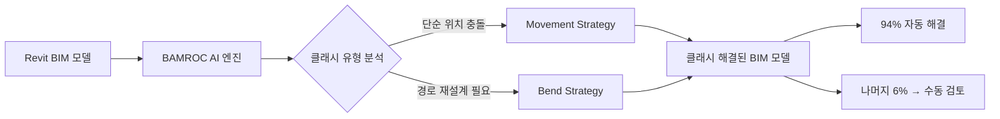

# 🧠 3D 간섭 해결 핵심 기술 통합 보고서 (파트 2): 3D A*, Voxel, VaveTek

> 📝 **작성일**: 2026-02-19
> 📝 **문서 유형**: 통합 보고서 (기존 리서치 문서 재구성)
> 📝 **원본 문서**: 5건의 리서치 문서에서 관련 내용 수집

---

## 📚 목차

### 🧠 파트 3: 3D A* 알고리즘 + 3D Voxel
- [3.1 A* 알고리즘의 3D 확장](#31-a-알고리즘의-3d-확장)
  - [3.1.1 핵심 아이디어](#311-핵심-아이디어)
  - [3.1.2 핵심 수식: f = g + h](#312-핵심-수식-f--g--h)
  - [3.1.3 3D 복셀 그리드 이산화](#313-3d-복셀-그리드-이산화)
  - [3.1.4 6-연결/26-연결 이웃 탐색](#314-6-연결26-연결-이웃-탐색)
  - [3.1.5 MEP 직교 라우팅 적용](#315-mep-직교-라우팅-적용)
  - [3.1.6 의사코드 및 Python 코드 예제](#316-의사코드-및-python-코드-예제)
  - [3.1.7 시각적 다이어그램](#317-시각적-다이어그램)
  - [3.1.8 BIM/3D 간섭 해결에서의 활용](#318-bim3d-간섭-해결에서의-활용)
  - [3.1.9 참고 자료 URL](#319-참고-자료-url)
- [3.2 3D Voxel 기술](#32-3d-voxel-기술)
  - [3.2.1 Voxel의 정의](#321-voxel의-정의)
  - [3.2.2 Pixel vs Voxel 비교](#322-pixel-vs-voxel-비교)
  - [3.2.3 3D 격자(Grid) 표현 방식](#323-3d-격자grid-표현-방식)
  - [3.2.4 해상도와 메모리 관계](#324-해상도와-메모리-관계)
  - [3.2.5 Voxel 자료구조](#325-voxel-자료구조)
  - [3.2.6 Voxel 관련 핵심 알고리즘](#326-voxel-관련-핵심-알고리즘)
  - [3.2.7 Voxel 렌더링 기법](#327-voxel-렌더링-기법)
  - [3.2.8 Voxel 최적화 기법](#328-voxel-최적화-기법)
  - [3.2.9 실제 활용 사례](#329-실제-활용-사례)
  - [3.2.10 Voxel vs Mesh vs Point Cloud 비교](#3210-voxel-vs-mesh-vs-point-cloud-비교)
  - [3.2.11 참고 자료 URL](#3211-참고-자료-url)

### 🔍 파트 4: VaveTek 기업분석
- [4.1 기업 정보](#41-기업-정보)
  - [4.1.1 기업 개요](#411-기업-개요)
  - [4.1.2 대표자 및 핵심 인력](#412-대표자-및-핵심-인력)
  - [4.1.3 연혁](#413-연혁)
  - [4.1.4 직원 수](#414-직원-수)
  - [4.1.5 주요 제품](#415-주요-제품)
  - [4.1.6 재무 상태](#416-재무-상태)
  - [4.1.7 비전 및 미션](#417-비전-및-미션)
  - [4.1.8 향후 로드맵](#418-향후-로드맵)
- [4.2 BAMROC](#42-bamroc)
  - [4.2.1 소개](#421-소개)
  - [4.2.2 특징](#422-특징)
  - [4.2.3 차별점](#423-차별점)
  - [4.2.4 Movement Strategy (이동 전략)](#424-movement-strategy-이동-전략)
  - [4.2.5 Bend Strategy (벤드 전략)](#425-bend-strategy-벤드-전략)
  - [4.2.6 94% 자동 해결 사례](#426-94-자동-해결-사례)
  - [4.2.7 아키텍처](#427-아키텍처)
  - [4.2.8 장단점](#428-장단점)
  - [4.2.9 사용법](#429-사용법)
  - [4.2.10 기술 스택](#4210-기술-스택)
  - [4.2.11 소개 사이트](#4211-소개-사이트)
  - [4.2.12 참고 자료 URL](#4212-참고-자료-url)
- [4.3 BAMDOC](#43-bamdoc)
  - [4.3.1 소개](#431-소개)
  - [4.3.2 특징](#432-특징)
  - [4.3.3 차별점](#433-차별점)
  - [4.3.4 장단점](#434-장단점)
  - [4.3.5 사용법](#435-사용법)
  - [4.3.6 기술 스택](#436-기술-스택)
  - [4.3.7 소개 사이트](#437-소개-사이트)
- [4.4 BAMROC vs BAMDOC 비교](#44-bamroc-vs-bamdoc-비교)
- [4.5 종합 평가](#45-종합-평가)
- [4.6 참고 자료 URL](#46-참고-자료-url)

---

# 🧠 파트 3: 3D A* 알고리즘 + 3D Voxel

---

## 🧠 3.1 A* 알고리즘의 3D 확장

### 🔹 3.1.1 핵심 아이디어

A* 알고리즘은 **지도 앱의 길찾기**와 같습니다. 출발지에서 목적지까지 가는 수많은 경로 중, 가장 짧은 경로를 효율적으로 찾습니다. BIM/MEP에서는 배관이나 덕트가 건물 내부를 어떻게 지나갈지 자동으로 경로를 계획할 때 사용합니다.

3D로 확장하면 건물 공간 전체를 **복셀(Voxel) 격자**로 나누고, 각 복셀이 비어있는지(통과 가능) 막혀있는지(장애물)를 판단하여 경로를 탐색합니다.

### 🔹 3.1.2 핵심 수식: f = g + h

```
f(n) = g(n) + h(n)

g(n) : 시작점에서 현재 노드 n까지의 실제 비용
h(n) : 현재 노드 n에서 목표까지의 추정 비용 (휴리스틱)
f(n) : 총 예상 비용 (이 값이 작을수록 우선 탐색)

3D 맨해튼 거리 휴리스틱:
h(n) = |nx - gx| + |ny - gy| + |nz - gz|

3D 유클리드 거리 휴리스틱:
h(n) = sqrt((nx-gx)² + (ny-gy)² + (nz-gz)²)
```

### 🔹 3.1.3 3D 복셀 그리드 이산화

```
건물 공간 3D 복셀 변환:

실제 공간 (연속)          복셀 그리드 (이산)
┌──────────────┐          ┌─┬─┬─┬─┬─┐
│  [벽]        │  ─→      │X│ │ │ │X│
│  [배관경로?] │          │X│ │ │ │X│
│  [빔]        │          │X│X│ │ │X│
└──────────────┘          └─┴─┴─┴─┴─┘

X = 장애물 복셀 (벽, 구조체, 기존 MEP)
  = 빈 복셀 (경로 가능)

복셀 크기 예시:
  정밀 모드: 50mm × 50mm × 50mm
  표준 모드: 100mm × 100mm × 100mm
  개요 모드: 500mm × 500mm × 500mm
```

### 🔹 3.1.4 6-연결/26-연결 이웃 탐색

```
6-연결 이웃 탐색 (직교 전용, MEP 표준):
  현재 노드 (x, y, z)의 이웃:
  - (x+1, y, z) → X+ 방향
  - (x-1, y, z) → X- 방향
  - (x, y+1, z) → Y+ 방향
  - (x, y-1, z) → Y- 방향
  - (x, y, z+1) → Z+ 방향 (위층)
  - (x, y, z-1) → Z- 방향 (아래층)

26-연결 이웃 탐색 (대각선 포함):
  6-연결 + 12개 엣지 대각선 + 8개 꼭짓점 대각선
  → 로봇 경로계획, 물류 등에 활용
```

Voxel의 인접성(adjacency)은 3D 공간에서 세 가지 수준으로 정의된다:

- **6-adjacency (면 공유)**: 상, 하, 좌, 우, 앞, 뒤의 6개 이웃
- **18-adjacency (면 + 모서리 공유)**: 6-adjacency + 모서리를 공유하는 12개 이웃
- **26-adjacency (면 + 모서리 + 꼭짓점 공유)**: 모든 방향의 26개 이웃

이 인접성 개념은 3D Flood Fill, 연결 요소 분석(Connected Component Analysis), 경로 탐색 등 다양한 복셀 알고리즘의 기초가 된다.

### 🏢 3.1.5 MEP 직교 라우팅 적용

MEP(기계/전기/배관) 시스템은 실제로 **직교(orthogonal)** 방향으로만 라우팅됩니다. 대각선 배관은 시공이 어렵고 비경제적이기 때문입니다.

건물 공간을 3D 복셀(voxel) 그리드로 이산화하여 MEP 직교 라우팅에 적용한다.

**MEP 특화 비용 함수**:

| 비용 항목 | 가중치 |
|-----------|--------|
| 이동 거리 | 1.0 |
| 방향 전환 (엘보) | 5.0 |
| 높이 변경 | 3.0 |
| 클리어런스 위반 | 10.0 |
| 기존 배관 근접 (병렬) | -0.5 (보너스) |

**시간복잡도**: O(WHD log(WHD)) (W x H x D 그리드)

**Voxel 기반 공간 분할 + 경로 탐색**: Voxel(Volumetric Pixel) 기반 접근법은 3차원 건물 공간을 균일한 3D 격자로 분할하고, 각 Voxel에 점유/비점유, 가중치 등의 속성을 부여하여 경로 탐색에 활용한다.

- **2단계 라우팅 기법**: 건물 구조체(보, 기둥, 슬래브)를 프레임워크로 간주하여 가중 그래프(Weighted Graph)로 상위 표현(Top-level)을 구성하고, 각 하위 구조를 Voxel로 분할하여 하위 표현(Bottom-level)을 구성하는 방식이 연구되었다. 각 배관은 이 2단계 파이핑 스킴을 통해 구성된다.
- **BIM 시맨틱 연동**: BIM 모델의 시맨틱 및 기하학적 정보를 Voxel에 매핑하여 실내 3D 맵 모델을 생성하고, Voxel 유형을 세분화하여 경로 탐색에 활용하는 연구가 진행되었다. ([참고: ResearchGate - Voxel Benchmarks](https://www.researchgate.net/publication/372052869_Voxel_Benchmarks_for_3D_Pathfinding_Sandstone_Descent_and_Industrial_Plants))

**A* / Dijkstra 기반 경로 탐색 핵심 연구**: 2022년 발표된 "The Modification of A* Pathfinding Algorithm for Building MEP Path" 논문은 기존 A* 알고리즘을 MEP 라우팅에 맞게 수정하였다. 노드 선택 프로세스와 후처리(Post-processing) 과정을 개선하여, 배관의 벤드(Bend) 수 최소화와 장애물 회피를 동시에 달성하였다.

**ACO + A* 하이브리드 MEP 라우팅 성과**:
- 설계 효율 **25-35% 향상**, 충돌 발생률 **약 40% 감소**
- 총 레이아웃 비용: A* 대비 **67.0%**, ACO 대비 **68.5%**, 수작업 대비 **51.1%** 절감

### 🧪 3.1.6 의사코드 및 Python 코드 예제

**의사코드 (종합 리서치 문서 기반)**:

```
function AStar_3D_MEP(start, goal, voxelGrid):
    openSet = PriorityQueue()
    openSet.push(start, f=0)
    while openSet is not empty:
        current = openSet.pop()
        if current == goal: return ReconstructPath(cameFrom, current)
        for neighbor in OrthogonalNeighbors(current):  // +X,-X,+Y,-Y,+Z,-Z
            if voxelGrid[neighbor] == BLOCKED: continue
            turnPenalty = TURN_COST if direction_changed else 0
            heightPenalty = HEIGHT_COST if neighbor.z != current.z else 0
            tentative_g = gScore[current] + 1 + turnPenalty + heightPenalty
            ...
```

**Python 코드 예제 (심화 문서 기반)**:

```python
def astar_3d(grid, start, goal):
    open_set = PriorityQueue()
    open_set.put((0, start))

    came_from = {}
    g_score = {start: 0}

    while not open_set.empty():
        current = open_set.get()[1]

        # 목표 도달
        if current == goal:
            return reconstruct_path(came_from, current)

        # 6-연결 이웃 탐색 (MEP 직교 라우팅)
        for neighbor in get_6_neighbors(current):
            if grid[neighbor] == OBSTACLE:
                continue

            # 이동 비용 계산 (방향 전환 패널티 포함)
            move_cost = 1
            if direction_changed(current, neighbor, came_from):
                move_cost += TURN_PENALTY  # 방향 전환 비용

            tentative_g = g_score[current] + move_cost

            if tentative_g < g_score.get(neighbor, float('inf')):
                came_from[neighbor] = current
                g_score[neighbor] = tentative_g
                f = tentative_g + heuristic_3d(neighbor, goal)
                open_set.put((f, neighbor))

    return None  # 경로 없음
```

### 🔹 3.1.7 시각적 다이어그램

```
3D 복셀 A* 경로 탐색 예시 (측면 단면)

Z(층)
↑
3 │  S · · ·     S = 시작점 (Start)
  │      · ·     G = 목표점 (Goal)
2 │      ·  ·    X = 장애물 (구조체/배관)
  │      ·   ·   · = 탐색된 경로
1 │      ·    G
  └────────────→ X(가로)
     1 2 3 4 5

탐색 방향: 6-연결 (상하좌우앞뒤)
경로: S → (3,3) → (3,2) → (3,1) → (4,1) → G
```

**경로 탐색/라우팅 알고리즘 비교**:

| 항목 | A* 3D Grid | RRT/RRT* | PRM |
|------|-----------|---------|-----|
| 장점 | 최적 보장, 직교 자연스러움 | 고차원 강함 | 다수 질의 효율 |
| 단점 | 메모리 큼 | 비결정적 | 전처리 시간 |

**알고리즘 선택 매트릭스 (시나리오별)**:

| 시나리오 | 충돌 감지 | 충돌 해결 | 경로 탐색 | 최적화 |
|----------|----------|----------|----------|--------|
| **실시간 편집 (소규모)** | AABB + GJK | MTV Push-out | - | - |
| **설계 검토 (중규모)** | BVH + GJK/EPA | 우선순위 기반 | A* (직교) | SA |
| **일괄 최적화 (대규모)** | BVH + GJK/EPA | 제약 전파 | RRT*/PRM | NSGA-II |
| **MEP 자동 라우팅** | Octree + AABB | - | A* 3D Grid | MIP |

**문제 규모별 추천**:

| 규모 | 간섭 수 | 해결 알고리즘 | 경로 탐색 |
|------|--------|-----------|-----------|
| 소규모 | 10-50 | CSP + AI | GA (NSGA-II) |
| 중규모 | 50-500 | GA (NSGA-II) | RL + GNN |
| 대규모 | 500-5000 | RL (PPO/SAC) | ACO + A* |
| 초대규모 | 5000+ | 계층적 분할 + ML | 상용 솔루션 + AI |

**성능 비교 (1,000건의 MEP 간섭 해결)**:

```
시나리오: 1,000건의 MEP 간섭 해결

[휴리스틱] 규칙 ~2ms + 이동벡터 ~5ms + A* ~50ms = 총 ~57초
[AI 추론]  모델로딩 ~2초 + 특징추출 ~10ms + 추론 ~20ms + 후처리 ~5ms = 총 ~37초
[AI 학습포함] 데이터 수시간 + 학습 수시간~수일 + 추론 ~37초
```

**알고리즘 성능 특성**:

```
알고리즘    시간복잡도        공간복잡도    특징
─────────────────────────────────────────────────────
A* (3D)     O(V log V)       O(V)          V=복셀 수
```

### 🏢 3.1.8 BIM/3D 간섭 해결에서의 활용

- **MEP 자동 라우팅**: Revit/ArchiCAD 플러그인에서 배관/덕트 경로 자동 생성
- **클래시 회피 경로**: 기존 구조체와 MEP를 피하는 최적 경로 탐색
- **BlenderBIM 구현 사례**: IfcOpenShell 프로젝트에서 직교 3D A* MEP 라우터 제안 (2024)
- **다층 건물 라우팅**: Z축 탐색을 통한 층간 관통 경로 자동 계획
- **MEP 배관 자동 라우팅**: Liao et al. (2020) DRL 기반 글로벌 라우팅, A* burn-in 메모리 활용

**종합 파이프라인 내 A* 위치**:

```
[1. BIM 모델 입력] IFC 파싱
    -> [2. 기하 정보 추출] 바운딩 박스/메쉬 추출
    -> [3. 간섭 검출] BVH 기반 브로드페이즈 + GJK/EPA 나로우페이즈
    -> [4. 간섭 분류 및 우선순위화] Hard/Soft 분류, 클러스터링
    -> [5. 해결 전략 선택] 규칙 1차 -> 실패 시 최적화
    -> [6-A. 이동 기반] MTV + 우선순위 + 제약 전파
       [6-B. 경로 재탐색] A* 3D Grid
    -> [7. 검증] 새 간섭 발생? Yes -> 5단계 복귀
    -> [8. 출력: 수정된 BIM 모델]
```

### 🔗 3.1.9 참고 자료 URL

- [IfcOpenShell MEP 라우터 제안 (GitHub)](https://github.com/IfcOpenShell/IfcOpenShell/issues/6521)
- [A* MEP 경로 변형 연구 - ResearchGate](https://www.researchgate.net/publication/361399527_The_modification_of_A_pathfinding_algorithm_for_building_Mechanical_Electronic_and_Plumbing_MEP_path)
- [BIM 경로탐색 연구 - Springer 2025](https://link.springer.com/article/10.1007/s41693-025-00161-1)
- [복셀 기반 내비게이션 체계적 리뷰 - MDPI 2024](https://www.mdpi.com/2220-9964/13/12/461)
- [Voxel Benchmarks for 3D Pathfinding - ResearchGate](https://www.researchgate.net/publication/372052869_Voxel_Benchmarks_for_3D_Pathfinding_Sandstone_Descent_and_Industrial_Plants)
- [DRL 기반 글로벌 라우팅 - ASME](https://asmedigitalcollection.asme.org/mechanicaldesign/article/142/6/061701/1046956/A-Deep-Reinforcement-Learning-Approach-for-Global)
- [ACO + A* 하이브리드 - ScienceDirect](https://www.sciencedirect.com/science/article/abs/pii/S0926580524004254)

---

## 🧠 3.2 3D Voxel 기술

### 🧠 3.2.1 Voxel의 정의

**Voxel**은 **Volume Element** 또는 **Volumetric Pixel**의 약어로, 3차원 공간에서 정규 격자(regular grid) 위의 한 값을 표현하는 기본 단위이다. 2차원 이미지에서 Pixel이 화면의 최소 단위인 것처럼, Voxel은 3차원 공간에서의 최소 단위 역할을 한다. 각 Voxel은 공간 내 특정 위치에 존재하며, 색상(color), 밀도(density), 투명도(opacity), 재질(material) 등의 속성값을 담을 수 있다.

Voxel이라는 용어는 1970년대 후반부터 의료 영상 분야에서 CT와 MRI 데이터를 표현하기 위해 사용되기 시작했으며, 이후 컴퓨터 그래픽스, 게임, 과학 시뮬레이션 등 다양한 영역으로 확장되었다.

### ⚖️ 3.2.2 Pixel vs Voxel 비교

| 항목 | Pixel (2D) | Voxel (3D) |
|------|-----------|-----------|
| **차원** | 2차원 (x, y) | 3차원 (x, y, z) |
| **형태** | 정사각형 | 정육면체 (Cube) |
| **인접 요소 수** | 최대 8개 (상하좌우 + 대각선) | 최대 26개 (면 6 + 모서리 12 + 꼭짓점 8) |
| **해상도 증가 시 메모리** | O(N^2) | O(N^3) |
| **대표 형식** | PNG, JPEG, BMP | DICOM, NIfTI, VDB |
| **주요 응용** | 2D 이미지, UI | 의료영상, 3D 게임, 시뮬레이션 |

> 💡 참고: [Voxelisation Algorithms and Data Structures: A Review (MDPI)](https://www.mdpi.com/1424-8220/21/24/8241)

### 🔹 3.2.3 3D 격자(Grid) 표현 방식

Voxel은 3차원 공간을 균일한 격자(Uniform Grid)로 분할하여 표현한다. 공간 전체를 N x N x N 크기의 3D 배열로 나누고, 각 셀(cell)에 해당 위치의 속성을 저장하는 것이 가장 기본적인 방식이다.

```
3D Voxel Grid 개념도:

    z
    |  / y
    | /
    |/______ x

    각 격자 셀 = 하나의 Voxel
    Voxel[x][y][z] = { color, density, material, ... }
```

공간 해상도(resolution)는 각 축 방향의 Voxel 수로 결정되며, 해상도가 높을수록 더 정밀한 표현이 가능하지만 메모리 사용량이 급격히 증가한다.

### 🔹 3.2.4 해상도와 메모리 관계

Voxel 격자의 메모리 소비는 해상도의 세제곱에 비례한다. 이것이 Voxel 기술의 가장 큰 도전 과제 중 하나이다.

| 해상도 (N^3) | Voxel 수 | 메모리 (1 byte/voxel) | 메모리 (4 bytes/voxel) |
|---|---|---|---|
| 64^3 | 262,144 | 256 KB | 1 MB |
| 128^3 | 2,097,152 | 2 MB | 8 MB |
| 256^3 | 16,777,216 | 16 MB | 64 MB |
| 512^3 | 134,217,728 | 128 MB | 512 MB |
| 1024^3 | 1,073,741,824 | 1 GB | 4 GB |
| 2048^3 | 8,589,934,592 | 8 GB | 32 GB |
| 4096^3 | 68,719,476,736 | 64 GB | 256 GB |

실측치에 따르면, 512 x 512 x 512 해상도의 복셀 격자는 약 1.34억 개의 데이터포인트를 포함하며 약 2GB의 시스템 메모리를 점유하고, 1024^3 격자는 약 16GB를 소비한다. 이러한 메모리 문제를 해결하기 위해 Sparse Voxel Octree(SVO), VDB, Hash Map 기반 저장 등 다양한 최적화 자료구조가 개발되었다.

> 💡 참고: [Volume Rendering Based On 3D Voxel Grids (Scratchapixel)](https://www.scratchapixel.com/lessons/3d-basic-rendering/volume-rendering-for-developers/volume-rendering-voxel-grids.html)

### 🏗️ 3.2.5 Voxel 자료구조

Voxel 데이터를 효율적으로 저장하고 접근하기 위한 다양한 자료구조가 존재한다. 각 자료구조는 메모리 효율성, 접근 속도, 수정 용이성 등에서 서로 다른 특성을 가진다.

**Dense Voxel Grid (밀집 격자)**

가장 단순한 형태의 Voxel 저장 방식으로, 3D 배열을 사용하여 모든 Voxel을 빈틈없이 저장한다.

```
// Dense Grid 저장 구조
VoxelData grid[SIZE_X][SIZE_Y][SIZE_Z];

// 접근: O(1) - 인덱스 직접 접근
VoxelData voxel = grid[x][y][z];
```

**장점**: 구현이 매우 단순함, O(1) 시간 복잡도로 임의 접근 가능, 캐시 친화적인 연속 메모리 레이아웃

**단점**: 메모리 사용량이 O(N^3)으로 급격히 증가, 빈 공간도 메모리를 점유, 대규모 씬에는 비실용적

**적합한 상황**: 소규모 격자(64^3 ~ 256^3), 대부분의 공간이 채워진 밀집 데이터, 빠른 프로토타이핑

**Sparse Voxel Octree (SVO)**

SVO는 Voxel 데이터를 분기 계수(branching factor) 8의 트리 구조로 저장하며, 비어 있는 영역에 해당하는 브랜치를 가지치기(pruning)하여 메모리를 절약한다.

```
Octree 분할 원리:

  전체 공간을 8개의 자식 노드로 재귀적으로 분할
  ┌───┬───┐
  │ 0 │ 1 │  <- 상위 레이어
  ├───┼───┤
  │ 2 │ 3 │
  └───┴───┘
  (z축으로 4~7 동일 구조)

  비어 있는 서브트리는 가지치기하여 메모리 절약
```

SVO의 핵심 구현 요소:

- **비트마스크(Bitmask)**: 각 노드의 8개 자식 중 어떤 것이 존재하는지를 8비트 마스크로 표현
- **포인터(Pointer)**: 자식 노드가 저장된 메모리 위치를 가리킴
- **리프 노드(Leaf Node)**: 실제 Voxel 데이터(색상, 재질 등)를 포함

```
// SVO 노드 구조 (간략)
struct SVONode {
    uint8_t  childMask;    // 8비트: 어떤 자식이 존재하는지
    uint8_t  leafMask;     // 8비트: 어떤 자식이 리프인지
    uint32_t childPointer; // 첫 번째 자식 노드로의 포인터
};
```

**고급 변형**:
- **SVDAG (Sparse Voxel Directed Acyclic Graph)**: 동일한 서브트리를 공유하여 메모리를 대폭 절감. 정적 격자에서 가장 메모리 효율적인 방식 중 하나.
- **SSVDAG (Symmetry-aware SVDAG)**: 대칭 변환(회전, 반전)까지 고려하여 추가 압축.

> 💡 참고: [Sparse Voxel Octree (Eisenwave Documentation)](https://eisenwave.github.io/voxel-compression-docs/svo/svo.html), [Sparse Voxel Octree - Wikipedia](https://en.wikipedia.org/wiki/Sparse_voxel_octree)

**Run-Length Encoding (RLE)**

RLE는 Voxel 배열에서 연속적으로 동일한 값이 반복되는 구간을 (값, 반복 횟수) 쌍으로 압축하는 기법이다.

```
원본 데이터 (1D 슬라이스):
[0, 0, 0, 0, 1, 1, 0, 0, 0, 0, 0, 2, 2, 2]

RLE 압축 결과:
[(0, 4), (1, 2), (0, 5), (2, 3)]
```

3D Voxel 데이터에 RLE를 적용할 때는 순회 순서(traversal order)가 압축 효율에 큰 영향을 미친다:

- **중첩 반복(Nested Iteration)**: x -> y -> z 순서로 단순 순회
- **Z-Order Curve (Morton Code)**: 공간적 인접성을 보존하는 곡선 순서
- **Hilbert Curve**: Z-Order보다 더 높은 공간 인접성 보존

연구 결과에 따르면, Z-Order Curve 및 Hilbert Curve를 사용한 RLE는 단순 중첩 반복 대비 약 60%의 데이터 크기 감소를 달성한다.

> 💡 참고: [Voxel Compression - Run-Length Encoding (Eisenwave)](https://eisenwave.github.io/voxel-compression-docs/rle/rle.html), [RLE - Voxel.Wiki](https://voxel.wiki/wiki/run-length-encoding/)

**VDB (OpenVDB / NanoVDB)**

VDB는 DreamWorks Animation이 개발하고 Academy Software Foundation이 관리하는 계층적 희소 볼륨 데이터 구조이다. 아카데미상(Academy Award)을 수상한 C++ 라이브러리로, 시간에 따라 변화하는 희소(sparse) 볼륨 데이터를 효율적으로 조작할 수 있다.

```
VDB 트리 구조 (기본 5단계):

  Root Node (해시 맵)
    └─ Internal Node 1 (32^3)
         └─ Internal Node 2 (16^3)
              └─ Leaf Node (8^3)
                   └─ Voxel Data
```

**OpenVDB의 핵심 특징**:
- 계층적 B+ 트리 구조로 O(1)에 가까운 접근 속도
- 희소 데이터에 대한 극히 효율적인 메모리 사용
- 동적 데이터 수정 지원
- 영화, VFX 산업의 사실상 표준

**NanoVDB**는 OpenVDB의 GPU 친화적 경량 버전으로 NVIDIA가 개발했다:

- **포인터 없는(Pointer-less) 설계**: 연속된 단일 메모리 블록에 저장
- **디프래그먼트(Defragmented) 메모리 레이아웃**: CPU에서도 OpenVDB 대비 빠른 접근 속도
- **광범위한 플랫폼 지원**: CUDA, OpenCL, OpenGL, DirectX, CPU 모두 지원
- **용도**: GPU 레이 트레이싱, 충돌 감지, 유체 시뮬레이션 경계 조건

> 💡 참고: [OpenVDB About](https://www.openvdb.org/about/), [NanoVDB - NVIDIA Developer](https://developer.nvidia.com/nanovdb), [Accelerating OpenVDB on GPUs with NanoVDB (NVIDIA Blog)](https://developer.nvidia.com/blog/accelerating-openvdb-on-gpus-with-nanovdb/)

**Hash Map 기반 Voxel 저장**

공간 해싱(Spatial Hashing)은 3D 좌표를 해시 함수로 변환하여 해시 테이블에 저장하는 방식이다.

```
// Voxel Hashing 개념
hash(x, y, z) -> bucket_index

// 저장: 관측된 표면 근처에만 밀집 블록 할당
VoxelBlock {
    voxels[8][8][8];  // 8^3 밀집 블록
    position: (bx, by, bz);
}
```

**Voxel Hashing의 핵심 아이디어** (Niessner et al., 2013):
- 개념적으로 무한한 균일 격자가 세계를 Voxel 블록으로 분할
- 각 블록은 소규모 정규 Voxel 격자(예: 8^3)
- 관측된 영역에만 블록을 동적으로 할당
- 플랫 해시 테이블로 O(1) 접근, 완전한 GPU 병렬화 지원
- 재귀적 옥트리 대비 구현과 GPU 매핑이 단순

> 💡 참고: [Real-time 3D Reconstruction at Scale using Voxel Hashing (Stanford)](http://www.graphics.stanford.edu/~niessner/niessner2013hashing.html), [ASH: A Modern Framework for Parallel Spatial Hashing in 3D Perception (CMU)](https://www.cs.cmu.edu/~kaess/pub/Dong23pami.pdf)

**자료구조 비교 요약**

| 자료구조 | 메모리 효율 | 접근 속도 | 수정 용이성 | GPU 친화 | 적합한 상황 |
|----------|-----------|----------|-----------|---------|-----------|
| Dense Grid | 낮음 (O(N^3)) | O(1) | 매우 쉬움 | 높음 | 소규모, 밀집 데이터 |
| SVO | 높음 | O(log N) | 중간 | 중간 | 정적, 대규모 장면 |
| SVDAG/SSVDAG | 매우 높음 | O(log N) | 어려움 | 중간 | 정적 데이터 압축 |
| RLE | 높음 | O(N) 순차 | 어려움 | 낮음 | 직렬화, 저장 |
| OpenVDB | 높음 | O(1)~O(log N) | 쉬움 | 낮음 (CPU) | VFX, 시뮬레이션 |
| NanoVDB | 높음 | O(1)~O(log N) | 읽기 전용 | 매우 높음 | GPU 렌더링, 충돌 감지 |
| Hash Map | 높음 | O(1) 평균 | 쉬움 | 높음 | 실시간 3D 복원 |

### 🧠 3.2.6 Voxel 관련 핵심 알고리즘

**Voxelization (메쉬 -> 복셀 변환)**

Voxelization은 폴리곤 메쉬(삼각형 기반 표면)를 Voxel 격자로 변환하는 과정이다. 3D 모델링 도구에서 만든 메쉬를 Voxel 기반 시스템에서 활용하려면 반드시 필요한 전처리 단계이다.

**주요 Voxelization 방식**:

1. **표면 Voxelization (Surface Voxelization)**: 메쉬의 표면을 구성하는 삼각형들만 Voxel로 변환. 내부는 비어 있음.
2. **고체 Voxelization (Solid Voxelization)**: 메쉬 내부까지 채워진 완전한 Voxel 볼륨 생성. 레이 캐스팅 또는 Flood Fill과 결합하여 내부를 판별.
3. **보수적 Voxelization (Conservative Voxelization)**: 삼각형이 Voxel과 조금이라도 겹치면 해당 Voxel을 활성화. 틈(gap) 없는 결과 보장.

**연결성(Connectivity) 기준**:
- **6-connected Voxelization**: 면을 공유하는 이웃만 연결로 인정. 생성되는 Voxel 수가 많지만 빈틈이 없음.
- **26-connected Voxelization**: 꼭짓점 공유까지 연결로 인정. 약 2배 적은 Voxel 생성으로 계산 비용이 낮음.

**GPU 기반 Voxelization**: 현대적 접근법은 GPU의 래스터라이제이션 파이프라인을 활용하여 실시간 Voxelization을 수행한다. 지오메트리 셰이더 또는 컴퓨트 셰이더를 통해 삼각형을 3D 텍스처에 직접 기록한다.

> 💡 참고: [Voxelisation Algorithms and Data Structures: A Review (PMC)](https://pmc.ncbi.nlm.nih.gov/articles/PMC8707769/), [Encyclopedia MDPI - Voxelisation Algorithms](https://encyclopedia.pub/entry/17782)

**Marching Cubes (복셀 -> 메쉬 변환)**

1987년 Lorensen과 Cline이 SIGGRAPH에서 발표한 Marching Cubes는 3차원 이산 스칼라 필드(discrete scalar field)에서 등가면(isosurface)의 폴리곤 메쉬를 추출하는 알고리즘이다.

```
1. Voxel 격자의 인접한 8개 꼭짓점으로 큐브를 구성
2. 각 꼭짓점의 스칼라 값을 임계값(threshold)과 비교
3. 임계값 이상이면 1, 미만이면 0으로 분류
4. 8개 꼭짓점의 내외부 조합 -> 2^8 = 256가지 경우
5. 사전 계산된 룩업 테이블(Lookup Table)로 삼각형 구성 결정
6. 선형 보간(Linear Interpolation)으로 삼각형 꼭짓점의 정확한 위치 계산
7. 격자 전체를 순회하며 위 과정 반복 ("Marching")
```

**256가지 경우의 수**: 실제로는 대칭성과 회전 동치를 고려하면 15가지 기본 패턴으로 축소된다.

```
15가지 기본 Marching Cubes 케이스:

Case 0: 모든 꼭짓점이 외부 (삼각형 없음)
Case 1: 한 꼭짓점만 내부 (삼각형 1개)
Case 2: 인접 두 꼭짓점 내부 (삼각형 2개)
...
Case 14: 한 꼭짓점만 외부 (삼각형 1개)
```

**한계와 개선**:
- **모호성(Ambiguity) 문제**: 특정 구성에서 여러 유효한 삼각형 배치가 가능하여 메쉬에 구멍(hole)이 생길 수 있음
- **Marching Tetrahedra**: 큐브 대신 사면체를 사용하여 모호성 해결
- **Transvoxel**: Marching Cubes를 확장하여 서로 다른 LOD 간의 이음새(seam) 없는 메쉬 생성

> 💡 참고: [Marching Cubes - Wikipedia](https://en.wikipedia.org/wiki/Marching_cubes), [Marching Cubes Algorithm: Converting Voxel Data to Mesh Surfaces (Patsnap Eureka)](https://eureka.patsnap.com/article/marching-cubes-algorithm-converting-voxel-data-to-mesh-surfaces)

**Ray Marching / Ray Casting**

Ray Marching은 카메라에서 각 픽셀 방향으로 광선(ray)을 발사하고, 일정 간격으로 전진하며 Voxel 격자를 샘플링하는 렌더링 기법이다.

```
for each pixel:
    ray = camera_origin + t * direction
    t = 0
    while t < max_distance:
        position = ray_at(t)
        voxel = lookup(position)
        if voxel is solid:
            color = shade(voxel, position)
            break
        t += step_size
```

**DDA (Digital Differential Analyzer) 기반 Ray Marching**: 격자 구조의 특성을 활용하여 광선이 각 Voxel 경계를 정확히 교차하는 지점만 검사하는 최적화 기법이다.

**Cube-Assisted Ray Marching**: 현재 위치에서 가능한 최대 크기의 빈 큐브를 계산하고, 해당 크기만큼 한 번에 전진한다. 단순 고정 스텝 대비 약 10배 이상의 성능 향상이 보고되었다.

> 💡 참고: [Raymarching Voxel Rendering (Medium)](https://medium.com/@calebleak/raymarching-voxel-rendering-58018201d9d6), [Voxel Raymarching (Tenebryo)](https://tenebryo.github.io/posts/2021-01-13-voxel-raymarching.html)

**Flood Fill (3D 영역 채우기)**

2D Flood Fill의 3D 확장으로, 시작 Voxel에서 인접한 동일 속성의 Voxel들을 재귀적 또는 반복적으로 탐색하여 영역을 채우는 알고리즘이다.

```
// 3D Flood Fill (BFS 방식)
function floodFill3D(grid, start, newValue):
    queue = [start]
    oldValue = grid[start]
    while queue is not empty:
        current = queue.dequeue()
        if grid[current] == oldValue:
            grid[current] = newValue
            for each neighbor in 6-adjacent(current):  // 또는 26-adjacent
                if inBounds(neighbor) and grid[neighbor] == oldValue:
                    queue.enqueue(neighbor)
```

**활용 분야**:
- Solid Voxelization에서 메쉬 내부 판별
- 게임에서 파괴 가능한 지형의 연결 요소 분리 감지
- 의료 영상에서 특정 조직/장기의 세그멘테이션

**Voxel Cone Tracing (글로벌 일루미네이션)**

2011년 Cyril Crassin 등이 제안한 기법으로, Voxel 기반의 실시간 글로벌 일루미네이션(Global Illumination)을 구현한다.

```
1단계: Scene Voxelization
  - 장면을 3D 텍스처로 Voxelization
  - 각 Voxel에 직접 조명(direct lighting) 정보 저장

2단계: Mipmap 생성
  - Voxel 3D 텍스처의 밉맵 체인 생성
  - 상위 밉맵 = 하위 영역의 통합된 조명/차폐 정보

3단계: Cone Tracing
  - 표면의 각 점에서 반구 방향으로 4~6개 원뿔 발사
  - 원뿔이 원점에서 멀어질수록 aperture(개구) 증가
  - 더 높은 밉맵 레벨에서 샘플링 -> 먼 곳일수록 낮은 해상도
  - 선형 시간(O(N))에 간접 조명 계산
```

**구현 가능한 효과**: 디퓨즈 간접 조명(Diffuse GI), 스페큘러 반사(Specular Reflections), 소프트 섀도우(Soft Shadows), 앰비언트 오클루전(Ambient Occlusion), 발광 재질(Emissive Materials)에 의한 영역 조명

> 💡 참고: [Voxel-based Global Illumination (Wicked Engine)](https://wickedengine.net/2017/08/voxel-based-global-illumination/), [Voxel Cone Tracing and Sparse Voxel Octree for Real-time GI (NVIDIA GTC 2012)](https://developer.download.nvidia.com/GTC/PDF/GTC2012/PresentationPDF/SB134-Voxel-Cone-Tracing-Octree-Real-Time-Illumination.pdf)

### 🧠 3.2.7 Voxel 렌더링 기법

**Direct Volume Rendering (DVR)**

의료 영상 등 연속적인 볼륨 데이터를 직접 시각화하는 기법으로, 중간 표면 추출 단계 없이 볼륨 전체를 렌더링한다.

```
Volume Rendering Integral:

  I = integral_0^D T(t) * sigma(t) * c(t) dt

  여기서:
  T(t) = exp(-integral_0^t sigma(s) ds)  : 투과율(transmittance)
  sigma(t) : 흡수 계수 (absorption coefficient)
  c(t) : 방출 색상 (emission color)
  D : 광선 이동 거리
```

**Splatting**

각 Voxel을 화면 공간(screen space)에 투영하여 가우시안(Gaussian) 커널로 확산시키는 기법이다.

```
Splatting 과정:
1. 각 Voxel을 화면에 투영
2. 2D 가우시안 커널(footprint)로 주변 픽셀에 기여도 분배
3. 모든 Voxel의 기여를 누적하여 최종 이미지 생성
```

**Ray Casting 기반 볼륨 렌더링**

현재 가장 널리 사용되는 볼륨 렌더링 기법으로, 각 화면 픽셀에서 광선을 발사하여 볼륨을 통과하며 샘플링한다.

```
Ray Casting Volume Rendering:

for each pixel:
    ray = generate_ray(pixel)
    accumulated_color = (0, 0, 0, 0)

    for t = t_enter to t_exit step dt:
        sample = trilinear_interpolate(volume, ray_at(t))
        color, opacity = transfer_function(sample)

        // Front-to-back compositing
        accumulated_color.rgb += (1 - accumulated_color.a) * opacity * color
        accumulated_color.a   += (1 - accumulated_color.a) * opacity

        if accumulated_color.a >= 0.99:  // Early ray termination
            break
```

**최적화 기법**:
- **Early Ray Termination**: 누적 불투명도가 거의 1에 도달하면 조기 종료
- **Empty Space Skipping**: 빈 영역을 건너뛰어 불필요한 샘플링 회피
- **Adaptive Sampling**: 변화가 큰 영역에서 샘플 간격을 줄여 정밀도 향상

**GPU 가속 볼륨 렌더링**

**GPU 구현 방식**:
- **3D 텍스처 기반**: 볼륨 데이터를 GPU의 3D 텍스처에 저장, 하드웨어 트리리니어 보간 활용
- **컴퓨트 셰이더 기반**: CUDA 또는 OpenCL 커널로 Ray Casting 수행
- **프래그먼트 셰이더 기반**: 바운딩 박스의 앞뒤 면을 렌더링하여 광선 진입/탈출점 계산

2025년에 발표된 **Aokana** 프레임워크는 오픈 월드 게임을 위한 GPU 주도 Voxel 렌더링 파이프라인으로, Efficient Sparse Voxel Octree(ESVO) 구조를 사용하며, 청크 선택(chunk selection), 타일 선택(tile selection), 레이 마칭(ray marching), Hi-Z 빌딩 패스를 모두 컴퓨트 셰이더로 실행한다.

**Hybrid Voxel Formats** (2024): 균일 Voxel 격자(Raw), 거리장(Distance Field), SVO, SVDAG 등 네 가지 기본 포맷의 계층적 조합으로, 메모리 소비와 렌더링 속도 간의 파레토 최적 트레이드오프를 달성한다.

> 💡 참고: [Aokana: A GPU-Driven Voxel Rendering Framework (arXiv 2025)](https://arxiv.org/html/2505.02017v1), [Hybrid Voxel Formats for Efficient Ray Tracing (arXiv 2024)](https://arxiv.org/html/2410.14128v1), [A Guide to Fast Voxel Ray Tracing Using Sparse 64-Trees](https://dubiousconst282.github.io/2024/10/03/voxel-ray-tracing/)

### 🚀 3.2.8 Voxel 최적화 기법

**LOD (Level of Detail)**

Voxel 시스템에서 LOD는 카메라와의 거리에 따라 Voxel 해상도를 동적으로 조절하는 기법이다.

```
LOD 레벨별 해상도 변화:

LOD 0: 32^3 청크 (원본 해상도) - 가장 가까운 영역
LOD 1: 64^3 영역을 32^3로 (Voxel 크기 2x) - 중간 거리
LOD 2: 128^3 영역을 32^3로 (Voxel 크기 4x) - 먼 거리
LOD 3: 256^3 영역을 32^3로 (Voxel 크기 8x) - 매우 먼 거리
```

**LOD 적용 시 핵심 과제**:
- **이음새(Seam) 처리**: 인접한 LOD 레벨 간 경계에서 균열(crack)이 발생하지 않도록 처리. Transvoxel 알고리즘이나 Vertex Morphing으로 해결.
- **암시적 옥트리(Implicit Octree)**: CPU 측에서 청크를 조직하여 LOD 오류를 카메라 위치, 청크 위치/크기에 따라 평가하고 재귀적으로 로딩 결정.

> 💡 참고: [A Level of Detail Method for Blocky Voxels (0fps.net)](https://0fps.net/2018/03/03/a-level-of-detail-method-for-blocky-voxels/), [World Size and Level Of Details (Voxel Plugin)](https://wiki.voxelplugin.com/World_Size_and_Level_Of_Details)

**Sparse Voxel 구조 최적화**

- **서브트리 공유 (Subtree Sharing)**: SVDAG에서 동일한 서브트리를 하나의 인스턴스로 공유하여 메모리 대폭 절감
- **양자화 (Quantization)**: Voxel 속성값의 비트 수를 줄여 메모리 절약 (예: 32비트 색상 -> 8비트 팔레트 인덱스)
- **비트 압축 (Bit Packing)**: 불리언 점유(occupancy) 데이터를 비트 단위로 압축

**GPU 메모리 최적화**

- **Brick Map / Brick Pool**: 작은 3D 텍스처 블록(brick)으로 분할하여 GPU 텍스처 아틀라스에 팩킹
- **Virtual Texturing**: 필요한 부분만 GPU 메모리에 로드하는 가상 텍스처링
- **Sparse Texture**: OpenGL의 `GL_ARB_sparse_texture` 확장으로 실제 데이터가 있는 영역만 물리 메모리 할당
- **Compression**: GPU 하드웨어 텍스처 압축(BC7, ASTC 등) 활용

**스트리밍 및 청크 시스템**

대규모 Voxel 세계에서는 전체 데이터를 한 번에 메모리에 올릴 수 없으므로, 청크(Chunk) 단위로 분할하여 스트리밍한다.

```
청크 스트리밍 시스템 구조:

  ┌─────────────────────────────┐
  │        월드 (World)          │
  │  ┌───┬───┬───┬───┬───┐     │
  │  │ C │ C │ C │ C │ C │     │  C = Chunk (예: 16^3 또는 32^3)
  │  ├───┼───┼───┼───┼───┤     │
  │  │ C │ L │ L │ L │ C │     │  L = Loaded (메모리에 적재됨)
  │  ├───┼───┼───┼───┼───┤     │
  │  │ C │ L │ P │ L │ C │     │  P = Player 위치
  │  ├───┼───┼───┼───┼───┤     │
  │  │ C │ L │ L │ L │ C │     │
  │  ├───┼───┼───┼───┼───┤     │
  │  │ C │ C │ C │ C │ C │     │
  │  └───┴───┴───┴───┴───┘     │
  └─────────────────────────────┘
```

**스트리밍 전략**:
- **동심 박스(Concentric Box) 방식**: 시청자 주변에 동심 사각형 영역으로 청크 로드
- **구형(Spherical) 방식**: 시청자 중심 구 형태로 청크 로드
- **우선순위 큐(Priority Queue)**: 카메라 방향, 거리, 변경 빈도 등을 고려하여 로드 순서 결정

> 💡 참고: [VoxelLodTerrain (Voxel Tools Documentation)](https://voxel-tools.readthedocs.io/en/latest/api/VoxelLodTerrain/)

### 🏢 3.2.9 실제 활용 사례

**게임**

**Minecraft** (Mojang, 2011):
- 세계에서 가장 많이 팔린 게임(3억 장 이상)으로 Voxel의 대중화를 이끔
- 16^3 x 256(높이) 크기의 청크 기반 구조
- 각 Voxel이 블록 타입(흙, 돌, 물 등)을 나타냄
- 절차적 지형 생성(Perlin Noise)과 완전한 파괴/건설 시스템

**Teardown** (Tuxedo Labs, 2022):
- 완전 파괴 가능한 Voxel 환경을 실시간 레이 트레이싱으로 렌더링
- 8비트 색상 팔레트로 각 재질의 색상, 거칠기, 발광, 반사도, 물리 타입 결정
- 전통적인 단일 볼륨 대신 여러 개의 소규모 Voxel 볼륨 사용으로 충돌 감지 복잡도 감소

> 💡 참고: [Teardown - Wikipedia](https://en.wikipedia.org/wiki/Teardown_(video_game)), [How Beautiful Voxels Laid the Way for Teardown (Game Developer)](https://www.gamedeveloper.com/design/how-beautiful-voxels-laid-the-way-for-i-teardown-s-i-heist-y-framework)

**의료 영상 (CT, MRI)**

- **CT (Computed Tomography)**: X선을 여러 각도에서 촬영하여 단면 이미지의 스택을 생성. 각 Voxel값은 Hounsfield Unit (HU)으로 조직의 밀도를 나타냄.
- **MRI (Magnetic Resonance Imaging)**: 자기장과 라디오파를 이용하여 연조직의 고대비 볼륨 데이터 생성.
- **DICOM 형식**: 의료 영상의 표준 포맷. Pixel Spacing과 Slice Thickness 필드로 Voxel 크기 계산.

**볼륨 렌더링의 의료 응용**:
- 가상 내시경(Virtual Endoscopy): CT 데이터로 대장 내부를 비침습적으로 관찰
- 3D 수술 계획: 종양의 3D 위치와 주변 혈관 관계 시각화
- Marching Cubes로 CT 스택에서 뼈, 장기 표면 메쉬 추출

> 💡 참고: [Voxel Size (Radiopaedia)](https://radiopaedia.org/articles/voxel-size-1?lang=us)

**지형 생성 및 파괴 시스템**

- **절차적 지형 생성**: Perlin/Simplex Noise를 3D Voxel 밀도 필드로 사용하여 동굴, 절벽, 오버행 등 복잡한 지형 생성
- **파괴 시스템**: Voxel 값을 직접 수정하여 지형 파괴 구현
- **CSG (Constructive Solid Geometry)**: Voxel 필드 간 합집합, 교집합, 차집합 연산으로 복잡한 형상 조합

**3D 스캐닝 및 포인트 클라우드**

- **TSDF (Truncated Signed Distance Function)**: KinectFusion에서 사용된 기법으로, 각 Voxel에 가장 가까운 표면까지의 부호 거리를 저장
- **Voxel Hashing**: Niessner et al. (2013)의 실시간 대규모 3D 복원 기법
- **SLAM 통합**: 로봇/드론의 자율 주행에서 LiDAR 포인트를 Voxel 맵으로 융합하여 3D 환경 인식

> 💡 참고: [Real-time 3D Reconstruction at Scale using Voxel Hashing (Stanford)](http://www.graphics.stanford.edu/~niessner/niessner2013hashing.html)

**CAD/BIM/건축 분야**

- **Scan-to-BIM**: 실제 건물을 3D 스캐닝하여 포인트 클라우드를 취득하고, BIM 모델로 변환
- **공간 분석**: Voxel 기반으로 건물 내부 공간의 채광, 환기, 동선 등을 시뮬레이션
- **충돌 감지(Clash Detection)**: Voxel 격자에서 서로 다른 건축 요소(배관, 덕트, 구조물)의 간섭을 빠르게 탐지

> 💡 참고: [Scan to BIM (Autodesk)](https://www.autodesk.com/industry/land-development/scan-to-bim)

**산업용 프레임워크**

**OpenVDB** (Academy Software Foundation):
- DreamWorks Animation이 개발, 아카데미 과학기술상 수상
- 영화 VFX의 연기, 불, 구름, 물 시뮬레이션에 표준으로 사용
- Houdini, Blender, Cinema 4D 등 주요 DCC 도구에 통합

**NVIDIA GVDB Voxels**:
- GPU에서의 희소 볼륨 연산, 시뮬레이션, 렌더링을 위한 SDK
- CUDA 기반으로 OpenVDB의 GPU 대응물
- 3D 프린팅 최적화, LiDAR 데이터 처리, 유체 시뮬레이션에 활용

**NanoVDB**:
- OpenVDB의 경량 GPU 호환 버전
- 포인터 없는 연속 메모리 레이아웃으로 CUDA, OpenCL, DirectX, CPU 등 다양한 플랫폼 지원
- GPU 레이 트레이싱, 천(cloth) 시뮬레이션 충돌 감지, 유체 시뮬레이션 경계 조건 등에 최적

> 💡 참고: [OpenVDB](https://www.openvdb.org/), [NVIDIA GVDB Voxels](https://developer.nvidia.com/gvdb), [NanoVDB (NVIDIA Developer)](https://developer.nvidia.com/nanovdb)

**AI/딥러닝**

**3D Voxel CNN**: 3D 볼륨 데이터에 3D 컨볼루션을 적용. VoxNet (2015), 3D ShapeNets 등이 대표적.

**Point-Voxel CNN (PVCNN)** (MIT Han Lab, NeurIPS 2019 Spotlight):
- 포인트와 Voxel의 장점을 결합한 하이브리드 아키텍처
- Voxel 기반 대비 10배 GPU 메모리 절감, 포인트 기반(PointNet) 대비 7배 속도 향상
- NVIDIA Jetson Nano에서 초당 20개 객체 처리 (PointNet 대비 12배)

> 💡 참고: [Point-Voxel CNN for Efficient 3D Deep Learning (MIT Han Lab)](https://hanlab.mit.edu/projects/pvcnn), [PVCNN (arXiv)](https://arxiv.org/abs/1907.03739)

### ⚖️ 3.2.10 Voxel vs Mesh vs Point Cloud 비교

| 특성 | Voxel | Mesh | Point Cloud |
|------|-------|------|-------------|
| **구조** | 정규 3D 격자 | 정점, 간선, 면 | 비정형 3D 점 집합 |
| **표면 표현** | 계단 형태 (해상도 의존) | 매끄럽고 정밀 | 이산적 점 (연결 정보 없음) |
| **내부 표현** | 자연스럽게 지원 | 별도 처리 필요 | 불가 |
| **메모리** | O(N^3), 높음 | 표면 비례, 효율적 | 점 수 비례, 가변적 |
| **수정 용이성** | 매우 쉬움 (값 변경) | 복잡 (토폴로지 변경) | 쉬움 (점 추가/제거) |
| **렌더링** | 볼륨/레이 기반 | 래스터라이제이션 | 포인트 기반/변환 필요 |
| **물리 시뮬레이션** | 자연스러움 | 어려움 | 어려움 |
| **3D CNN 적용** | 직관적 | 어려움 | 특수 아키텍처 필요 |
| **주요 출처** | 스캐닝, 시뮬레이션, 생성 | 모델링, 변환 | 스캐닝, LiDAR |

**상호 변환 방법**:

```
    Voxelization          Marching Cubes
Mesh ──────────────> Voxel ──────────────> Mesh
                       ^
                       │ Voxelization
                       │ (Binning)
Point Cloud ───────────┘
       ^
       │ Surface Sampling
       │
      Mesh ─────────────────────────────> Point Cloud
                  정점 추출

상호 변환 알고리즘:
- Mesh -> Voxel: Surface/Solid Voxelization
- Voxel -> Mesh: Marching Cubes, Marching Tetrahedra, Dual Contouring
- Point Cloud -> Voxel: Spatial Binning, TSDF Fusion
- Voxel -> Point Cloud: 표면 Voxel 중심좌표 추출
- Mesh -> Point Cloud: 표면 샘플링 (Poisson Disk 등)
- Point Cloud -> Mesh: Poisson Surface Reconstruction, Ball Pivoting
```

> 💡 참고: [A Beginner's Guide to 3D Data (Medium)](https://medium.com/@sanjivjha/a-beginners-guide-to-3d-data-understanding-point-clouds-meshes-and-voxels-385e02108141), [Voxel vs Points in 3D Deep Learning (Think Autonomous)](https://www.thinkautonomous.ai/blog/voxel-vs-points/)

### 🔗 3.2.11 참고 자료 URL

**학술 논문 및 리뷰**

- [Voxelisation Algorithms and Data Structures: A Review (MDPI Sensors, 2021)](https://www.mdpi.com/1424-8220/21/24/8241)
- [Voxelisation Algorithms and Data Structures: A Review (PMC)](https://pmc.ncbi.nlm.nih.gov/articles/PMC8707769/)
- [Point-Voxel CNN for Efficient 3D Deep Learning (NeurIPS 2019)](https://arxiv.org/abs/1907.03739)
- [NanoVDB: A GPU-Friendly and Portable VDB Data Structure (ACM 2021)](https://dl.acm.org/doi/fullHtml/10.1145/3450623.3464653)
- [Real-time 3D Reconstruction at Scale using Voxel Hashing (Stanford, 2013)](http://www.graphics.stanford.edu/~niessner/niessner2013hashing.html)
- [CSVO: Clustered Sparse Voxel Octrees (MDPI Symmetry, 2022)](https://www.mdpi.com/2073-8994/14/10/2114)
- [Aokana: A GPU-Driven Voxel Rendering Framework for Open World Games (arXiv, 2025)](https://arxiv.org/html/2505.02017v1)
- [Hybrid Voxel Formats for Efficient Ray Tracing (arXiv, 2024)](https://arxiv.org/html/2410.14128v1)
- [Real-Time Global Illumination Using OpenGL And Voxel Cone Tracing (arXiv, 2021)](https://arxiv.org/abs/2104.00618)

**기술 문서 및 블로그**

- [Voxel - Wikipedia](https://en.wikipedia.org/wiki/Voxel)
- [Sparse Voxel Octree - Wikipedia](https://en.wikipedia.org/wiki/Sparse_voxel_octree)
- [Sparse Voxel Octree (Eisenwave Documentation)](https://eisenwave.github.io/voxel-compression-docs/svo/svo.html)
- [Marching Cubes - Wikipedia](https://en.wikipedia.org/wiki/Marching_cubes)
- [Voxel Compression - RLE (Eisenwave)](https://eisenwave.github.io/voxel-compression-docs/rle/rle.html)
- [Rendering - Voxel.Wiki](https://voxel.wiki/wiki/rendering/)
- [RLE - Voxel.Wiki](https://voxel.wiki/wiki/run-length-encoding/)
- [Raymarching Voxel Rendering (Medium)](https://medium.com/@calebleak/raymarching-voxel-rendering-58018201d9d6)
- [Voxel-based Global Illumination (Wicked Engine)](https://wickedengine.net/2017/08/voxel-based-global-illumination/)
- [Volume Rendering Based On 3D Voxel Grids (Scratchapixel)](https://www.scratchapixel.com/lessons/3d-basic-rendering/volume-rendering-for-developers/volume-rendering-voxel-grids.html)
- [A Guide to Fast Voxel Ray Tracing Using Sparse 64-Trees](https://dubiousconst282.github.io/2024/10/03/voxel-ray-tracing/)
- [A Level of Detail Method for Blocky Voxels (0fps.net)](https://0fps.net/2018/03/03/a-level-of-detail-method-for-blocky-voxels/)

**공식 프레임워크 및 도구**

- [OpenVDB](https://www.openvdb.org/)
- [NVIDIA GVDB Voxels](https://developer.nvidia.com/gvdb)
- [NVIDIA NanoVDB](https://developer.nvidia.com/nanovdb)
- [Open3D - Voxel Block Grid](https://www.open3d.org/docs/release/tutorial/t_reconstruction_system/voxel_block_grid.html)

**게임 및 응용**

- [Teardown - Wikipedia](https://en.wikipedia.org/wiki/Teardown_(video_game))
- [How Beautiful Voxels Laid the Way for Teardown (Game Developer)](https://www.gamedeveloper.com/design/how-beautiful-voxels-laid-the-way-for-i-teardown-s-i-heist-y-framework)
- [Teardown Developer Teased New Voxel Engine (80.lv)](https://80.lv/articles/teardown-creator-is-working-on-a-new-voxel-engine)
- [Game Engine For Voxel-Based Games (Meegle)](https://www.meegle.com/en_us/topics/game-engine/game-engine-for-voxel-based-games)

**의료 및 산업 응용**

- [Voxel Size - Radiopaedia](https://radiopaedia.org/articles/voxel-size-1?lang=us)
- [Scan to BIM (Autodesk)](https://www.autodesk.com/industry/land-development/scan-to-bim)
- [PVCNN (MIT Han Lab)](https://hanlab.mit.edu/projects/pvcnn)
- [NVIDIA Jetson - PVCNN Spotlight](https://developer.nvidia.com/blog/point-voxel-cnn-3d/)

---

# 🔍 파트 4: VaveTek 기업분석

---

## 📌 4.1 기업 정보

### 🧭 4.1.1 기업 개요

| 항목 | 내용 |
|------|------|
| **회사명** | Vavetek AI (Vavetek AI Private Limited) |
| **설립연도** | 2023년 |
| **본사 소재지** | 싱가포르 (3791 Jalan Bukit Merah, #06-01 E-Centre @ Redhill, Singapore 159471) |
| **인도 사무소** | BH-198, UGF, Shalimar Bagh, North West Delhi, Delhi - 110088, India |
| **업종** | B2B ConTech(건설기술) AI SaaS |
| **회사 홈페이지** | https://vavetek.ai/ |
| **연락처** | +91 11 47018293 |

### 🔹 4.1.2 대표자 및 핵심 인력

| 이름 | 직책 | 주요 경력 |
|------|------|-----------|
| **Nitin Gupta** | CEO / 공동창립자 | 건축가, 30년 이상 경력. School of Planning and Architecture (New Delhi) 졸업. 고층 빌딩부터 스마트시티까지 대규모 도시 프로젝트 설계 및 실행 경험 |
| **Deepak Jain** | CSO (최고전략책임자, 파트타임) | 연쇄 창업 기술 기업가, 28년 이상 경력. AI/ML, 핀테크, 블록체인, 결제 분야 전문. 스타트업 C-레벨 및 대기업 임원 경험 |
| **Anuj Kumar Gupta** | COO / 구조 제품 리더 | 운영 총괄 및 구조 설계 제품 책임 |
| **Vimal Yadav** | 시니어 소프트웨어 엔지니어 / BAMROC 제품 리더 | BAMROC 핵심 개발 및 제품 관리 |

### 🔹 4.1.3 연혁

| 시기 | 주요 사건 |
|------|-----------|
| **2023년** | VaveTek AI 설립 (싱가포르) |
| **2023-2024년** | BAMROC 제품 개발 및 글로벌 특허 출원 |
| **2024년** | 인도 법인 설립 (VAVETEK AI PRIVATE LIMITED, CIN: U62090DL2025PTC453390) |
| **2025년** | BAMROC 정식 출시, 업계 이벤트 준우승 수상 |
| **2025-2026년** | BAMDOC 베타 테스트 진행, CRDR BIM 출시, 글로벌 파트너십 확장 |

> 💡 **참고**: 상세 연혁은 공식적으로 공개되지 않아 수집 가능한 정보 기반으로 재구성하였다.

### 🔹 4.1.4 직원 수

- **공식 기록 (Crunchbase/Tracxn 기준)**: 약 2명 (초기 데이터)
- **aec+tech 기준**: 11-100명 규모
- 초기 스타트업 단계로 핵심 인력 4명이 공식 확인되며, 외부 협력 인력을 포함하면 소규모 팀으로 추정된다.

### 🔹 4.1.5 주요 제품

| 제품명 | 설명 | 상태 |
|--------|------|------|
| **BAMROC** | AI 기반 MEP 간섭(Clash) 자동 해결 솔루션 (Revit 플러그인) | 정식 출시 |
| **BAMDOC** | BIM 간섭 탐지 및 자동 리포팅 플러그인 | 베타 테스트 |
| **CRDR BIM** | Navisworks 기반 간섭 해결 진단 보고서 도구 | 출시 |
| **DARACOR** | 설계 최적화 플랫폼 | 개발 중 (확인 불가) |

### 🔹 4.1.6 재무 상태

| 항목 | 내용 |
|------|------|
| **펀딩 현황** | 미펀딩 (Unfunded) - 외부 투자 유치 기록 없음 |
| **매출액** | 확인 불가 |
| **수익 모델** | SaaS 구독 기반 (B2B) |
| **가격 정책** | 비공개 (문의 필요) |
| **무료 체험** | BAMROC 무료 트라이얼 제공 |

### 🔹 4.1.7 비전 및 미션

- **비전**: "AI를 활용한 건물 설계 프로세스 전체의 자동화" - 건축 엔지니어링 설계의 90%를 AI로 자동화하는 것이 목표
- **미션**: "전 세계 모든 규모의 프로젝트에 고급 AI 기술을 접근 가능하게 만들어 건물 설계를 혁신"
- **목표 시장**: 건설업계 (2030년까지 12조 달러에서 23조 달러로 성장 전망), AI 건설 시장 연평균 27% 성장 예상 (2025-2030)

### 🔹 4.1.8 향후 로드맵

3개의 추가 AI Copilot 개발이 계획되어 있다.

1. **구조 설계 최적화 및 모니터링** AI Copilot
2. **공조(HVAC) 설계 최적화 및 모니터링** AI Copilot
3. **파사드(Facade) 설계 최적화 및 모니터링** AI Copilot

---

## 📌 4.2 BAMROC

### 🧭 4.2.1 소개

**BAMROC** (BIM Automatic Modular Resolver of Clashes)은 VaveTek AI가 개발한 AI 기반, 글로벌 특허 보호 BIM 간섭 자동 해결 소프트웨어이다. MEP(기계, 전기, 배관) 코디네이터를 위해 설계되었으며, Autodesk Revit 플러그인 형태로 작동한다. BIM 모델 내에서 MEP vs MEP 및 MEP vs 구조(Structure) 간의 간섭을 자동으로 탐지하고 해결하는 AI Copilot이다.

현재 시장에서 **유일하게 MEP 클래시를 자동으로 해결**하는 상용 AI 소프트웨어이다. 기존 도구들은 "여기에 클래시가 있습니다"라고 탐지(Detection)만 한다. BAMROC은 탐지에서 한 발 더 나아가 **자동으로 해결(Resolution)**까지 수행한다.

### ✨ 4.2.2 특징

| 특징 | 설명 |
|------|------|
| **AI 기반 자동 간섭 해결** | 머신러닝 알고리즘이 설계 충돌을 분석하고, 다수의 라우팅 시나리오를 탐색하여 최적 해결책을 제시 |
| **글로벌 특허 보호** | 핵심 기술에 대한 특허를 보유하고 있어 독점적 기술 우위 확보 |
| **클라우드 기반** | 원격 접속 및 협업 가능, 로컬 하드웨어 부담 최소화 |
| **두 가지 해결 전략** | Movement Strategy(요소 이동)와 Bend Strategy(시스템 벤딩)를 제공 |
| **3D 시각화** | 탐지된 간섭을 3D 모델에서 시각적으로 확인 가능 |
| **자동 리포트 생성** | 간섭 유형, 위치, 심각도 등 상세 보고서 자동 생성 |
| **수동 대비 11배 속도** | 전통적 수동 간섭 해결 대비 11배 빠른 처리 |
| **최대 500% ROI** | 투자 대비 최대 5배 수익 달성 가능 |

### 🔹 4.2.3 차별점

1. **업계 최초**: AEC(건축, 엔지니어링, 건설) 산업 최초의 MEP 간섭 자동 해결 전용 AI 소프트웨어
2. **자동 해결**: 기존 도구(Navisworks, Revizto 등)가 간섭 "탐지"에 초점을 맞추는 반면, BAMROC은 탐지와 "해결"을 모두 수행
3. **94% 자동 해결률**: 1,100개 이상 간섭이 있는 대형 병원 프로젝트에서 94%의 간섭을 자동으로 해결한 실적
4. **학습 능력**: 프로젝트 데이터 분석을 통해 시간이 지남에 따라 알고리즘이 개선
5. **특허 기술**: 글로벌 특허로 보호되는 독점 기술

### 🔹 4.2.4 Movement Strategy (이동 전략)

이동 전략은 충돌하는 MEP 요소를 **약간 이동(Shift)**시켜 클래시를 해소하는 방법이다.

```
Movement Strategy 동작 흐름:

1. 클래시 감지: 배관 A와 빔 B가 교차
2. 이동 방향 분석:
   - MTV(최소 이동 벡터) 계산
   - 이동 후 새로운 클래시 발생 여부 확인
   - 코드/규정(최소 이격 거리 등) 준수 검사
3. 최적 이동 벡터 선택
4. 배관 A를 해당 벡터만큼 이동
5. 연결된 요소(엘보, 티 등) 자동 업데이트

적용 예시:
  배관 A (DN100) ──[CLASH]── 빔 B

  이동 후:
  배관 A (DN100) ─────────── (50mm 위로 이동)
                  빔 B
```

### 🔹 4.2.5 Bend Strategy (벤드 전략)

벤드 전략은 MEP 시스템(배관, 덕트)을 **구부려(Bend)** 장애물을 우회하는 방법이다.

```
Bend Strategy 동작 흐름:

1. 클래시 감지: 배관이 구조체를 관통
2. 우회 경로 계획:
   - 장애물 주변의 가능한 우회 경로 탐색 (A* 등 활용)
   - 최소 벤드 수, 최소 배관 길이 추가 기준 최적화
3. 벤드 포인트 삽입:
   - 원래 직선 배관에 엘보/피팅 추가
   - Revit MEP 모델 자동 수정
4. 새 경로 검증 및 코드 확인

적용 예시:

  원래 경로:
  ─────────[CLASH]──────────→

  벤드 적용 후:
  ─────┐           ┌─────→
       └───────────┘
       (우회 경로)
```

### 🔹 4.2.6 94% 자동 해결 사례

```
프로젝트 규모:
  건물 유형: 대형 병원
  총 클래시 수: 1,100건 이상
  자동 해결: 94% (약 1,034건)
  수동 처리 필요: 6% (약 66건)

성과:
  - 수십 명의 BIM 코디네이터가 수주에 걸쳐 할 작업을
    BAMROC이 수시간 내에 자동 처리
  - 인건비 및 일정 대폭 절감
```

### 🏗️ 4.2.7 아키텍처



### ⚠️ 4.2.8 장단점

**장점**

| 항목 | 내용 |
|------|------|
| 자동화 수준 | MEP 간섭의 94%까지 자동 해결 가능 |
| 시간 절감 | 수동 대비 11배 빠른 처리 속도 |
| 비용 절감 | 재작업 최대 34% 감소, 건설비 30% 절감, 프로젝트 기간 20% 단축 |
| 클라우드 기반 | 별도 고사양 하드웨어 불필요, 원격 협업 가능 |
| AI 학습 | 사용할수록 해결 품질 향상 |
| ROI | 최대 500% ROI 달성 가능 |

**단점**

| 항목 | 내용 |
|------|------|
| 플랫폼 제한 | 현재 Autodesk Revit 전용 (다른 BIM 소프트웨어 미지원) |
| 가격 비공개 | 가격 정보가 공개되지 않아 비용 예측 어려움 |
| 리뷰 부재 | SourceForge 등에서 사용자 리뷰가 아직 없음 (0.0/5) |
| 모델 품질 의존 | BIM 모델의 정확도와 정렬 상태에 따라 결과 품질이 달라짐 |
| 허용 오차 설정 | 적절한 Tolerance 설정이 필요하며 잘못 설정 시 결과 부정확 |
| 교육 필요 | 이해관계자 교육이 필요하며 학습 곡선 존재 |
| 스타트업 리스크 | 미펀딩 초기 스타트업으로 장기 지원 안정성 불확실 |

### 🛠️ 4.2.9 사용법

BAMROC의 기본 워크플로우는 5단계로 구성된다.

```
1. 프로젝트 설정
   - 간섭 탐지 파라미터 설정
   - Tolerance(허용 오차) 수준 설정

2. BIM 모델 가져오기
   - Revit 모델 또는 IFC 파일 임포트
   - 다중 분야(건축/구조/MEP) 모델 통합

3. 자동 간섭 탐지
   - AI가 구조, MEP, 건축 요소 간 간섭을 자동 탐지
   - 심각도, 분야, 위치별 필터링 및 정렬

4. 결과 분석 및 시각화
   - 3D 모델에서 간섭 지점 시각적 확인
   - 간섭 유형, 위치, 심각도 상세 보고서 확인

5. AI 자동 해결 실행
   - Movement Strategy: 요소를 미세하게 이동하여 간섭 해소
   - Bend Strategy: 시스템이나 요소를 벤딩하여 간섭 해소
   - 해결 결과 리포트 생성 및 검증
```

### 🔹 4.2.10 기술 스택

| 구분 | 기술 |
|------|------|
| **AI/ML** | 머신러닝 기반 간섭 분석 및 해결 알고리즘 |
| **플랫폼** | Autodesk Revit 플러그인 (Revit API) |
| **배포** | 클라우드 기반 SaaS |
| **지원 포맷** | Revit (.rvt), IFC |
| **호환성** | Navisworks 연동 (CRDR BIM을 통한) |
| **언어** | 영어 |

### 🧭 4.2.11 소개 사이트

| 사이트 | URL |
|--------|-----|
| **공식 제품 페이지** | https://vavetek.ai/bamroc/ |
| **BAMROC 플랫폼** | https://platform.vavetek.ai/ |
| **공식 문서** | https://vavetek.ai/bamroc/docs/ |
| **공식 블로그** | https://vavetek.ai/blog/bamroc-the-ultimate-clash-detection-software-solution/ |
| **aec+tech 프로필** | https://www.aecplustech.com/tools/bamroc |
| **AEC Magazine AI Directory** | https://aidirectory.aecmag.com/entry/bamroc/ |
| **SourceForge** | https://sourceforge.net/software/product/BAMROC/ |
| **Product Hunt** | https://www.producthunt.com/products/bamroc |

### 🔗 4.2.12 참고 자료 URL

- [BAMROC 공식 사이트 - Vavetek.AI](https://vavetek.ai/bamroc/)
- [BAMROC 소개 - TechBullion](https://techbullion.com/five-reasons-to-use-bamroc-to-automate-building-designs/)
- [BAMROC 문서 - Vavetek.AI Docs](https://vavetek.ai/bamroc/docs/)
- [MEP 클래시 해결 비용 절감 2025 - Vavetek.AI](https://vavetek.ai/blog/cost-cutting-mep-clash-resolver/)
- [BAMROC 블로그 - Vavetek.AI](https://vavetek.ai/blog/bamroc-the-ultimate-clash-detection-software-solution/)
- [VAVETEK BAMROC - Auto BIM Route AI 문서 내 참조](https://vavetek.ai/bamroc/)

---

## 📌 4.3 BAMDOC

### 🧭 4.3.1 소개

**BAMDOC**은 VaveTek AI가 개발한 고급 BIM 플러그인으로, MEP(기계, 전기, 배관)와 구조(Structure) 간의 간섭 탐지를 전문으로 하며, 자동화된 리포팅과 직관적인 사용자 경험을 제공한다. BAMROC의 AI 기능과 연동하여 더 스마트한 간섭 분석 및 처리를 지원하는 보완적 도구이다.

### ✨ 4.3.2 특징

| 특징 | 설명 |
|------|------|
| **자동 간섭 탐지** | BIM 모델 내 MEP와 구조 요소 간 충돌을 정밀하게 식별 |
| **맞춤형 문서화 리포트** | 프로젝트 요구사항에 맞춘 상세하고 구조화된 보고서 자동 생성 |
| **AI 연동 통합** | BAMROC의 AI/ML 기능과 연동하여 스마트한 간섭 분석 수행 |
| **직관적 사용자 인터페이스** | 현대적이고 직관적인 UI로 간섭 관리를 간편하게 수행 |
| **BIM 호환성** | 주요 BIM 플랫폼과의 원활한 통합 |

### 🔹 4.3.3 차별점

1. **BAMROC 연동**: 단순 탐지를 넘어 BAMROC의 AI 자동 해결 기능과 연동되어 탐지 후 즉시 해결 워크플로우 가능
2. **맞춤형 보고서**: 프로젝트별 요구사항에 맞춘 커스터마이징 가능한 간섭 보고서 생성
3. **통합 솔루션**: 탐지(BAMDOC) + 해결(BAMROC) + 보고(CRDR BIM)의 통합 워크플로우 구성 가능

### ⚠️ 4.3.4 장단점

**장점**

| 항목 | 내용 |
|------|------|
| 자동 보고서 | 프로젝트 맞춤형 상세 간섭 보고서 자동 생성 |
| AI 연동 | BAMROC과 연동 시 AI 기반 간섭 해결까지 원스톱 처리 |
| 직관적 UI | 사용하기 쉬운 현대적 인터페이스 |
| 협업 효율 | 구조화된 보고서를 통한 팀 간 효과적 커뮤니케이션 |

**단점**

| 항목 | 내용 |
|------|------|
| 베타 상태 | 아직 정식 출시 전 베타 테스트 단계 |
| 문서 부족 | 공식 기술 문서 및 튜토리얼이 제한적 |
| 독립 기능 제한 | BAMROC 없이는 탐지만 가능하고 자동 해결 불가 |
| 가격 비공개 | 가격 정보 미공개 |
| 사용자 리뷰 없음 | 공개된 사용자 리뷰나 평가가 없음 |
| 경쟁 열세 | Navisworks, Revizto 등 기성 도구 대비 기능 및 안정성 검증 부족 |

### 🛠️ 4.3.5 사용법

BAMDOC은 BIM 플러그인 형태로 작동하며, 기본 사용 흐름은 다음과 같다.

```
1. 플러그인 설치
   - BIM 소프트웨어(Revit 등)에 BAMDOC 플러그인 설치

2. BIM 모델 로드
   - 분석 대상 BIM 모델 로드
   - MEP, 구조, 건축 분야 모델 통합

3. 간섭 탐지 실행
   - MEP vs 구조 간섭 자동 탐지
   - 탐지 파라미터 및 필터 설정

4. 결과 분석
   - 탐지된 간섭 목록 확인
   - 간섭 위치, 유형, 심각도 분석

5. 보고서 생성
   - 프로젝트 맞춤형 간섭 보고서 자동 생성
   - (선택) BAMROC 연동을 통한 AI 자동 해결 실행
```

### 🔹 4.3.6 기술 스택

| 구분 | 기술 |
|------|------|
| **플랫폼** | BIM 플러그인 (주로 Revit) |
| **AI 연동** | BAMROC AI/ML 엔진과 통합 |
| **보고서** | 자동화된 맞춤형 문서 생성 엔진 |
| **호환성** | 주요 BIM 플랫폼 지원 |
| **언어** | 영어 |

> 💡 **참고**: BAMDOC은 베타 단계로 상세 기술 스택은 공식적으로 공개되지 않았다.

### 🧭 4.3.7 소개 사이트

| 사이트 | URL |
|--------|-----|
| **공식 제품 페이지** | https://vavetek.ai/bamdoc/ |
| **VaveTek 공식 사이트** | https://vavetek.ai/ |

---

## ⚖️ 4.4 BAMROC vs BAMDOC 비교

| 비교 항목 | BAMROC | BAMDOC |
|-----------|--------|--------|
| **주요 기능** | 간섭 탐지 + **자동 해결** | 간섭 **탐지** + 보고서 생성 |
| **AI 활용** | 자체 AI/ML 엔진 보유 | BAMROC AI 연동 |
| **출시 상태** | 정식 출시 | 베타 테스트 |
| **대상 사용자** | MEP 코디네이터 | BIM 코디네이터, 엔지니어 |
| **핵심 가치** | 간섭 자동 해결로 시간/비용 절감 | 간섭 탐지 정확도 및 보고서 품질 |
| **플랫폼** | Revit 플러그인 (클라우드) | BIM 플러그인 |
| **특허** | 글로벌 특허 보호 | 확인 불가 |
| **무료 체험** | 무료 트라이얼 제공 | 데모 요청 가능 |
| **해결 전략** | Movement / Bend Strategy | 해결 기능 없음 (BAMROC 연동 필요) |
| **문서화** | 공식 문서 포털 제공 | 제한적 |
| **경쟁 제품** | Navisworks, Revizto, Clash Preventor | Navisworks, Solibri |
| **성숙도** | 상용 단계 | 초기 단계 |

**제품 포지셔닝**:

```
[건설 프로젝트 BIM 워크플로우]

    BAMDOC          BAMROC          CRDR BIM
  (간섭 탐지) --> (간섭 해결) --> (보고서 생성)
       |               |               |
       +-------+-------+-------+-------+
               |
        VaveTek AI 통합 솔루션
```

BAMROC이 VaveTek의 핵심 제품이며, BAMDOC과 CRDR BIM은 BAMROC을 보완하는 도구로 포지셔닝되어 있다. 세 제품이 결합되면 간섭 탐지부터 해결, 보고서 생성까지 엔드투엔드(End-to-End) 워크플로우를 제공한다.

---

## 🔍 4.5 종합 평가

**기업 평가**

**강점**
- 건축 분야 30년 이상 경력의 창업자가 현장 문제를 기반으로 솔루션 개발
- AEC 산업 최초의 AI 기반 MEP 간섭 자동 해결이라는 명확한 차별점
- 글로벌 특허로 보호되는 독점 기술
- 건설 AI 시장의 높은 성장성 (연평균 27% 성장 전망)

**약점**
- 미펀딩 초기 스타트업으로 재정 안정성 불확실
- 소규모 팀 구성으로 제품 개발 및 고객 지원 역량 제한적
- 공개된 사용자 리뷰 및 사례 부족
- Autodesk Revit 의존도 높음

**기회**
- 글로벌 건설 시장의 급성장 (2030년 23조 달러)
- BIM 의무화 확대 추세
- AI/자동화에 대한 건설 업계의 수요 증가

**위협**
- Autodesk, Trimble 등 대기업의 유사 기능 개발 가능성
- 건설 업계의 디지털 전환 저항
- 스타트업 생존율 리스크

**제품 평가**

BAMROC은 건설 BIM 분야에서 간섭 "탐지"를 넘어 "자동 해결"이라는 새로운 카테고리를 개척한 제품이다. 1,100개 이상의 간섭 중 94%를 자동 해결한 실적은 기술적 잠재력을 보여주지만, 아직 대규모 검증 사례가 부족하다. BAMDOC은 BAMROC을 보완하는 보조 도구로, 아직 베타 단계에 있어 제한적인 평가만 가능하다.

---

## 🔗 4.6 참고 자료 URL

| 출처 | URL | 비고 |
|------|-----|------|
| VaveTek AI 공식 사이트 | https://vavetek.ai/ | 기업 및 제품 정보 |
| BAMROC 공식 페이지 | https://vavetek.ai/bamroc/ | BAMROC 제품 정보 |
| BAMDOC 공식 페이지 | https://vavetek.ai/bamdoc/ | BAMDOC 제품 정보 |
| BAMROC 플랫폼 | https://platform.vavetek.ai/ | BAMROC 사용 플랫폼 |
| BAMROC 공식 문서 | https://vavetek.ai/bamroc/docs/ | 사용자 문서 |
| VaveTek About Us | https://vavetek.ai/about-us/ | 기업 소개 |
| VaveTek 팀 페이지 | https://vavetek.ai/about-us/team/ | 핵심 인력 정보 |
| aec+tech 기업 프로필 | https://www.aecplustech.com/aec-companies/vavetek-ai | 기업 프로필 |
| aec+tech BAMROC | https://www.aecplustech.com/tools/bamroc | BAMROC 정보 |
| Crunchbase | https://www.crunchbase.com/organization/vavetek | 펀딩 정보 |
| Tracxn | https://tracxn.com/d/companies/vavetek.ai/ | 기업 프로필 |
| AEC Magazine AI Directory | https://aidirectory.aecmag.com/entry/bamroc/ | BAMROC AI 디렉토리 |
| SourceForge BAMROC | https://sourceforge.net/software/product/BAMROC/ | 리뷰 및 평가 |
| Product Hunt BAMROC | https://www.producthunt.com/products/bamroc | 제품 소개 |
| VaveTek 블로그 | https://vavetek.ai/blog/bamroc-the-ultimate-clash-detection-software-solution/ | BAMROC 상세 블로그 |
| Tofler 재무 정보 | https://www.tofler.in/vavetek-ai-private-limited/company/U62090DL2025PTC453390 | 인도 법인 재무 |
| Falcon Ebiz | https://www.falconebiz.com/company/VAVETEK-AI-PRIVATE-LIMITED-U62090DL2025PTC453390 | 인도 법인 정보 |
| BAMROC 소개 - TechBullion | https://techbullion.com/five-reasons-to-use-bamroc-to-automate-building-designs/ | 외부 리뷰 |
| MEP 클래시 해결 비용 절감 | https://vavetek.ai/blog/cost-cutting-mep-clash-resolver/ | 비용 분석 블로그 |

---

> 📝 **면책 조항**: 본 문서는 기존 리서치 문서에서 관련 내용을 수집하여 재구성한 통합 보고서이다. 원본 문서의 내용을 그대로 가져왔으며, 추가 조사나 새로운 내용 작성은 수행하지 않았다. VaveTek AI 관련 정보는 공개적으로 접근 가능한 웹 정보를 기반으로 작성되었으며, 정확한 정보는 VaveTek AI 공식 채널을 통해 확인할 것을 권장한다.
