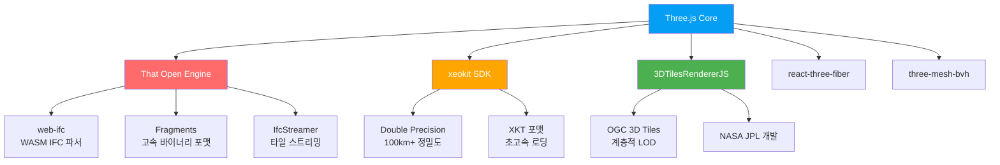
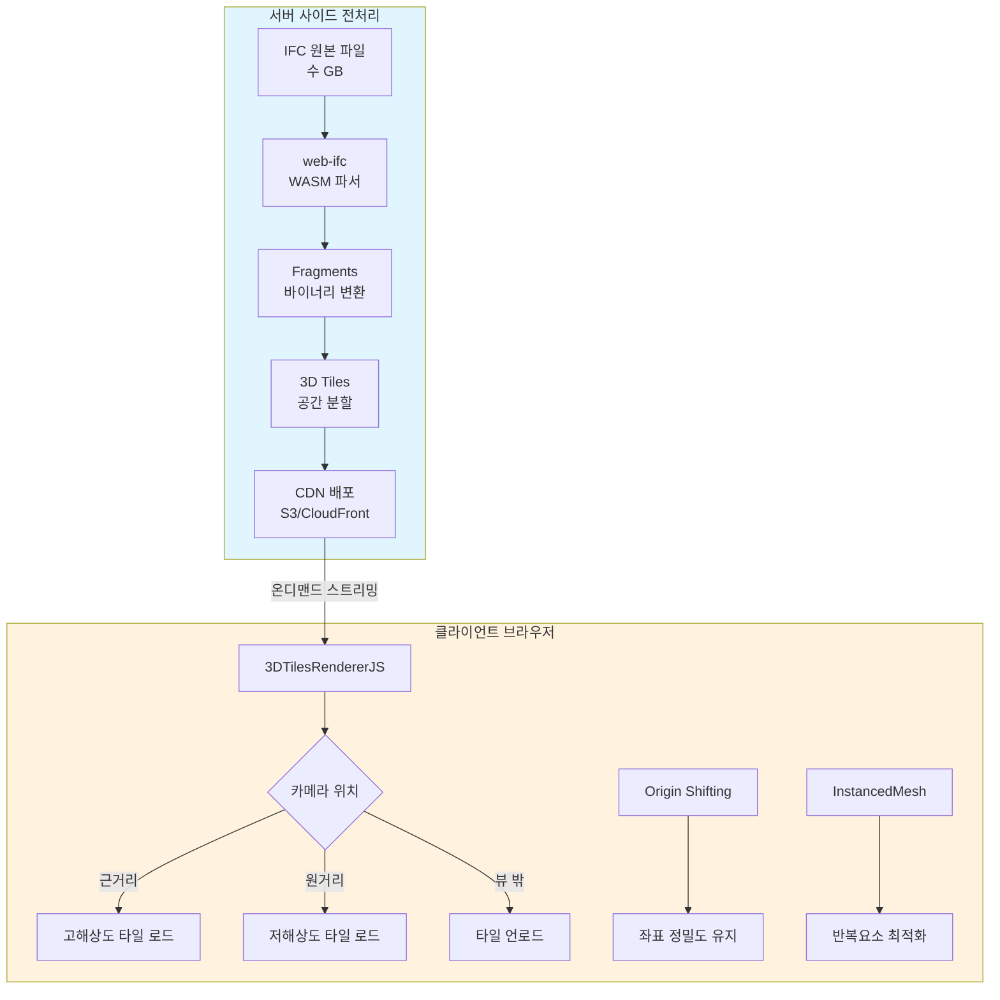
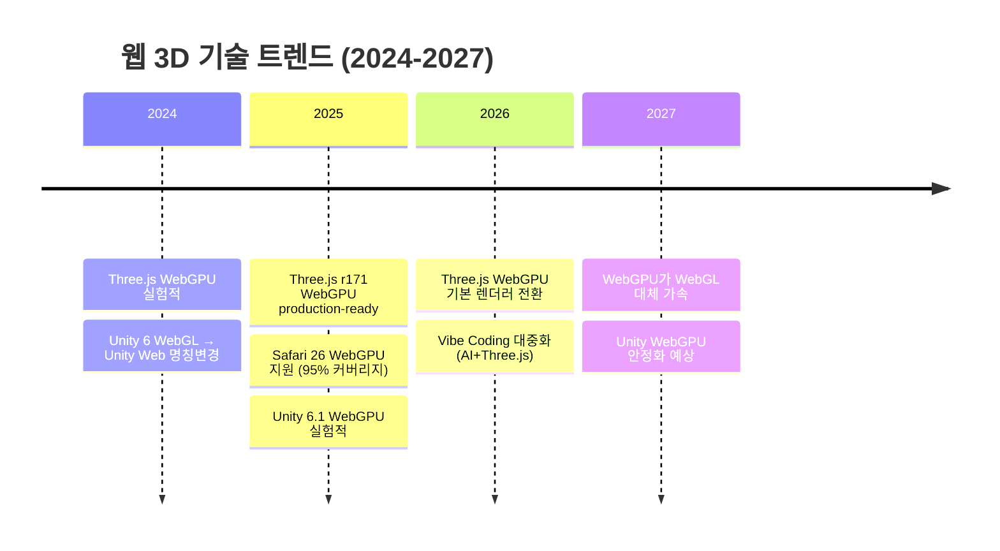

# ⚖️ 260224 Unity for Web vs Three.js : 대규모 철도 BIM 웹 렌더링 기술 비교분석

> 📝 **작성일**: 2026-02-24
> 💡 **목적**: 100km x 100km 철도 BIM 모델의 웹 브라우저 렌더링을 위한 기술 솔루션 비교
> 💡 **대상 독자**: Unity PC 개발 경험이 풍부한 BIM 개발팀 (3인)
> ✨ **핵심 질문**: 1인월(1MM) PoC에서 어떤 기술이 현실적인가?

---

## 📚 목차

1. [TL;DR - 핵심 결론](#1-tldr---핵심-결론)
2. [프로젝트 상황 분석](#2-프로젝트-상황-분석)
3. [Unity for Web 소개](#3-unity-for-web-소개)
4. [Three.js 소개](#4-threejs-소개)
5. [핵심 비교 분석](#5-핵심-비교-분석)
6. [기술 제약사항 심층 비교](#6-기술-제약사항-심층-비교)
7. [대용량 BIM 모델 처리 전략](#7-대용량-bim-모델-처리-전략)
8. [개발 생산성 비교](#8-개발-생산성-비교)
9. [채용 및 팀 확장 관점](#9-채용-및-팀-확장-관점)
10. [PoC 1인월 실현 가능성](#10-poc-1인월-실현-가능성)
11. [최종 권고사항](#11-최종-권고사항)
12. [참고자료](#12-참고자료)

---

## 📌 1. TL;DR - 핵심 결론

```
+=====================================================================+
|                                                                     |
|  결론: Three.js + That Open Engine + CesiumJS 를 권장한다            |
|                                                                     |
|  근거:                                                               |
|  1. Unity WebGL은 Task/Thread 전면 리팩터링 필요 → 1인월 불가능       |
|  2. IFC 파일을 Unity WebGL에서 직접 로딩 불가 (C++ 라이브러리 미동작) |
|  3. Three.js는 브라우저 네이티브, IFC 클라이언트 직접 파싱 가능       |
|  4. Autodesk APS(Forge) 뷰어도 Three.js 기반으로 구축됨              |
|  5. 일본 철도(JR 동일본/중앙) 실제 사례가 CesiumJS+3D Tiles 기반    |
|  6. AI 코딩 어시스턴트 활용 시 웹 개발 러닝커브 거의 없음            |
|  7. 신규 채용 시 JS 개발자 풀이 압도적으로 넓음                      |
|                                                                     |
+=====================================================================+
```

---

## 🔍 2. 프로젝트 상황 분석

### 🔹 2.1 프로젝트 요구사항

| 항목 | 내용 |
|------|------|
| **BIM 도메인** | 철도 인프라 (역사, 기계설비, 전기설비) |
| **공간 규모** | 100km x 100km |
| **PoC 기간** | 1인월 (1MM) |
| **목표** | 웹 브라우저에서 BIM 모델 로딩 + 기본 뷰어 동작 검증 |
| **데이터 특성** | 대용량, chunk streaming 필요 예상 |

### 🔹 2.2 팀 역량

```
+------------------------------------------------------------------+
|                        개발팀 역량 맵                              |
+------------------------------------------------------------------+
|                                                                    |
|  [Unity PC]  ████████████████████████████████  매우 높음 (3인 모두) |
|  [그래픽스]  ████████████████████████████████  매우 높음 (3인 모두) |
|  [Web 개발]  ██░░░░░░░░░░░░░░░░░░░░░░░░░░░░  낮음 (1인 약간)     |
|  [React/TS]  ████░░░░░░░░░░░░░░░░░░░░░░░░░░  약간 (1인)          |
|  [Claude AI] ████████████████████████████████  매우 높음           |
|                                                                    |
+------------------------------------------------------------------+
```

### 🔹 2.3 핵심 판단 포인트

이 팀의 상황에서 기술 선택 시 가장 중요한 질문들:

1. **기존 Unity PC BIM 코드를 웹으로 얼마나 재사용할 수 있는가?**
2. **웹 개발 미경험이 얼마나 큰 장벽인가?**
3. **1인월 안에 의미 있는 PoC가 가능한가?**
4. **향후 채용/확장이 용이한가?**

---

## 🧭 3. Unity for Web 소개

### 🧭 3.1 개요

Unity 6부터 "WebGL"이 **"Unity Web"**으로 공식 명칭 변경되었다. C#으로 작성된 Unity 프로젝트를 IL2CPP → C++ → Emscripten → WebAssembly로 변환하여 브라우저에서 실행하는 방식이다.

> 💡 출처: [Unity 6 updates for platforms](https://discussions.unity.com/t/unity-6-updates-for-platforms/1529798)


### 🔹 3.2 지원 버전

| Unity 버전 | WebGL 지원 상태 | 비고 |
|---|---|---|
| Unity 2022 LTS | WebGL 지원 | PWA 템플릿, 모바일 키보드 지원 |
| Unity 6 (6000.0) | **Unity Web** (명칭 변경) | WebGPU 얼리 액세스, 4GB 메모리 |
| Unity 6.3 LTS | Unity Web | 최신 LTS |

### ✅ 3.3 장점

- **기존 Unity 코드 재활용**: 이미 Unity PC 프로젝트가 있다면 이론적으로 동일 코드베이스 사용 가능
- **익숙한 개발 환경**: 팀 전원이 Unity IDE에 익숙
- **강력한 렌더링**: URP 기반 고품질 렌더링
- **내장 기능 풍부**: 물리, 애니메이션, UI 시스템 등 올인원

### ⚠️ 3.4 단점

- **번들 크기**: 빈 프로젝트도 **3~5MB** (압축 후), BIM 프로젝트는 **18~50MB**
- **메모리 제한**: WebAssembly 힙 최대 **4GB** (실질 2~3GB 권장)
- **Threading 완전 불가**: Task, Thread, ThreadPool 모두 런타임 실패
- **HDRP 불가**: URP만 지원
- **모바일 제한적**: 공식적으로 모바일 브라우저는 1차 대상 아님
- **IFC 직접 로딩 불가**: C++ IFC 라이브러리가 WebGL에서 동작하지 않음

> 💡 출처: [Unity Web Technical Limitations](https://docs.unity3d.com/6000.2/Documentation/Manual/webgl-technical-overview.html)

### 🧪 3.5 간단 예제 - Unity WebGL Hello World

```csharp
// Unity C# - WebGL에서 동작하는 간단한 BIM 뷰어 컨트롤러
using UnityEngine;

public class SimpleBIMViewer : MonoBehaviour
{
    public Camera mainCamera;
    public float rotateSpeed = 5f;
    public float zoomSpeed = 10f;

    void Update()
    {
        // 마우스 드래그로 회전
        if (Input.GetMouseButton(1))
        {
            float h = Input.GetAxis("Mouse X") * rotateSpeed;
            float v = Input.GetAxis("Mouse Y") * rotateSpeed;
            mainCamera.transform.RotateAround(
                Vector3.zero, Vector3.up, h);
            mainCamera.transform.RotateAround(
                Vector3.zero, mainCamera.transform.right, -v);
        }

        // 스크롤로 줌
        float scroll = Input.GetAxis("Mouse ScrollWheel");
        mainCamera.transform.Translate(
            Vector3.forward * scroll * zoomSpeed);
    }
}
```

### 🧪 3.6 실용 예제 - Addressables를 통한 온디맨드 로딩

```csharp
// Unity WebGL에서 대용량 BIM 모델 점진적 로딩
using UnityEngine;
using UnityEngine.AddressableAssets;
using UnityEngine.ResourceManagement.AsyncOperations;
using Cysharp.Threading.Tasks; // UniTask 사용 (WebGL 호환)
using System.Collections.Generic;

public class BIMChunkLoader : MonoBehaviour
{
    [SerializeField] private float loadDistance = 500f;
    [SerializeField] private float unloadDistance = 800f;

    private Dictionary<string, GameObject> loadedChunks = new();
    private HashSet<string> loadingChunks = new();

    // 주의: Task.Run() 사용 불가! UniTask 사용 필수
    async UniTaskVoid UpdateChunks()
    {
        while (true)
        {
            Vector3 camPos = Camera.main.transform.position;

            // 가까운 청크 로드
            foreach (var chunkId in GetNearbyChunkIds(camPos))
            {
                if (!loadedChunks.ContainsKey(chunkId)
                    && !loadingChunks.Contains(chunkId))
                {
                    loadingChunks.Add(chunkId);
                    await LoadChunkAsync(chunkId);
                }
            }

            // 먼 청크 언로드
            var toUnload = new List<string>();
            foreach (var kvp in loadedChunks)
            {
                float dist = Vector3.Distance(
                    camPos, kvp.Value.transform.position);
                if (dist > unloadDistance)
                    toUnload.Add(kvp.Key);
            }
            foreach (var id in toUnload)
                UnloadChunk(id);

            // 주의: Task.Delay() 사용 불가! UniTask.Delay() 사용
            await UniTask.Delay(500);
        }
    }

    async UniTask LoadChunkAsync(string chunkId)
    {
        // Addressables로 원격 서버에서 AssetBundle 다운로드
        var handle = Addressables.InstantiateAsync(
            $"BIM_Chunk_{chunkId}");
        await handle.ToUniTask();

        if (handle.Status == AsyncOperationStatus.Succeeded)
        {
            loadedChunks[chunkId] = handle.Result;
        }
        loadingChunks.Remove(chunkId);
    }

    void UnloadChunk(string chunkId)
    {
        if (loadedChunks.TryGetValue(chunkId, out var go))
        {
            Addressables.ReleaseInstance(go);
            loadedChunks.Remove(chunkId);
        }
    }

    List<string> GetNearbyChunkIds(Vector3 pos)
    {
        // 카메라 주변 청크 ID 계산 (그리드 기반)
        var result = new List<string>();
        int cx = Mathf.FloorToInt(pos.x / 1000f);
        int cz = Mathf.FloorToInt(pos.z / 1000f);
        for (int x = cx - 1; x <= cx + 1; x++)
        for (int z = cz - 1; z <= cz + 1; z++)
            result.Add($"{x}_{z}");
        return result;
    }
}
```

---

## 🧭 4. Three.js 소개

### 🧭 4.1 개요

Three.js는 2010년에 시작된 오픈소스 JavaScript 3D 라이브러리로, GitHub **110K+ stars**, npm **주간 540만 다운로드**를 기록하는 웹 3D 그래픽의 사실상 표준이다. 특히 **Autodesk APS(Forge) 뷰어가 Three.js 기반**으로 구축되어 있어, BIM 웹 렌더링 분야에서 검증된 기술이다.

> 💡 출처: [Three.js GitHub](https://github.com/mrdoob/three.js), [How to add Three.js features to Forge Viewer](https://aps.autodesk.com/blog/how-add-newest-threejs-features-forge-viewer)

### 🏢 4.2 BIM 생태계



### ✅ 4.3 장점

- **극소 번들 크기**: 코어 라이브러리 **~160KB** (Unity WebGL의 1/20)
- **브라우저 네이티브**: 플러그인 없이 URL만으로 즉시 접근
- **모바일 완전 지원**: iOS Safari, Android Chrome 모두 1차 지원
- **IFC 직접 파싱**: web-ifc(WASM)로 브라우저에서 네이티브급 속도 파싱
- **WebGPU production-ready**: r171(2025.9)부터 프로덕션 사용 가능
- **거대한 생태계**: npm 4,743+ 패키지, React Three Fiber 등
- **AI 코딩 최적화**: 풍부한 학습 데이터로 Claude/Copilot과 시너지 극대화

### ⚠️ 4.4 단점

- **비주얼 에디터 부재**: Unity와 달리 GUI 에디터 없음 (코드로만 작업)
- **Float32 정밀도 한계**: 100km+ 스케일에서 좌표 지터 발생 가능
- **통합 물리 엔진 없음**: cannon.js, Rapier 등 별도 라이브러리 필요
- **컴포넌트 시스템 없음**: 아키텍처를 직접 설계해야 함
- **브라우저 메모리 한계**: 탭 당 2~4GB (Unity WebGL과 유사한 한계)

### 🧪 4.5 간단 예제 - Three.js Hello BIM World

```javascript
// Three.js로 BIM 모델 로딩하기 (간단 버전)
import * as THREE from 'three';
import { OrbitControls } from 'three/addons/controls/OrbitControls.js';
import { IFCLoader } from 'web-ifc-three';

// 씬 기본 설정
const scene = new THREE.Scene();
scene.background = new THREE.Color(0xf0f0f0);

const camera = new THREE.PerspectiveCamera(
  60, window.innerWidth / window.innerHeight, 0.1, 10000
);
camera.position.set(50, 30, 50);

const renderer = new THREE.WebGLRenderer({ antialias: true });
renderer.setSize(window.innerWidth, window.innerHeight);
renderer.shadowMap.enabled = true;
document.body.appendChild(renderer.domElement);

// 조명
const ambientLight = new THREE.AmbientLight(0xffffff, 0.5);
scene.add(ambientLight);
const dirLight = new THREE.DirectionalLight(0xffffff, 1);
dirLight.position.set(50, 50, 50);
dirLight.castShadow = true;
scene.add(dirLight);

// 카메라 컨트롤 (OrbitControls = Unity의 Orbital Camera와 유사)
const controls = new OrbitControls(camera, renderer.domElement);
controls.enableDamping = true;

// IFC 파일 로딩 (브라우저에서 직접!)
const ifcLoader = new IFCLoader();
await ifcLoader.ifcManager.setWasmPath('wasm/');
const model = await ifcLoader.loadAsync('/models/building.ifc');
scene.add(model);

// 렌더 루프 (Unity의 Update()와 유사)
function animate() {
  requestAnimationFrame(animate);
  controls.update();
  renderer.render(scene, camera);
}
animate();
```

### 🧪 4.6 실용 예제 - That Open Engine BIM 뷰어

```typescript
// That Open Engine으로 풀 BIM 뷰어 구축 (실전 코드)
import * as OBC from '@thatopen/components';
import * as OBCF from '@thatopen/components-front';

// 1. 컴포넌트 시스템 초기화
const components = new OBC.Components();

// 2. 3D 뷰포트 생성 (Three.js Scene/Camera/Renderer 자동 설정)
const worlds = components.get(OBC.Worlds);
const world = worlds.create<
  OBC.SimpleScene,
  OBC.SimpleCamera,
  OBCF.PostproductionRenderer
>();

const container = document.getElementById('viewer-container')!;
world.scene = new OBC.SimpleScene(components);
world.renderer = new OBCF.PostproductionRenderer(components, container);
world.camera = new OBC.SimpleCamera(components);

components.init();

// 3. 그리드 추가
const grids = components.get(OBC.Grids);
grids.create(world);

// 4. IFC 파일 로딩 (클라이언트 사이드 WASM 파싱)
const ifcLoader = components.get(OBC.IfcLoader);
await ifcLoader.setup();

// 파일 입력 이벤트 처리
const input = document.getElementById('ifc-input') as HTMLInputElement;
input.addEventListener('change', async (e) => {
  const file = (e.target as HTMLInputElement).files?.[0];
  if (!file) return;

  const buffer = await file.arrayBuffer();
  const data = new Uint8Array(buffer);
  const model = await ifcLoader.load(data);
  world.scene.three.add(model);
});

// 5. 오브젝트 피킹 (클릭하면 BIM 속성 표시)
const highlighter = components.get(OBCF.Highlighter);
highlighter.setup({ world });

highlighter.events.select.onHighlight.add((fragmentIdMap) => {
  // IFC 속성 조회
  const propsProcessor = components.get(OBC.IfcPropertiesProcessor);
  for (const [fragID, expressIDs] of Object.entries(fragmentIdMap)) {
    for (const id of expressIDs) {
      const props = propsProcessor.getProperties(model, id);
      console.log('BIM Properties:', props);
      // UI에 속성 표시
      displayProperties(props);
    }
  }
});

// 6. 단면 절단 (Section Cut)
const clipper = components.get(OBC.Clipper);
clipper.enabled = true;
// 더블클릭으로 절단면 생성
container.addEventListener('dblclick', () => clipper.create(world));

// 7. 치수 측정
const dimensions = components.get(OBCF.LengthMeasurement);
dimensions.world = world;
dimensions.enabled = true;
```

### 🧪 4.7 React Three Fiber 예제 (React 개발자용)

```tsx
// React Three Fiber로 BIM 모델 뷰어 (React 경험이 있다면 이것이 가장 빠름)
import { Canvas } from '@react-three/fiber';
import { OrbitControls, Environment, Stats } from '@react-three/drei';
import { Suspense, useState } from 'react';
import { IFCModel } from './components/IFCModel';

function BIMViewer() {
  const [selectedId, setSelectedId] = useState<number | null>(null);

  return (
    <div className="w-full h-screen">
      <Canvas
        camera={{ position: [50, 30, 50], fov: 60 }}
        shadows
      >
        <ambientLight intensity={0.5} />
        <directionalLight position={[50, 50, 50]} castShadow />

        <Suspense fallback={<LoadingSpinner />}>
          <IFCModel
            url="/models/station.ifc"
            onSelect={(id) => setSelectedId(id)}
          />
        </Suspense>

        <OrbitControls enableDamping />
        <Environment preset="city" />
        <Stats /> {/* FPS 모니터 */}
      </Canvas>

      {/* BIM 속성 패널 - 그냥 HTML/CSS! */}
      {selectedId && (
        <div className="absolute top-4 right-4 bg-white p-4 rounded shadow">
          <PropertyPanel elementId={selectedId} />
        </div>
      )}
    </div>
  );
}
```

---

## ⚖️ 5. 핵심 비교 분석

### ⚖️ 5.1 한눈에 보는 비교표

| 항목 | Unity for Web | Three.js |
|------|:---:|:---:|
| **번들 크기 (빈 프로젝트)** | 3~5 MB | ~160 KB |
| **BIM 프로젝트 번들** | 18~50 MB | 0.5~2 MB |
| **첫 방문 로딩 시간** | 15~60초 | 1~3초 |
| **모바일 브라우저** | 제한적 | 완전 지원 |
| **IFC 직접 로딩** | 불가 | 가능 (WASM) |
| **Threading** | 완전 불가 | Web Worker 지원 |
| **WebGPU** | 실험적 | production-ready |
| **메모리 한계** | 4GB (WASM) | 4GB (브라우저) |
| **렌더링 품질** | URP (높음) | 커스텀 (자유도 높음) |
| **IDE/에디터** | Unity Editor | 없음 (코드 전용) |
| **물리 엔진** | PhysX 내장 | 별도 라이브러리 |
| **배포** | 서버 MIME 설정 필요 | 정적 호스팅 (Vercel) |
| **라이선스 비용** | PiXYZ $2,700+/년 | 무료 (MIT) |
| **커뮤니티 (웹 3D)** | 소규모 | 110K+ stars |

> 💡 출처: [Needle Tools Comparison](https://cloud.needle.tools/compare/needle-vs-threejs-vs-unity-webgl), [UnityWebGL-LoadingTest](https://github.com/JohannesDeml/UnityWebGL-LoadingTest)

### ⚡ 5.2 렌더링 성능 비교

| 영역 | Unity for Web | Three.js (WebGL2) | Three.js (WebGPU) |
|------|---|---|---|
| GPU 렌더링 | 네이티브 근접 | 네이티브 근접 | **2~10x 향상** |
| CPU 연산 (싱글스레드) | 네이티브 50~70% | 네이티브 동등 | 네이티브 동등 |
| CPU 멀티스레드 | **불가** | Web Worker | Compute Shader |
| Draw Call 오버헤드 | IL2CPP→WASM→WebGL | JS→WebGL (낮음) | 멀티스레드 디스패치 |
| 대형 모델 한계 | ~500K 삼각형 | ~500MB | 500MB+ |

> 💡 출처: [Unity Web Performance](https://docs.unity3d.com/Manual/webgl-performance.html), [Three.js vs WebGPU](https://altersquare.io/three-js-vs-webgpu-construction-3d-viewers-scale-beyond-500mb/)

### ⚖️ 5.3 번들 크기 비교 시각화

```
번들 크기 비교 (Brotli 압축 후)

Three.js (core)     : ██ 160KB
Three.js (BIM app)  : ████████████ 1.5MB
Unity (Built-in RP) : ████████████████████████████ 3.4MB
Unity (URP)         : ████████████████████████████████████████████████████ 6.3MB
Unity (BIM project) : ████████████████████████████████████████████████████████████████████████ 30MB+

              0     2     4     6     8    10    15    20    25    30 MB
```

---

## ⚖️ 6. 기술 제약사항 심층 비교

### 🔹 6.1 Unity WebGL: Task, UniTask, Thread 제약

이것이 기존 PC 프로젝트 포팅에서 **가장 큰 장벽**이다.

#### 💻 Threading API 호환성 매트릭스

| API / 기능 | WebGL 동작 | 실패 유형 |
|---|---|---|
| `System.Threading.Thread` | **불가** | 빌드 성공, 런타임 미동작 |
| `System.Threading.ThreadPool` | **불가** | 작업 큐잉되나 실행 안됨 |
| `Task.Run()` | **불가** | ThreadPool 디스패치 → 실패 |
| `Task.Delay()` | **불가** | Timer 미트리거 → 영원히 대기 |
| `ConfigureAwait(false)` | **불가** | continuation 자체가 사라짐 |
| `Parallel.For/ForEach` | **불가** | ThreadPool 의존 |
| `async/await` (기본) | **부분** | SynchronizationContext 기반 단일 스레드 |
| **UniTask** | **동작** | PlayerLoop 기반, 스레드 미사용 |
| **Unity 6 Awaitable** | **동작** | Task의 WebGL 대체 |
| **Coroutine** | **동작** | 가장 안정적 |

> 💡 출처: [Async/await and WebGL builds](https://discussions.unity.com/t/async-await-and-webgl-builds/665972), [Using Async in WebGL](https://discussions.unity.com/t/using-async-in-webgl-awaitable-as-a-substitute-for-system-threading-tasks/1682470)

#### ▫️ 핵심 위험: "빌드는 되지만 런타임에 조용히 실패한다"

```csharp
// 이 코드는 PC에서 완벽하게 동작하지만, WebGL에서는...
public async Task LoadBIMModel(string path)
{
    // ❌ Task.Run: ThreadPool에 디스패치 → WebGL에서 실행 안됨
    var meshData = await Task.Run(() => ParseIFC(path));

    // ❌ ConfigureAwait(false): continuation이 사라짐
    var optimized = await OptimizeMesh(meshData)
        .ConfigureAwait(false);  // 이 이후 코드가 실행되지 않음!

    // ❌ Task.Delay: Timer 미트리거 → 무한 대기
    await Task.Delay(100);  // 브라우저 탭이 응답 불능

    // 여기까지 도달하지 못함
    ApplyToScene(optimized);
}
```

**에러 메시지 없이** 코드가 멈추기 때문에, 디버깅이 극도로 어렵다.

#### 🧪 기존 PC 코드 포팅 시 발생하는 문제

```
기존 PC BIM 프로젝트 코드 분석

[IFC 파싱 모듈]
  └── Task.Run()으로 백그라운드 파싱  ─────── ❌ WebGL 불가
  └── Thread로 메시 생성              ─────── ❌ WebGL 불가

[네트워크 모듈]
  └── System.Net.Sockets              ─────── ❌ 완전 불가
  └── TCP/UDP 직접 소켓               ─────── ❌ 완전 불가

[파일 I/O 모듈]
  └── System.IO.File                  ─────── ❌ 로컬 파일 접근 불가
  └── FileStream                      ─────── ❌ 완전 불가

[렌더링 모듈]
  └── HDRP 사용 중이라면              ─────── ❌ URP로 전면 교체 필요
  └── URP 사용 중이라면               ─────── ✅ 호환

[비동기 처리]
  └── UniTask만 사용                  ─────── ✅ 동작
  └── Task + UniTask 혼용             ─────── ⚠️ Task 부분만 실패
  └── Task.Run() 내부의 UniTask       ─────── ❌ 전체 실패
```

#### ▫️ 워크어라운드: 플랫폼 분기

```csharp
// #if 전처리기로 플랫폼 분기 (가능하지만 코드 복잡도 증가)
public async UniTask LoadModelAsync(byte[] data)
{
#if UNITY_WEBGL && !UNITY_EDITOR
    // WebGL: 프레임 분산 처리 (단일 스레드)
    var mesh = new Mesh();
    int batchSize = 1000;
    for (int i = 0; i < vertices.Length; i += batchSize)
    {
        ProcessBatch(vertices, i, batchSize, mesh);
        await UniTask.Yield(); // 프레임 양보
    }
#else
    // PC: 멀티스레드 병렬 처리
    var mesh = await Task.Run(() => ProcessAllVertices(vertices));
#endif
    ApplyMesh(mesh);
}
```

> 💡 출처: [WebGLThreadingPatcher](https://github.com/VolodymyrBS/WebGLThreadingPatcher), [So you want to use multithreading in Unity WebGL](https://medium.com/@willymunoz/ditching-playcanvas-babylon-js-three-js-for-unity-webgl-my-game-changing-decision-e5184cb306cb)

### 🔹 6.2 Unity WebGL: 기타 제약사항

| 영역 | 제한 사항 |
|------|----------|
| **파일 I/O** | 로컬 파일 시스템 접근 완전 불가 |
| **네트워킹** | System.Net 불가, UnityWebRequest + WebSocket만 가능 |
| **오디오** | FMOD 불가, Web Audio API 기본 기능만 |
| **렌더 파이프라인** | **HDRP 완전 불가**, URP만 지원 |
| **네이티브 플러그인** | Windows DLL 불가, Emscripten 컴파일만 |
| **Reflection.Emit** | AOT 플랫폼이므로 불가 |
| **디버깅** | Visual Studio 미지원, 브라우저 DevTools만 |
| **빌드 시간** | PC 대비 수 배 느림 |

> 💡 출처: [Unity Web Technical Limitations](https://docs.unity3d.com/6000.2/Documentation/Manual/webgl-technical-overview.html)

### 🔹 6.3 Three.js: 제약사항

Three.js는 Unity WebGL만큼 심각한 제약은 없지만, 몇 가지 주의점이 있다.

| 영역 | 제한 사항 | 해결책 |
|------|----------|--------|
| **Float32 정밀도** | 100km+ 좌표에서 지터 발생 | Origin Shifting 또는 xeokit 사용 |
| **메모리** | 브라우저 탭 2~4GB | 스트리밍/LOD 필수 |
| **비주얼 에디터** | GUI 에디터 없음 | AI 코딩 + lil-gui 디버그 UI |
| **물리 엔진** | 내장 없음 | cannon.js, Rapier (BIM에는 불필요) |
| **싱글 스레드 JS** | 메인 스레드 블로킹 위험 | Web Worker + OffscreenCanvas |
| **학습 곡선** | JS/웹 생태계 학습 필요 | Claude Code로 대폭 완화 |

### ✅ 6.4 Three.js의 특별한 장점

Unity WebGL에는 없는 Three.js만의 강점들:

1. **즉각적 배포**: `npm run build` → Vercel/Netlify에 드래그 앤 드롭 → URL 공유. 설치 없이 클라이언트 접근 가능
2. **Hot Module Replacement**: 코드 수정 → 브라우저 자동 반영 (Unity WebGL은 매번 빌드 필요)
3. **웹 표준 UI**: HTML/CSS로 UI 구성 → 풍부한 BIM 속성 패널, 모델 트리 등 구현 용이
4. **IFC 클라이언트 파싱**: web-ifc (WASM)로 서버 없이 브라우저에서 직접 IFC 파싱
5. **점진적 향상**: WebGPU 지원 브라우저면 자동 활용, 미지원이면 WebGL2로 폴백

---

## 🏢 7. 대용량 BIM 모델 처리 전략

### 🏢 7.1 100km x 100km 철도 BIM의 과제

이 규모의 BIM은 어떤 기술을 사용하든 **한 번에 전체를 로딩하는 것은 불가능**하다. 핵심은 **얼마나 효율적으로 스트리밍하느냐**이다.

```
100km x 100km 철도 BIM 데이터 구조 (예상)

Level 0: 전체 철도 노선 (100km 축척)
  ├── 지형 메시 + 항공사진 텍스처
  ├── 노선 중심선 (polyline)
  └── 역사 위치 마커 (point)

Level 1: 구간별 (10km 단위)
  ├── 트랙 상세 (레일, 침목)
  ├── 가공전차선 (전기설비)
  └── 신호기 위치

Level 2: 역사 단위 (1km 반경)
  ├── 건축 BIM (구조체, 마감)
  ├── 기계설비 (덕트, 배관)
  └── 전기설비 (케이블트레이, 분전반)

Level 3: 룸/구역 단위 (100m 반경)
  ├── 개별 장비 상세 모델
  ├── 부재별 속성 데이터
  └── 유지보수 정보

예상 데이터 크기:
  - 전체 IFC: 수 GB ~ 수십 GB
  - 최적화 후 웹용: 수백 MB ~ 수 GB
  - 한 번에 브라우저 렌더링 가능: ~500MB (최적화 시)
```

### 🔹 7.2 Three.js 진영의 스트리밍 전략



#### ▫️ 핵심 라이브러리별 역할

| 라이브러리 | 역할 | 스트리밍 지원 |
|---|---|---|
| **That Open Engine** | IFC 파싱 + BIM 도구 | IfcStreamer (타일 기반) |
| **3DTilesRendererJS** | 계층적 LOD 스트리밍 | OGC 3D Tiles 표준 |
| **CesiumJS** | 글로벌 지형 + 3D Tiles | 100km+ 스케일에 최적 |
| **xeokit** | BIM 전용 WebGL 엔진 | XKT 포맷 + Double Precision |

> 💡 출처: [3DTilesRendererJS](https://github.com/NASA-AMMOS/3DTilesRendererJS), [That Open Docs](https://docs.thatopen.com/Tutorials/Components/Core/IfcLoader), [xeokit SDK](https://xeokit.io/)

### 🔹 7.3 Unity WebGL 진영의 스트리밍 전략

```
Unity WebGL에서의 대형 BIM 로딩 파이프라인

[1단계: 서버 전처리 (필수)]
  IFC → IfcConvert/IfcOpenShell → glTF 2.0 + JSON 메타데이터
  └── LOD 0 (원본), LOD 1 (50%), LOD 2 (25%), LOD 3 (바운딩박스)
  └── 구역별 AssetBundle 분리
  └── LZ4 압축 (LZMA는 WebGL 미지원!)

[2단계: Addressables 기반 로딩]
  └── 원격 서버에서 AssetBundle 다운로드
  └── IndexedDB 브라우저 캐싱
  └── 카메라 거리 기반 LOD 전환

[3단계: 메모리 관리]
  └── 4GB 한계 내 운용
  └── 비가시 구역 적극 언로드
  └── NativeArray<T>로 GC 부담 감소
  └── GC는 프레임당 1회만 → 루프 내 임시할당 최소화
```

#### ⚖️ 결정적 차이: IFC 직접 파싱

| | Unity WebGL | Three.js |
|---|---|---|
| IFC 클라이언트 파싱 | **불가** (C++ IFC 라이브러리 미동작) | **가능** (web-ifc WASM) |
| 필수 전처리 | IFC → glTF/FBX 서버 변환 필수 | 선택적 (직접 파싱 또는 사전 변환) |
| 변환 파이프라인 구축 | 1~2주 소요 | 불필요 (클라이언트 직접) |
| 메타데이터 보존 | 변환 과정에서 손실 위험 | IFC 원본 메타데이터 완전 보존 |

> 💡 출처: [IFC Importing Unity Discussion](https://discussions.unity.com/t/ifc-importing/1538992), [Getting BIM data into Unity Part 8](http://cad-3d.blogspot.com/2018/08/getting-bim-data-into-unity-part-8.html)

### 🏢 7.4 실제 철도 BIM 사례: CesiumJS + 3D Tiles

가장 유사한 실제 프로덕션 사례들이 **모두 CesiumJS + 3D Tiles** 기반이다.

#### ▫️ TRANCITY (일본 JR 동일본/중앙 철도)

| 항목 | 내용 |
|------|------|
| **기술 스택** | CesiumJS + Cesium ion + 3D Tiles |
| **고객** | JR 동일본, JR 중앙 |
| **데이터 파이프라인** | 영상 → SfM 3D 생성 → 3D Tiles → CesiumJS 뷰어 |
| **규모** | 철도, 도로, 하천, 항만, 발전소 인프라 |
| **접근** | PC, 태블릿, 스마트폰 브라우저 |
| **핵심 성과** | 위험한 야간 교량 점검 제거 (JR 중앙) |

> 💡 출처: [TRANCITY uses Cesium for Japanese Railway](https://cesium.com/blog/2024/11/19/trancity-uses-cesium-to-manage-japanese-railway-projects/)

#### ▫️ WSB Engineering (미국 인프라)

| 항목 | 내용 |
|------|------|
| **기술 스택** | Bentley iTwin + CesiumJS + 3D Tiles |
| **규모** | 72개 프로젝트, 900+ 외부 이해관계자 |
| **사용** | 철도 교량 건설 가능성 검토 |

> 💡 출처: [WSB Transforms Constructability Reviews](https://cesium.com/blog/2025/12/04/wsb-transforms-constructability-reviews/)

### 🔹 7.5 100km 스케일 좌표 정밀도 문제

Three.js(WebGL)의 Float32는 약 7자리 유효 숫자만 제공한다. 100km(100,000m) 스케일에서는 **1mm 이하 정밀도를 유지할 수 없다**.

#### ⚖️ 해결 방법 비교

| 방법 | 적용 기술 | 정밀도 | 구현 난이도 |
|------|----------|--------|-----------|
| **Origin Shifting** | Three.js | 실용적 충분 | 중간 |
| **Double Precision** | xeokit | mm 단위 완전 | 없음 (내장) |
| **3D Tiles 계층 LOD** | CesiumJS | 타일별 로컬 좌표 | 낮음 (자동) |
| **Relative Coordinates** | Autodesk APS | 높음 | 높음 |

```javascript
// Origin Shifting 구현 (Three.js)
function updateOrigin(camera, worldGroup) {
  const threshold = 10000; // 10km 이동 시 원점 재설정
  if (camera.position.length() > threshold) {
    const offset = camera.position.clone();
    worldGroup.position.sub(offset);
    camera.position.set(0, 0, 0);
    // 카메라를 항상 원점 근처에 유지 → Float32 정밀도 문제 방지
  }
}
```

---

## ⚖️ 8. 개발 생산성 비교

### ⚖️ 8.1 에디터 환경 비교

```
Unity                                    Three.js
┌──────────────────────────┐            ┌──────────────────────────┐
│  [Scene View]  [Game]    │            │  [VS Code]               │
│  ┌──────────┐ ┌────────┐│            │  ┌──────────────────────┐│
│  │ 드래그앤  │ │ 실시간 ││            │  │ 코드 에디터          ││
│  │ 드롭으로  │ │ 프리뷰 ││            │  │ + AI 코드 생성       ││
│  │ 배치/회전 │ │        ││            │  │                      ││
│  └──────────┘ └────────┘│            │  └──────────────────────┘│
│  [Hierarchy] [Inspector] │            │  [브라우저 DevTools]     │
│  ┌────────┐  ┌─────────┐│            │  ┌──────────────────────┐│
│  │ 씬 트리 │  │ 컴포넌트││            │  │ Console + 3D 인스펙터││
│  │ + 선택  │  │ 속성    ││            │  │ + Spector.js         ││
│  └────────┘  └─────────┘│            │  └──────────────────────┘│
│                          │            │                          │
│  장점: 시각적 편집       │            │  장점: Hot Reload,       │
│  단점: WebGL 빌드 느림   │            │  AI가 에디터 역할 대체   │
└──────────────────────────┘            └──────────────────────────┘
```

### ⚖️ 8.2 개발 사이클 비교

| 작업 | Unity WebGL | Three.js |
|------|---|---|
| 환경 설정 | 30분 (Unity Hub) | **5분** (npm init + vite) |
| Hello World | 5분 | 15분 (첫 경험) |
| BIM 모델 로딩 | 2~4시간 (에셋 변환 필요) | **1~2시간** (IFC 직접) |
| 코드 수정 → 확인 | **수 분** (WebGL 빌드) | **< 1초** (HMR) |
| 카메라 컨트롤 | 30분 (스크립트) | **5분** (OrbitControls) |
| UI 구현 | 2~4시간 (uGUI) | **30분** (HTML/CSS) |
| 배포 | 1~2시간 (서버 설정) | **10분** (Vercel) |
| **전체 프로토타입** | **1~2주** | **3~5일** (AI 활용 시) |

### 🔹 8.3 AI 코딩 어시스턴트와의 시너지

2025년 기준 개발자의 **90%**가 AI 코딩 어시스턴트를 사용하고 있으며, Three.js는 "Vibe Coding"에 특히 적합하다.

> 💡 출처: [Vibe Coding - Wikipedia](https://en.wikipedia.org/wiki/Vibe_coding), [AI Coding ROI 2025](https://www.index.dev/blog/ai-coding-assistants-roi-productivity)

#### ▫️ Three.js가 AI 코딩에 적합한 이유

1. **풍부한 학습 데이터**: GitHub 110K+ stars, 수만 개의 예제 프로젝트
2. **즉각적 시각 피드백**: 코드 생성 → 브라우저 새로고침 → 바로 확인
3. **웹 표준 기술**: HTML/CSS/JS는 AI 모델이 가장 잘 학습한 영역
4. **모듈화된 구조**: AI가 독립적인 컴포넌트를 생성하기 쉬움

#### ⚠️ Unity WebGL에서 AI 활용의 한계

1. Unity 에디터 조작은 AI가 대신할 수 없음 (코드만 생성 가능)
2. WebGL 빌드 시간이 길어 반복 테스트 사이클이 느림
3. WebGL 특유의 "조용한 실패" 디버깅에 AI가 제한적

#### ▫️ 팀 상황에서의 현실적 시나리오

```
시나리오: "IFC 파일을 로딩하고 클리핑 플레인으로 단면을 보고 싶다"

[Unity WebGL 경로]
  1. IFC를 glTF로 변환하는 서버 파이프라인 구축 (3일)
  2. Unity에서 glTF 로더 설정 (1일)
  3. 클리핑 셰이더 구현 (1일)
  4. WebGL 빌드 + 디버깅 (2일)
  총: ~7일

[Three.js + Claude Code 경로]
  1. Claude Code에게 "That Open Engine으로 IFC 뷰어 만들어줘" (30분)
  2. 자동 생성된 코드에 파일 드래그앤드롭 추가 (1시간)
  3. Clipper 컴포넌트 활성화 (10분 - 이미 내장)
  4. Vercel 배포 (10분)
  총: ~2시간
```

---

## 📌 9. 채용 및 팀 확장 관점

### ⚖️ 9.1 개발자 풀 비교

| 지표 | Three.js / WebGL | Unity (WebGL 포함) |
|------|-----------------|-------------------|
| **글로벌 개발자 풀** | JS 3,000만+ 중 일부 | Unity 등록 500만+ |
| **"Unity WebGL + BIM" 전문가** | - | **극소수** |
| **"Three.js + BIM" 전문가** | 성장 중 | - |
| **전환 가능 개발자** | 시니어 JS 개발자 → Three.js 학습 용이 | Unity 개발자가 WebGL 전문화는 드뭄 |
| **평균 연봉 (미국)** | $100K~$150K | $106K (범위 $39K~$260K) |

> 💡 출처: [ZipRecruiter Three.js Jobs](https://www.ziprecruiter.com/Jobs/Three-Js), [Unity Developer Salary 2025](https://qubit-labs.com/average-unity-developer-salary-in-the-us-and-world/)

### 🔹 9.2 장기 기술 트렌드



### 🔹 9.3 채용 관점 결론

**Three.js를 선택하면**:
- 기존 JS/React 개발자를 채용 → Three.js 학습 (비교적 쉬움)
- 프론트엔드 풀스택 역량도 함께 확보
- BIM 웹 뷰어 관련 오픈소스 기여/활용 용이

**Unity WebGL을 선택하면**:
- "Unity + WebGL + BIM" 삼중 역량을 가진 인재는 매우 희소
- 기존 Unity 개발자도 WebGL 경험이 없으면 학습 곡선 존재
- Unity 생태계에 갇힐 수 있음 (vendor lock-in)

---

## 📌 10. PoC 1인월 실현 가능성

### 🔹 10.1 Three.js 경로: 4주 계획

```
Week 1: 기반 구축
├── Day 1-2: Vite + Three.js + TypeScript 프로젝트 설정
│            That Open Engine 통합
│            (Claude Code 활용: ~2시간)
├── Day 3:   IFC 파일 클라이언트 로딩 구현
├── Day 4:   OrbitControls, 줌, 팬 카메라 컨트롤
└── Day 5:   기본 조명, 그림자, 환경맵

Week 2: BIM 기능
├── Day 6-7: 오브젝트 피킹 + IFC 속성 패널 (HTML/CSS)
├── Day 8:   클리핑 플레인 (단면 절단)
├── Day 9:   모델 트리 네비게이션 (IFC Spatial Structure)
└── Day 10:  기본 치수 측정 도구

Week 3: 인프라 특화
├── Day 11-12: CesiumJS 또는 평면 지형 위에 모델 배치
│              100km 스케일 테스트
├── Day 13:    멀티 모델 로딩 (지형 + 역사 + 트랙)
├── Day 14:    LOD + Frustum Culling 최적화
└── Day 15:    Origin Shifting (대형 좌표 처리)

Week 4: 마무리
├── Day 16-17: React UI 프레임워크 통합
│              (모델 리스트, 검색, 필터)
├── Day 18:    성능 최적화 (Instancing, Batching)
├── Day 19:    Vercel/Netlify 배포 + 데모 준비
└── Day 20:    문서화 + 데모 시연

예상 완성도: 70~80% (PoC로서 충분)
```

#### ▫️ 사용할 스타터 리소스

| 리소스 | 설명 | URL |
|--------|------|-----|
| That Open Engine Tutorials | 공식 BIM 컴포넌트 튜토리얼 | [docs.thatopen.com](https://docs.thatopen.com/Tutorials/Components/Core/IfcLoader) |
| web-ifc-viewer | 완성형 BIM 뷰어 툴킷 | [GitHub](https://github.com/ThatOpen/web-ifc-viewer) |
| bim-viewer | Three.js + Vue BIM 뷰어 | [GitHub](https://github.com/egghunters/bim-viewer) |

### 🔹 10.2 Unity WebGL 경로: 4주 계획

```
Week 1: 기반 구축 + 변환 파이프라인
├── Day 1-2: Unity 6 프로젝트 생성, WebGL 빌드 타겟 설정
│            첫 번째 WebGL 빌드 테스트
├── Day 3-5: ❗ IFC → glTF 변환 파이프라인 구축 (서버 사이드)
│            IfcConvert 설치, 배치 변환 스크립트
│            메타데이터 추출 (JSON)
│            ← 이것만으로 1주일 소요 가능

Week 2: BIM 기능 (변환 파이프라인 완성 전제)
├── Day 6-7: glTF 로더 + 카메라 컨트롤
├── Day 8:   오브젝트 선택 (변환 시 메타데이터 손실 위험)
├── Day 9:   단면 절단 셰이더
└── Day 10:  ❗ WebGL 빌드 디버깅 (Runtime silent failures)

Week 3: 인프라 특화
├── Day 11-12: 지형 메시 임포트 + 카메라 플라이스루
├── Day 13:    멀티 모델 로딩 (Addressables 설정)
├── Day 14:    ❗ WebGL 빌드 크기 최적화 (>100MB 위험)
└── Day 15:    ❗ 메모리 이슈 디버깅 (4GB 한계)

Week 4: 최적화 + 배포
├── Day 16-17: Threading 코드 리팩터링 (만약 기존 코드 사용 시)
├── Day 18:    크로스 브라우저 테스트
├── Day 19:    웹 서버 설정 (WASM MIME 타입)
└── Day 20:    ❗ 모바일 호환성 이슈 대응

예상 완성도: 40~50% (PoC로서 부족할 수 있음)
❗ 표시: 예상치 못한 이슈로 일정 지연 가능성이 높은 작업
```

### ⚠️ 10.3 리스크 비교

| 리스크 요인 | Three.js | Unity WebGL |
|------------|:---:|:---:|
| IFC 로딩 | 낮음 | **높음** (변환 필수) |
| 빌드 크기 | 낮음 (1~2MB) | **중간** (8~50MB) |
| 모바일 테스트 | 낮음 | **중간** |
| 디버깅 사이클 | 빠름 (HMR) | **느림** (빌드 수 분) |
| 성능 튜닝 | 중간 | **높음** |
| 배포 | 간단 (정적 호스팅) | 중간 (WASM 설정) |
| 커뮤니티 도움 | 높음 (BIM 리소스 풍부) | **낮음** |
| 비용 | 무료 | PiXYZ $2,700+/년 |
| **총 리스크** | **낮음** | **높음** |

### 🧪 10.4 기존 Unity PC 코드 재사용 가능성

"기존 대규모 BIM PC 프로젝트 코드를 WebGL로 사용할 수 있을지"에 대한 현실적 답변:

```
기존 코드 재사용 가능성 분석

[재사용 가능한 코드]
  └── 순수 데이터 모델 (POCO 클래스)          ~20%
  └── 수학/유틸리티 함수                       ~10%
  └── UniTask 기반 비동기 코드 (조건부)        ~10%

[리팩터링 필요한 코드]
  └── Task/Thread 사용 비동기 코드             ~20%
  └── 네트워킹 모듈                            ~10%
  └── 파일 I/O 모듈                            ~10%

[완전 재작성 필요한 코드]
  └── IFC 파싱/로딩 모듈                       ~15%
  └── HDRP 의존 렌더링 코드 (해당 시)          ~??%
  └── 네이티브 플러그인 의존 코드               ~5%

결론: 최적의 경우에도 ~40%만 재사용 가능
      HDRP 사용 시 재사용률 더욱 감소
```

#### ▫️ 포팅 기간 현실적 추정

| 시나리오 | Threading 리팩터링 | 파이프라인 재설계 | 렌더링 교체 | 테스트 | **합계** |
|---|---|---|---|---|---|
| URP + UniTask 주력 | 4~8주 | 3~6주 | - | 2~4주 | **3~6개월** |
| URP + Task 혼용 | 4~8주 | 3~6주 | - | 2~4주 | **3~6개월** |
| HDRP 사용 | 4~8주 | 3~6주 | 4~12주 | 2~4주 | **6~12개월** |

> 💡 출처: [4 Limitations of WebGL for Real-Time 3D](https://www.pureweb.com/news-updates/4-limitations-of-webgl-for-publishing-real-time-3d/)

---

## 📌 11. 최종 권고사항

### 🔹 11.1 PoC 기술 선택: Three.js + That Open Engine + CesiumJS

```
+=====================================================================+
|                                                                     |
|  권고 아키텍처: 철도 BIM 웹 뷰어 PoC                                |
|                                                                     |
|  ┌─────────────────────────────────────────────────────────────┐    |
|  │                    웹 브라우저                                │    |
|  │                                                              │    |
|  │  ┌──────────────┐  ┌───────────────────────────────────┐    │    |
|  │  │  UI Layer    │  │  3D Rendering Layer                │    │    |
|  │  │  (React +    │  │                                    │    │    |
|  │  │   Tailwind)  │  │  CesiumJS        Three.js          │    │    |
|  │  │              │  │  (지형 + 100km   (BIM 상세모델      │    │    |
|  │  │  - 모델 트리 │  │   스케일 컨텍스트) at 건물 스케일)  │    │    |
|  │  │  - 속성 패널 │  │                                    │    │    |
|  │  │  - 검색      │  │  ← 3D Tiles 스트리밍 →             │    │    |
|  │  │  - 측정 도구 │  │                                    │    │    |
|  │  └──────────────┘  └───────────────────────────────────┘    │    |
|  │                                                              │    |
|  │  ┌──────────────────────────────────────────────────────┐   │    |
|  │  │  Data Layer                                           │   │    |
|  │  │  - IFC Files → That Open Engine (WASM 파싱)           │   │    |
|  │  │  - Terrain → Cesium World Terrain (3D Tiles)          │   │    |
|  │  │  - Track → glTF (사전 변환)                            │   │    |
|  │  └──────────────────────────────────────────────────────┘   │    |
|  └─────────────────────────────────────────────────────────────┘    |
|                                                                     |
|  이 아키텍처는 TRANCITY(일본 JR 철도), WSB Engineering(미국)과      |
|  동일한 패턴이다.                                                    |
|                                                                     |
+=====================================================================+
```

### 🎯 11.2 왜 Unity WebGL이 아닌가

| 이유 | 상세 |
|------|------|
| 1. Threading 장벽 | 기존 PC 코드의 Task/Thread를 전면 리팩터링해야 하며, 이것만으로 1인월 초과 |
| 2. IFC 직접 로딩 불가 | 서버 사이드 변환 파이프라인 구축에 1~2주 추가 소요 |
| 3. 빌드 사이클 | 코드 수정 → WebGL 빌드에 수 분 → 빠른 반복 불가 |
| 4. 번들 크기 | 최소 3~5MB, BIM 프로젝트는 30MB+로 초기 로딩 UX 저하 |
| 5. 모바일 제한 | 현장 인력이 태블릿/스마트폰으로 접근하기 어려움 |
| 6. 채용 어려움 | "Unity WebGL + BIM" 전문가는 시장에 극소수 |

### 🔹 11.3 Unity PC 프로젝트와의 공존 전략

기존 Unity PC BIM 프로젝트를 버리는 것이 아니다. **하이브리드 전략**을 권장한다.

```
[Unity PC 프로젝트]              [Three.js 웹 뷰어]
  │                                │
  │ 풀 기능 BIM 편집              │ 읽기 전용 뷰어
  │ 고성능 로컬 렌더링            │ 경량 웹 렌더링
  │ 대용량 모델 직접 처리         │ 스트리밍 기반
  │ 전문가용 (개발팀, 설계팀)     │ 범용 (현장, 고객, 관리자)
  │                                │
  └─── 서버를 통해 ────────────────┘
       데이터 공유
       (IFC → glTF/3D Tiles 변환)
```

### 🔹 11.4 만약 그래도 Unity를 웹으로 가져가야 한다면

Unity 생태계를 포기할 수 없다면, **Pixel Streaming**이 WebGL보다 현실적인 대안이다.

| 방식 | 설명 | 기간 |
|------|------|------|
| **Pixel Streaming** | 서버에서 Unity 실행, 영상만 브라우저 스트리밍 | 2~4주 |
| **경량 WebGL 뷰어** | 전체 BIM이 아닌 축소 모델만 WebGL로 | 4~6주 |
| **WebGL 전면 포팅** | 기존 프로젝트 전체 포팅 | 3~12개월 |

### 🔹 11.5 최종 점수표

| 평가 항목 | Unity for Web | Three.js + CesiumJS |
|---|:---:|:---:|
| 1인월 PoC 실현 가능성 | 2/10 | **8/10** |
| 기존 PC 코드 재사용 | 4/10 | 1/10 |
| BIM 웹 렌더링 성숙도 | 3/10 | **9/10** |
| 대용량 스트리밍 | 4/10 | **9/10** |
| 100km 스케일 지원 | 3/10 | **8/10** |
| 모바일 지원 | 3/10 | **9/10** |
| 개발 생산성 (AI 포함) | 4/10 | **8/10** |
| 채용/확장 용이성 | 3/10 | **8/10** |
| 라이선스 비용 | 5/10 | **10/10** |
| **종합** | **3.4/10** | **8.7/10** |

> 💡 **기존 PC 코드 재사용은 Unity의 유일한 장점이지만, WebGL 제약사항(Threading, IFC, HDRP)으로 인해 실제 재사용률은 30~40%에 불과하다. 이 장점은 다른 단점들을 상쇄하지 못한다.**

---

## 🔗 12. 참고자료

### 🔹 공식 문서
- [Unity Web Technical Limitations](https://docs.unity3d.com/6000.2/Documentation/Manual/webgl-technical-overview.html)
- [Memory in Unity Web](https://docs.unity3d.com/6000.3/Documentation/Manual/webgl-memory.html)
- [Web Performance Considerations](https://docs.unity3d.com/Manual/webgl-performance.html)
- [Three.js Official Site](https://threejs.org/)
- [Three.js WebGPURenderer Docs](https://threejs.org/docs/pages/WebGPURenderer.html)
- [That Open Engine Docs](https://docs.thatopen.com/Tutorials/Components/Core/IfcLoader)
- [xeokit SDK](https://xeokit.io/)
- [CesiumJS Platform](https://cesium.com/platform/cesiumjs/)
- [3D Tiles Specification](https://github.com/CesiumGS/3d-tiles)

### 🔹 Unity WebGL 제약사항
- [Async/await and WebGL builds](https://discussions.unity.com/t/async-await-and-webgl-builds/665972)
- [Using Async in WebGL - Awaitable](https://discussions.unity.com/t/using-async-in-webgl-awaitable-as-a-substitute-for-system-threading-tasks/1682470)
- [2GB/4GB Memory Limit for WebAssembly](https://discussions.unity.com/t/2gb-4gb-memory-limit-for-webassembly-apps-any-hope-for-improvement-in-future/1611613)
- [State of Multithreading for WebGL builds](https://discussions.unity.com/t/state-of-supporting-multithreading-for-webgl-builds/908379)
- [Which RenderPipelines work with WebGL?](https://discussions.unity.com/t/which-renderpipelines-work-with-webgl/864377)
- [WebGLThreadingPatcher (GitHub)](https://github.com/VolodymyrBS/WebGLThreadingPatcher)
- [IFC Importing Unity Discussion](https://discussions.unity.com/t/ifc-importing/1538992)
- [Is UniTask Still Needed?](https://discussions.unity.com/t/is-unitask-still-needed/1622120)

### 🏢 Three.js & BIM 생태계
- [Three.js GitHub (110K+ stars)](https://github.com/mrdoob/three.js)
- [That Open Company](https://thatopen.com/)
- [web-ifc (WASM IFC Parser)](https://github.com/ThatOpen/engine_web-ifc)
- [3DTilesRendererJS (NASA JPL)](https://github.com/NASA-AMMOS/3DTilesRendererJS)
- [xeokit-sdk (GitHub)](https://github.com/xeokit/xeokit-sdk)
- [react-three-fiber (GitHub)](https://github.com/pmndrs/react-three-fiber)
- [three-mesh-bvh (GitHub)](https://github.com/gkjohnson/three-mesh-bvh)
- [geo-three (GitHub)](https://github.com/tentone/geo-three)

### ⚖️ 비교 분석
- [Needle Tools: Three.js vs Unity WebGL](https://cloud.needle.tools/compare/needle-vs-threejs-vs-unity-webgl)
- [UnityWebGL-LoadingTest (700+ builds)](https://github.com/JohannesDeml/UnityWebGL-LoadingTest)
- [Three.js vs WebGPU for Construction 3D](https://altersquare.io/three-js-vs-webgpu-construction-3d-viewers-scale-beyond-500mb/)
- [Handling Large IFC Files on Web](https://altersquare.io/handling-large-ifc-files-in-web-applications-performance-optimization-guide/)
- [BIM Viewer with Three.js Strategy](https://shiftasia.com/community/bim-viewer-with-threejs-understand-the-structure-to-have-a-better-stradegy/)
- [How to add Three.js features to Forge Viewer](https://aps.autodesk.com/blog/how-add-newest-threejs-features-forge-viewer)

### 🔹 철도/인프라 사례
- [TRANCITY: Japanese Railway with CesiumJS](https://cesium.com/blog/2024/11/19/trancity-uses-cesium-to-manage-japanese-railway-projects/)
- [WSB Constructability Reviews with CesiumJS](https://cesium.com/blog/2025/12/04/wsb-transforms-constructability-reviews/)
- [Railway Signal BIM+GIS (PMC Research)](https://pmc.ncbi.nlm.nih.gov/articles/PMC10347287/)
- [Bentley iTwin + Cesium Integration](https://cesium.com/blog/2025/08/21/introducing-itwin-platform/)

### 🗂️ 스트리밍 & 포맷
- [SVF2 Streaming Format](https://aps.autodesk.com/blog/update-svf2-ga-new-streaming-web-format-forge-viewer-now-production-ready)
- [3D Tiles Transform Massive 3D Data](https://www.janeasystems.com/blog/streaming-large-3d-scenes-with-3d-tiles)
- [Progressive glTF Streaming](https://dl.acm.org/doi/10.1145/3611314.3615907)

### 🔹 AI 코딩 & 개발 생산성
- [Vibe Coding - Wikipedia](https://en.wikipedia.org/wiki/Vibe_coding)
- [AI Coding ROI 2025](https://www.index.dev/blog/ai-coding-assistants-roi-productivity)
- [Three.js 2026 Changes](https://www.utsubo.com/blog/threejs-2026-what-changed)

### 🔹 채용 시장
- [ZipRecruiter Three.js Jobs](https://www.ziprecruiter.com/Jobs/Three-Js)
- [Unity Developer Salary 2025](https://qubit-labs.com/average-unity-developer-salary-in-the-us-and-world/)
- [npm - three (5.4M weekly downloads)](https://www.npmjs.com/package/three)

### 🔹 오픈소스 스타터/템플릿
- [web-ifc-viewer](https://github.com/ThatOpen/web-ifc-viewer)
- [bim-viewer (Three.js + Vue)](https://github.com/egghunters/bim-viewer)
- [xeokit-bim-viewer](https://github.com/xeokit/xeokit-bim-viewer)
- [BIMSurfer](https://github.com/opensourceBIM/BIMsurfer)

---

## 📌 프롬프트

```text
리서치 주제 : UnityForWeb vs three.js
- BIM 모델을 웹브라우져에서 원활하게 렌더링하는 기술 솔루션 비교 분석
- 프로젝트 상황
  - 1개월 1인 즉 1MM 으로 PoC가 필요한 상황
  - 대용량 혹은 다소 축소된 용량의 BIM 도면을 웹브라우져에 로딩한후 기본적인 렌더링, 기본 뷰어 동작의 가능성 검증
  - 가능할 계획일지?
- 각 기술별
  - 소개
  - 장단점
  - 간단예제
  - 실용예제
- BIM 모델
  - 철도관련 BIM
  - 100km x 100km
  - 철도역사, 기계설비, 전기설비 포함
  - 그래서 대용량 BIM 으로 한번에 모두 로딩하지 못할수 있음.
  - 그래서 chunk streaming 이 필요할 가능성이 큼
- 기술상황
  - 개발팀 3인
  - 3인 모두 UnityForPC 에는 매우 익숙한 상황
  - 그래픽스 기본기는 모두 뛰어남.
  - 그렇지만 web 개발은 대부분 친숙하지 않음.
  - 저만 react.js, next.js, typescript, tailwind.css 에는 약간 개발경험 있음.
  - web개발이 유니티만큼 친숙치는 않지만, 클로드코드에 매우 익숙하고, 특히 web 개발에 클로드코드의 도움을 많이 받을수 있을것으로 기대하기 때문에, 러닝커브가 거의 없을것 같기도 함.
  - 앞으로 신규 채용까지 생각해 보면, three.js 가 더 나을지 고민.
- 기술 제약 사항 비교
  - UnityForWeb이 제약사항이 많다고 알고 있음.
    - 실제로 어떤지 조사 요청
    - Task, UniTask, Thread 를 사용하지 못하는가?
    - 이런 기술들을 조금이라도 사용한 코드가 섞여 있으면 빌드 조차 못하는가?
    - 이미 대규모 BIM 로딩 렌더링 PC용 프로젝트가 진행중인 상황인데, 이 코드를 web 용으로 잘 사용할 수 있을지 고민.
    - 추가로 어떤 제약사항이 있을지?
  - three.js 을 사용시 제약사항
    - 제약사항이 UnityForWeb 만큼 많지는 않을것으로 생각함.
    - 그러면 반대로 특별히 좋은점은 무엇일까?
    - 유니티처럼 훌륭한 IDE 실시간 시뮬레이터 개발환경은 없을텐데, 이러면 개발생산성이 유사하게 나올것인지?
```
