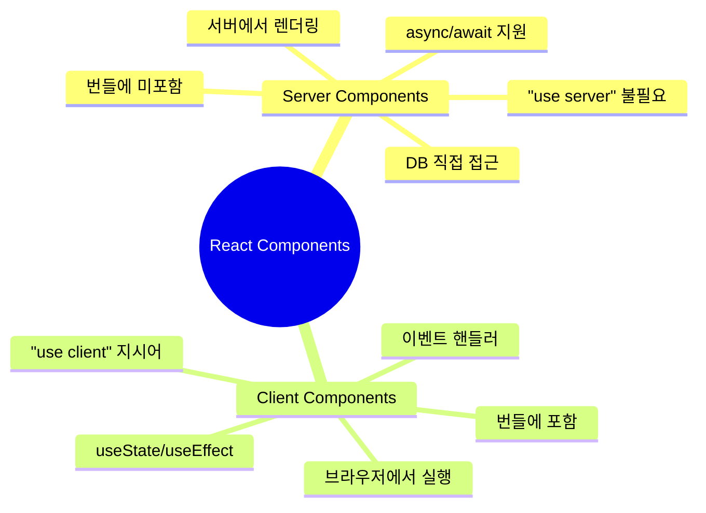
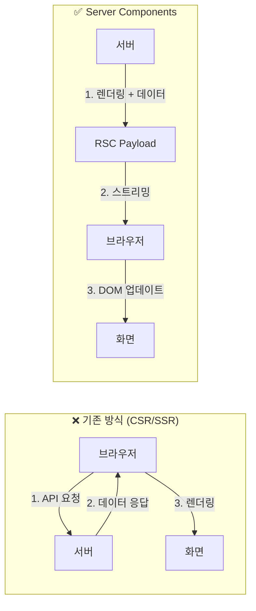
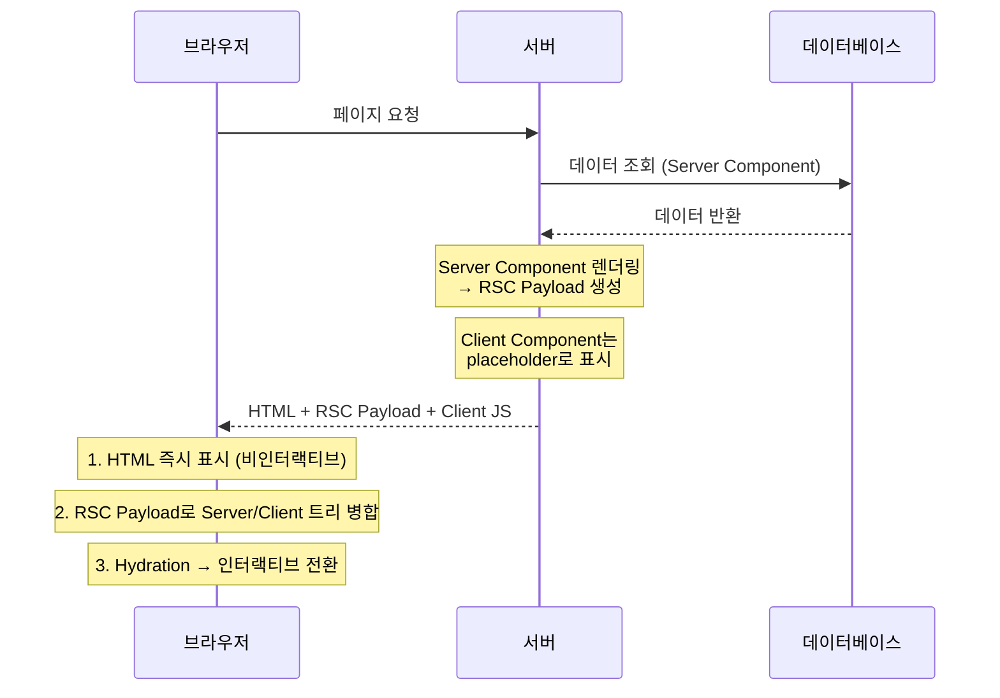
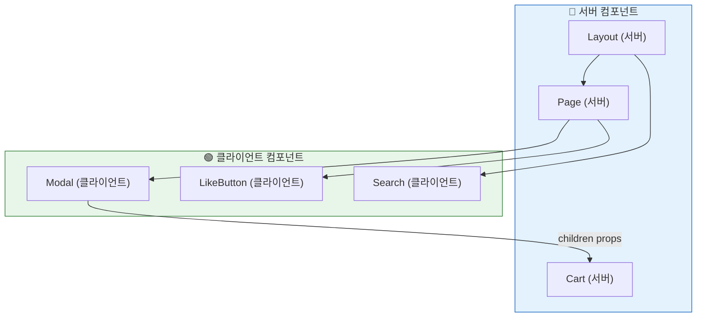
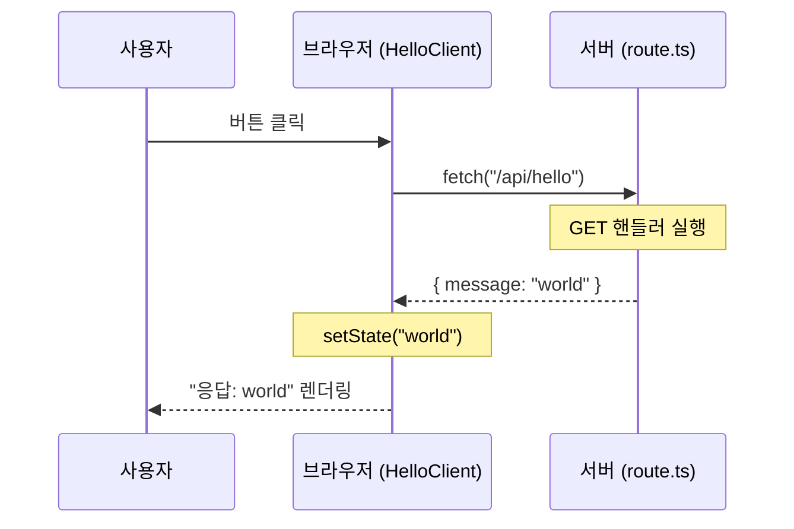
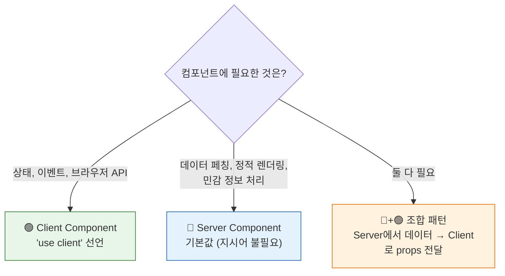

# 🛠️ 260226 React 서버 컴포넌트와 클라이언트 컴포넌트 완벽 가이드

## 🧭 소개

React Server Components(RSC)는 React 19에서 안정화된 새로운 컴포넌트 패러다임입니다. 기존에는 모든 React 컴포넌트가 클라이언트(브라우저)에서 실행되었지만, RSC를 통해 **컴포넌트를 서버에서 직접 렌더링**하고 그 결과만 클라이언트로 전송할 수 있게 되었습니다.

기존 MPA(Multi-Page App)의 단순한 "요청/응답" 모델과 SPA(Single-Page App)의 매끄러운 인터랙티브 경험을 결합한 것이 핵심 철학입니다.



---

## 🎯 필요성: 왜 서버 컴포넌트가 등장했는가?

### ⚠️ 기존 CSR(Client Side Rendering)의 한계

- 사용자가 **JavaScript 전체 다운로드 완료까지 빈 화면**을 봐야 함
- 앱이 커질수록 번들 크기가 비대해져 **초기 로딩이 느려짐**
- 데이터 페칭을 위해 `useEffect` → API 호출 → 상태 업데이트라는 **복잡한 패턴** 반복

### ⚠️ 기존 SSR(Server Side Rendering)의 한계

- 초기 HTML은 빠르게 보여주지만, **하이드레이션까지 상호작용 불가**
- `getServerSideProps` 같은 데이터 페칭이 **라우트 레벨에서만** 가능 (컴포넌트 단위 불가)
- 데이터베이스 요청이 초기 HTTP 요청 중에 처리되지 않으면 **클라이언트-서버 간 왕복이 불가피**

### 🔹 RSC가 해결하는 문제



| 문제 | RSC의 해결 |
|------|-----------|
| 번들 크기 비대 | 서버 컴포넌트는 JS 번들에 **미포함** (18~29% 감소) |
| API 폭포수 요청 | 서버에서 **병렬 데이터 페칭** 후 한 번에 전송 |
| 민감 정보 노출 | API 키, DB 연결 정보가 **서버에만 존재** |
| 초기 로딩 지연 | 서버에서 렌더링된 결과를 **즉시 스트리밍** |

---

## ⚖️ 서버 컴포넌트 vs 클라이언트 컴포넌트 비교

### ✅ 핵심 차이점

| 구분 | Server Component | Client Component |
|------|-----------------|-----------------|
| **지시어** | 없음 (기본값) | `"use client"` 파일 최상단 |
| **렌더링 위치** | 서버 (빌드 타임 / 요청 타임) | 브라우저 |
| **JS 번들 포함** | ❌ | ✅ |
| **상태 관리** | `useState` ❌ | `useState` ✅ |
| **생명주기** | `useEffect` ❌ | `useEffect` ✅ |
| **이벤트 핸들러** | `onClick` ❌ | `onClick` ✅ |
| **브라우저 API** | `window`, `localStorage` ❌ | ✅ |
| **데이터 접근** | DB, 파일시스템 직접 접근 ✅ | API 요청 필요 |
| **async/await** | ✅ (async 컴포넌트 가능) | ❌ |

### 🔹 언제 무엇을 써야 하는가?

**Server Component를 사용하는 경우:**
- 데이터베이스나 API에서 데이터를 가져올 때
- API 키, 토큰 등 민감 정보를 다룰 때
- 브라우저로 보내는 JavaScript 양을 줄이고 싶을 때
- 레이아웃, 정적 콘텐츠 렌더링

**Client Component를 사용하는 경우:**
- `useState`, `useEffect` 등 상태/생명주기가 필요할 때
- 클릭, 입력 등 이벤트 핸들링이 필요할 때
- `localStorage`, `window` 등 브라우저 API 사용 시
- 커스텀 훅 사용 시

---

## 🏗️ 아키텍처: 동작 원리

### 🎮 RSC 렌더링 흐름



### 🔹 RSC Payload란?

RSC Payload는 서버에서 렌더링된 React Server Components 트리의 **압축된 바이너리 표현**입니다:

- Server Components의 **렌더링 결과**
- Client Components가 렌더링될 **위치 및 JS 파일 참조**
- Server → Client Component로 전달되는 **props**

### 🔹 컴포넌트 조합 패턴



**핵심 규칙:**
- Server Component → Client Component **import 가능** ✅
- Client Component → Server Component **import 불가** ❌
- Client Component 안에 Server Component를 넣으려면 **`children` props 활용** ✅

---

## 🧪 Next.js App Router 예제

### 🏗️ 프로젝트 구조

```
app/
├── api/
│   └── hello/
│       └── route.ts        ← API Route (서버)
├── components/
│   └── HelloClient.tsx      ← "use client" 컴포넌트
└── page.tsx                 ← 서버 컴포넌트 (기본)
```

### 💻 1. API Route (서버)

```typescript
// app/api/hello/route.ts
import { NextResponse } from "next/server";

export async function GET() {
  return NextResponse.json({ message: "world" });
}
```

서버에서만 실행되는 API 엔드포인트입니다. `GET /api/hello` 요청 시 `{ message: "world" }`를 반환합니다.

### 🔹 2. 클라이언트 컴포넌트

```tsx
// app/components/HelloClient.tsx
"use client";

import { useState } from "react";

export default function HelloClient() {
  const [result, setResult] = useState<string>("");

  const handleClick = async () => {
    const res = await fetch("/api/hello");
    const data = await res.json();
    setResult(data.message);
  };

  return (
    <div>
      <button onClick={handleClick}>GET /hello 호출</button>
      {result && <p>응답: {result}</p>}
    </div>
  );
}
```

`"use client"` 지시어로 클라이언트 컴포넌트임을 선언합니다. `useState`로 상태를 관리하고, 버튼 클릭 시 API를 호출합니다.

### 🔹 3. 페이지 (서버 컴포넌트)

```tsx
// app/page.tsx
import HelloClient from "./components/HelloClient";

export default function Home() {
  return (
    <main>
      <h1>Next.js 서버/클라이언트 예제</h1>
      <HelloClient />
    </main>
  );
}
```

기본적으로 서버 컴포넌트입니다. `"use client"` 지시어가 없으므로 서버에서 렌더링되며, 클라이언트 컴포넌트인 `HelloClient`를 import하여 조합합니다.

### 🔹 동작 흐름



---

## ⚠️ 장단점 정리

### ✅ 장점

| 장점 | 상세 |
|------|------|
| **번들 크기 감소** | 서버 컴포넌트 코드가 클라이언트로 전송되지 않아 JS 번들 18~29% 감소 |
| **성능 향상** | 서버에서 데이터를 병렬로 가져와 API 폭포수 현상 제거 |
| **보안 강화** | API 키, DB 연결 정보 등 민감 정보가 클라이언트에 노출되지 않음 |
| **초기 로딩 개선** | FCP(First Contentful Paint) 개선, 스트리밍으로 점진적 렌더링 |
| **개발 경험 개선** | `useEffect` + 의존성 배열 + stale closure 같은 복잡성 제거 |
| **대형 라이브러리 활용** | 마크다운 파서, 구문 강조기 등을 번들 증가 없이 서버에서 사용 가능 |

### ⚠️ 단점

| 단점 | 상세 |
|------|------|
| **학습 곡선** | 서버/클라이언트 경계를 이해하고 적절히 분리하는 새로운 사고방식 필요 |
| **프레임워크 의존** | 현재 Next.js(13.4+)에서만 프로덕션 사용 가능. React Router, TanStack Start는 지원 추가 중 |
| **Context API 제한** | Server Component에서 `React.createContext` 사용 불가 → Client Component로 감싸야 함 |
| **테스팅 도구 부족** | RSC 전용 테스트 환경과 도구가 아직 미성숙 |
| **라이브러리 호환성** | 기존 React 라이브러리 중 `"use client"` 미지원 시 래핑 필요 |
| **`"use client"` 관리** | 앱이 커질수록 클라이언트 경계 관리가 복잡해질 수 있음 |
| **HTML 크기 증가** | 서버 렌더링 결과가 인라인으로 포함되어 HTML 파일 크기 증가 가능 |

---

## 📌 실전 패턴 모음

### 🔹 패턴 1: 서버에서 데이터 가져와 클라이언트로 전달

```tsx
// app/[id]/page.tsx (Server Component)
import LikeButton from '@/app/ui/like-button'
import { getPost } from '@/lib/data'

export default async function Page({ params }: { params: Promise<{ id: string }> }) {
  const { id } = await params
  const post = await getPost(id)

  return (
    <div>
      <h1>{post.title}</h1>
      <LikeButton likes={post.likes} />
    </div>
  )
}
```

```tsx
// app/ui/like-button.tsx (Client Component)
'use client'

import { useState } from 'react'

export default function LikeButton({ likes }: { likes: number }) {
  const [count, setCount] = useState(likes)
  return <button onClick={() => setCount(count + 1)}>👍 {count}</button>
}
```

### 💻 패턴 2: Client Component 안에 Server Component (children 패턴)

```tsx
// app/ui/modal.tsx (Client Component)
'use client'

import { useState } from 'react'

export default function Modal({ children }: { children: React.ReactNode }) {
  const [isOpen, setIsOpen] = useState(false)
  return (
    <div>
      <button onClick={() => setIsOpen(!isOpen)}>토글</button>
      {isOpen && <div className="modal">{children}</div>}
    </div>
  )
}
```

```tsx
// app/page.tsx (Server Component)
import Modal from './ui/modal'
import Cart from './ui/cart'  // Server Component

export default function Page() {
  return (
    <Modal>
      <Cart /> {/* 서버에서 렌더링된 결과가 children으로 전달 */}
    </Modal>
  )
}
```

### 🏢 패턴 3: Context Provider 활용

```tsx
// app/theme-provider.tsx (Client Component)
'use client'

import { createContext } from 'react'

export const ThemeContext = createContext({})

export default function ThemeProvider({ children }: { children: React.ReactNode }) {
  return <ThemeContext.Provider value="dark">{children}</ThemeContext.Provider>
}
```

```tsx
// app/layout.tsx (Server Component)
import ThemeProvider from './theme-provider'

export default function RootLayout({ children }: { children: React.ReactNode }) {
  return (
    <html>
      <body>
        <ThemeProvider>{children}</ThemeProvider>
      </body>
    </html>
  )
}
```

### 🔹 패턴 4: 서드파티 라이브러리 래핑

```tsx
// app/carousel.tsx (Client Component 래퍼)
'use client'

import { Carousel } from 'acme-carousel' // "use client" 미지원 라이브러리
export default Carousel
```

```tsx
// app/page.tsx (Server Component)
import Carousel from './carousel' // 래핑된 Client Component

export default function Page() {
  return <Carousel />
}
```

---

## 📌 핵심 요약



> ✨ **핵심 원칙:** 기본은 Server Component, 상호작용이 필요한 부분만 `"use client"`로 Client Component 전환. Server Component에서 데이터를 가져오고, Client Component에서 인터랙션을 처리한다.

---

## 🔗 참고 자료

- [Server Components - React 공식 문서](https://react.dev/reference/rsc/server-components)
- [Server and Client Components - Next.js 공식 문서](https://nextjs.org/docs/app/getting-started/server-and-client-components)
- [Making Sense of React Server Components - Josh W. Comeau](https://www.joshwcomeau.com/react/server-components/)
- [Understanding React Server Components - Vercel](https://vercel.com/blog/understanding-react-server-components)
- [React Server Components: the Good, the Bad, and the Ugly](https://mayank.co/blog/react-server-components/)
- [React Server Components: Adoption Challenges and Solutions for 2025](https://vladimirsiedykh.com/blog/react-server-components-adoption-challenges-2025)
- [React Server Components in Production: Benefits, Pitfalls and Best Practices for 2026](https://www.growin.com/blog/react-server-components/)
- [React Server Components: Practical Guide (2026)](https://inhaq.com/blog/react-server-components-practical-guide-2026)
- [Server and Client Composition Patterns - Next.js 한글 문서](https://nextjs-ko.org/docs/app/building-your-application/rendering/composition-patterns)

---

## 📌 프롬프트
```text
/hhd-research
/hhd-md

react.js 의 서버컴포넌트와 클라컴포넌트의 예제
아래 예제를 그대로 포함
관련된 배경 지식
- 소개
- 필요성
- 장단점


❯ next.js 예제 알려주세요.

  - 서버 컴포넌트
    - 간단한 api 기능 노출
    - GET /hello
      - world
  - 클라 컴포넌트
   - /hello 호출
   - 결과 렌더링

● Next.js App Router 예제

  1. API Route (서버)

  // app/api/hello/route.ts
  import { NextResponse } from "next/server";

  export async function GET() {
    return NextResponse.json({ message: "world" });
  }

  2. 클라이언트 컴포넌트

  // app/components/HelloClient.tsx
  "use client";

  import { useState } from "react";

  export default function HelloClient() {
    const [result, setResult] = useState<string>("");

    const handleClick = async () => {
      const res = await fetch("/api/hello");
      const data = await res.json();
      setResult(data.message);
    };

    return (
      <div>
        <button onClick={handleClick}>GET /hello 호출</button>
        {result && <p>응답: {result}</p>}
      </div>
    );
  }

  3. 페이지 (서버 컴포넌트)

  // app/page.tsx
  import HelloClient from "./components/HelloClient";

  export default function Home() {
    return (
      <main>
        <h1>Next.js 서버/클라이언트 예제</h1>
        <HelloClient />
      </main>
    );
  }

  구조

  app/
  ├── api/
  │   └── hello/
  │       └── route.ts        ← API Route (서버)
  ├── components/
  │   └── HelloClient.tsx      ← "use client" 컴포넌트
  └── page.tsx                 ← 서버 컴포넌트 (기본)

  동작 흐름

  브라우저 → 버튼 클릭
    → fetch("/api/hello")
    → route.ts GET 핸들러 실행 (서버)
    → { message: "world" } 응답
    → HelloClient에서 setState → "world" 렌더링
```
