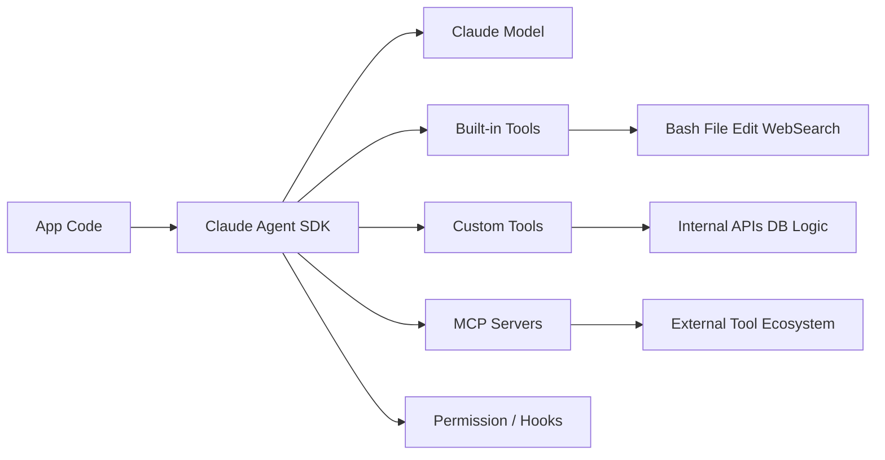
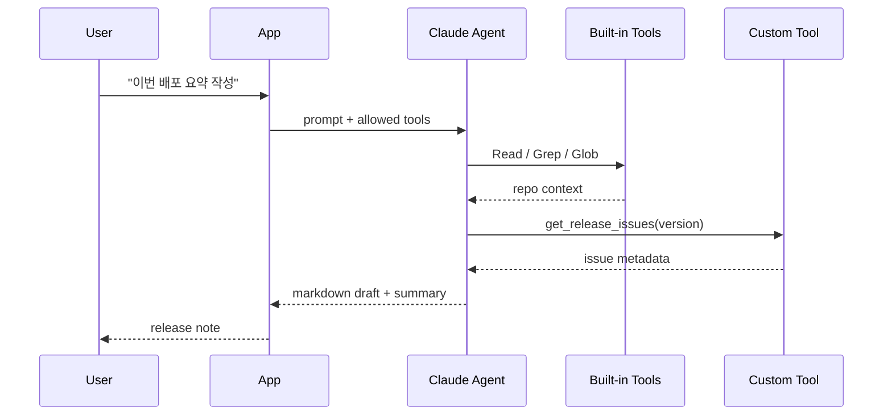
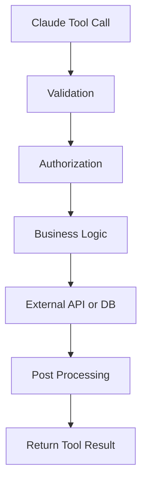

# 260311 Claude Code SDK 정리

> 2026-03-11 기준으로 Anthropic의 공식 명칭은 `Claude Code SDK`가 아니라 `Claude Agent SDK`다. 공식 문서에는 "formerly Claude Code SDK"라고 표기되어 있으므로, 이 문서에서는 사용자가 익숙한 예전 이름과 현재 이름을 함께 다룬다.

## 한눈에 보기

`Claude Agent SDK`는 Claude를 단순 API 호출 수준이 아니라 "도구를 쓰고, 파일을 읽고, 명령을 실행하고, 사람 또는 시스템 로직과 협업하는 에이전트"로 묶어 쓰기 위한 SDK다. Python과 TypeScript를 공식 지원하며, 내장 도구, 커스텀 툴, MCP 서버, 권한 제어, 세션 관리, 스트리밍 이벤트를 한 흐름으로 다룰 수 있다.

공식 문서:
- https://platform.claude.com/docs/en/agent-sdk/overview
- https://platform.claude.com/docs/en/agent-sdk/typescript
- https://platform.claude.com/docs/en/agent-sdk/python

## 소개

기존의 일반 LLM SDK가 `messages.create()` 같은 요청/응답 중심이었다면, Agent SDK는 "Claude가 작업을 수행하는 과정"을 코드 레벨에서 다루게 해준다.

대표적인 쓰임새는 아래와 같다.

- 코드베이스 분석 에이전트
- 사내 문서 검색 + 후처리 자동화
- CLI 작업 보조 도구
- 여러 외부 시스템을 호출하는 운영 봇
- 사람이 승인해야 하는 툴 사용 흐름이 포함된 업무 자동화



## 특징

### 1. 에이전트 실행을 SDK 레벨에서 제어

단순 텍스트 응답이 아니라 실행 단위(run), 세션, 이벤트 스트림, 툴 호출 흐름을 다룰 수 있다.

### 2. 내장 도구를 바로 사용

공식 레퍼런스 기준으로 `Bash`, `Edit`, `Glob`, `Grep`, `LS`, `Read`, `Write`, `WebFetch`, `WebSearch` 같은 도구를 허용 목록으로 제어할 수 있다.

### 3. 커스텀 툴 연결 가능

애플리케이션 내부 함수나 비즈니스 로직을 Claude가 호출할 수 있도록 툴로 노출할 수 있다. Python은 `@tool` 데코레이터 방식, TypeScript는 `createSdkMcpServer` 같은 방식으로 확장 가능하다.

### 4. MCP 생태계와 자연스럽게 연결

Model Context Protocol 서버를 붙이면, 로컬 또는 원격 도구 집합을 SDK 안으로 끌어올 수 있다.

### 5. 권한과 안전장치 내장

`canUseTool`, `permissionMode`, 훅(hooks) 등을 통해 "어떤 도구를 언제 허용할지"를 앱에서 제어할 수 있다.

### 6. 스트리밍 중심 개발 경험

응답 최종 결과만 받는 것이 아니라, 중간 사고/툴 호출/결과 이벤트를 순차적으로 받아서 UI나 로그에 반영하기 좋다.

## 장단점

### 장점

- Claude를 "실행 가능한 에이전트"로 만들기 쉽다.
- 공식 내장 툴과 MCP, 커스텀 툴을 같은 패턴으로 다룰 수 있다.
- CLI형 앱, 코딩 에이전트, 운영 자동화 같은 실제 워크플로우에 바로 연결하기 좋다.
- 세션과 스트리밍 이벤트를 다루기 쉬워서 UI/로그/감사 추적을 만들기 좋다.
- 권한 모델이 있어 위험한 툴 사용을 앱이 통제할 수 있다.

### 단점

- 일반 LLM SDK보다 개념이 많다. 세션, 이벤트, 툴, 권한, MCP를 함께 이해해야 한다.
- 툴이 많아질수록 프롬프트 설계와 권한 설계가 중요해진다.
- 잘못 연결하면 모델이 내부 툴을 과도하게 호출하거나 비싼 워크플로우가 될 수 있다.
- 커스텀 툴/MCP를 붙이는 순간 앱 책임 범위가 커진다. 인증, 타임아웃, 재시도, 관측성까지 직접 챙겨야 한다.

## 간단 예제

아래는 TypeScript에서 가장 단순한 형태의 예제다. 프롬프트를 보내고 텍스트를 출력한다.

```ts
import { query } from "@anthropic-ai/claude-agent-sdk";

for await (const message of query({
  prompt: "Summarize the purpose of this repository in 5 bullets.",
})) {
  console.log(message);
}
```

Python도 비슷하다.

```python
from claude_agent_sdk import query

async for message in query(
    prompt="Summarize the purpose of this repository in 5 bullets."
):
    print(message)
```

이 수준은 "간단히 Claude를 호출한다"에 가깝다. 실제 Agent SDK의 강점은 아래처럼 툴과 세션을 쓰기 시작할 때 드러난다.

## 실용 예제

예시 시나리오: 저장소 릴리스 노트를 자동 생성하는 내부 도구

동작 흐름:

1. Claude가 `Read`, `Glob`, `Grep`로 변경 파일과 문서를 조사한다.
2. 커스텀 툴로 사내 이슈 API를 조회한다.
3. 필요한 경우 `WebFetch`로 공개 릴리스 노트를 확인한다.
4. 최종 결과를 Markdown으로 정리한다.



TypeScript 예시:

```ts
import { query, type Options } from "@anthropic-ai/claude-agent-sdk";

const options: Options = {
  allowedTools: ["Read", "Glob", "Grep", "WebFetch"],
  maxTurns: 8,
  systemPrompt: `
    You are a release-note assistant.
    Prefer repository evidence first.
    Use web fetch only when public confirmation is required.
  `,
};

for await (const message of query({
  prompt: "Summarize the release impact of the latest changes.",
  options,
})) {
  if (message.type === "result") {
    console.log(message.result);
  }
}
```

실무적으로는 여기에 다음을 추가하는 편이 안전하다.

- 툴별 사용 허용 정책
- 토큰/턴 수 제한
- 감사 로그
- 실패 재시도와 타임아웃
- 사람이 승인해야 하는 destructive action 차단

## Tool 사용법

Agent SDK의 툴 사용은 보통 세 가지 층위로 생각하면 이해가 쉽다.

### 1. 내장 툴 허용

가장 먼저 `allowedTools` 또는 `allowed_tools`로 사용할 수 있는 도구를 좁힌다.

예:

```ts
const options = {
  allowedTools: ["Read", "LS", "Grep"],
};
```

실무적으로는 이 값을 "자동 승인 allowlist"로 이해하는 편이 정확하다. 공식 문서 기준으로 `allowed_tools`는 툴 자체를 제거하는 옵션이 아니라, 나열된 툴을 자동 승인하고 나머지는 `permission_mode`, `can_use_tool`, `disallowed_tools` 흐름으로 넘긴다.

### 2. 권한 제어 추가

공식 문서에는 `canUseTool` 같은 권한 검사 지점을 제공한다. 이를 이용하면 "Read는 허용, Bash는 금지", "운영 DB 관련 툴은 특정 경로에서만 허용" 같은 정책을 앱 코드로 넣을 수 있다.

권한 정책 예시:

- `Bash`, `Write`, `Edit`는 기본 차단
- 조회성 툴만 기본 허용
- 운영 반영 도구는 별도 승인 플래그가 있을 때만 허용

### 3. 스트리밍 이벤트 처리

툴 사용을 UI에 보여주고 싶다면 이벤트를 받아서 렌더링하면 된다.

예:

- 현재 Claude가 어떤 툴을 호출했는지 표시
- 툴 실행 결과를 접어서 표시
- 최종 응답과 중간 reasoning 이벤트를 구분해서 로그 저장

## 커스톰 함수나 로직을 만들어서 연결하는 방법

핵심은 "내 함수를 Claude가 호출 가능한 tool로 포장한다"는 점이다.

### 방법 1. Python `@tool` 데코레이터

공식 Python 문서에는 함수에 `@tool`을 붙이고, 이를 `create_sdk_mcp_server()`에 묶어 `mcp_servers`로 등록하는 방식이 소개되어 있다.

```python
from typing import Any

from claude_agent_sdk import (
    ClaudeSDKClient,
    ClaudeAgentOptions,
    create_sdk_mcp_server,
    tool,
)

@tool("get_order_status", "Look up an order by id", {"order_id": str})
async def get_order_status(args: dict[str, Any]) -> dict[str, Any]:
    # 실제로는 DB나 내부 API 조회
    if args["order_id"] == "A-1024":
        return {"content": [{"type": "text", "text": "shipped"}]}
    return {"content": [{"type": "text", "text": "not_found"}]}

server = create_sdk_mcp_server(
    name="orders",
    version="1.0.0",
    tools=[get_order_status],
)

options = ClaudeAgentOptions(
    mcp_servers={"orders": server},
    allowed_tools=["mcp__orders__get_order_status"],
)

async with ClaudeSDKClient(options=options) as client:
    await client.query("Order A-1024 상태를 확인해 줘.")
    async for event in client.receive_response():
        print(event)
```

이 방식은 "앱 내부 함수"를 가장 빠르게 연결할 때 적합하다.

### 방법 2. TypeScript에서 MCP 서버로 감싸기

공식 TypeScript 문서에는 `createSdkMcpServer`를 사용해 인프로세스 MCP 서버를 만들고 여기에 커스텀 툴을 붙이는 방식이 소개되어 있다.

```ts
import { z } from "zod";
import { query, tool, createSdkMcpServer } from "@anthropic-ai/claude-agent-sdk";

const server = createSdkMcpServer({
  name: "internal-tools",
  version: "1.0.0",
  tools: [
    tool(
      "get_order_status",
      "Look up order status by id",
      { orderId: z.string() },
      async ({ orderId }) => {
        // 실제로는 내부 API 호출
        return {
          content: [{ type: "text", text: `order ${orderId}: shipped` }],
        };
      }
    ),
  ],
});

async function* promptStream() {
  yield {
    type: "user" as const,
    message: {
      role: "user" as const,
      content: "Order A-1024 상태를 확인해 줘.",
    },
  };
}

for await (const message of query({
  prompt: promptStream(),
  options: {
    mcpServers: { internal: server },
    allowedTools: ["mcp__internal__get_order_status"],
  },
})) {
  console.log(message);
}
```

이 방식은 아래 상황에서 더 낫다.

- 툴을 여러 개 묶어 서비스처럼 관리하고 싶을 때
- 다른 에이전트/앱에서도 재사용하고 싶을 때
- 로컬 툴과 원격 툴을 MCP 기준으로 통일하고 싶을 때

### 방법 3. 앱 레이어에서 중간 로직 추가

현업에서는 단순 함수 연결보다 "툴 앞뒤에 정책 로직"을 넣는 경우가 많다.

예를 들면:

- 입력값 검증
- 사용자 권한 확인
- 외부 API 호출 전 rate limit 체크
- 민감정보 마스킹
- 결과 캐싱
- 실패 시 fallback 응답

권장 구조는 아래와 같다.



즉, 툴 함수 안에 직접 모든 것을 때려 넣기보다 다음처럼 분리하는 편이 낫다.

- Tool handler: 입출력 계약
- Service layer: 비즈니스 로직
- Gateway/Repository: DB, API 연동
- Policy layer: 권한, 감사, 제한

## 실전 팁

### 1. 처음에는 내장 조회성 툴만 열어라

처음부터 `Bash`, `Write`, `Edit`까지 모두 열면 제어가 어려워진다. `Read`, `LS`, `Grep`, `Glob`부터 시작하는 편이 안전하다.

### 2. 커스텀 툴은 "작고 명확한 계약"으로 시작하라

`search_everything()` 같은 거대한 툴보다 `get_order_status(order_id)`처럼 입력과 결과가 명확한 툴이 훨씬 안정적이다.

### 3. 툴 반환값은 LLM 친화적으로 만들어라

장문의 원본 JSON을 그대로 주기보다, 중요한 필드를 정리해서 반환하는 편이 모델이 덜 헷갈린다.

### 4. 승인 워크플로우를 별도로 둬라

배포, 삭제, 수정 같은 작업은 read-only 조사 단계와 분리하고, 최종 실행은 사람 승인 후 별도 툴로 호출하는 편이 안전하다.

### 5. `query()`와 풀 클라이언트를 구분해서 써라

공식 Python 문서에는 `query()`가 빠른 시작용이며, 커스텀 툴/훅 같은 고급 기능은 `ClaudeSDKClient`에서 더 잘 드러난다고 설명되어 있다. 복잡한 앱이라면 처음부터 클라이언트 객체 기반 구조가 유지보수에 유리하다.

## 언제 적합한가

`Claude Agent SDK`는 아래 같은 팀에 특히 잘 맞는다.

- Claude를 "실행형 도우미"로 제품에 넣고 싶은 팀
- 코드/문서/웹/사내 API를 하나의 워크플로우로 묶고 싶은 팀
- MCP 생태계를 적극 활용하려는 팀
- 승인, 감사, 권한 제어가 중요한 업무 자동화를 만드는 팀

반대로 단순 챗봇 응답만 필요하다면 일반 Messages API가 더 단순할 수 있다.

## 참고 링크

- Agent SDK Overview: https://platform.claude.com/docs/en/agent-sdk/overview
- TypeScript SDK: https://platform.claude.com/docs/en/agent-sdk/typescript
- Python SDK: https://platform.claude.com/docs/en/agent-sdk/python
- Python Reference: https://platform.claude.com/docs/en/agent-sdk/python/reference
- TypeScript Reference: https://platform.claude.com/docs/en/agent-sdk/typescript/reference
- Custom tools and MCP: https://platform.claude.com/docs/en/agent-sdk/custom-tools
- Legacy Claude Code docs entry: https://docs.claude.com/en/docs/claude-code/sdk
- Python repository: https://github.com/anthropics/claude-agent-sdk-python
- TypeScript repository: https://github.com/anthropics/claude-agent-sdk-typescript

## 확인 메모

이 문서는 공식 웹 문서 기준으로 정리했고, 장단점과 실전 팁은 문서 내용에 대한 해석을 포함한다. 특히 "언제 적합한가", "권장 구조", "실전 팁"은 공식 레퍼런스의 기능 설명을 바탕으로 한 실무적 해석이다.

## 프롬프트

```text
주제 : claude code sdk
- 소개
- 특징
- 장단점
- 간단예제
- 실용예제
- tool 사용법
- 커스톰 함수나 로직을 만들어서 연결하는 방법
```
