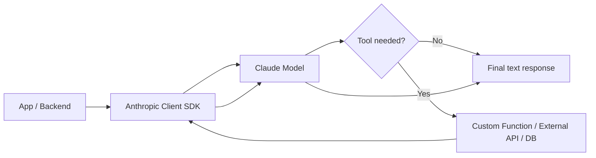
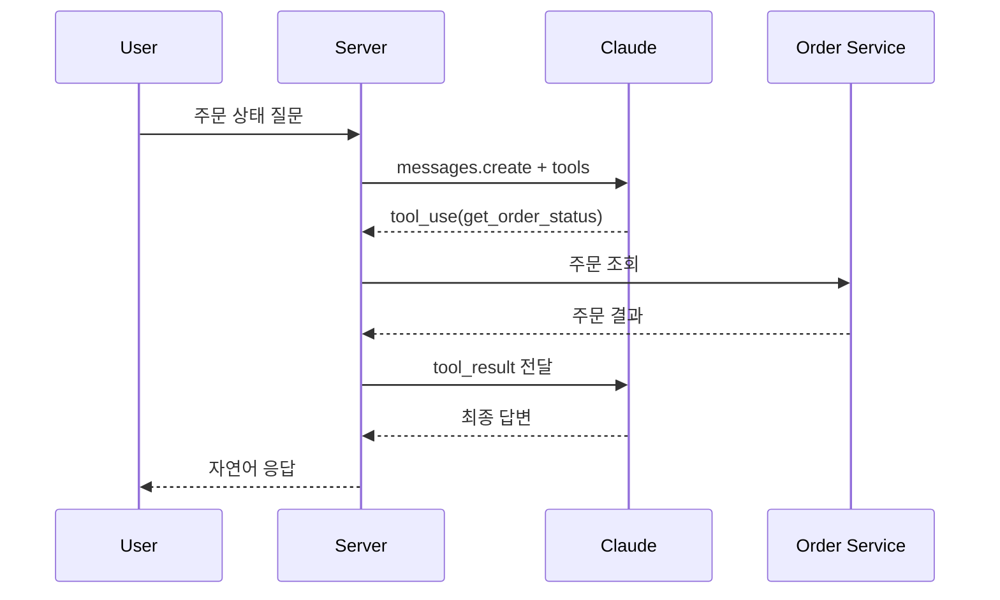

# 260311 Claude SDK 가이드

Claude SDK는 보통 두 가지를 가리킨다.

1. `Anthropic Client SDK`
   Claude 모델을 API로 직접 호출할 때 쓰는 공식 SDK다. Python, TypeScript/JavaScript, Java, Go 등을 지원한다.
2. `Claude Code SDK`
   Claude Code를 애플리케이션에서 비대화식 또는 에이전트 형태로 호출할 때 쓰는 SDK다. CLI, TypeScript, Python 인터페이스를 제공한다.

이 문서는 실무에서 가장 많이 쓰는 `Anthropic Client SDK`를 중심으로 설명하고, 마지막에 `Claude Code SDK` 연결 방법도 분리해 정리한다.

## 1. Claude SDK 소개

Claude SDK는 Anthropic의 Claude 모델을 애플리케이션에 연결하기 위한 공식 개발 도구 모음이다. 핵심은 `Messages API`를 쉽게 호출하고, 스트리밍 응답을 받고, tool use(function calling), 멀티모달 입력, 서버 도구 사용 같은 기능을 코드에서 안전하게 다루는 것이다.

실무에서는 다음 흐름으로 많이 쓴다.



## 2. 주요 특징

### 2.1 공식 지원 언어

- Python
- TypeScript / JavaScript
- Java
- Go
- 일부 문서는 C# 베타도 안내한다

### 2.2 Messages API 중심 구조

Claude SDK는 `messages.create(...)` 중심으로 동작한다. 대화 이력, 모델명, 토큰 수, 시스템 프롬프트, tool 정의 등을 한 요청 안에 담아 호출한다.

### 2.3 Tool Use 지원

Claude는 단순 텍스트 생성뿐 아니라 외부 함수나 API를 호출할 수 있도록 `tool_use`를 생성할 수 있다.

- `client tools`: 개발자가 직접 구현하는 함수/로직
- `server tools`: Anthropic 서버에서 실행되는 도구. 예: `web search`

### 2.4 스트리밍과 장문 응답

스트리밍 응답을 통해 토큰을 순차적으로 받을 수 있다. 긴 응답이나 대화형 UI에서 중요하다.

### 2.5 다양한 모델 선택 가능

공식 문서 기준으로 자주 보이는 모델 예시는 다음과 같다.

- `claude-opus-4-1-20250805`
- `claude-opus-4-20250514`
- `claude-sonnet-4-20250514`
- `claude-3-7-sonnet-20250219`
- `claude-3-5-haiku-20241022`

모델명은 고정 문자열처럼 보이지만 실제 지원 목록은 계속 갱신되므로, 배포 시점에는 공식 모델 목록 문서를 다시 확인하는 편이 안전하다.

## 3. 장점과 단점

### 장점

- 공식 SDK라서 API 변화 추적이 비교적 쉽다
- tool use, streaming, files, beta 기능을 빠르게 붙일 수 있다
- Python과 TypeScript 예제가 풍부해서 도입 장벽이 낮다
- Claude 모델의 긴 컨텍스트, 추론 성능, 코드 생성 능력을 그대로 활용할 수 있다
- Bedrock, Vertex AI 연동 경로도 공식 문서가 있다

### 단점

- 모델명, beta header, tool spec이 버전별로 바뀔 수 있어 문서 추적이 필요하다
- tool use를 제대로 쓰려면 함수 실행 루프와 검증 로직을 직접 설계해야 한다
- 서버 툴과 클라이언트 툴의 책임 경계를 이해하지 못하면 구조가 금방 복잡해진다
- 대규모 서비스에서는 토큰 비용, 응답 지연, 재시도 정책, observability를 별도로 설계해야 한다

## 4. 가장 간단한 예제

### Python

```python
import os
import anthropic

client = anthropic.Anthropic(
    api_key=os.environ["ANTHROPIC_API_KEY"],
)

message = client.messages.create(
    model="claude-sonnet-4-20250514",
    max_tokens=512,
    messages=[
        {"role": "user", "content": "Claude SDK를 한 문단으로 소개해줘."}
    ],
)

print(message.content)
```

### TypeScript

```ts
import Anthropic from "@anthropic-ai/sdk";

const client = new Anthropic({
  apiKey: process.env.ANTHROPIC_API_KEY,
});

const message = await client.messages.create({
  model: "claude-sonnet-4-20250514",
  max_tokens: 512,
  messages: [
    { role: "user", content: "Claude SDK를 한 문단으로 소개해줘." },
  ],
});

console.log(message.content);
```

핵심은 세 가지다.

1. API 키 설정
2. 모델명 지정
3. `messages.create()` 호출

## 5. 실용 예제

아래 예제는 사용자의 주문 ID를 받아 내부 주문 조회 함수와 연결하는 전형적인 패턴이다. 이 구조가 실무에서 가장 중요하다.

### 시나리오

- 사용자가 "주문 `A-1024` 상태 알려줘"라고 질문
- Claude는 직접 DB를 읽지 못하므로 `get_order_status` 툴을 호출
- 애플리케이션이 실제 조회 로직 실행
- 결과를 Claude에게 다시 전달
- Claude가 최종 사용자 응답 생성



### TypeScript 실용 예제

```ts
import Anthropic from "@anthropic-ai/sdk";

const client = new Anthropic({
  apiKey: process.env.ANTHROPIC_API_KEY,
});

async function getOrderStatus(orderId: string) {
  const fakeDb = {
    "A-1024": { status: "배송중", courier: "CJ대한통운", eta: "2026-03-12" },
    "B-2001": { status: "결제대기", courier: null, eta: null },
  };

  return fakeDb[orderId as keyof typeof fakeDb] ?? { status: "주문없음" };
}

const tools = [
  {
    name: "get_order_status",
    description: "주문 ID로 현재 주문 상태를 조회한다.",
    input_schema: {
      type: "object",
      properties: {
        orderId: {
          type: "string",
          description: "조회할 주문 ID",
        },
      },
      required: ["orderId"],
    },
  },
];

const first = await client.messages.create({
  model: "claude-sonnet-4-20250514",
  max_tokens: 1024,
  tools,
  messages: [
    {
      role: "user",
      content: "주문 A-1024 상태 알려줘.",
    },
  ],
});

const toolUse = first.content.find((block) => block.type === "tool_use");

if (!toolUse || toolUse.type !== "tool_use") {
  throw new Error("Claude가 툴 호출을 선택하지 않았습니다.");
}

const result = await getOrderStatus(String(toolUse.input.orderId));

const second = await client.messages.create({
  model: "claude-sonnet-4-20250514",
  max_tokens: 1024,
  tools,
  messages: [
    { role: "user", content: "주문 A-1024 상태 알려줘." },
    { role: "assistant", content: first.content },
    {
      role: "user",
      content: [
        {
          type: "tool_result",
          tool_use_id: toolUse.id,
          content: JSON.stringify(result),
        },
      ],
    },
  ],
});

console.log(second.content);
```

## 6. Tool 사용법

Tool use는 다음 순서로 이해하면 된다.

1. 애플리케이션이 Claude에게 툴 목록과 JSON Schema를 제공한다
2. Claude가 필요하다고 판단하면 `tool_use` 블록을 응답한다
3. 애플리케이션이 실제 함수를 실행한다
4. 실행 결과를 `tool_result`로 다시 Claude에게 보낸다
5. Claude가 최종 자연어 응답을 만든다

### 툴 정의의 핵심

- `name`: 짧고 명확해야 한다
- `description`: 언제 써야 하는지 분명해야 한다
- `input_schema`: 파라미터 타입과 required를 엄격히 적어야 한다

### 실무 팁

- 툴 설명이 모호하면 잘못된 함수가 호출된다
- 스키마는 가능한 한 엄격하게 만든다
- 툴 실행 전 파라미터 검증을 별도로 한다
- 외부 API 호출은 timeout, retry, logging을 둔다
- 민감 작업은 승인 단계나 정책 체크를 넣는다

### SDK Helper를 쓰는 방법

공식 SDK 저장소에는 툴 연결을 쉽게 만드는 helper도 있다.

- TypeScript: `betaZodTool`, `beta.messages.toolRunner(...)`
- Python: `@beta_tool`, `client.beta.messages.tool_runner(...)`

즉, 수동으로 `tool_use` 루프를 직접 짜는 방법과, SDK helper로 자동화하는 방법 두 가지가 있다.

## 7. 커스텀 함수나 로직을 만들어 연결하는 방법

실무에서는 Claude가 "판단"을 하고, 실제 업무 로직은 여러분의 코드가 실행하는 구조가 안정적이다.

예를 들면 다음 함수를 툴로 연결할 수 있다.

- 주문 조회
- 재고 확인
- 사내 문서 검색
- 벡터 DB 조회
- 사내 승인 API 호출
- SQL 질의 래퍼

구조는 대체로 같다.

```text
Claude
 -> tool_use 생성
 -> 내 서버가 함수 실행
 -> 결과를 tool_result로 반환
 -> Claude가 사용자 친화적 문장으로 정리
```

### Python helper 기반 예제

```python
import json
from anthropic import Anthropic, beta_tool

client = Anthropic()


@beta_tool
def search_kb(query: str) -> str:
    """사내 지식베이스에서 문서를 검색한다.

    Args:
        query: 사용자의 검색어
    Returns:
        JSON 문자열 형태의 검색 결과
    """
    data = {
        "query": query,
        "hits": [
            {"title": "Claude SDK 운영 가이드", "score": 0.98},
            {"title": "Tool Use 보안 체크리스트", "score": 0.91},
        ],
    }
    return json.dumps(data, ensure_ascii=False)


runner = client.beta.messages.tool_runner(
    model="claude-sonnet-4-20250514",
    max_tokens=1024,
    tools=[search_kb],
    messages=[
        {"role": "user", "content": "Claude SDK 운영 가이드를 찾아줘."}
    ],
)

for message in runner:
    print(message)
```

이 방식의 장점은 함수 정의만 잘하면 루프 일부를 SDK가 대신 처리해준다는 점이다. 반면 세밀한 제어가 필요하면 직접 `tool_use`와 `tool_result`를 처리하는 편이 더 낫다.

## 8. Claude model을 연결하는 방법

가장 기본적인 연결 절차는 아래와 같다.

1. Anthropic Console에서 API 키 발급
2. 환경 변수 `ANTHROPIC_API_KEY` 설정
3. SDK 설치
4. 모델명 선택
5. `messages.create()` 호출

### Python 설치

```bash
pip install anthropic
```

### TypeScript 설치

```bash
npm install @anthropic-ai/sdk
```

### 환경 변수 설정 예시

```bash
export ANTHROPIC_API_KEY="your_api_key"
```

Windows PowerShell:

```powershell
$env:ANTHROPIC_API_KEY="your_api_key"
```

### 어떤 모델을 고를까

- 최고 성능 우선: `Opus`
- 성능/속도/비용 균형: `Sonnet`
- 저비용 대량 처리: `Haiku`

처음 시작할 때는 보통 `claude-sonnet-4-20250514` 같은 Sonnet 계열이 가장 무난하다.

## 9. Claude Code SDK는 무엇이 다른가

`Anthropic Client SDK`가 "Claude API를 직접 호출하는 SDK"라면, `Claude Code SDK`는 "Claude Code를 하위 프로세스 또는 SDK 인터페이스로 호출해 에이전트처럼 쓰는 도구"에 가깝다.

이럴 때 적합하다.

- 코드베이스 분석 자동화
- 비대화식 개발 워크플로우
- CI/CD에서 코드 검사
- 로컬 툴과 편집 권한을 가진 코딩 에이전트 구성

### Claude Code SDK 간단 예제

```ts
import { query } from "@anthropic-ai/claude-code";

for await (const message of query({
  prompt: "src 폴더 구조를 분석하고 리팩터링 포인트를 요약해줘",
  abortController: new AbortController(),
  options: {
    maxTurns: 5,
    systemPrompt: "You are a senior code reviewer",
    allowedTools: ["Read", "Glob", "Grep"],
  },
})) {
  if (message.type === "result") {
    console.log(message.result);
  }
}
```

즉:

- 앱에 Claude 자체를 붙이려면 `Anthropic Client SDK`
- 코딩 에이전트/CLI 자동화를 만들려면 `Claude Code SDK`

이렇게 나누어 생각하면 된다.

## 10. 추천 정리

처음 Claude SDK를 도입한다면 아래 순서가 가장 실용적이다.

1. `Anthropic Client SDK`로 `messages.create()`만 먼저 붙인다
2. 그 다음 `tool use`로 외부 함수 1개만 연결한다
3. 이후 스트리밍, 로깅, 재시도, 권한 정책을 붙인다
4. 코드 작업 자동화가 필요할 때만 `Claude Code SDK`를 추가 검토한다

가장 중요한 포인트는 "Claude가 직접 업무 시스템을 건드리는 것"이 아니라, "Claude가 툴 호출을 제안하고 실제 실행은 애플리케이션이 통제한다"는 구조다. 이 원칙을 지키면 안정성과 보안성이 좋아진다.

## 참고 URL

- https://docs.anthropic.com/en/api/client-sdks
- https://docs.anthropic.com/en/api/messages
- https://docs.anthropic.com/en/docs/build-with-claude/tool-use/overview
- https://docs.anthropic.com/en/docs/agents-and-tools/tool-use/implement-tool-use
- https://docs.anthropic.com/en/docs/models-overview
- https://docs.anthropic.com/en/docs/claude-code/sdk
- https://docs.anthropic.com/s/claude-code-sdk
- https://github.com/anthropics/anthropic-sdk-python
- https://github.com/anthropics/anthropic-sdk-typescript

## 작성 메모

- 작성 기준 시각: 2026-03-11 01:16 KST
- 최신성 주의: 모델명, beta 헤더, SDK helper는 수시로 바뀔 수 있으므로 운영 반영 전 공식 문서 재확인 권장

## 사용자 질문 프롬프트

```text
주제 : claude sdk
- 소개
- 특징
- 장단점
- 간단예제
- 실용예제
- tool 사용법
- 커스톰 함수나 로직을 만들어서 연결하는 방법
- claude model 을 연결하는 방법
```
