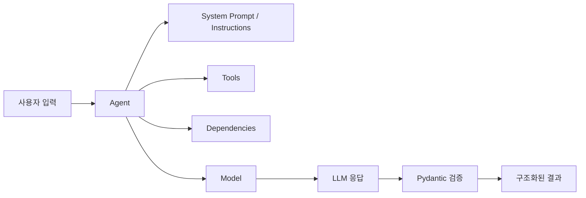

# 260311 PydanticAI 정리

`PydanticAI`는 이름 그대로 `Pydantic`의 타입 시스템과 검증 철학을 LLM 애플리케이션 개발에 가져온 Python 에이전트 프레임워크다. 단순히 "프롬프트를 보내고 문자열을 받는" 수준을 넘어서, **구조화된 출력**, **도구 호출**, **의존성 주입**, **모델 교체**, **검증 기반 후처리**를 비교적 일관된 방식으로 다룰 수 있게 설계되어 있다.

이 글에서는 공식 문서를 기준으로 `PydanticAI`가 무엇인지, 언제 유용한지, 어떤 식으로 실무에 연결하는지, 그리고 `Claude` 모델을 붙이는 방법까지 한 번에 정리한다.

## 한눈에 보는 구조



핵심은 `Agent`가 중심에 있고, 여기에 모델, 도구, 의존성, 출력 타입을 연결해 하나의 실행 단위처럼 다루는 방식이다.

---

## 1. 소개

공식 문서 기준으로 `PydanticAI`는 Python에서 에이전트 기반 AI 애플리케이션을 만들기 위한 프레임워크다. 특히 다음 요구가 있을 때 강점을 보인다.

- LLM 결과를 **Pydantic 모델**로 안전하게 받고 싶을 때
- 단순 채팅이 아니라 **도구 호출(tool calling)** 이 필요한 워크플로우를 만들 때
- DB 연결, 서비스 객체, 사용자 컨텍스트 같은 **의존성(dependencies)** 을 주입하고 싶을 때
- OpenAI, Anthropic, Gemini 등 여러 모델을 **교체 가능하게** 다루고 싶을 때
- 출력이 예상 스키마를 어기면 **재시도/검증** 흐름을 만들고 싶을 때

즉, `PydanticAI`는 "LLM을 코드 안에서 신뢰 가능한 컴포넌트처럼 다루기" 위한 도구라고 이해하면 가장 정확하다.

---

## 2. 특징

### 2.1 구조화된 출력이 기본 축이다

일반적인 LLM 코드에서는 응답 문자열을 파싱해야 한다. 반면 `PydanticAI`는 `output_type`에 `BaseModel` 또는 타입을 지정해, 결과를 구조화된 객체로 받는 패턴이 핵심이다.

예를 들어 다음처럼 결과 타입을 선언할 수 있다.

```python
from pydantic import BaseModel
from pydantic_ai import Agent


class CityInfo(BaseModel):
    name: str
    country: str
    summary: str


agent = Agent(
    "openai:gpt-4o-mini",
    output_type=CityInfo,
)
```

이 방식 덕분에 결과를 문자열이 아니라 **타입 있는 데이터**로 이어서 처리하기 쉽다.

### 2.2 Tool 사용이 일관적이다

에이전트에 Python 함수를 등록하고, 모델이 필요할 때 그 함수를 호출하게 만들 수 있다. 이때 도구 정의가 프레임워크 차원에서 정리되어 있어서, 함수 시그니처와 타입 힌트가 자연스럽게 연결된다.

### 2.3 의존성 주입 패턴이 있다

`RunContext`와 `deps_type`을 사용하면, 데이터베이스 핸들러, API 클라이언트, 설정 객체 같은 것을 에이전트 실행에 안전하게 주입할 수 있다. 이 부분이 단순 예제와 실무 코드를 가르는 핵심이다.

### 2.4 모델 추상화가 있다

모델 이름만 바꿔서 여러 제공자를 연결할 수 있고, 제공자별 설정도 별도로 붙일 수 있다. 즉 애플리케이션 로직과 모델 공급자 로직이 어느 정도 분리된다.

### 2.5 검증과 후처리를 흐름 안에 넣기 쉽다

출력 검증, 시스템 프롬프트, 동적 프롬프트, 재시도 같은 요소를 에이전트 단위에 모을 수 있다. 그래서 "응답 품질을 후처리 코드로 억지로 맞추는" 대신, 아예 실행 규칙으로 설계하기 쉬워진다.

---

## 3. 장점과 단점

## 장점

- **타입 안정성**: 응답을 구조화된 타입으로 받아 후속 코드가 깔끔해진다.
- **실무 친화적 구조**: Tool, 모델, 의존성, 검증을 한 자리에 모아 설계할 수 있다.
- **Pydantic 생태계 친화성**: 이미 `Pydantic`에 익숙한 Python 개발자라면 진입 장벽이 낮다.
- **모델 교체 용이성**: 공급자 변경이나 실험이 상대적으로 수월하다.
- **테스트 관점이 좋다**: 도구 함수와 의존성 객체를 분리해두면 테스트하기 쉬워진다.

## 단점

- **추상화 비용**: 간단한 단발성 프롬프트 호출에는 오히려 과할 수 있다.
- **모델별 차이 완전 은닉은 아님**: 공급자별 기능 차이, 인증 방식, 모델명 차이는 여전히 이해해야 한다.
- **에이전트 설계 품질이 중요**: 타입만 있다고 좋은 결과가 자동으로 나오지는 않는다. 프롬프트 설계, 도구 설계, 검증 규칙이 여전히 중요하다.
- **학습 범위가 넓다**: `Agent`, `RunContext`, `Tool`, `output_type`, `providers`, `retries` 등 개념을 함께 익혀야 한다.

요약하면, 단순 스크립트보다는 **중간 규모 이상 AI 기능 개발**에서 더 빛난다.

---

## 4. 간단 예제

가장 작은 예제는 "질문을 받고 구조화된 결과를 반환하는 에이전트"다.

```python
from pydantic import BaseModel
from pydantic_ai import Agent


class Answer(BaseModel):
    title: str
    summary: str
    confidence: int


agent = Agent(
    "openai:gpt-4o-mini",
    system_prompt="항상 한국어로 답하고 confidence는 0~100 정수로 반환해.",
    output_type=Answer,
)


result = agent.run_sync("PydanticAI가 무엇인지 한 문단으로 설명해 줘.")
print(result.output)
```

이 예제의 포인트는 두 가지다.

- 출력이 문자열이 아니라 `Answer` 객체로 정리된다.
- 이후 로직에서 `result.output.summary`, `result.output.confidence`처럼 바로 사용할 수 있다.

---

## 5. 실용 예제

실무에서는 대개 "외부 데이터 조회 + 구조화된 응답" 패턴이 필요하다. 아래 예제는 고객 주문 상태를 조회하는 사내 지원 봇 형태다.

```python
from dataclasses import dataclass

from pydantic import BaseModel
from pydantic_ai import Agent, RunContext


@dataclass
class SupportDeps:
    order_service: object


class SupportAnswer(BaseModel):
    customer_message: str
    order_found: bool
    next_action: str


agent = Agent(
    "openai:gpt-4o-mini",
    deps_type=SupportDeps,
    output_type=SupportAnswer,
    system_prompt=(
        "너는 고객지원 담당자다. "
        "주문 상태를 확인해 사용자에게 짧고 명확하게 안내해."
    ),
)


@agent.tool
def get_order_status(ctx: RunContext[SupportDeps], order_id: str) -> str:
    order = ctx.deps.order_service.get(order_id)
    if order is None:
        return "주문을 찾지 못했습니다."
    return f"주문 상태: {order.status}, 송장번호: {order.tracking_no}"


result = agent.run_sync(
    "주문번호 A-1024 배송 상태 알려줘.",
    deps=SupportDeps(order_service=my_order_service),
)

print(result.output)
```

이 패턴이 실용적인 이유는 다음과 같다.

- `order_service`를 직접 주입하므로 전역 상태에 덜 의존한다.
- 모델은 필요한 순간 `get_order_status`를 호출해 사실 데이터를 가져올 수 있다.
- 최종 결과는 구조화된 응답으로 정리된다.

즉, "LLM이 말만 잘하는 봇"이 아니라 **실제 비즈니스 데이터를 읽고 답하는 어시스턴트**에 가까워진다.

---

## 6. Tool 사용법

`PydanticAI`에서 Tool은 모델이 필요할 때 호출할 수 있는 Python 함수다. 공식 문서 기준으로 주로 다음 방식이 쓰인다.

- `@agent.tool`
- `@agent.tool_plain`

둘의 차이는 보통 `RunContext`를 받느냐 여부로 이해하면 된다.

### 6.1 `@agent.tool`: 컨텍스트가 필요한 도구

```python
from pydantic_ai import Agent, RunContext

agent = Agent("openai:gpt-4o-mini")


@agent.tool
def lookup_user(ctx: RunContext[dict], user_id: str) -> str:
    users = ctx.deps
    return users.get(user_id, "사용자를 찾을 수 없습니다.")
```

이 방식은 다음 상황에 적합하다.

- DB 세션 접근
- 외부 서비스 객체 사용
- 사용자 세션/권한 정보 참조
- 실행 중 공통 컨텍스트 활용

### 6.2 `@agent.tool_plain`: 단순 함수 도구

```python
from pydantic_ai import Agent

agent = Agent("openai:gpt-4o-mini")


@agent.tool_plain
def add(a: int, b: int) -> int:
    return a + b
```

이 방식은 컨텍스트 없이도 되는 순수 함수에 적합하다.

### 6.3 Tool 설계 팁

- 반환값은 모델이 이해하기 쉬운 형태로 단순하게 유지한다.
- 부작용이 큰 함수는 신중하게 노출한다.
- DB 전체 객체보다, 목적이 분명한 작은 조회 함수를 Tool로 노출하는 편이 안전하다.
- Tool 이름과 docstring은 모델의 선택 품질에 영향을 준다.

---

## 7. 커스텀 함수나 로직을 만들어 연결하는 방법

실무에서는 Tool만 붙이는 것으로 끝나지 않는다. 대개 다음 세 층으로 커스텀 로직을 연결한다.

### 7.1 시스템 프롬프트에 규칙 연결

가장 기본적인 방식이다.

```python
agent = Agent(
    "openai:gpt-4o-mini",
    system_prompt=(
        "너는 회의록 요약 비서다. "
        "중요 결정사항, 액션아이템, 리스크를 반드시 분리해서 답해."
    ),
)
```

### 7.2 의존성 주입으로 비즈니스 객체 연결

공식 문서의 `dependencies` 패턴이 이 역할을 한다.

```python
from dataclasses import dataclass
from pydantic_ai import Agent, RunContext


@dataclass
class AppDeps:
    policy_service: object
    tenant_id: str


agent = Agent(
    "openai:gpt-4o-mini",
    deps_type=AppDeps,
)


@agent.tool
def get_policy(ctx: RunContext[AppDeps], topic: str) -> str:
    return ctx.deps.policy_service.find(ctx.deps.tenant_id, topic)
```

이렇게 하면 "프롬프트 문자열 안에 앱 상태를 억지로 집어넣는 방식"보다 훨씬 안정적이다.

### 7.3 출력 검증 로직 연결

구조화된 출력이 중요한 경우, 후처리 규칙을 강제하는 방식이 유용하다. `Pydantic` 검증기만 써도 되지만, 공식 문서처럼 `@agent.output_validator`를 사용하면 모델에게 재시도를 요구하는 흐름까지 만들 수 있다.

```python
from dataclasses import dataclass

from pydantic_ai import Agent, ModelRetry, RunContext


@dataclass
class ReviewDeps:
    banned_words: set[str]


agent = Agent(
    "openai:gpt-4o-mini",
    deps_type=ReviewDeps,
    output_type=str,
)


@agent.output_validator
def validate_output(ctx: RunContext[ReviewDeps], output: str) -> str:
    for banned_word in ctx.deps.banned_words:
        if banned_word in output:
            raise ModelRetry(f"금지어 '{banned_word}' 없이 다시 작성해.")
    return output
```

이 패턴의 장점은 단순 검증을 넘어서, "조건을 어겼으니 다시 생성하라"는 제어 흐름을 에이전트 안에 넣을 수 있다는 점이다.

### 7.4 Pydantic 모델 자체 검증 연결

보다 단순한 경우에는 `Pydantic` 필드 검증만으로도 충분하다.

```python
from pydantic import BaseModel, field_validator


class ReviewResult(BaseModel):
    summary: str
    score: int

    @field_validator("score")
    @classmethod
    def validate_score(cls, v: int) -> int:
        if not 0 <= v <= 100:
            raise ValueError("score는 0~100이어야 합니다.")
        return v
```

이 방식은 `PydanticAI` 자체 기능과 `Pydantic` 검증을 결합하는 가장 현실적인 패턴이다.

### 7.5 추천 연결 전략

실무에서는 아래처럼 역할을 나누면 유지보수가 편하다.

- 프롬프트: 응답 태도와 규칙
- Tool: 사실 데이터 조회와 외부 기능 호출
- Dependencies: 런타임 객체 주입
- Pydantic 모델: 최종 출력 스키마 검증
- 애플리케이션 서비스 계층: 진짜 비즈니스 로직

즉, **복잡한 로직은 앱 코드에 남기고, 에이전트는 조정자(orchestrator)로 두는 구조**가 좋다.

---

## 8. Claude 모델을 연결하는 방법

공식 문서 기준으로 `PydanticAI`는 Anthropic 모델을 지원한다. 기본 흐름은 다음과 같다.

### 8.1 패키지 설치

```bash
pip install "pydantic-ai-slim[anthropic]"
```

또는 프로젝트 환경에 맞는 패키지 방식으로 Anthropic extra를 포함해 설치하면 된다.

### 8.2 API 키 설정

```bash
set ANTHROPIC_API_KEY=your_api_key
```

PowerShell이라면 보통 다음 형태를 쓴다.

```powershell
$env:ANTHROPIC_API_KEY="your_api_key"
```

### 8.3 모델 지정

가장 단순한 방식은 모델 식별자를 직접 사용하는 것이다.

```python
from pydantic_ai import Agent


agent = Agent("anthropic:claude-3-7-sonnet-latest")
result = agent.run_sync("PydanticAI를 한 문단으로 설명해 줘.")
print(result.output)
```

### 8.4 구조화된 출력과 함께 사용

```python
from pydantic import BaseModel
from pydantic_ai import Agent


class ResearchSummary(BaseModel):
    topic: str
    summary: str
    key_points: list[str]


agent = Agent(
    "anthropic:claude-3-7-sonnet-latest",
    system_prompt="항상 한국어로 요약해.",
    output_type=ResearchSummary,
)

result = agent.run_sync("PydanticAI의 핵심 특징을 정리해 줘.")
print(result.output)
```

### 8.5 Provider/Model 객체로 더 명시적으로 연결

문서 구조상 `models`와 `providers`를 분리해서 더 명시적인 설정도 가능하다. 이런 방식은 엔터프라이즈 환경이나 프록시, 커스텀 설정이 들어갈 때 유리하다.

핵심 포인트는 다음이다.

- 간단한 경우: `"anthropic:모델명"` 문자열로 충분하다.
- 세밀한 제어가 필요할 때: Anthropic용 model/provider 객체를 명시적으로 구성한다.

### 8.6 Claude 연결 시 주의점

- 모델명은 시점에 따라 바뀔 수 있으므로 공식 문서의 `AnthropicModelName` 목록이나 Anthropic 문서를 함께 확인하는 것이 안전하다.
- Tool 사용 여부, 응답 포맷, 비용, 속도는 모델마다 차이가 있다.
- 구조화된 출력이 항상 완벽히 보장되는 것은 아니므로, 최종 검증은 Pydantic 모델로 다시 거는 편이 좋다.

---

## 9. 언제 쓰면 좋은가

`PydanticAI`는 아래와 같은 경우에 특히 잘 맞는다.

- 사내 업무 보조 에이전트
- 문서 요약/분류/추출 파이프라인
- RAG 결과를 구조화된 객체로 반환해야 하는 서비스
- Tool 호출이 필요한 지원 봇
- 결과 검증이 중요한 백엔드 API

반대로 아래 상황에서는 과할 수 있다.

- 단발성 프롬프트 실험
- 단순 챗봇 프로토타입
- 문자열 응답 하나면 충분한 스크립트

즉, "`LLM 앱을 백엔드 소프트웨어처럼 관리`하고 싶을 때" 가장 가치가 크다.

---

## 10. 마무리

`PydanticAI`의 핵심 가치는 단순하다. LLM 호출을 문자열 장난이 아니라, **타입이 있고 검증 가능하며 도구와 컨텍스트를 연결할 수 있는 실행 단위**로 끌어올린다는 점이다.

Python 백엔드 개발자 입장에서는 특히 매력적이다.

- `Pydantic` 기반 구조화
- 의존성 주입
- Tool 호출
- 모델 교체 가능성
- 검증 중심 설계

이 다섯 가지가 합쳐지면, 실험용 AI 코드와 운영 가능한 AI 코드를 구분하는 기준이 꽤 선명해진다.

개인적으로는 `PydanticAI`를 "프롬프트 라이브러리"로 보기보다, **Python 애플리케이션 안에서 AI 기능을 설계 가능한 컴포넌트로 만드는 프레임워크**로 보는 것이 가장 적절하다고 본다.

---

## 참고 자료

- https://ai.pydantic.dev/
- https://ai.pydantic.dev/agents/
- https://ai.pydantic.dev/tools/
- https://ai.pydantic.dev/dependencies/
- https://ai.pydantic.dev/models/
- https://ai.pydantic.dev/models/anthropic/
- https://docs.anthropic.com/

## 사실 검증 메모

이 문서는 `PydanticAI` 공식 문서와 Anthropic 공식 문서를 기준으로 작성했다.  
특히 다음 사항을 재검증했다.

- `PydanticAI`가 에이전트, 도구, 의존성, 모델 추상화를 제공한다는 점
- `RunContext` 및 `deps_type` 기반 의존성 주입 패턴이 존재한다는 점
- `tool` / `tool_plain` 패턴이 공식 문서에 안내된다는 점
- Anthropic 모델 연결 문서가 별도로 존재한다는 점

## 프롬프트

```text
$hhd-research
$hhd-md

주제 : pydantic ai 
- 소개 
- 특징
- 장단점 
- 간단예제 
- 실용예제
- tool 사용법
- 커스톰 함수나 로직을 만들어서 연결하는 방법
- claude model 을 연결하는 방법
```
