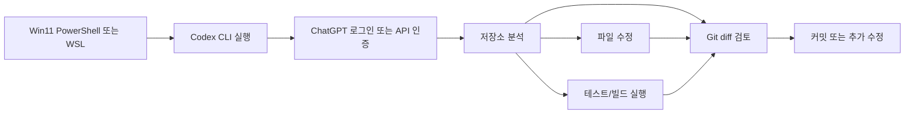

# 260311 Win11 Codex 사용법 정리

Win11에서 Codex를 제대로 쓰려면 "설치"보다 "권한 모델"과 "작업 방식"을 먼저 이해하는 편이 훨씬 중요합니다. Codex는 단순한 채팅형 코딩 도구가 아니라, 로컬 저장소를 읽고 수정하고, 명령을 실행하고, 필요하면 웹 검색이나 MCP까지 연결하는 에이전트형 도구이기 때문입니다.

이 글은 2026-03-11 01:11(Asia/Seoul) 기준으로, OpenAI 공식 문서와 Anthropic 공식 문서를 대조해 정리한 Win11 중심 가이드입니다. CLI 실습 예시는 현재 로컬 환경의 `codex-cli 0.113.0` 도움말 출력도 함께 참고했습니다.



## 1. Codex 소개

Codex는 OpenAI의 AI 코딩 에이전트입니다. 프롬프트나 요구사항을 주면 저장소를 훑고, 관련 파일을 찾고, 코드를 수정하고, 테스트를 실행하고, diff를 보여주며, 필요하면 하위 에이전트까지 써서 작업을 진행합니다.

Win11에서는 세 가지 경로가 실용적입니다.

1. `Codex app`
   Windows 네이티브 앱에서 프로젝트를 넘나들며 병렬 에이전트를 돌리기 좋습니다.
2. `Codex IDE extension`
   VS Code, Cursor, Windsurf 같은 에디터 안에서 쓰기 좋습니다.
3. `Codex CLI`
   PowerShell 또는 WSL 터미널에서 가장 세밀하게 제어할 수 있습니다.

개인적으로 Win11에서는 아래처럼 나누면 가장 편합니다.

- 빠른 파일 수정, 명령 제어, Git diff 확인: `CLI`
- 코드 보면서 수정: `IDE extension`
- 여러 작업 병렬 관리: `Codex app`

## 2. Codex의 특징

Codex의 핵심 특징은 다음입니다.

- `에이전트형 작업`
  질문 답변만 하는 것이 아니라 실제로 파일 수정과 명령 실행까지 이어집니다.
- `권한/샌드박스 중심 설계`
  아무 명령이나 무조건 실행하는 구조가 아니라 승인 정책과 샌드박스로 통제합니다.
- `장기 작업에 강함`
  `/compact`, `/plan`, `/resume`, `/fork` 같은 기능으로 긴 작업 흐름을 유지하기 쉽습니다.
- `Skills 확장`
  특정 작업 절차를 `SKILL.md`로 패키징해서 재사용할 수 있습니다.
- `Windows 네이티브 지원`
  PowerShell에서 바로 쓸 수 있고, Windows 샌드박스와 WSL2 흐름도 공식 지원합니다.

## 3. Win11에서 시작하는 가장 현실적인 방법

### 3.1 가장 빠른 설치

PowerShell에서 설치하는 가장 단순한 시작점은 아래입니다.

```powershell
npm install -g @openai/codex
codex
```

처음 실행 시 로그인 흐름이 뜹니다. 최근 버전은 `Sign in with ChatGPT`를 지원해서, 예전처럼 API 키를 직접 복사해 붙이지 않아도 되는 경우가 많습니다.

만약 `npm`이 없으면 Node.js LTS를 먼저 설치해야 합니다. Win11 사용자라면 PowerShell 기준으로 시작해도 되지만, Linux 계열 도구 체인이 많은 프로젝트면 WSL2가 더 편합니다.

### 3.2 PowerShell vs WSL2

#### PowerShell이 편한 경우

- Windows 경로(`C:\...`)를 그대로 쓰는 프로젝트
- Visual Studio, .NET, PowerShell 스크립트 중심
- 빠르게 바로 시작하고 싶은 경우

#### WSL2가 더 나은 경우

- Node/Python/Ruby/Go 등 리눅스 툴체인 의존이 많은 경우
- 셸 스크립트, 심볼릭 링크, POSIX 환경이 중요한 경우
- Docker/CI와 최대한 비슷한 환경이 필요한 경우

OpenAI 문서도 WSL 사용 시 저장소를 `C:\`가 아니라 `/home/...` 아래에 두는 쪽을 권장합니다.

### 3.3 첫 실행 추천 루틴

```powershell
cd C:\Users\you\project\myrepo
codex
```

Codex 안에서 처음에는 이 정도가 무난합니다.

```text
/status
/model
/permissions
/init
```

즉, 현재 모델과 권한 상태를 확인하고, 프로젝트용 `AGENTS.md` 뼈대를 만든 뒤 시작하는 방식입니다.

## 4. 장점과 단점

### 장점

- 터미널 중심 작업이 빨라집니다.
- 단순 답변보다 실제 수정, 테스트, diff 검토까지 이어집니다.
- 승인 정책과 샌드박스를 세밀하게 조절할 수 있습니다.
- `AGENTS.md`, Skills, MCP 등으로 팀 규칙을 누적하기 좋습니다.
- Win11 네이티브와 WSL2 둘 다 공식 흐름이 있습니다.

### 단점

- 권한 모델을 이해하지 않으면 답답하게 느껴질 수 있습니다.
- 장기 세션에서는 컨텍스트 관리가 필요합니다. 이때 `/compact`를 적절히 써야 합니다.
- PowerShell, WSL, Git, Node, 빌드 도구가 섞이면 초반 설정 복잡도가 있습니다.
- "완전 자동" 모드로 돌리면 편하지만, 실수했을 때 피해 범위도 커집니다.

## 5. 자주 쓰는 Codex 명령어

여기서는 `CLI 상위 명령`, `실전 옵션`, `대화 중 슬래시 명령`으로 나눠서 봅니다.

## 5.1 가장 많이 쓰는 CLI 명령

### `codex`

대화형 세션을 시작합니다.

```powershell
codex
codex "이 저장소 구조를 요약해줘"
codex -m gpt-5.1-codex
codex -C C:\Users\you\project\repo
```

언제 쓰나:

- 일반적인 페어 프로그래밍 시작
- 저장소 탐색, 구현, 테스트, 리뷰까지 한 세션에서 할 때

자주 붙는 옵션:

- `-m, --model`
- `-C, --cd`
- `-s, --sandbox`
- `-a, --ask-for-approval`
- `--search`
- `--full-auto`

### `codex exec`

비대화형 실행입니다. 자동화, 스크립트, CI 전후처리에 잘 맞습니다.

```powershell
codex exec "현재 저장소의 TODO를 정리해서 알려줘"
codex exec --json "테스트 실패 원인을 분석해줘"
```

언제 쓰나:

- 사람이 계속 붙어 있지 않을 때
- 로그를 JSONL로 받고 싶을 때
- 파이프라인 안에서 1회성 작업을 맡길 때

포인트:

- `--json`으로 이벤트 스트림을 기계적으로 처리하기 쉽습니다.
- `-o`로 마지막 응답을 파일에 저장할 수 있습니다.
- `--ephemeral`로 세션 파일을 남기지 않게 할 수 있습니다.

### `codex login`

로그인/인증을 관리합니다.

```powershell
codex login
codex login status
```

API 키 직접 입력이 필요하면:

```powershell
$env:OPENAI_API_KEY="..."
$env:OPENAI_API_KEY | codex login --with-api-key
```

실무에서는 대개 ChatGPT 로그인 방식이 더 편합니다.

### `codex logout`

로컬 인증 정보를 제거합니다.

```powershell
codex logout
```

공용 PC, 계정 전환, API 키 기반 접근에서 ChatGPT 기반 접근으로 바꿀 때 자주 씁니다.

### `codex review`

현재 저장소를 비대화형으로 코드 리뷰합니다.

```powershell
codex review
```

언제 쓰나:

- 커밋 전 빠른 리스크 점검
- PR 올리기 전 누락된 테스트, 회귀 위험 확인

### `codex resume`

이전 세션을 이어갑니다.

```powershell
codex resume --last
codex resume
```

긴 작업에서 매우 자주 씁니다. 어제 하던 작업을 오늘 그대로 이어갈 때 특히 유용합니다.

### `codex apply`

Codex가 만든 최근 diff를 로컬 작업 트리에 적용합니다.

```powershell
codex apply
```

클라우드/분리된 흐름에서 생성된 변경을 현재 작업 디렉터리에 가져올 때 씁니다.

## 5.2 상위 명령 전체 요약

현재 `codex --help` 기준 주요 상위 명령은 아래입니다.

| 명령 | 용도 | 추천 사용 빈도 |
|---|---|---|
| `codex` | 대화형 세션 시작 | 매우 높음 |
| `codex exec` | 비대화형 1회 작업 | 높음 |
| `codex review` | 코드 리뷰 실행 | 높음 |
| `codex login` | 로그인 관리 | 중간 |
| `codex logout` | 인증 제거 | 중간 |
| `codex mcp` | MCP 서버 등록/조회 | 중간 |
| `codex completion` | 셸 자동완성 생성 | 중간 |
| `codex resume` | 이전 세션 재개 | 높음 |
| `codex fork` | 세션 분기 | 중간 |
| `codex apply` | 최신 diff 적용 | 중간 |
| `codex sandbox` | 샌드박스 실행 관련 | 낮음 |
| `codex mcp-server` | Codex를 MCP 서버로 실행 | 낮음 |
| `codex app-server` | 앱 서버/실험 기능 | 낮음 |
| `codex debug` | 디버깅 도구 | 낮음 |
| `codex cloud` | Codex Cloud 작업 탐색/적용 | 낮음 |
| `codex features` | 기능 플래그 확인 | 낮음 |

## 5.3 Win11에서 특히 중요한 실행 옵션

### 샌드박스 옵션

```powershell
codex -s read-only
codex -s workspace-write
codex -s danger-full-access
```

- `read-only`
  읽기 위주 탐색. 수정 위험이 거의 없습니다.
- `workspace-write`
  현재 작업 폴더 안에서만 수정하게 제한합니다. 기본 추천값입니다.
- `danger-full-access`
  제한을 크게 푸는 모드입니다. 실수 시 피해 범위가 큽니다.

### 승인 정책 옵션

```powershell
codex -a untrusted
codex -a on-request
codex -a never
```

- `untrusted`
  안전한 명령만 자동 실행, 나머지는 승인 요청
- `on-request`
  모델이 필요하다고 판단할 때 승인 요청
- `never`
  승인 요청 없이 진행. 실패 시 결과를 바로 모델에 반환

### 많이 쓰는 조합

```powershell
codex --full-auto
```

이건 사실상 아래 별칭입니다.

```powershell
codex -a on-request -s workspace-write
```

즉, "자동화는 어느 정도 하되, 프로젝트 바깥까지는 건드리지 않게" 쓰는 무난한 모드입니다.

## 5.4 대화 중 자주 쓰는 슬래시 명령

OpenAI 공식 CLI 문서 기준으로 Win11에서 특히 많이 쓰는 명령만 먼저 추리면 아래입니다.

### `/status`

현재 세션 상태를 확인합니다.

```text
/status
```

보는 항목:

- 현재 모델
- 승인 정책
- 쓰기 가능한 루트
- 토큰/컨텍스트 상태

처음 세션 시작 직후, 그리고 권한을 바꾼 직후 꼭 한 번 보는 명령입니다.

### `/model`

모델을 바꿉니다.

```text
/model
```

추천 사용법:

- 구조 파악, 빠른 반복: 가벼운 모델
- 리팩터링, 복잡한 분석: 더 강한 모델

### `/permissions`

세션 중간에 승인 수준을 바꿉니다.

```text
/permissions
```

가장 실용적인 순간:

- 처음에는 보수적으로 시작
- 저장소 구조 파악이 끝난 뒤 좀 더 자동화
- 위험한 작업 전 다시 보수적으로 복귀

### `/diff`

Codex가 바꾼 내용을 Git diff로 확인합니다.

```text
/diff
```

커밋 직전 거의 필수라고 보면 됩니다.

### `/review`

현재 작업 트리를 한 번 더 검토하게 합니다.

```text
/review
```

본인이 구현한 직후 바로 쓰면 누락된 검증이나 회귀 위험을 잡는 데 좋습니다.

### `/compact`

긴 대화를 압축합니다.

```text
/compact
/compact 방금까지 결정한 API 설계만 남겨줘
```

장시간 세션에서 가장 중요한 명령 중 하나입니다. 컨텍스트를 줄이면서 핵심 결정을 남깁니다.

### `/clear`

새 대화를 시작합니다.

```text
/clear
```

`Ctrl+L`과 다릅니다. `Ctrl+L`은 화면만 지우고, `/clear`는 실제로 새 대화를 엽니다.

### `/init`

현재 디렉터리에 `AGENTS.md` 초안을 생성합니다.

```text
/init
```

팀 규칙, 코딩 스타일, 테스트 원칙, 리뷰 기준을 저장소에 남길 때 가장 먼저 쓸 명령입니다.

### `/mention`

특정 파일/폴더를 대화에 붙입니다.

```text
/mention src/app.ts
/mention C:\Users\you\project\repo\README.md
```

대상 범위를 강제로 좁히고 싶을 때 유용합니다.

### `/plan`

바로 구현하지 않고 계획부터 세우게 합니다.

```text
/plan 이 모놀리스를 모듈화하는 단계별 계획을 세워줘
```

대규모 변경에서는 구현 전에 먼저 쓰는 편이 안전합니다.

### `/sandbox-add-read-dir`

Win11 네이티브 샌드박스에서 현재 루트 밖 디렉터리 읽기 권한을 추가합니다.

```text
/sandbox-add-read-dir C:\absolute\directory\path
```

PowerShell 네이티브 모드에서 외부 참조 폴더를 읽어야 할 때 매우 유용합니다.

## 6. Skills 정의와 사용법

Codex의 Skills는 "재사용 가능한 작업 절차 패키지"라고 보면 됩니다. 단순 프롬프트 모음이 아니라, 설명, 참조 문서, 스크립트, 템플릿까지 묶을 수 있습니다.

```mermaid
flowchart TD
    A[사용자 요청] --> B{명시적 호출인가?}
    B -->|예| C[/skills 또는 $skill-name]
    B -->|아니오| D[description 기반 암묵 매칭]
    C --> E[SKILL.md 로드]
    D --> E
    E --> F[필요시 scripts/references/assets 사용]
```

### 6.1 Skill의 최소 구조

```text
.agents/
  skills/
    my-skill/
      SKILL.md
      scripts/
      references/
      assets/
      agents/
        openai.yaml
```

### 6.2 `SKILL.md` 최소 예시

```md
---
name: win11-codex-doc
description: Win11에서 Codex 설치, 권한, 명령어 설명 문서를 작성할 때 사용한다.
---

# 목적
- Win11 사용자를 위한 Codex 문서를 작성한다.

# 워크플로우
1. 공식 문서를 우선 조회한다.
2. Windows/WSL 차이를 정리한다.
3. 샌드박스와 승인 정책을 구분해 설명한다.
```

핵심은 `name`, `description`입니다. Codex는 먼저 메타데이터만 보고, 실제로 필요하다고 판단할 때 전체 `SKILL.md`를 읽습니다.

### 6.3 Skill 호출 방식

#### 명시적 호출

- 프롬프트에 `$skill-name`을 직접 적기
- CLI/IDE에서 `/skills`
- `$` 입력으로 skill 선택

예시:

```text
$win11-codex-doc Win11용 설치 가이드를 작성해줘
```

#### 암묵적 호출

Skill의 `description`과 현재 요청이 잘 맞으면 Codex가 자동 선택합니다.

그래서 `description`은 넓게 쓰기보다, "언제 써야 하고 언제 쓰면 안 되는지"가 드러나게 쓰는 편이 좋습니다.

### 6.4 어디에 저장하나

OpenAI 공식 문서 기준으로 저장소 기준 Skills는 `.agents/skills` 아래를 스캔합니다. 사용자/관리자/시스템 레벨 Skill도 따로 둘 수 있습니다.

실무 추천:

- 저장소 전용 규칙: `.agents/skills`
- 개인 재사용 스킬: 사용자 홈의 Codex skill 경로

### 6.5 Skills와 AGENTS.md의 차이

#### `AGENTS.md`

- 저장소/폴더의 상시 규칙
- 코딩 스타일, 테스트 규칙, 응답 형식, 금지 사항

#### `Skills`

- 특정 업무용 패키지
- 예: 문서 작성, 릴리즈 체크리스트, QA 점검, 로그 포맷팅

간단히 말하면:

- `AGENTS.md` = 항상 적용되는 팀 작업 규칙
- `Skill` = 조건부로 호출되는 전문 작업 플로우

## 7. "명령을 무제한 권한으로 주고 싶다면?"

가능은 하지만, 권장되는 기본값은 아닙니다.

### 7.1 가장 강한 실행 방법

대화형/비대화형 모두 아래 옵션이 가장 공격적입니다.

```powershell
codex --dangerously-bypass-approvals-and-sandbox
```

이 옵션은 이름 그대로, 승인과 샌드박스를 사실상 우회합니다. OpenAI 도움말과 CLI 도움말 모두 "외부에서 이미 충분히 샌드박싱된 환경에서만" 쓰라고 강하게 경고합니다.

### 7.2 조금 덜 과격한 방식

```powershell
codex -a never -s danger-full-access
```

의미:

- `-a never`: 승인 요청 없이 진행
- `-s danger-full-access`: 작업 폴더 바깥까지 접근 제한 완화

즉, 실무적으로는 이것도 거의 "무제한에 가까운 권한"입니다.

### 7.3 Win11에서 현실적인 추천

아래 순서로 가는 것이 안전합니다.

1. 기본은 `workspace-write`
2. 필요 시 `/sandbox-add-read-dir`로 읽기 범위만 추가
3. 승인 정책을 `/permissions`로 조절
4. 정말 필요할 때만 `danger-full-access`

완전 무제한 자동화를 쓰고 싶다면:

- 로컬 메인 PC보다 별도 테스트 VM
- 또는 Dev Container / 임시 작업 브랜치
- 또는 폐기 가능한 샌드박스 환경

이 조합에서만 추천할 수 있습니다.

## 8. Claude Code와 비교

둘 다 "터미널/IDE 기반 코딩 에이전트"라는 점은 비슷하지만, 성격은 꽤 다릅니다.

## 8.1 특징 비교

| 항목 | Codex | Claude Code |
|---|---|---|
| 기본 철학 | OpenAI 생태계의 코딩 에이전트 | Anthropic 생태계의 코딩 에이전트 |
| 주 사용 표면 | CLI, IDE extension, app, web, GitHub, Slack | CLI, VS Code, JetBrains, desktop, web |
| Windows 관점 | PowerShell/Windows sandbox/WSL 공식 문서가 잘 정리됨 | PowerShell 설치 스크립트와 WinGet 제공, Windows 지원 명확 |
| 규칙 파일 | `AGENTS.md`, Skills, Rules | `CLAUDE.md`, Skills, Hooks, Plugins |
| 장기 작업 제어 | `/plan`, `/compact`, `/resume`, `/fork` | `/compact`, `/resume`, `/config`, `/agents`, `/stats` |
| 권한 철학 | 승인 정책 + 샌드박스 + rules | 권한 설정 + sandbox + hooks/plugin 생태계 |

## 8.2 장단점 비교

### Codex 장점

- ChatGPT 구독과의 연결이 강하고, 최근엔 앱/클라우드/GitHub 흐름이 빠르게 확장 중입니다.
- `AGENTS.md`, Rules, Skills가 명확하게 분리되어 있습니다.
- Windows 네이티브 샌드박스 문서가 비교적 구체적입니다.
- OpenAI 쪽 모델 전환과 웹 검색 연계가 자연스럽습니다.

### Codex 단점

- 빠르게 발전 중이라 문서와 실제 UX가 자주 바뀔 수 있습니다.
- "권한, 승인, 샌드박스, rules" 개념이 처음엔 다소 복잡합니다.

### Claude Code 장점

- CLI 중심 UX가 매우 강하고, `/config`, `/cost`, `/stats`, `/memory` 같은 운영 명령이 풍부합니다.
- 비용 관리 문서가 비교적 자세합니다.
- Pro/Max 구독자에게는 사용량이 구독에 포함되어 개인 사용자가 시작하기 쉽습니다.

### Claude Code 단점

- 팀 사용에서 API 토큰 비용 관리 개념이 더 직접적으로 들어옵니다.
- `CLAUDE.md`, Skills, Hooks, Plugins까지 쓰기 시작하면 구성 포인트가 많아집니다.

## 8.3 가격 비교

2026-03-11 기준, 개인 사용자가 체감하는 가격만 빠르게 정리하면 아래와 같습니다.

| 항목 | Codex | Claude Code |
|---|---|---|
| 공식 구독 시작점 | ChatGPT Plus 이상 구독에서 사용 가능 | Claude Pro 이상이 실사용 시작점 |
| 개인 유료 시작점 | ChatGPT Plus `$20/월` | Claude Pro `$20/월` |
| 상위 개인 플랜 | ChatGPT Pro `$200/월` | Claude Max `월 $100` 또는 `월 $200` |
| 팀/비즈니스 | ChatGPT Business `사용자당 $25/월(연간)` 또는 `$30/월`, Enterprise/Edu 별도 정책 | Team Standard `사용자당 $25/월(연간)` 또는 `$30/월`, Premium seat `$150/월`, Enterprise 별도 |
| API 기반 추가 사용 | 별도 API 과금 가능 | Team/Enterprise는 추가 usage 과금 가능 |

해석 포인트:

- `Codex`
  공식 Help Center 기준으로는 `Plus/Pro/Business/Edu/Enterprise` 구독형 접근이 기본입니다. 더 쓰고 싶으면 API 키 기반 추가 사용으로 넘어가는 구조입니다.
- `Claude Code`
  개인은 `Pro $20/월`로 시작하기 쉽고, 더 많은 사용량이 필요하면 `Max $100/$200`로 올라가는 구조가 명확합니다.

## 9. 어떤 사람에게 Codex가 맞나

Codex가 특히 잘 맞는 경우:

- Win11에서 PowerShell 또는 WSL 기반으로 개발하는 사람
- 코드 수정 + 테스트 실행 + diff 검토를 한 흐름으로 묶고 싶은 사람
- 저장소 규칙을 `AGENTS.md`와 Skills로 구조화하고 싶은 팀
- ChatGPT 구독 기반으로 접근하고 싶은 사용자

반대로 Claude Code가 더 맞을 수 있는 경우:

- Anthropic 구독/Console 체계에 이미 익숙한 팀
- `/cost`, `/stats`, `/memory`, hooks/plugin 중심 운영이 중요한 팀
- Claude 계열 모델 사용 경험이 더 많은 조직

## 10. 추천 시작 설정

처음 1주일은 아래 정도가 가장 무난합니다.

```powershell
codex -s workspace-write -a on-request
```

세션 안에서는:

```text
/status
/init
/model
/permissions
```

긴 작업에서는:

```text
/compact
/review
/resume
```

그리고 "정말 자동화가 필요하다"는 확신이 들기 전까지는 `danger-full-access`와 승인 우회 옵션을 상시 기본값으로 두지 않는 편이 좋습니다.

## 참고 URL

- OpenAI Codex Windows: https://developers.openai.com/codex/windows
- OpenAI Codex CLI slash commands: https://developers.openai.com/codex/cli/slash-commands
- OpenAI Codex skills: https://developers.openai.com/codex/skills
- OpenAI Codex rules: https://developers.openai.com/codex/rules
- OpenAI Codex with ChatGPT plan: https://help.openai.com/en/articles/11369540/
- OpenAI Codex CLI getting started: https://help.openai.com/en/articles/11096431-openai-codex-cli-getting-started
- OpenAI ChatGPT pricing: https://openai.com/chatgpt/pricing/
- Anthropic Claude Code overview: https://code.claude.com/docs/en/overview
- Anthropic Claude Code interactive mode: https://code.claude.com/docs/en/interactive-mode
- Anthropic Claude Code costs: https://code.claude.com/docs/en/costs
- Anthropic pricing: https://www.anthropic.com/pricing

## 작성 시 사용한 프롬프트

```text
$hhd-md $hhd-research 

주제 : win11 에서 codex 사용법 
- 소개 
- 특징
- 장단점
- 각 명령어별 사용법
  - 많이 사용하니 자세히  
- skills 정의 사용법
- claude code 와 비교 
  - 특징 
  - 장단점 
  - 가격
- 명령을 무제한 권한을 주고 싶다면?
```
