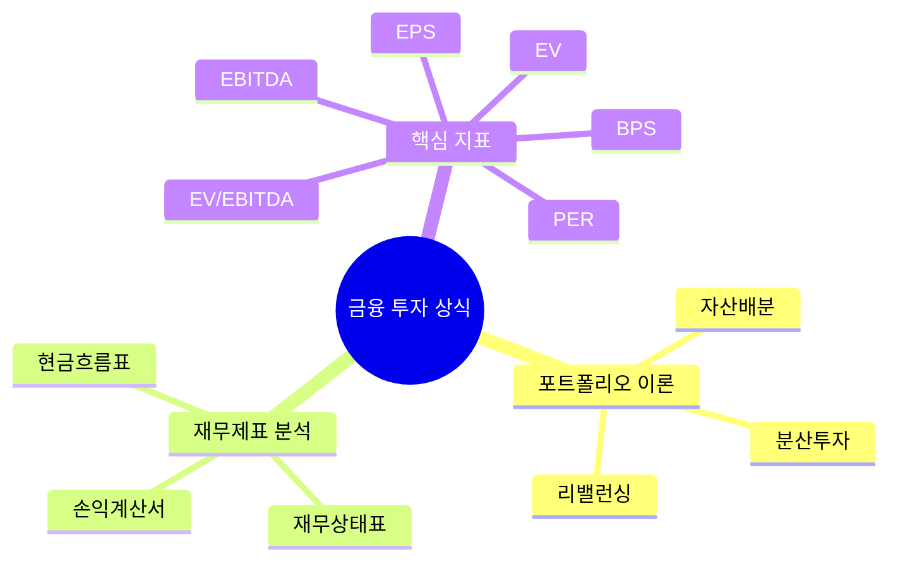

# 260311 금융 투자 상식 가이드

금융 투자는 결국 "좋은 자산을 적정한 가격에, 내 위험 감내 수준에 맞게 오래 보유할 수 있는가"의 문제다.  
이 글은 초보 투자자가 자주 마주치는 핵심 개념을 한 번에 연결해서 이해하도록 정리한 실전 입문서다.

---

## 1. 포트폴리오 이론

### 소개

포트폴리오 이론의 핵심은 **개별 종목을 잘 고르는 것**만큼이나 **여러 자산을 어떻게 조합하느냐**가 중요하다는 점이다.  
SEC Investor.gov는 분산투자를 "한 바구니에 달걀을 담지 말라"는 전략으로 설명한다. 즉, 한 자산이 흔들려도 다른 자산이 전체 손실을 완화하도록 구성하는 것이다.

현대 포트폴리오 이론(MPT, Modern Portfolio Theory)은 여기에 한 걸음 더 나아가, **기대수익률과 위험(변동성)을 함께 보고**, **같은 위험이면 더 높은 기대수익**, **같은 기대수익이면 더 낮은 위험**을 추구한다.

### 특징

- 자산을 개별로 보지 않고 조합으로 본다.
- 위험은 단순히 "손실 가능성"이 아니라 통계적으로는 변동성으로 다룬다.
- 상관관계가 낮은 자산을 섞을수록 포트폴리오 전체 변동성이 낮아질 수 있다.
- 자산배분, 분산투자, 리밸런싱이 핵심 운영 원리다.

### 장점

- 특정 종목 급락 리스크를 완화할 수 있다.
- 투자 판단이 "감"보다 구조로 바뀐다.
- 장기적으로 흔들림이 덜한 수익곡선을 만들기 쉽다.

### 단점

- 분산을 너무 넓히면 초과수익이 희석될 수 있다.
- 상관관계는 시장 위기 때 같이 높아질 수 있다.
- 과거 데이터 기반 최적화는 미래에도 그대로 맞는다는 보장이 없다.

### 간단 예제

한 자산에 100만 원을 모두 넣는 대신 아래처럼 나눈다.

| 자산 | 비중 | 기대 역할 |
|---|---:|---|
| 국내 주식 ETF | 50% | 성장 |
| 미국 주식 ETF | 30% | 지역 분산 |
| 채권 ETF | 20% | 변동성 완화 |

이 구조의 포인트는 "수익률 최대화"보다 **한 번에 크게 다치지 않는 것**에 있다.

### 실용 예제

직장인 장기 적립식 투자 예시:

- 월 100만 원 투자
- 국내 주식 ETF 30%
- 미국 주식 ETF 40%
- 국채/채권 ETF 20%
- 현금성 자산 10%

운영 방식:

1. 매월 같은 금액 적립
2. 반기 또는 연 1회 리밸런싱
3. 주식 비중이 목표보다 과도하게 커지면 일부를 채권/현금으로 이동
4. 투자 전 목표 기간, 비상금, 대출 금리부터 점검

아래 다이어그램처럼 생각하면 이해가 쉽다.


### 한 줄 요약

포트폴리오 이론은 "무엇을 살까?"보다 **"어떻게 섞을까?"**를 먼저 묻는 사고방식이다.

---

## 2. 재무제표 분석

### 소개

SEC의 재무제표 입문 가이드에 따르면 기업을 읽는 기본 도구는 네 가지다.

- 재무상태표(Balance Sheet)
- 손익계산서(Income Statement)
- 현금흐름표(Cash Flow Statement)
- 자본변동표(Statement of Shareholders' Equity)

투자자 입장에서는 보통 다음 세 질문으로 시작하면 된다.

1. 이 회사는 돈을 벌고 있는가?
2. 빚을 감당할 수 있는가?
3. 벌어들인 이익이 실제 현금으로 이어지는가?

### 특징

- 재무상태표는 특정 시점의 체력표다.
- 손익계산서는 일정 기간의 성적표다.
- 현금흐름표는 실제 현금의 움직임을 보여준다.
- 자본변동표는 이익 축적, 배당, 자사주 매입 등 주주 몫 변화를 보여준다.
- MD&A(경영진 해설)와 주석을 함께 읽어야 숫자의 맥락이 보인다.

### 장점

- 뉴스보다 느리지만 훨씬 구조적인 판단이 가능하다.
- 기업의 수익성, 안정성, 성장성, 현금창출력을 동시에 볼 수 있다.
- 고평가/저평가 논의 전에 "사업이 멀쩡한가"를 검증할 수 있다.

### 단점

- 회계 기준과 추정이 개입되므로 숫자만 맹신하면 위험하다.
- 성장주나 플랫폼 기업은 현재 이익보다 미래 기대가 더 큰 경우가 있다.
- 업종별로 봐야 할 포인트가 달라 단일 지표만으로 비교하면 왜곡된다.

### 간단 예제

가상의 회사 A:

- 매출 1,000억
- 영업이익 150억
- 순이익 100억
- 자산 2,000억
- 부채 800억
- 자본 1,200억

이때 빠르게 읽는 법:

- 영업이익률 = 150 / 1,000 = 15%
- 부채비율 = 800 / 1,200 = 66.7%
- 자산 = 부채 + 자본 성립 여부 확인

즉, "돈을 꽤 잘 벌고, 재무구조도 과도하게 나쁘지 않다"는 1차 해석이 가능하다.

### 실용 예제

Microsoft 2025 Annual Report 기준으로 보면:

- 매출: 281,724 million USD
- 영업이익: 128,528 million USD
- 순이익: 101,832 million USD
- 총자산: 619,003 million USD
- 총부채: 275,524 million USD
- 총자본: 343,479 million USD
- 현금 및 단기투자: 94,565 million USD

여기서 초보 투자자가 바로 볼 수 있는 포인트:

- 영업이익률 ≈ 128,528 / 281,724 = **45.62%**
- 부채비율 ≈ 275,524 / 343,479 = **0.80배**
- 자산과 부채+자본이 정확히 맞는다: 619,003 = 275,524 + 343,479

읽는 순서 추천:

1. 손익계산서에서 매출, 영업이익, 순이익 추세 확인
2. 재무상태표에서 현금, 부채, 자본 구조 확인
3. 현금흐름표에서 영업현금흐름이 순이익과 크게 괴리 없는지 확인
4. MD&A와 주석에서 왜 숫자가 변했는지 읽기


### 한 줄 요약

재무제표 분석은 "좋은 회사처럼 보이는가"가 아니라 **"숫자로도 좋은 회사인가"**를 확인하는 과정이다.

---

## 3. 자주 보는 주식 지표 정리

> 질문에 적힌 `EVITA`는 통상적인 재무 용어가 아니므로, 여기서는 실무에서 가장 많이 쓰는 **EBITDA**와 **EV/EBITDA** 기준으로 설명한다.

### EPS

- 뜻: 주당순이익(Earnings Per Share)
- 공식: `순이익 / 발행주식수`
- 의미: 주식 1주당 얼마의 이익을 벌었는지
- 장점: 기업 이익과 주당 가치 연결이 직관적
- 한계: 자사주 매입, 일회성 이익에 왜곡될 수 있음

간단 예제:

- 순이익 500억
- 주식수 1억 주
- EPS = 500원

실용 포인트:

- 과거 3~5년 EPS가 꾸준히 증가하는지 본다.
- 단기 급증이면 일회성 이익 여부를 주석에서 확인한다.

### BPS

- 뜻: 주당순자산(Book Value Per Share)
- 공식: `보통주 자본 / 발행주식수`
- 의미: 청산가치에 가까운 회계상 주당 순자산
- 장점: 자산주, 금융주, 제조업 비교에 유용
- 한계: 브랜드, 플랫폼, 소프트웨어 같은 무형가치를 잘 반영하지 못함

간단 예제:

- 자본 2,000억
- 주식수 1억 주
- BPS = 2,000원

실용 예제:

- Microsoft 2025 총자본 343,479 million USD
- 기말 주식수 7,434 million shares
- BPS ≈ **46.20 USD**

### PER

- 뜻: 주가수익비율(Price Earnings Ratio)
- 공식: `주가 / EPS`
- 의미: 현재 이익 기준으로 주가가 몇 배인지
- 장점: 가장 널리 쓰이는 밸류에이션 지표
- 한계: 적자 기업에는 의미가 약하고, 경기순환 업종에서는 왜곡될 수 있음

간단 예제:

- 주가 20,000원
- EPS 1,000원
- PER = 20배

실용 포인트:

- 반드시 같은 업종, 비슷한 성장률 기업끼리 비교한다.
- 높은 PER은 항상 고평가가 아니라, 고성장 기대를 반영한 결과일 수 있다.

### EBITDA

- 뜻: 이자, 세금, 감가상각비, 무형자산상각비 차감 전 이익
- 자주 쓰는 계산: `영업이익(EBIT) + 감가상각비 + 무형자산상각비`
- 의미: 본업의 현금창출력을 대략적으로 보기 위한 중간지표
- 장점: 자본구조와 회계정책 차이를 일부 걷어내고 비교 가능
- 한계: 실제 현금흐름이 아니고, 설비투자 부담을 무시할 수 있음

간단 예제:

- 영업이익 100억
- 감가상각비 20억
- 무형자산상각비 10억
- EBITDA = 130억

### EV

- 뜻: 기업가치(Enterprise Value)
- 공식: `시가총액 + 순차입금(총차입금 - 현금성자산)`의 단순형으로 많이 사용
- 의미: 회사를 통째로 산다고 볼 때의 총 가치
- 장점: 주식가치뿐 아니라 부채 구조까지 반영
- 한계: 현금성자산, 소수지분, 우선주 등 세부 조정이 실무에서 복잡함

간단 예제:

- 시가총액 1조
- 총차입금 2,000억
- 현금 1,000억
- EV = 1.1조

### EV/EBITDA

- 뜻: 기업가치를 EBITDA로 나눈 배수
- 공식: `EV / EBITDA`
- 의미: 본업 이익 대비 기업가치가 몇 배인지
- 장점: 인수합병, 업종 비교, 글로벌 비교에서 자주 쓰임
- 한계: EBITDA 자체가 비현금성 조정치라 과신하면 안 됨

간단 예제:

- EV 1.1조
- EBITDA 1,100억
- EV/EBITDA = 10배

실용 포인트:

- 같은 업종 안에서 비교해야 의미가 크다.
- 성장률, 마진, CAPEX 부담이 다른 회사끼리 단순 비교하면 오판할 수 있다.

### 영업이익

- 뜻: 본업으로 벌어들인 이익
- 공식: `매출 - 매출원가 - 판매관리비`
- 의미: 사업 자체의 수익성
- 장점: 본업 경쟁력을 보기 좋다
- 한계: 영업외손익, 금리 부담, 세금은 반영되지 않는다

### 자본

- 뜻: 자산에서 부채를 뺀 값
- 공식: `자산 - 부채`
- 의미: 주주 몫
- 장점: 재무안정성의 핵심 축
- 한계: 시장가치가 아니라 회계가치다

### 자산

- 뜻: 회사가 보유한 경제적 가치
- 예: 현금, 재고, 설비, 투자자산, 특허, goodwill
- 핵심 해석: "얼마나 가지고 있나"보다 **그 자산이 돈을 버는 구조인가**가 중요하다

### 부채

- 뜻: 회사가 갚아야 할 의무
- 예: 매입채무, 차입금, 리스부채, 선수금, 충당부채
- 핵심 해석: 부채 규모 자체보다 **상환능력**과 **금리 부담**을 같이 봐야 한다

### 잉여금

- 보통 투자 실무에서 자주 보는 것은 **이익잉여금(retained earnings)** 이다.
- 뜻: 과거 벌어들인 이익 중 배당하지 않고 회사에 남겨둔 누적 금액
- 의미: 기업이 내부에 축적한 이익의 기록
- 장점: 장기 누적 체력을 보는 데 유용
- 한계: 이익잉여금이 많아도 현금이 충분하다는 뜻은 아니다

Microsoft 2025 기준 이익잉여금은 **237,731 million USD**다.

---

## 4. 초보 투자자가 바로 적용하는 해석 순서

### 4-1. 회사 자체를 먼저 본다

- 매출이 커지는가
- 영업이익이 안정적인가
- 순이익이 들쭉날쭉하지 않은가

### 4-2. 재무구조를 본다

- 현금이 충분한가
- 부채가 자본 대비 과도하지 않은가
- 단기 갚아야 할 돈이 너무 많은가

### 4-3. 주당 지표를 본다

- EPS가 늘어나는가
- BPS가 축적되는가
- PER이 같은 업종 대비 과한가

### 4-4. 마지막으로 포트폴리오에 넣는다

좋은 회사여도 내 포트폴리오에 이미 비슷한 업종이 많다면 위험이 커진다.  
결국 **기업 분석**과 **포트폴리오 구성**은 따로가 아니라 함께 움직여야 한다.



---

## 5. 마무리

투자 공부는 지표를 많이 외우는 것보다, **각 지표가 서로 어떻게 연결되는지 이해하는 것**이 훨씬 중요하다.

- 포트폴리오 이론은 위험을 관리하는 틀이다.
- 재무제표 분석은 기업의 체력을 읽는 도구다.
- EPS, BPS, PER, EV, EBITDA는 그 체력을 가격과 연결하는 언어다.

초보 투자자라면 다음 순서만 습관화해도 크게 달라진다.

1. 재무제표로 회사 체력 확인
2. 지표로 가격 수준 확인
3. 포트폴리오 전체 위험 안에서 비중 결정

---

## 참고 및 웹 검색 URL

- SEC Investor.gov Diversification  
  https://www.investor.gov/introduction-investing/investing-basics/glossary/diversification
- SEC Investor.gov Beginners’ Guide to Asset Allocation, Diversification, and Rebalancing  
  https://www.investor.gov/additional-resources/general-resources/publications-research/info-sheets/beginners-guide-asset
- SEC Beginners' Guide to Financial Statement  
  https://www.sec.gov/about/reports-publications/investorpubsbegfinstmtguide
- SEC What is a balance sheet?  
  https://www.sec.gov/file/balance-sheet-building-blocks
- Investor.gov How to Read a 10-K  
  https://www.investor.gov/introduction-investing/getting-started/researching-investments/how-read-10-k
- Investor.gov Earnings Per Share  
  https://www.investor.gov/index.php/introduction-investing/investing-basics/glossary/earnings-share
- Investor.gov Price-earnings (P/E) Ratio  
  https://www.investor.gov/introduction-investing/investing-basics/glossary/price-earnings-pe-ratio
- CFI Book Value Per Share (BVPS)  
  https://corporatefinanceinstitute.com/resources/valuation/book-value-per-share-bvps/
- CFI Enterprise Value (EV)  
  https://corporatefinanceinstitute.com/resources/capital_markets/what-is-enterprise-value-ev/
- CFI What Is EBITDA?  
  https://corporatefinanceinstitute.com/resources/knowledge/finance/what-is-ebitda/
- Microsoft 2025 Annual Report  
  https://www.microsoft.com/investor/reports/ar25/index.html

---

## 작성 시 사용한 사용자 질문 프롬프트

```text
주제 : 금융 투자 상식
- 포트폴리오 이론
  - 소개
  - 특징
  - 장단점
  - 간단예제
  - 실용예제
- 재무재표 분석
  - 소개
  - 특징
  - 장단점
  - 간단예제
  - 실용예제
- 각종 주식 관련 지표
  - EPS
  - BPS
  - PER
  - EVITA
  - EV
  - 영업이익
  - 자본
  - 자산
  - 부채
  - 잉여금
  - ...
```
