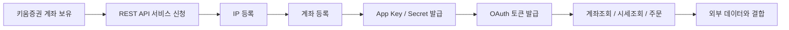
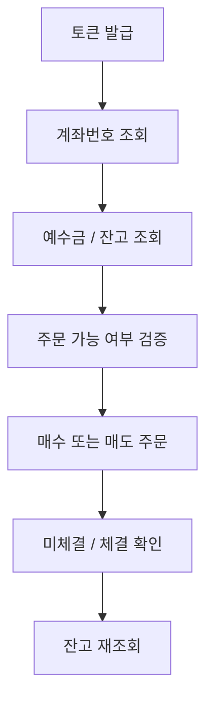
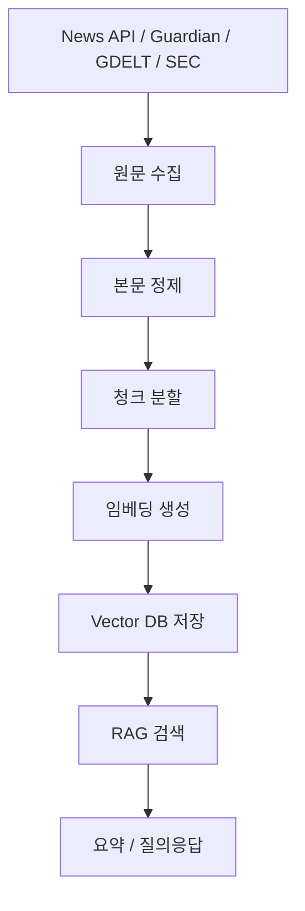

# 260311 키움증권 REST API 투자정보 가이드

키움증권 계좌를 이미 쓰고 있는 개발자 관점에서 보면, 투자 자동화는 크게 두 층으로 나뉜다.

- **실행 계층**: 계좌조회, 매수, 매도, 잔고 확인, 주문체결 확인
- **정보 계층**: 주가, 채권 수익률, 공시, SEC 문서, 경제뉴스 수집과 요약

이 글은 2026년 3월 11일 기준 공개 문서를 바탕으로, 키움증권 REST API를 중심으로 실제로 어떤 구조로 투자 시스템을 짤 수 있는지 정리한 실무형 가이드다.

---

## 1. 키움증권 계좌를 쓰는 상황에서의 전체 그림

키움 REST API는 키움증권 계좌 보유 고객이 사용할 수 있는 공식 API다.  
공식 안내에 따르면 실제투자와 모의투자는 App Key를 별도로 관리하고, OAuth 2.0 `client_credentials` 방식으로 접근토큰을 발급받는다. 또한 등록된 IP에서만 API 요청이 가능하다.

즉, 실전 구조는 보통 아래처럼 잡는다.



### 핵심 특징

- 공식 브로커 API라서 실제 주문 실행이 가능하다.
- REST 기반이라 Windows 전용 COM보다 언어/환경 제약이 적다.
- 모의투자 도메인도 별도로 제공된다.
- 계좌, 시세, 차트, 주문, 조건검색, 실시간 시세를 한 묶음으로 다룰 수 있다.

### 장점

- 키움 계좌를 직접 제어할 수 있어 자동매매 파이프라인의 마지막 단계에 적합하다.
- Python, JavaScript, Java 등 일반적인 HTTP 클라이언트로 사용 가능하다.
- 모의투자로 검증 후 실전 전환이 가능하다.

### 단점

- 키움 계좌와 신청 절차가 필요하다.
- IP 등록이 필요해서 서버 이전/재배포 때 운영 절차가 생긴다.
- 모의투자는 KRX만 지원된다고 공식 문서에 적혀 있다.
- 투자정보 조회는 가능하지만, "전 세계 뉴스/채권/거시지표"까지 모두 커버하는 데이터 플랫폼은 아니다.

---

## 2. 키움증권에서 채권은 어떻게 사나?

### 소개

키움에서 채권은 주식처럼 "아무 채권이나 REST로 바로 산다"기보다는 **상품 종류와 거래 채널에 따라 접근 방식이 다르다**.

공식 채권 안내를 보면:

- **해외채권**은 온라인 중개신청 흐름이 존재한다.
- 외화채권은 결제 지연, 환율 위험, 유동성 위험, 중도환매 손실 가능성 등을 명시하고 있다.
- 키움 사이트는 채권/금융상품 전용 상담번호도 별도로 제공한다.

### 실무 해석

현재 공개된 키움 REST API 가이드는 주로 **국내주식/금현물 중심**으로 정리되어 있고, 공개 가이드에서 바로 확인되는 주문 카테고리도 주식과 금현물 위주다.  
따라서 **채권 매수는 REST 자동주문보다 HTS/MTS/웹 또는 전용 상품 채널로 처리하고**, 자동화는 주로 **채권 관련 정보 조회, 금리 조회, 포트폴리오 기록 관리** 쪽에 두는 편이 현실적이다.

### 키움에서 채권을 접근하는 현실적 방법

1. **해외채권 웹/모바일 중개신청**
2. **HTS/MTS에서 채권 상품 탐색**
3. **금융상품 상담채널 문의**
4. **자동화는 직접 주문보다 보조 도구로 사용**

예를 들어:

- 미국 국채 ETF 매수는 주식 REST 주문으로 자동화 가능
- 개별 해외채권 매수는 키움 상품 화면/중개신청으로 처리
- 채권금리/수익률/만기구조 모니터링은 외부 무료 API로 자동화

### 장점

- 키움 계좌 안에서 주식, ETF, 일부 채권성 상품까지 통합 운용이 쉽다.
- 해외채권 전용 안내와 온라인 중개신청 흐름이 있다.

### 단점

- 공개 REST 가이드만 보면 개별 채권 주문 자동화 범위가 제한적으로 보인다.
- 채권은 호가, 유동성, 결제 구조가 주식보다 복잡하다.
- 환율과 신용위험까지 동시에 관리해야 한다.

---

## 3. 키움 REST API 사용법

## 3-1. 소개

공식 API 가이드 기준 핵심은 다음 네 가지다.

- 운영 도메인: `https://api.kiwoom.com`
- 모의투자 도메인: `https://mockapi.kiwoom.com`
- 토큰 발급 URL: `/oauth2/token`
- 인증 방식: OAuth 2.0 `client_credentials`

## 3-2. 등록법

키움 REST API 서비스 이용안내 기준 절차:

1. 키움증권 계좌 보유
2. REST API 서비스 신청
3. IP 등록
4. 계좌 등록
5. App Key / App Secret 다운로드
6. 토큰 발급 후 API 호출

공식 문서상 주의점:

- 실제투자와 모의투자 App Key는 별도 관리
- IP는 최대 10개까지 등록 가능
- 계좌 등록은 실전/모의 각각 최대 20개까지 추가 가능
- App Key와 Secret 다운로드는 1회성으로 안내됨

## 3-3. 특징

- REST + JSON 기반
- `authorization`, `api-id` 헤더 사용
- 연속조회 시 `cont-yn`, `next-key` 헤더 사용
- 주문, 계좌, 시세, 차트, 조건검색, 실시간시세까지 제공

## 3-4. 장점

- 웹 표준 방식이라 개발 생산성이 좋다.
- 헤드리스 서버에서 다루기 쉽다.
- 키움 공식 계좌 기능과 바로 연결된다.

## 3-5. 단점

- 브로커 API라 실패 처리와 재시도 설계가 반드시 필요하다.
- 토큰 만료, 주문 가능 시간, 시장 상태, 계좌 상태를 같이 봐야 한다.
- 실전 거래에서는 모의투자와 체결 품질이 다를 수 있다.

---

## 4. 키움 REST API 핵심 엔드포인트

### 4-1. 접근토큰 발급

- `POST https://api.kiwoom.com/oauth2/token`
- TR: `au10001`

요청 body:

```json
{
  "grant_type": "client_credentials",
  "appkey": "YOUR_APP_KEY",
  "secretkey": "YOUR_SECRET_KEY"
}
```

### 4-2. 계좌번호 조회

공식 모바일 가이드 기준:

- `POST https://api.kiwoom.com/api/dostk/acnt`
- TR: `ka00001`
- 설명: 현재 토큰의 계좌번호 조회

### 4-3. 주식 매수주문

공식 모바일 가이드 기준:

- `POST https://api.kiwoom.com/api/dostk/ordr`
- TR: `kt10000`

주요 body 필드:

- `dmst_stex_tp`: `KRX`, `NXT`, `SOR`
- `stk_cd`: 종목코드
- `ord_qty`: 주문수량
- `ord_uv`: 주문단가
- `trde_tp`: 주문유형

### 4-4. 주식 매도주문

동일한 주문 엔드포인트를 사용하며, TR 목록상 **주식 매도주문은 `kt10001`** 이다.

### 4-5. 계좌 평가 / 잔고 조회

공식 가이드 목록상 `계좌` 카테고리에는 다음 TR이 있다.

- `kt00004` 계좌평가현황요청
- `kt00018` 계좌평가잔고내역요청
- `kt00001` 예수금상세현황요청

이 계좌 TR들은 공식 검색 결과상 `/api/dostk/acnt` 계열로 제공된다.

### 4-6. 실시간 시세

공식 가이드 목록상 실시간 시세/시세 관련 항목:

- `ka10001` 주식기본정보요청
- `ka10004` 주식호가요청
- `ka10086` 일별주가요청
- 실시간 코드 `0B` 주식체결
- 실시간 코드 `0C` 주식우선호가
- 실시간 코드 `0D` 주식호가잔량

즉, **REST는 조회/주문**, **WebSocket은 실시간 체결/호가 감시**로 나누는 것이 맞다.

---

## 5. 간단 예제

### 5-1. 토큰 발급 `curl`

```bash
curl -X POST "https://api.kiwoom.com/oauth2/token" \
  -H "Content-Type: application/json;charset=UTF-8" \
  -d '{
    "grant_type": "client_credentials",
    "appkey": "YOUR_APP_KEY",
    "secretkey": "YOUR_SECRET_KEY"
  }'
```

### 5-2. 계좌번호 조회 Python

```python
import requests

BASE_URL = "https://api.kiwoom.com"
TOKEN = "YOUR_ACCESS_TOKEN"

headers = {
    "Authorization": f"Bearer {TOKEN}",
    "api-id": "ka00001",
    "Content-Type": "application/json;charset=UTF-8",
}

resp = requests.post(f"{BASE_URL}/api/dostk/acnt", headers=headers, json={})
resp.raise_for_status()
print(resp.json())
```

### 5-3. 주식 매수 예제 Python

```python
import requests

BASE_URL = "https://api.kiwoom.com"
TOKEN = "YOUR_ACCESS_TOKEN"

headers = {
    "Authorization": f"Bearer {TOKEN}",
    "api-id": "kt10000",
    "Content-Type": "application/json;charset=UTF-8",
}

payload = {
    "dmst_stex_tp": "KRX",
    "stk_cd": "005930",
    "ord_qty": "1",
    "ord_uv": "0",
    "trde_tp": "3"
}

resp = requests.post(f"{BASE_URL}/api/dostk/ordr", headers=headers, json=payload)
resp.raise_for_status()
print(resp.json())
```

위 예시는 **시장가 1주 매수 형태**로 읽으면 된다.  
실전 사용 전에는 반드시 모의투자에서 먼저 검증해야 한다.

---

## 6. 실용 예제: 계좌조회, 사기(매수), 팔기(매도)

### 추천 운용 흐름



### 실전 체크리스트

- 주문 전에 계좌번호 조회가 성공하는지 확인
- 예수금상세현황과 주문가능금액을 먼저 확인
- 모의투자에서 `kt10000`, `kt10001` 요청 포맷 검증
- 주문 직후 미체결/체결 TR로 상태 조회
- 체결 후 계좌평가잔고내역 재조회

### 매수/매도 운영 팁

- 매수 로직은 "신호 발생"보다 "주문 가능 검증"이 더 중요하다.
- 시장가 주문은 편하지만 슬리피지가 커질 수 있다.
- 서버 재기동 시 중복주문 방지 키를 따로 관리해야 한다.
- 실제 자동매매는 반드시 주문 로그와 원장 테이블을 별도로 남겨야 한다.

---

## 7. 주식가격, 채권가격, 투자정보를 무료 REST로 조회하는 방법

여기서 중요한 결론부터 말하면, **무료 REST 하나로 주식/채권/뉴스/공시/거시를 모두 고품질로 해결하는 서비스는 없다.**  
대신 목적별로 조합하면 충분히 쓸 만한 구성이 나온다.

## 7-1. 주식가격

### 1순위: 키움 REST API

- 장점: 실제 거래 계좌와 연결됨
- 단점: 키움 고객 전제
- 추천 용도: 한국 주식 실행 직전 조회, 계좌 연동형 자동매매

### 2순위: Alpha Vantage

공식 문서 기준:

- 무료 API 키 제공
- 무료 플랜은 **하루 25회 요청**
- 문서상 글로벌 주식 시계열 데이터는 **20년 이상 히스토리**를 제공
- 다만 일부 `full` 히스토리 옵션과 실시간/15분 지연 데이터는 프리미엄 제약이 있다

적합한 경우:

- 간단한 백테스트
- 해외 주식/ETF 가격 조회
- 작은 개인 프로젝트

부적합한 경우:

- 고빈도 실시간 시스템
- 대량 호출

예시:

```text
https://www.alphavantage.co/query?function=TIME_SERIES_DAILY_ADJUSTED&symbol=MSFT&apikey=YOUR_KEY
```

## 7-2. 채권가격 / 금리 정보

### 미국 국채/금리: FRED API + U.S. Treasury Fiscal Data

FRED API는 시계열 경제지표에 가장 안정적이다.

- 장점: 무료, 공식, 장기 시계열 강함
- 단점: 개별 회사채 체결가보다는 지표/수익률 중심

적합 데이터:

- 10년물 국채수익률
- 회사채 스프레드
- 기준금리
- 경기지표

예시:

```text
https://api.stlouisfed.org/fred/series/observations?series_id=DGS10&api_key=YOUR_KEY&file_type=json
```

### 미국 지방채: EMMA

MSRB의 EMMA는 공식적으로 **municipal bond 데이터와 공시 문서의 무료 공개 소스**다.

- 장점: 지방채 실거래 가격, 공시, 신용등급 등 확인 가능
- 단점: 일반적인 공개 REST 개발 경험은 주식 API보다 덜 단순함
- 적합 용도: 미국 지방채 조사, 가격 확인, 공시 문서 조사

### 기업 회사채 일반

FINRA Query API는 공식적으로 **Fixed Income** 데이터셋을 포함하며, **Public Credential은 월 0달러**로 공개 데이터를 조회할 수 있다.  
다만 문서상 사용량 제한과 자격 증명 유형 차이가 존재하고, 조직/기업용 자격 증명은 유료 정책이 있다.

### 실무 결론

- **직접 채권 주문**: 키움 HTS/MTS/상품채널
- **채권 ETF 자동매매**: 키움 REST 주문
- **미국 금리/채권지표 수집**: FRED / Treasury
- **미국 회사채/고정수익 공개 데이터 탐색**: FINRA Query API
- **미국 지방채 조사**: EMMA

---

## 8. SEC 문서 조회 방법

SEC 쪽은 오히려 무료 REST가 매우 강하다.

## 8-1. 공식 REST API

SEC 공식 문서 기준:

- `data.sec.gov`는 JSON 기반 RESTful API
- **인증이나 API 키가 필요 없다**
- 실시간에 가깝게 갱신된다

핵심 엔드포인트:

- 제출 이력: `submissions`
- 회사 전체 XBRL 팩트: `companyfacts`
- 특정 개념: `companyconcept`
- 동일 기간 비교: `frames`

예시:

```text
https://data.sec.gov/api/xbrl/companyfacts/CIK0000789019.json
```

위 URL은 Microsoft의 company facts 예시로 사용할 수 있다.

## 8-2. SEC 검색 UI

공식 EDGAR Full-Text Search는 **2001년 이후 전자공시의 전체 텍스트 검색**을 지원한다.

장점:

- 키워드, 회사명, CIK, 폼 타입으로 검색 가능
- 날짜 필터 가능
- 첨부문서와 본문 검색 가능

단점:

- 대량 수집 자동화는 API/아카이브가 더 낫다

## 8-3. 추천 사용 패턴

1. 회사명 또는 티커로 CIK 확보
2. `submissions` API로 최근 10-K, 10-Q, 8-K 목록 수집
3. `companyfacts` API로 매출, 영업이익, 자산 등 정형 데이터 확보
4. 텍스트 분석이 필요하면 filing 원문 HTML 추가 수집

---

## 9. 경제뉴스 조회 방법

요구 조건이 까다롭다.

- 최근 뉴스부터 20년 전 뉴스까지
- 무료 선호
- REST 선호
- 가능하면 요약 / 벡터DB

결론부터 말하면:

**단일 무료 REST로 "멀티소스 경제뉴스 20년 전체 + 전문 검색 + 상업적 자유사용"을 동시에 만족하는 솔루션은 찾기 어렵다.**

그래서 아래처럼 나누는 것이 현실적이다.

## 9-1. 최근 뉴스 중심: NewsAPI

공식 문서 기준:

- `/v2/everything` 제공
- **지난 5년** 기사 검색 가능
- 개발용 무료 API 키 제공

장점:

- REST가 단순하다
- 기사 검색/필터링이 쉽다

단점:

- 20년 범위는 안 된다
- 무료 플랜은 개발용 성격이 강하다

## 9-2. 장기 아카이브 단일 매체: Guardian Open Platform

Guardian 공식 문서 기준:

- 1999년부터의 콘텐츠 접근 가능
- 개발자 키 제공
- 비상업적 사용은 무료
- 기사 본문 접근 가능

장점:

- 20년 범위를 사실상 충족
- 기사 텍스트 수집 가능

단점:

- Guardian 단일 매체
- 상업 사용은 별도 조건

## 9-3. 멀티소스 장기 흐름 분석: GDELT

GDELT는 공식적으로 전체 데이터가 무료/오픈이며, Event Database는 **1979년부터의 데이터 파일**을 제공한다.  
다만 DOC 2.0 API 관련 공식 글을 보면 문서 검색 범위는 **2017년 1월 1일 이후** 기준으로 설명된다.

즉:

- **장기 이벤트/토픽 추세**: GDELT 강함
- **20년치 기사 본문 검색 REST**: 한계 있음

적합 용도:

- "금리 인상", "인플레이션", "공급망" 같은 경제 이슈의 장기 언론량 추세
- 날짜별 토픽 빈도 분석
- 뉴스 원문 URL 수집

## 9-4. 실무 추천 조합

### 최근 5년

- NewsAPI 또는 GDELT DOC 2

### 1999년 이후 단일 품질 매체

- Guardian Open Platform

### 1979년 이후 장기 이벤트 데이터

- GDELT Event Database / GKG

### 2001년 이후 기업 공시 기반 뉴스 대체

- SEC EDGAR Full Text + filing text

---

## 10. 뉴스 요약과 Vector DB는 가능한가?

가능하다. 오히려 이렇게 해야 검색 품질이 좋아진다.

### 추천 구조



### 구현 아이디어

- 저장 메타데이터:
  - `title`
  - `published_at`
  - `source`
  - `url`
  - `ticker`
  - `country`
  - `topic`
- 청크 크기:
  - 기사 본문 기준 500~1,000 토큰
- 요약 전략:
  - 기사별 1차 요약
  - 날짜별/주제별 2차 요약
- 검색 전략:
  - `keyword + vector hybrid`

### 무료 선호 기준 추천

- 소규모 개인 프로젝트: 로컬 `SQLite + FTS5` 또는 `FAISS`
- 조금 더 구조화: 로컬 `pgvector`
- 뉴스 건수가 커지면: 전용 Vector DB

이 부분은 위 소스들을 바탕으로 한 **구현 권장안**이며, 특정 서비스의 상용 정책은 별도 확인이 필요하다.

---

## 11. 현실적인 추천 아키텍처

키움증권 계좌를 이미 쓰고 있고, REST 중심에 무료 선호라면 아래 구성이 가장 현실적이다.

### 실행

- 주문/잔고/계좌조회: **키움 REST API**

### 주가

- 한국 실거래 직전 조회: **키움 REST**
- 해외/백테스트: **Alpha Vantage**

### 채권/금리

- 금리/국채 수익률: **FRED**
- 미국 지방채 조사: **EMMA**
- 개별 채권 매수 실행: **키움 상품 채널**

### 공시

- 미국 공시: **SEC data.sec.gov + EDGAR Search**

### 뉴스

- 최근 검색: **NewsAPI**
- 20년 단일 매체 아카이브: **Guardian**
- 장기 멀티소스 이벤트 분석: **GDELT**

### 요약/검색

- 기사 원문 저장 + 임베딩 + Vector DB + RAG

---

## 12. 마무리

키움 REST API는 **"거래 실행"** 에 매우 강하고, SEC/FRED/GDELT/Guardian 같은 무료 공개 소스는 **"정보 수집"** 에 강하다.  
그래서 투자 시스템은 하나의 API로 끝내려 하지 말고 아래처럼 분리하는 편이 좋다.

1. **키움**으로 주문과 계좌를 처리한다.
2. **SEC / FRED / 뉴스 API**로 외부 정보를 수집한다.
3. **Vector DB + 요약 계층**으로 사람이 읽기 쉬운 형태로 압축한다.

이 구조가 제일 단순하고, 유지보수도 쉽고, 나중에 다른 브로커를 붙일 때도 확장성이 좋다.

---

## 참고 및 웹 검색 URL

- 키움 REST API 메인  
  https://openapi.kiwoom.com/
- 키움 REST API 서비스 이용안내  
  https://openapi.kiwoom.com/intro/serviceInfo
- 키움 REST API 가이드  
  https://openapi.kiwoom.com/guide/apiguide
- 키움 REST API 모바일 가이드  
  https://openapi.kiwoom.com/m/guide/apiguide
- 키움 REST API 주문 가이드 (`kt10000`)  
  https://openapi.kiwoom.com/m/guide/apiguide?jobTpCode=13
- 키움 REST API 계좌 가이드 (`ka00001`)  
  https://openapi.kiwoom.com/m/guide/apiguide?jobTpCode=08
- 키움 해외채권 안내  
  https://kiwoom.com/wm/bnd/fb040/fbInfoView
- 키움 고객센터 / 금융상품 연락처  
  https://kiwoom.com/m/customer/center/VCenterInfoView
- SEC EDGAR APIs  
  https://www.sec.gov/search-filings/edgar-application-programming-interfaces
- SEC EDGAR Full Text Search  
  https://www.sec.gov/edgar/search/index.html
- FRED API  
  https://fred.stlouisfed.org/docs/api/fred/
- U.S. Treasury Fiscal Data API 문서  
  https://fiscaldata.treasury.gov/api-documentation/
- Alpha Vantage 문서  
  https://www.alphavantage.co/documentation/
- Alpha Vantage 지원/무료키/호출 제한  
  https://www.alphavantage.co/support/
- FINRA Query API  
  https://developer.finra.org/products/query-api
- FINRA Fixed Income Data  
  https://www.finra.org/finra-data/fixed-income
- MSRB EMMA  
  https://emma.msrb.org/
- MSRB About EMMA  
  https://www.msrb.org/Transparency-and-Technology/About-EMMA
- Guardian Open Platform  
  https://open-platform.theguardian.com/
- Guardian Open Platform Get Started  
  https://open-platform.theguardian.com/access/
- NewsAPI 문서  
  https://newsapi.org/docs
- NewsAPI Endpoints  
  https://newsapi.org/docs/endpoints
- GDELT 메인  
  https://www.gdeltproject.org/
- GDELT Event Files  
  https://data.gdeltproject.org/events/
- GDELT DOC 2.0 범위 관련 글  
  https://blog.gdeltproject.org/doc-2-0-updates-1-5-year-searching-and-updated-mobile-interface/

---

## 작성 시 사용한 사용자 질문 프롬프트

```text
주제
- 키움증권계좌 이용하는 상황
- 채권구매 방법?
- 증권 REST api 사용 방법?  
  - 소개
  - 특징
  - 장단점
  - 사용법
  - 등록법
  - 간단예제
  - 실용예제
  - 계좌조회, 사기, 팔기
- 주식가격, 채권가격 등 각종 투자정보 조회방법
  - REST 기반선호
  - 무료 선호
- SEC 문서 조회 방법
  - REST 기반선호
  - 무료 선호
- 경제뉴스 조회 방법
  - 최근부터 20년전까지 모든 날짜 지원
  - 무료 선호
  - 뉴스에 대한 요약 혹은 vector DB 사용가능하면 더 좋음.
```
