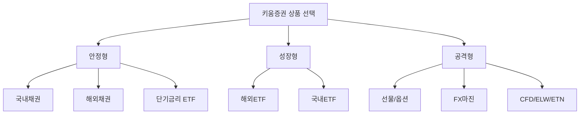
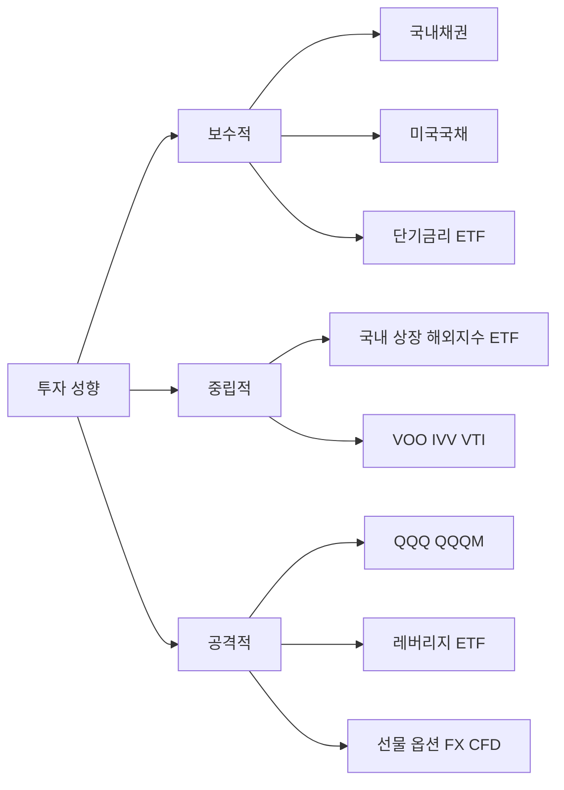

# 260311 키움증권 상품군별 가이드

키움증권 안에서 자주 비교되는 상품군을 한 번에 정리했다.  
대상은 `해외채권`, `국내채권`, `해외ETF`, `국내ETF`, `그 외 파생상품`이다.  
기준 시점은 `2026-03-11 21:25 KST`이며, 거래시간과 제도는 바뀔 수 있다.

> 메모  
> 이 문서의 `주요상품소개(TOP30)`은 “키움증권 공식 판매순위 30선”이 아니라, 키움에서 실제로 검토 빈도가 높은 대표 상품군과 대표 ETF를 실무 기준으로 묶은 30선이다.

## 한눈에 보는 결론

- `안정성 우선`이면 국내채권, 미국국채 중심 해외채권, 단기금리형 국내ETF가 먼저다.
- `중장기 적립`이면 해외ETF와 국내 상장 해외지수 ETF가 가장 단순하다.
- `단기 방향성/레버리지`는 선물·옵션·ELW·CFD가 맞지만 난이도와 리스크가 가장 높다.
- `키움에서의 사용성`은 국내ETF/국내채권/해외ETF 순으로 직관적이고, 파생상품은 사전교육·기본예탁금·전문투자자 요건이 붙는다.

## 구조 그림



## 1. 해외채권

### 소개
키움에서는 `해외채권(온라인)`으로 미국국채, KP물, 기타 중개 외화채권, 브라질채권 등을 취급한다. 달러채권과 현지통화채권을 함께 볼 수 있어 금리와 환율을 동시에 고려하는 상품군이다.

### 특징
- 미국국채/KP물은 비교적 표준화돼 있고 이해가 쉽다.
- 브라질채권은 금리 매력이 크지만 환율과 국가위험이 크다.
- 일부 상품은 `당일결제(T+0)`와 `T+2` 결제가 섞여 있다.

### 장점
- 주식 대비 현금흐름 예측이 쉽다.
- 금리 하락기에는 채권 가격 상승 여지도 있다.
- 미국국채는 글로벌 안전자산 성격이 강하다.

### 단점
- 환율 손익이 수익률을 크게 흔든다.
- 신흥국채는 신용위험과 세제/정책 리스크가 크다.
- 중도 환매/유동성 측면에서 주식형 ETF보다 불편할 수 있다.

### 거래방식
- 키움 홈페이지, 영웅문4, 영웅문S에서 온라인 거래 가능
- 해외채권 매수 전 입금/환전 필요
- 미국국채/KP물과 브라질채권의 주문 방식과 결제 방식이 다름

### 거래시간
- 미국국채/KP물, 기타 중개외화채권: `영업일 09:00~15:00`
- 브라질채권: `24시간 주문 가능`, 다만 `오전 11시 이전 건 당일`, 이후 건은 익일 접수 처리

### 해외채권 대표 상품군

| 구분 | 대표 예시 | 코멘트 |
|---|---|---|
| 1 | 미국국채 2년/5년/10년물 | 가장 표준적인 금리 투자 |
| 2 | KP물(한국계 해외채권) | 달러채권이지만 국내 투자자 친화적 |
| 3 | 브라질 국채 | 고금리·고변동성 |
| 4 | 멕시코 국채 | 신흥국 금리 분산 대안 |
| 5 | 영국 국채 | 선진국 금리 분산용 |

## 2. 국내채권

### 소개
키움에서는 `장외채권`, `장내채권`, `단기사채`, `신종자본증권` 등으로 국내채권을 접근할 수 있다. 예금보다 다양한 만기와 금리를 선택할 수 있지만, 발행사 신용과 유동성을 직접 봐야 한다.

### 특징
- 장외채권은 상품별 조건을 보고 고르는 방식이다.
- 장내채권은 거래소 시장 가격을 보며 주문한다.
- 단기사채는 만기 짧은 현금성 운용에 가깝다.

### 장점
- 만기와 금리 구조를 직접 선택 가능
- 국내 원화자산이라 환리스크가 없음
- 예금보다 다양한 듀레이션 운용 가능

### 단점
- 발행사 신용위험 존재
- 일부 채권은 유동성이 낮음
- 채권가격, 표면금리, 세후수익률을 같이 봐야 해서 초보자 진입장벽이 있음

### 거래방식
- 키움 자산관리 메뉴에서 장외채권/장내채권 주문
- HTS, 스마트폰, 홈페이지 채널 제공
- 일반 주문과 예약 주문이 분리됨

### 거래시간
- 일반 주문: `영업일 09:00~17:00`
- 예약 주문: `영업일 17:20~익일 08:40`, 비영업일 `00:00~24:00`

### 국내채권 대표 상품군

| 구분 | 대표 예시 | 코멘트 |
|---|---|---|
| 6 | 국고채 3년 | 기준금리 민감도 적당 |
| 7 | 국고채 10년 | 금리 방향성 반영 큼 |
| 8 | 통안채 | 초단기~중단기 안전자산 성격 |
| 9 | AA급 회사채 | 국채보다 높은 금리 추구 |
| 10 | 은행채·여전채 | 신용과 스프레드 비교 필요 |

## 3. 해외ETF

### 소개
키움에서 해외ETF는 사실상 `해외주식 주문 화면`에서 거래하는 구조다. 미국 ETF가 핵심이며, 주식처럼 실시간 매매가 가능하고 섹터·지수·배당·채권·원자재를 한 계좌에서 다룰 수 있다.

### 특징
- 미국 상장 ETF가 중심
- 원화주문 서비스 사용 가능
- 키움은 미국주식 `주간거래`도 별도 지원

### 장점
- 한 종목으로 광범위한 분산투자 가능
- 정보 접근성이 좋고 상품 풀이 매우 넓음
- 장기 적립과 전술적 매매를 모두 소화 가능

### 단점
- 환율 리스크 존재
- 배당·세금 구조를 국내 ETF보다 더 챙겨야 함
- 해외 상장 ETF는 국내 세제 계좌 활용성이 제한될 수 있음

### 거래방식
- 영웅문G, 영웅문SG, 홈페이지 해외주식 주문 화면에서 거래
- 원화주문 신청 시 자동환전 방식 사용 가능
- 미국주식 주간거래는 별도 신청 없이 기존 해외주식 주문화면에서 가능

### 거래시간
- 미국주식 주간거래: `서머타임 09:00~16:45`, `비서머타임 10:00~17:45` (한국시간)
- 미국 정규장은 일반적으로 `서머타임 22:30~05:00`, `비서머타임 23:30~06:00` (한국시간, 거래소 기준)

### 해외ETF 대표 8선

| 구분 | 티커 | 성격 | 한줄 요약 |
|---|---|---|---|
| 11 | VOO | 미국 S&P500 | 장기 코어의 대표 |
| 12 | IVV | 미국 S&P500 | 초대형 저비용 코어 |
| 13 | SPY | 미국 S&P500 | 유동성 중심 트레이딩 대표 |
| 14 | VTI | 미국 전체주식 | 미국 시장 전체 보유 |
| 15 | QQQ | 나스닥100 | 대형 기술주 집중 |
| 16 | QQQM | 나스닥100 | QQQ의 저비용 대안 |
| 17 | SCHD | 배당주 | 배당/퀄리티 선호층 대표 |
| 18 | GLD | 금 | 인플레이션·위기 헷지 |

## 4. 국내ETF

### 소개
국내ETF는 키움에서 가장 접근이 쉬운 상품군 중 하나다. 국내주식처럼 거래하며, 국내지수뿐 아니라 미국지수·채권·원자재·테마도 원화로 거래할 수 있다.

### 특징
- 주식처럼 실시간 매매
- 레버리지/인버스/파생형은 별도 신청과 교육 필요
- 해외지수를 추종하는 국내 상장 ETF도 폭넓게 존재

### 장점
- 원화 거래라 환전 절차가 단순
- ISA, 연금 등 계좌 활용성이 좋음
- 세금과 신고가 해외직구 ETF보다 단순한 편

### 단점
- 해외 기초자산 ETF는 괴리율·환헤지 구조를 봐야 함
- 테마형은 유행이 빠르고 변동성이 큼
- 레버리지·인버스는 장기 보유에 불리할 수 있음

### 거래방식
- 홈페이지, 영웅문4, 영웅문S#/영웅문S 에서 거래
- 파생상품 ETF는 거래신청 필요
- 레버리지 ETF/ETN은 사전교육과 기본예탁금 확인 필요

### 거래시간
- KRX 정규장: `09:00~15:30`
- 장개시 전 시간외: `08:00~09:00`
- 장종료 후 시간외: `15:40~18:00`
- 키움 가이드 기준 NXT는 `향후 ETF/ETN 포함 예정`으로 안내됨

### 국내ETF 대표 7선

| 구분 | 종목명 | 성격 | 한줄 요약 |
|---|---|---|---|
| 19 | KODEX 200 | 국내 대형주 | 국내 대표지수 코어 |
| 20 | TIGER 미국S&P500 | 해외지수 국내상장 | 미국지수 원화 투자 |
| 21 | TIGER 미국나스닥100 | 해외기술주 국내상장 | 나스닥 장기 적립 대표 |
| 22 | KODEX CD금리액티브(합성) | 단기금리 | 현금 대기성 자금 운용 |
| 23 | TIGER 미국테크TOP10 INDXX | 빅테크 테마 | 미국 대형 기술주 압축 |
| 24 | KODEX 레버리지 | 2배 지수형 | 단기 공격형 |
| 25 | KODEX 인버스 | 하락 베팅 | 헤지/단기 대응 |

## 5. 그 외 파생상품들

### 소개
키움에서 파생상품은 `국내 선물/옵션`, `해외선물/옵션`, `FX마진`, `CFD`, `ELW`, `ETN`까지 넓다. 이 영역은 수익 기회가 큰 만큼 규제, 증거금, 강제청산, 사전교육이 함께 따라온다.

### 공통 특징
- 레버리지가 붙는다.
- 손실 속도가 빠르다.
- 거래 전 신청, 교육, 적격성, 전문투자자 요건 확인이 중요하다.

### 장점
- 상승/하락/변동성/환율까지 전략 구성이 가능
- 헷지 수단으로 유용
- 적은 자본으로 큰 익스포저 가능

### 단점
- 강제청산 위험
- 상품 구조가 복잡
- 초보자에게는 손익 관리가 매우 어려움

### 거래방식
- 국내 선물/옵션: 키움 국내 파생 메뉴에서 거래
- 해외선물/옵션: 영웅문G, 영웅문SG
- FX마진: 전용 FX마진 화면
- CFD: 전문투자자 요건 충족 후 신청
- ELW: 거래신청 + 교육이수 필요
- ETN: 국내 ETF와 유사하게 거래하되 발행사 신용위험 존재

### 거래시간
- 국내 장내파생 정규거래: 대표 지수파생 기준 `08:45~15:35` 연속거래 구간 중심
- 국내 장내파생 야간거래: `18:00~익일 05:50`, 종가단일가 포함 시 `06:00` 종료
- FX마진: `07:25~익일 07:00`, 서머타임 시 `06:25~익일 06:00`
- CFD 해외주식 예시: 키움 안내 기준 `프리마켓 20:00~22:30 / 정규장 22:30~익일 05:00`
- 해외선물/옵션: 상품별 상이, 사실상 `거래소별 장시간 연속거래` 구조

### 파생 대표 5선

| 구분 | 상품 | 성격 | 핵심 유의점 |
|---|---|---|---|
| 26 | KOSPI200 선물 | 국내 대표 지수선물 | 증거금·롤오버 관리 필요 |
| 27 | KOSPI200 옵션 | 변동성/방향성 | 시간가치 손실 큼 |
| 28 | 해외선물(E-mini Nasdaq, WTI 등) | 글로벌 매크로/지수/원자재 | 상품별 거래시간 상이 |
| 29 | FX마진 | 통화 레버리지 | 24시간에 가까운 변동성 |
| 30 | CFD / ELW / ETN | 고위험 전술상품 | 구조 이해 전 진입 금지 |

## TOP30 요약 표

| 번호 | 분류 | 상품 |
|---|---|---|
| 1 | 해외채권 | 미국국채 2년/5년/10년 |
| 2 | 해외채권 | KP물 |
| 3 | 해외채권 | 브라질 국채 |
| 4 | 해외채권 | 멕시코 국채 |
| 5 | 해외채권 | 영국 국채 |
| 6 | 국내채권 | 국고채 3년 |
| 7 | 국내채권 | 국고채 10년 |
| 8 | 국내채권 | 통안채 |
| 9 | 국내채권 | AA급 회사채 |
| 10 | 국내채권 | 은행채·여전채 |
| 11 | 해외ETF | VOO |
| 12 | 해외ETF | IVV |
| 13 | 해외ETF | SPY |
| 14 | 해외ETF | VTI |
| 15 | 해외ETF | QQQ |
| 16 | 해외ETF | QQQM |
| 17 | 해외ETF | SCHD |
| 18 | 해외ETF | GLD |
| 19 | 국내ETF | KODEX 200 |
| 20 | 국내ETF | TIGER 미국S&P500 |
| 21 | 국내ETF | TIGER 미국나스닥100 |
| 22 | 국내ETF | KODEX CD금리액티브(합성) |
| 23 | 국내ETF | TIGER 미국테크TOP10 INDXX |
| 24 | 국내ETF | KODEX 레버리지 |
| 25 | 국내ETF | KODEX 인버스 |
| 26 | 파생 | KOSPI200 선물 |
| 27 | 파생 | KOSPI200 옵션 |
| 28 | 파생 | 해외선물(E-mini Nasdaq/WTI 등) |
| 29 | 파생 | FX마진 |
| 30 | 파생 | CFD / ELW / ETN |

## 어떤 사람에게 무엇이 맞는가



## 실무 해석

- `해외채권 vs 국내채권`
  - 환리스크를 감수하고 더 넓은 금리시장에 접근하려면 해외채권
  - 환리스크 없이 금리만 보고 싶으면 국내채권
- `해외ETF vs 국내ETF`
  - 상품 다양성과 원형 노출은 해외ETF
  - 계좌 편의성과 세제 단순성은 국내ETF
- `ETF vs 파생상품`
  - 장기 누적에는 ETF
  - 단기 헤지/방향성/레버리지는 파생상품

## 사실검증 메모

- 해외채권 주문시간과 결제방식은 키움 해외채권(온라인) 안내 페이지 기준으로 반영했다.
- 국내채권 주문시간은 키움 장외채권 판매 페이지 기준으로 반영했다.
- 국내ETF 거래시간은 KRX 현물시장 거래시간과 키움 NXT 가이드 문구를 함께 반영했다.
- 국내 파생 거래시간은 KRX 파생상품 정규/야간시장 기준을 사용했다.
- 해외ETF 미국 정규장 한국시간 표기는 미국 거래소 정규장 시간을 한국시간으로 환산한 해석이다.

## 웹 근거 URL

- https://www.kiwoom.com/wm/bnd/st010/bndStListView
- https://www3.kiwoom.com/wm/bnd/fb040/fbInfoView
- https://www.kiwoom.com/m/domestic/stock/VEtfMainView
- https://www.kiwoom.com/h/domestic/stock/VElwMainView
- https://www.kiwoom.com/h/foreign/fofx/VFxMainView
- https://www.kiwoom.com/h/foreign/focfd/VOtcCfdInfoMainView
- https://www1.kiwoom.com/h/foreign/fofuop/VFofuopMainView
- https://www.kiwoom.com/e/m/home/event/VEvent20250160View
- https://www.kiwoom.com/h/foreign/fostock/VWonOrderInfoView
- https://global.krx.co.kr/contents/GLB/06/0603/0603010300/GLB0603010300.jsp
- https://open.krx.co.kr/contents/OPN/01/01041402/OPN01041402.jsp
- https://global.krx.co.kr/contents/GLB/01/0109/0109000000/guide_to_trading_in_the_korean_stock_market.pdf
- https://www.etf.com/sections/etf-basics/most-popular-etfs-aum
- https://www.ishares.com/us/products/239726/ishares-core-sp-500-etf
- https://institutional.vanguard.com/assets/corp/fund_communications/pdf_publish/us-products/fact-sheet/F0968.pdf

## 원문 프롬프트

```text
키움증권 내에서 질문
- 각항목별
  - 소개
  - 특징
  - 장단점
  - 주요상품소개(TOP30)
  - 거래방식
  - 거래시간

- 항목들

- 해외채권

- 국내채권

- 해외ETF

- 국내ETF

- 그외 파생상품들
```
