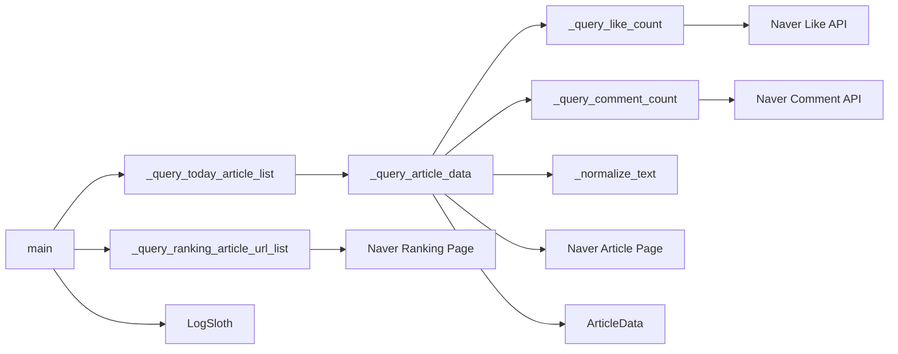
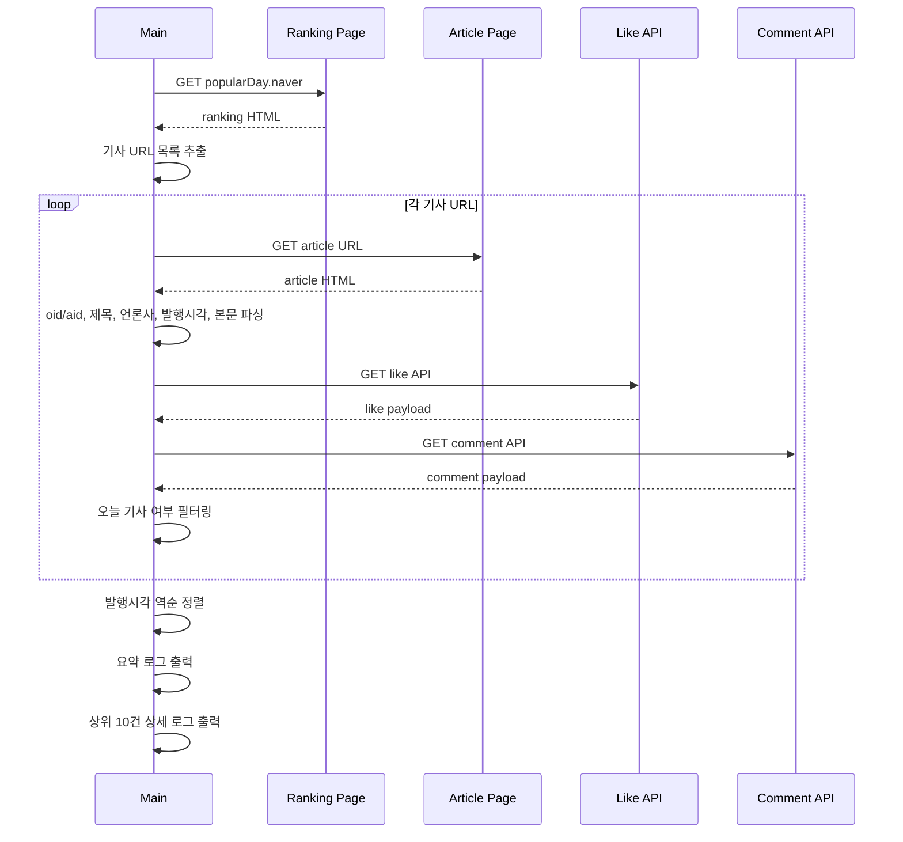
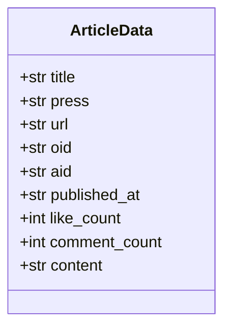

# 260315 네이버 뉴스 크롤러 코드 분석

## 전체 설명

`news_naver_crawl.py`는 네이버 뉴스 랭킹 페이지를 시작점으로 삼아, 당일 많이 노출된 기사만 선별 수집하는 비동기형 파이썬 스크립트다. 단순히 기사 URL을 모으는 수준이 아니라 기사 본문, 언론사, 발행시각, 공감 수, 댓글 수까지 함께 수집해 로그로 남긴다.

핵심 흐름은 다음과 같다.

1. 랭킹 페이지 HTML에서 기사 URL 목록을 수집한다.
2. 각 기사 URL에서 `oid`, `aid`를 파싱한다.
3. 기사 본문 페이지를 조회해 제목, 언론사, 발행시각, 본문을 읽는다.
4. 별도 API를 호출해 공감 수와 댓글 수를 읽는다.
5. 서울 기준 오늘 날짜 기사만 남긴다.
6. 최신 발행순으로 정렬한 뒤 요약 로그와 상세 로그를 출력한다.

코드 기준으로는 상수 선언과 데이터 모델은 [news_naver_crawl.py](/C:/Users/hhd20/project/HhdStock/py/news_naver_crawl.py#L13), [news_naver_crawl.py](/C:/Users/hhd20/project/HhdStock/py/news_naver_crawl.py#L20) 부근에 있고, 실제 수집 흐름은 [news_naver_crawl.py](/C:/Users/hhd20/project/HhdStock/py/news_naver_crawl.py#L42) 이후 함수들에 모여 있다.

## 필요성 설명

이 스크립트가 필요한 이유는 세 가지다.

- 뉴스 전체를 무작정 크롤링하면 대상 범위가 너무 넓고 노이즈가 많다.
- 랭킹 페이지를 시작점으로 잡으면 사용자가 실제로 많이 본 기사 중심으로 수집할 수 있다.
- 기사 원문 정보와 반응 지표를 함께 보관하면 이후 요약, 감성 분석, 시장 이슈 탐지, 알림 시스템으로 이어가기 쉽다.

즉 이 코드는 "전체 뉴스 크롤러"라기보다 "당일 주목 기사 수집기"에 가깝다.

## 연관 핵심 기술 주제 설명

### 1. HTML 파싱과 XPath

랭킹 페이지와 기사 상세 페이지는 `lxml.html` 기반 XPath로 파싱한다. 예를 들어 랭킹 기사 URL 추출은 [news_naver_crawl.py](/C:/Users/hhd20/project/HhdStock/py/news_naver_crawl.py#L50), 기사 제목/언론사/본문 파싱은 [news_naver_crawl.py](/C:/Users/hhd20/project/HhdStock/py/news_naver_crawl.py#L114) 부근에 구현되어 있다.

- 관련 문서: https://lxml.de/xpathxslt.html

### 2. Pydantic 데이터 모델

`ArticleData`는 수집 결과를 구조화하는 모델이다. 필드 타입을 명시해 후속 처리에서 데이터 형태를 안정적으로 유지한다.

- 관련 문서: https://docs.pydantic.dev/latest/concepts/models/

### 3. asyncio와 스레드 오프로딩

기사 상세 조회는 `_query_today_article_list()` 내부에서 `asyncio.to_thread()`로 감싼다([news_naver_crawl.py](/C:/Users/hhd20/project/HhdStock/py/news_naver_crawl.py#L147)). 현재 구현은 순차 `await`이므로 완전한 병렬 처리까지는 아니지만, 동기 `requests` 기반 함수를 비동기 컨텍스트에서 호출 가능하게 만든다.

- 관련 문서: https://docs.python.org/3/library/asyncio-task.html#asyncio.to_thread

### 4. 텍스트 정규화와 Windows 콘솔 호환성

`_normalize_text()`는 NBSP, zero-width space, BOM 제거 후 `cp949`로 다시 인코딩한다([news_naver_crawl.py](/C:/Users/hhd20/project/HhdStock/py/news_naver_crawl.py#L32)). 이는 Windows 콘솔 로그가 깨지는 문제를 줄이기 위한 운영형 방어 코드다.

## 연관 업무 도메인 설명

이 코드는 뉴스 데이터 수집 도메인과 투자 정보 탐색 도메인이 만나는 지점에 있다.

- 뉴스 도메인 측면에서는 포털 랭킹 기반 기사 선별, 기사 메타데이터 수집, 사용자 반응 수집이 핵심이다.
- 주식/시장 분석 도메인 측면에서는 당일 여론 집중 기사, 특정 섹터 이슈, 정치/정책/기업 뉴스의 급격한 노출 변화를 추적하는 재료가 된다.
- 운영 도메인 측면에서는 "당일 기사만" 수집하는 정책([news_naver_crawl.py](/C:/Users/hhd20/project/HhdStock/py/news_naver_crawl.py#L118))이 배치 실행과 중복 제거 전략을 단순하게 만든다.

## 장점/단점 설명

### 장점

- 랭킹 페이지를 시작점으로 잡아 탐색 비용과 노이즈를 크게 줄인다.
- `ArticleData`로 결과 스키마가 명확하다.
- 기사 본문, 공감 수, 댓글 수를 함께 모아 후속 활용성이 높다.
- 텍스트 정규화가 있어 Windows 로그 환경에서 비교적 안정적이다.
- 상위 10건 상세 로그와 전체 요약 로그가 분리돼 운영 확인이 쉽다.

### 단점

- `requests`에 타임아웃, 재시도, 예외처리가 없다. 네트워크 오류 시 전체 실행이 중단될 수 있다.
- `_query_today_article_list()`는 `to_thread()`를 쓰지만 실제로는 순차 처리라 대량 URL에서 느릴 수 있다.
- 네이버 HTML 클래스명과 비공식 API 포맷에 강하게 의존해 구조 변경에 취약하다.
- 댓글 수와 공감 수 파싱이 정규식 기반이라 응답 포맷 변경 시 조용히 0이 될 수 있다.
- `from hs_import_common import *` 형태는 의존성 경계를 흐리게 해 정적 분석성과 이식성을 떨어뜨린다.

## 컴포넌트 다이어그램



## 시퀀스 다이어그램



## 클래스 다이어그램



## 각 타입별 공개 함수, 필드, 속성 설명

### 상수

| 이름 | 설명 |
| --- | --- |
| `RANKING_URL` | 네이버 인기 기사 랭킹 페이지 URL |
| `HEADERS` | 최소 User-Agent 헤더 |
| `TODAY_DATE` | 서울 타임존 기준 오늘 날짜 |

### 클래스 `ArticleData`

| 필드 | 타입 | 설명 |
| --- | --- | --- |
| `title` | `str` | 기사 제목 |
| `press` | `str` | 언론사명 |
| `url` | `str` | 기사 원문 URL |
| `oid` | `str` | 네이버 언론사 식별자 |
| `aid` | `str` | 네이버 기사 식별자 |
| `published_at` | `str` | 기사 발행 시각 문자열 |
| `like_count` | `int` | 공감 수 |
| `comment_count` | `int` | 댓글 수 |
| `content` | `str` | 기사 본문 텍스트 |

### 공개 함수

이 모듈에서 외부 진입점으로 볼 수 있는 공개 함수는 `main()`이다. 나머지 함수는 이름이 `_`로 시작하는 내부 헬퍼다.

| 함수 | 설명 |
| --- | --- |
| `main() -> None` | 랭킹 URL 수집, 오늘 기사 필터링, 로그 출력까지 전체 워크플로우를 실행한다. |

### 내부 핵심 함수

| 함수 | 설명 |
| --- | --- |
| `_normalize_text(text)` | 특수 공백 제거와 `cp949` 호환 정리를 수행한다. |
| `_query_ranking_article_url_list()` | 랭킹 페이지에서 기사 URL 목록을 중복 제거 후 수집한다. |
| `_query_comment_count(oid, aid)` | 댓글 API에서 댓글 수를 조회한다. |
| `_query_like_count(oid, aid)` | 공감 API 응답에서 count들을 합산해 공감 수를 계산한다. |
| `_query_article_data(article_url)` | 기사 상세 정보를 한 번에 수집해 `ArticleData`로 반환한다. |
| `_query_today_article_list(article_url_list)` | 여러 기사 URL 중 오늘 기사만 선별해 정렬 후 반환한다. |

## 코드상 핵심 해석

이 스크립트의 본질은 "랭킹 기반 입력 축소 + 기사 상세 확장 + 당일 필터링"이다. 전체 뉴스 섹션을 순회하지 않고 랭킹에 노출된 기사만 대상으로 삼기 때문에 실무적으로 빠르고, 기사 반응 수까지 함께 수집해 후속 분석 가치가 높다.

다만 현재 구조는 운영용 프로토타입에 가깝다. 장애 허용성, 병렬성, 네이버 응답 포맷 변경 대응이 약하므로 배치 운영 단계로 올리려면 `timeout`, `retry`, `asyncio.gather`, 응답 스키마 검증, 저장 계층 분리가 다음 개선 포인트다.

## 참고 URL

- https://docs.python.org/3/library/asyncio-task.html#asyncio.to_thread
- https://docs.pydantic.dev/latest/concepts/models/
- https://lxml.de/xpathxslt.html

## 작성 시 사용한 사용자 질문 프롬프트

```text
$hhd-code-analysis
$hhd-md
@C:\Users\hhd20\project\HhdStock\py\news_naver_crawl.py
```
