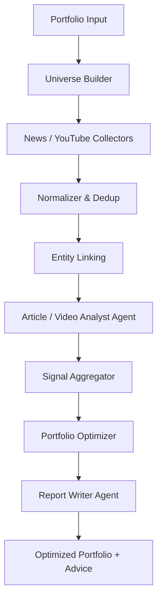

# 260315 경제뉴스 여론기반 포트폴리오 설계

기준 시각: 2026-03-15 14:48:23 +09:00

## 한눈에 결론 🚦

- `경제뉴스 + 여론`은 **단기(당일~수일) 포트폴리오 조정 신호**로는 의미가 있다. 다만 **중기 이상 성과를 단독으로 책임질 주신호**로 보기는 어렵다.
- 사용자가 직감한 "실제 주가를 움직이는 것은 여론이 더 크다"는 생각은 **단기, 이벤트성, 개인투자자 비중이 높고 차익거래가 어려운 종목**에서는 꽤 맞다. 하지만 **장기 구간**에서는 결국 펀더멘털과 밸류에이션이 더 강한 닻(anchor) 역할을 한다.
- `기사 본문 + 최신성 + 종목 연관도 + 이벤트 타입 + 출처 신뢰도`는 핵심 피처다. 반면 `PV/좋아요/댓글/댓글 좋아요`는 **보조적인 attention proxy**로는 쓸 수 있지만, **가용성 부족, 소스별 편차, 조작 가능성** 때문에 1차 신호로 두면 위험하다.
- `유튜브`는 분명 중요해지고 있다. 뉴스 소비 자체가 텍스트에서 영상/플랫폼형으로 이동 중이고, 특히 한국/미국 모두 개인투자자 관심 형성에 영향을 준다. 다만 **공식 API로 얻을 수 있는 데이터가 제한적**이고, **자막/음성분석/채널 신뢰도 추정**이 필요해 구현 난도가 뉴스보다 높다.
- 시스템 설계의 정답은 단일 벤더가 아니라 `하이브리드`다.
  - `한국`: Naver News Search API + DART + IR
  - `미국/글로벌`: GDELT + Alpha Vantage News & Sentiment 또는 FMP/Marketaux
  - `보강`: YouTube Data API
  - `해석`: PydanticAI + LLM
  - `최적화`: 기존 포트폴리오 종목만 대상으로 수량 재조정
- 실서비스 핵심 리스크는 LLM 비용보다 `뉴스 라이선스`, `종목 매핑`, `평가셋`, `데이터 편향`, `리밸런싱 과최적화`다.

---

## 1. 질문별 핵심 답변 🔍

## 1-1. 경제뉴스의 여론분석과 근미래 주가예측의 상관관계가 큰가?

짧게 답하면 **있다. 하지만 조건부다.**

### 연구 해석

- NBER의 `Media Sentiment and Stock Prices`는 뉴스 감성이 주가 움직임과 연결되며, 특히 **감성의 전달 방식과 시장 반응의 연결**을 다룬다.
- Baker & Wurgler의 `Investor Sentiment and the Cross-Section of Stock Returns`는 투자심리가 모든 종목에 동일하게 작동하지 않고, **작고 변동성이 높고, 가치평가가 어려운 종목**에서 더 크게 작동함을 보여준다.
- Seeking Alpha 데이터를 분석한 `Wisdom of Crowds` 논문은 **기사 본문보다 댓글이 미래 수익률과 실적 서프라이즈를 더 잘 설명하는 구간**이 있음을 보여준다. 이것은 "여론"이 단순 헤드라인보다 더 많은 정보를 포함할 수 있음을 시사한다.

### 내 해석 💡

- **당일~5영업일** 정도의 짧은 구간에서는 뉴스 감성과 군중 반응이 실제 가격 형성에 유의미하다.
- 하지만 시간이 길어질수록 뉴스 감성의 설명력은 약해지고, **실적/가이던스/금리/현금흐름/밸류에이션** 같은 구조적 변수의 영향력이 더 커진다.
- 따라서 이 시스템은 `장기 종목 발굴 시스템`보다 `단기~중단기 포트폴리오 조정 시스템`으로 포지셔닝하는 것이 맞다.

### 결론

- **상관관계는 있다**
- 그러나 **크고 안정적인 초과수익으로 이어지려면**
  - 이벤트 타입 분류
  - 종목 연관도 추정
  - 최신성 가중
  - 거짓/중복 기사 제거
  - 뉴스 이후 실제 수익률로 검증
  가 반드시 붙어야 한다.

---

## 1-2. "실제 주가를 움직이는 것은 애널리스트보다 여론"이라는 생각은 일반적으로 맞는가?

**반만 맞다.**

### 맞는 부분

- 단기 가격은 결국 **주문 흐름(order flow)** 이 만든다.
- 주문 흐름은 많은 경우 **심리, 관심, 기대, 공포, 유행, 해석 경쟁**의 결과다.
- 그래서 장중과 단기 구간에서는 뉴스 여론, 커뮤니티 반응, 영상, 검색량 같은 attention/sentiment 신호가 매우 중요하다.

### 틀릴 수 있는 부분

- 장기적으로는 **펀더멘털이 전혀 없는 자산이 계속 비싸질 수는 없다.**
- 여론이 가격을 순간적으로 밀어도, 이후 실적과 현금흐름이 따라오지 않으면 되돌림이 발생한다.
- 특히 메가캡, 기관 비중이 큰 대형주, 정보 효율성이 높은 종목은 순수 감성 신호만으로 오래 이기기 어렵다.

### 실무 결론

- 당신의 직감은 **단기 트레이딩/전술적 리밸런싱 관점에서는 꽤 타당**하다.
- 하지만 시스템을 만들 때는 `여론 > 펀더멘털`로 두지 말고, 아래처럼 두는 것이 더 정확하다.

```text
단기 가격결정:
여론/뉴스/attention > 펀더멘털

중기~장기 가격정착:
펀더멘털 + 금리 + 밸류에이션 > 여론
```

즉, 이 시스템은 `전술 신호 레이어`로 설계하고, 장기 전략 전체를 대체하는 엔진으로 과대해석하면 안 된다.

---

## 1-3. 기사 본문, PV, 좋아요, 댓글수, 댓글 좋아요/싫어요를 분석하려는 방향은 맞는가?

**방향은 맞지만, 우선순위를 다시 정렬해야 한다.**

### 우선순위 추천

1. `기사 본문 의미`
2. `최신성`
3. `종목 직접 연관도`
4. `이벤트 타입`
5. `출처 신뢰도`
6. `기사 중복/재전송 여부`
7. `engagement(PV/좋아요/댓글)`

### 왜 engagement를 뒤로 미뤄야 하나?

- `PV/좋아요/댓글수`는 감성이라기보다 **관심도(attention)** 에 가깝다.
- 관심이 높다고 항상 호재는 아니다.
  - 악재 기사도 댓글과 조회수가 폭증한다.
  - 논란성 기사도 좋아요/댓글이 많다.
- raw count는 퍼블리셔/플랫폼마다 스케일이 전혀 다르다.
  - 네이버 메인 기사와 지방지 기사 PV는 구조적으로 다르다.
  - 유튜브 대형 채널과 소형 채널도 절대값 비교가 어렵다.

### 따라서 이렇게 써야 한다 💡

- `text sentiment`: 방향성
- `event type`: 왜 움직여야 하는지
- `engagement`: 시장이 그 뉴스를 얼마나 크게 보고 있는지

즉 engagement는 **방향 결정용 주신호가 아니라 강도 조정용 보조신호**가 맞다.

### 특히 주의할 점

- 댓글 좋아요/싫어요는 플랫폼 정책 변화 영향을 크게 받는다.
- 유튜브는 공개 dislike 집계가 사실상 사라졌고, 공식 API에서도 일반적인 public dislike count를 기대하면 안 된다.
- 네이버 기사 engagement는 공식 Open API에서 바로 주지 않는다.
- 비공식 스크래핑은 약관/차단/구조변경 리스크가 크다.

### 결론

- `기사 본문 분석`은 맞다 ✅
- `댓글 텍스트 분석`도 의미 있다 ✅
- `PV/좋아요/댓글수/댓글 좋아요`는 보조 피처로는 유용할 수 있다 ✅
- 하지만 이것들을 중심 축으로 두는 것은 비추천 ❌

---

## 1-4. 뉴스보다 유튜브가 더 많이 소비되고, 여론 형성도 유튜브가 더 강해지는가?

**점점 더 그렇다. 다만 “뉴스를 대체했다”가 아니라 “투자 attention 형성 채널이 추가되었다”에 가깝다.**

### 근거

- Pew Research에 따르면 미국에서 `YouTube`를 통해 정기적으로 뉴스를 접한다는 응답은 2020년 이후 크게 증가했다.
- Reuters Institute `Digital News Report 2024`도 동영상 기반 플랫폼과 크리에이터 기반 뉴스 소비의 성장을 보여준다.
- 한국 관련 연구에서는 유튜브 경제/주식 채널의 조회수가 **동시적 혹은 매우 단기적인 주가 반응과 연결될 가능성**이 보고되었다.

### 내 해석 💡

- 텍스트 뉴스는 `사실 전달`과 `속보성`에서 아직 강하다.
- 유튜브는 `해석`, `프레이밍`, `감정 증폭`, `개인투자자 동원`에서 강하다.
- 그래서 둘은 경쟁이라기보다 역할이 다르다.

```text
텍스트 뉴스:
빠른 사실 전달, 기사 단위 이벤트 포착

유튜브:
서사 형성, 투자자 확신 강화, 관심 집중, 반복 노출
```

### 결론

- 유튜브를 분석하는 것은 충분히 가치 있다.
- 다만 **뉴스 분석 MVP를 먼저 안정화한 뒤**
- `YouTube는 phase 2`로 붙이는 것이 현실적이다.

---

## 1-5. 유튜브 영상을 분석한다면 어떤 솔루션이 좋은가?

### 현실적인 권장안

#### A안. 저비용 자작형

- `YouTube Data API v3`
  - video metadata
  - statistics(view/like/comment)
  - comments
- 음성 추출 후 `Whisper` 계열 ASR
- PydanticAI + LLM으로
  - 영상 요약
  - 종목 언급 추출
  - 주장/근거/어조/시간축 구조화

장점:

- 자유도가 높다
- 종목별 맞춤 해석 가능
- 뉴스와 동일 스키마로 통합 가능

단점:

- 자막/ASR 품질 관리 필요
- 영상 길이 때문에 비용과 처리시간이 증가
- 노이즈가 매우 많다

#### B안. 범용 소셜 리스닝 툴 병행

- Brandwatch
- Talkwalker
- Sprinklr

이들은 브랜드/소셜 분석에는 강하지만, **금융 종목별 relevance와 event taxonomy**는 직접 얹어야 하는 경우가 많다.

#### C안. 금융 특화 데이터 벤더 + 유튜브 자작 혼합

- 뉴스: Benzinga / Marketaux / FMP / Alpha Vantage
- 유튜브: 직접 수집/분석

이 조합이 가장 현실적이다.  
이유는 **금융 특화 뉴스 sentiment 벤더는 있어도, 금융 특화 YouTube sentiment 완제품은 상대적으로 약하기 때문**이다.

---

## 2. 시스템 설계 방향 🏗️

## 2-1. 시스템 목표 재정의

당신의 요구를 실무적으로 다시 정의하면 아래다.

```text
입력:
- 현재 포트폴리오 = ticker, quantity 목록

데이터:
- 최근 7일 뉴스/댓글/유튜브/가격

출력:
- 입력에 있던 ticker만 유지
- quantity만 조정
- 전체 리포트 1개
- 종목별 리포트 N개
```

여기서 가장 중요한 제약은 이것이다.

### 핵심 제약

`새 종목 추가 금지`

이 제약은 시스템을 단순하게 만들지만, 동시에 한계도 만든다.

- 모든 보유 종목 신호가 나빠도
- 입력 포트폴리오에 `현금` 또는 `금`이 없으면
- 시스템은 결국 **나쁜 종목들 사이에서만 비중을 재배치**해야 한다.

### 그래서 권장하는 운영 규칙

- 입력 포트폴리오에 가급적 아래 pseudo ticker를 허용
  - `CASH_KRW`
  - `CASH_USD`
  - `GLD` 또는 금 ETF
- 그러면 시스템이 방어적으로 숨을 곳이 생긴다.

---

## 2-2. 추천 아키텍처

### 전체 구조



### AWS 권장 구성

- `EventBridge`
  - 시간 기반 수집 스케줄
- `Lambda`
  - 가벼운 API 수집 작업
- `SQS`
  - 기사/영상 분석 작업 큐
- `ECS Fargate` 또는 `Batch`
  - 대량 ASR, 대량 기사 분석
- `S3`
  - raw JSON, transcript, parquet 저장
- `Aurora PostgreSQL`
  - 정규화된 엔터티, 시그널, 포트폴리오, 리포트 저장
- `Athena`
  - 백테스트와 ad-hoc 분석
- `CloudWatch`
  - 품질/지연/에러 모니터링

### 내 해석 💡

- MVP는 `Lambda + SQS + S3 + Postgres`면 충분하다.
- 영상 ASR 비중이 커지면 `Fargate` 또는 `Batch`가 필요하다.
- 너무 일찍 복잡한 마이크로서비스로 가면 운영비만 커진다.

---

## 2-3. 데이터 소스 추천

## 한국 뉴스

### 1순위

- `Naver News Search API`
- `DART 공시`
- 상장사 `IR / 보도자료`

### 이유

- 한국 종목명/브랜드/그룹명 질의에 강하다
- 뉴스 발견용으로는 매우 실용적이다
- DART와 붙이면 루머와 공식정보를 분리할 수 있다

### 한계

- 기사 본문 전문과 engagement를 공식 API로 바로 얻기 어렵다
- 따라서 본문 크롤링/저장 전략은 약관과 라이선스를 별도 검토해야 한다

## 미국/글로벌 뉴스

### 무료/저가 우선

- `GDELT`
- `Alpha Vantage News & Sentiment`
- `Yahoo Finance`는 가격/메타 보조

### 품질 우선

- `FMP`
- `Marketaux`
- `Benzinga`

### 각 후보 해석

- `GDELT`
  - 무료, 넓은 글로벌 커버리지
  - 하지만 금융 종목 정규화는 약하다
- `Alpha Vantage News & Sentiment`
  - 무료 진입이 쉽고 sentiment/relevance 필드가 있다
  - MVP 검증용으로 매우 좋다
- `FMP`
  - 가격/뉴스/재무를 한 API에 묶기 좋다
  - 감성 자체는 직접 구축 성격이 강하다
- `Marketaux`
  - 금융 뉴스/엔터티/감성 필터가 좋아 실전성이 높다
- `Benzinga`
  - 미국 주식 뉴스 품질과 정량화가 강하지만 비용이 올라갈 수 있다

### 현실적 추천 조합

#### MVP

- 한국: `Naver News Search API + DART`
- 미국: `Alpha Vantage News & Sentiment + Yahoo Finance`
- 글로벌 보강: `GDELT`

#### 운영형

- 한국: `Naver + DART + IR`
- 미국: `Marketaux` 또는 `FMP`
- 예산 허용 시: 미국 뉴스만 `Benzinga` 추가

---

## 3. 피처 설계 📊

## 3-1. 기사 단위 점수

각 기사 `a`, 종목 `i`에 대해 아래 구조를 만든다.

```text
article_score(i, a)
= recency_weight(a)
* source_weight(a)
* entity_relevance(i, a)
* novelty_weight(a)
* impact_strength(i, a)
* signed_direction(i, a)
```

### 추천 세부 항목

- `recency_weight`
  - 최근일수록 높게
  - 반감기(half-life) 24~36시간 추천
- `source_weight`
  - Reuters, AP, 공시, 회사 IR > 일반 블로그/루머 채널
- `entity_relevance`
  - 기사에 종목이 등장해도 주인공인지, 단순 언급인지 구분
- `novelty_weight`
  - 중복 기사, 재송고는 낮춤
- `impact_strength`
  - 실적, 가이던스, 규제, M&A, 리콜, 증자, 소송 같은 이벤트 강도
- `signed_direction`
  - positive / negative / mixed / unclear

---

## 3-2. engagement 피처

engagement는 아래처럼 쓰는 것이 좋다.

```text
engagement_score
= w1 * normalized_pv
+ w2 * normalized_like
+ w3 * normalized_comment_count
+ w4 * normalized_comment_reaction
```

단, 아래 원칙이 필요하다.

### 원칙 1. raw count 금지

- 반드시 `source별 percentile` 또는 `z-score`로 표준화
- `log1p` 변환 후 clip 적용

### 원칙 2. 방향과 강도를 분리

- 댓글 수가 많다고 bullish가 아니다
- 댓글 텍스트 sentiment와 함께 써야 한다

### 원칙 3. 플랫폼별 가용성 차이를 인정

- 네이버 기사 좋아요/댓글은 일부 확보 가능해도 공식성/안정성이 약하다
- 유튜브 dislike는 일반 공개 지표로 보기 어렵다

### 결론

`engagement = amplification proxy`  
`text/event = direction proxy`

---

## 3-3. 종목 단위 최종 시그널

최근 7일 기사/영상/댓글을 모아 종목 점수를 만든다.

```text
ticker_signal(i)
= sum(article_score(i, a)) / sum(weights)
```

추천 추가 필드:

- `signal_mean`
- `signal_std`
- `evidence_count`
- `source_diversity`
- `high_credibility_ratio`
- `negative_event_count`
- `positive_event_count`
- `uncertainty_score`

### 중요

- 증거 수가 너무 적으면 강한 조정 금지
- 출처가 한 채널에만 몰리면 강한 조정 금지
- positive/negative가 섞이면 mixed 처리

---

## 4. 포트폴리오 재구성 로직 💼

## 4-1. 문제 정의

현재 포트폴리오:

```python
[
    {"ticker": "005930.KS", "quantity": 10},
    {"ticker": "MSFT", "quantity": 4},
    {"ticker": "GLD", "quantity": 2},
    {"ticker": "CASH_USD", "quantity": 1000},
]
```

출력 제약:

- ticker 추가 금지
- ticker 삭제 가능 여부는 정책으로 결정
- quantity만 조정
- 총 포트폴리오 가치 보존

## 4-2. 추천 최적화 로직

### 1단계. baseline weight 계산

현재 시가 기준 비중 산출

### 2단계. signal tilt 계산

```text
tilt_i = alpha * normalized_signal_i
       - beta  * uncertainty_i
       - gamma * risk_penalty_i
```

### 3단계. 목표 비중 계산

```text
target_weight_i
= baseline_weight_i + tilt_i
```

제약:

- sum(target_weight_i) = 1
- target_weight_i >= 0
- max_turnover <= preset limit

### 4단계. quantity 변환

- 미국 주식, 한국 주식, 금 ETF는 정수 수량 반영
- 현금 pseudo ticker는 잔여 가치 흡수

## 4-3. 추천 정책

### 정책 A. 보수형

- 증거가 충분할 때만 ±5~10% weight 조정
- turnover 상한 낮게

### 정책 B. 전술형

- 강한 악재/호재 이벤트에 더 크게 반응
- 단기성과는 좋아질 수 있으나 과최적화 위험 큼

### 내 추천

초기에는 무조건 `보수형`이 맞다.

이유:

- 뉴스 신호는 노이즈가 크다
- 거래비용, 세금, 슬리피지가 있다
- 사용자가 실제 운용할 때 심리적으로도 급격한 리밸런싱은 불편하다

---

## 5. PydanticAI 파이프라인 상세 🤖

## 5-1. 에이전트 분리 구조

### Agent 1. Entity Linker

역할:

- 기사/영상에서 종목명, 회사명, 브랜드명, 티커 연결

입력:

- title
- content
- candidate tickers from portfolio

출력:

- primary_ticker
- secondary_tickers
- relevance score

### Agent 2. Event Analyzer

역할:

- 이벤트 타입과 방향성 구조화

출력 필드 예시:

- event_type
- impact_direction
- time_horizon
- materiality
- confidence
- why
- counter_argument
- evidence_spans

### Agent 3. Comment/YouTube Crowd Analyzer

역할:

- 댓글/영상의 crowd stance 추정

출력 필드:

- crowd_bullishness
- crowd_bearishness
- controversy_score
- manipulation_risk

### Agent 4. Ticker Signal Aggregator

역할:

- 기사/영상/댓글 단위 결과를 종목 단위로 집계

### Agent 5. Portfolio Optimizer

역할:

- 종목 점수 + 현재 수량 + 가격으로 목표 수량 산출

### Agent 6. Report Writer

역할:

- 전체 advice
- 종목별 advice

---

## 5-2. 추천 자료구조

```python
from __future__ import annotations

from datetime import datetime
from enum import Enum
from pydantic import BaseModel, Field


class AssetType(str, Enum):
    KR_STOCK = "kr_stock"
    US_STOCK = "us_stock"
    GOLD = "gold"
    CASH = "cash"


class PortfolioPosition(BaseModel):
    ticker: str
    quantity: float
    asset_type: AssetType
    currency: str


class NewsItem(BaseModel):
    source: str
    source_type: str
    url: str
    published_at: datetime
    title: str
    body: str | None = None
    pv_count: int | None = None
    like_count: int | None = None
    comment_count: int | None = None
    comment_like_count: int | None = None
    comment_dislike_count: int | None = None


class Mention(BaseModel):
    ticker: str
    relevance: float = Field(ge=0, le=1)
    is_primary: bool


class AnalyzedItem(BaseModel):
    item_id: str
    mentions: list[Mention]
    event_type: str
    direction: str
    confidence: float = Field(ge=0, le=1)
    time_horizon: str
    materiality: str
    text_sentiment: float = Field(ge=-1, le=1)
    crowd_sentiment: float | None = Field(default=None, ge=-1, le=1)
    controversy_score: float = Field(ge=0, le=1)
    novelty_score: float = Field(ge=0, le=1)
    evidence: list[str]


class TickerSignal(BaseModel):
    ticker: str
    score: float
    uncertainty: float
    evidence_count: int
    positive_events: int
    negative_events: int
    mixed_events: int
    summary: str


class RebalanceDecision(BaseModel):
    ticker: str
    current_quantity: float
    target_quantity: float
    delta_quantity: float
    reason: str


class PortfolioRebalanceReport(BaseModel):
    advice: str
    decisions: list[RebalanceDecision]
```

## 5-3. PydanticAI 적용 포인트

- `output_type`
  - 각 에이전트 결과를 강하게 구조화
- `deps_type`
  - API client, DB session, market data provider 주입
- `tool`
  - ticker lookup
  - price lookup
  - article fetch
  - transcript fetch
  - historical returns lookup
- `evals`
  - event classification accuracy
  - ticker linking accuracy
  - hallucination rate
- `durable execution / temporal`
  - 대량 배치와 재시도 안정성 확보

### 추천 구현 순서

1. `Entity Linker`
2. `Event Analyzer`
3. `Ticker Signal Aggregator`
4. `Portfolio Optimizer`
5. `Report Writer`
6. 나중에 `YouTube Analyzer`

---

## 6. 백테스트 설계 📈

뉴스 여론 시스템은 **백테스트 설계가 절반**이다.

## 6-1. 먼저 검증할 가설

### 가설 A

`최근 7일 뉴스 텍스트 시그널`은 다음 1~5영업일 수익률 방향을 예측한다.

### 가설 B

`engagement 피처`를 추가하면 text-only 대비 성능이 개선된다.

### 가설 C

`YouTube 피처`를 추가하면 일부 종목군에서 추가 개선이 있다.

### 가설 D

이 시그널을 기존 포트폴리오 재구성에 쓰면 buy-and-hold보다 turnover 감안 후 성과가 개선된다.

## 6-2. 백테스트 단위

### 연구용 universe backtest

포트폴리오 몇 종목만으로 검증하면 표본이 너무 작다.  
먼저는 다음처럼 넓게 검증해야 한다.

- 한국 대형주 100
- 미국 대형주 100
- 선택적으로 중소형주 버킷

### 운영용 portfolio backtest

- 실제 사용자의 보유 종목에 대해서만 constrained rebalance 시뮬레이션

## 6-3. 레이블

- `T+1d return`
- `T+3d return`
- `T+5d return`
- event type별 별도 레이블

## 6-4. 검증 방식

- `walk-forward`
- `purged time split`
- 시장 체제별 분리
  - 상승장
  - 하락장
  - 변동성 급등장

## 6-5. 핵심 지표

- 방향 적중률
- IC(rank correlation)
- long-short spread
- turnover-adjusted return
- max drawdown
- Sharpe
- Calmar
- feature ablation

## 6-6. 반드시 할 ablation

1. `text only`
2. `text + recency`
3. `text + recency + engagement`
4. `text + recency + engagement + youtube`
5. `price momentum only`
6. `text signal + price momentum`

### 이 테스트가 중요한 이유

이 시스템이 정말 의미 있으려면 최소한 아래 둘 중 하나는 보여야 한다.

- engagement가 실제로 incremental value를 준다
- 아니면 engagement는 거의 가치 없고 텍스트/이벤트만 중요하다는 사실이 드러난다

둘 다 중요한 결과다.

---

## 7. 현재 로컬 코드/자료에 대한 평가 🧩

## 7-1. 기존 조사 문서의 가치

기존 문서들에서 이미 좋은 방향이 잡혀 있었다.

- `260311_2128_global_financial_news_api_research.md`
  - GDELT / Marketaux / NewsCatcher / LexisNexis의 성격 구분이 좋다
- `260312_0134_FMP_API_리서치.md`
  - FMP가 해석 레이어보다 원시 데이터 레이어라는 점이 정확하다
- `260312_1937_news_data_vendor_research.md`
  - 라이선스 리스크 인식이 좋다
- `260312_경제뉴스_뉘앙스_서비스_리서치.md`
  - pydantic.ai + 외부 데이터 공급자 조합이 현실적이라는 판단이 맞다

## 7-2. 기존 Python 스크립트 평가

### `news_naver_crawl.py`

장점:

- 네이버 기사 좋아요/댓글수 확보 가능성 실험에 유용

한계:

- `랭킹 기사만 수집`하므로 selection bias가 매우 크다
- 오늘 기사만 본다
- 최근 7일 전체 뉴스 coverage가 아니다

### `news_us_crawl.py`

장점:

- AP/Reuters 실험 출발점으로는 좋다

한계:

- today only
- Google News RSS 기반
- 종목 매핑/본문/감성 레이어가 없다

### `padantic_ai_claude_basic.py`

장점:

- structured output 실험으로 적절하다

다음 단계:

- `MyNumRes` 대신 `AnalyzedItem`, `TickerSignal`, `PortfolioRebalanceReport` 같은 모델로 확장

### `stock_query.py`

장점:

- Yahoo Finance 기반 현재가/기초 시세 확인용으로 MVP에 충분

### `ticker_query.py`

장점:

- KR/US ticker universe 부트스트랩에 유용

### 총평

현재 코드는 `프로토타이핑 출발점`으로는 괜찮다.  
다만 지금 상태에서 바로 서비스 아키텍처로 연결하기에는

- coverage 부족
- 편향
- 지속 실행 구조 부재
- 저장 구조 부재

가 크다.

---

## 8. 권장 로드맵 🛣️

## Phase 1. 연구 MVP

- 한국: Naver Search API + DART
- 미국: Alpha Vantage News & Sentiment + Yahoo Finance
- 최근 7일
- text + recency + event type만 사용
- engagement는 제외 또는 약하게만 사용
- daily rebalance backtest

## Phase 2. 운영 MVP

- S3 raw lake
- Postgres normalized store
- PydanticAI agents
- report generation
- constrained optimizer

## Phase 3. 고도화

- YouTube
- comment text sentiment
- source credibility calibration
- cross-market contagion signal
- regime-aware optimizer

## Phase 4. 상용화 검토

- 라이선스 점검
- 대체 벤더
- 모니터링
- human-in-the-loop

---

## 9. 최종 권장안 ✅

지금 당신에게 가장 실용적인 설계는 아래다.

### 추천 시스템

- `수집`
  - 한국: Naver News Search API, DART, IR
  - 미국: Alpha Vantage News & Sentiment
  - 글로벌 보강: GDELT
  - 가격: Yahoo Finance
- `분석`
  - PydanticAI
  - 기사/영상 단위 구조화
  - 종목 점수 집계
- `최적화`
  - 기존 ticker만 유지
  - quantity만 변경
  - turnover penalty 적용
- `리포트`
  - 전체 의견 1개
  - 종목별 의견 N개

### 무엇을 버려야 하나

- 초기에 `PV/좋아요/댓글`에 과도하게 기대하는 것
- 초기에 뉴스와 유튜브를 동시에 완전하게 하려는 것
- 초기에 실시간 고빈도 시스템으로 가는 것

### 무엇을 먼저 해야 하나

1. `text/event/recency` 기반 백테스트
2. `engagement` incremental value 검증
3. `유튜브`는 그 다음

### 한 줄 최종 판단

이 프로젝트는 **충분히 가치 있고 차별화 여지가 있다.**  
다만 승부처는 "뉴스를 많이 모으는 것"이 아니라,

- **종목에 맞게 정확히 연결하고**
- **이벤트를 구조화하고**
- **과최적화 없이 수량 조정으로 연결하는 것**

에 있다.

---

## 참고한 주요 웹 자료 🔗

- NBER, `Media Sentiment and Stock Prices`  
  https://www.nber.org/papers/w25353
- NBER, `Investor Sentiment and the Cross-Section of Stock Returns`  
  https://www.nber.org/papers/w10449
- Chen, De, Hu, Hwang, `Wisdom of Crowds: The Value of Stock Opinions Transmitted Through Social Media` PDF  
  https://www.bhwang.com/Research/SeekingAlpha_R2.pdf
- Pew Research Center, social media and news / YouTube news use  
  https://www.pewresearch.org/journalism/fact-sheet/social-media-and-news-fact-sheet/
- Reuters Institute, `Digital News Report 2024`  
  https://reutersinstitute.politics.ox.ac.uk/digital-news-report/2024
- YouTube Data API `videos` resource  
  https://developers.google.com/youtube/v3/docs/videos
- YouTube Data API `commentThreads` resource  
  https://developers.google.com/youtube/v3/docs/commentThreads
- YouTube Data API `captions` resource  
  https://developers.google.com/youtube/v3/docs/captions
- Naver Search API 뉴스 검색  
  https://developers.naver.com/docs/serviceapi/search/news/news.md
- Naver DataLab 검색어 트렌드  
  https://developers.naver.com/docs/serviceapi/datalab/search/search.md
- Alpha Vantage documentation  
  https://www.alphavantage.co/documentation/
- GDELT DOC 2.0 API  
  https://blog.gdeltproject.org/gdelt-doc-2-0-api-debuts/
- Financial Modeling Prep pricing  
  https://site.financialmodelingprep.com/pricing-plans
- Financial Modeling Prep stock news docs  
  https://site.financialmodelingprep.com/developer/docs/stable/stock-news
- Marketaux pricing  
  https://www.marketaux.com/pricing
- Marketaux documentation  
  https://www.marketaux.com/documentation
- NewsCatcher docs  
  https://www.newscatcherapi.com/docs
- PydanticAI agents  
  https://ai.pydantic.dev/agents/
- PydanticAI evals  
  https://ai.pydantic.dev/evals/
- PydanticAI models  
  https://ai.pydantic.dev/models/

---

## 이번 작성에 사용한 사용자 질문 프롬프트

```text
$hhd-research

think ultra hard

주제
- 경제뉴스 분석으로 여론파악후 주식 포트폴리오에 미치는 영향을 파악하여 포트폴리오 재구성 하는 시스템 설계

기능
- 경제뉴스의 본문, PV count, 좋아요 count, 댓글 count, 댓글 좋아요/싫어요 count 를 분석하여, 각 종목의 여론을 파악한후
- 입력 포트폴리오에 미치는 영향을 파악하여 포트폴리오 재구성
- 출력 포트폴리오 구성에는 입력 포트폴리오의 항목들로만 수량만 변경하여 재구성
- 경제뉴스는 최근일주일 분량만 사용

- 그중에서도 최신성이 높을수록 가중치를 더 높게 부여

입력
- 현재 포트폴리오 현황
  - list
    - ticker : ex) 삼성전자ticker, msft ticker
    - quantity

출력
- 최적화 포트폴리오 현황
  - advice : str : 전체적인 조언, about pdf 1page, 리포트 형식
  - list
    - ticker : ex) 삼성전자ticker, msft ticker
    - quantity
    - advice : 종목별 조언, about pdf 1page, 리포트 형식

- 포트폴리오 가능 구성
  - 미국주식
  - 한국주식
  - 금
  - 현금

기술 솔루션
- python
- pydantic ai
- aws
- 무료 데이타 조회 솔루션 선호
  - ex) yahoo finance
  - 그외 뉴스 데이타 여론분석이 이미 되어 있는 솔루션도 가능
- 필요하면 한두개 정도 유료 데이타 조회 솔루션 가능

- ex) https://site.financialmodelingprep.com/

- 그외 뉴스 데이타 여론분석이 이미 되어 있는 솔루션도 가능

리서치 세부 방향
- 경제뉴스의 여론분석과 근미래 주가예측이 상관관계가 클까?
  - 이 부분에 대한 기존 연구 리서치
  - 연구 동향이 없다면 이것을 측정하기 위한 백테스트는 어떻게 하면 좋을지?
- 개인적인 생각으론 기업 재무재표나 사업분석등 애널리스트 분석이 있다고 해도, 실제 주가를 움직이는것은 여론이 더 크다고 경험적으로 생각하고 있음.
  - 이것은 일반적으로 맞는 생각일까?
  - 이 부분에 대한 기존 연구 리서치
- 경제뉴스 분석할때 본문, PV count, 좋아요 count, 댓글 count, 댓글 좋아요/싫어요 count 를 분석 를 할려고 하는데 이 방향은 맞는가?
  - 이 부분에 대한 기존 연구 리서치
- 최근에는 텍스트 형식의 뉴스말고 유투브 영상들이 더 많이 소비되는 추세인것 같음.
  - 그래서 경제 컨텐츠도 뉴스를 통한 여론 형성말고, 유투브를 통한 여론형성이 더 많이 되는것 아닌가?
  - 그렇다면 이를 분석하는 것은 어떤가?
  - 이 부분에 대한 기존 연구 리서치
- 유투브 영상을 분석한다고 하면
  - 어떤 솔루션으로 진행할 수 있을까?
  - 기존 여론분석 솔루션 추천
  - 이 부분에 대한 기존 연구 리서치
- 뉴스 여론 분석을 진행할때 pydantic ai 를 이용한 파이프라인 구성 상세
  - 조금더 구체적인 파이프라인 추천
  - 조금더 구체적인 자료구조 추천
```
