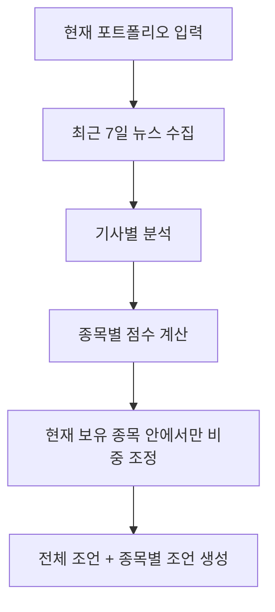

# 260315 경제뉴스 포트폴리오 쉬운설명

기준 시각: 2026-03-15 15:16 +09:00

이 문서는 기존 리서치 문서인 `260315_1448_경제뉴스_여론기반_포트폴리오_설계.md`를 더 쉽게 다시 풀어쓴 버전이다.  
목표는 복잡한 연구 용어보다, **이 시스템을 실제로 만들려면 무엇을 하고 무엇을 버려야 하는지**를 바로 이해하게 하는 것이다.

---

## 한 줄 요약 👀

이 시스템은 충분히 만들 가치가 있다.  
하지만 처음부터 `뉴스 + 댓글 + PV + 좋아요 + 유튜브 + 완벽한 AI 분석`을 전부 하려 하면 실패할 가능성이 높다.

가장 현실적인 시작은 이것이다.

1. 최근 7일 뉴스만 모은다
2. 뉴스 본문과 제목을 분석한다
3. 각 뉴스가 어떤 종목에 얼마나 중요한지 판단한다
4. 종목별로 긍정/부정 점수를 만든다
5. 현재 포트폴리오 안에서만 수량을 조금씩 조정한다

즉, 이 프로젝트의 핵심은 "뉴스를 많이 모으는 것"이 아니라,

- **어떤 뉴스가 어떤 종목에 중요한지 잘 연결하고**
- **그 영향이 단기적으로 플러스인지 마이너스인지 판단하고**
- **너무 과하게 매매하지 않도록 수량만 조절하는 것**

에 있다.

---

## 이 아이디어는 맞는가? ✅

결론부터 말하면 **맞다.**

경제뉴스와 여론은 실제로 주가에 영향을 준다.  
특히 **단기**에서는 더 그렇다.

왜냐하면 단기 주가는 결국 사람들이 사고팔면서 움직이는데, 그 판단에 가장 빨리 영향을 주는 것이 뉴스, 분위기, 공포, 기대 같은 요소이기 때문이다.

다만 중요한 점이 하나 있다.

### 뉴스 여론은 "단기"에는 강하지만, "장기"에는 약해진다

- 당일~수일: 뉴스와 여론 영향이 큼
- 수주~수개월: 실적, 금리, 재무상태, 밸류에이션 영향이 더 커짐

그래서 이 시스템은 **장기 투자 전체를 대신하는 엔진**보다는  
**단기~중단기 포트폴리오 조정 엔진**으로 보는 것이 맞다.

---

## "실제 주가를 움직이는 것은 여론"이라는 생각은 맞는가? 🤔

이 생각은 **절반은 맞고 절반은 틀리다.**

### 맞는 부분

- 뉴스가 나오면 투자자 심리가 바로 반응한다
- 커뮤니티, 댓글, 유튜브가 분위기를 증폭시킨다
- 개인투자자가 많이 보는 종목일수록 여론 영향이 커지기 쉽다

### 틀릴 수 있는 부분

- 여론만으로 기업 가치가 영원히 올라가지는 않는다
- 장기적으로는 결국 실적과 현금흐름이 중요하다
- 대형 우량주는 여론보다 펀더멘털이 더 강하게 작동하는 경우가 많다

### 쉬운 결론

```text
단기:
여론과 뉴스가 중요

장기:
펀더멘털이 중요
```

즉, 당신의 직감은 **단기 운용 관점에서는 꽤 타당하다.**

---

## 무엇을 분석해야 하나? 📌

처음에는 아래 우선순위로 가는 것이 좋다.

### 가장 중요한 것

1. 기사 제목
2. 기사 본문
3. 발행 시각
4. 어떤 종목과 관련 있는지
5. 어떤 종류의 뉴스인지

예를 들면 이런 분류가 중요하다.

- 실적 발표
- 가이던스 상향/하향
- 규제 이슈
- 소송
- 인수합병
- 증자
- 리콜
- 신제품
- 금리/환율/거시 이슈

### 덜 중요한 것

- PV
- 좋아요 수
- 댓글 수
- 댓글 좋아요/싫어요 수

이 값들도 쓸 수는 있다.  
하지만 이 값들은 **방향을 알려주는 신호**라기보다, **사람들이 얼마나 크게 반응했는지 보여주는 신호**에 가깝다.

즉:

```text
뉴스 본문 = 방향
댓글/PV/좋아요 = 반응 강도
```

그래서 처음부터 `PV/좋아요/댓글`에 너무 기대하면 안 된다.

---

## 왜 PV, 좋아요, 댓글을 중심에 두면 안 되나? ⚠️

이유는 단순하다.

### 1. 데이터가 안정적으로 잘 안 모인다

- 플랫폼마다 제공 방식이 다르다
- 공식 API에서 안 주는 경우가 많다
- 비공식 크롤링은 깨지기 쉽다

### 2. 조작되거나 왜곡될 수 있다

- 논란 기사도 댓글이 폭발한다
- 악재 기사도 조회수가 높다
- 큰 언론사와 작은 언론사는 raw count 자체가 비교가 안 된다

### 3. 방향을 잘못 읽기 쉽다

댓글이 많다고 긍정이 아니다.  
오히려 큰 악재일수록 댓글이 더 많이 달릴 수 있다.

### 실전 판단

PV, 좋아요, 댓글은 쓰더라도 이렇게 써야 한다.

- 본문 분석이 먼저
- 댓글 숫자는 보조
- 댓글 텍스트가 있으면 그때 의미가 커짐
- source별 정규화 필요

---

## 유튜브도 넣어야 하나? 📺

결론은 **언젠가는 넣는 것이 좋다.**  
하지만 **처음부터는 아니다.**

왜냐하면 요즘은 텍스트 뉴스만큼, 아니 어떤 경우에는 그보다 더 많이 유튜브 경제 채널이 투자 분위기를 만들기 때문이다.

특히 유튜브는 이런 점이 강하다.

- 뉴스 내용을 쉽게 풀어준다
- 특정 종목에 대한 기대감을 키운다
- 같은 메시지를 반복 노출한다
- 커뮤니티 성격이 강하다

하지만 구현 난이도도 높다.

- 영상 수집
- 자막 수집
- 자막 없으면 음성 인식
- 긴 영상 요약
- 잡음 제거
- 채널 신뢰도 평가

그래서 추천 순서는 이렇다.

1. 뉴스 텍스트 분석 먼저
2. 백테스트로 유효성 확인
3. 그다음 유튜브 추가

---

## 가장 현실적인 시스템 구조 🏗️

이 시스템은 아주 복잡하게 볼 필요 없다.  
처음에는 아래 흐름만 잘 만들면 된다.



이 구조의 핵심은 다음 3개다.

### 1. 뉴스 수집

- 한국 주식: `Naver News Search API + DART`
- 미국 주식: `Alpha Vantage News & Sentiment`
- 보조: `GDELT`
- 가격 조회: `Yahoo Finance`

### 2. 기사 분석

기사 하나마다 아래를 판단한다.

- 이 기사가 어느 종목 이야기인가?
- 이 뉴스는 호재인가 악재인가?
- 영향은 하루짜리인가, 며칠 가는가?
- 확실한 사실인가, 해석이 섞였는가?

### 3. 포트폴리오 조정

입력에 있는 종목만 사용한다.  
새 종목은 추가하지 않는다.

예를 들어 입력이 아래라면:

```json
[
  {"ticker": "005930.KS", "quantity": 10},
  {"ticker": "MSFT", "quantity": 4},
  {"ticker": "GLD", "quantity": 2},
  {"ticker": "CASH_USD", "quantity": 1000}
]
```

출력도 이 안에서만 바뀐다.

- 삼성전자 수량 감소
- MSFT 수량 증가
- GLD 증가
- CASH 증가

이런 식으로만 조정한다.

---

## 중요한 제약 하나 💡

이 시스템은 **기존 보유 종목만 수량 조정**한다.  
그래서 입력 포트폴리오에 `현금`이나 `금`이 없으면 문제가 생길 수 있다.

예를 들어 보유 종목이 전부 악재인데, 그중 하나도 방어 자산이 아니면  
시스템은 결국 **나쁜 종목들 사이에서만 비율을 조정**해야 한다.

그래서 실전에서는 아래를 추천한다.

- `CASH_KRW`
- `CASH_USD`
- `GLD` 또는 금 ETF

이런 항목을 포트폴리오에 미리 넣어 두는 것이 좋다.

---

## 어떤 기술 스택이 좋은가? 🛠️

당신이 제시한 방향은 꽤 적절하다.

### 추천 스택

- `Python`
- `PydanticAI`
- `AWS`
- `Yahoo Finance`
- `Naver News Search API`
- `DART`
- `Alpha Vantage`
- 필요 시 `FMP` 또는 `Marketaux`

### 왜 이 조합이 좋은가?

#### Python

- 데이터 처리와 백테스트에 강함
- 금융 실험 코드 작성이 빠름

#### PydanticAI

- 기사 분석 결과를 구조화하기 좋음
- LLM이 아무 말이나 하지 못하게 스키마를 강제할 수 있음

#### AWS

- 배치 수집과 분석 파이프라인 구성에 적합
- Lambda, S3, SQS만으로도 MVP 가능

---

## PydanticAI는 어떻게 쓰면 좋은가? 🤖

어렵게 생각할 필요 없다.  
처음에는 에이전트를 4개만 나누면 충분하다.

### Agent 1. 종목 연결기

역할:

- 기사나 영상이 어떤 종목 이야기인지 판단

출력 예:

- 주 종목
- 보조 종목
- 관련도 점수

### Agent 2. 뉴스 의미 분석기

역할:

- 호재인지 악재인지
- 어떤 이벤트인지
- 영향이 얼마나 큰지

### Agent 3. 종목 점수 집계기

역할:

- 최근 7일 뉴스 결과를 모아서
- 종목별 최종 점수를 계산

### Agent 4. 포트폴리오 조정기

역할:

- 현재 수량
- 현재 가격
- 종목 점수

를 보고 목표 수량 산출

---

## 데이터 구조도 복잡할 필요는 없다 📦

처음에는 아래 정도면 충분하다.

```python
from pydantic import BaseModel


class Position(BaseModel):
    ticker: str
    quantity: float


class NewsItem(BaseModel):
    source: str
    url: str
    published_at: str
    title: str
    body: str | None = None


class AnalyzedNews(BaseModel):
    ticker: str
    direction: str   # positive / negative / mixed
    confidence: float
    event_type: str
    reason: str


class RebalanceItem(BaseModel):
    ticker: str
    current_quantity: float
    target_quantity: float
    advice: str
```

처음부터 너무 많은 필드를 넣지 말고,  
`정말 의사결정에 쓰는 정보만 남기는 것`이 중요하다.

---

## 백테스트는 어떻게 해야 하나? 📈

이 프로젝트에서 제일 중요한 것은 사실 모델이 아니라 **백테스트**다.

왜냐하면 이 시스템이 정말 의미 있는지 알려면  
실제로 "뉴스 점수가 높은 종목이 이후 며칠 동안 더 잘 갔는가?"를 봐야 하기 때문이다.

### 먼저 확인해야 할 것

1. 뉴스 본문만 써도 예측력이 있는가?
2. 최신성 가중치를 넣으면 좋아지는가?
3. 댓글/PV/좋아요를 넣으면 더 좋아지는가?
4. 유튜브를 넣으면 추가로 좋아지는가?

### 추천 테스트 순서

#### 1단계

- text only

#### 2단계

- text + recency

#### 3단계

- text + recency + engagement

#### 4단계

- text + recency + engagement + youtube

이 순서가 중요한 이유는  
나중에 "복잡하게 만든 기능이 정말 도움이 됐는지"를 알 수 있기 때문이다.

---

## 실제로는 어떻게 리밸런싱해야 하나? 💼

너무 공격적으로 하면 안 된다.

뉴스 신호는 생각보다 noisy하다.  
그래서 처음에는 **보수적으로 조금만 조정**하는 것이 맞다.

예를 들어:

- 강한 호재: 비중 소폭 증가
- 강한 악재: 비중 소폭 감소
- 증거가 약함: 거의 유지

### 추천 원칙

- 하루에 너무 많이 바꾸지 않기
- 신호가 애매하면 유지
- 출처가 한 군데뿐이면 보수적으로
- 기사 수가 너무 적으면 보수적으로

즉, 이 시스템은  
`올인/올아웃` 시스템이 아니라  
`살짝 기울이는(tilt)` 시스템으로 가야 한다.

---

## 지금 있는 코드들은 어디까지 쓸 수 있나? 🧩

현재 로컬 코드들은 **출발점**으로는 괜찮다.

### `news_naver_crawl.py`

- 네이버 기사 수집 실험용으로 좋음
- 하지만 랭킹 기사 위주라 편향이 큼

### `news_us_crawl.py`

- 미국 뉴스 수집 시작점으로는 괜찮음
- 하지만 coverage가 좁고 종목 연결이 없음

### `padantic_ai_claude_basic.py`

- PydanticAI 구조화 출력 실험용으로 적절
- 이제 숫자 계산 대신 뉴스 분석 스키마로 확장하면 됨

### `stock_query.py`

- 가격 조회용으로 MVP에 충분

### 결론

지금 코드는 바로 서비스 수준은 아니지만,  
MVP를 시작하기에는 충분한 재료가 있다.

---

## 가장 추천하는 개발 순서 🚀

처음부터 크게 만들지 말고, 아래 순서로 가는 것이 가장 안전하다.

### 1단계. 뉴스 기반 MVP

- 최근 7일 뉴스 수집
- 기사 제목/본문 분석
- 종목별 점수 계산
- 포트폴리오 수량 조정
- 간단한 리포트 출력

### 2단계. 백테스트

- 정말 예측력이 있는지 확인
- 리밸런싱이 buy-and-hold보다 나은지 확인

### 3단계. engagement 추가

- PV
- 좋아요
- 댓글 수
- 댓글 텍스트

### 4단계. 유튜브 추가

- 영상 메타데이터
- 댓글
- 자막/음성 분석

### 5단계. AWS 운영화

- 수집 자동화
- 저장 구조화
- 리포트 자동 생성

---

## 최종 추천안 ✅

가장 현실적인 첫 버전은 이렇다.

### 수집

- 한국: `Naver News Search API + DART`
- 미국: `Alpha Vantage News & Sentiment`
- 가격: `Yahoo Finance`

### 분석

- 뉴스 제목/본문
- 최신성
- 종목 연결
- 이벤트 타입

### 보조

- 댓글/PV/좋아요는 나중에 추가

### 출력

- 전체 조언 1개
- 종목별 조언 N개
- 기존 종목만 수량 조정

---

## 정말 중요한 마지막 한마디

이 시스템의 승부처는  
`뉴스를 얼마나 많이 긁어오느냐`가 아니다.

진짜 승부처는 아래 3개다.

1. **이 뉴스가 어떤 종목에 중요한지 정확히 연결하는가**
2. **이 뉴스가 왜 호재/악재인지 구조적으로 설명할 수 있는가**
3. **과도하게 매매하지 않고 수량 조정만 안정적으로 할 수 있는가**

이 3개만 잘하면, 이 프로젝트는 충분히 경쟁력이 있다.

---

## 참고 링크 🔗

- NBER, `Media Sentiment and Stock Prices`  
  https://www.nber.org/papers/w25353
- NBER, `Investor Sentiment and the Cross-Section of Stock Returns`  
  https://www.nber.org/papers/w10449
- Chen, De, Hu, Hwang, `Wisdom of Crowds`  
  https://www.bhwang.com/Research/SeekingAlpha_R2.pdf
- Reuters Institute, `Digital News Report 2024`  
  https://reutersinstitute.politics.ox.ac.uk/digital-news-report/2024
- YouTube Data API `videos`  
  https://developers.google.com/youtube/v3/docs/videos
- YouTube Data API `commentThreads`  
  https://developers.google.com/youtube/v3/docs/commentThreads
- Naver 뉴스 검색 API  
  https://developers.naver.com/docs/serviceapi/search/news/news.md
- Naver DataLab 검색어 트렌드  
  https://developers.naver.com/docs/serviceapi/datalab/search/search.md
- Alpha Vantage 공식 문서  
  https://www.alphavantage.co/documentation/
- GDELT DOC 2.0 API  
  https://blog.gdeltproject.org/gdelt-doc-2-0-api-debuts/
- Financial Modeling Prep  
  https://site.financialmodelingprep.com/
- Marketaux  
  https://www.marketaux.com/
- PydanticAI Agents  
  https://ai.pydantic.dev/agents/
- PydanticAI Evals  
  https://ai.pydantic.dev/evals/

---

## 이번 작성에 사용한 사용자 질문 프롬프트

```text
$hhd-md 
@C:\Users\hhd20\project\hhddoc\260315_1448_경제뉴스_여론기반_포트폴리오_설계.md
위 문서를 더 쉽게 새 파일에 다시 작성해 주세요.
```
