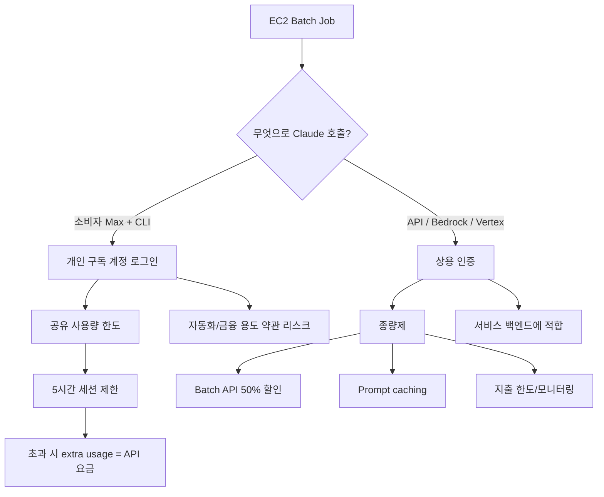

# 260316 LLM API vs Code CLI 비교

기준 시각: 2026-03-16 17:57 (Asia/Seoul, internet time)

## 문제 설정

뉴스 콘텐츠 감정분석을 통해 포트폴리오를 리밸런싱하는 서비스를 만들 때, 가장 먼저 드는 생각은 이것이다.

> `LLM API`는 종량제라 비싸 보이는데,  
> `Claude Code Max` 같은 정액제 CLI를 EC2에서 백엔드처럼 돌리면 더 싸지 않을까?

겉보기에는 그럴듯하다. 하지만 2026-03-16 기준 공식 문서를 기준으로 보면, 이 접근은 **비용 우회 전략으로도 약하고, 서비스 운영 방식으로도 리스크가 크다.**

## 한눈에 결론

`포트폴리오 리밸런싱 서비스`의 프로덕션 경로는 `LLM API`가 맞다.  
`Claude Code Max`를 EC2에서 잡 처리용 백엔드처럼 사용하는 방식은 **약관, 운영 안정성, 확장성, 데이터 정책 측면에서 부적합**하다.

간단히 압축하면 아래와 같다.

| 항목 | LLM API | Claude Code Max 같은 소비자용 Code CLI |
| --- | --- | --- |
| 과금 구조 | 종량제, `Batch API`와 `Prompt caching`으로 최적화 가능 | 월정액 + 사용량 한도 + 초과 시 사실상 다시 종량제 |
| 자동화 적합성 | 공식 지원 경로 | 소비자 약관상 위험 |
| 서비스 운영 적합성 | 상용/고객 서비스용 계약 체계 | 개인 개발자용 사용 경험에 가까움 |
| 확장성 | 동시성, 비용 한도, 로깅, 키 회전, 공급자 전환 가능 | 계정 공유, 세션 관리, 한도 관리가 취약 |
| 데이터 정책 | 상용 경로 기준으로 명확 | 소비자 계정 설정에 따라 학습 사용 가능 |

## 구조를 그림으로 보면



## 왜 `Max + CLI 백엔드`가 위험한가

### 1. 소비자 약관이 자동화와 금융 활용에 매우 보수적이다

Anthropic의 Consumer Terms는 `Anthropic API Key`로 접근하거나 명시적으로 허용된 경우가 아니라면, 서비스를 `automated or non-human means`로 접근하면 안 된다고 적고 있다. 또한 서비스 출력이나 액션에 의존해 `buy or sell securities` 또는 금융상품 관련 조언을 제공하거나 받는 용도로 쓰지 말라고 명시한다.

이 문구를 그대로 해석하면, `Claude Max 개인 계정`을 EC2에 로그인시켜 배치 잡이 자동으로 리밸런싱 계산을 수행하게 하는 방식은 매우 불안하다. 특히 당신의 서비스는 주제가 아예 `포트폴리오 조정`이기 때문에 더 민감하다.

### 2. Anthropic은 자동화용 경로를 별도로 제시한다

Agent SDK 문서는 프로덕션 에이전트를 만들려면 `API key`, `Amazon Bedrock`, `Vertex AI`, `Azure Foundry` 같은 상용 인증 경로를 쓰라고 안내한다. 더 직접적으로는, Anthropic이 별도 승인하지 않은 이상 제3자 개발자가 `claude.ai login`이나 그 rate limit을 자기 제품에 제공하는 것을 허용하지 않는다고 적고 있다.

즉 공식 입장은 사실상 이렇다.

> 개발자 본인이 터미널에서 쓰는 `Claude Code`와  
> 고객 서비스의 백엔드 인증 수단은 분리해서 보라.

### 3. `Max`는 무제한 정액제가 아니다

`Using Claude Code with your Pro or Max plan` 문서에 따르면, Pro/Max의 사용량 한도는 `Claude`와 `Claude Code` 사이에서 공유된다. 한도에 도달하면 기다리거나, `extra usage`를 켜거나, API credit/pay-as-you-go를 선택해야 한다.

또 `Extra usage for paid Claude plans` 문서는 다음을 분명히 한다.

- 한도는 통상 `5시간` 단위로 리셋된다.
- 한도를 넘으면 `extra usage`로 계속 쓸 수 있다.
- 이 `extra usage`는 `standard API pricing`으로 과금된다.
- Claude 대화와 Claude Code 사용량이 함께 반영된다.

즉 `Max 200달러면 백엔드 호출을 무제한 흡수한다`는 그림이 아니다.  
실제로는 `포함 사용량 + 초과 시 API 요금` 구조에 가깝다.

### 4. 데이터 정책도 서비스 백엔드에는 API 쪽이 더 깔끔하다

Claude Code의 data usage 문서에 따르면:

- `Free/Pro/Max` 같은 소비자 계정은 설정이 켜져 있으면 데이터가 향후 모델 개선에 사용될 수 있다.
- 소비자 계정은 데이터 학습 허용 여부에 따라 보존 기간이 `5년` 또는 `30일`이다.
- 반면 `API/Team/Enterprise` 같은 commercial terms 하에서는, 고객이 별도 opt-in 하지 않는 한 Anthropic이 코드나 프롬프트로 생성형 모델을 학습하지 않는다고 적고 있다.

금융 관련 서비스는 정책과 보존 체계가 더 단정한 경로가 낫다. 이 점에서도 API가 맞다.

## 금융 서비스 관점에서 추가로 걸리는 부분

Anthropic Usage Policy는 `Finance`를 `High-Risk Use Case`로 분류한다. 투자 조언, 대출 승인, 금융 적격성 판단 같은 영역에서는 다음을 요구한다.

- `Human-in-the-loop`
- AI 사용 사실 `Disclosure`

따라서 당신의 서비스가 단순 리서치 도구를 넘어 사용자에게 직접 리밸런싱 제안을 보여준다면, 기술비용만 볼 문제가 아니다.  
정책 준수, 사용자 고지, 최종 검토 책임을 함께 설계해야 한다.

## 비용만 놓고 보면 API는 정말 많이 비싼가

반드시 그렇지는 않다. 오히려 뉴스 감정분석처럼 **짧고 반복적인 분류 작업**은 API가 예상보다 싸게 나올 수 있다.

아래는 단순한 가정이다.

- 기사 1건 입력: `4,000 tokens`
- 결과 출력: `800 tokens`
- 기준 모델: `Claude Haiku 4.5`, `Claude Sonnet 4.6`

### 1건당 대략 비용

| 모델 | 표준 API | Batch API |
| --- | --- | --- |
| Haiku 4.5 | 약 `$0.008 / 건` | 약 `$0.004 / 건` |
| Sonnet 4.6 | 약 `$0.024 / 건` | 약 `$0.012 / 건` |

계산 근거는 아래와 같다.

- `Haiku 4.5`: 입력 `$1/MTok`, 출력 `$5/MTok`
- `Sonnet 4.6`: 입력 `$3/MTok`, 출력 `$15/MTok`
- `Batch API`: 입력/출력 모두 `50%` 할인

### 월 `200달러` 예산일 때 대략 처리량

| 모델 | 표준 API | Batch API |
| --- | --- | --- |
| Haiku 4.5 | 약 `25,000건/월` | 약 `50,000건/월` |
| Sonnet 4.6 | 약 `8,300건/월` | 약 `16,600건/월` |

이 숫자는 기사 길이와 출력 길이에 따라 바뀌지만, 중요한 포인트는 분명하다.

> 잘 설계된 API 파이프라인은  
> 생각보다 충분히 싸고,  
> `정액제 CLI 우회`보다 훨씬 안정적이다.

## 비용을 더 줄이는 현실적인 방법

정말로 비용을 아끼고 싶다면, `CLI 정액제 우회`보다 아래가 훨씬 효과적이다.

### 1. LLM을 정말 필요한 단계에만 사용

LLM이 필요 없는 단계는 전부 비LLM으로 처리한다.

- 기사 수집
- URL/본문 해시 기반 중복 제거
- 티커 후보 추출
- 날짜/언론사/카테고리 정규화
- 간단한 규칙 기반 필터링

### 2. 2단계 모델 전략

분류는 저가 모델, 설명은 상위 모델로 나눈다.

- 1차: `Haiku` 또는 로컬 경량 모델로 `sentiment`, `event type`, `ticker relevance`
- 2차: 애매한 케이스만 `Sonnet`
- 3차: 최종 포트폴리오 코멘트/리포트 생성만 상위 모델

### 3. Batch API 사용

뉴스 분석은 대부분 즉시성보다 대량 비동기 처리와 잘 맞는다.  
Batch API는 입력/출력 토큰 모두 `50%` 할인되므로, 뉴스 분류 계열에는 특히 유리하다.

### 4. Prompt caching 사용

동일한 시스템 프롬프트, 분류 스키마, 긴 정책 설명, 분석 규칙을 매번 반복해서 보내면 돈이 새기 쉽다.  
Prompt caching을 붙이면 반복 문맥 비용을 크게 줄일 수 있다.

### 5. 일부는 로컬 모델로 내리기

다음 종류는 로컬 소형 모델이나 전통 ML로도 충분히 가능하다.

- 긍정/부정/중립 초벌 분류
- 기사-종목 relevance 후보 추리기
- 중복 기사 판별
- 문장 단위 키워드 추출

LLM은 정말 애매한 해석과 최종 설명에만 쓰는 편이 낫다.

## 당신의 서비스에 맞는 추천 운영안

현재 구상 중인 `뉴스 감정분석 기반 포트폴리오 리밸런싱` 서비스에는 아래 구성이 가장 현실적이다.

### 추천안

1. 데이터 수집과 정제는 비LLM 처리
2. 기사 relevance / sentiment / event type은 `Haiku + Batch API`
3. 애매한 기사나 종목별 해설은 `Sonnet`
4. 최종 리밸런싱 제안은 `human-in-the-loop`를 전제로 제공
5. 사용자 노출 화면에는 AI 사용 사실을 명시
6. 장기적으로는 `Bedrock` 또는 `Vertex`도 검토

### 운영 포지션

- `Claude Code Max`
  - 개발 생산성 향상
  - 프롬프트 실험
  - 수동 백필
  - 일회성 조사

- `LLM API`
  - 실제 서비스 배치 실행
  - 예약 잡
  - 다중 고객 처리
  - 비용 통제와 모니터링
  - 정책 준수 구조화

## 최종 판단

당신의 질문을 한 문장으로 다시 답하면 이렇다.

> `Claude Code Max를 EC2에서 백엔드처럼 돌려 정액제로 이득을 보는 전략`은  
> 공식 문서 기준으로 안정적인 절감 전략이 아니고,  
> 서비스 운영 경로로는 추천하기 어렵다.

오히려 진짜 절감 포인트는 다음이다.

- `Batch API`
- `Prompt caching`
- `하위 모델 + 상위 모델`의 단계 분리
- `비LLM 전처리`
- `로컬 모델`의 부분 도입

즉, `code CLI는 API의 싼 대체재`가 아니라 `개발자용 UX`에 가깝다.  
프로덕션 엔진은 API로 두고, CLI는 개발 도구로 쓰는 구도가 맞다.

## 참고 URL

- https://www.anthropic.com/legal/consumer-terms
- https://www.anthropic.com/legal/aup
- https://platform.claude.com/docs/en/agent-sdk/overview
- https://code.claude.com/docs/en/costs
- https://code.claude.com/docs/en/data-usage
- https://platform.claude.com/docs/en/about-claude/pricing
- https://support.claude.com/en/articles/11145838-using-claude-code-with-your-pro-or-max-plan
- https://support.claude.com/en/articles/12429409-extra-usage-for-paid-claude-plans

## 작성 시 사용한 사용자 질문 프롬프트

```text
$hhd-search

think ultra hard

주제
- llm api 사용 vs llm code cli 사용 비교

고민사항
- 뉴스컨텐츠 감정분석을 통한 포트폴리오 리밸런싱 서비스를 제작중
  - @C:\Users\hhd20\project\hhddoc\260315_1448_경제뉴스_여론기반_포트폴리오_설계.md
- 이때 llm api 사용비용을 절약해야 할 필요가 아주 큼.
- 이때 aws ec2에 서비스를 만들어 두고 job 요청이 오면, claude code max 200$ 를 구독후 cli 명령어로 필요한 명령을 실행하면 어떨까?
- claude api 로 작업하면 토큰당 비용이 발생하는 종량제인데 claude code max 방식처럼, 개발자 사용자가 사용하는 것처럼 한다면, 정액제로 사용해서 큰 이익이 되지 않겠는가?

$hhd-md 위 답변 내용
```
