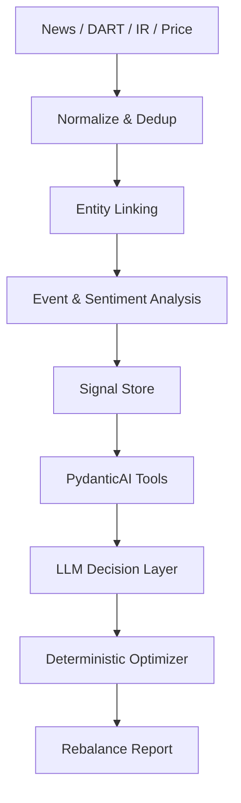

# 260316 LLM Tool 실용성 분석

작성 시각: 2026-03-16 17:24:02 +09:00

## 한눈에 결론

`LLM + PydanticAI + tool` 조합은 실용적이다.  
다만 핵심은 `tool을 많이 붙이는 것`이 아니라, `LLM이 정말 판단해야 하는 불확실성만 남기고 나머지를 코드와 DB로 밀어내는 것`이다.

뉴스 기반 감정분석으로 포트폴리오를 리밸런싱하는 서비스에서는 이 효과가 특히 크다.  
장황한 자연어로 “최근 7일 삼성전자 관련 뉴스를 읽고 여론을 파악해서 비중을 조정해라”라고 시키는 방식보다, 미리 수집·정제·중복제거·종목매핑·감정/이벤트 분석을 해두고 이를 구조화된 tool로 조회하게 만드는 편이 보통 더 안정적이다.

이건 단순히 토큰 절감 때문이 아니다. 더 중요한 것은 아래 세 가지다.

- 정확한 상태를 모델에 주입할 수 있다.
- 긴 컨텍스트에서 정보가 묻히는 문제를 줄일 수 있다.
- 계산, 제약 처리, 재현성 같은 부분을 결정론적 코드로 통제할 수 있다.

## 왜 품질이 좋아질 가능성이 큰가

### 1. 자연어 한방 프롬프트보다 상태 주입이 더 정확하다

모델이 원문 기사 수십 개를 직접 읽고 핵심을 뽑게 하면, 기사 간 중복, 중요도 차이, 출처 신뢰도 차이, 종목 직접 연관도 같은 요소를 매번 모델이 내부적으로 추정해야 한다.

반대로 아래처럼 미리 구조화된 상태를 tool로 공급하면 모델은 훨씬 덜 흔들린다.

```json
{
  "ticker": "005930.KS",
  "window_days": 7,
  "deduped_article_count": 11,
  "signal_score": -0.42,
  "event_types": ["guidance_cut", "demand_slowdown"],
  "source_diversity": 4,
  "high_credibility_ratio": 0.73,
  "uncertainty": 0.18,
  "top_evidence": [
    {"source": "Reuters", "published_at": "2026-03-15T08:10:00+09:00"},
    {"source": "DART", "published_at": "2026-03-14T17:31:00+09:00"}
  ]
}
```

이 구조에서는 모델이 “무엇이 사실인가”를 다시 발명하지 않고, “이 사실을 어떻게 해석할까”에 집중할 수 있다.

### 2. LLM이 약한 부분을 code/tool로 바깥에 빼낼 수 있다

리밸런싱 서비스에서 중요한 작업 중 상당수는 사실 LLM보다 코드가 더 잘한다.

- 최근 7일 기사 수집
- 중복 기사 제거
- 종목명/브랜드명/티커 매핑
- 시세 조회
- 변동성, 상관관계, turnover 계산
- weight 제약 충족
- 신규 ticker 금지
- cash 잔여분 정리

이런 작업을 tool로 밖으로 빼면, 모델은 계산기를 들고 씨름하지 않아도 된다.  
결과적으로 hallucination과 제약 위반이 줄어든다.

### 3. long context의 약점을 피할 수 있다

긴 문맥이 항상 좋은 것은 아니다.  
관련 연구에서는 긴 입력에서 가운데 정보가 잘 활용되지 않는 현상과, long-context만으로는 retrieval을 완전히 대체하지 못하는 문제가 계속 관찰된다.

즉, “기사 원문을 많이 넣으면 더 똑똑해지겠지”는 보장되지 않는다.  
오히려 중요한 기사 몇 개와 구조화된 집계 결과를 함께 주는 쪽이 품질 면에서 더 낫다.

## 하지만 tool이 많다고 무조건 좋은 것은 아니다

여기서 가장 중요한 함정이 있다.  
`tool 기반 설계`는 좋지만, `tool 과다 노출`은 오히려 성능을 깎을 수 있다.

### 1. 모델이 어떤 tool을 써야 하는지부터 헷갈릴 수 있다

예를 들어 아래처럼 세분화가 과도하면 좋지 않다.

- `get_news_titles`
- `get_news_bodies`
- `get_news_sentiments`
- `get_news_sources`
- `get_news_dates`
- `get_news_ticker_mentions`

이런 식이면 모델은 실제 분석보다 “무슨 순서로 무슨 tool을 호출할까”에 에너지를 쓴다.  
호출 수가 늘수록 실패 가능성도 같이 늘어난다.

### 2. micro-tool은 orchestration 비용이 커진다

도구가 많아지면 아래 비용이 생긴다.

- tool 선택 오류
- 불필요한 호출 반복
- latency 증가
- tracing 복잡도 증가
- eval 시나리오 복잡도 증가

즉, 내부적으로 구현 capability가 많은 것과, agent에게 노출하는 active tool 개수가 많은 것은 다르게 관리해야 한다.

### 3. 요약 점수만 주는 것도 위험하다

반대로 모든 원문을 제거하고 sentiment score만 넘기면 또 다른 문제가 생긴다.  
전처리 모델이 틀렸을 때 LLM이 스스로 반박하거나 재해석할 재료가 없다.

그래서 가장 실용적인 형태는 보통 아래다.

- 기본 판단: precomputed structured signal
- 예외 처리: top evidence 몇 건 drill-down
- 최종 수량 계산: deterministic optimizer
- 최종 설명 작성: LLM

## 이 서비스에 맞는 권장 구조

뉴스 감정분석 기반 포트폴리오 리밸런싱 서비스라면, `raw text all-in prompt`보다 `summary + drill-down` 구조가 더 적합하다.



### 권장 tool 묶음

agent 한 번 실행할 때 노출하는 상위 tool은 적게 유지하는 편이 좋다.  
대체로 `5~8개 수준의 도메인 tool`이 실용적이다.

예시:

1. `get_portfolio_snapshot`
2. `get_ticker_signal_window`
3. `get_news_evidence_bundle`
4. `get_market_risk_snapshot`
5. `run_rebalance_optimizer`
6. `get_report_payload`

이 정도면 모델은 “무엇을 호출할까”보다 “어떻게 판단할까”에 집중할 수 있다.

### tool 반환값에 꼭 들어가야 할 필드

- `as_of`
- `signal_version`
- `evidence_count`
- `source_diversity`
- `confidence`
- `uncertainty`
- `event_type`
- `top_evidence`

이 필드들이 있어야 모델이 결과를 해석할 때 근거와 한계를 동시에 볼 수 있다.

## PydanticAI에서 특히 맞는 부분

PydanticAI는 이 구조와 잘 맞는다.

- `output_type`으로 최종 출력을 강하게 구조화할 수 있다.
- `deps_type`으로 DB client, market data client, optimizer 등을 주입할 수 있다.
- `toolsets`와 filtering으로 상황별 노출 tool을 줄일 수 있다.
- `evals`로 tool 사용 품질과 최종 결과 품질을 분리해서 볼 수 있다.
- durable execution/observability를 붙이면 어떤 tool 호출이 실패했는지 추적하기 쉽다.

따라서 이 서비스에서 PydanticAI를 쓰는 실질적 가치는 “LLM을 더 똑똑하게 만든다”보다, “LLM이 사용할 작업 경계를 명확히 만들어준다”에 더 가깝다.

## 실제로 어디까지 기대해도 되는가

### 기대해도 되는 부분

- 자연어 한방 프롬프트보다 결과 일관성이 올라갈 가능성
- 잘못된 기사/중복 기사/낮은 신뢰도 출처에 끌려갈 위험 감소
- 제약 조건을 지키는 리밸런싱 결과 증가
- 설명과 근거를 함께 제시하기 쉬움
- 재현성 있는 백테스트 및 회귀 테스트 가능

### 과하게 기대하면 안 되는 부분

- tool을 붙였다고 시장 예측력이 자동으로 생기지는 않음
- 전처리된 sentiment가 틀리면 잘못된 구조화 결과를 더 자신 있게 말할 수 있음
- engagement, 댓글 수, 좋아요 수 같은 피처는 본질적으로 노이즈가 큼
- 대형주 장기 수익률은 결국 펀더멘털과 밸류에이션의 영향이 큼

즉, tool은 `판단의 토대 품질`을 높여줄 수는 있어도, `알파를 마법처럼 만들어주지는 않는다`.

## 이 프로젝트에 대한 최종 판단

내 판단은 명확하다.

`미리 계산된 구조화 신호를 DB에 저장하고, PydanticAI tool로 정확히 조회하게 만드는 설계`는 충분히 실용적이다.  
그리고 이 경우 기대할 수 있는 가장 큰 이점은 `토큰 절감`보다 `결과 품질 안정화`다.

다만 조건이 있다.

- tool을 많이 만들지 말고, 도메인 단위로 잘 묶어야 한다.
- LLM에게 계산과 제약 처리를 맡기지 말아야 한다.
- summary signal만 주지 말고 top evidence도 함께 줘야 한다.
- 반드시 ablation으로 검증해야 한다.

이 서비스의 가장 좋은 구조는 아래 한 줄로 요약할 수 있다.

> `LLM이 모든 뉴스를 직접 읽고 계산하는 구조`보다, `정제된 사실을 tool로 조회하고 마지막 해석과 설명만 맡는 구조`가 더 현실적이고 품질이 좋을 가능성이 높다.

## 바로 해볼 실험

아래 4개를 같은 구간, 같은 포트폴리오, 같은 거래비용 가정으로 비교하면 된다.

1. `A`: raw 기사 원문을 프롬프트에 직접 대량 투입
2. `B`: precomputed signal만 tool로 조회
3. `C`: signal + top evidence 기사 3~5건 조회
4. `D`: C + deterministic optimizer

이때 수익률만 보지 말고 함께 봐야 할 지표는 아래다.

- 제약 위반률
- rerun 안정성
- explanation-grounding 불일치율
- tool selection 오류율
- turnover-adjusted return

실무적으로는 `C` 또는 `D`가 가장 균형이 좋을 가능성이 크다.

## 참고 웹 문서

- PydanticAI Function Tools  
  https://ai.pydantic.dev/tools/
- PydanticAI Toolsets  
  https://ai.pydantic.dev/toolsets/
- PydanticAI Output  
  https://ai.pydantic.dev/output/
- PydanticAI Evals  
  https://ai.pydantic.dev/evals/
- PydanticAI Durable Execution / Temporal  
  https://ai.pydantic.dev/durable_execution/temporal/
- OpenAI Evaluation Best Practices  
  https://developers.openai.com/api/docs/guides/evaluation-best-practices
- OpenAI latest model guide (`allowed_tools`)  
  https://developers.openai.com/api/docs/guides/latest-model
- Lost in the Middle: How Language Models Use Long Contexts  
  https://arxiv.org/abs/2307.03172
- Long Context vs. RAG for LLMs  
  https://arxiv.org/abs/2501.01880
- LaRA: Benchmarking Retrieval-Augmented Generation and Long-Context LLMs  
  https://arxiv.org/abs/2502.09977

## 작성 시 사용한 사용자 질문 프롬프트

```text
$hhd-search

think ultra hard

주제
- llm, pydantic ai, 사용시 tool 이 많은것이 실제로 도움이 될까? 어떤 면으로?

고민사항
- 뉴스컨텐츠 감정분석을 통한 포트폴리오 리밸런싱 서비스를 제작중
  - @C:\Users\hhd20\project\hhddoc\260315_1448_경제뉴스_여론기반_포트폴리오_설계.md
- 이때 뉴스가져오기, 감정분석결과 가져오기, 다양한 포트폴리오 이론 알고리즘 사항들을 미리 구현된 코드를 제공하고 이를 tool 로 pydandic ai 에 제공하려고 함.
- 이것은 과연 실제로 실용적인 부분이 있을까?
- 예를들면 7일간의 경제뉴스중에 삼성전자가 포함된 뉴스기사를 읽고 여론을 파악해서 리벨런싱을 하라는 장황한 자연어 명령대신
- 미리 뉴스기사와 감정분석을 진행해 놓고 자체 db에 저장한뒤 이를 조회할 수 있는 tool을 구현하고 연결하여 사용할 예정
- 단순히 토큰사용량을 줄이는 것 이외에도, 정확힌 컨텍스트를 주입할수 있다면, 결과품질이 높아질것이란 기대를 하고 있는데 과연 그럴까?
- 사실 토큰사용량 줄이는것 보다는 결과품질이 좋은게 훨씬 중요하다고 생각하고 있음.
```
