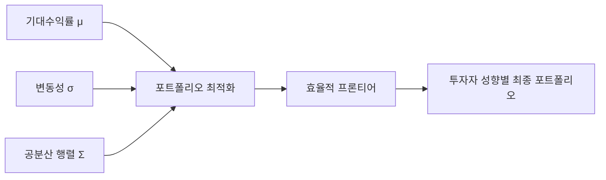
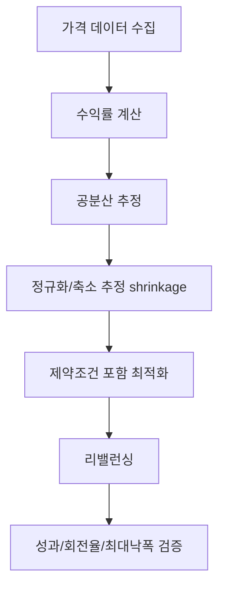

# 260316 포트폴리오 이론, 공분산 방식, MVC vs Min CVaR

기준 시각: 2026-03-16 17:30 KST  
리서치 모드: `think ultra hard`

## 한 줄 결론 👀

포트폴리오 이론의 핵심은 **개별 자산을 따로 보지 말고, 자산들이 함께 움직이는 구조까지 보라**는 것이다.  
그래서 `공분산(covariance)`이 중요해진다.

실전적으로 보면:

- `공분산 기반(Markowitz / minimum variance)`은 포트폴리오 설계의 기본 뼈대다 ✅
- 하지만 `표본 공분산 추정오차`, `급락 꼬리위험`, `과도한 리밸런싱` 문제를 같이 안고 간다 ⚠️
- `MVC`는 평시 변동성 관리에 강하고, `Min CVaR`는 급락 꼬리위험 방어에 더 적합하다 🛡️
- 현실적인 설계는 보통 `shrinkage covariance + 제약조건 + turnover control + tail-risk overlay` 조합이다 🧩

> 참고: 이 문서에서는 `MVC`를 **minimum variance, covariance-matrix-based portfolio**라는 의미로 해석했다.  
> 사용자가 `mean-variance/covariance` 의미로 말한 경우에도 핵심 비교 결론은 거의 같다.

---

## 소개 🌐

포트폴리오 이론은 1952년 Harry Markowitz의 고전 논문 `Portfolio Selection`에서 출발한다.  
이 논문의 핵심은 아주 단순하다.

- 투자자는 **기대수익률**은 좋아한다
- 투자자는 **위험**은 싫어한다
- 그런데 위험은 자산 하나의 변동성만으로 결정되지 않고, **자산끼리 얼마나 같이 움직이느냐**에도 달려 있다

즉,

```text
좋은 포트폴리오 = 수익률이 높은 자산을 많이 모은 것
가 아니라
좋은 포트폴리오 = 자산 간 상호관계를 감안해
전체 위험 대비 기대수익을 가장 효율적으로 만든 것
```

이 관점에서 나온 대표 개념이 다음이다.

- `기대수익률(Expected Return)`
- `분산/표준편차(Variance / Volatility)`
- `공분산(Covariance)`
- `상관계수(Correlation)`
- `효율적 프론티어(Efficient Frontier)`
- `최소분산포트폴리오(Global Minimum Variance Portfolio)`

포트폴리오 이론의 기본 수식은 아래처럼 정리된다.

```text
포트폴리오 기대수익률:
E[R_p] = w^T μ

포트폴리오 분산:
Var(R_p) = w^T Σ w

여기서
w = 자산 비중 벡터
μ = 기대수익률 벡터
Σ = 공분산 행렬
```

즉, 단일 자산 분석이 아니라 **벡터와 행렬 문제**가 된다.



---

## 왜 공분산이 중요한가? 🔗

같은 변동성을 가진 자산 2개라도, 서로 항상 같이 움직이면 분산효과가 약하고,  
반대로 덜 같이 움직이면 분산효과가 커진다.

그래서 포트폴리오 이론은 사실상 이렇게 읽으면 된다.

```text
포트폴리오 이론 = "분산" 이론이 아니라
"공분산을 이용한 분산효과" 이론
```

이 점이 매우 중요하다.

- 자산 하나만 보면 위험해 보여도, 다른 자산과 합치면 전체 포트폴리오는 안정될 수 있다
- 반대로 개별적으로 괜찮아 보여도, 서로 매우 높은 상관을 가지면 실제 포트폴리오는 취약해질 수 있다

---

## 장점 ✅

### 1. 분산투자를 수학적으로 정식화했다

Markowitz 이전에도 “여러 자산에 나눠 담아라”는 직관은 있었다.  
하지만 Markowitz는 이를 **공분산 행렬**로 수학화했다.

### 2. 자산이 아니라 포트폴리오 전체를 본다

포트폴리오 이론은 개별 종목이 아니라 **조합 전체의 수익-위험 구조**를 본다.  
실전에서는 이 시각 전환이 매우 크다.

### 3. 최적화 문제가 명확하다

대표 목적함수는 아래처럼 깔끔하다.

- 주어진 목표수익률에서 위험 최소화
- 주어진 위험수준에서 수익 최대화
- 아무 목표수익률 없이 분산만 최소화

이 구조는 계산적으로 다루기 쉽고, 제약조건을 붙이기에도 좋다.

### 4. 현대 포트폴리오 기법의 출발점이다

다음 기법 대부분이 Markowitz 틀을 확장하거나 수정한 것이다.

- Minimum Variance
- Black-Litterman
- Risk Parity / ERC
- Shrinkage Covariance
- Robust Optimization
- Hierarchical Risk Parity
- Mean-CVaR / Min CVaR

### 5. 실무 제약을 붙이기 좋다

현실에서는 보통 아래 조건을 함께 넣는다.

- `w_i >= 0` long-only
- 자산당 최대 비중 제한
- 섹터/국가 한도
- 추적오차 제한
- turnover 제한

즉, 포트폴리오 이론은 단순 학술 개념이 아니라 **실무 최적화 엔진의 기반**이 된다.

---

## 단점 ⚠️

### 1. 입력값 추정오차에 매우 민감하다

Ledoit-Wolf의 문제제기는 아주 직설적이다.  
표본 공분산 행렬(sample covariance matrix)은 포트폴리오 최적화에 그대로 쓰기엔 추정오차가 너무 크기 쉽다.

이게 왜 문제냐면:

- 공분산이 조금만 틀려도 최적 비중이 크게 바뀐다
- 특히 자산 수가 많고 관측기간이 짧을수록 더 불안정하다
- 결과적으로 포트폴리오가 과도하게 한쪽으로 쏠리거나, 리밸런싱이 지나치게 잦아질 수 있다

### 2. 분산은 upside와 downside를 똑같이 벌점 준다

분산은 “평균에서 멀어지는 것”을 모두 위험으로 본다.

- 위로 크게 튀는 수익도 분산은 위험으로 센다
- 아래로 크게 깨지는 손실도 분산은 위험으로 센다

투자자는 보통 **상승 변동성**보다 **하락 꼬리위험**을 더 싫어한다.  
그래서 downside risk 기반 기법이 추가로 발전했다.

### 3. 꼬리위험과 비정규성을 약하게 반영한다

평시에는 괜찮아 보여도, 위기 국면에서는 상관구조가 급변하고 left-tail risk가 커진다.

- 공분산 기반 방식은 평상시 공분산을 잘 잡아도
- 위기 때는 `상관계수 급상승`, `급락 집중`, `유동성 경색`을 충분히 담지 못할 수 있다

이 때문에 Basel 시장위험 규제도 `expected shortfall` 계열을 강조한다.

### 4. 최적 비중이 직관과 다르게 나올 수 있다

이론적으로는 최적이지만, 실제 결과는 아래처럼 나올 수 있다.

- 변동성이 낮은 자산에 과도 집중
- 비슷한 자산인데도 한 자산만 크게 선택
- 최근 데이터에 과도 적합

즉, “수학적으로 최적”과 “실무적으로 납득 가능한 포트폴리오”는 다를 수 있다.

### 5. 거래비용과 세금을 기본모형이 직접 다루지 않는다

원래 Markowitz 틀은 아주 깨끗한 수학문제다.  
하지만 실전은 그렇지 않다.

- 거래비용
- 세금
- 슬리피지
- 최소 거래 단위
- 유동성 제약

이걸 넣지 않으면 백테스트는 예뻐 보이고 실전은 무너질 수 있다.

---

## 간단 예제 🧮

두 자산 `A`, `B`가 있다고 하자.

- `A` 기대수익률: `8%`
- `B` 기대수익률: `5%`
- `A` 변동성: `20%`
- `B` 변동성: `10%`
- 상관계수: `0.2`

그러면 공분산은:

```text
Cov(A, B) = 0.20 × 0.10 × 0.20 = 0.004
```

50:50 포트폴리오를 만들면:

```text
기대수익률 = 0.5 × 8% + 0.5 × 5% = 6.5%

분산 = 0.5^2 × 0.20^2
     + 0.5^2 × 0.10^2
     + 2 × 0.5 × 0.5 × 0.004
     = 0.0145

표준편차 = sqrt(0.0145) ≈ 12.04%
```

포인트는 이것이다.

- 단순 가중 평균 변동성은 `15%` 수준으로 느껴지지만
- 실제 포트폴리오 변동성은 `12.04%`다

즉, **공분산이 낮으면 전체 위험이 생각보다 크게 줄어든다.**

이게 포트폴리오 이론의 첫 번째 감동 포인트다 😄

---

## 실용 예제 🛠️

### 예제 1. 공분산 기반 최소분산 포트폴리오

자산 3개를 두자.

- `주식 ETF`: 기대수익률 `7%`, 변동성 `18%`
- `채권 ETF`: 기대수익률 `3%`, 변동성 `8%`
- `금 ETF`: 기대수익률 `5%`, 변동성 `15%`

가정한 공분산 행렬은 다음과 같다.

```text
Σ =
[0.0324, 0.0018, 0.0060]
[0.0018, 0.0064, 0.0012]
[0.0060, 0.0012, 0.0225]
```

여기서 long-only, 총합 100% 조건으로 최소분산 최적화를 하면 대략:

- 주식 ETF: `8.65%`
- 채권 ETF: `74.80%`
- 금 ETF: `16.55%`

정도가 된다.

이 포트폴리오의 해석:

- 예상 포트폴리오 수익률: 약 `3.68%`
- 예상 변동성: 약 `7.17%`
- 구조적으로는 **채권 중심 + 금 보조 + 주식 소량** 조합이 된다

이 예제가 보여주는 것은 명확하다.

- 공분산 기반 최소분산 방식은 높은 기대수익보다 **낮은 공분산 구조와 낮은 변동성**에 크게 반응한다
- 그래서 실전에서는 종종 “너무 방어적”인 포트폴리오가 나온다

### 예제 2. 실무 워크플로우

실전에서는 보통 아래 순서로 구현한다.



실무 체크리스트:

- 데이터 빈도: `일간` 또는 `주간`
- 추정창: `1년~3년`
- 공분산 추정: 표본 공분산 그대로 쓰기보다 `Ledoit-Wolf shrinkage` 권장
- 제약조건: `long-only`, 자산당 최대비중, 섹터/국가 한도
- 비용통제: turnover penalty 또는 최소 리밸런싱 구간
- 평가: `Sharpe`, `max drawdown`, `turnover`, `out-of-sample stability`

---

## 다양한 기법들 소개 🧭

아래는 포트폴리오 이론 계열의 대표 기법들을 실무 관점으로 압축한 표다.

| 기법 | 핵심 아이디어 | 강점 | 약점 | 적합한 상황 |
|---|---|---|---|---|
| `Equal Weight (1/N)` | 자산을 동일비중으로 담음 | 단순, 강한 baseline | 위험구조 무시 | 빠른 비교 기준 |
| `Mean-Variance Optimization` | 기대수익과 분산을 함께 최적화 | 정석적 이론 | 입력오차 민감 | 고품질 기대수익 추정이 있을 때 |
| `Global Minimum Variance` | 분산만 최소화 | 안정적, 구현 쉬움 | 지나치게 방어적일 수 있음 | 수익예측 신뢰가 낮을 때 |
| `Shrinkage Covariance` | 공분산을 중심값 쪽으로 축소 | 추정오차 완화 | 여전히 모형 의존 | 자산 수가 많고 표본이 짧을 때 |
| `Black-Litterman` | 시장 균형 + 투자자 견해 결합 | 견해 반영이 자연스러움 | 파라미터 설정이 까다로움 | 탑다운/하우스뷰가 있을 때 |
| `Risk Parity / ERC` | 자산별 위험기여를 비슷하게 맞춤 | 해석 쉬움 | 기대수익 반영 약함 | 멀티에셋 장기배분 |
| `Hierarchical Risk Parity` | 군집구조를 이용해 자산을 배분 | 고차원에서 직관적 | 구조 선택에 민감 | 상관구조가 복잡할 때 |
| `Min CVaR` | 최악의 꼬리구간 평균손실 최소화 | 꼬리위험 방어 강함 | 시나리오 품질 의존 | 급락 방어가 중요할 때 |
| `Robust Optimization` | 추정오차 자체를 모델에 반영 | 과최적화 억제 | 보수적일 수 있음 | 파라미터 불확실성이 클 때 |

### 내 해석 📌

- 초보자: `Equal Weight`와 `GMV`를 먼저 비교해 보는 것이 좋다
- 중급자: `Shrinkage covariance + GMV / Risk Parity`
- 상급자: `Black-Litterman`, `Robust`, `Min CVaR`, `HRP`

---

## 공분산 기반 포트폴리오 방식 🔬

사용자가 추가로 요청한 주제를 기준으로 조금 더 깊게 정리하면 다음과 같다.

### 1. 공분산 기반 방식의 정의

공분산 기반 포트폴리오 방식은 **자산 수익률의 공분산 행렬**을 핵심 입력으로 쓰는 모든 배분 방식이다.

대표적으로:

- Mean-Variance
- Global Minimum Variance
- Risk Parity / ERC
- Maximum Diversification
- Black-Litterman

이들 모두가 공분산 구조를 직간접적으로 쓴다.

### 2. 공분산 행렬은 보통 이렇게 만든다

```text
표본 공분산:
Σ_hat = 1/(T-1) * Σ_t (r_t - r_bar)(r_t - r_bar)^T
```

하지만 실전에서는 이걸 바로 쓰면 불안정할 수 있어서 다음을 많이 쓴다.

- `Sample Covariance`
- `Shrinkage Covariance (Ledoit-Wolf)`
- `Factor Covariance`
- `EWMA / 시변 공분산`
- `Robust Covariance`

### 3. 공분산 기반 방식의 장점

- 계산이 비교적 명확하다
- 최적화가 빠르다
- 자산 간 관계를 직접 반영한다
- 대체로 설명력이 좋다

### 4. 공분산 기반 방식의 한계

- 위기 국면에서 상관구조가 급변하면 과거 공분산이 무력해질 수 있다
- 희소한 tail event는 공분산만으로 충분히 반영되지 않는다
- 표본 수가 적고 자산 수가 많으면 행렬이 매우 불안정하다

### 5. 그래서 실전에서는 이렇게 보완한다

- 공분산 `shrinkage`
- 자산군/섹터/국가 cap
- turnover penalty
- tail-risk 제약(`CVaR`, `max drawdown`, stress scenario)
- regime switching 또는 scenario overlay

즉, 실전의 공분산 기반 방식은 보통:

```text
Markowitz 원형
+ 추정오차 보정
+ 실무 제약
+ tail-risk 보완
```

형태로 쓰인다.

---

## MVC vs Min CVaR ⚔️

이 비교가 이번 리서치의 핵심이다.

### 1. 정의

#### MVC

이 문서에서는 MVC를 다음으로 둔다.

```text
MVC = minimum variance, covariance-based portfolio
```

대표 목적함수:

```text
min_w  w^T Σ w
subject to  1^T w = 1,  w >= 0
```

즉, 전체 변동성만 최소화한다.

#### Min CVaR

대표 목적함수:

```text
min_{w, α, u}  α + 1 / ((1-β)N) * Σ u_t

subject to
u_t >= L_t(w) - α
u_t >= 0
1^T w = 1
```

여기서 핵심은:

- `VaR`는 임계 손실선
- `CVaR`는 그 임계선보다 더 나쁜 구간의 평균손실

즉, Min CVaR는 **최악 구간의 평균손실을 직접 줄이려는 방식**이다.

### 2. 직관 비교

| 항목 | MVC | Min CVaR |
|---|---|---|
| 보는 위험 | 전체 변동성 | 최악 tail 평균손실 |
| 핵심 입력 | 공분산 행렬 | 시나리오/손실분포 |
| upside 변동성 처리 | 벌점 줌 | 직접 벌점 거의 없음 |
| 꼬리위험 반영 | 약함 | 강함 |
| 계산 구조 | 보통 이차계획(QP) | 보통 선형계획(LP) 또는 시나리오 최적화 |
| 평시 안정성 | 상대적으로 좋음 | 시나리오 품질에 좌우 |
| 위기 방어 | 약할 수 있음 | 상대적으로 강함 |
| 직관 | “흔들림 적게” | “큰 손실 덜 나게” |

### 3. 아주 쉬운 비교 예제

두 자산이 있다고 하자.

#### 자산 A

- `99%`의 경우 `+0.2%`
- `1%`의 경우 `-10%`

즉, 평소엔 매우 안정적이지만 드물게 크게 깨진다.

#### 자산 B

- `50%`의 경우 `+1.4%`
- `50%`의 경우 `-1.0%`

즉, 평소 흔들림은 더 크지만 대형 꼬리손실은 없다.

각 자산의 대략적 특성:

- `A` 평균수익률: `0.098%`, 표준편차: 약 `1.01%`, `CVaR99 ≈ 10%`
- `B` 평균수익률: `0.20%`, 표준편차: 약 `1.20%`, `CVaR99 ≈ 1%`

여기서 long-only, 두 자산 합 `100%`로 최적화를 걸면:

- `최소분산(MVC)` 쪽 해는 대략 `A 59% / B 41%`
- `Min CVaR99` 쪽 해는 대략 `A 0% / B 100%`

해석:

- MVC는 “평소 흔들림”이 더 작아 보이는 `A`를 꽤 담는다
- Min CVaR는 “드물지만 큰 폭락”이 싫어서 `A`를 거의 배제한다

이 예제에서 MVC 해의 특성은 대략:

- 평균수익률: `0.14%`
- 표준편차: `0.81%`
- 최악 1% 꼬리손실: 약 `6.31%`

반면 Min CVaR 해는:

- 평균수익률: `0.20%`
- 표준편차: `1.20%`
- 최악 1% 꼬리손실: 약 `1.0%`

즉:

```text
MVC:
평시 흔들림을 줄이는 데 강함

Min CVaR:
대형 하락 꼬리를 줄이는 데 강함
```

### 4. 언제 MVC가 유리한가

- 자산 수익률이 크게 비대칭적이지 않을 때
- 표본이 충분하고 공분산 추정이 비교적 안정적일 때
- 운용 목적이 “tail hedge”보다 “전반적 변동성 관리”일 때
- 계산 단순성과 해석 가능성이 중요할 때

### 5. 언제 Min CVaR가 유리한가

- 급락 방어가 최우선일 때
- 옵션, 크레딧, 레버리지 자산처럼 tail risk가 중요한 자산군일 때
- 분포가 비정규적이고 left-tail이 두꺼울 때
- 규제/리스크관리 관점에서 expected shortfall 해석이 필요할 때

### 6. 내 판단 🧠

실무적으로는 이렇게 정리하는 것이 가장 정확하다.

- `MVC`는 **기본 엔진**
- `Min CVaR`는 **tail-risk 특화 엔진**

평시 멀티에셋 배분에서는 MVC 계열이 여전히 강력하다.  
하지만 크래시 방어, 신용/파생상품, 이벤트 리스크, 구조적 비대칭성이 큰 자산에서는 Min CVaR가 더 적합하다.

또 하나 중요한 점:

> **추론 메모**  
> 수익분포가 크게 비대칭적이지 않고 tail jump가 약한 환경에서는 MVC와 Min CVaR 결과 차이가 줄어드는 경우가 많다.  
> 반대로 left-tail jump가 커질수록 둘의 해는 더 벌어진다.

이 문장은 Markowitz의 분산 기반 접근, Rockafellar-Uryasev의 tail-loss 접근, BIS의 expected shortfall 채택을 종합한 **해석적 추론**이다.

---

## 실무 추천안 💼

### 입문자용

1. `Equal Weight`
2. `Global Minimum Variance`
3. `Shrinkage Covariance + GMV`

이 3개를 먼저 백테스트해 보는 것이 좋다.

### 중급자용

- `GMV + 자산당 최대비중 cap`
- `Risk Parity / ERC`
- `Black-Litterman`으로 뷰 반영

### 급락 방어가 중요한 경우

- `Min CVaR`
- 또는 `MVC + tail-risk constraint`
- 또는 `MVC core + CVaR overlay`

### 내가 추천하는 가장 현실적인 구조

```text
기본 코어:
Ledoit-Wolf shrinkage covariance 기반 GMV or Risk Parity

보완:
max weight cap
turnover cap
stress scenario
tail-risk(CVaR) 체크
```

이 조합이 “이론적 일관성”과 “실무 안정성” 사이 균형이 좋다.

---

## 사실 검증 메모 🔍

이번 문서는 아래 기준으로 사실 검증했다.

- `Markowitz 1952`의 원 논문 메타데이터와 DOI 확인
- `Rockafellar & Uryasev 2000`의 원 논문 메타데이터와 abstract 페이지 확인
- `Basel Committee`의 공식 시장위험 문서에서 `expected shortfall models` 채택 확인
- `Ledoit-Wolf` 원문 PDF에서 표본 공분산 추정오차 문제와 shrinkage 취지 확인
- `Black-Litterman`, `Risk Parity/ERC`, `HRP` 계열은 원 논문 또는 DOI 메타데이터 중심으로 교차 확인

보수적으로 정리한 부분:

- `MVC`라는 약어는 문맥상 해석이 조금 애매할 수 있어, 이 문서에서는 minimum variance 의미로 명시했다
- `MVC와 Min CVaR가 평시에는 비슷해질 수 있다`는 문장은 여러 원천을 종합한 해석적 추론으로 표기했다

---

## 참고 URL 🔗

- Markowitz, `Portfolio Selection`  
  https://doi.org/10.1111/j.1540-6261.1952.tb01525.x
- Ledoit & Wolf, `Honey, I Shrunk the Sample Covariance Matrix`  
  https://www.ledoit.net/honey.pdf
- Rockafellar & Uryasev, `Optimization of conditional value-at-risk`  
  https://doi.org/10.21314/JOR.2000.038
- Risk.net abstract page for Rockafellar & Uryasev  
  https://www.risk.net/journal-risk/2161159/optimization-conditional-value-risk
- Basel Committee, `Minimum capital requirements for market risk`  
  https://www.bis.org/bcbs/publ/d457.htm
- Black & Litterman, `Asset Allocation: Combining Investor Views with Market Equilibrium`  
  https://doi.org/10.3905/jfi.1991.408013
- He & Litterman, `The Intuition Behind Black-Litterman Model Portfolios`  
  https://doi.org/10.2139/ssrn.334304
- Maillard, Roncalli, Teiletche, `The Properties of Equally Weighted Risk Contribution Portfolios`  
  https://doi.org/10.3905/jpm.2010.36.4.060
- López de Prado, `Building Diversified Portfolios that Outperform Out of Sample`  
  https://doi.org/10.3905/jpm.2016.42.4.059
- DeMiguel, Garlappi, Uppal, `Optimal Versus Naive Diversification: How Inefficient is the 1/N Portfolio Strategy?`  
  https://doi.org/10.1093/rfs/hhm075

---

## 이번 작성에 사용한 사용자 질문 프롬프트

```text
$hhd-research

think ultra hard

주제
- 포트폴리오 이론 

항목 
- 소개
- 장단점
- 간단예제
- 실용예제
- 다양한 기법들 소개

추가 주제
- 공분산 기반 포트폴리오 방식
- MVC vs Min CVar 방식
```
