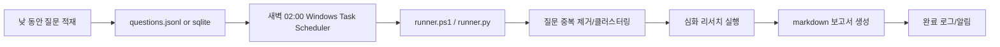

# 260316 유휴시간 LLM 리서치 자동화

기준 시점: 2026-03-16 17:24 +09:00

## 한눈에 결론

- 이 문제는 이미 상당 부분 해결되어 있다. 완제품에 가까운 해법은 `Claude Code Desktop scheduled tasks`, `Codex app Automations`, 범용 예약 프롬프트는 `ChatGPT Tasks`, 워크플로우형은 `n8n`, 개발자형은 `GitHub Actions cron` 또는 `Windows Task Scheduler` 조합이다.
- `Claude Code`도 2026-03-16 기준 공식 문서상 `Desktop`에 `scheduled tasks`가 있다. 다만 이는 `Desktop 앱` 기능이고, `CLI` 자체에 cron 같은 예약기가 붙어 있는 형태는 아니다. CLI 자동화는 여전히 `non-interactive/headless mode`, `GitHub Actions`, `Agent SDK`, 외부 스케줄러 조합이 공식 경로다.
- `Codex`도 분명한 해법을 갖고 있다. 2026-02-02 공개된 Codex app이 `Automations`를 제공하고, 2026-03-04부터 Windows에서도 사용할 수 있다. 즉, Claude와 Codex 모두 이 문제를 제품 차원에서 다루기 시작한 상태다.
- 다만 `구독형 서비스의 메시지/토큰 한도 부족`이 본질 문제라면, 예약 기능만 붙인다고 총 사용량이 줄지는 않는다. `낮에는 질문만 적재하고, 새벽에는 엄격한 예산 제한으로 배치 처리`하는 구조가 필요하다.
- 현실적인 추천은 두 갈래다.
  - 가장 빠른 길: `Claude Code Desktop scheduled tasks` 또는 `Codex app Automations`
  - 가장 통제 가능한 길: `Windows Task Scheduler + 로컬 스크립트 + API 기반 실행`

## 문제를 다시 정의하면

당면 과제는 단순한 "예약 프롬프트"가 아니다. 실제로는 아래 4개를 동시에 만족해야 한다.

1. 낮 동안 떠오른 질문을 빠르게 쌓아둘 것
2. 사용자가 자고 있을 때 자동으로 실행할 것
3. 여러 질문을 묶어 하나의 깊은 보고서로 만들 것
4. 구독 한도 또는 API 비용을 통제할 것

즉, 필요한 것은 채팅 UI 하나가 아니라 `질문 큐 + 스케줄러 + 리서치 실행기 + md 보고서 생성기`다.

## 주요 질문 답변

### 1) 이 문제를 이미 해결한 솔루션이 있을까?

있다. 다만 한 제품이 완벽히 다 해결한다기보다, 이미 존재하는 조각들을 조합하면 된다.

| 분류 | 솔루션 | 해결 수준 | 적합한 경우 |
|---|---|---|---|
| 완제품형 | Claude Code Desktop scheduled tasks | 매우 높음 | Claude를 쓰고 있고, PC를 켜 둔 채 로컬에서 반복 작업을 돌리고 싶을 때 |
| 완제품형 | Codex app Automations | 매우 높음 | 코딩/문서/지식작업을 예약 실행하고 싶을 때 |
| 완제품형 | ChatGPT Tasks | 중간 | 간단한 정기 브리핑, 리마인더, 반복 프롬프트 |
| 워크플로우형 | n8n Schedule Trigger + OpenAI/Anthropic | 높음 | 여러 단계 처리, 알림, 외부 앱 연동 |
| 개발자형 | GitHub Actions `schedule` | 높음 | 저장소 중심, 클라우드에서 안정적으로 돌리고 싶을 때 |
| 로컬형 | Windows Task Scheduler (`schtasks`) | 높음 | 내 PC를 켜 둔 상태에서 가장 단순하게 시작하고 싶을 때 |

핵심은 "이미 완전히 새로운 개념은 아니다"라는 점이다. 예약, 비동기 실행, 결과 전달, 검토 큐는 이미 상용 제품과 자동화 도구들에서 제공 중이다.

## 2) Claude Code, Codex에 이런 예약 질문 기능이 이미 있는가?

### Codex

있다. 다만 `Codex CLI 자체의 cron 기능`이라기보다 `Codex app`의 기능으로 보는 것이 맞다.

- OpenAI는 2026-02-02 `Introducing the Codex app`를 공개했다.
- 같은 글에 2026-03-04 업데이트로 `Windows 지원`이 명시되어 있다.
- 그 문서에서 `Automations`는 "스케줄에 따라 백그라운드에서 Codex가 작업하고, 결과는 review queue로 돌아오는" 구조로 설명된다.
- OpenAI Help Center의 `Using Codex with your ChatGPT plan` 문서도 Codex app이 `skills`, `automations`, `git functionality`를 제공한다고 정리한다.

정리하면:

- `Codex app`: 예약 자동화 있음
- `Codex web/cloud delegate`: 백그라운드 작업 위임 있음
- `Codex CLI`: 공식 문서상 별도 내장 스케줄러는 확인하지 못함

여기서 마지막 항목은 명시적 부정 문구가 아니라, 2026-03-16 기준 공개 문서 탐색 결과 `app의 Automations`는 분명히 문서화되어 있지만 `CLI 자체 예약 스케줄러`는 찾지 못했다는 추론이다.

### Claude Code

있다. 다만 `surface`를 구분해야 한다.

- `Claude Code Desktop`: 내장 예약 기능 있음
- `Claude Code CLI`: 별도 내장 스케줄러는 확인하지 못함

Anthropic의 Desktop 문서는 매우 직접적으로 설명한다.

- Desktop은 `scheduled tasks that run Claude on a recurring schedule`를 제공한다.
- 예약 작업은 `새로운 local session`을 자동으로 시작한다.
- 앱이 열려 있고 컴퓨터가 깨어 있어야 실행된다.
- 스케줄 체크는 1분마다 이뤄지고, API 트래픽 분산을 위해 최대 10분의 고정 지연이 들어갈 수 있다.
- 컴퓨터가 자고 있던 동안 놓친 작업은 최근 7일 기준으로 가장 최근 누락 건 1회만 catch-up 실행한다.
- 권한 프롬프트가 필요한 작업은 `Ask mode`에서 멈출 수 있으므로, 처음엔 `Run now`로 권한을 미리 학습시키는 것이 좋다.

반면 CLI/SDK 쪽에서는 아래 경로가 강조된다.

- Claude Code는 `scriptable and composable`
- `claude -p` 기반 비대화형 실행 가능
- `--continue --print`로 최근 세션을 스크립트에서 이어서 실행 가능
- GitHub Actions에서 Claude Code를 실행 가능
- Agent SDK를 통해 프로그램적으로 Claude의 에이전트 루프와 도구를 사용할 수 있음

즉, 정리하면 이렇다.

- `Desktop 앱`: 예약 기능 내장
- `CLI`: 외부 스케줄러와 연결하는 자동화 방식
- `SDK`: 제품/서비스 수준의 프로그래밍 자동화 방식

추가로 주의할 점:

- Claude Code 개요 문서는 `Claude.ai 계정 또는 Anthropic Console 계정`으로 시작 가능하다고 설명한다.
- 그러나 Agent SDK 문서는 앱/제품 수준의 통합에서는 `API key authentication`을 사용하라고 안내한다.
- 또 Agent SDK 문서는 제3자 제품이 `claude.ai login or rate limits`를 자기 제품에 얹는 방식을 허용하지 않는다고 명시한다.

따라서 개인용 로컬 자동화는 CLI 로그인 기반으로도 출발할 수 있겠지만, 안정적인 운영 시스템으로 키우려면 `Anthropic API 기반`이 더 안전한 방향이다.

## 3) 이것을 직접 제작한다면?

### 가장 현실적인 최소안

이제 최소안은 두 가지다.

1. `Claude Code Desktop scheduled tasks` 또는 `Codex app Automations`를 바로 쓰는 방법
2. 사용자가 제안한 `새벽에도 PC를 켜 두고 CLI 명령을 시간 맞춰 실행`하는 방법

둘 다 타당하다. 다만 지금 요구에 더 가까운 것은 오히려 1번일 수 있다.

이유는 단순하다.

- 이미 제품 안에 예약 실행 UX가 들어와 있다
- review/history/permission 흐름이 함께 제공된다
- 별도 스케줄러를 먼저 만들지 않아도 된다

반대로 2번은 첫 구현용으로는 여전히 매우 좋다.

이유는 단순하다.

- 구현 속도가 빠르다
- 새 인프라가 거의 필요 없다
- 로컬 파일, 기존 프로젝트, 개인 메모에 접근하기 쉽다
- 실패 원인이 명확하다

초기 구조는 아래 정도면 충분하다.



### 추천 아키텍처

#### A안. 가장 단순한 로컬 배치형

- 질문 저장: `questions.jsonl`
- 스케줄: Windows Task Scheduler
- 실행기: PowerShell 또는 Python
- 모델 호출:
  - Claude Code `claude -p`
  - 또는 OpenAI Responses API
  - 또는 두 서비스 라우팅
- 출력: `yyMMdd_nightly_report.md`

장점:

- 구현이 가장 빠름
- PC만 켜져 있으면 됨
- 현재 작업환경과 가깝다

단점:

- PC 절전, 로그인 세션 만료, 네트워크 끊김, Windows 업데이트에 취약
- 로그/재시도/알림을 직접 만들어야 함

#### B안. 저장소 중심 클라우드형

- 질문 저장: GitHub issue / JSON file / DB
- 스케줄: GitHub Actions `schedule`
- 실행기: Claude Code GitHub Action 또는 API 호출 스크립트
- 산출물: 저장소의 `reports/` 또는 artifact

장점:

- PC를 켜 둘 필요 없음
- 반복 실행 안정성 높음
- 이력 관리가 편함

단점:

- GitHub Actions는 UTC 기준이며, 부하가 높으면 지연될 수 있음
- 기본적으로 default branch 중심
- 개인 로컬 문맥을 바로 쓰기 어렵다

#### C안. 업무 자동화 플랫폼형

- 스케줄: n8n Schedule Trigger
- 단계:
  - 질문 수집
  - 태그/우선순위화
  - 웹 리서치
  - 보고서 생성
  - Slack/메일 전송

장점:

- 재시도, 분기, 외부 앱 연동이 쉬움
- 운영 화면이 있어서 상태 파악이 쉽다

단점:

- n8n 자체를 익혀야 함
- 로컬 파일 컨텍스트가 중심이면 오히려 과한 구조일 수 있음

## 무엇을 선택해야 하나

### 선택 기준 1: "이미 있는 제품으로 끝내고 싶은가?"

그렇다면 먼저 현재 주력 서비스에 맞춰 고르면 된다.

- Claude 중심이면: `Claude Code Desktop scheduled tasks`
- OpenAI/Codex 중심이면: `Codex app Automations`

특히 Codex는 아래 조건이면 더 잘 맞는다.

- 예약된 지식작업, 문서작업, 반복 점검이 필요하다
- 결과를 review queue에서 검토하는 방식이 맞는다

### 선택 기준 2: "Claude를 계속 쓰고 싶은가?"

그렇다면 두 갈래다.

- `Desktop 앱을 써도 된다`면: `Claude Code Desktop scheduled tasks`
- `CLI/스크립트/리포지터리 중심`이면: `Task Scheduler` 또는 `GitHub Actions`

즉,

- 개인 PC 로컬 반복작업이면 `Desktop scheduled tasks`가 제일 빠르다
- 로컬 CLI 자동화면 `Task Scheduler`
- 저장소 중심 자동화면 `GitHub Actions`
- 앱/서비스 수준이면 `Agent SDK`

로 가는 것이 정석이다.

### 선택 기준 3: "가장 중요한 게 비용/한도 통제인가?"

그렇다면 구독형 UI보다 `API 기반 배치 처리`가 더 맞을 수 있다.

이유:

- ChatGPT Tasks는 공식 문서상 `plan usage limits`의 영향을 받는다.
- Codex도 공식 Help 문서상 `usage limits depend on your plan`이다.
- 즉, 예약 실행이 있어도 `총량 제한` 자체가 사라지는 것은 아니다.

반대로 API 배치는 아래가 가능하다.

- 1일 최대 토큰 상한
- 질문당 최대 출력 길이
- 웹검색 호출 수 제한
- 실패 재시도 횟수 제한
- 쉬운 질문은 싼 모델, 어려운 질문만 비싼 모델

이 구조가 결국 "낮 시간 대화 한도를 아끼고, 새벽엔 계획된 예산만 쓰는" 방식에 더 가깝다.

## 토큰 부족 문제를 실제로 줄이는 운영 기법

단순히 "새벽에 돌린다"만으로는 부족하다. 아래 구조가 같이 들어가야 효과가 크다.

### 1. 질문을 바로 깊게 처리하지 말고, 낮에는 적재만 하기

낮에는 아래만 저장한다.

- 질문 원문
- 발생 시각
- 관련 프로젝트/파일
- 왜 궁금했는지 한 줄 메모
- 원하는 결과 형식

이렇게 하면 낮에는 소비를 거의 늘리지 않는다.

### 2. 새벽 배치 전에 질문을 합치기

예:

- "이 에러 원인이 뭔가?"
- "이 설계가 맞나?"
- "이 모듈 구조 개선안?"

이 세 개가 사실 같은 주제일 수 있다. 새벽에 먼저 `중복 제거 + 주제 클러스터링`을 하면 보고서 품질도 올라가고 토큰도 줄어든다.

### 3. 2단계 모델 라우팅

- 1차: 싼 모델로 분류, 중복 제거, 리서치 계획 수립
- 2차: 비싼 모델로 최종 보고서만 작성

이 패턴이 토큰 절감 효과가 크다.

### 4. 결과를 "하루 1개 보고서"로 압축

질문마다 개별 답변을 만들면 토큰이 새기 쉽다.
대신:

- 오늘의 핵심 질문 3개
- 공통 원인
- 추천 액션
- 내일 확인할 항목

처럼 `일간 보고서 1개`로 압축하는 편이 훨씬 낫다.

### 5. 스크립트에 강한 보호장치 넣기

- 최대 처리 질문 수
- 최대 턴 수
- 최대 웹검색 횟수
- 최대 실행 시간
- 보고서 최대 길이
- 중간 저장
- 실패한 질문은 `retry`로 남기기

이것이 없으면 새벽 배치가 오히려 토큰을 크게 태울 수 있다.

## 권장 구현안

현재 요구를 기준으로 하면, 아래 순서를 추천한다.

### 1단계. 가장 작은 MVP

빌드를 아예 하지 않고도 되는지부터 먼저 확인하는 편이 좋다.

- Claude 사용 중이면: `Claude Desktop -> Code tab -> Schedule`
- Codex 사용 중이면: `Codex app -> Automations`

이 두 개가 목적에 맞지 않을 때만 아래 MVP로 내려가면 된다.

그 다음 최소 구현은:

- 질문 저장 파일: `questions.jsonl`
- 실행 시각: 매일 새벽 02:10
- 실행기: `run_nightly_report.ps1`
- 내부에서 하는 일:
  - 미처리 질문 읽기
  - 비슷한 질문 묶기
  - LLM에 심화 보고서 요청
  - md 파일 저장
  - 처리 완료 표시

Windows 예시는 이런 느낌이면 충분하다.

```powershell
schtasks /create `
  /sc daily `
  /st 02:10 `
  /tn "NightlyLLMReport" `
  /tr "powershell -NoProfile -ExecutionPolicy Bypass -File C:\Users\hhd20\project\mytool\run_nightly_report.ps1"
```

### 2단계. 보고서 품질 개선

- 질문 주제별 섹션 분리
- 링크와 근거 출처 수집
- "오늘의 결론 / 보류 / 내일 할 일" 템플릿 적용
- 로그 파일과 비용 추정치 기록

### 3단계. 안정화

- PC 절전 해제 또는 wake timer 설정
- 실패 시 재실행
- Slack/이메일 알림
- 오래된 질문 자동 정리
- 민감 정보 제외 규칙

## 최종 추천

### 추천 1순위: Claude를 이미 쓰는 경우

`Claude Code Desktop scheduled tasks`를 먼저 검토하는 것이 맞다.

이유:

- 이미 첫-party 예약 기능이 있다
- 사용자가 원하는 "PC를 켜 두고 새벽에 실행" 조건과 정확히 맞는다
- 놓친 실행에 대한 catch-up, 권한, 기록 관리가 기본 제공된다

단, `앱이 열려 있고 컴퓨터가 깨어 있어야 한다`는 제약은 그대로다.

### 추천 2순위: Codex를 써도 되는 경우

`Codex app Automations`도 매우 강력하다.

이유:

- 이미 예약 자동화 개념이 제품으로 들어와 있다
- 결과를 review queue로 받는 UX가 이번 목적과 거의 일치한다
- 2026-03-04 기준 Windows도 지원한다

단, `usage limits depend on your plan`이므로 총량 문제를 완전히 없애주지는 않는다.

### 추천 3순위: Claude를 계속 중심으로 쓰되 CLI가 필요할 경우

`Windows Task Scheduler + Claude Code headless/CLI + md 저장`으로 시작하는 것이 가장 현실적이다.

이유:

- 오늘 바로 만들 수 있다
- 사용자가 제안한 운영 방식과 일치한다
- 나중에 GitHub Actions나 n8n으로 이관하기 쉽다

### 추천 4순위: 장기적으로 운영 도구로 키울 경우

초기 MVP를 로컬에서 검증한 뒤,

- 성공하면 `n8n` 또는 `GitHub Actions`
- 더 커지면 `API 기반 큐 시스템`

으로 올리는 것이 좋다.

## 사실 검증 메모

- `Claude Code Desktop scheduled tasks`, 로컬 실행 조건, catch-up 동작, 권한 정지는 공식 Anthropic Desktop 문서를 기준으로 확인했다.
- `Codex app Automations`, `Windows 지원`, `review queue`, `usage limits`는 공식 OpenAI 문서를 기준으로 확인했다.
- `ChatGPT Tasks`의 예약 실행, 오프라인 실행, plan usage limits, active task 제한도 공식 Help 문서로 확인했다.
- `Claude Code CLI`의 `별도 내장 스케줄러 부재`는 명시적 부정 문구를 찾은 것이 아니라, 2026-03-16 기준 공식 문서에서 확인되는 CLI 자동화 경로가 `scriptable CLI`, `headless mode`, `GitHub Actions`, `Agent SDK`라는 점에서 도출한 추론이다.
- `Claude Agent SDK`의 API key 중심 운영과 제3자 제품에서 `claude.ai` 로그인/한도를 기대하지 말라는 방향도 공식 SDK 문서를 기준으로 확인했다.

## 참고 URL

- OpenAI, Introducing the Codex app: https://openai.com/index/introducing-the-codex-app/
- OpenAI Help, Using Codex with your ChatGPT plan: https://help.openai.com/en/articles/11369540-icodex-in-chatgpt
- OpenAI Help, Tasks in ChatGPT: https://help.openai.com/en/articles/10291617-scheduled-tasks-in-chatgpt.pdf
- OpenAI API, Background mode: https://platform.openai.com/docs/guides/background
- Anthropic, Claude Code overview: https://docs.anthropic.com/en/docs/claude-code/overview
- Anthropic, Claude Code Desktop: https://code.claude.com/docs/en/desktop
- Anthropic, Claude Code GitHub Actions: https://docs.anthropic.com/en/docs/claude-code/github-actions
- Anthropic, Claude Code tutorials/common workflows: https://docs.anthropic.com/en/docs/claude-code/tutorials
- Anthropic, Claude Agent SDK overview: https://docs.anthropic.com/en/docs/claude-code/sdk
- GitHub Docs, Events that trigger workflows: https://docs.github.com/en/actions/reference/workflows-and-actions/events-that-trigger-workflows
- n8n Docs, Schedule Trigger node: https://docs.n8n.io/integrations/builtin/core-nodes/n8n-nodes-base.scheduletrigger/
- n8n Docs, OpenAI node: https://docs.n8n.io/integrations/builtin/app-nodes/n8n-nodes-langchain.openai/
- n8n Docs, Anthropic Chat Model node: https://docs.n8n.io/integrations/builtin/cluster-nodes/sub-nodes/n8n-nodes-langchain.lmchatanthropic/
- Microsoft Learn, schtasks commands: https://learn.microsoft.com/en-us/windows-server/administration/windows-commands/schtasks

## 작성에 사용한 사용자 프롬프트

```text
$hhd-search

think hard

주제
- 유휴시간에 llm 질문으로 보고서 작성하는 기법

현재 문제점
- llm 서비스를 구독중인데, 토큰이 자주 모자르게 됨
- 이때 새벽시간을 이용해서 일과중에 발생한 질문항목들을 깊게 생각한 보고서를 md 파일로 제작하고 싶음.

- hhd-research 이용

주요 질문
- 이 문제점을 이미 해결한 솔루션이 있을까?
- claude code, codex 에서 이렇게 예약 질문을 남기는 기능이 이미 있는가?
- 이것을 제작한다면?
  - 단순히 새벽시간에도 pc를 켜두고 cli 명령이 시간되면 실행되는 형태도 괜찮긴 하다.
```
