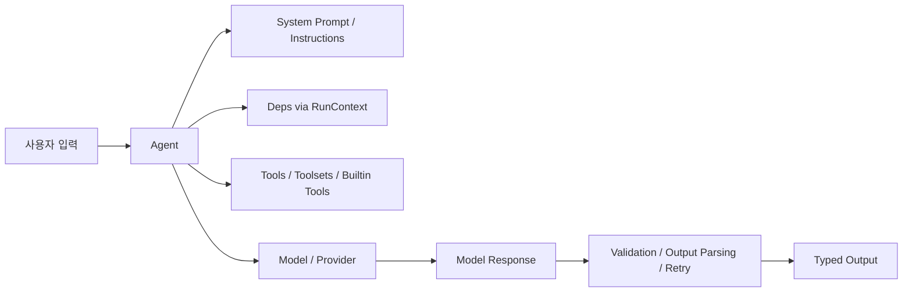

# 260317 PydanticAI 완전 리서치

> 📌 사용자 요청의 `padantic ai`는 문맥상 `PydanticAI`로 해석했다.  
> 🕒 조사 기준 시각: 2026-03-17 00:46:55 KST  
> 🧭 최신 릴리스 확인: `v1.68.0` (GitHub Releases, 2026-03-13 UTC 게시)  
> 🧱 기준 소스: 공식 문서 `ai.pydantic.dev` + 공식 GitHub 릴리스  
> 📝 성격: 초장문 기술 리서치 1차본. 요청한 “PDF 200장급”을 완전히 채우기보다는, 공식 문서 전 범위를 구조적으로 묶은 기준서에 가깝다.

---

## 0. 한 줄 요약 🚀

`PydanticAI`는 **Python 타입 시스템, Pydantic 검증, 구조화 출력, 도구 호출, 의존성 주입, 멀티에이전트/워크플로우, 운영 관측성**을 하나의 일관된 개발 모델로 묶으려는 프레임워크다.

내 해석을 한 줄로 줄이면 이렇다.

- 문자열 중심 LLM 코드에서 벗어나고 싶을 때
- Python 백엔드 안에서 에이전트를 “진짜 컴포넌트”처럼 다루고 싶을 때
- `tool`, `deps`, `output`, `validation`, `streaming`, `observability`, `evals`까지 하나의 문법권으로 묶고 싶을 때

가장 강하다. 반대로 단발성 프롬프트 스크립트에는 과하다.

---

## 1. 질문별 바로 답 👀

### 1.1 `tool`은 뭐가 특별한가?

PydanticAI의 `tool`은 그냥 “함수 호출”이 아니다.

- 함수 시그니처를 읽어 **JSON Schema**를 만든다.
- `RunContext`를 통해 **의존성, usage, retry 상태, partial output, 승인 상태**를 전달한다.
- 인자 검증 실패를 **LLM 재시도 프롬프트**로 연결한다.
- docstring에서 설명을 추출해 **모델에게 더 좋은 tool 설명**을 준다.
- 필요하면 승인 대기(`requires_approval=True`)나 외부 실행(`CallDeferred`)도 된다.
- `Toolset`으로 묶어 조합, 필터링, 이름 변경, 동적 생성까지 가능하다.

즉, “함수를 LLM에 노출”하는 수준이 아니라 **실행 정책까지 포함한 typed interface**에 가깝다.

### 1.2 `orchestration`은 어떻게 보나?

공식 문서의 결은 꽤 명확하다.

1. 먼저 단일 `Agent`로 시작한다.
2. 복잡해지면 **agent delegation** 또는 **programmatic hand-off**를 쓴다.
3. 그래도 흐름이 꼬이면 **graph**를 쓴다.
4. 중단/재개/장시간 실행/사람 승인/외부 작업이 걸리면 **durable execution**으로 간다.

즉, PydanticAI는 처음부터 거대한 오케스트레이터를 강요하지 않는다.  
내 해석으로는 이게 장점이다. Python 제어 흐름을 버리지 않고, 필요할 때만 graph/FSM 쪽으로 올라가게 해 준다.

### 1.3 `agent`는 무엇인가?

`Agent`는 PydanticAI의 중심 객체다.

- 모델
- instructions / system prompts
- tools / toolsets / builtin tools
- deps type
- output type
- retries / metadata / instrumentation

을 담는 **typed 실행 컨테이너**다.

공식 문서 기준으로 에이전트는 `Agent[Deps, Output]`라는 감각으로 이해하는 게 가장 정확하다.

### 1.4 `deps`는 왜 중요한가?

`deps`는 PydanticAI가 실무형으로 보이는 핵심이다.

- DB 연결
- API 클라이언트
- 인증/권한 정보
- 현재 사용자
- feature flag
- 서비스 객체

같은 것을 `deps_type` + `RunContext[Deps]`로 안전하게 주입한다.

이 덕분에 프롬프트 코드와 인프라 코드를 억지로 섞지 않고,

- 테스트 가능한 도구 함수
- 교체 가능한 서비스 객체
- 전역 상태 없는 실행

구조를 만들 수 있다.

### 1.5 `@`로 붙는 지원 기능은 무엇이 핵심인가?

가장 중요한 데코레이터는 아래다.

- `@agent.system_prompt`
- `@agent.system_prompt(dynamic=True)`
- `@agent.instructions`
- `@agent.tool`
- `@agent.tool_plain`
- `@agent.output_validator`
- `@agent.toolset`
- `@toolset.tool`

이중 실무에서 제일 자주 보게 되는 건 `system_prompt`, `instructions`, `tool`, `output_validator`다.

### 1.6 프레임워크 차원의 특수 기능은?

PydanticAI는 단순 agent 프레임워크를 넘어서 아래를 같이 건드린다.

- `Toolsets`
- `Built-in tools`
- `Deferred tools`
- `MCP`
- `A2A`
- `AG-UI` / `Vercel AI` UI event streams
- `pydantic-graph`
- `Temporal / DBOS / Prefect` durable execution
- `Pydantic Evals`
- `Logfire / OpenTelemetry`
- `Thinking` parts
- `Direct model requests`
- `Embeddings`
- 멀티모달 input / image output

이 범위를 보면 “프레임워크”라기보다 **Pydantic식 AI 앱 개발 스택**에 가깝다.

---

## 2. PydanticAI 소개 🧩

공식 소개 문구의 핵심은 “GenAI Agent Framework, the Pydantic way”다.  
FastAPI가 웹 개발에 준 감각을 GenAI 애플리케이션 쪽으로 옮기려는 방향이 강하다.

### 2.1 철학

- 타입 힌트를 적극적으로 쓴다.
- 가능한 한 런타임 에러를 작성 시점으로 옮긴다.
- 구조화 출력과 검증을 기본 축으로 둔다.
- 모델 제공자 차이를 완전히 숨기기보다, **일관된 공통층 + provider-specific 설정** 구조를 제공한다.
- 운영에서 필요한 tracing, evals, retries, durable execution까지 연결하려 한다.

### 2.2 아키텍처 감각



핵심은 `Agent`가 허브라는 점이다.

- 프롬프트만 관리하지 않는다.
- 도구만 관리하지 않는다.
- 모델만 감싸지 않는다.

이 셋을 **typed orchestration unit**으로 묶는다.

### 2.3 현재 생태계 위치

내 해석이다.

- LangChain/LlamaIndex 계열보다 **더 Python 타입 친화적**이다.
- AutoGen/CrewAI 계열보다 **workflow와 데이터 모델을 더 명시적으로 다룬다**.
- OpenAI/Anthropic SDK 직접 사용보다 **애플리케이션 구조화**에 강하다.

대신, 생태계 러프함이나 JS/프론트엔드 친화성만 보면 다른 선택지가 더 나을 수 있다.

---

## 3. 왜 쓰는가: 핵심 특징 정리 ⭐

| 축 | PydanticAI가 제공하는 것 | 왜 중요한가 |
| --- | --- | --- |
| 타입 안정성 | `Agent[Deps, Output]`, `RunContext[Deps]`, typed outputs | IDE 지원, 리팩터링 안정성, 실수 감소 |
| 구조화 출력 | Pydantic 모델/스칼라/유니온/함수 기반 출력 | 문자열 파싱 감소 |
| 도구 호출 | `@agent.tool`, `Tool`, `Toolset`, built-in tools | 외부 시스템 연결 |
| 의존성 주입 | `deps_type`, `deps`, `RunContext` | 전역 상태 감소, 테스트성 향상 |
| 검증/재시도 | `ModelRetry`, output validation, tool arg validation | 실패를 흐름 안에서 복구 |
| 메시지 히스토리 | multi-run conversation, history processors | 실전 대화 상태 관리 |
| 스트리밍 | text/output/event stream | UI/실시간 처리 |
| 관측성 | Logfire, OpenTelemetry | 운영 디버깅 |
| 평가/테스트 | `pydantic-evals`, `TestModel`, `FunctionModel` | 회귀 테스트 가능 |
| 오케스트레이션 | delegation, graph, durable execution | 복잡한 워크플로우 대응 |
| 표준 연동 | MCP, A2A, AG-UI, Vercel AI | 외부 생태계 연결 |

### 3.1 공식 문서가 반복해서 강조하는 강점

- Model-agnostic
- Fully type-safe
- Structured output
- Tool calling
- Dependency injection
- Human-in-the-loop approval
- Durable execution
- Streamed outputs
- Graph support
- Evals
- Observability

이 조합 때문에 단순한 “챗봇 프레임워크”가 아니라 **production-focused agent framework**처럼 보인다.

---

## 4. 장점과 단점 ⚖️

### 4.1 장점

#### 1) 타입 안정성이 실제로 체감된다

- `deps_type`와 `RunContext[Deps]`가 맞지 않으면 타입 체커가 잡아준다.
- 출력 타입이 명시되어 후속 코드가 훨씬 깔끔해진다.
- 복잡한 agent 코드에서 “문자열 파싱 지옥”을 줄인다.

#### 2) 실무 구조와 잘 맞는다

- 서비스 객체를 deps로 주입
- 도구는 부작용 경계로 분리
- output validator로 후처리 규칙화
- tool approval / deferred execution으로 위험 작업 제어

이 흐름은 백엔드 엔지니어에게 매우 익숙하다.

#### 3) 기능 폭이 넓다

단일 agent에서 시작해서,

- tool
- search
- MCP
- UI streaming
- multi-agent
- graph
- durable execution
- evals

까지 확장할 수 있다.

#### 4) 운영 고려가 강하다

- Logfire tracing
- OTel backend
- retries
- usage limits
- concurrency limits
- durable execution

같은 요소가 공식 문서 안에 자연스럽게 들어 있다.

#### 5) 문서의 방향성이 비교적 명확하다

“graph는 nail gun이니 꼭 필요할 때만 써라” 같은 문구에서 드러나듯,  
무조건 화려한 구조를 밀지 않고 **복잡도를 점진적으로 올리라**는 방향이 보인다.

### 4.2 단점

#### 1) 단순 작업엔 과하다

한 번 던지고 문자열 한 줄 받는 스크립트라면 SDK 직접 호출이 더 빠를 수 있다.

#### 2) 개념 수가 많다

처음부터 익혀야 하는 개념이 많다.

- Agent
- RunContext
- deps
- tool / toolset
- output mode
- deferred tools
- message history
- graph
- durable execution

작게 시작하지 않으면 금방 무거워진다.

#### 3) provider 차이를 완전히 지워주지는 않는다

예를 들어 built-in tool 지원이나 reasoning/thinking 설정은 여전히 provider별 차이가 있다.

- OpenAI Responses 전용 기능
- Anthropic thinking 옵션
- Google built-in tool 제약
- OpenRouter reasoning 설정

즉 “추상화는 되지만, 현실은 남는다”.

#### 4) Python 중심이다

이건 장점이자 단점이다.

- Python 백엔드 팀에는 좋다.
- JS-first 제품팀에는 덜 매력적일 수 있다.

#### 5) 오케스트레이션을 너무 빨리 키우면 복잡해진다

특히 multi-agent, graph, durable execution을 한꺼번에 도입하면

- 타입 이점은 남지만
- 설계 난이도는 급상승한다

내 해석으로는 “좋은 프레임워크”이지만 **좋은 설계까지 대신해 주지는 않는다**.

---

## 5. 핵심 개념 1: Agent 🧠

### 5.1 Agent는 typed container다

공식 문서 기준으로 `Agent`는 다음을 담는다.

- Instructions
- Function tools / toolsets
- Structured output type
- Dependency type constraint
- LLM model
- Model settings

즉 “LLM 호출 객체”보다 더 큰 개념이다.

### 5.2 실행 메서드

주요 실행 방식:

- `agent.run()`
- `agent.run_sync()`
- `agent.run_stream()`
- `agent.run_stream_events()`
- `agent.iter()`

여기서 중요한 건 `agent.iter()`다.  
공식 문서에 따르면 Agent 내부는 `pydantic-graph`로 돌고, `iter()`는 그 내부 graph를 노출한다.

### 5.3 Runs vs Conversations

PydanticAI는 한 번의 실행(run)과 여러 run에 걸친 conversation을 구분한다.

- 한 run은 단일 실행 단위
- 이전 `message_history`를 넘기면 conversation이 이어진다

이게 중요한 이유는 실무에서는 HTTP 요청 하나가 꼭 대화 전체와 같지 않기 때문이다.

### 5.4 추가 운영 기능

에이전트에는 단순 프롬프트 외에도 이런 설정이 있다.

- `usage_limits`
- `tool_calls_limit`
- `max_concurrency`
- `metadata`
- `model_settings`
- `event_stream_handler`

즉, agent가 곧 운영 단위다.

---

## 6. 핵심 개념 2: Deps / RunContext 🔌

### 6.1 기본 개념

`deps_type`는 에이전트가 사용할 의존성의 타입을 정의한다.  
공식 문서가 명시하듯, 이 값은 주로 **타입 체크를 위한 것**이다.

런타임에서는 실제 `deps=` 인자로 넘긴 객체가 사용된다.

### 6.2 왜 dataclass를 자주 쓰나?

문서 예제는 `dataclass`를 자주 사용한다.

- 명시적 구조
- 필드 기반 의존성 집합
- 테스트 대체 쉬움

이 패턴이 가장 무난하다.

### 6.3 `RunContext[Deps]`

`RunContext`에서 중요한 것:

- `ctx.deps`
- `ctx.usage`
- `ctx.retry`
- `ctx.partial_output`
- `ctx.tool_call_approved`
- `ctx.tool_call_metadata`

실무 감각으로 보면 `RunContext`는 “현재 실행의 ambient context”다.

### 6.4 sync vs async deps

공식 문서에 따르면,

- system prompt
- tools
- output validators

는 agent run의 async context에서 실행된다.  
sync 함수도 가능하지만 thread pool로 돌 수 있으므로, IO가 있다면 `async`가 약간 더 낫다.

### 6.5 deps가 특히 빛나는 상황

- 사내 API 호출
- DB 조회
- 현재 사용자 권한 반영
- 요청별 location / tenant / locale 주입
- 테스트에서 fake service 교체

---

## 7. 핵심 개념 3: Prompt 계열과 `@` 기능들 🏷️

아래 표가 `@` 관련 핵심이다.

| 기능 | 역할 | 특징 |
| --- | --- | --- |
| `@agent.system_prompt` | 시스템 프롬프트 동적 생성 | `RunContext` 사용 가능 |
| `@agent.system_prompt(dynamic=True)` | `message_history`가 있어도 재평가 | 고급 옵션 |
| `@agent.instructions` | 동적 instructions | system prompt와 달리 항상 재평가 |
| `@agent.tool` | 컨텍스트를 받는 tool | `RunContext` 사용 |
| `@agent.tool_plain` | 컨텍스트 없는 tool | 단순 함수용 |
| `@agent.output_validator` | 출력 검증/교정 | `ModelRetry` 가능 |
| `@agent.toolset` | run/run-step별 toolset 생성 | 동적 toolset 등록 |
| `@toolset.tool` | FunctionToolset에 tool 추가 | 재사용 가능한 toolset 구성 |

### 7.1 `@agent.system_prompt`

언제 쓰나?

- 현재 사용자 이름
- 오늘 날짜
- 현재 tenant
- locale
- 권한/역할

처럼 **런타임에만 알 수 있는 컨텍스트**를 system prompt에 넣고 싶을 때 쓴다.

### 7.2 `@agent.instructions`

공식 문서의 중요한 차이:

- dynamic system prompt는 `message_history`가 있을 때 재사용될 수 있다
- dynamic instructions는 **항상 다시 계산된다**

이 차이는 의외로 크다.

- 세션 시작 규칙은 system prompt
- 매 요청마다 달라지는 힌트는 instructions

로 나누면 설계가 깔끔하다.

### 7.3 `@agent.output_validator`

이건 PydanticAI를 실무형으로 만드는 강력한 기능이다.

- 구조는 맞지만 비즈니스 규칙은 틀린 출력
- 외부 정책 위반
- 특정 필드 조합 불가
- confidence 범위 보정

같은 걸 잡을 수 있다.

출력이 잘못되면 `ModelRetry`를 던져 모델에게 다시 시도시킬 수 있다.

### 7.4 `@agent.toolset`

대부분 초반에는 잘 안 쓰지만, 규모가 커지면 매우 중요해진다.

- 사용자/권한/환경별로 다른 toolset
- run step마다 달라지는 tool 목록
- durable execution 환경에서 고유 ID가 필요한 동적 toolset

같은 고급 시나리오를 다룬다.

---

## 8. 핵심 개념 4: Tools 심층 분석 🛠️

### 8.1 등록 방법

공식 문서 기준 tool 등록 방식:

- `@agent.tool`
- `@agent.tool_plain`
- `tools=[...]`
- `Tool(...)`
- `Toolset`

### 8.2 `@agent.tool` vs `@agent.tool_plain`

#### `@agent.tool`

- 첫 인자로 `RunContext` 가능
- deps/usage/retry 상태 접근 가능
- 실무에서 기본 선택지

#### `@agent.tool_plain`

- 컨텍스트가 필요 없는 순수 함수
- 계산기, formatter, 간단 변환기 등에 적합

공식 문서도 `@agent.tool`을 default 성격으로 본다.

### 8.3 Tool schema가 자동 생성된다

PydanticAI는 함수 시그니처와 docstring으로 schema를 만든다.

- 함수 파라미터 타입 읽기
- `RunContext` 제외 나머지로 JSON schema 생성
- docstring에서 설명 추출
- `griffe`로 google / numpy / sphinx 스타일 docstring 처리

즉, 좋은 타입 힌트 + 좋은 docstring이 tool 품질을 높인다.

### 8.4 Tool과 structured output의 관계

공식 문서가 분명히 말하는 포인트:

- function tools도 tool/function API를 사용한다
- default structured output도 tool calling 방식에 의존한다

그래서 tool과 output이 내부적으로 꽤 가깝다.

이게 중요한 이유:

- 모델이 일반 tool과 output tool을 동시에 본다
- output mode를 바꾸면 충돌을 완화할 수 있다

### 8.5 Tool output

기본적으로 tool은 Pydantic이 JSON 직렬화할 수 있는 값을 반환하면 된다.

하지만 고급 기능으로 `ToolReturn`이 있다.

`ToolReturn`의 핵심:

- `return_value`: 앱 로직에 쓰일 실제 결과
- `content`: 모델에게 추가로 보여줄 멀티모달/텍스트 컨텍스트
- `metadata`: 애플리케이션에서만 쓰고 LLM에는 보내지지 않는 부가 정보

이건 매우 실용적이다.

- 사용자에게 줄 값은 간단히 유지
- 모델에겐 풍부한 컨텍스트 제공
- 내부 로깅/추적용 metadata 분리

### 8.6 Dynamic tools

각 tool에는 `prepare`를 둘 수 있고, agent 전체에는 `prepare_tools`가 있다.

- step마다 tool 정의 수정
- 특정 조건에서 tool 숨김
- 특정 provider일 때 strict 모드 변경
- 전체 tool 리스트를 한 번에 필터링

공식 문서상 적용 순서는:

1. per-tool `prepare`
2. agent-wide `prepare_tools`

### 8.7 Tool retries / validation

tool 실행 시 흐름:

1. 모델이 인자 생성
2. Pydantic이 인자 검증
3. 실패하면 retry prompt 생성
4. 성공하면 함수 실행
5. 함수가 `ModelRetry`를 던지면 다시 모델에게 수정 요청

즉, 잘못된 tool call도 자동 복구 흐름에 들어간다.

추가로:

- tool timeout 설정 가능
- `args_validator`로 추가 인자 검증 가능
- `tool_calls_limit`으로 실행 수 제한 가능

### 8.8 Human-in-the-loop approval

PydanticAI의 툴 시스템에서 매우 강한 기능 중 하나다.

방법은 두 가지:

- 항상 승인 필요: `requires_approval=True`
- 조건부 승인 필요: tool 내부에서 `ApprovalRequired` 예외 발생

이후 결과는 `DeferredToolRequests`로 나오고,  
승인/거절/인자 변경 결과를 `DeferredToolResults`로 넘겨 실행을 이어간다.

이건 실제 업무 시스템에서 굉장히 중요하다.

- 파일 삭제
- 주문 실행
- 결제 요청
- 배포
- 운영 명령

같은 위험 작업에 매우 잘 맞는다.

### 8.9 External tool execution

tool 결과를 같은 프로세스 안에서 바로 만들 수 없을 때:

- 프론트엔드 클라이언트에서 실행해야 하는 tool
- 느린 배경 작업
- 외부 워커 시스템

이 경우 `CallDeferred`로 외부 실행을 걸 수 있다.

이건 “웹앱/백그라운드 워커와 에이전트 연결”에서 상당히 유용하다.

---

## 9. Toolsets 심층 분석 🧰

개인적으로 PydanticAI의 진짜 힘은 `toolsets`에서 드러난다고 본다.

### 9.1 Toolset이란?

toolset은 tools의 집합이다.

- 재사용 가능
- 런타임 교체 가능
- 테스트 시 override 가능
- 조합/필터링/이름 변경 가능
- 외부 시스템(MCP 등)에서 제공받을 수도 있음

### 9.2 핵심 종류

#### `FunctionToolset`

로컬 함수를 묶어 reusable toolset으로 만든다.

#### `CombinedToolset`

여러 toolset을 하나처럼 합친다.

#### `FilteredToolset`

현재 컨텍스트와 tool definition을 보고 노출할 tool을 걸러낸다.

#### `PrefixedToolset`

tool 이름 앞에 prefix를 붙여 충돌을 막는다.

#### `RenamedToolset`

tool 이름을 더 LLM-friendly하게 바꾼다.

#### `PreparedToolset`

tool definitions를 step마다 수정한다.

#### `ApprovalRequiredToolset`

toolset 차원에서 승인 정책을 건다.

#### `WrapperToolset`

도구 실행 동작 자체를 감싸서 바꾼다.

### 9.3 동적 toolset

문서상 매우 중요한 포인트:

- `toolsets=`에 함수를 넣을 수 있다
- `@agent.toolset`으로 등록 가능
- run마다 혹은 run-step마다 재평가 가능
- durable execution, 특히 Temporal에서는 고유 `id`가 중요하다

즉, toolset은 정적 목록이 아니라 **동적 capability layer**다.

### 9.4 Third-party toolsets

공식 문서가 언급하는 대표 축:

- MCP servers
- Agent Skills
- task management toolsets
- file operation toolsets
- code execution toolsets
- LangChain tools
- ACI.dev tools

여기서 중요한 점은, PydanticAI가 외부 생태계를 배척하지 않는다는 것이다.  
다만 자기 문법권 안으로 가져와서 쓰려는 방향이다.

---

## 10. Built-in Tools / Common Tools / Third-party Tools 🔍

### 10.1 Built-in tools

공식 built-in tools:

- `WebSearchTool`
- `CodeExecutionTool`
- `ImageGenerationTool`
- `WebFetchTool`
- `MemoryTool`
- `MCPServerTool`
- `FileSearchTool`

이들은 provider 인프라에서 실행된다.

#### 장점

- provider 네이티브 기능 활용
- 컨텍스트 사용량/캐싱/성능에서 유리할 수 있음

#### 단점

- provider 지원 편차가 큼
- function tools / output tools와의 조합 제약이 있음

### 10.2 Built-in tool에서 주의할 제약

문서상 특히 중요한 제약:

- Google 계열 일부 built-in tool은 function tools와 함께 쓸 때 제약이 있다
- 이 경우 structured output이 필요하면 `PromptedOutput`을 권장한다
- OpenAI의 web search는 `Responses API` 쪽이 중요하다

즉, built-in tool은 강력하지만 **provider-specific 현실**을 반드시 봐야 한다.

### 10.3 Common tools

공식 common tools 문서 기준 대표 예:

- `duckduckgo_search_tool`
- `tavily_search_tool`
- Exa 계열 tools / `ExaToolset`

이들은 built-in tool이 아니라 **PydanticAI가 제공하는 ready-made tool 구현**이다.

내 해석:

- provider-native built-in tool이 애매할 때
- 외부 검색 품질을 직접 선택하고 싶을 때
- 툴 동작을 더 투명하게 통제하고 싶을 때

common tools가 더 실용적일 수 있다.

### 10.4 Third-party tools

공식 문서상:

- LangChain tools 연동 가능
- ACI.dev tools 연동 가능
- MCP 기반 도구 생태계 활용 가능

다만 LangChain/ACI 연동 도구는 PydanticAI가 인자를 직접 검증하지 않는 경우가 있어, 이 부분은 주의가 필요하다.

---

## 11. Output 시스템 심층 분석 📦

### 11.1 기본 철학

PydanticAI는 output을 문자열이 아니라 **타입 있는 결과**로 다루는 걸 매우 중요하게 본다.

지원 폭:

- scalar
- list/dict/TypedDict
- dataclass
- Pydantic model
- unions
- output functions

### 11.2 세 가지 output mode

공식 문서 기준 세 가지:

1. `ToolOutput`
2. `NativeOutput`
3. `PromptedOutput`

#### `ToolOutput`

- 기본값
- virtually all models에서 잘 동작
- output schema를 special output tool로 제공

#### `NativeOutput`

- 모델의 native structured outputs 사용
- JSON schema 네이티브 지원 모델에 적합

#### `PromptedOutput`

- prompt에 schema를 주입하고 plain text를 파싱
- built-in tool과의 충돌, provider 제약 회피에 유용

### 11.3 `TextOutput`

output function이 문자열을 plain text로 받게 만들고 싶으면 `TextOutput`을 쓴다.

이건 “텍스트는 텍스트답게 받고, 후처리 함수만 붙이고 싶다”는 경우에 좋다.

### 11.4 output validator

`@agent.output_validator`는 비즈니스 규칙을 넣는 곳이다.

- 값 범위
- 금지 표현
- 특정 정책 위반
- 구조는 맞지만 의미가 틀린 결과

를 잡는다.

### 11.5 partial output

스트리밍 시 output function은 여러 번 호출될 수 있다.

- partial output 때 `ctx.partial_output == True`
- 최종 output 때 `False`

따라서 부작용이 있는 output function은 꼭 이를 체크해야 한다.

---

## 12. Message History / Streaming / 운영 훅 📡

### 12.1 message history

여러 run을 이어 conversation을 만들 수 있다.

- `result.new_messages()`
- `result.all_messages()`
- `message_history=...`

이 조합이 핵심이다.

### 12.2 history processors

긴 세션에서는 history를 잘라야 할 때가 있다.

문서가 주의하는 포인트:

- tool calls와 returns는 쌍이 맞아야 한다
- 잘못 자르면 provider 오류가 날 수 있다

이건 RAG/research/장문 대화 시스템에서 중요하다.

### 12.3 streaming

PydanticAI는 여러 층의 스트리밍을 제공한다.

- 최종 text 스트리밍
- structured output 스트리밍
- event 스트리밍
- 내부 graph node 수준 iteration

또한 `ThinkingPartDelta`, `ToolCallPartDelta` 같은 이벤트도 다룬다.

### 12.4 디버깅

문서상 실용 기능:

- `capture_run_messages()`
- `UnexpectedModelBehavior`
- event stream handler
- Logfire instrumentation

즉, 잘못된 run을 그냥 “감”으로 보지 않고 재구성할 수 있다.

---

## 13. Orchestration 심층 분석 🧭

### 13.1 공식 문서가 제시하는 복잡도 단계

대략 이런 단계다.

1. Single agent workflow
2. Agent delegation
3. Programmatic hand-off
4. Graph based control flow
5. Deep agents

이 순서가 중요하다.

### 13.2 Agent delegation

가장 흔한 멀티에이전트 패턴이다.

- 부모 agent가 tool 안에서 자식 agent를 호출
- 작업 끝나면 제어권이 부모로 돌아옴
- `ctx.usage`를 자식 run에 넘겨 usage를 합산 가능

장점:

- 기존 tool mental model을 유지
- 점진적 확장 가능

단점:

- 흐름이 깊어질수록 tool 호출과 agent 호출이 섞여 복잡해질 수 있음

### 13.3 Programmatic hand-off

이건 에이전트가 다른 에이전트를 직접 tool처럼 부르기보다,

- 첫 agent 결과를 받고
- 애플리케이션 코드가 다음 agent를 호출

하는 방식이다.

내 해석:

- 제어 흐름이 더 명시적
- 로깅/권한/트랜잭션 경계 관리가 쉽다

### 13.4 Graph based control flow

문서 표현이 인상적이다.

> graphs are a nail gun

요지는 명확하다.

- 강력하지만
- 셋업이 더 많고
- 불필요하면 과하다

이 태도는 꽤 건강하다.

### 13.5 Agent.iter

중요한 사실:

- 각 `Agent`는 내부적으로 `pydantic-graph`를 사용
- `agent.iter()`로 그 내부 graph를 탐색 가능

즉, “agent와 graph가 완전히 분리된 세계”가 아니다.

### 13.6 Deep Agents

공식 문서의 deep agents 설명은 이런 capability 조합이다.

- task delegation
- sandboxed code execution
- context management
- human-in-the-loop
- durable execution

즉, 특정 클래스 하나라기보다 **아키텍처 패턴 묶음**에 가깝다.

---

## 14. Graphs와 Durable Execution 🏗️

### 14.1 Graphs

`pydantic-graph`는 type hints 기반의 async graph / FSM 라이브러리다.

핵심 개념:

- `BaseNode`
- `GraphRunContext`
- `End`
- `Graph`

그래프는 복잡한 workflow를

- 모델링
- 실행
- 제어
- 시각화

하는 데 유리하다.

### 14.2 언제 graph가 맞나?

- 분기/루프가 많은 업무 프로세스
- 명시적 상태 전이
- 중간중간 사람 입력 필요
- 단계별 재개가 중요한 흐름

반대로 “agent 하나 + 도구 몇 개”면 굳이 graph까지 갈 필요가 없다.

### 14.3 State persistence

기존 graph API는 state persistence 개념이 있다.  
중단 후 재개가 가능해진다.

### 14.4 Beta graph API

beta graph는 아래를 강조한다.

- parallel execution
- conditional branching
- complex workflows
- join / reducer
- broadcast / map 감각

하지만 공식 문서가 분명히 말한다.

- beta graph는 built-in state persistence가 없다
- 병렬 실행과 스냅샷 일관성 때문에 복잡하기 때문

그래서 **재개/복구가 중요하면 durable execution을 보라**고 안내한다.

### 14.5 Durable execution

공식 문서상 지원 축:

- Temporal
- DBOS
- Prefect

의미:

- API 실패
- 프로세스 재시작
- 장시간 실행
- 사람 승인 대기
- 비동기 외부 작업

에서도 progress를 보존하려는 구조다.

#### Temporal

문서상 `TemporalAgent`는:

- model requests
- tool calls
- MCP server communication

을 Temporal activities로 offload하는 방향이다.

추가로:

- agent는 unique `name`이 필요
- leaf toolset은 unique `id`가 중요
- non-async tool은 workflow 바깥 activity가 아니면 문제가 될 수 있음

이건 매우 실무적 제약이다.

#### DBOS / Prefect

PydanticAI는 특정 durable engine 하나만 밀지 않고 여러 선택지를 둔다.

내 해석:

- 기존 인프라에 Temporal이 있으면 Temporal
- Python workflow 오케스트레이션 친화면 Prefect
- DBOS 생태계를 쓰면 DBOS

처럼 선택하라는 그림이다.

---

## 15. MCP / A2A / UI Event Streams 🌐

### 15.1 MCP

PydanticAI는 MCP를 두 층으로 다룬다.

1. **agent-side MCP support**
2. provider-managed **`MCPServerTool` built-in tool**

#### agent-side MCP

공식 문서상 toolset으로 연결한다.

- `MCPServer`
- `FastMCPToolset`

특히 FastMCP 쪽은:

- tool transformation
- 더 쉬운 OAuth 설정

등 추가 기능을 언급한다.

또한 agent context 진입 시 `MCPServerStdio`를 시작할 수 있고,  
`set_mcp_sampling_model()`로 sampling model을 지정할 수 있다.

#### `MCPServerTool`

이건 provider가 remote MCP server와 통신하는 built-in tool이다.

장점:

- context 효율
- 캐싱
- 왕복 감소에 따른 성능 개선

단점:

- agent-side MCP의 고급 기능을 모두 지원하지는 않음
- public URL reachable 조건이 필요

### 15.2 A2A

A2A는 Google이 소개한 open standard라고 문서가 설명한다.

Pydantic은 `FastA2A`를 만들었고,  
PydanticAI agent를 `to_a2a()`로 A2A 서버로 노출할 수 있다.

중요 개념:

- Storage
- Broker
- Worker
- Task
- Context

또한 `to_a2a()` 사용 시:

- 전체 conversation history 저장
- structured output을 artifact로 저장
- schema/type metadata 포함 가능

즉, A2A는 “agent끼리 HTTP로 붙이기”보다 더 표준화된 상호운용 레이어다.

### 15.3 UI Event Streams

PydanticAI는 UI event stream 표준도 지원한다.

- AG-UI
- Vercel AI

특히 `AGUIApp`은 Starlette 기반 ASGI 앱으로 agent를 실행하는 구조다.

이게 좋은 이유:

- 프론트엔드에 text만 흘리는 게 아니라
- tool events
- state updates
- structured chunks

를 프로토콜 차원에서 다룰 수 있기 때문이다.

---

## 16. Thinking / 모델별 특수 기능 🧠⚡

이 부분은 provider 차이가 크다.

### 16.1 ThinkingPart

PydanticAI는 reasoning/thinking을 `ThinkingPart` 형태로 다룬다.  
스트리밍에서는 `ThinkingPartDelta`도 있다.

### 16.2 OpenAI

문서상:

- `OpenAIChatModel`은 `<think>` 태그 기반 thinking을 `ThinkingPart`로 변환 가능
- `OpenAIResponsesModel`은 native reasoning parts 지원
- `OpenAIResponsesModelSettings.openai_reasoning_effort`
- `OpenAIResponsesModelSettings.openai_reasoning_summary`
- `openai_send_reasoning_ids` 제어 가능

중요한 함의:

- reasoning ID를 이전 message history와 어설프게 섞으면 오류가 날 수 있음
- history processor 쓸 때 더 조심해야 함

### 16.3 Anthropic

- `AnthropicModelSettings.anthropic_thinking`
- `budget_tokens`
- adaptive thinking
- interleaved thinking beta header 예시가 문서에 있음

### 16.4 Google

- `GoogleModelSettings.google_thinking_config`

### 16.5 Groq / OpenRouter / Hugging Face

- Groq: reasoning format 선택 가능
- OpenRouter: `openrouter_reasoning`
- Hugging Face: `<think>` 태그 기반 thinking 파싱 가능

### 16.6 실무 판단

내 해석이다.

- “thinking 자체를 사용자에게 보여줄지”는 매우 신중해야 한다
- reasoning 파트는 디버깅/품질 개선에는 유용하지만
- UI 공개는 provider 가이드와 제품 정책을 따라야 한다

### 16.7 그외 프레임워크 특수 기능

공식 문서 전체를 보면 PydanticAI는 agent만 있는 게 아니다.

#### `Direct model requests`

- agent abstraction 없이 모델 요청만 직접 다루는 저수준 API
- tool calling도 direct API에서 다룰 수 있음
- “agent가 과한데 provider SDK보단 한 단계 높은 공통층이 필요”할 때 유용

#### 멀티모달 input / image output

- 이미지, 오디오, 비디오, 문서 입력 문서가 별도로 있음
- built-in `ImageGenerationTool`과 `BinaryImage` 출력도 연결됨
- OpenAI code execution 결과 이미지나 Google image generation 모델과의 조합도 지원 범위에 들어감

#### `Embeddings`

- 별도 embedding API 레이어 존재
- 테스트용 `TestEmbeddingModel`
- instrumentation 지원

즉, 검색/추천/RAG 계층을 별도 모듈로 확장하기 좋다.

#### `Gateway`

공식 ecosystem에는 `Pydantic AI Gateway`도 있다.

- 여러 AI provider를 단일 키/인터페이스로 접근
- 비용/관측성/실패 대응 같은 운영 요소 제공
- provider native format을 살리는 방향을 강조

이건 프레임워크 본체라기보다 운영 스택 확장판에 가깝다.

#### `Web Chat UI` / `CLI`

- 공식 문서 색인에 web chat UI와 CLI가 있다
- 즉, 라이브러리 수준을 넘어서 실행/실험/데모 계층까지 고려한다는 뜻이다

#### `metadata`, usage/concurrency limits

- run metadata를 동적으로 붙일 수 있음
- `tool_calls_limit`, usage limits, `max_concurrency` 같은 운영 제어도 공식 인터페이스 안에 있다

이건 작은 기능처럼 보이지만 production service에서는 실제로 중요하다.

---

## 17. 테스트 / Evals / Observability 🧪

### 17.1 Testing

문서상 강력한 테스트 지원 포인트:

- `TestModel`
- `FunctionModel`
- `agent.override(...)`
- `capture_run_messages()`

#### `TestModel`

- 어떤 tools가 노출됐는지 보기 좋다
- 실모델 호출 없이 테스트 가능

#### `FunctionModel`

- provider가 받는 messages를 직접 캡처/검증 가능
- history processors 같은 고급 로직 테스트에 좋다

#### `agent.override(...)`

- deps / model / toolsets 등을 컨텍스트에서 바꿔 테스트 가능

### 17.2 Evals

문서상 `pydantic-evals`는:

- `Case`
- `Dataset`
- built-in evaluators
- custom evaluators
- LLM Judge
- report evaluators
- multi-run evaluation

같은 구성을 가진다.

즉, “테스트”를 넘어 **품질 측정 파이프라인**까지 고려한다.

### 17.3 Logfire / OpenTelemetry

공식 권장 observability는 Logfire다.

```python
import logfire

logfire.configure()
logfire.instrument_pydantic_ai()
```

이러면 볼 수 있는 것:

- model messages
- tool calls
- tool returns
- token/cost
- delegation 흐름
- retries
- backend spans

또한 OTel 기반이라 다른 backend로도 보낼 수 있다.

내 해석:

이건 production agent 운영에서 매우 큰 장점이다.  
많은 agent 프레임워크가 “만들기”는 쉬워도 “운영하기”가 불편한데, PydanticAI는 운영 서사가 강하다.

---

## 18. 간단 예제 ✍️

### 18.1 가장 작은 typed agent

```python
from pydantic import BaseModel
from pydantic_ai import Agent


class Summary(BaseModel):
    title: str
    summary: str
    confidence: int


agent = Agent(
    'openai:gpt-5.2',
    instructions='Always answer in Korean. confidence must be an integer from 0 to 100.',
    output_type=Summary,
)

result = agent.run_sync('PydanticAI가 무엇인지 3문장으로 설명해줘.')
print(result.output)
```

포인트:

- 문자열이 아니라 `Summary` 객체가 나온다.
- 후속 코드가 `result.output.summary`처럼 타입 있게 이어진다.

---

## 19. 실용 예제 1: 의존성 + tool + output validator 💼

```python
from dataclasses import dataclass

from pydantic import BaseModel
from pydantic_ai import Agent, ModelRetry, RunContext


@dataclass
class ResearchDeps:
    search_service: object
    tenant: str


class ResearchAnswer(BaseModel):
    answer: str
    used_sources: list[str]
    confidence: int


agent = Agent(
    'openai:gpt-5.2',
    deps_type=ResearchDeps,
    output_type=ResearchAnswer,
    instructions=(
        'You are an internal research assistant. '
        'Use tools for factual lookup, answer in Korean, '
        'and keep confidence between 0 and 100.'
    ),
)


@agent.tool
async def search_docs(ctx: RunContext[ResearchDeps], query: str) -> list[str]:
    return await ctx.deps.search_service.search(query=query, tenant=ctx.deps.tenant)


@agent.output_validator
def validate_answer(ctx: RunContext[ResearchDeps], output: ResearchAnswer) -> ResearchAnswer:
    if not 0 <= output.confidence <= 100:
        raise ModelRetry('confidence must be between 0 and 100')
    if not output.used_sources:
        raise ModelRetry('used_sources must contain at least one source')
    return output


result = agent.run_sync(
    '최근 반도체 업황을 사내 문서 기준으로 요약해줘.',
    deps=ResearchDeps(search_service=my_search_service, tenant='corp-a'),
)
print(result.output)
```

이 예제가 실무적인 이유:

- 검색 로직은 tool로 분리
- 검색 서비스는 deps로 주입
- 출력 정책은 validator로 강제

즉, prompt engineering이 아니라 **application engineering** 쪽으로 중심이 이동한다.

---

## 20. 실용 예제 2: 검색 도구 + 구조화 출력 🔎

### 20.1 Common tool 사용 예

```python
from pydantic import BaseModel
from pydantic_ai import Agent, NativeOutput
from pydantic_ai.common_tools.duckduckgo import duckduckgo_search_tool


class SearchReport(BaseModel):
    answer: str
    bullets: list[str]
    sources: list[str]


agent = Agent(
    'openai:gpt-5.2',
    tools=[duckduckgo_search_tool()],
    output_type=NativeOutput(SearchReport),
    instructions='Search the web when needed and return concise Korean answers.',
)

result = agent.run_sync('오늘 발표된 NVIDIA 관련 뉴스를 정리해줘.')
print(result.output)
```

### 20.2 Built-in tool과 output mode 조합

provider 제약 때문에 built-in tool과 구조화 출력이 충돌할 때는 `PromptedOutput`이 대안이 될 수 있다.

```python
from pydantic import BaseModel
from pydantic_ai import Agent, PromptedOutput
from pydantic_ai import WebSearchTool


class NewsDigest(BaseModel):
    summary: str
    key_points: list[str]


agent = Agent(
    'openai-responses:gpt-5.2',
    builtin_tools=[WebSearchTool()],
    output_type=PromptedOutput(NewsDigest),
)
```

이 조합은 특히 provider built-in tool 제약을 우회할 때 유용하다.

---

## 21. 실용 예제 3: 승인 기반 위험 작업 🔐

```python
from pydantic_ai import (
    Agent,
    ApprovalRequired,
    DeferredToolRequests,
    DeferredToolResults,
    RunContext,
    ToolDenied,
)


agent = Agent(
    'openai:gpt-5.2',
    output_type=[str, DeferredToolRequests],
    instructions='Use file tools carefully.',
)


@agent.tool
def update_file(ctx: RunContext, path: str, content: str) -> str:
    if path == '.env' and not ctx.tool_call_approved:
        raise ApprovalRequired(metadata={'reason': 'protected'})
    return f'updated {path}'


@agent.tool_plain(requires_approval=True)
def delete_file(path: str) -> str:
    return f'deleted {path}'
```

이 패턴은 다음에 매우 적합하다.

- 운영 명령 실행 agent
- 코드 수정 agent
- 배포/설정 변경 agent
- 주식 주문/결제/사내 권한 변경 agent

---

## 22. 실용 예제 4: 멀티에이전트 라우팅 🧭

```python
from pydantic import BaseModel
from pydantic_ai import Agent, RunContext


class SQLAnswer(BaseModel):
    rows: list[dict]


sql_agent = Agent(
    'openai:gpt-5.2',
    output_type=SQLAnswer,
    instructions='Translate analytics questions into SQL-backed answers.',
)


router_agent = Agent(
    'openai:gpt-5.2',
    instructions='You are a router. Do not solve the task yourself if a specialist is needed.',
)


@router_agent.tool
async def ask_sql_agent(ctx: RunContext, question: str) -> list[dict]:
    result = await sql_agent.run(question, usage=ctx.usage)
    return result.output.rows
```

핵심:

- 부모 agent는 라우팅
- 자식 agent는 전문작업
- usage를 이어 받아 비용/요청 수를 합산

---

## 23. 상황별 설명과 추천 패턴 🗂️

### 23.1 “단일 사내 업무 봇”이 필요하다

추천:

- 단일 `Agent`
- `deps_type`로 서비스 객체 주입
- `@agent.tool`
- Pydantic output model
- `@agent.output_validator`

이유:

- 가장 단순하면서도 실무형
- 테스트와 관측성 확보 쉬움

### 23.2 “실시간 웹 정보가 필요한 리서치 봇”이 필요하다

추천:

- common search tools 또는 built-in `WebSearchTool`
- structured output
- source URL 필드 포함
- Logfire + evals

주의:

- built-in tool과 output mode 충돌 가능
- provider별 제약 확인 필요

### 23.3 “사내 시스템을 실제로 조작하는 agent”가 필요하다

추천:

- tool approval
- deferred tools
- tool metadata
- explicit deps injection

이유:

- dangerous side effect를 바로 실행하면 위험

### 23.4 “전문화된 여러 agent가 협업해야 한다”

추천 순서:

1. tool 기반 delegation
2. programmatic hand-off
3. 정말 복잡하면 graph

내 해석:

처음부터 multi-agent graph로 시작하면 over-engineering일 가능성이 높다.

### 23.5 “대화가 길고 중간에 끊길 수 있다”

추천:

- `message_history`
- history processor
- 필요 시 graph persistence 또는 durable execution

주의:

- tool call / return pair 보존
- reasoning IDs / provider-specific history 규칙 주의

### 23.6 “프론트엔드와 실시간 연결하고 싶다”

추천:

- `run_stream`
- `run_stream_events`
- `AG-UI` 또는 `Vercel AI` event stream 어댑터

### 23.7 “장시간 작업 + 승인 + 외부 워커 + 재개”가 필요하다

추천:

- deferred tools
- durable execution
- Temporal / DBOS / Prefect 중 조직 인프라와 맞는 것 선택

### 23.8 “에이전트 품질을 릴리스마다 측정하고 싶다”

추천:

- `pydantic-evals`
- `Dataset`
- built-in/custom evaluators
- Logfire 대시보드

### 23.9 “아주 간단한 한 번짜리 호출이면?”

내 해석:

- PydanticAI를 꼭 쓸 필요는 없다
- direct model requests 또는 provider SDK가 더 단순할 수 있다

---

## 24. `tool`, `agent`, `deps`, `orchestration` 관점에서 보는 설계 가이드 📐

### 24.1 좋은 시작점

1. 출력 타입부터 정한다
2. 외부 IO를 tool로 뺀다
3. 서비스 객체를 deps로 넣는다
4. output validator를 붙인다
5. 관측성(Logfire)과 eval을 붙인다

### 24.2 나쁜 시작점

- 처음부터 multi-agent
- 처음부터 graph
- reasoning/thinking을 UI에 그대로 노출
- deps 없이 전역 객체 직접 접근
- tool approval 없는 위험 작업

### 24.3 추천 성숙도 단계

#### 단계 1

- 단일 agent
- typed output
- 1~3개 tools

#### 단계 2

- deps
- output validator
- streaming
- testing

#### 단계 3

- toolsets
- history processors
- common/builtin tools
- observability

#### 단계 4

- delegation
- deferred tools
- human approval

#### 단계 5

- graph
- durable execution
- A2A / MCP / UI protocols

---

## 25. 언제 PydanticAI가 매우 잘 맞고, 언제 덜 맞는가 🎯

### 매우 잘 맞는 경우

- Python 백엔드 팀
- FastAPI / Pydantic에 익숙한 팀
- 구조화 출력이 중요한 서비스
- 도구 호출과 비즈니스 로직 연결이 많은 서비스
- 테스트/관측성/운영이 중요한 서비스

### 덜 맞는 경우

- 초소형 프롬프트 스크립트
- JS/TS 중심 프론트엔드만 있는 팀
- 타입보다 빠른 해킹이 중요한 초기 PoC
- provider SDK 직접 기능만 빠르게 쓰면 되는 케이스

---

## 26. 최종 평가 🧾

내 결론은 이렇다.

### 26.1 PydanticAI는 어떤 프레임워크인가?

`PydanticAI`는 “LLM agent를 만들기 위한 라이브러리”이기도 하지만, 더 정확히는

**typed Python AI application framework**

에 가깝다.

### 26.2 진짜 강점은?

- 타입 안정성
- 구조화 출력
- deps
- tool / toolset
- 운영 가시성
- graph / durable / A2A / MCP 같은 확장 경로

### 26.3 가장 큰 리스크는?

- 기능 폭이 넓어서 설계가 과해질 수 있음
- provider별 현실을 여전히 이해해야 함
- “자동 에이전트” 환상보다 “엄격한 앱 구조”에 더 가까움

### 26.4 그래서 추천하는가?

Python 백엔드 기반으로 **진지하게 agentic system을 만들려는 팀**이라면 강하게 추천할 만하다.  
특히 이미 Pydantic/FastAPI 감각이 몸에 배어 있다면 러닝커브 대비 효율이 좋다.

반대로 “그냥 한번 LLM 호출하고 끝”이면 굳이 여기까지 올 필요는 없다.

---

## 27. 핵심 근거 URL 🔗

### 공식 문서

- https://ai.pydantic.dev/
- https://ai.pydantic.dev/install/
- https://ai.pydantic.dev/agent/
- https://ai.pydantic.dev/dependencies/
- https://ai.pydantic.dev/tools/
- https://ai.pydantic.dev/tools-advanced/
- https://ai.pydantic.dev/toolsets/
- https://ai.pydantic.dev/builtin-tools/
- https://ai.pydantic.dev/common-tools/
- https://ai.pydantic.dev/output/
- https://ai.pydantic.dev/message-history/
- https://ai.pydantic.dev/multi-agent-applications/
- https://ai.pydantic.dev/deferred-tools/
- https://ai.pydantic.dev/graph/
- https://ai.pydantic.dev/graph/beta/
- https://ai.pydantic.dev/durable_execution/overview/
- https://ai.pydantic.dev/mcp/overview/
- https://ai.pydantic.dev/mcp/client/
- https://ai.pydantic.dev/mcp/fastmcp-client/
- https://ai.pydantic.dev/a2a/
- https://ai.pydantic.dev/ui/overview/
- https://ai.pydantic.dev/ui/ag-ui/
- https://ai.pydantic.dev/ui/vercel-ai/
- https://ai.pydantic.dev/testing/
- https://ai.pydantic.dev/evals/
- https://ai.pydantic.dev/logfire/
- https://ai.pydantic.dev/thinking/
- https://ai.pydantic.dev/input/
- https://ai.pydantic.dev/direct/
- https://ai.pydantic.dev/embeddings/
- https://ai.pydantic.dev/gateway/
- https://ai.pydantic.dev/llms.txt
- https://ai.pydantic.dev/llms-full.txt

### 공식 GitHub

- https://github.com/pydantic/pydantic-ai
- https://github.com/pydantic/pydantic-ai/releases/tag/v1.68.0

---

## 28. 사실검증 메모 ✅

이번 문서는 공식 문서 전체 텍스트(`llms-full.txt`)와 공식 사이트 각 섹션, 그리고 GitHub 최신 릴리스를 대조해 작성했다.

특히 아래는 재확인했다.

- 최신 릴리스: `v1.68.0`
- `@agent.instructions`는 dynamic instructions용
- dynamic instructions는 항상 재평가
- `@agent.system_prompt(dynamic=True)` 지원
- built-in tool / provider 지원 편차 존재
- `PromptedOutput`, `NativeOutput`, `ToolOutput`, `TextOutput` 존재
- `DeferredToolRequests` / `DeferredToolResults` 기반 deferred tools 존재
- graph beta는 parallel/decision/join/reducer를 강조하지만 built-in state persistence는 없음
- durable execution은 Temporal / DBOS / Prefect를 지원
- `to_a2a`, `AGUIApp`, MCP toolset support 존재

---

## 29. 작성 시 사용한 사용자 질문 프롬프트 📥

```text
$hhd-research

주제 : padantic ai 

think ultra hard
분량은 pdf 200 장 정도

소개
특징
장단점
간단예제
실용예제
상황별 설명, 예제

특히 궁금한 기능
- tool
- orchestration
- agent
- deps
- 그외 @로 지원되는 기능들
- 그외 프레임워크에서 지원되는 특수 기능들
```
