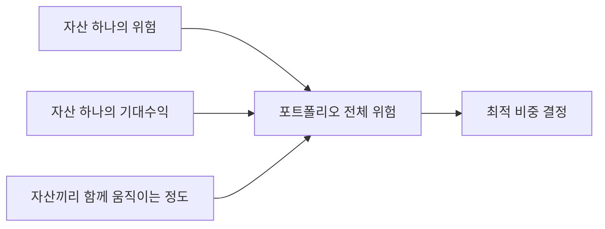
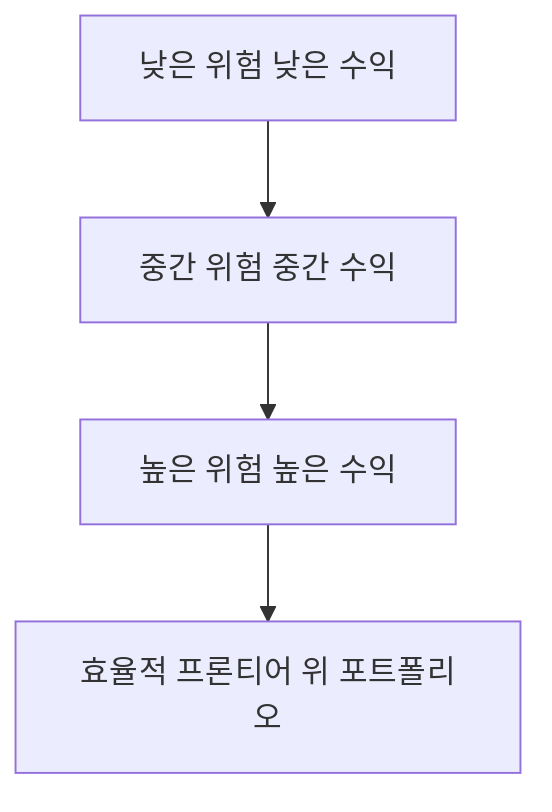

# 260317 중학생용 공분산과 포트폴리오 쉬운 설명

기준 시각: 2026-03-17 00:27 KST  
리서치 모드: `think ultra hard`

## 한 줄 결론 👀

포트폴리오 이론의 핵심은 **"좋은 자산을 많이 고르는 것"보다 "같이 움직이는 방식이 다른 자산을 잘 섞는 것"**에 있다.  
그래서 `공분산`, `상관계수`, `공분산 행렬`이 중요하고, 실전에서는 여기에 `shrinkage`, `turnover control`, `CVaR`, `tail-risk overlay` 같은 안전장치를 더 붙인다. 🛡️

---

## 먼저 큰 그림부터 🌍

투자를 아주 단순하게 생각하면 이렇게 보일 수 있다.

- 수익률이 높은 자산을 사면 좋다
- 위험한 자산은 피하면 된다

그런데 실제 포트폴리오는 그렇게 단순하지 않다.  
왜냐하면 자산은 **혼자 움직이지 않고, 서로 같이 움직이기** 때문이다.

예를 들어:

- 미국 주식과 한국 주식은 종종 같은 방향으로 크게 움직인다
- 금은 주식과 다르게 움직일 때가 있다
- 채권은 주식이 급락할 때 완충 역할을 하기도 한다

즉, 투자에서는 "이 자산이 좋은가?"만 보면 부족하고,  
**"다른 자산과 함께 담았을 때 어떤 일이 생기나?"**를 봐야 한다.  
그 질문에 답하려고 쓰는 핵심 도구가 `공분산`이다. 🧠



---

## 1. 공분산의 쉬운 의미 🔗

### 제일 쉬운 비유

공분산은 **"둘이 같이 움직이는 정도"**를 숫자로 나타낸 것이다.

- 더울수록 아이스크림 판매량도 늘고, 냉방기 사용도 늘면: 공분산이 `+`
- 비가 많이 오면 소풍 횟수는 줄고 우산 판매량은 늘면: 공분산이 `-`
- 둘 사이에 일정한 관계가 거의 없으면: 공분산이 `0`에 가깝다

### 투자에서의 의미

주식 A와 주식 B가 있다고 하자.

- A가 오를 때 B도 자주 오르면 공분산은 양수
- A가 오를 때 B가 자주 내리면 공분산은 음수
- 둘의 움직임이 제각각이면 공분산은 0 근처

### 왜 중요한가?

포트폴리오에서 진짜 중요한 것은 **각 자산의 위험을 더한 값**이 아니라  
**자산들이 서로 얼마나 같이 흔들리느냐**다.

그래서 어떤 자산이 혼자 보면 좀 위험해도:

- 다른 자산과 다르게 움직이면
- 전체 포트폴리오는 오히려 더 안정될 수 있다

이게 바로 `분산투자`가 먹히는 이유다. 📌

### 수식으로 쓰면

확률변수 \(X\), \(Y\)의 공분산은:

$$
\operatorname{Cov}(X,Y)=\mathbb{E}\left[(X-\mathbb{E}[X])(Y-\mathbb{E}[Y])\right]
$$

뜻은 간단하다.

- \(X-\mathbb{E}[X]\): X가 평소보다 얼마나 위/아래에 있는지
- \(Y-\mathbb{E}[Y]\): Y가 평소보다 얼마나 위/아래에 있는지
- 두 값을 곱해서 평균내면, 둘이 같은 방향으로 움직였는지 알 수 있다

---

## 2. 공분산 구하는 방법 🧮

실제 데이터에서는 보통 `표본 공분산(sample covariance)`을 쓴다.

수익률 데이터가 \(n\)개 있을 때:

$$
s_{xy}=\frac{1}{n-1}\sum_{t=1}^{n}(x_t-\bar{x})(y_t-\bar{y})
$$

여기서:

- \(x_t\): t시점의 자산 X 수익률
- \(y_t\): t시점의 자산 Y 수익률
- \(\bar{x}\): X의 평균 수익률
- \(\bar{y}\): Y의 평균 수익률

### 계산 순서

1. 각 자산의 평균 수익률을 구한다
2. 각 시점에서 평균보다 얼마나 위/아래인지 계산한다
3. 두 자산의 "평균에서 벗어난 정도"를 곱한다
4. 그 값을 모두 더해 평균낸다

### 아주 짧은 예시

자산 A 수익률이 \(2, 4, 6\), 자산 B 수익률이 \(1, 3, 5\)라고 하자.

- A 평균은 \(4\)
- B 평균은 \(3\)

그러면 편차는:

- A: \(-2, 0, 2\)
- B: \(-2, 0, 2\)

곱하면:

- \(4, 0, 4\)

따라서 공분산은 양수다.  
즉, 둘은 꽤 비슷하게 움직였다고 볼 수 있다.

### 주의할 점

공분산 숫자 자체는 **단위와 크기에 영향**을 많이 받는다.  
그래서 비교할 때는 보통 `상관계수`를 더 자주 쓴다.

---

## 3. 상관계수는 공분산과 뭐가 다른가? 🎯

상관계수는 공분산을 **"비교하기 쉽게 표준화한 값"**이다.

$$
\rho_{xy}=\frac{\operatorname{Cov}(X,Y)}{\sigma_x \sigma_y}
$$

여기서:

- \(\sigma_x\): X의 표준편차
- \(\sigma_y\): Y의 표준편차

### 해석

- \(\rho=1\): 거의 완전히 같은 방향
- \(\rho=0\): 뚜렷한 선형 관계가 약함
- \(\rho=-1\): 거의 완전히 반대 방향

### 왜 상관계수를 많이 쓰나?

공분산은 자산의 변동성 크기에 따라 숫자가 크게 달라진다.  
반면 상관계수는 항상 대체로 \(-1\)과 \(1\) 사이에 있으므로 비교가 쉽다.

즉:

- `공분산` = 함께 움직이는 절대적 정도
- `상관계수` = 함께 움직이는 정도를 보기 좋게 정규화한 값

---

## 4. 표본 공분산 행렬은 무엇인가? 🧩

자산이 2개가 아니라 여러 개이면, 공분산을 표 하나로 정리한다.  
그 표가 `표본 공분산 행렬(sample covariance matrix)`이다.

예를 들어 자산이 A, B, C 세 개면:

$$
S=
\begin{bmatrix}
\operatorname{Var}(A) & \operatorname{Cov}(A,B) & \operatorname{Cov}(A,C) \\
\operatorname{Cov}(B,A) & \operatorname{Var}(B) & \operatorname{Cov}(B,C) \\
\operatorname{Cov}(C,A) & \operatorname{Cov}(C,B) & \operatorname{Var}(C)
\end{bmatrix}
$$

### 읽는 방법

- 대각선: 각 자산의 분산
- 대각선 밖: 자산끼리의 공분산

### 왜 중요하나?

포트폴리오 위험 계산은 거의 이 행렬 위에서 돌아간다.

포트폴리오 비중 벡터를 \(w\), 공분산 행렬을 \(\Sigma\)라고 하면:

$$
\sigma_p^2 = w^\top \Sigma w
$$

즉, 포트폴리오 위험은 **비중 \(w\)** 와 **공분산 구조 \(\Sigma\)** 가 합쳐져서 결정된다.

### 그런데 왜 문제가 생기나?

표본 공분산 행렬은 과거 데이터로 만든다.  
그래서 데이터가 적거나 시장이 시끄러우면 오차가 커질 수 있다.

- 자산 수는 많은데 데이터 길이는 짧다
- 최근 우연한 움직임이 과하게 반영된다
- 그 결과 최적화가 이상한 비중을 내놓는다

이 문제가 커서 나온 대표 해법이 `shrinkage covariance`다. ⚠️

---

## 5. shrinkage covariance는 왜 쓰나? 🛠️

### 아주 쉬운 뜻

`shrinkage`는 말 그대로 **"극단적인 값을 조금 눌러서 더 안정적으로 만드는 것"**이다.

표본 공분산 행렬 \(S\)는 현실 데이터를 그대로 반영하지만 노이즈도 많다.  
그래서 더 단순하고 안정적인 목표 행렬 \(F\) 쪽으로 조금 당긴다.

$$
\hat{\Sigma}_{\text{shrink}}=\delta F + (1-\delta)S
$$

여기서:

- \(S\): 표본 공분산 행렬
- \(F\): 더 단순한 목표 행렬
- \(\delta\): 얼마나 강하게 당길지 정하는 값

### 왜 좋은가?

중학생식으로 말하면:

- 표본 공분산은 "시험을 딱 한 번 본 점수"
- shrinkage는 "평소 실력도 같이 반영한 보정 점수"

즉, 표본 데이터만 믿지 않고 **너무 튀는 추정치를 현실적으로 다듬는 것**이다.

### 실무에서 얻는 효과

- 비중이 덜 튄다
- 재현성이 좋아진다
- 포트폴리오가 덜 불안정해진다
- 데이터가 짧을 때 특히 유용하다

### 한계

- 너무 많이 shrink하면 진짜 시장 신호도 약해질 수 있다
- 목표 행렬 \(F\)를 어떻게 고르느냐가 중요하다

---

## 6. 효율적 프론티어는 무엇인가? 🏔️

효율적 프론티어는 **"같은 위험이면 수익이 가장 높고, 같은 수익이면 위험이 가장 낮은 포트폴리오들의 집합"**이다.

쉽게 말하면:

- 덜 효율적인 포트폴리오는 다른 더 좋은 포트폴리오에게 밀린다
- 살아남은 "가장 효율적인 조합들"만 연결한 곡선이 효율적 프론티어다



### 왜 중요하나?

투자자는 모두 성향이 다르다.

- 어떤 사람은 위험이 매우 싫다
- 어떤 사람은 수익을 위해 위험을 더 감수한다

효율적 프론티어는 이런 투자자들이 **자기 성향에 맞는 최적 포트폴리오를 고를 수 있게 해주는 지도**다.

---

## 7. 최소 분산 포트폴리오는 무엇인가? 🧱

`최소 분산 포트폴리오(Global Minimum Variance, GMV)`는  
말 그대로 **가능한 포트폴리오 중 분산이 가장 작은 것**이다.

수식으로는 보통:

$$
\min_w \; w^\top \Sigma w
$$

제약조건은 자주 이렇게 둔다.

$$
\sum_i w_i = 1, \quad w_i \ge 0
$$

### 쉬운 해석

GMV는 "수익률을 공격적으로 노리는 전략"이 아니다.  
오히려 **일단 전체 흔들림을 최소화하는 조합**을 찾는 전략이다.

### 장점

- 기대수익률 예측이 없어도 된다
- 구조가 단순하다
- 평시 변동성 관리에 강하다

### 단점

- 공분산 추정이 틀리면 결과가 크게 흔들릴 수 있다
- 변동성이 낮은 자산으로 과하게 몰릴 수 있다
- 위기 때 꼬리위험을 충분히 막지 못할 수 있다

---

## 8. 평시에는 괜찮아 보여도 위기 때는 왜 달라지나? 🌪️

이 문장은 실전에서 매우 중요하다.

> 평시에는 괜찮아 보여도, 위기 국면에서는 상관구조가 급변하고 left-tail risk가 커진다.

### 뜻을 하나씩 풀면

#### 1) 상관구조가 급변한다

평소에는 서로 다르게 움직이던 자산도,  
위기 때는 투자자들이 한꺼번에 위험자산을 팔면서 같이 무너질 수 있다.

즉:

- 평소 상관계수는 낮았는데
- 위기 때 갑자기 같이 하락할 수 있다

분산투자가 평소보다 덜 먹힌다는 뜻이다.

#### 2) left-tail risk가 커진다

수익률 분포를 그림으로 그리면 왼쪽은 큰 손실 구간이다.  
그래서 `left-tail risk`는 **아주 큰 손실이 나는 위험**을 뜻한다.

정리하면:

- 평시 모델은 평균적 흔들림을 잘 설명할 수 있다
- 하지만 위기 때는 "평균적인 날"이 아니라 "아주 나쁜 날"이 문제다

### 왜 공분산 기반 모델이 약해지나?

공분산은 보통 과거 전체 구간의 평균적 함께 움직임을 요약한다.  
그래서 극단적 위기 국면의 비정상적 구조 변화를 충분히 담지 못할 수 있다.

---

## 9. fat tail은 무엇인가? 🐘

`fat tail`은 **극단적인 사건이 생각보다 더 자주 일어나는 분포**를 말한다.

정규분포 세계에서는 큰 폭락이 매우 드물다고 본다.  
하지만 실제 금융시장에서는:

- 폭락
- 급등
- 연속 손실
- 변동성 폭발

같은 일이 정규분포 가정보다 더 자주 나온다.

이런 현상을 "꼬리가 두껍다", 즉 `fat tail`이라고 부른다.

### 왜 문제인가?

평균과 분산만 보는 모델은 이런 극단 사건을 과소평가하기 쉽다.  
그래서 평소에는 괜찮아 보여도 위기 때 크게 깨질 수 있다.

### 쉽게 말하면

- 보통 모델: "이 정도 폭락은 거의 안 나와"
- 실제 시장: "생각보다 자주 나온다"

이 차이가 바로 tail risk 문제다. ⚠️

---

## 10. downside risk 기반 기법은 무엇인가? ⬇️

분산은 위로 튄 것도 아래로 튄 것도 모두 위험으로 센다.  
하지만 투자자는 보통 **상승 변동성보다 하락 손실**을 더 싫어한다.

그래서 나온 것이 `downside risk` 기반 기법이다.

### 대표 생각

- 좋은 변동성은 벌점 주지 말자
- 나쁜 변동성, 즉 손실 쪽만 더 세게 보자

### 예시 1: semivariance

기준수익률 \(\tau\)보다 낮은 구간만 보겠다는 생각이다.

$$
\text{SemiVar} = \frac{1}{n-1}\sum_{t=1}^{n}\min(0, r_t-\tau)^2
$$

즉, 목표보다 못한 날만 골라서 위험을 계산한다.

### 예시 2: Sortino 계열

샤프지수는 전체 변동성을 쓰지만,  
Sortino는 downside deviation을 써서 **나쁜 변동성만 벌점** 준다.

### 장점

- 투자자 체감 위험과 더 가깝다
- "올라서 흔들린 것"을 위험으로 덜 본다

### 단점

- 계산과 최적화가 더 까다로울 수 있다
- 데이터가 적으면 추정이 불안정할 수 있다

---

## 11. expected shortfall 계열은 무엇인가? 🚨

`Expected Shortfall(ES)`은  
**정말 나쁜 날들만 모았을 때 평균적으로 얼마나 크게 잃는가**를 보는 지표다.

손실을 \(L\)이라고 하면:

$$
ES_\alpha = \mathbb{E}[L \mid L \ge VaR_\alpha]
$$

### 쉽게 풀면

예를 들어 95% 기준이면:

- 평범한 95일은 넘긴다
- 가장 나쁜 5일만 따로 본다
- 그 5일의 평균 손실이 얼마인지 계산한다

그래서 ES는 `VaR`보다 더 정보가 많다.

- `VaR`: "여기까지는 버틸 확률이 높다"
- `ES`: "그 선을 넘어서 망가지면 평균적으로 얼마나 더 아픈가"

### 왜 중요하나?

위기 때 투자자는 "조금 흔들리는 것"보다  
**아주 크게 깨질 가능성**을 더 걱정한다.

그래서 규제와 실무 모두 ES/CVaR 계열을 많이 본다.

### CVaR와 ES

실무에서는 `CVaR`를 `ES`와 거의 같은 뜻으로 쓰는 경우가 많다.  
엄밀한 정의 차이를 따지는 문헌도 있지만, 포트폴리오 최적화에서는 대체로 꼬리 평균손실 개념으로 이해하면 된다.

---

## 12. tail-risk overlay는 무엇인가? 🛡️

`overlay`는 기존 포트폴리오 위에 덧씌우는 보완 장치다.

즉:

- 기본 엔진은 예를 들어 GMV나 Risk Parity로 굴린다
- 그런데 급락 위험이 걱정되면
- 그 위에 추가 제약이나 헤지 규칙을 덧붙인다

이것이 `tail-risk overlay`다.

### 어떤 식으로 쓰나?

- `CVaR`가 일정 수준을 넘지 못하게 제한
- `max drawdown`이 너무 커지는 조합은 제외
- 스트레스 시나리오에서 손실이 과도하면 비중 축소
- 옵션 헤지 등을 통해 급락 방어층 추가

### 쉬운 비유

자전거를 타는 것이 기본 전략이라면:

- 헬멧
- 보호대
- 비 오는 날 속도 제한

이런 것이 overlay다.

즉, 기본 전략을 버리는 게 아니라 **망가질 때를 대비해 안전장치를 추가**하는 것이다.

---

## 13. turnover control은 무엇인가? 🔄

`turnover`는 포트폴리오를 얼마나 많이 갈아엎는지 보는 개념이다.

가장 단순한 형태는:

$$
\text{Turnover} = \sum_i |w_i^{\text{new}} - w_i^{\text{old}}|
$$

### 왜 중요하나?

최적화는 아주 작은 데이터 변화에도 비중을 크게 바꿀 수 있다.  
하지만 실제로는 비중을 자주 크게 바꾸면:

- 거래비용이 든다
- 슬리피지가 생긴다
- 세금 문제가 생길 수 있다
- 전략이 과하게 바쁘고 불안정해진다

그래서 turnover를 제어한다.

### 방법 1: turnover penalty

목적함수에 벌점을 추가한다.

예:

$$
\min_w \; w^\top \Sigma w + \lambda \sum_i |w_i - w_i^{\text{old}}|
$$

여기서 \(\lambda\)가 클수록 기존 비중에서 멀리 벗어나기 어렵다.

### 방법 2: turnover cap

"한 번 리밸런싱할 때 turnover는 최대 10%까지만" 같은 직접 제한을 둔다.

### 쉬운 해석

turnover control은 **"정답이 조금 달라도 너무 자주 갈아타지 말자"**는 실무 지혜다.

---

## 14. 공분산 기반 방법의 보완책들 🔧

실전에서는 `표본 공분산만 넣고 끝`이 거의 아니다.  
보통 아래 장치를 함께 붙인다.

### 1) 공분산 shrinkage

왜 쓰나:

- 추정오차를 줄이기 위해
- 비중이 너무 튀는 것을 막기 위해

핵심:

- 표본 공분산을 더 안정적인 구조 쪽으로 당긴다

### 2) 자산군/섹터/국가 cap

왜 쓰나:

- 최적화가 한 자산군에 몰리는 걸 막기 위해

예:

- 미국 주식 최대 40%
- 기술주 최대 25%
- 단일 종목 최대 5%

쉬운 뜻:

- 수학적으로 좋아 보여도, 너무 몰빵이면 사람 입장에서 불안하니 상한선을 두는 것

### 3) turnover penalty

왜 쓰나:

- 거래비용과 불안정성을 줄이기 위해

쉬운 뜻:

- 어제와 오늘 데이터가 조금 다르다고 포트폴리오를 매번 대수술하지 말자는 것

### 4) tail-risk 제약

대표 예:

- `CVaR` 제한
- `max drawdown` 제한
- stress scenario 손실 제한

왜 쓰나:

- 평균적인 날보다 "아주 나쁜 날" 방어가 더 중요할 수 있기 때문

### 5) regime switching 또는 scenario overlay

#### regime switching

시장을 한 상태로 보지 않고:

- 평시
- 불안정 국면
- 위기 국면

같이 여러 상태로 나눠서, 상태마다 다른 공분산과 위험구조를 쓰는 방법이다.

#### scenario overlay

기본 최적화 결과가 나와도,

- 금리 급등
- 경기침체
- 달러 급등
- 유동성 경색

같은 가상 충격을 넣어보고 너무 취약하면 비중을 다시 조정한다.

### 한 줄 요약

공분산 기반 최적화는 **뼈대**이고,  
위 장치들은 **안전벨트와 에어백**이다. 🚗

---

## 15. 포트폴리오 알고리즘 종류를 아주 쉽게 정리하면 📚

아래는 사용자가 적어 준 알고리즘들을 중학생 눈높이로 다시 풀어쓴 것이다.

| 알고리즘 | 쉬운 뜻 | 장점 | 약점 |
| --- | --- | --- | --- |
| `Equal Weight` | 모두 똑같이 담기 | 단순, 설명 쉬움, 추정오차 적음 | 위험 큰 자산도 같은 비중 |
| `Global Minimum Variance` | 전체 흔들림이 가장 작게 담기 | 변동성 관리 강함 | 공분산 추정에 민감 |
| `Shrinkage Covariance + GMV` | 공분산을 보정한 뒤 최소분산 | 더 안정적, 비중 덜 튐 | shrink 강도 설정 필요 |
| `GMV + 자산당 최대비중 cap` | 최소분산인데 몰빵 금지 | 실무적으로 납득 쉬움 | cap 설정이 성과에 영향 |
| `Risk Parity / ERC` | 자산별 위험 기여를 비슷하게 맞추기 | 특정 자산 쏠림 완화 | 레버리지·채권 비중 이슈 가능 |
| `Black-Litterman` | 시장균형 위에 투자자 의견을 섞기 | 극단적 기대수익 입력 완화 | 뷰 설정이 어렵다 |
| `Min CVaR` | 꼬리손실을 가장 작게 만들기 | 급락 방어에 강함 | 계산과 추정이 더 까다롭다 |
| `MVC + tail-risk constraint` | 평균-분산 틀에 꼬리위험 제한 추가 | 전통 이론과 방어력 절충 | 제약을 너무 세게 두면 답이 경직 |
| `MVC core + CVaR overlay` | 기본은 MVC, 마지막에 꼬리방어 추가 | 실무적, 유연함 | 설계가 복잡해진다 |

---

## 16. 알고리즘별로 한 단계 더 쉽게 설명 👣

### `Equal Weight`

가장 단순하다.  
자산이 4개면 각각 \(25\%\)씩 담는다.

좋은 점:

- 계산이 쉽다
- 설명이 쉽다
- 예측치가 거의 필요 없다

아쉬운 점:

- 위험이 큰 자산도 똑같이 담는다
- 자산 간 상관구조를 적극 활용하지 못한다

### `Global Minimum Variance`

공분산 행렬을 써서 **가장 덜 흔들리는 조합**을 찾는다.

좋은 점:

- 수익률 예측보다 안정성에 집중
- 장기적으로 꽤 실무적인 출발점이 될 수 있다

아쉬운 점:

- 입력 공분산이 틀리면 결과도 흔들린다

### `Shrinkage Covariance + GMV`

GMV의 약점은 공분산 오차에 민감하다는 것이다.  
그래서 공분산을 먼저 shrinkage로 다듬고 GMV를 돌린다.

쉽게 말하면:

- "원자료 그대로" 대신
- "노이즈를 좀 정리한 공분산"으로 최소분산을 구하는 것

### `GMV + 자산당 최대비중 cap`

GMV가 너무 한 자산에 몰릴 수 있으니:

- 자산당 최대 \(20\%\)
- 국가당 최대 \(30\%\)

같은 제한을 둔다.

이건 수학적 최적해를 조금 포기하고,  
대신 **현실적이고 설명 가능한 해**를 얻는 방법이다.

### `Risk Parity / ERC`

여기서는 돈의 비중이 아니라 **위험의 기여도**를 맞추려고 한다.

즉:

- 어떤 자산이 변동성이 크면 돈 비중은 적게
- 어떤 자산이 안정적이면 돈 비중은 더 많이

해서 전체 위험 기여를 비슷하게 맞춘다.

### `Black-Litterman`

전통 mean-variance는 기대수익률 입력이 조금만 바뀌어도 결과가 많이 흔들릴 수 있다.  
Black-Litterman은 이를 줄이기 위해:

- 시장이 암묵적으로 말하는 균형수익률
- 투자자의 뷰

를 섞는다.

쉽게 말하면:

- "내 생각"만 믿지 않고
- "시장 평균 생각" 위에 내 의견을 살짝 얹는 방식

### `Min CVaR`

평균적 흔들림보다 **진짜 나쁜 날 손실**을 줄이는 데 초점을 둔다.

그래서 폭락 방어가 중요한 투자자에게 더 잘 맞을 수 있다.

### `MVC + tail-risk constraint`

기본은 평균-분산 최적화지만,

- `CVaR`는 이 수준 이하
- stress test 손실은 이 수준 이하

같은 추가 조건을 붙인다.

즉:

- 엔진은 기존 이론
- 브레이크는 tail-risk 제약

### `MVC core + CVaR overlay`

이건 실무에서 꽤 자연스럽다.

1. 기본 포트폴리오는 익숙한 MVC로 만든다
2. 마지막에 꼬리위험 검사를 한다
3. 너무 위험하면 비중을 깎거나 헤지를 얹는다

쉽게 말하면:

- 기본 주행은 일반 엔진
- 폭우가 오면 안전모드 추가

---

## 17. 그래서 어떤 방식이 "정답"인가? 🤔

정답은 하나가 아니다.

### 평시 변동성 관리가 목표면

- `GMV`
- `Shrinkage Covariance + GMV`
- `Risk Parity`

가 출발점이 되기 좋다.

### 급락 방어가 더 중요하면

- `Min CVaR`
- `MVC + tail-risk constraint`
- `MVC core + CVaR overlay`

가 더 적합할 수 있다.

### 실무적으로 가장 무난한 조합

많은 경우 아래 조합이 현실적이다.

1. `shrinkage covariance`로 공분산 안정화
2. `GMV` 또는 `Risk Parity`로 기본 비중 산출
3. 자산군/섹터/국가 cap 추가
4. `turnover penalty` 추가
5. `CVaR`나 stress scenario로 tail-risk 점검

즉, 실무는 보통 **"한 알고리즘 승자 독식"**이 아니라  
**"기본 엔진 + 제약 + overlay"** 구조다. 🧩

---

## 18. 전체를 한 장으로 요약하면 📝

### 핵심 연결고리

- `공분산`은 자산들이 같이 움직이는 정도다
- `상관계수`는 그걸 비교하기 쉽게 만든 값이다
- `표본 공분산 행렬`은 여러 자산의 관계를 모아놓은 표다
- `효율적 프론티어`는 가장 효율적인 포트폴리오들의 집합이다
- `최소 분산 포트폴리오`는 그중 가장 덜 흔들리는 점이다

### 그런데 실전은 더 어렵다

- 과거 데이터는 시끄럽다
- 위기 때 상관이 급변한다
- fat tail 때문에 극단 손실이 더 자주 나온다

그래서:

- `shrinkage covariance`
- `turnover control`
- `tail-risk overlay`
- `CVaR / expected shortfall`
- `regime switching / scenario overlay`

같은 보완 장치가 필요하다.

### 정말 짧은 결론

`공분산 기반 최적화`는 포트폴리오 설계의 출발점이고,  
`downside risk`와 `tail-risk` 도구들은 그 출발점을 현실에 맞게 고쳐 주는 보완장치다. ✅

---

## 참고한 웹 문서 🔎

- Harry Markowitz, *Portfolio Selection* (1952)  
  https://www.math.hkust.edu.hk/~maykwok/courses/ma362/07F/markowitz_JF.pdf
- NIST/SEMATECH e-Handbook of Statistical Methods, Covariance / Correlation sections  
  https://www.itl.nist.gov/div898/handbook/pmc/section5/pmc541.htm
- Olivier Ledoit, Michael Wolf, *A Well-Conditioned Estimator for Large-Dimensional Covariance Matrices* (2004)  
  https://www.ledoit.net/honey.pdf
- Harry Markowitz et al., *Avoiding the Downside: A Practical Review of the Sortino and Sortino Ratio*  
  https://www.sortino.com/htm/the_sortino_ratio.htm
- Rockafellar, Uryasev, *Optimization of Conditional Value-at-Risk*  
  https://www.ise.ufl.edu/uryasev/files/2011/11/CVaR1_JOR.pdf
- BIS, *Fundamental review of the trading book: Executive summary*  
  https://www.bis.org/bcbs/publ/d352.pdf
- Longin, Solnik, *Extreme Correlation of International Equity Markets*  
  https://www.sciencedirect.com/science/article/abs/pii/S0927539801000403
- IMF, *Global Financial Stability Report, October 2023, Chapter 2*  
  https://www.imf.org/en/Publications/GFSR/Issues/2023/10/10/global-financial-stability-report-october-2023
- Fischer Black, Robert Litterman, *Global Portfolio Optimization*  
  https://www.goldmansachs.com/our-firm/history/moments/1990-black-litterman-model.pdf

---

## 작성 시 사용한 사용자 질문 프롬프트

```text
think ultra hard

아래 항목에 대한 더 쉽고 더 자세한 설명
중학생 수준 설명
수식이 나올때는 latex 구문으로 작성 요청

- 공분산의 쉬운 의미
- 공분산 구하는 방법
- shrinkage covariance
- turnover control
- tail-risk overlay
- fat tail
- 상관계수
- 효율적 프론티어
- 최소 분산 포트폴리오
- 표본 공분산 행렬
- downside risk 기반 기법
- 평시에는 괜찮아 보여도, 위기 국면에서는 상관구조가 급변하고 left-tail risk가 커진다.
- expected shortfall 계열
- 공분산 보완방법
    - 공분산 shrinkage
    - 자산군/섹터/국가 cap
    - turnover penalty
    - tail-risk 제약(CVaR, max drawdown, stress scenario)
    - regime switching 또는 scenario overlay
- 포트폴리오 알고리즘 종류
    - Equal Weight
    - Global Minimum Variance
    - Shrinkage Covariance + GMV
    - GMV + 자산당 최대비중 cap
    - Risk Parity / ERC
    - Black-Litterman으로 뷰 반영
    - Min CVaR
    - MVC + tail-risk constraint
    - MVC core + CVaR overlay
```
