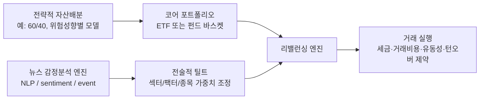

# 260317 포트폴리오 리밸런싱·펀드·ETF 리서치

작성 시점: 2026-03-17 00:44 (Asia/Seoul 기준 확인)  
리서치 기준: 2026-03-17에 웹 소스 확인, 일부 운용사 수치와 펀드 비용 정보는 각 운용사 페이지의 2025-09-30 또는 2025-12-31 기준 데이터를 포함함.

## 한눈에 결론 👀

지금 기획 중인 "뉴스 감정분석 기반 포트폴리오 리밸런싱 서비스"를 이해하려면 먼저 **리밸런싱 상품의 껍데기(wrapper)** 와 **포트폴리오를 움직이는 엔진(signal/rule)** 를 분리해서 봐야 합니다.

- `리밸런싱을 수행하는 상품 = 펀드` 라고만 보면 절반만 맞습니다.
- 맞는 이유: 많은 펀드가 내부적으로 비중을 다시 맞추기 때문입니다.
- 틀린 이유: 리밸런싱은 펀드뿐 아니라 ETF, 타깃데이트펀드(TDF), 자산배분 펀드, 로보어드바이저, SMA/UMA, 다이렉트인덱싱, 옵션/파생 오버레이 구조에서도 일어납니다.
- 즉, 리밸런싱은 **기능** 이고, 펀드는 그 기능을 담는 **법적/판매 구조 중 하나** 입니다.

핵심적으로 보면:

1. **뮤추얼펀드 / ETF / 사모펀드** 는 "포장 방식"에 가깝습니다.
2. **패시브 / 액티브 / 인덱스 / 타깃데이트 / 자산배분** 은 "운용 방식"에 가깝습니다.
3. **뉴스 감정분석** 은 아직 대중적인 리테일 자산배분 서비스의 메인 엔진이라기보다, 일부 액티브 ETF나 기관용 데이터 제품의 신호 엔진으로 더 많이 쓰입니다.



## 1. 포트폴리오 이론에서 리밸런싱은 무엇인가 🧭

현대 포트폴리오 이론의 출발점은 Harry Markowitz의 평균-분산 최적화입니다. 핵심은 "개별 자산을 고르는 것"보다 "서로 상관관계가 다른 자산을 조합해 위험 대비 기대수익을 개선하는 것"입니다. 이 조합은 시간이 지나면 시장 움직임 때문에 깨지므로, 다시 목표 비중으로 맞추는 작업이 리밸런싱입니다.

리밸런싱의 목적은 보통 네 가지입니다.

- 처음 설계한 위험 수준을 유지
- 특정 자산 쏠림을 방지
- 전략적 자산배분을 지속
- 투자 규율을 자동화

하지만 현실에서는 항상 비용이 붙습니다.

- 매매 비용
- 세금
- 슬리피지
- 신호 과적합 위험

그래서 좋은 리밸런싱 시스템은 단순히 "비중이 틀어졌으니 무조건 복원"하지 않고, 보통 아래 요소를 같이 둡니다.

- 시간 기반: 월 1회, 분기 1회
- 임계치 기반: 목표 대비 일정 % 이상 벗어났을 때
- 현금흐름 기반: 입금/출금/배당 재투자로 먼저 맞춤
- 세금 고려 기반: 단기차익 최소화, wash sale 회피, tax lot 최적화

## 2. "리밸런싱 상품을 펀드라고 하나?"에 대한 정확한 답 🏷️

짧게 답하면:

- **일부는 펀드가 맞다**
- **하지만 일반화하면 틀리다**

### 2-1. 펀드인 경우

다음은 "펀드 내부에서" 리밸런싱이 일어나는 전형적인 구조입니다.

- 밸런스드 펀드 / 혼합형 펀드
- 자산배분 펀드
- 타깃리스크 펀드
- 타깃데이트 펀드
- 펀드오브펀드(Fund of Funds)
- 자산배분 ETF

이 경우 투자자는 펀드 지분만 들고 있고, 실제 리밸런싱은 운용사가 펀드 안에서 수행합니다.

### 2-2. 펀드가 아닌 경우

다음은 "고객 계좌 자체"를 리밸런싱하는 구조입니다.

- 로보어드바이저
- 투자자문 기반 모델 포트폴리오
- SMA/UMA
- 다이렉트 인덱싱
- 프라이빗뱅크 discretionary mandate

이 경우 자산은 투자자 개인 계좌에 있고, 서비스가 비중 조정 지시를 내립니다.

### 2-3. 파생상품/오버레이 구조인 경우

인접 영역에는 이런 것들도 있습니다.

- 옵션 오버레이 ETF
- 버퍼 ETF / defined outcome ETF
- 변동성 제어(volatility control) 지수
- CPPI류 포트폴리오 인슈어런스 구조
- 구조화노트 내 동적 헤지

이들은 엄밀한 의미의 전통 펀드와는 다를 수 있지만, 결과적으로 포트폴리오 노출을 동적으로 다시 맞춥니다.

즉, **리밸런싱은 운용 로직이고, 펀드는 그 로직을 담는 하나의 법적 그릇** 입니다.

## 3. 펀드의 종류와 설명 📚

펀드는 한 축으로만 나누면 헷갈립니다. 최소 3개의 축으로 봐야 정리가 됩니다.

### 3-1. 운용 방식 기준: Passive vs Active

| 구분 | 의미 | 장점 | 단점 | 대표 형태 |
| --- | --- | --- | --- | --- |
| Passive fund | 지수나 규칙 기반 포트폴리오를 추종 | 낮은 비용, 높은 투명성, 낮은 회전율 | 벤치마크 이상 초과수익 기대가 제한적 | 인덱스펀드, 패시브 ETF |
| Active fund | 매니저 재량 또는 모델 기반으로 초과수익 추구 | 시장/섹터/종목별 차별화 가능 | 비용 상승, 회전율 증가, 성과 편차 큼 | 액티브 뮤추얼펀드, 액티브 ETF |

중요한 포인트:

- `ETF = 패시브` 가 아닙니다.
- `ETF` 안에도 액티브 ETF가 있고 패시브 ETF가 있습니다.
- `뮤추얼펀드` 안에도 액티브와 패시브가 모두 있습니다.

### 3-2. 판매/법적 구조 기준: 뮤추얼펀드 vs ETF vs 사모펀드

| 구분 | 공개 판매 여부 | 거래 방식 | 가격 결정 | 유동성 | 일반적 투자자 |
| --- | --- | --- | --- | --- | --- |
| Mutual fund | 공모 | 장 종료 후 NAV 거래 | 하루 1번 | 일 단위 | 일반 투자자 |
| ETF | 공모 | 거래소 실시간 거래 | 장중 시장가격 | 장중 | 일반 투자자 |
| Private fund | 비공모 | 사적 계약 | 빈번하지 않음 | 낮음/락업 가능 | 적격투자자, 기관 |

#### 뮤추얼펀드

- 많은 투자자의 돈을 모아 하나의 포트폴리오를 구성하는 공모펀드입니다.
- 일반적으로 하루 1회 순자산가치(NAV) 기준으로 거래합니다.
- 은퇴계좌, 장기 적립식, 자산배분형 상품에서 여전히 중요합니다.

#### ETF

- 거래소에 상장되어 주식처럼 실시간 거래됩니다.
- 저비용, 높은 투명성, 거래 편의성 때문에 현재 가장 빠르게 확장된 래퍼 중 하나입니다.
- 하지만 ETF는 "거래 구조"이지, 그 자체로 액티브/패시브를 의미하지는 않습니다.

#### 사모펀드(private fund)

- 공모가 아닌 비공개 자금모집 구조입니다.
- 흔히 hedge fund, private equity, venture capital 등과 연결됩니다.
- 투자자 자격 요건, 정보공개 범위, 환매 구조가 공모펀드와 다릅니다.
- 뉴스 감정분석 같은 대체데이터 기반 전략은 오히려 사모/기관 구조에서 먼저 상용화되는 경우가 많습니다.

### 3-3. 전략 내용 기준: 인덱스펀드, 자산배분펀드, 타깃데이트펀드

#### 인덱스펀드(Index fund)

- 특정 지수(S&P 500, Total Market, MSCI World 등)를 추종하는 전략입니다.
- 인덱스펀드는 **뮤추얼펀드일 수도 있고 ETF일 수도 있습니다.**
- 예: `VOO`는 ETF이면서 인덱스펀드이자 패시브 펀드입니다.

#### 밸런스드/자산배분 펀드

- 주식과 채권을 함께 담고 목표 비중을 유지합니다.
- 가장 전통적인 "내부 리밸런싱형" 상품입니다.
- 사용자는 펀드 하나를 들지만, 운용사는 내부에서 주식/채권/현금 비중을 계속 맞춥니다.

#### 타깃리스크 펀드 / 자산배분 ETF

- 보수형, 중립형, 공격형 같은 위험 수준별 모델을 제공합니다.
- 예를 들어 20/80, 40/60, 60/40, 80/20처럼 고정 비중을 유지합니다.

#### 타깃데이트 펀드(TDF)

- 투자자의 예상 은퇴 시점에 맞춰 자산배분을 자동으로 바꿉니다.
- 초반에는 주식 비중이 높고, 시간이 갈수록 채권 비중이 높아지는 glide path 구조가 일반적입니다.
- "시간에 따라 자동 리밸런싱 + 자동 위험축소"가 결합된 상품입니다.

## 4. 헷갈리는 개념 정리: 인덱스펀드? ETF? 액티브 ETF? 🧩

아래처럼 보면 가장 덜 헷갈립니다.

- `ETF`: 거래소에서 거래되는 포장 방식
- `Mutual fund`: 장 종료 후 NAV로 거래되는 포장 방식
- `Index fund`: 지수를 추종하는 운용 방식
- `Passive fund`: 재량이 적고 규칙 기반인 운용 방식
- `Active fund`: 재량 또는 모델이 적극 개입하는 운용 방식

예시:

- `VOO`: ETF + 인덱스펀드 + 패시브
- `AIEQ`: ETF + 액티브 + AI/대체데이터 활용
- `Vanguard Target Retirement Fund`: 뮤추얼펀드 + 자산배분 + 자동 리밸런싱
- `BUZZ`: ETF + 테마/시그널 기반 + 감정 점수 활용

## 5. 과거부터 현재까지, 리밸런싱 상품은 어떻게 발전했나 ⏳

| 시기 | 대표 구조 | 핵심 리밸런싱 아이디어 | 현재 관점 |
| --- | --- | --- | --- |
| 전통적 혼합형 펀드 시대 | balanced mutual fund | 주식/채권 비중 유지 | 가장 고전적인 형태 |
| 인덱스 펀드 확산 | index mutual fund | 전략적 코어를 저비용으로 고정 | 코어 자산의 표준화 |
| ETF 확산 이후 | passive ETF basket | ETF 바스켓 단위로 계좌 또는 펀드 리밸런싱 | 거래 유연성 증가 |
| 타깃데이트/타깃리스크 | TDF, allocation fund | 위험수준 또는 은퇴시점 기반 자동 조정 | 연금/장기자산의 표준 |
| 로보어드바이저 | managed account | 고객 계좌 수준 자동 리밸런싱 | 서비스형 리밸런싱 |
| AI/대체데이터 시대 | active ETF / quant mandate | 뉴스, 소셜, 이벤트, 팩터를 반영한 동적 틸트 | 아직 메인스트림은 아님 |

실무적으로 보면, 리밸런싱은 아래 세 층으로 진화했습니다.

1. **고정 비중 복원**
2. **생애주기 기반 조정**
3. **신호 기반 전술적 조정**

당신이 만들고 있는 뉴스 감정분석 서비스는 3번에 가깝습니다. 다만 실제 상용화는 대개 1번 위에 3번을 얹는 구조로 갑니다. 즉:

- 코어는 패시브/전략적 자산배분
- 위에 뉴스 감정분석으로 tactical tilt

이 구조가 비용, 규제설명, 성과 일관성 측면에서 가장 현실적입니다.

## 6. 실제 시장의 대표 상품/서비스 분류 🏦

### 6-1. 펀드 내부에서 리밸런싱하는 상품

#### 1) Vanguard LifeStrategy Funds

- 하나의 펀드 안에서 주식/채권 목표 비중을 유지하는 자산배분형 펀드군
- 예시 비중:
  - Income: 20% 주식 / 80% 채권
  - Conservative Growth: 40% / 60%
  - Moderate Growth: 60% / 40%
  - Growth: 80% / 20%
- 즉, 사용자는 "내 위험 성향에 맞는 한 개 상품"을 고르면 되고, 내부 리밸런싱은 펀드가 수행

#### 2) Vanguard Target Retirement Funds

- 은퇴 시점별 포트폴리오를 한 펀드에 담음
- 운용사가 주식/채권 비중을 점진적으로 바꿔 더 보수적으로 이동
- 현재 목표 비중 유지도 자동으로 수행

#### 3) iShares Core Allocation ETFs

- ETF 래퍼 안에서 자산배분을 수행하는 구조
- 투자자는 ETF를 거래하지만, 상품은 다중 자산 allocation 기능을 제공

### 6-2. 고객 계좌를 리밸런싱하는 서비스

#### 1) Betterment

- 현금흐름 기반, drift 기반, 세금 고려 기반 리밸런싱 로직을 사용
- 즉, 무조건 매매로 맞추는 것이 아니라 입출금과 배당 재투자를 우선 활용하고, 필요한 경우만 적극적 재조정

#### 2) Schwab Intelligent Portfolios

- 자동화된 포트폴리오 모니터링과 자동 리밸런싱 제공
- 로보어드바이저형 서비스의 대표 사례

#### 3) Vanguard Digital Advisor

- 자문 서비스 래퍼 안에서 자동 자산배분 및 관리 기능 제공
- 펀드 판매가 아니라 "서비스형 리밸런싱" 관점에서 봐야 함

## 7. Passive / Active / Mutual fund / Private fund / ETF / Index fund 정리 표 📝

| 질문 | 정답 |
| --- | --- |
| Passive 펀드는 무엇인가? | 대체로 지수 또는 규칙 기반 추종형 펀드 |
| Active 펀드는 무엇인가? | 매니저 또는 모델이 초과수익을 위해 재량 개입하는 펀드 |
| Mutual fund는 무엇인가? | 공모형 집합투자기구, 보통 하루 1회 NAV 거래 |
| Private fund는 무엇인가? | 비공개 자금모집 구조의 펀드, 보통 적격투자자 대상 |
| ETF는 무엇인가? | 거래소에서 실시간 거래되는 공모형 래퍼 |
| Index fund는 무엇인가? | 특정 지수를 추종하는 전략. ETF일 수도, 뮤추얼펀드일 수도 있음 |

가장 중요한 정리:

- `ETF` 와 `Mutual fund` 는 주로 **형태**
- `Passive` 와 `Active` 는 주로 **운용 스타일**
- `Index fund` 는 **전략**
- `TDF / allocation fund / robo advisory` 는 **사용 시나리오**

## 8. 큰 펀드를 운용하는 주요 회사와 대표 상품 🌍

정확한 글로벌 순위는 조사 시점과 집계 기준마다 조금씩 달라집니다. 다만 리테일 ETF/인덱스/자산배분 시장에서 반복적으로 핵심 축이 되는 플레이어는 아래와 같습니다.

### 8-1. Vanguard

강점:

- 인덱스펀드와 장기자산배분의 대표 주자
- TDF와 balanced fund 영역에서도 매우 강함

대표 상품:

- `VOO`: S&P 500 ETF
- `VTI`: Total US stock market ETF
- `LifeStrategy Funds`: 고정 자산배분형 리밸런싱 펀드
- `Target Retirement Funds`: 생애주기형 자동 리밸런싱 펀드

### 8-2. BlackRock / iShares

강점:

- 세계 최대급 ETF/인덱스 생태계
- iShares 브랜드를 통해 코어 ETF부터 멀티에셋 ETF까지 폭넓게 제공

대표 상품:

- `IVV`: iShares Core S&P 500 ETF
- `ITOT`: iShares Core Total U.S. Stock Market ETF
- `AOM`: iShares Core Moderate Allocation ETF

### 8-3. State Street Global Advisors / SPDR

강점:

- ETF 역사에서 상징적 존재
- SPY를 포함해 대형 ETF 브랜드 보유
- 자산배분 및 기관 솔루션 강점

대표 상품:

- `SPY`: SPDR S&P 500 ETF Trust
- 자산배분/기관용 멀티에셋 솔루션

참고로 SSGA는 공식 페이지에서 2025-12-31 기준 약 `USD 5.66T` AUM을 언급합니다.

### 8-4. Capital Group / American Funds

강점:

- 전통 액티브 뮤추얼펀드 강자
- 은퇴자산/자문채널에서 강한 브랜드

대표 상품:

- `AGTHX`: The Growth Fund of America
- 미국 리테일 액티브 펀드 시장의 전통적 대표군

### 8-5. 로보어드바이저형 주요 서비스 회사

이들은 "큰 펀드를 운용하는 회사"와는 조금 다른 범주지만, **리밸런싱 서비스 관점** 에서는 반드시 봐야 합니다.

- Betterment
- Schwab Intelligent Portfolios
- Vanguard Digital Advisor

즉, 앞으로 당신이 만들 서비스의 경쟁 구도는 "펀드 운용사"뿐 아니라 "자동화 투자 서비스"와도 겹칩니다.

## 9. 뉴스 감정분석 기반 포트폴리오/펀드/서비스가 실제로 있는가? 🤖

짧게 답하면:

- **있다**
- 하지만 **대부분은 종목선정 또는 전술적 틸트에 쓰이고**
- **전통적 멀티에셋 리밸런싱 서비스의 메인 엔진으로는 아직 드물다**

### 9-1. 공개 리테일 상품 사례

#### AIEQ: Amplify AI Powered Equity ETF

이 ETF는 공식 페이지에서 IBM Watson 기반 AI, sentiment analysis, natural language processing, 그리고 뉴스 기사/소셜/리포트/재무데이터 분석을 언급합니다.

해석:

- 이 상품은 "뉴스/텍스트 기반 신호를 실제 ETF 운용에 연결한" 공개 사례입니다.
- 다만 이것은 **멀티에셋 자산배분 리밸런싱 서비스** 라기보다 **미국 주식 액티브 선택 ETF** 에 가깝습니다.

#### BUZZ: VanEck Social Sentiment ETF

VanEck 공식 설명에 따르면 BUZZ는 소셜미디어, 뉴스 기사, 블로그 포스트 등 온라인 콘텐츠를 집계해 높은 긍정적 투자자 sentiment를 보이는 대형주를 추종합니다.

해석:

- 순수 뉴스만이 아니라 social + news + blog의 복합 sentiment 구조
- 이것도 역시 "전체 자산배분 서비스"보다 "sentiment 기반 주식 선별 ETF"에 가깝습니다.

### 9-2. 기관용 데이터/엔진 사례

#### RavenPack News Analytics

- 실시간 뉴스, 이벤트, sentiment 분석을 제공하는 기관용 데이터 제품
- 포트폴리오 매니저, 퀀트, 리스크 시스템이 신호 또는 feature로 사용 가능

#### MarketPsych

- 뉴스 및 소셜 텍스트에서 sentiment를 추출하는 금융 NLP 계열 데이터 공급자
- 공개 ETF보다 B2B/기관 workflow 쪽 맥락이 더 강함

### 9-3. 왜 "뉴스 감정분석 리밸런싱 서비스"는 흔하지 않은가

이유는 꽤 명확합니다.

#### 1) 신호 주기와 리밸런싱 주기가 다름

- 뉴스 감정은 시/일 단위로 빠르게 변합니다.
- 하지만 장기 포트폴리오 리밸런싱은 보통 주/월/분기 단위가 더 적합합니다.
- 둘을 그대로 합치면 turnover가 폭증합니다.

#### 2) 세금과 거래비용이 커짐

- 뉴스가 조금만 흔들려도 자주 바꾸면 after-tax 성과가 나빠질 수 있습니다.
- Betterment 같은 서비스가 현금흐름/세금 최적화를 강조하는 이유가 여기 있습니다.

#### 3) 해석 가능성 문제가 큼

- "왜 오늘 비중을 줄였는가?"를 사용자와 규제 측면에서 설명해야 합니다.
- 뉴스 sentiment는 noisy하고, 특정 이벤트 해석이 모호할 수 있습니다.

#### 4) 멀티에셋 확장이 어렵다

- 주식 종목이나 섹터는 뉴스와 연결이 쉽습니다.
- 하지만 채권 duration, 금, 원자재, 글로벌 매크로 자산까지 일관되게 연결하는 것은 더 어렵습니다.

그래서 현실의 상용 제품은 보통 다음 중 하나를 택합니다.

- 뉴스 sentiment를 **종목선정 신호** 로 사용
- 뉴스 sentiment를 **위험 오버레이 신호** 로 사용
- 뉴스 sentiment를 **설명/알림 기능** 으로 사용
- 전략적 자산배분 위에 **작은 tactical band** 만 허용

## 10. 당신의 서비스 기획에 주는 시사점 🛠️

뉴스 감정분석 기반 리밸런싱 서비스를 바로 "펀드"로 가기보다, 아래 순서가 더 현실적입니다.

### 권장 구조 1: 코어-새틀라이트 모델

- 코어: 저비용 패시브 ETF 바스켓
- 새틀라이트: 뉴스 감정분석으로 섹터/팩터/지역 틸트

이유:

- 사용자가 이해하기 쉽고
- 백테스트 과적합 위험이 낮아지고
- 세금/거래비용 통제가 쉬움

### 권장 구조 2: 신호를 "전체 재배분"이 아니라 "band adjustment"로 제한

예:

- 기본 주식 60%, 채권 40%
- 뉴스 위험 점수 악화 시 주식 55%, 채권 45%까지만 허용
- 또는 섹터 비중 ±3%~5% 범위만 조정

이 방식은 실전 친화적입니다.

### 권장 구조 3: 리밸런싱 엔진과 알파 엔진을 분리

- 리밸런싱 엔진: 세금, drift, 현금흐름, 거래비용 관리
- 알파 엔진: 뉴스 sentiment, 이벤트, 주제별 스코어링

이 분리를 해두면 나중에:

- 자문 서비스
- 모델 포트폴리오
- ETF 전략
- B2B API

어느 쪽으로도 확장하기 쉽습니다.

### 권장 구조 4: 상품화 순서

실무적으로는 아래 순서가 가장 자연스럽습니다.

1. **리서치/백테스트 엔진**
2. **모델 포트폴리오 추천 서비스**
3. **자문형 자동 리밸런싱 서비스**
4. **규모가 붙으면 SMA 또는 ETF 래퍼 검토**

즉, 현재 단계에서 자신을 "펀드"로 정의하기보다:

- `AI 기반 자산배분 모델`
- `뉴스 감정 기반 tactical allocation engine`
- `자동 리밸런싱 투자 서비스`

이런 식으로 정의하는 편이 더 정확합니다.

## 11. 현실적인 경쟁 구도 요약 ⚔️

당신의 잠재 경쟁자는 3종류입니다.

### 11-1. 저비용 코어 제공자

- Vanguard
- iShares
- SPDR

이들은 코어 자산배분 재료를 제공합니다.

### 11-2. 자동 리밸런싱 서비스 제공자

- Betterment
- Schwab Intelligent Portfolios
- Vanguard Digital Advisor

이들은 "리밸런싱 UX와 자동화"에서 경쟁자입니다.

### 11-3. 감정/대체데이터 기반 알파 제공자

- AIEQ
- BUZZ
- RavenPack
- MarketPsych

이들은 "뉴스/텍스트 신호" 관점의 경쟁자 혹은 벤치마크입니다.

따라서 당신의 차별화 포인트는 단순히 "뉴스를 본다"가 아니라 아래가 되어야 합니다.

- 뉴스 감정을 **어떤 자산배분 규칙** 으로 번역하는가
- 그 규칙이 **비용/세금/턴오버** 를 어떻게 통제하는가
- 사용자에게 **왜 바뀌었는지 설명 가능** 한가

## 12. 최종 정리 ✅

핵심 문장만 남기면:

- 포트폴리오 리밸런싱은 펀드만의 기능이 아니다.
- 펀드는 리밸런싱을 담는 여러 그릇 중 하나다.
- ETF는 구조이고, 인덱스펀드는 전략이며, 패시브/액티브는 운용 스타일이다.
- 타깃데이트펀드와 자산배분펀드는 "리밸런싱 내장형 상품"의 대표 사례다.
- 로보어드바이저는 "서비스형 리밸런싱"의 대표 사례다.
- 뉴스 감정분석을 활용한 공개 상품은 존재하지만, 대부분 종목선정/전술적 틸트 쪽이고 전통적인 멀티에셋 리밸런싱 서비스의 중심축은 아직 아니다.
- 따라서 당신의 서비스는 "패시브 코어 + 뉴스 기반 tactical overlay + 세금/턴오버 제약" 구조가 가장 현실적이다.

## 13. 사실검증 메모 🔎

- `State Street AUM 5.66T` 표기는 공식 about 페이지의 2025-12-31 기준 문구를 확인함.
- `Vanguard Target Retirement` 관련 비용과 설명은 Vanguard 페이지 내 2025-12-31 기준 데이터와 문구를 확인함.
- `Betterment` 리밸런싱 방식은 2026-02-26 수정된 도움말 페이지에서 drift, cash flow, tax-aware 접근을 확인함.
- `AIEQ` 는 공식 페이지에서 AI, sentiment analysis, NLP, recent economic data, news articles 활용을 확인함.
- `BUZZ` 는 공식 페이지 메타 설명과 스키마 데이터에서 social media, news articles, blog posts 기반 positive investor sentiment를 확인함.
- `RavenPack` 과 `MarketPsych` 는 기관용 뉴스/감정 데이터 제공자 성격을 확인함.

## 14. 참고 URL 🔗

### 이론/정의

- Markowitz, Portfolio Selection (1952): https://doi.org/10.2307/2975974
- Investor.gov, Mutual Funds: https://www.investor.gov/introduction-investing/investing-basics/glossary/mutual-funds
- Investor.gov, Exchange-Traded Funds (ETFs): https://www.investor.gov/introduction-investing/investing-basics/glossary/exchange-traded-funds-etfs
- Investor.gov, Index Fund: https://www.investor.gov/introduction-investing/investing-basics/glossary/index-fund
- Investor.gov, Hedge Funds: https://www.investor.gov/introduction-investing/investing-basics/glossary/hedge-funds
- Investor.gov, Accredited Investor: https://www.investor.gov/introduction-investing/investing-basics/glossary/accredited-investor
- Investor.gov, Actively Managed ETFs: https://www.investor.gov/introduction-investing/investing-basics/glossary/actively-managed-etfs
- Investor.gov, Passively Managed ETF: https://www.investor.gov/introduction-investing/investing-basics/glossary/passively-managed-etf
- Investor.gov, Target-Date Funds: https://www.investor.gov/introduction-investing/investing-basics/glossary/target-date-funds

### 대표 운용사/대표 상품

- Vanguard LifeStrategy Funds: https://investor.vanguard.com/investment-products/mutual-funds/life-strategy-funds
- Vanguard Target Retirement Funds: https://investor.vanguard.com/investment-products/mutual-funds/target-retirement-funds
- Vanguard VOO: https://investor.vanguard.com/investment-products/etfs/profile/voo
- Vanguard VTI: https://investor.vanguard.com/investment-products/etfs/profile/vti
- Vanguard Digital Advisor: https://investor.vanguard.com/advice/digital-advisor
- BlackRock About Us: https://www.blackrock.com/corporate/about-us
- iShares Core S&P 500 ETF (IVV): https://www.ishares.com/us/products/239726/ishares-core-sp-500-etf
- iShares Core Total U.S. Stock Market ETF (ITOT): https://www.ishares.com/us/products/239458/ishares-core-total-us-stock-market-etf
- iShares Core Moderate Allocation ETF (AOM): https://www.ishares.com/us/products/239765/ishares-core-moderate-allocation-etf
- State Street Global Advisors About Us: https://www.ssga.com/us/en/intermediary/about-us
- SPDR S&P 500 ETF Trust (SPY): https://www.ssga.com/us/en/intermediary/etfs/funds/spdr-sp-500-etf-trust-spy
- State Street Asset Allocation: https://www.ssga.com/us/en/intermediary/capabilities/asset-allocation
- Capital Group, AGTHX: https://www.capitalgroup.com/individual/investments/fund/agthx

### 자동 리밸런싱 서비스

- Betterment, Portfolio Rebalancing Methods: https://www.betterment.com/help/portfolio-rebalancing-methods
- Schwab Intelligent Portfolios: https://www.schwab.com/intelligent-portfolios

### 뉴스 감정분석 기반 상품/데이터

- Amplify AI Powered Equity ETF (AIEQ): https://www.amplifyetfs.com/aieq/
- VanEck Social Sentiment ETF (BUZZ): https://www.vaneck.com/us/en/investments/social-sentiment-etf-buzz/
- RavenPack News Analytics: https://www.ravenpack.com/products/news-analytics
- MarketPsych: https://marketpsych.com/

## 15. 사용자 질문 원문 📌

```text
주제 : 포트폴리오 이론, 펀드, ETF, 각종 포트폴리오성 파생상품

현재 뉴스감정분석을 기반으로 포트폴리오 리벨런싱 서비스를 기획 개발해 나가고 있음.
그러면서 드는 고민, 질문.
포트폴리오 리벨런싱은 과거와 현재 다른곳 다른회사 상품으로 보면 어떤것이 있는가?
포트폴리오 리벨런싱을 수행하는 상품을 펀드라고 하는것 같은데 맞는가?
펀드의 종류와 각 설명.
passive 펀드, active 펀드 ?
뮤추얼펀드, 사모펀드 ?
ETF ?
지수펀드 ?
큰 펀드를 운용하는 주요 회사와 그 주요 상품
뉴스 감정분석을 위주로 동작하는 포트폴리오나 펀드 혹은 포트폴리오 리벨런싱 서비스가 있는가?
```
