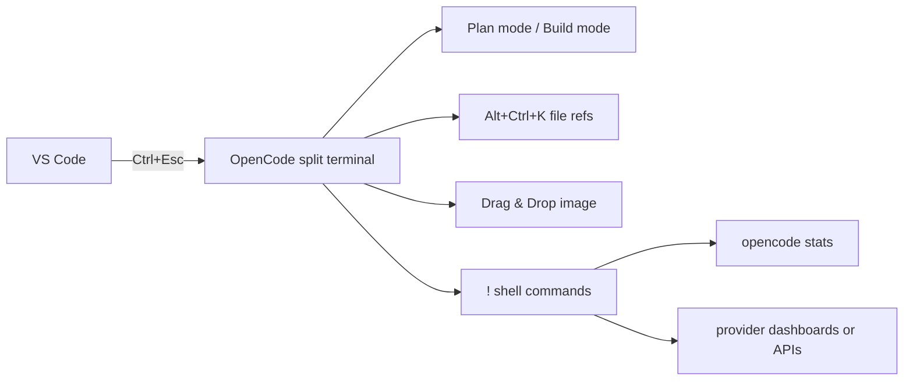

# 260318 OpenCode 사용법 리서치

> Win11 + pwsh + VSCode + Claude API + OpenAI ChatGPT Plus/Pro(질문의 "Codex Pro" 맥락 포함) 기준으로 정리한 실전 가이드입니다. ✨

## 한눈에 보기 👀

- OpenCode는 터미널, 데스크톱 앱, IDE 확장에서 쓸 수 있는 오픈소스 AI 코딩 에이전트입니다.
- 강점은 `오픈소스`, `모델/제공자 중립성`, `TUI 중심 UX`, `LSP 지원`, `VSCode 연동`, `커스텀 명령/스킬`입니다.
- Win11에서는 **직접 pwsh로도 가능**하지만, 공식 문서는 **WSL 사용을 가장 권장**합니다. 🪟
- `Home/End`가 안 먹을 때는 `ctrl+a` / `ctrl+e`가 공식 대체제입니다.
- `Shift+Enter` 개행은 **지원**하지만, Windows Terminal에서 escape sequence를 직접 매핑해야 할 수 있습니다.
- `opencode stats`는 **OpenCode 세션 기준 토큰/비용 통계**만 보여 줍니다. OpenAI 구독 잔량이나 Anthropic 청구액을 그대로 보여 주는 명령은 아닙니다.
- VSCode와 병행할 때는 `@filepath`를 일일이 치기보다 **OpenCode 확장의 컨텍스트 공유**와 `Alt+Ctrl+K` 파일 참조 단축키가 더 편합니다.
- 이미지 **첨부/분석**은 공식 지원이 분명하지만, 이미지 **생성**은 현재 공식 문서 기준으로는 지원이 명확하지 않고 이슈상으로도 아직 불안정합니다. 🖼️



---

## 1. OpenCode란? 🧠

OpenCode는 코드베이스를 읽고, 계획을 세우고, 파일을 수정하고, 명령을 실행할 수 있는 **오픈소스 AI 코딩 에이전트**입니다. 공식 소개 기준으로는 다음 성격이 핵심입니다.

- 터미널 기반 TUI가 중심
- 데스크톱 앱과 IDE 확장도 제공
- Claude, GPT, Gemini, 로컬 모델 등 여러 제공자 연결 가능
- 프로젝트 문맥을 읽고 LSP를 활용
- 세션 공유, 다중 세션, 커스텀 명령, 스킬 확장 가능

공식 사이트는 OpenCode를 "The open source AI coding agent"로 소개하고, GitHub README는 Claude Code와 유사한 계열이지만 더 개방적이고 TUI 중심적이라고 설명합니다. 🚀

---

## 2. 핵심 특징 🔧

### 2-1. 모델/제공자 중립성

- 공식 문서 기준 **75+ LLM provider** 지원
- OpenAI, Anthropic, GitHub Copilot, OpenRouter, local model 등 연결 가능
- OpenAI는 `ChatGPT Plus/Pro` 로그인 흐름을 지원
- Anthropic은 `Claude Pro/Max` 로그인 흐름이 문서에 있으나, **Anthropic 공식 지원은 아님**이라고 명시됨

### 2-2. TUI 중심 설계

- 기본 실행은 `opencode`
- `Tab`으로 `build` / `plan` 에이전트 전환
- `@`로 파일 참조
- `!`로 셸 명령 실행
- `/`로 slash command 실행

### 2-3. VSCode/IDE 연동

- VSCode integrated terminal에서 `opencode` 실행 시 확장 설치 가능
- `Ctrl+Esc`로 OpenCode split terminal 열기/포커스
- 현재 탭/선택 영역을 자동으로 컨텍스트에 공유
- `Alt+Ctrl+K`로 파일 참조 삽입 가능

### 2-4. 커스터마이즈

- `opencode.json` / `tui.json`로 모델, 권한, 명령, 키바인드 설정
- `.opencode/commands/`로 slash command 추가
- `.opencode/skills/`, `.claude/skills/`, `.agents/skills/` 계열에서 skill 탐색

### 2-5. 프라이버시/운영

- 공식 홈페이지는 "코드나 컨텍스트 데이터를 저장하지 않는다"고 강조
- 다만 사용자가 `/share`를 하면 세션 공유 가능

---

## 3. 장점과 단점 ⚖️

### 장점 ✅

1. **오픈소스**라서 동작과 생태계를 추적하기 쉽습니다.
2. **특정 모델 벤더에 묶이지 않습니다.**
3. **TUI UX가 강합니다.** 단축키, 세션, plan/build 전환이 빠릅니다.
4. **VSCode와 병행 사용성이 좋습니다.**
5. **커맨드/스킬/에이전트 확장성이 좋습니다.**
6. `opencode stats` 같은 운영용 CLI가 있어 세션 수준 비용 추적이 가능합니다.

### 단점 ❌

1. Windows 순정 pwsh/터미널에서는 키 입력 이슈가 생길 수 있습니다.
2. 공식 문서가 빠르게 바뀌는 기능 변화를 항상 즉시 따라오지는 않습니다.
3. **provider 계정의 실제 청구/구독 잔량**까지 OpenCode가 일관되게 보여 주지는 않습니다.
4. skill UX는 강력하지만, **slash autocomplete 경험은 command와 동일하지 않을 수 있습니다.**
5. 이미지 생성처럼 주변 기능은 아직 문서화/안정성이 덜 성숙해 보입니다.

---

## 4. 빠른 시작 가이드 🚦

### 4-1. 설치

Windows 공식 설치 경로 예시:

```bash
scoop install opencode
# 또는
choco install opencode
# 또는
npm install -g opencode-ai
```

가장 권장되는 흐름은 다음입니다.

1. 프로젝트 폴더로 이동
2. `opencode` 실행
3. `/connect`로 provider 연결
4. `/init`으로 `AGENTS.md` 생성
5. `/models`로 모델 선택

```bash
opencode
```

### 4-2. Windows에서는 WSL 권장 🐧

공식 Windows 문서는 직접 Windows에서도 실행 가능하다고 하면서도, **최상의 경험은 WSL**이라고 분명히 말합니다.

이유:

- 더 나은 파일 시스템 성능
- 더 완전한 터미널 지원
- 개발 도구 호환성

즉, 지금처럼 `pwsh`에서 약간씩 키 입력이 어긋난다면, OpenCode 쪽 공식 권장 답은 사실상 **WSL로 옮기기**입니다.

---

## 5. 자주 쓰는 단축키 ⌨️

### 5-1. 핵심 TUI 단축키

| 기능 | 기본 키 |
| --- | --- |
| 에이전트 전환(build/plan) | `Tab` |
| 새 세션 | `ctrl+x n` |
| 세션 목록 | `ctrl+x l` |
| 현재 세션 공유 | `ctrl+x s` |
| 실행 취소 | `ctrl+x u` |
| 다시 실행 | `ctrl+x r` |
| 에디터 열기 | `ctrl+x e` |
| 모델 목록 | `ctrl+x m` |
| 테마 목록 | `ctrl+x t` |
| 도움말 | `ctrl+x h` |
| 종료 | `ctrl+x q` |

### 5-2. 입력 편집 키

| 기능 | 기본 키 |
| --- | --- |
| 개행 | `shift+return`, `ctrl+return`, `alt+return`, `ctrl+j` |
| 현재 줄 처음 | `ctrl+a` |
| 현재 줄 끝 | `ctrl+e` |
| 한 단어 앞으로 | `alt+f`, `alt+right`, `ctrl+right` |
| 한 단어 뒤로 | `alt+b`, `alt+left`, `ctrl+left` |
| 버퍼 처음 | `home` |
| 버퍼 끝 | `end` |

### 5-3. VSCode 확장 단축키

| 기능 | Windows/Linux |
| --- | --- |
| OpenCode split terminal 열기/포커스 | `Ctrl+Esc` |
| 새 OpenCode 세션 | `Ctrl+Shift+Esc` |
| 파일 참조 삽입 | `Alt+Ctrl+K` |

---

## 6. 자주 쓰는 명령어 모음 🗂️

### 6-1. TUI slash commands

| 명령 | 용도 |
| --- | --- |
| `/connect` | provider 연결 |
| `/init` | `AGENTS.md` 생성/업데이트 |
| `/models` | 모델 선택 |
| `/new` | 새 세션 |
| `/sessions` | 세션 목록/전환 |
| `/undo` | 마지막 작업 되돌리기 |
| `/redo` | 되돌린 작업 복구 |
| `/share` | 세션 공유 |
| `/editor` | 외부 에디터에서 프롬프트 작성 |
| `/export` | 세션을 Markdown으로 내보내기 |
| `/thinking` | reasoning block 표시 토글 |
| `/help` | 도움말 |

### 6-2. CLI 명령

| 명령 | 용도 |
| --- | --- |
| `opencode` | TUI 시작 |
| `opencode run "..."` | 비대화형 실행 |
| `opencode stats` | 세션 토큰/비용 통계 |
| `opencode models` | 사용 가능한 모델 목록 |
| `opencode auth list` | 연결된 provider 인증 목록 |
| `opencode session list` | 세션 목록 |
| `opencode web` | 웹 UI 서버 실행 |
| `opencode serve` | headless 서버 실행 |

### 6-3. TUI 안에서 셸 실행

메시지를 `!`로 시작하면 셸 명령을 실행할 수 있습니다.

```text
!opencode stats --days 7 --models 10
```

이 기능 덕분에 "세션 내부에서 외부 정보를 가져오기" 자체는 가능합니다. 다만 **무엇을 가져올 수 있느냐는 provider가 공개 API/CLI를 제공하느냐**에 달려 있습니다.

---

## 7. 질문별 상세 답변 💬

## 7-1. Win11 + pwsh에서 `Home/End`가 안 먹습니다. 대체제가 있나요?

### 결론

네. 공식 대체제는 **`ctrl+a` = 줄 처음**, **`ctrl+e` = 줄 끝**입니다. 👍

공식 keybind 문서는 다음 입력 이동 키를 명시합니다.

- `input_line_home`: `ctrl+a`
- `input_line_end`: `ctrl+e`
- `input_visual_line_home`: `alt+a`
- `input_visual_line_end`: `alt+e`
- `input_buffer_home`: `home`
- `input_buffer_end`: `end`

즉, `Home/End`가 터미널에서 제대로 전달되지 않으면 아래 식으로 적응하는 것이 가장 현실적입니다.

```text
줄 처음  -> ctrl+a
줄 끝    -> ctrl+e
단어 이동 -> ctrl+left / ctrl+right
```

### 실무 팁

1. **가장 좋은 해결책**: WSL로 옮기기
2. **그대로 pwsh 유지**: `ctrl+a`, `ctrl+e`에 익숙해지기
3. **커스텀 키바인드**: `tui.json`에서 잘 먹는 조합으로 재매핑하기

예시:

```json
{
  "$schema": "https://opencode.ai/tui.json",
  "keybinds": {
    "input_line_home": "ctrl+a,alt+h",
    "input_line_end": "ctrl+e,alt+l"
  }
}
```

---

## 7-2. `ctrl+enter` 개행이 불편합니다. `shift+enter` 개행 가능할까요?

### 결론

**가능합니다.** 🎉

공식 keybind 기본값에 이미 아래가 들어 있습니다.

```text
input_newline = shift+return, ctrl+return, alt+return, ctrl+j
```

다만 문제는 **Windows Terminal이 modifier가 붙은 Enter를 기본적으로 제대로 보내지 않는 경우가 있다**는 점입니다. 그래서 공식 문서는 Windows Terminal에 직접 매핑을 넣으라고 안내합니다.

### Windows Terminal 설정 예시

경로:

```text
%LOCALAPPDATA%\Packages\Microsoft.WindowsTerminal_8wekyb3d8bbwe\LocalState\settings.json
```

추가할 내용:

```json
"actions": [
  {
    "command": {
      "action": "sendInput",
      "input": "\u001b[13;2u"
    },
    "id": "User.sendInput.ShiftEnterCustom"
  }
],
"keybindings": [
  {
    "keys": "shift+enter",
    "id": "User.sendInput.ShiftEnterCustom"
  }
]
```

### 추천

- `ctrl+enter`보다 `shift+enter`가 손에 맞으면 위 설정을 적극 추천합니다.
- 혹시 그래도 불안정하면 `ctrl+j`도 공식 newline 대체제라서 꽤 쓸 만합니다.

---

## 7-3. 저는 OpenAI ChatGPT Plus/Pro("Codex Pro" 맥락) + Claude API를 씁니다. 토큰 잔량/청구금액을 세션 내부 명령으로 볼 수 있나요?

### 먼저 큰 구분이 필요합니다 🧭

OpenCode에는 **두 층의 통계**가 있습니다.

1. **OpenCode 세션 통계**
2. **provider 계정 자체의 청구/구독/잔량 정보**

이 둘은 다릅니다.

### OpenCode가 기본 제공하는 것

`opencode stats`는 공식적으로 **"OpenCode sessions의 token usage and cost statistics"**를 보여 줍니다.

예시:

```bash
opencode stats
opencode stats --days 7 --models 10
opencode stats --project ""
```

이 명령은 유용합니다. 하지만 이것은 **OpenCode가 기록한 세션 기준 비용/사용량**이지,

- ChatGPT Plus/Pro 구독 잔량
- Codex agent preview 사용 한도
- Anthropic API 청구 대시보드 누적액

을 그대로 읽어오는 전용 명령은 아닙니다.

### OpenAI 쪽: 가능한 것과 불가능한 것

#### 가능한 것

- OpenAI **API** 사용량/비용은 OpenAI Platform Usage Dashboard에서 확인 가능
- 조직 소유자라면 Usage/Cost 관련 공식 API/대시보드가 있음

#### 불가능/비문서화에 가까운 것

- **ChatGPT Plus/Pro 구독의 "남은 토큰 잔량"을 OpenCode 명령으로 보는 공식 기능은 없음**
- OpenAI 공식 도움말도 ChatGPT 구독과 API billing을 **서로 다른 플랫폼**으로 분리해서 설명함

즉,

- ChatGPT Plus/Pro 로그인으로 OpenCode를 쓰는 경우: **남은 구독량을 OpenCode가 직접 보여 주는 내장 명령은 현재 확인되지 않음**
- OpenAI API key를 쓰는 경우: **Platform dashboard/API로 확인**

### Anthropic 쪽: 가능한 것과 조건

Anthropic은 공식적으로 **Usage & Cost Admin API**를 제공합니다. 다만 조건이 있습니다.

- **개인 계정에는 Admin API 불가**
- **조직 admin + Admin API key(`sk-ant-admin...`) 필요**

즉,

- 개인 API key만 있다면: 콘솔에서 수동 확인 중심
- 조직 Admin API key가 있다면: OpenCode 세션 안에서 `!curl`로 조회 가능

예시:

```text
!curl "https://api.anthropic.com/v1/organizations/cost_report?starting_at=2026-03-01T00:00:00Z&ending_at=2026-03-18T00:00:00Z&group_by[]=workspace_id&group_by[]=description" --header "anthropic-version: 2023-06-01" --header "x-api-key: $ADMIN_API_KEY"
```

### 그래서 질문에 대한 실전 답은?

#### 1) 세션 내부에서 가능한가?

- **OpenCode 자체 명령으로는 부분적**입니다.
- `opencode stats`는 가능 ✅
- provider billing/quota는 built-in이 아니라 외부 대시보드/API 호출 방식입니다.

#### 2) OpenCode 세션 안에서 간접적으로 가능한가?

- **예, `!` 셸 명령을 통해서는 가능**합니다.
- 단, provider가 공식 API를 제공해야 합니다.

#### 3) 추천 운영 방식

- OpenCode 자체 사용 추적: `opencode stats`
- OpenAI API 비용: OpenAI Platform Usage/Billing Dashboard
- Anthropic API 비용: Claude Console Usage/Cost 또는 Admin API
- ChatGPT Plus/Pro 구독 잔량: OpenCode 내장 명령 기대보다는 **웹 대시보드/계정 UI 확인**이 현실적

---

## 7-4. `/hhd-` + `Tab`으로 내 스킬 자동완성이 안 됩니다. 해결책이 있나요?

### 짧은 답

이건 **설정 실수일 수도 있지만, 현재 OpenCode UX 특성일 가능성이 더 큽니다.** 🧩

### 이유

공식 docs에서 skill은 본질적으로 **agent가 `skill` 도구로 로드하는 재사용 지침**으로 설명됩니다. 반면 slash autocomplete는 공식 문서상 **custom command**가 더 명확하게 문서화되어 있습니다.

추가로 GitHub PR 흐름을 보면:

- 한때 skill을 slash-invokable 하게 붙였고
- 이후에는 **개별 skill을 `/` autocomplete에서 숨기고 `/skills` dialog로 옮기는 변경**이 있었습니다.

즉, 지금 증상은 "내 skill이 고장났다"라기보다,

- **skill은 command와 UX가 다르다**
- `/hhd-...` 자동완성이 항상 보장되는 구조가 아니다

로 이해하는 게 더 정확합니다.

### 실전 해결책

#### 해결책 A. skill은 skill답게 쓰기

- 자연어로 "이 작업에는 `/hhd-md`나 `/hhd-research` 스킬을 써서 진행해 줘"라고 요청
- agent가 `skill` tool로 로드하게 맡기기

#### 해결책 B. slash autocomplete가 필요하면 command로 빼기 ⭐

반복 호출하고 싶은 것은 `.opencode/commands/*.md`에 커스텀 command로 만드는 편이 낫습니다.

예:

```text
/.opencode/commands/research.md
/.opencode/commands/review.md
/.opencode/commands/summary.md
```

이쪽은 slash command UX가 공식 문서상 더 안정적입니다.

#### 해결책 C. skill 구조 자체 점검

공식 docs 체크리스트:

- `SKILL.md` 대문자 여부
- frontmatter에 `name`, `description` 존재 여부
- 디렉터리명과 `name` 일치 여부
- permissions에서 `deny`되지 않았는지 확인

---

## 7-5. VSCode로 코딩하고 OpenCode를 병행할 예정입니다. `@filepath`보다 편한 방법이 있나요?

### 결론

**네, 공식 IDE 확장 기능이 더 편합니다.** 💡

### 가장 유용한 기능 3개

1. `Ctrl+Esc`
   - OpenCode split terminal 열기/포커스

2. **Context Awareness**
   - 현재 selection/tab을 자동으로 OpenCode에 공유

3. `Alt+Ctrl+K`
   - `@File#L37-42` 같은 파일 참조를 자동 삽입

즉, VSCode 병행 사용에서는 다음 루틴이 가장 편합니다.

```text
코드 선택 -> Ctrl+Esc -> Alt+Ctrl+K -> 바로 지시
```

수동으로 긴 `@packages/.../file.ts`를 치는 것보다 훨씬 낫습니다.

---

## 7-6. 이미지 첨부를 편하게 하는 방법은?

### 공식적으로 가장 쉬운 방법

**터미널에 이미지를 drag & drop** 하는 것입니다. 🖼️

OpenCode intro 문서가 이 흐름을 직접 안내합니다.

### 보조 방법

CLI 비대화형 실행에서는 `opencode run --file`도 가능합니다.

예:

```bash
opencode run --file ./design.png "이 디자인을 참고해서 화면을 만들어줘"
```

### 추천

- TUI 작업 중이면: **드래그 앤 드롭**
- 자동화/스크립트면: `--file`

---

## 7-7. OpenCode에서 이미지 생성도 가능한가요?

### 결론

**공식 문서 기준으로는 "이미지 입력/분석"은 명확하지만, "이미지 생성"은 명확하게 지원한다고 보기 어렵습니다.** ⚠️

왜 이렇게 말하느냐면:

1. 공식 docs는 이미지를 **참고자료로 첨부**하는 흐름은 설명합니다.
2. 하지만 이미지 **생성 워크플로우**는 공식 docs에서 뚜렷하게 문서화되어 있지 않습니다.
3. GitHub 이슈에는 model-generated image/file handling이 불완전해 보이는 흔적이 있습니다.

따라서 현재 가장 안전한 판단은 아래와 같습니다.

- **이미지 입력/분석**: 지원 ✅
- **이미지 생성**: 비공식/불안정/문서화 미흡 ❓

실무적으로는 이미지 생성이 필요하면:

1. OpenCode 안에서 직접 기대하기보다
2. 별도 이미지 생성 툴 또는 provider 전용 워크플로우를 쓰고
3. 생성된 이미지를 다시 OpenCode에 넣어 참고시키는 방식

이 더 안정적입니다.

---

## 8. 제 환경 기준 추천 세팅 🛠️

질문 내용을 종합하면 아래 구성이 가장 실용적입니다.

### 추천 스택

1. **VSCode + OpenCode extension + integrated terminal**
2. 가능하면 **WSL**
3. 모델은
   - OpenAI 쪽은 `ChatGPT Plus/Pro` 로그인 경로 또는 API key
   - Claude 쪽은 **API key** 위주
4. 반복 작업은 **skills보다 commands로 전면 배치**
5. 비용 체크는
   - `opencode stats`
   - OpenAI dashboard
   - Anthropic console/Admin API

### 이유

- VSCode 확장이 `@filepath` 불편을 크게 줄여 줌
- WSL이 Windows 키보드/터미널 변수를 줄여 줌
- skill autocomplete 이슈는 command로 우회하는 것이 UX상 더 명확함
- billing은 OpenCode가 아니라 provider 원장 기준으로 봐야 정확함

---

## 9. 사실 검증 메모 🔍

이번 정리는 **공식 문서 우선**으로 정리했고, 공식 문서가 분명하지 않은 부분만 GitHub 이슈/PR을 보조 근거로 사용했습니다.

### 비교 결과

- `Home/End`, `Shift+Enter`, `WSL 권장`, `VSCode 단축키`, `opencode stats`, `skill 구조`, `custom command`는 **공식 docs로 직접 확인 가능**
- `/hhd- skill autocomplete`, `image generation`은 **공식 docs만으로는 불충분**해서 GitHub PR/issue를 보조 근거로 사용
- OpenAI/Anthropic billing은 **provider 공식 문서와 dashboard/API 문서**로 교차 확인

---

## 10. 출처 링크 🌐

### OpenCode 공식

- Intro: https://opencode.ai/docs/
- TUI: https://opencode.ai/docs/tui
- CLI: https://opencode.ai/docs/cli
- Keybinds: https://opencode.ai/docs/keybinds
- Commands: https://opencode.ai/docs/commands
- Skills: https://opencode.ai/docs/skills
- IDE: https://opencode.ai/docs/ide
- Windows WSL: https://opencode.ai/docs/windows-wsl
- Config: https://opencode.ai/docs/config
- Models: https://opencode.ai/docs/models
- Providers: https://opencode.ai/docs/providers
- Troubleshooting: https://opencode.ai/docs/troubleshooting
- OpenCode homepage: https://opencode.ai
- GitHub README: https://github.com/anomalyco/opencode

### OpenAI 공식

- Billing settings in ChatGPT vs Platform: https://help.openai.com/en/articles/9039756-billing-settings-in-chatgpt-vs-platform
- API Usage Dashboard: https://help.openai.com/en/articles/10478918-api-usage-dashboard
- ChatGPT Plus: https://help.openai.com/en/articles/6950777-what-is-chatgpt-plus
- ChatGPT Pro: https://help.openai.com/en/articles/9793128-what-is-chatgpt-pro
- API billing overview: https://platform.openai.com/account/billing/overview
- Credit grants: https://platform.openai.com/settings/organization/billing/credit-grants

### Anthropic 공식

- Usage & Cost API: https://docs.anthropic.com/en/api/usage-cost-api
- Admin API overview: https://docs.anthropic.com/en/docs/build-with-claude/administration-api
- Usage report API reference: https://docs.anthropic.com/en/api/admin-api/usage-cost/get-messages-usage-report
- Cost report API reference: https://docs.anthropic.com/en/api/admin-api/usage-cost/get-cost-report

### OpenCode GitHub 보조 근거

- Skills slash invokable 관련 PR: https://github.com/anomalyco/opencode/pull/11390
- Skills를 `/` autocomplete에서 숨기고 `/skills`로 이동한 PR: https://github.com/anomalyco/opencode/pull/11547
- Skill autocomplete 관련 후속 PR: https://github.com/anomalyco/opencode/pull/14518
- Inline skill autocomplete 시도 PR(종료): https://github.com/anomalyco/opencode/pull/17844
- 이미지 생성/파일 처리 관련 이슈 1: https://github.com/anomalyco/opencode/issues/12859
- 이미지 생성/도구 관련 이슈 2: https://github.com/anomalyco/opencode/issues/4951
- 이미지 생성 문의 이슈: https://github.com/anomalyco/opencode/issues/7646

---

## 11. 짧은 결론 ✍️

당신의 사용 시나리오에서는 OpenCode가 꽤 잘 맞습니다. 특히 **VSCode 병행**, **Claude API 연결**, **OpenAI ChatGPT Plus/Pro 로그인**, **커스텀 워크플로우 구성** 측면에서 강합니다.

다만 Win11 + pwsh에서는 입력 UX가 조금 삐걱일 수 있으므로,

- `ctrl+a/e` 적응
- `shift+enter` 수동 매핑
- 가능하면 WSL 전환

이 세 가지가 체감 품질을 크게 올려 줄 가능성이 높습니다. 🚀

그리고 비용/잔량은 꼭 구분해서 보셔야 합니다.

- **OpenCode 내부 운영 통계**: `opencode stats`
- **provider 실제 청구/구독 상태**: OpenAI/Anthropic 공식 대시보드 또는 Admin API

---

## 사용자 질문 프롬프트

```text
주제 : open code 사용법

소개
특징
장단점
단축키
명령어

win11 에서 pwsh로 사용할때 home/end 키 입력이 안되는데, 대체제는 없는가?
  ctrl arrow 조합으로 단어이동은 가능한데 불편함

ctrl + enter 로 개행이 또 불편함
  shift + enter 로 개행 할 수 있는가?

저는 codex pro 구독중, claude api 연결 중입니다.
  종종 codex 토큰 잔량, claude api 현재까지 청구금액을 확인하고 싶음.
  이 작업들을 세션내부에서 명령어로 진행할 수 있는가?

/hhd- + tab 키 입력에 내 스킬이 자동완성이 안되는데 해결책?

vscode 로 코딩을 하고 opencode 를 병행해서 사용할 예정
  @filepath 보다 편리한 방법은?

이미지 첨부를 하기에 편리한 방법은?

opencode 에서 이미지생성을 할 수 있는가?
```
