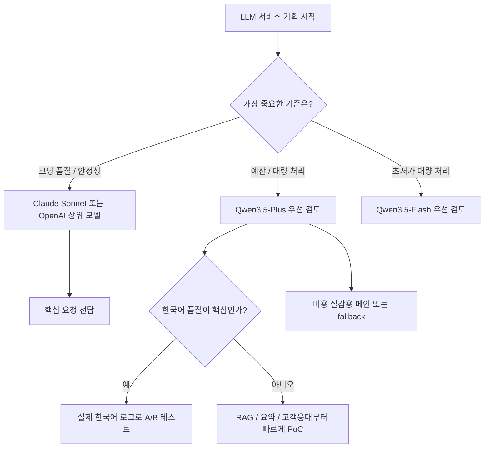
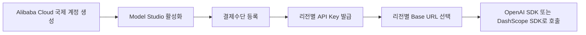
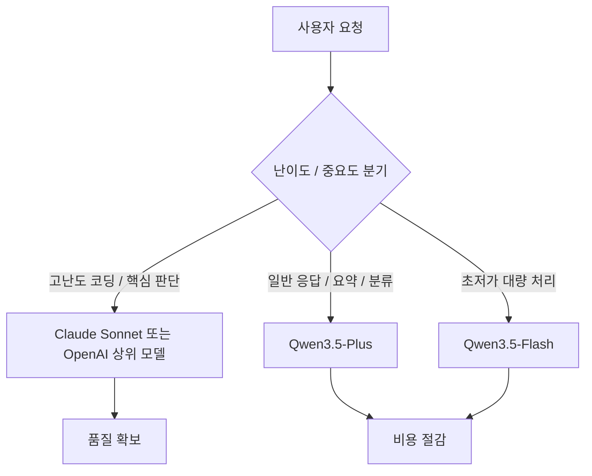

# 260319 Qwen API 서비스 도입 리서치

> Qwen API로 LLM 서비스를 만들 때 정말 실무에 쓸 만한지, 결제/시작 방법은 어떤지, 그리고 고급 모델로 올렸을 때 Claude Sonnet과 비교해 어떤 포지션인지 정리한 블로그형 리서치 노트입니다.

---

## 한눈에 결론

- ✅ **[사실] Qwen API는 충분히 검토할 만하다.** `OpenAI-compatible API`, `1M context`, `Singapore / US / Hong Kong / Beijing` 리전, `신규 무료 quota`, `Claude Code / Cline / Dify` 연동 문서까지 갖추고 있어 시작 장벽이 낮다.
- 💰 **[사실] 결제는 월구독 무제한이 아니라 종량제(pay-as-you-go)** 이다. 다만 Alibaba Cloud 차원의 `Savings Plan` 같은 커밋형 할인 옵션은 있다.
- ⚖️ **[판단] 절대 품질은 아직 Sonnet이 더 안전하다.** Artificial Analysis 기준 `Claude Sonnet 4.6 = 52`, `Qwen3 Max = 31`이다.
- 🚀 **[판단] 하지만 가격 대비 성능은 Qwen이 매우 공격적이다.** 특히 `qwen3.5-plus`는 공식 문서상 `qwen3-max급 text 성능, 더 빠르고 더 저렴`한 포지션이다.
- 🧠 **[의견] “Opus는 아니더라도 Sonnet보다 나을까?”에 대한 답은 “상황 한정으로는 가능하지만, 일반론으로는 아직 아니다”** 쪽이 더 정확하다.

---

## 먼저 보는 의사결정 그림



---

## 1. Qwen API, 정말 사용할 만한가?

결론부터 말하면 **예산에 민감한 서비스라면 충분히 사용할 만하다**. 이유는 단순히 “중국 모델이라 싸다” 수준이 아니라, 실제 운영에 필요한 기본 조건이 제법 잘 갖춰져 있기 때문이다.

### 왜 검토할 가치가 있나

1. **도입이 쉽다**
   - OpenAI SDK 호환 방식으로 바로 붙일 수 있다.
   - Base URL과 API Key만 맞추면 기존 OpenAI 클라이언트 코드를 크게 바꾸지 않아도 된다.

2. **리전 선택지가 있다**
   - `International (Singapore)`
   - `Global (US Virginia)`
   - `Chinese Mainland (Beijing)`
   - `Hong Kong`
   - 즉, “중국 전용이라 해외 서비스에는 부적합하다”는 식으로 단정할 단계는 아니다.

3. **가격이 매우 공격적이다**
   - 특히 `qwen3.5-plus`와 `qwen3.5-flash`는 “품질을 너무 많이 버리지 않으면서 비용을 크게 낮추는” 실무형 포지션이다.

4. **문서와 콘솔 흐름이 생각보다 괜찮다**
   - 첫 API 호출 가이드, API Key 발급, 리전별 Base URL, 무료 quota, 결제수단, 도구 연동 문서가 모두 공식 문서로 제공된다.

### 다만 어디서 약한가

- **최상급 코딩 안정성**
- **복잡한 instruction-following의 일관성**
- **장시간 에이전트형 작업의 안정적 연속성**

이 영역은 아직 **Claude Sonnet / OpenAI 상위 모델이 더 안전한 선택**으로 보인다.

---

## 2. Qwen API는 월구독인가, 종량제인가?

### 짧은 답

- **[사실] API는 종량제(pay-as-you-go)** 이다.
- **[사실] 월정액 무제한 API 모델은 아니다.**
- **[사실] Savings Plan은 존재하지만, 이것도 “약정형 할인”이지 무제한 구독이 아니다.**

### 해석

이 점은 `Claude API`, `OpenAI API`, `Gemini API`, `xAI API`도 거의 동일하다. 즉:

- `Claude Pro / Max`
- `ChatGPT Plus / Pro`
- `Gemini Advanced`

같은 **소비자용 앱 구독**과,

- `Anthropic API`
- `OpenAI API`
- `Gemini API`
- `xAI API`
- `Qwen API`

같은 **개발자용 API 과금**은 별개로 봐야 한다.

---

## 3. 시작 방법: 사이트, 계정, 카드, 지역 이슈

### 시작 절차



### 실제 시작 순서

#### 1) 사이트

- 계정 생성: `https://account.alibabacloud.com/register/intl_register.htm`
- Model Studio 콘솔: `https://modelstudio.console.alibabacloud.com/`

#### 2) 계정

- Alibaba Cloud 국제 계정을 만든 뒤 Model Studio에서 약관을 동의하면 활성화된다.

#### 3) 신용카드 등록

- Billing Account 페이지: `https://billing-cost-intl.aliyun.com/fortune/billing-account`
- 카드 또는 PayPal을 등록할 수 있다.
- 공식 지원 카드: `Visa`, `Mastercard`, `AMEX`, `JCB`
- 일부 지역은 `PayPal`도 지원한다.

#### 4) API Key 발급

- Singapore: `https://modelstudio.console.alibabacloud.com/?tab=playground#/api-key`
- US Virginia: `https://modelstudio.console.alibabacloud.com/us-east-1?tab=globalset#/efm/api_key`
- Beijing: `https://bailian.console.alibabacloud.com/?tab=model#/api-key`
- Hong Kong: `https://modelstudio.console.alibabacloud.com/cn-hongkong?tab=globalset#/efm/api_key`

#### 5) Base URL 선택

- Singapore: `https://dashscope-intl.aliyuncs.com/compatible-mode/v1`
- US Virginia: `https://dashscope-us.aliyuncs.com/compatible-mode/v1`
- Beijing: `https://dashscope.aliyuncs.com/compatible-mode/v1`
- Hong Kong: `https://cn-hongkong.dashscope.aliyuncs.com/compatible-mode/v1`

### 중국이라 안 되는 건 아닌가?

- **[사실] 한국 같은 해외 사용자도 국제 사이트로 가입 가능** 하다.
- **[사실] 한국은 Alibaba Cloud 국제 사이트에서 `Other countries/regions`로 분류되며 카드 결제가 지원된다.**
- **[사실] 다만 중국 본토 카드/PayPal, Alipay, WeChat Pay는 국제 사이트에서 지원하지 않는다.**

### 결제에서 자주 걸릴 수 있는 이슈

- 카드 등록 시 `USD 1.00` 사전승인이 걸릴 수 있다.
- `3D Secure (3DS)` 인증이 필요할 수 있다.
- 경우에 따라 `KYC`가 요구될 수 있다.
- `UnionPay-only 카드`, `중국 본토 PayPal`, `가상카드`, `선불카드`는 제한될 수 있다.

---

## 4. Qwen 모델별 가격: 1M tokens 기준

> 아래 가격은 **2026-03-19 기준 공식 문서 확인값**이며, Qwen은 **리전**과 **프롬프트 길이 구간**에 따라 단가가 달라진다.

### 핵심 텍스트 모델 가격 요약

| 모델 | 리전 | 입력 가격 | 출력 가격 | 비고 |
|---|---|---:|---:|---|
| `qwen3-max` | Singapore `International` | `$1.2 ~ $3.0` | `$6 ~ $15` | 입력 토큰 구간별 tier 과금 |
| `qwen3-max` | US `Global` | `$0.359 ~ $1.004` | `$1.434 ~ $4.014` | Singapore보다 저렴 |
| `qwen3.5-plus` | Singapore `International` | `$0.4 ~ $0.5` | `$2.4 ~ $3.0` | 1M context |
| `qwen3.5-plus` | US `Global` | `$0.115 ~ $0.573` | `$0.688 ~ $3.44` | 실무 가성비 핵심 |
| `qwen3.5-flash` | Singapore `International` | `$0.1` | `$0.4` | 단순 업무 대량 처리용 |
| `qwen3.5-flash` | US `Global` | `$0.029 ~ $0.172` | `$0.287 ~ $1.72` | 매우 저렴 |

### 이 표를 읽는 팁

- `Singapore International`은 **신규 무료 quota**가 있다.
- `US Global`은 보통 더 싸지만 데이터 저장 위치가 `US (Virginia)`다.
- `qwen3-max`는 강하지만, 긴 프롬프트로 갈수록 “엄청 싸다”는 느낌은 줄어든다.
- 반대로 `qwen3.5-plus`는 **품질-비용 균형이 좋다.**

---

## 5. 무료 quota와 리전 전략

### 신규 무료 quota

- **[사실] 무료 quota는 Singapore 리전에서만 제공된다.**
- **[사실] 현재 신규 1회 활성화 기준으로 보통 90일 유효** 하다.
- **[사실] 무료 quota는 실시간 inference 비용만 상쇄** 하며, batch / context cache / fine-tuning / deployment 비용은 제외된다.

### 추천 리전 선택법

| 상황 | 추천 리전 | 이유 |
|---|---|---|
| 빠른 PoC, 무료 체험 | `Singapore International` | 무료 quota, 한국과 비교적 가까운 리전 |
| 본격 운영, 비용 최적화 | `US Global` | 단가가 더 낮은 경우가 많음 |
| 중국 본토 서비스 | `Beijing` | 중국 본토 연산/데이터 요구 대응 |
| 홍콩 인접 운영 | `Hong Kong` | 지역 정책 고려용 |

---

## 6. 다른 회사들과 비교: 품질, 속도, 가격

> `ChatGPT`는 앱 이름이므로, API 비교에서는 `OpenAI` 모델 기준으로 보는 것이 정확합니다.

### 대표 API 모델 비교

| 회사 | 대표 모델 | 입력 가격 | 출력 가격 | 품질 지표 (AA Index) | 속도 (tok/s) | 해석 |
|---|---|---:|---:|---:|---:|---|
| OpenAI | `GPT-5.4` | `$2.50` | `$15.00` | `57` | `73.8` | 전체 상위권, 무난한 프리미엄 선택 |
| Anthropic | `Claude Sonnet 4.6` | `$3.00` | `$15.00` | `52` | `63.2` | 코딩/에이전트 품질이 강점 |
| Google | `Gemini 2.5 Pro` | `$1.25` | `$10.00` | `35` | `128.8` | 빠르고 비교적 저렴, 단 200K 초과 시 단가 상승 |
| xAI | `Grok 4.20` | `$2.00` | `$6.00` | `48` | `221.4` | 매우 빠름 |
| Alibaba | `Qwen3 Max` | `$1.20` | `$6.00` | `31` | `32.1` | 가격 경쟁력은 강하나 절대 품질은 top tier 아래 |

### 여기서 중요한 해석

1. **품질만 보면**
   - `GPT-5.4`, `Sonnet 4.6`이 더 안전한 선택이다.

2. **속도만 보면**
   - `Grok`, `Gemini`가 강하게 보인다.

3. **가격만 보면**
   - `Qwen`은 매우 매력적이다.

4. **서비스 운영 관점에서 보면**
   - 핵심 트래픽 전부를 최고가 모델에 태우는 대신,
   - `상위 모델 1개 + 저가 모델 1개` 조합이 가장 현실적이다.

---

## 7. 그럼 Qwen 고급 모델로 올리면 Sonnet보다 나을까?

이 질문이 사실 가장 중요하다.

### 먼저 분리해서 봐야 한다

- **절대 성능**
- **가격 대비 성능**
- **내 서비스 데이터에서의 체감 품질**

이 셋은 다르다.

### 절대 성능 관점

- **[사실] 독립 비교 기준으로는 Sonnet 우위**다.
- `Claude Sonnet 4.6 = 52`
- `Qwen3 Max = 31`

즉, 지금 자료만 놓고 보면 **Qwen 고급 모델이 Sonnet을 전반적으로 이긴다**고 말하기는 어렵다.

### 가격 대비 성능 관점

하지만 이야기가 달라진다.

- `qwen3.5-plus Global` 최저가: 입력 `$0.115`, 출력 `$0.688`
- `Claude Sonnet 4.6`: 입력 `$3`, 출력 `$15`

즉, 단순 최저 단가 기준으로 보면 **Qwen이 Sonnet보다 훨씬 싸다.**

그래서 다음 같은 서비스에서는 Qwen이 더 좋은 선택이 될 수 있다.

- 문서 요약
- RAG 챗봇
- 고객응대 초안 생성
- 대량 분류 / 태깅
- 내부 업무 보조

### 코딩 관점

- **[판단] 코딩은 Sonnet 쪽이 아직 더 안전하다.**
- 특히 긴 맥락 유지, 복잡한 수정 반복, 에이전트형 작업은 Sonnet이 더 믿을 만하다.
- Qwen도 충분히 쓸 만할 수 있지만, “Sonnet보다 낫다”고 일반화하긴 아직 어렵다.

### 한국어 관점

- **[판단] Qwen도 한국어 실사용은 가능할 확률이 높다.**
- 다만 **미묘한 뉘앙스**, **긴 업무 문서**, **복잡한 지시 추종**은 Sonnet / GPT / Gemini 쪽이 더 안정적일 가능성이 있다.
- 이 부분은 반드시 **실제 한국어 프롬프트셋**으로 A/B 테스트를 해야 한다.

---

## 8. 실무 추천안

### 시나리오별 추천

| 상황 | 추천 |
|---|---|
| 예산 최우선 | `qwen3.5-plus` 메인 + `qwen3.5-flash` fallback |
| 코딩 품질 최우선 | `Claude Sonnet` 메인 + `Qwen` cost-down fallback |
| 속도와 가격 균형 | `Gemini 2.5 Flash` 또는 `Qwen3.5-plus` 병행 검토 |
| 아직 확신이 없음 | 실제 로그 기반 A/B 테스트 먼저 수행 |

### 가장 현실적인 운영 구조



### 최종 판단

- **[의견] Qwen API는 “싸서 한번 써보는 모델”이 아니라, 비용 민감한 서비스에선 꽤 진지하게 고려할 수 있는 선택지**다.
- **[의견] 다만 핵심 코딩 품질과 안정성을 최우선으로 둔다면 아직 Sonnet이 더 안전한 기준선**이다.
- **[실무 추천] 처음부터 올인하지 말고, `Qwen3.5-plus`로 PoC를 만든 뒤 Sonnet과 한국어/코딩 A/B 테스트를 돌려 의사결정하는 것이 가장 합리적**이다.

---

## 9. 참고 링크 모음

### Qwen / Alibaba Cloud 공식

- Model Studio 제품 페이지: `https://www.alibabacloud.com/product/modelstudio`
- 첫 API 호출 가이드: `https://www.alibabacloud.com/help/en/model-studio/first-api-call-to-qwen`
- 리전 / 배포 모드: `https://www.alibabacloud.com/help/en/model-studio/regions`
- API Key 발급: `https://www.alibabacloud.com/help/en/model-studio/get-api-key`
- 모델 목록: `https://www.alibabacloud.com/help/en/model-studio/models`
- 모델 가격: `https://www.alibabacloud.com/help/en/model-studio/model-pricing`
- 신규 무료 quota: `https://www.alibabacloud.com/help/en/model-studio/new-free-quota`

### Alibaba Cloud 결제 / 과금 공식

- 결제수단 안내: `https://www.alibabacloud.com/help/en/user-center/instruction-of-payment-management/`
- 결제 FAQ: `https://www.alibabacloud.com/help/en/user-center/support/payment-faq`
- Alibaba Cloud 과금 방식: `https://www.alibabacloud.com/help/en/user-center/product-overview/quickly-understand-the-billing-modes-of-alibaba-cloud-products`

### 타사 공식 가격 문서

- Anthropic API 가격: `https://claude.com/pricing#api`
- OpenAI API 가격: `https://openai.com/api/pricing/`
- Google Gemini API 가격: `https://ai.google.dev/gemini-api/docs/pricing`
- Google Gemini API billing 안내: `https://ai.google.dev/gemini-api/docs/billing`
- xAI 모델/가격: `https://docs.x.ai/docs/models`

### 독립 비교 자료

- Claude Sonnet 4.6 Adaptive: `https://artificialanalysis.ai/models/claude-sonnet-4-6-adaptive`
- Qwen3 Max: `https://artificialanalysis.ai/models/qwen3-max`
- Gemini 2.5 Pro: `https://artificialanalysis.ai/models/gemini-2-5-pro`
- Grok 4.20: `https://artificialanalysis.ai/models/grok-4-20`
- GPT-5.4: `https://artificialanalysis.ai/models/gpt-5-4`

---

## 10. 사실 검증 메모

- Qwen API 결제 방식은 **종량제**로 재확인했다.
- 국제 사이트에서 한국 등 해외 계정의 **카드 결제 지원**을 재확인했다.
- `qwen3.5-plus`의 “`qwen3-max`급 text 성능, 더 빠르고 저렴” 포지션은 **Alibaba 공식 모델 문서 표현**을 기준으로 반영했다.
- 품질/속도 비교는 **Artificial Analysis 값**을 사용했고, 가격은 **각사 공식 가격표**를 우선 사용했다.
- `Gemini 2.5 Pro`는 **200K 초과 시 단가가 올라가는 구조**라 단순 숫자만 보면 왜곡될 수 있어 주석으로 분리했다.

---

## 프롬프트

```text
리서치 요청 

/hhd-research 

리서치 주제
- qwen api 로 llm 서비스 제작 중 질문
- qwen api 가 정말 사용할만 한가?
- qwen api 로 진행하면서 저렴하니깐 고급모델로 높이면, opus만은 못하겠지만 sonnet보다 나을까?


상세 질문들
- 월구독인지 종량제인지?
- 시작 방법?
  - 사이트 
  - 계정
  - 신용카드 등록
  - 중국이라 안되는건 아닌지?
- 모델별당 과금 가격 
  - 1M token 당 
- 다른 회사 모델들과 비교 
  - 결과품질
  - 속도
  - 가격
  - 회사들
    - claude
    - chatgpt
    - gemini
    - grok
    - qwen
```
