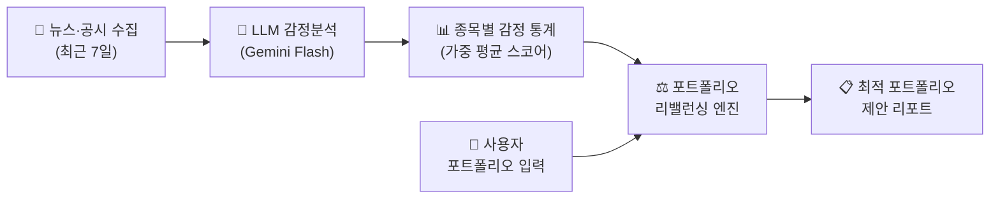
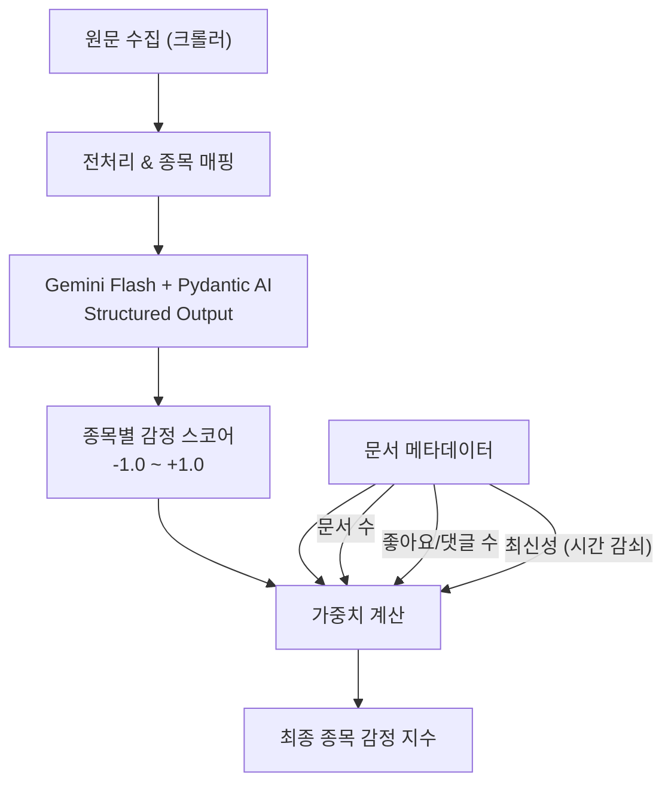
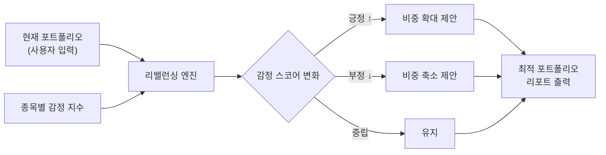
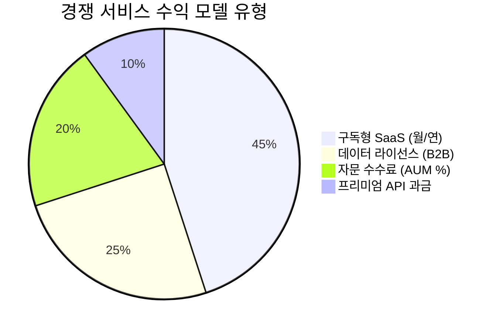
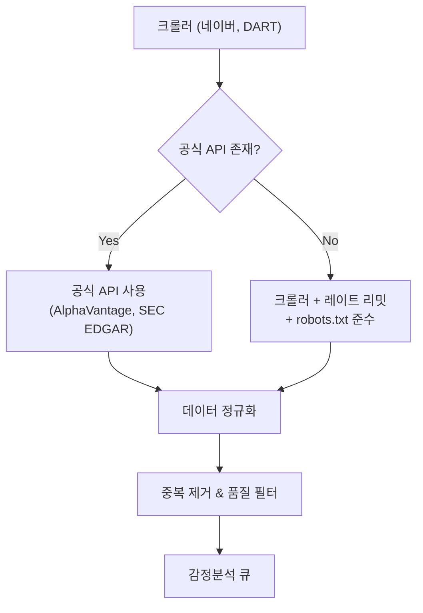
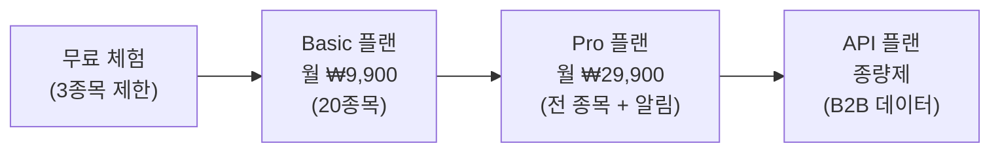

# 260320 뉴스·공시 감정분석 기반 주식 포트폴리오 리밸런싱 — 종합 리서치

---

## 📌 1. 서비스 소개

뉴스·공시 감정분석 기반 주식 포트폴리오 리밸런싱 서비스는, **뉴스 원문과 공시 문서에서 감정(긍정/부정) 신호를 추출**하고, 이를 종합하여 **사용자 포트폴리오의 최적 비율을 재계산·제안**하는 시스템이다.

### 핵심 구조



### 데이터 소스 구성

| 구분 | 소스 | 대상 | 갱신 주기 |
|------|------|------|-----------|
| 🇰🇷 한국 뉴스 | 네이버 일반뉴스, 네이버 증권뉴스 | 한국 Top100 종목 | 7일 롤링 |
| 🇰🇷 한국 공시 | DART 전자공시 | 한국 Top100 종목 | 7일 롤링 |
| 🇺🇸 미국 뉴스 | AP, Reuters, 해외증권뉴스 | 미국 Top100 종목 | 7일 롤링 |
| 🇺🇸 미국 공시 | SEC EDGAR | 미국 Top100 종목 | 7일 롤링 |

---

## 🌟 2. 서비스 특징

### 2-1. 감정분석 파이프라인



- **1개의 문서 → 여러 종목 연관** 가능 (multi-ticker extraction)
- **1개의 종목 → 여러 문서의 감정 스코어** 보유 (aggregation 필요)
- **배치 처리**: Pydantic AI 파이프라인으로 구조화된 출력(ticker, score) 연속 처리
- **비용 최적화**: Gemini 2.0 Flash Batch API (50% 할인) 활용

### 2-2. 가중치 산정 메커니즘

학술 연구에 따르면, 감정분석 가중치는 다음 요소를 고려해야 한다:

| 가중치 요소 | 설명 | 근거 |
|-------------|------|------|
| **문서 수 (Volume)** | 해당 종목 관련 기사 총량 | 많은 뉴스 = 높은 시장 관심 |
| **참여도 (Engagement)** | 좋아요, 댓글, 리트윗 수 | 리트윗 가중 감정이 동일 가중치보다 예측력 우수 ([Stanford CS224N 연구](https://web.stanford.edu/class/archive/cs/cs224n/cs224n.1234/final-reports/final-report-170049613.pdf)) |
| **최신성 (Recency)** | 시간 감쇠 함수 적용 | 지수 감쇠: $w(t) = e^{-\lambda \cdot \Delta t}$ |
| **출처 신뢰도** | 주요 통신사 > 블로그 | 소스 품질에 따른 가중 |

**가중 감정 스코어 공식:**

$$S_{ticker} = \frac{\sum_{i=1}^{n} s_i \cdot w_{vol,i} \cdot w_{eng,i} \cdot w_{rec,i} \cdot w_{src,i}}{\sum_{i=1}^{n} w_{vol,i} \cdot w_{eng,i} \cdot w_{rec,i} \cdot w_{src,i}}$$

여기서:
- $s_i$: 개별 문서의 감정 스코어 (-1 ~ +1)
- $w_{vol,i}$: 문서 수량 가중치
- $w_{eng,i}$: 참여도 가중치 (좋아요 + 댓글)
- $w_{rec,i}$: 최신성 가중치 (시간 감쇠)
- $w_{src,i}$: 출처 신뢰도 가중치

> 📝 **학술 근거**: 리트윗(참여도) 기반 가중 감정이 동일 가중치 방식보다 주가 방향 예측에서 더 우수한 성과를 보임 ([PMC 연구](https://pmc.ncbi.nlm.nih.gov/articles/PMC10403218/))

### 2-3. 포트폴리오 리밸런싱 제안



---

## 👍 3. 장단점 분석

### ✅ 장점

| # | 장점 | 설명 |
|---|------|------|
| 1 | **실시간 시장 심리 반영** | 기존 재무제표 기반 분석과 달리, 뉴스 여론을 실시간 반영 |
| 2 | **저비용 LLM 파이프라인** | Gemini Flash Batch API로 대량 감정분석 가능 ($0.05/1M input tokens) |
| 3 | **글로벌 커버리지** | 한국+미국 뉴스·공시를 동시 수집하여 글로벌 포트폴리오 대응 |
| 4 | **구조화된 출력** | Pydantic AI로 타입 안전한 파이프라인 구축, 안정적 배치 처리 |
| 5 | **자동화 가능** | 7일 롤링 윈도우로 주기적 배치 수행, 사용자 개입 최소화 |
| 6 | **감정 기반 알파** | 학술 연구에서 감정 신호의 단기(일/주) 예측력 확인됨 |

### ❌ 단점

| # | 단점 | 설명 |
|---|------|------|
| 1 | **감정분석 정확도 한계** | LLM이 풍자·역설·복합적 뉘앙스를 오판할 가능성 존재 |
| 2 | **노이즈 리스크** | 가십성 뉴스, 광고성 기사가 스코어를 오염시킬 수 있음 |
| 3 | **시장 효율성 장벽** | 뉴스 공개 직후 이미 주가에 반영되어 있을 가능성 (EMH) |
| 4 | **후행 지표 특성** | 뉴스는 이벤트 발생 후 보도 → 선행적 매매 신호로의 한계 |
| 5 | **법적 리스크** | 투자자문업/유사투자자문업 규제 해당 가능성 |
| 6 | **블랙스완 대응 불가** | 갑작스러운 위기(전쟁, 팬데믹)에서 감정분석 모델이 무력화 |
| 7 | **크롤링 법적 이슈** | 네이버 등 포털의 이용약관 위반 가능성 |

---

## 💰 4. 사업성 검토

### 4-1. 시장 규모

| 지표 | 수치 | 출처 |
|------|------|------|
| 글로벌 로보어드바이저 시장 규모 (2025) | 약 $41.7B | Statista |
| 한국 로보어드바이저 운용 규모 (2024) | 약 3,483억원 | [한국경제](https://www.hankyung.com/article/2025040635421) |
| 한국 로보어드바이저 전망 (2025) | 30조원 | [코스콤 뉴스룸](https://newsroom.koscom.co.kr/27881) |
| 연평균 성장률 (CAGR) | 13.4% | Statista |

### 4-2. 수익 모델 (BM) 벤치마크



| BM 유형 | 설명 | 대표 서비스 | 가격대 |
|---------|------|-------------|--------|
| **구독형 SaaS** | 월/연 정액제로 분석 도구 제공 | SentimentTrader, Kavout | $30~$100/월 |
| **데이터 라이선스** | 기관 투자자에 감정 데이터 API 판매 | MarketPsych (LSEG 파트너) | 기관 계약 (비공개) |
| **AUM 수수료** | 운용 자산 대비 수수료 | 핀트, 콴텍, 에임 | 0.3%~1.0%/년 |
| **프리미엄 API** | API 호출 기반 종량제 | AlphaVantage, Accern | 티어별 과금 |

### 4-3. 예상 운영 비용

한국 Top100 + 미국 Top100 종목 기준, 일일 뉴스·공시 약 **3,000~5,000건** 처리 가정:

| 비용 항목 | 월간 추정 | 비고 |
|-----------|-----------|------|
| Gemini Flash Batch API | **$3~$8** | 5,000건/일 × 30일, 평균 500토큰/건 |
| 서버 인프라 (VPS) | $20~$50 | 크롤러 + 배치 처리 |
| 데이터 소스 API | $0~$50 | AlphaVantage Free, SEC EDGAR 무료 |
| **총 월간 비용** | **$23~$108** | |

> 🔑 **핵심**: LLM 감정분석 비용이 월 $10 미만으로 매우 저렴. 사업 전체 비용 대비 LLM 비용은 미미함.

---

## ⚠️ 5. 위험 검토

### 5-1. 법적·규제 위험

#### 🇰🇷 한국

| 규제 | 내용 | 위험도 |
|------|------|--------|
| **투자자문업 등록** | 특정 고객에 대한 개인화된 투자 조언 → 투자자문업 등록 필요 (금융위원회) | 🔴 높음 |
| **유사투자자문업 신고** | 불특정 다수 대상 일방적 정보 제공 → 유사투자자문업 신고 (금융감독원) | 🟡 중간 |
| **리딩방 규제 (2024~)** | 실시간 종목 추천/매매 신호 → 자본시장법 위반 가능 | 🔴 높음 |
| **크롤링 이슈** | 네이버 이용약관 위반 가능성 | 🟡 중간 |

> 📌 **유사투자자문업 등록 요건**: 금융감독원 신고 필수, 사전교육 이수, 개별 접촉 통한 투자상담 금지. 출처: [대륜 법률사무소](https://www.daeryunlaw-comp.com/lawInfo_new/26)

#### 🇺🇸 미국 (해외 사용자 대상 시)

| 규제 | 내용 | 위험도 |
|------|------|--------|
| **SEC RIA 등록** | 투자 자문 제공 시 Registered Investment Adviser 등록 필요 | 🔴 높음 |
| **FINRA 규제** | AI 시스템의 적합성(suitability) 설명 의무, 기록 보관 의무 | 🔴 높음 |
| **AI Washing 단속** | AI 능력 과장 광고 시 SEC 제재 대상 | 🟡 중간 |
| **Fiduciary Duty** | 로보어드바이저도 인간 자문사와 동일한 수탁자 의무 적용 | 🔴 높음 |

> 출처: [Sidley Austin LLP](https://www.sidley.com/en/insights/newsupdates/2025/02/artificial-intelligence-us-financial-regulator-guidelines-for-responsible-use), [FINRA 24-09](https://www.finra.org/rules-guidance/notices/24-09)

### 5-2. 기술적 위험

| 위험 | 영향 | 대응 |
|------|------|------|
| LLM 감정분석 오류 | 잘못된 매매 신호 생성 | 앙상블 모델 (FinBERT + LLM) |
| 크롤러 차단 | 데이터 수급 중단 | 공식 API 활용 (AlphaVantage, SEC EDGAR) |
| API 가격 변동 | 운영비 급등 | 로컬 모델 (FinBERT) 대안 확보 |
| 데이터 편향 | 특정 종목 뉴스 편중 | 정규화 및 최소 문서 수 임계값 설정 |

### 5-3. 시장 위험

| 위험 | 설명 |
|------|------|
| **감정 기반 거래의 자기실현적 예언** | 많은 시스템이 같은 감정 신호로 동시 매매 → 과매수/과매도 |
| **뉴스 조작** | 의도적 가짜 뉴스로 감정 스코어 조작 가능 |
| **제도 변경** | 금융당국의 AI 투자 규제 강화 추세 |

---

## 🏢 6. 경쟁 서비스 분석

### 6-1. 글로벌 경쟁 서비스

| 서비스 | 유형 | 핵심 기능 | BM | 가격 |
|--------|------|-----------|-----|------|
| **[SentimentTrader](https://sentimentrader.com/)** | B2C SaaS | PortfolioEdge, AI Stock Scanner, 감정 지표 | 구독 | [가격 페이지](https://sentimentrader.com/pricing) |
| **[MarketPsych](https://www.marketpsych.com/)** (LSEG 파트너) | B2B 데이터 | 20년+ 감정 데이터, 은행·펀드·정부 대상 | 데이터 라이선스 | 비공개 (기관 계약) |
| **[Kavout](https://www.kavout.com/)** | B2C SaaS | InvestGPT, Kai Score (1~9), 뉴스 감정 | 구독 | [가격 페이지](https://www.kavout.com/pricing-plans) |
| **[Accern](https://www.accern.com/)** | B2B SaaS | AI 이벤트 모니터링, 리스크 추적 | 엔터프라이즈 | 비공개 |
| **[AlphaVantage](https://www.alphavantage.co/)** | API | News & Sentiments API, AI 감정 스코어 | 프리미엄 API | 무료~프리미엄 |

### 6-2. 한국 경쟁 서비스 (로보어드바이저)

| 서비스 | 운영사 | 핵심 기능 | 최근 1년 수익률 | BM |
|--------|--------|-----------|-----------------|-----|
| **[콴텍](https://www.quantec.co.kr/)** | 콴텍 | AI 자동투자, 국내주식형 | **35.26%** (대형 3호) | AUM 수수료 |
| **[핀트](https://www.fint.co.kr/)** | 디셈버앤컴퍼니 | 비대면 일임, 자율주행 모드 | **10.61%** (스포츠모드) | AUM 수수료 |
| **[에임](https://www.aim.co.kr/)** | AIM | AI 포트폴리오 | - | AUM 수수료 |
| **[파운트](https://thevc.kr/pound)** | 파운트 | AIR(AI Research), MY AI | **5.35%** | AUM 수수료 |

> 출처: [한국경제 — AI 수익률 비교](https://www.hankyung.com/article/2025040635421), [AI타임스](https://www.aitimes.com/news/articleView.html?idxno=136379)

### 6-3. 경쟁 구도 요약

```
┌─────────────────────────────────────────────────────┐
│                    경쟁 서비스 맵                      │
├──────────────┬──────────────────────────────────────┤
│              │  B2C (개인투자자)    B2B (기관)         │
├──────────────┼──────────────────────────────────────┤
│ 데이터만 제공  │  AlphaVantage      MarketPsych/LSEG  │
│              │  SentimentTrader   Accern             │
├──────────────┼──────────────────────────────────────┤
│ 분석+추천     │  Kavout            Bloomberg          │
│              │                    Terminal            │
├──────────────┼──────────────────────────────────────┤
│ 자동 투자     │  핀트, 콴텍, 에임   기관용 퀀트 시스템    │
│ (일임)       │  파운트             │                  │
└──────────────┴──────────────────────────────────────┘

→ 본 서비스 포지셔닝: "분석+추천" 영역의 B2C 감정분석 포트폴리오
```

---

## 🔧 7. 보완할 점

### 7-1. 기술적 보완

#### (A) 감정분석 품질 향상

| 현재 | 보완 방향 | 기대 효과 |
|------|-----------|-----------|
| Gemini Flash 단독 | **FinBERT + LLM 앙상블** | 정확도 ~80% (앙상블 시) |
| 단순 스코어 (-1~+1) | **다차원 감정** (낙관, 공포, 불확실성) | 더 풍부한 시그널 |
| LLM 의존 | **FinBERT 로컬 실행** (무료 대안 확보) | API 비용 제로 가능 |

> 📊 **학술 근거**: DeBERTa, RoBERTa, FinBERT 3개 모델 앙상블 시 정확도 약 80% 달성. 출처: [MDPI — Financial Sentiment Analysis](https://www.mdpi.com/2227-7072/13/2/75)

#### (B) 가중치 최적화

- **현재**: LLM 추천에 의존
- **보완**: 과거 데이터로 **백테스트 기반 가중치 최적화**
  - 각 가중치 파라미터($\lambda_{vol}$, $\lambda_{eng}$, $\lambda_{rec}$, $\lambda_{src}$)를 그리드 서치 또는 베이지안 최적화로 탐색
  - 학술 연구에서 시간 기반 분할(9:30 개장 시간 기준)이 자연 시간 분할보다 예측 정확도가 높음 ([ScienceDirect](https://www.sciencedirect.com/science/article/abs/pii/S0957417424008327))

#### (C) 데이터 파이프라인 안정성



#### (D) 백테스트 시스템 구축

- **필수**: 감정 기반 리밸런싱 전략의 과거 수익률 검증
- 학술 연구에서 감정 기반 전략의 연환산 수익률 약 **7.31%~7.81%** 확인 ([ScienceDirect](https://www.sciencedirect.com/science/article/pii/S1059056025003909))
- 단, 거래비용·세금·슬리피지 포함 시 실제 수익률은 하락 가능

### 7-2. 사업적 보완

#### (A) 법적 포지셔닝 명확화

| 전략 | 설명 | 규제 수준 |
|------|------|-----------|
| **정보 제공 서비스** (추천) | 감정 데이터만 제공, 매매 추천 없음 | 🟢 낮음 |
| **유사투자자문업** | 불특정 다수 대상 일방적 조언 | 🟡 금감원 신고 |
| **투자자문업** | 개인화된 투자 조언 | 🔴 금융위 등록 |

> 💡 **추천 전략**: 초기에는 "감정 데이터 제공 + 교육 목적 포트폴리오 시뮬레이터"로 포지셔닝하여 규제 리스크를 최소화. 매매 추천이 아닌 **"정보 제공"**으로 명확히 구분.

#### (B) ETF·펀드와의 차별화 전략

사용자 질문: *"포트폴리오 리밸런싱이 ETF나 펀드와 차별점이 있나?"*

| 비교 항목 | 본 서비스 | ETF/펀드 |
|-----------|-----------|----------|
| **투명성** | 감정 스코어·근거 뉴스 원문 모두 공개 | 블랙박스 (운용사 재량) |
| **커스터마이징** | 사용자가 종목·비율 직접 설정 | 운용사가 결정 |
| **비용** | 월 $23~$108 (자체 운영) | 운용보수 0.3%~1.5%/년 |
| **속도** | 뉴스 발생 → 수시간 내 반영 | 월/분기 정기 리밸런싱 |
| **교육 효과** | 왜 이 종목을 권하는지 뉴스 근거 제시 | 없음 |

> 📌 **핵심 차별점**: 투자 의사결정의 **"이유"를 뉴스 원문 기반으로 설명**한다는 점. 이는 기존 로보어드바이저의 "블랙박스" 문제를 해결함.

#### (C) 수익 모델 구체화



---

## ❓ 8. 주요 질문 답변

### Q1. 유사 서비스가 이미 많은가?

**✅ 예, 상당히 많다.**

감정분석 기반 투자 서비스는 이미 성숙한 시장이다:

- **글로벌**: SentimentTrader(2001년~), MarketPsych(20년+), Kavout, Accern, AlphaVantage 등
- **한국**: 콴텍, 핀트, 에임, 파운트 등 로보어드바이저 다수 운영 중
- **학술**: 2024~2025년 사이 감정분석+포트폴리오 논문이 폭발적으로 증가

> 📌 그러나 대부분은 **"감정 데이터만 제공"** 또는 **"자동 일임 투자"** 양극단에 위치. **"감정 데이터 + 포트폴리오 제안 + 근거 뉴스 원문 제공"**을 결합한 서비스는 상대적으로 적음.

#### 추천 서비스

| 서비스 | 추천 이유 | 링크 |
|--------|-----------|------|
| SentimentTrader | 가장 오래된 감정 지표 서비스, 신뢰도 높음 | [sentimentrader.com](https://sentimentrader.com/) |
| Kavout | AI 에이전트 기반, InvestGPT로 대화형 분석 | [kavout.com](https://www.kavout.com/) |
| AlphaVantage | 무료 API로 뉴스 감정 데이터 접근 가능 | [alphavantage.co](https://www.alphavantage.co/) |
| 콴텍 | 한국 최고 수익률 로보어드바이저 (35.26%/1Y) | [quantec.co.kr](https://www.quantec.co.kr/) |

### Q2. 경쟁 서비스의 BM은?

위 4-2절 참고. 핵심 요약:

- **B2C**: 구독형 SaaS (월 $30~$100)
- **B2B**: 데이터 라이선스 (기관 계약, 비공개)
- **로보어드바이저**: AUM 수수료 (0.3%~1.0%/년)

### Q3. 법적 문제는?

**🔴 주의 필요.**

- **한국**: 개인화된 투자 조언 시 투자자문업 등록 필수. 불특정 다수 대상이라도 유사투자자문업 신고 필요. 2024년 자본시장법 개정으로 리딩방 규제 강화.
- **미국**: SEC RIA 등록, FINRA 적합성 규칙 준수 필요.
- **우회 전략**: "정보 제공 서비스"로 포지셔닝하여 투자 추천이 아닌 데이터 제공으로 구분.

> 출처: [자본시장법 유사투자자문업 규제](https://www.kci.go.kr/kciportal/ci/sereArticleSearch/ciSereArtiView.kci?sereArticleSearchBean.artiId=ART001997435), [SEC AI 규제 가이드라인](https://www.sidley.com/en/insights/newsupdates/2025/02/artificial-intelligence-us-financial-regulator-guidelines-for-responsible-use)

### Q4. 포트폴리오 리밸런싱 vs Buy & Hold?

**📊 학술 연구 결론: 리밸런싱이 위험 조정 수익률에서 우위**

| 지표 | 리밸런싱 | Buy & Hold |
|------|----------|------------|
| **기대 수익률** | 약간 낮음 | 약간 높음 |
| **변동성 (Std Dev)** | **~15% 낮음** | 높음 |
| **Sharpe Ratio** | **우위** | 열위 |
| **Sortino Ratio** | **우위** | 열위 |
| **분산 효과** | 유지 | 시간 경과 → 집중 |

> 📝 **핵심**: Buy & Hold는 장기적으로 소수 종목에 집중되는 경향이 있어 분산 효과가 감소. 리밸런싱은 이를 방지. 단, 4년 이하 단기에서는 차이가 0.01% 미만. 출처: [Oxford Academic](https://academic.oup.com/raps/article/13/2/307/6874022), [Elm Wealth](https://elmwealth.com/portfolio-rebalancing/)

**ETF 대비 차별점:**

- ETF는 운용사 재량의 블랙박스 → 본 서비스는 **뉴스 근거를 투명하게 제공**
- ETF는 정기 리밸런싱 → 본 서비스는 **뉴스 이벤트 기반 수시 제안**
- ETF는 사용자 커스터마이징 불가 → 본 서비스는 **종목·비율 자유 설정**

### Q5. LLM API 비용 — Gemini Flash보다 더 저렴한 대안은?

#### 2026년 3월 기준 최저가 LLM API 비교

| 모델 | Input (/1M tokens) | Output (/1M tokens) | Batch 할인 | 실질 Input 비용 | 비고 |
|------|---------------------|----------------------|------------|-----------------|------|
| **Gemini 2.0 Flash** | $0.10 | $0.40 | **50%** | **$0.05** | ⭐ 추천 |
| Gemini 2.5 Flash | $0.03 (thinking off) | $0.25 | 50% | $0.015 | 더 저렴하나 안정성 검증 필요 |
| **DeepSeek V3.2** | $0.28 | $0.42 | 캐시 히트: 90% | **$0.028** (캐시) | 캐시 활용 시 최저가 |
| Gemini 2.0 Flash-Lite | $0.075 | $0.30 | - | $0.075 | ⚠️ 2026.06 서비스 종료 |
| Grok 4.1 | $0.20 | $0.50 | - | $0.20 | xAI |

> 출처: [TLDL LLM API Pricing 2026](https://www.tldl.io/resources/llm-api-pricing-2026), [Gemini API Pricing](https://ai.google.dev/gemini-api/docs/pricing)

#### 🏆 최적 추천 조합

```
┌─────────────────────────────────────────────────┐
│           감정분석 비용 최적화 전략                 │
├─────────────────────────────────────────────────┤
│                                                 │
│  1순위: FinBERT 로컬 실행 → 비용 $0 (무료)        │
│         ├ 정확도: F1 93.27% (금융 특화)           │
│         └ 단점: GPU 필요, 서버 비용 발생           │
│                                                 │
│  2순위: Gemini 2.0 Flash Batch API               │
│         ├ Input: $0.05/1M tokens (50% 할인)     │
│         ├ 무료 티어: 1,000 요청/일 (크레딧카드 불필요) │
│         └ 감정분석에 적합 (Google 공식 추천 용도)   │
│                                                 │
│  3순위: DeepSeek V3.2 (캐시 활용)                 │
│         ├ 캐시 히트: $0.028/1M tokens             │
│         └ 유사 프롬프트 반복 시 극도로 저렴          │
│                                                 │
│  ★ 하이브리드: FinBERT(1차 필터) + LLM(2차 정밀)   │
│    → 비용 최소화 + 정확도 극대화                    │
└─────────────────────────────────────────────────┘
```

#### 💡 무료 대안: FinBERT

- **완전 무료 오픈소스** ([HuggingFace](https://huggingface.co/ProsusAI/finbert), [GitHub](https://github.com/ProsusAI/finBERT))
- 금융 텍스트 특화 사전 학습
- F1-score **93.27%**, 정확도 **91.08%** (SEntFiN 데이터셋)
- CPU에서도 실행 가능 (속도는 느리지만 배치 처리에 충분)
- **감정분석 전용이라 LLM보다 정확할 수 있음**

> 📌 **최종 추천**: 감정분석 용도라면 **FinBERT 로컬 실행이 가장 비용 효율적**. LLM은 "뉴스 요약", "종목 추출" 등 복잡한 NLU 작업에만 사용하는 **하이브리드 전략**이 최적.

#### 실제 비용 시뮬레이션

일일 5,000건 뉴스, 평균 500 토큰/건 기준:

| 전략 | 일 비용 | 월 비용 |
|------|---------|---------|
| Gemini Flash Batch 전량 | $0.13 | **~$3.75** |
| FinBERT 전량 (로컬) | $0 (전기료만) | **~$0** |
| 하이브리드 (FinBERT 80% + Gemini 20%) | $0.025 | **~$0.75** |
| DeepSeek 캐시 활용 | $0.07 | **~$2.10** |

---

## 📊 9. 종합 평가 매트릭스

| 평가 항목 | 점수 (5점 만점) | 코멘트 |
|-----------|-----------------|--------|
| 🏪 시장 수요 | ⭐⭐⭐⭐ | 로보어드바이저 시장 연 13.4% 성장 |
| 🔧 기술 실현 가능성 | ⭐⭐⭐⭐⭐ | LLM + 크롤러 기술 성숙, 비용 극저 |
| ⚖️ 법적 실행 가능성 | ⭐⭐⭐ | "정보 제공" 포지셔닝 시 리스크 관리 가능 |
| 💰 수익성 | ⭐⭐⭐ | 구독 모델 시 BEP 도달 쉬우나 스케일 도전적 |
| 🏆 경쟁 차별화 | ⭐⭐⭐ | "뉴스 근거 투명성"이 차별점이나 모방 용이 |
| 📈 확장성 | ⭐⭐⭐⭐ | 종목 확대, 글로벌 확장 구조적으로 가능 |

### 종합 의견

> 🎯 **기술적으로는 매우 실현 가능**하고 비용도 극히 저렴한 프로젝트다. 핵심 과제는 기술이 아니라 **법적 포지셔닝**과 **경쟁 차별화**이다. "감정 데이터 + 포트폴리오 시뮬레이터 + 뉴스 근거 투명 공개"라는 조합은 기존 서비스 대비 차별점이 있으나, 실질적 알파(초과수익) 생성 능력을 백테스트로 증명해야 사용자를 설득할 수 있다.

---

## 📚 출처 (Sources)

### 학술 연구
- [News Sentiment and Stock Market Dynamics — MDPI](https://www.mdpi.com/1911-8074/18/8/412)
- [Investor Sentiment and Optimizing Traditional Quantitative Investments — ScienceDirect](https://www.sciencedirect.com/science/article/pii/S1059056025003909)
- [Stock Trend Prediction Using Sentiment Analysis — PeerJ/PMC](https://pmc.ncbi.nlm.nih.gov/articles/PMC10403218/)
- [Small Rebalanced Portfolios Often Beat the Market — Oxford Academic](https://academic.oup.com/raps/article/13/2/307/6874022)
- [Portfolio Rebalancing: Free Lunch or Empty Calories? — Elm Wealth](https://elmwealth.com/portfolio-rebalancing/)
- [Financial Sentiment Analysis: Techniques and Applications — ACM](https://dl.acm.org/doi/full/10.1145/3649451)
- [FinBERT — Financial Sentiment Analysis with BERT](https://huggingface.co/ProsusAI/finbert)
- [Financial Sentiment Analysis and Classification — MDPI](https://www.mdpi.com/2227-7072/13/2/75)
- [News Sentiment Embeddings for Stock Price Forecasting — arXiv](https://arxiv.org/html/2507.01970v1)

### 경쟁 서비스
- [SentimentTrader](https://sentimentrader.com/)
- [MarketPsych](https://www.marketpsych.com/)
- [Kavout](https://www.kavout.com/)
- [AlphaVantage](https://www.alphavantage.co/)
- [콴텍](https://www.quantec.co.kr/)
- [핀트](https://www.fint.co.kr/)
- [파운트 — THE VC](https://thevc.kr/pound)

### 법적·규제
- [자본시장법 유사투자자문업 규제 — KCI](https://www.kci.go.kr/kciportal/ci/sereArticleSearch/ciSereArtiView.kci?sereArticleSearchBean.artiId=ART001997435)
- [유사투자자문업 등록 — 대륜](https://www.daeryunlaw-comp.com/lawInfo_new/26)
- [SEC AI 규제 가이드라인 — Sidley Austin](https://www.sidley.com/en/insights/newsupdates/2025/02/artificial-intelligence-us-financial-regulator-guidelines-for-responsible-use)
- [FINRA AI Applications — FINRA.org](https://www.finra.org/rules-guidance/key-topics/fintech/report/artificial-intelligence-in-the-securities-industry/ai-apps-in-the-industry)
- [AI 로보어드바이저 규제 리스크](https://dialzara.com/blog/ai-robo-advisors-regulatory-risks)

### LLM API 가격
- [LLM API Pricing 2026 — TLDL](https://www.tldl.io/resources/llm-api-pricing-2026)
- [Gemini API Pricing — Google](https://ai.google.dev/gemini-api/docs/pricing)
- [DeepSeek API Pricing — DeepSeek](https://api-docs.deepseek.com/quick_start/pricing)
- [Gemini Batch API — Google Cloud](https://docs.cloud.google.com/vertex-ai/generative-ai/docs/multimodal/batch-prediction-gemini)

### 시장 데이터
- [AI 수익률 — 한국경제](https://www.hankyung.com/article/2025040635421)
- [로보어드바이저 성장 전망 — 코스콤 뉴스룸](https://newsroom.koscom.co.kr/27881)
- [Pydantic AI — 공식 문서](https://ai.pydantic.dev/)

---

## 프롬프트

```text
hhd-research
think ultra hard

서비스 주제 : 뉴스, 공시 감정분석을 통한 주식 포트폴리오 리밸런싱

소개
특징
장단점
사업성 검토
위험 검토
경쟁서비스 분석
보완할 점
- 기술적인 면
- 사업적인 면

내가 생각한 기능
- 네이버일반뉴스, 네이버증권뉴스, DART공시, ap/로이터 등 해외뉴스, 해외증권뉴스, SEC공시를 원문 수집
  - 최근 7일
  - 너무 오래된 뉴스나 공시 문서는 불필요
- 수집한 원문을 각각 분석하여 감정분석
  - list
    - ticker
        - ticker 는 전종목 대상은 아니고 한국주식top100, 미국주식top100 으로 한정
    - 감정스코어 : -1(강한부정) ~ 1(강한긍정)
  - 한개의 문서에 여러 종목이 연관되어 있을수 있고,
  - 각 개별종목은 여러 스코어의 감정이 있을수 있음.
  - 감정분석은 gemini flash + pydantic.ai 를 이용하여 파이프라인을 구성하여 배치처리하여 계속 수행함.
        - 저럼한 비용으로 감정분석을 하기 위함.
- 사용자 포트폴리오 입력받음
  - list
      - ticker
          - 한국주식 top100, 미국주식 top100
          - 현금
          - 금(gold)
      - 비율
      - 수량
    - 비율로 0~1 사이로 입력할수 있거나, 그냥 정확히 주식수를 입력할 수 있음.
    - 비율이나 수량이 없더라도, 즉 보유하지 않은 종목이라도, 등록을 해 두면 최적 포트폴리오에 추가됨
      - 보통 매수 권유가 될것
- 감정분석 내용을 바탕으로 최적 포트폴리오 재계산
    - 문서 감정분석 가중치, 통계
      - 문서갯수
      - 문서좋아요수
      - 문서댓글수
      - 최신성
      - 이 문서 주제로 얼마나 화제가 되고 여론이 어떻게 형성되고 있는 위 가중치를 고려하여 결정
      - 많은 뉴스가 나오고, 많은 좋아요 댓글이 달리고, 최근에 나온 뉴스일수록 가중치를 높게 결정
      - 가중치의 우선순위 배율은 어떤게 적절한지는 llm 의 추천을 받을예정
        - 이것이 중요할 것 같은데, 사실 이런 프로젝트는 이미 여럿 도전되었을것 같고, llm이 웹검색을 통해 잘 찾아줄것이라 생각함.
  - 문서 감정분석 통계까지 산출되면 이를 바탕으로 포트폴리오 재구성, 제안


주요질문
- 이 포트폴리오 리벨런싱 아이디어는 굉장히 보편적인 요구사항일것 같아서 이미 많은 시도가 있었을것을 생각함.
  - 그래서 유사 서비스, 사례가 많이 있는가?
  - 서비스 추천 해 주세요.
- 유사 서비스가 경쟁 서비스가 있다면, 이들의 BM은 어떻게 되는가?
- 유사 서비스가 있다면, 이는 행정적인 법적인 문제는 없는가?
- 포트폴리오 리밸런싱에 대한 근본적인 질문으로, 포트폴리오라는 자체는 어찌보면 리스크도 줄이고 수익도 함께 줄이는 효과가 있어서, buy hold 에 비해서 꼭 좋은지 모르겠음.
  - 또한 이렇게 포트폴리오 리벨런싱을 기획하는것이 ETF나 다른펀드와 차별점이 있을까?
- llm api 사용에 대한 질문
  - 뉴스원문 감정분석을 위해 llm을 사용할 것인데, 이를 위해 gemini 에서 가장 값싼 모델인 flash를 사용할려고 합니다.
  - 가장 중요한 것은 llm api 가격.
  - 속도는 어느정도만 나오면 되고, 품질은 어차피 많은량의 뉴스를 다룰것이라 약간 희석되는 감이 있음.
  - gemini flash 보다 가격적인 부분에서 더 좋은 솔루션은?
```
