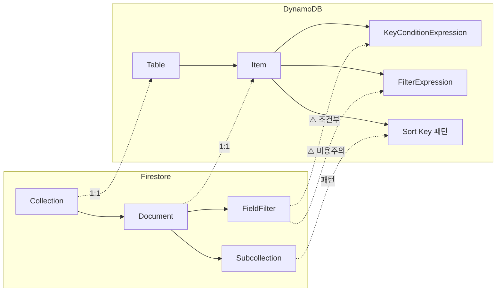
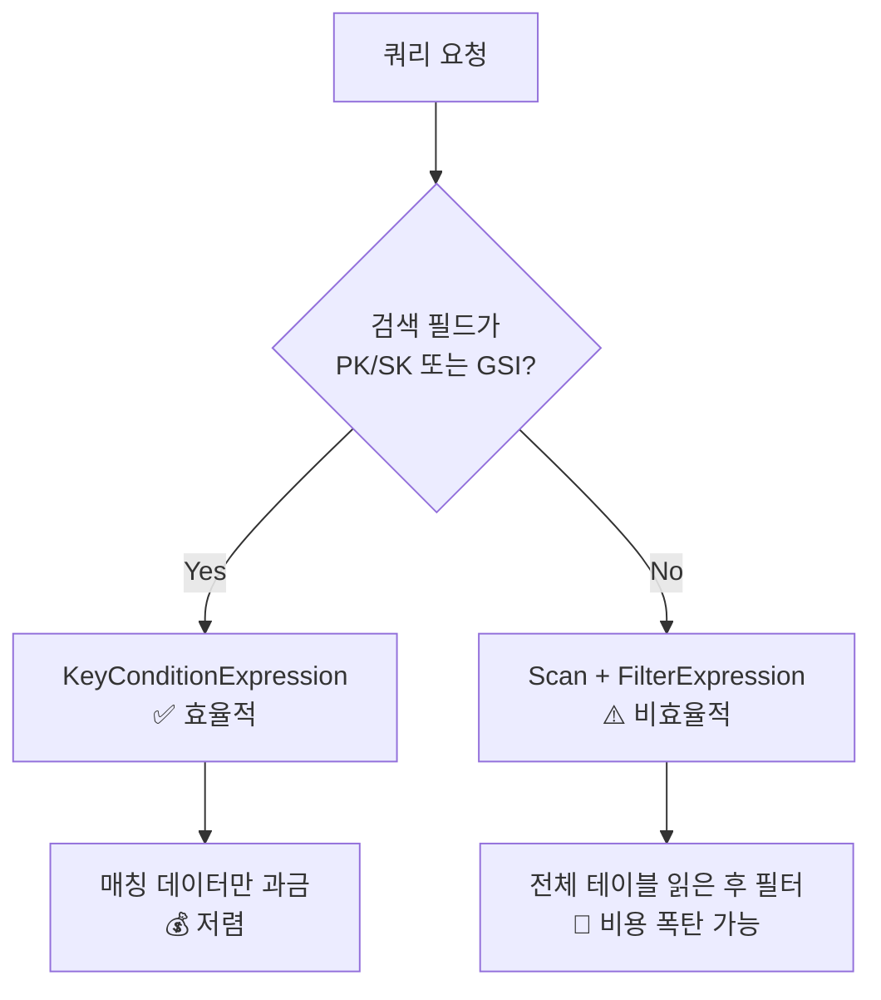
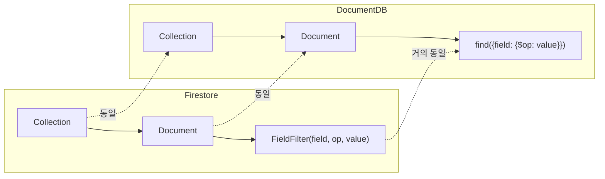
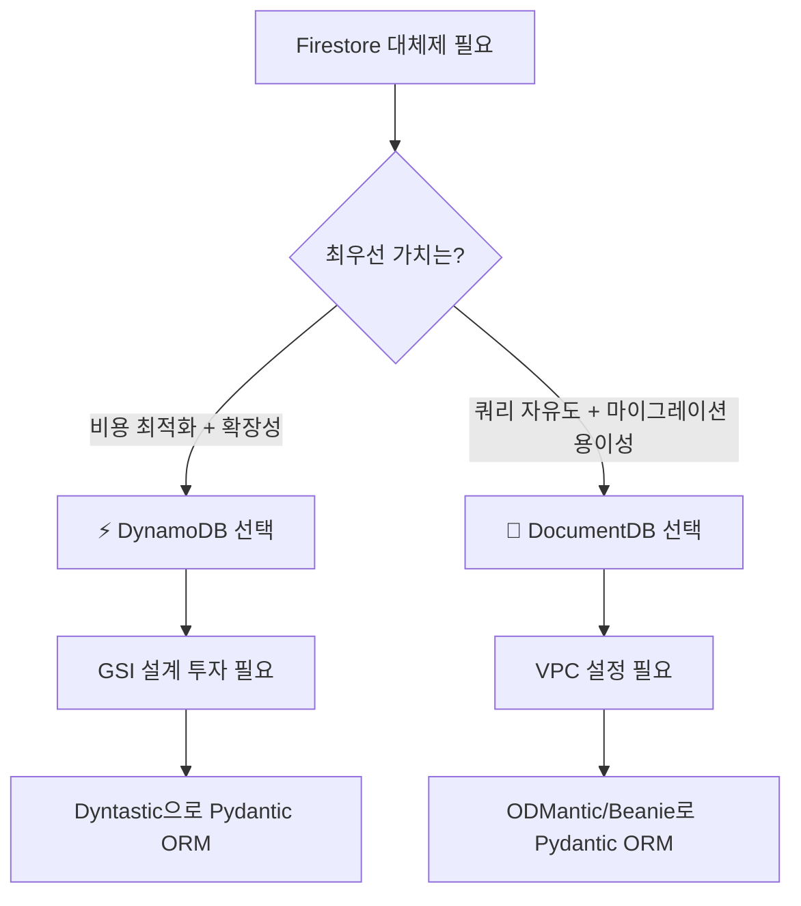

# 260322 AWS에서 Firestore 대체제 비교분석

> 🔥 Google Firestore를 AWS로 옮기고 싶다면? DynamoDB vs DocumentDB 완전 비교

---

## 📌 왜 이 리서치가 필요한가?

Google Firestore는 **스키마리스 + 자동 인덱스 + 서버사이드 쿼리**라는 삼박자를 갖춘 훌륭한 NoSQL 서비스입니다. 하지만 인프라를 **AWS 중심으로** 통합하려다 보면, GCP에만 있는 Firestore를 대체할 수 있는 AWS 서비스가 필요합니다.

핵심 요구사항은 다음과 같습니다:

| 항목 | 요구사항 |
|------|----------|
| ☁️ 인프라 | AWS Managed Service |
| 🔧 스키마 | 스키마리스 (DDL 관리 불필요) |
| 📈 확장성 | 서버리스 / 무한 확장 |
| 🔍 쿼리 | 서버사이드 필터 (eq, gt, lt) |
| 🐍 SDK | Python + Pydantic ORM |

---

## 🖼️ 한눈에 보는 비교


---

## 🏆 후보 서비스 총괄 비교

| 항목 | ⚡ DynamoDB | 📄 DocumentDB | ⏱️ Timestream | 🗂️ Keyspaces |
|------|-----------|-------------|------------|-----------|
| 데이터 모델 | Key-Value + Document | Document (MongoDB 호환) | Time-Series | Wide-Column |
| Firestore 유사도 | **중간** | **높음** 🏅 | 낮음 | 낮음 |
| 서버리스 | ✅ 완전 | ✅ Elastic Clusters | ✅ | ✅ |
| 스키마 유연성 | ✅ 완전 | ✅ 완전 | ❌ 제한적 | ❌ DDL 필요 |
| 자유 필드 쿼리 | ⚠️ GSI 필요 | ✅ 인덱스 없이 가능 | ✅ SQL | ⚠️ 제한적 |
| Pydantic ORM | ✅ Dyntastic | ✅ ODMantic/Beanie | ❌ | ❌ |
| 온디맨드 과금 | ✅ 사용량 0 = 비용 0 | ⚠️ 최소 비용 있음 | ✅ | ✅ |
| **추천도** | **1순위** 🥇 | **2순위** 🥈 | ❌ 부적합 | ❌ 부적합 |

---

## ⚡ 1순위: Amazon DynamoDB

### 🔍 Firestore 개념 매핑



### ⚠️ 핵심 차이: 쿼리 방식

Firestore와 DynamoDB의 **가장 큰 차이**는 쿼리 방식입니다.

#### Firestore: 자동 인덱스로 자유 쿼리

```python
# Firestore - 아무 필드나 바로 쿼리 가능 ✅
query = collection.where(filter=FieldFilter("status", "==", "active"))
query = collection.where(filter=FieldFilter("price", ">=", 100))
```

#### DynamoDB: 2가지 방식의 근본적 차이



| 항목 | KeyConditionExpression | FilterExpression |
|------|----------------------|------------------|
| 적용 대상 | PK, SK, GSI 키만 | **모든 속성** |
| 적용 시점 | 데이터 읽기 **전** (인덱스 활용) | 데이터 읽기 **후** (메모리 필터) |
| RCU 비용 | 매칭 데이터만 💰 | **필터 전 전체 데이터** 💸 |
| 1MB 제한 | 매칭 데이터 기준 | 필터 전 데이터 기준 |

> 📖 참고: [When to use DynamoDB Filter Expressions (Alex DeBrie)](https://www.alexdebrie.com/posts/dynamodb-filter-expressions/)

#### GSI (Global Secondary Index) = 해결책

```
GSI를 생성하면 해당 필드를 PK/SK로 설정하여
KeyConditionExpression으로 효율적 쿼리 가능

예: status 필드로 자주 검색한다면
   → GSI: PK=status, SK=created_at
   → Query(IndexName='status-index',
           KeyConditionExpression=Key('status').eq('active'))
```

- GSI는 테이블당 최대 **20개** 생성 가능
- GSI는 별도 스토리지 + RCU/WCU 비용 발생
- Firestore는 이것을 자동으로 해주지만, DynamoDB는 **수동 설계 필요**

> 📖 참고: [DynamoDB GSI 공식 문서](https://docs.aws.amazon.com/amazondynamodb/latest/developerguide/GSI.html)

### 🐍 Pydantic ORM: Dyntastic

DynamoDB에는 **Pydantic BaseModel 네이티브** ORM인 [Dyntastic](https://github.com/nayaverdier/dyntastic)이 있습니다.

```python
from dyntastic import Dyntastic
from pydantic import Field

class Stock(Dyntastic):
    __table_name__ = "stocks"
    __hash_key__ = "ticker"

    ticker: str
    price: float
    status: str = "active"
    sector: str | None = None

# 저장
stock = Stock(ticker="AAPL", price=185.5, sector="Tech")
stock.save()

# 쿼리 (KeyConditionExpression)
stocks = Stock.query("AAPL")

# 스캔 (FilterExpression)
active = Stock.scan(filter_condition=Stock.status == "active")
```

기존 `HsFirestoreUtil`과 매우 유사한 패턴으로 래퍼를 만들 수 있습니다.

### 💰 과금 모델

| 모드 | 설명 | 적합한 경우 |
|------|------|-------------|
| **온디맨드** | 읽기/쓰기 요청당 과금 | 트래픽 예측 불가, 개발 초기 |
| **프로비저닝** | RCU/WCU 사전 예약 | 트래픽 예측 가능, 비용 최적화 |

온디맨드 가격 (us-east-1):
- 쓰기: **$1.25** / 100만 WRU
- 읽기: **$0.25** / 100만 RRU
- 스토리지: **$0.25** / GB / 월

> 📖 참고: [DynamoDB Pricing Calculator (Dynobase)](https://dynobase.dev/dynamodb-pricing-calculator/)

### ⚠️ 단점

1. **GSI 설계 필수** — Firestore처럼 "아무 필드나" 쿼리 불가
2. **항목 크기 400KB 제한** (Firestore는 1MB)
3. **실시간 리스너 없음** — DynamoDB Streams + Lambda 별도 구성
4. **트랜잭션 100개 항목 제한**

---

## 📄 2순위: Amazon DocumentDB (Serverless)

### 🔍 Firestore와 가장 유사



```python
# DocumentDB (pymongo 드라이버) - Firestore와 거의 동일한 경험
collection.find({"status": "active", "price": {"$gte": 100}})
```

- 모든 필드에 대해 **인덱스 없이도** 서버사이드 쿼리 가능 ✅
- eq, gt, lt, gte, lte, ne, in, regex 등 풍부한 연산자
- 집계(Aggregation Pipeline) 지원

### 🐍 Pydantic ORM

- [ODMantic](https://github.com/art049/odmantic) — Pydantic 네이티브 MongoDB ODM
- [Beanie](https://github.com/BeanieODM/beanie) — Pydantic 기반 비동기 MongoDB ODM

### ⚠️ 단점

1. **❌ VPC 내부에서만 접근** — 퍼블릭 엔드포인트 없음
2. **💸 기본 비용 높음** — 서버리스 모드에서도 최소 0.5 DCU 과금
3. **완전한 MongoDB 호환이 아님** — 일부 기능 미지원
4. **Cold Start** — 유휴 후 첫 연결 시 지연

> 📖 참고: [Amazon DocumentDB Serverless](https://aws.amazon.com/documentdb/serverless/)

---

## ❌ 부적합 서비스

### ⏱️ Amazon Timestream

- 시계열 데이터 **전용** (범용 NoSQL 아님)
- append-only (UPDATE/DELETE 불가)
- **신규 가입 중단** (LiveAnalytics)

> 📖 참고: [Timestream 사용 중단 안내 (Tiger Data)](https://www.tigerdata.com/blog/so-long-timestream-how-and-why-to-migrate-before-its-too-late)

### 🗂️ Amazon Keyspaces

- **스키마 정의 필요** (CQL로 ALTER TABLE ADD 필요) → 요구사항 위반
- Pydantic ORM 없음

> 📖 참고: [DynamoDB vs Keyspaces (Dynobase)](https://dynobase.dev/dynamodb-vs-amazon-keyspaces/)

---

## 💡 최종 결론: 어떤 것을 선택할까?



### 📊 결정 매트릭스

| 우선순위 | DynamoDB | DocumentDB |
|----------|----------|------------|
| 💰 비용 최적화 | 🏅 **승** | - |
| 🔍 쿼리 자유도 | - | 🏅 **승** |
| 🚀 서버리스 완성도 | 🏅 **승** | - |
| 🔄 Firestore 마이그레이션 | - | 🏅 **승** |
| 🌐 생태계/커뮤니티 | 🏅 **승** | - |
| 📈 초대규모 확장 | 🏅 **승** | - |

### 🎯 HhdStock 프로젝트 기준 추천

접근 패턴이 명확한 경우(ticker별, 날짜별 조회):

> **✅ DynamoDB 채택 권장**
> - PK: `ticker`, SK: `data_type#timestamp`
> - GSI 2~3개로 주요 쿼리 패턴 커버 가능
> - Dyntastic으로 기존 Pydantic 모델 그대로 활용
> - 온디맨드 모드로 시작 → 사용량 없으면 비용 0

---

## 📚 참고 자료

### DynamoDB vs Firestore 비교
- [DynamoDB vs Firestore - The Ultimate Comparison (Dynobase)](https://dynobase.dev/dynamodb-vs-google-firestore/)
- [AWS DynamoDB vs Google Firestore: Free Tier Comparison 2025](https://www.freetiers.com/blog/aws-dynamodb-vs-google-firestore-comparison)
- [DynamoDB vs Firestore (Dynomate)](https://dynomate.io/blog/dynamodb-vs-firestore/)

### DynamoDB 쿼리 및 비용
- [DynamoDB Filter Expressions (Alex DeBrie)](https://www.alexdebrie.com/posts/dynamodb-filter-expressions/)
- [KeyConditionExpression vs FilterExpression (DEV)](https://dev.to/siddhantkcode/understanding-keyconditionexpression-and-filterexpression-in-dynamodb-3kmk)
- [DynamoDB Scan vs Query (Dynobase)](https://dynobase.dev/dynamodb-scan-vs-query/)
- [DynamoDB GSI 공식 문서](https://docs.aws.amazon.com/amazondynamodb/latest/developerguide/GSI.html)
- [DynamoDB Pricing Calculator (Dynobase)](https://dynobase.dev/dynamodb-pricing-calculator/)

### Python ORM / SDK
- [Dyntastic - Pydantic + DynamoDB (GitHub)](https://github.com/nayaverdier/dyntastic)
- [PynamoDB (GitHub)](https://github.com/pynamodb/PynamoDB)
- [ODMantic - MongoDB ODM (GitHub)](https://github.com/art049/odmantic)
- [Beanie - Async MongoDB ODM (GitHub)](https://github.com/BeanieODM/beanie)

### AWS NoSQL 비교
- [AWS NoSQL Options Compared (PracticalLogix)](https://www.practicallogix.com/aws-nosql-database-options-compared-dynamodb-documentdb-and-keyspaces/)
- [DocumentDB vs DynamoDB (pump.co)](https://www.pump.co/blog/documentdb-vs-dynamodb)
- [AWS NoSQL 선택 가이드 (AWS Whitepaper)](https://docs.aws.amazon.com/whitepapers/latest/choosing-an-aws-nosql-database/considerations.html)

---

## 프롬프트

```text
주제 : firestore vs other

firestore 를 대체할 수 있는 솔루션 검색

- aws 내부 제품
- python 에서 pydantic 기반 orm 지원
  - 없다면 자체 개발 할수 있어도 됨.
  - ex) C:\Users\hhd20\project\HhdStock\py\util\hs_firestore_util.py
- 클라우드기반 DB로 용량이 무한 확장 필요
- 스키마가 유연해서 add column 등 손 많이 가는 관리가 필요없어야 함.
- 그렇지만 컬럼을 지정해서 검색을 할 수 있어야 함.
  - LIKE 지원은 안해도 되지만, 컬럼의 eq gt lt 검색은 지원되야 함.
  - 아주 빠를필요는 없지만, 클라에서 full query 이후 클라에서 다시 메모리 필터링을 하는 것은 안됨.
- 이 모든 조건을 만족하는것이 firestore 인데, 클라우드를 aws 위주로 쓸려다 보니 대안이 없을까 찾는중
```
