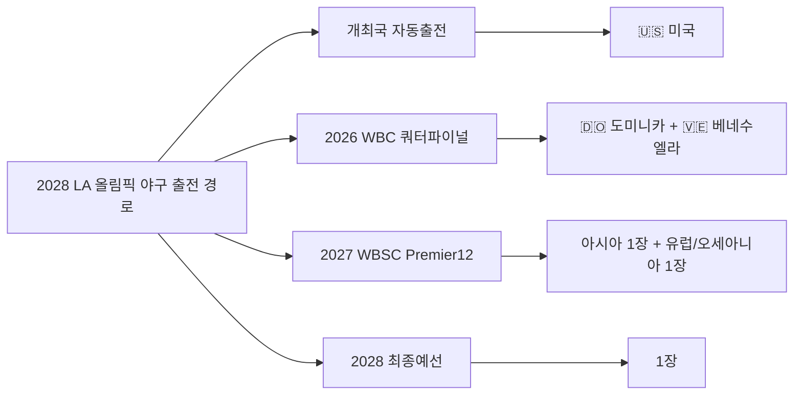
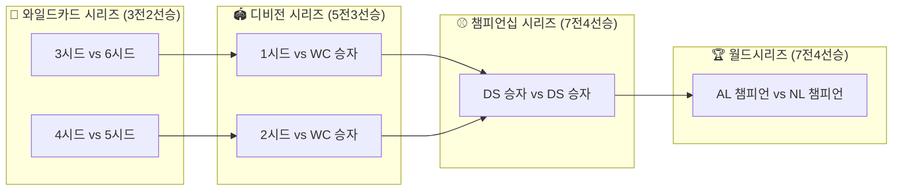
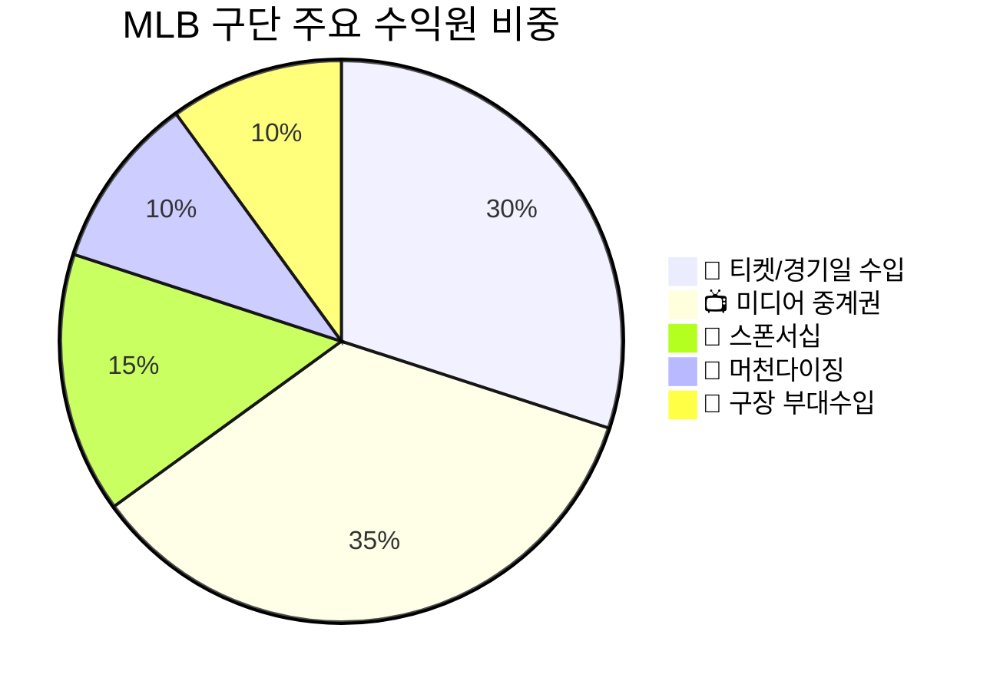

# 260322 MLB 미국야구(메이저리그) 종합 리서치

> 🏟️ 미국 프로야구 MLB(Major League Baseball)의 구조, 대회, 선수, 비즈니스 모델까지 총망라한 종합 리서치 문서입니다.

---

## 📋 목차

1. [메이저 대회](#1-메이저-대회)
2. [메이저 리그 구조](#2-메이저-리그-mlb-구조)
3. [승격 시스템 (마이너리그)](#3-승격-시스템-마이너리그)
4. [구단 비즈니스 모델](#4-구단-비즈니스-모델bm)
5. [MLB 주요 팀 소개](#5-mlb-주요-팀-소개)
6. [팀별 주요선수 소개](#6-팀별-주요선수-소개-2024-2025-기준)
7. [주요선수별 연봉 및 실력](#7-주요선수별-연봉-실력-소개)

---

## 1. 메이저 대회

### 🏆 1-1. 월드시리즈 (World Series)

MLB 시즌의 최종 결승전으로, 아메리칸 리그(AL) 챔피언과 내셔널 리그(NL) 챔피언이 맞붙는 **7전 4선승제** 시리즈입니다. 1903년부터 시작되어 120년 이상의 역사를 자랑합니다.

#### 최근 월드시리즈 결과

| 연도 | 우승팀 | 상대팀 | 시리즈 스코어 | MVP |
|------|--------|--------|---------------|-----|
| 2024 | LA 다저스 🏆 | NY 양키스 | 4-1 | Freddie Freeman |
| 2025 | LA 다저스 🏆🏆 | 토론토 블루제이스 | 4-3 | - |

**📌 2024 월드시리즈 하이라이트**
- Freddie Freeman이 시리즈 1~4차전 연속 홈런 기록
- Game 1에서 월드시리즈 역사상 **최초 끝내기 만루홈런(walk-off grand slam)** 달성
- 다저스 프랜차이즈 통산 **8번째** 월드시리즈 우승
- 양키 스타디움에서 우승을 확정한 **세 번째 원정팀** (1955, 1981, 2024)

**📌 2025 월드시리즈 하이라이트**
- 다저스가 토론토 블루제이스를 상대로 Game 7 연장전 끝에 우승
- 2000년 양키스 이후 **최초의 월드시리즈 2연패** 달성
- 내셔널리그에서는 1975-76년 신시내티 레즈 이후 최초 연속 우승
- Game 7은 FOX 기준 2,688만 뷰어, 전체 플랫폼 2,733만 뷰어 기록

> 📎 출처: [2024 World Series - Wikipedia](https://en.wikipedia.org/wiki/2024_World_Series) | [2025 World Series - Baseball Reference](https://www.baseball-reference.com/postseason/2025_WS.shtml) | [ESPN 2024 World Series](https://www.espn.com/mlb/story/_/id/41459802/2024-mlb-playoffs-word-series-schedule-how-watch-postseason-bracket-standings)

---

### 🌏 1-2. 월드 베이스볼 클래식 (WBC)

MLB와 WBSC가 공동 주관하는 **국가대항전** 야구 대회입니다. 4년마다 개최되며, MLB 현역 선수들이 대거 참가합니다.

#### WBC 역대 우승국

| 회차 | 연도 | 우승 | 준우승 | 개최지 |
|------|------|------|--------|--------|
| 1회 | 2006 | 🇯🇵 일본 | 🇨🇺 쿠바 | 미국 |
| 2회 | 2009 | 🇯🇵 일본 | 🇰🇷 한국 | 미국/일본 |
| 3회 | 2013 | 🇩🇴 도미니카 | 🇵🇷 푸에르토리코 | 미국/일본 |
| 4회 | 2017 | 🇺🇸 미국 | 🇵🇷 푸에르토리코 | 미국/일본 |
| 5회 | 2023 | 🇯🇵 일본 | 🇺🇸 미국 | 미국/일본 |
| 6회 | 2026 | 🇻🇪 베네수엘라 | 🇺🇸 미국 | 미국/일본 등 |

**📌 2026 WBC 주요 내용**
- **기간**: 2026년 3월 5일~17일
- **개최지**: 마이애미, 휴스턴, 산후안(푸에르토리코), 도쿄
- **참가국**: 20개국, 4개 풀로 편성
- **우승**: 🇻🇪 베네수엘라 (결승에서 미국 3-2 승리, Eugenio Suarez 결승 2루타)
- **MVP**: Maikel Garcia
- **시청률**: 2023년 대비 **142% 증가**

```
🏟️ 2026 WBC 풀 편성
┌──────────────────────────────────────────────────────────────────────────────┐
│ Pool A (산후안)    │ Pool B (휴스턴)     │ Pool C (도쿄)      │ Pool D (마이애미)  │
│ 🇨🇦 캐나다          │ 🇧🇷 브라질           │ 🇦🇺 호주             │ 🇩🇴 도미니카공화국   │
│ 🇨🇴 콜롬비아        │ 🇬🇧 영국             │ 🇨🇿 체코             │ 🇮🇱 이스라엘         │
│ 🇨🇺 쿠바            │ 🇮🇹 이탈리아         │ 🇯🇵 일본             │ 🇳🇱 네덜란드         │
│ 🇵🇦 파나마          │ 🇲🇽 멕시코           │ 🇰🇷 한국             │ 🇳🇮 니카라과         │
│ 🇵🇷 푸에르토리코    │ 🇺🇸 미국             │ 🇹🇼 대만             │ 🇻🇪 베네수엘라       │
└──────────────────────────────────────────────────────────────────────────────┘
```

> 📎 출처: [2026 WBC - Wikipedia](https://en.wikipedia.org/wiki/2026_World_Baseball_Classic) | [Olympics.com WBC Schedule](https://www.olympics.com/en/news/2026-world-baseball-classic-full-schedule-all-results-and-standings-complete-list) | [Baseball America WBC](https://www.baseballamerica.com/stories/2026-world-baseball-classic-schedule-scores/)

---

### 🥇 1-3. 올림픽 야구

야구는 올림픽에서 불규칙하게 정식 종목으로 채택되어 왔습니다. 2012, 2016 올림픽에서 제외되었다가 2020 도쿄에서 복귀했고, 2024 파리에서 다시 제외되었습니다.

**📌 2028 LA 올림픽 야구 복귀 확정**
- **경기장**: 다저 스타디움 (Dodger Stadium)
- **기간**: 2028년 7월 13~19일
- **참가 팀**: 6개국
- **미국**: 개최국 자격으로 자동 출전
- **도미니카, 베네수엘라**: 2026 WBC를 통해 출전권 획득
- **나머지 3장**: 2027 WBSC Premier12 및 최종예선을 통해 결정
- **MLB 선수 참가**: MLB와 선수노조 간 협의 진행 중



> 📎 출처: [Baseball at 2028 Olympics - Wikipedia](https://en.wikipedia.org/wiki/Baseball_at_the_2028_Summer_Olympics) | [LA28 Baseball](https://la28.org/en/games-plan/olympics/baseball.html) | [NBC Sports Olympic Qualifying](https://www.nbcsports.com/olympics/news/world-baseball-classic-olympic-qualifying-2028)

---

## 2. 메이저 리그 (MLB) 구조

### 🏟️ 2-1. 리그 구성

MLB는 **30개 팀**으로 구성되며, **아메리칸 리그(AL)**와 **내셔널 리그(NL)** 각 15개 팀으로 나뉩니다. 각 리그는 다시 **동부(East)**, **중부(Central)**, **서부(West)** 3개 디비전으로 나뉘어 각 5개 팀이 소속됩니다.

```
🏟️ MLB 30개 팀 구성도

┌─────────────────────────────────────────────────────────────┐
│                    AMERICAN LEAGUE (AL)                       │
├──────────────────┬──────────────────┬────────────────────────┤
│    AL East        │    AL Central     │      AL West           │
│ ⚾ NY Yankees     │ ⚾ Cleveland      │ ⚾ Houston Astros      │
│ ⚾ Toronto        │    Guardians     │ ⚾ LA Angels            │
│    Blue Jays     │ ⚾ Chicago        │ ⚾ Seattle Mariners     │
│ ⚾ Boston         │    White Sox     │ ⚾ Texas Rangers        │
│    Red Sox       │ ⚾ Detroit Tigers │ ⚾ Oakland Athletics    │
│ ⚾ Tampa Bay Rays │ ⚾ Kansas City   │                        │
│ ⚾ Baltimore      │    Royals        │                        │
│    Orioles       │ ⚾ Minnesota Twins│                        │
├──────────────────┴──────────────────┴────────────────────────┤
│                   NATIONAL LEAGUE (NL)                        │
├──────────────────┬──────────────────┬────────────────────────┤
│    NL East        │    NL Central     │      NL West           │
│ ⚾ Atlanta Braves │ ⚾ Milwaukee      │ ⚾ LA Dodgers           │
│ ⚾ NY Mets        │    Brewers       │ ⚾ SF Giants            │
│ ⚾ Philadelphia   │ ⚾ Chicago Cubs   │ ⚾ San Diego Padres     │
│    Phillies      │ ⚾ St. Louis      │ ⚾ Arizona              │
│ ⚾ Miami Marlins  │    Cardinals     │    Diamondbacks        │
│ ⚾ Washington     │ ⚾ Pittsburgh     │ ⚾ Colorado Rockies     │
│    Nationals     │    Pirates       │                        │
│                  │ ⚾ Cincinnati Reds│                        │
└──────────────────┴──────────────────┴────────────────────────┘
```

### 📅 2-2. 시즌 일정 (2026 기준)

| 단계 | 기간 | 설명 |
|------|------|------|
| 🌴 스프링 트레이닝 | 2월 20일 ~ 3월 24일 | 캑터스 리그(AZ) / 그레이프프루트 리그(FL) |
| 🎬 오프닝 나이트 | 3월 25일 | 자이언츠 vs 양키스 (오라클 파크) |
| ⚾ 오프닝 데이 | 3월 26일 | 28개 구단 14경기 (MLB 역사상 가장 빠른 개막) |
| 📊 정규시즌 | 3월 26일 ~ 9월 27일 | 각 팀 162경기 |
| 🏆 포스트시즌 | 9월 29일~ | 와일드카드 → 디비전시리즈 → 챔피언십 → 월드시리즈 |
| 🏟️ 월드시리즈 | 10월 23일 ~ 10월 31일 | 7전 4선승제 |

**📌 2023년 이후 변경된 일정 구조**
- **균형 스케줄(Balanced Schedule)** 도입: 디비전 내 경기 수가 76경기에서 **52경기**로 감소
- 인터리그(AL vs NL) 경기가 더 많아져 리그 간 교류 확대

> 📎 출처: [MLB Schedule 2026](https://www.mlb.com/schedule) | [ESPN Spring Training 2026](https://www.espn.com/mlb/story/_/id/47850662/mlb-2026-spring-training-landing-page-schedule-highlights-updates) | [2026 MLB Season - Wikipedia](https://en.wikipedia.org/wiki/2026_Major_League_Baseball_season)

---

### 🎯 2-3. 플레이오프 구조

2022년부터 확대된 **12팀 플레이오프** 시스템입니다.



**시딩 규칙:**
- **1시드**: 리그 최고 승률 디비전 우승팀 → **바이(bye)** 획득
- **2시드**: 2번째 성적 디비전 우승팀 → **바이(bye)** 획득
- **3시드**: 3번째 성적 디비전 우승팀
- **4~6시드**: 와일드카드 팀 (승률 순)

> 📎 출처: [MLB Playoff Format - Bleacher Report](https://bleacherreport.com/articles/25253714-explaining-mlb-playoff-bracket-2025-wild-card-format-divisional-series-and-more) | [2025 Postseason - Wikipedia](https://en.wikipedia.org/wiki/2025_Major_League_Baseball_postseason)

---

## 3. 승격 시스템 (마이너리그)

### ⚾ 3-1. 마이너리그(MiLB) 레벨 구조

MLB 산하 마이너리그는 **5단계**로 구성되며, 각 MLB 구단은 자체 **팜 시스템(Farm System)**을 운영합니다.

```
⚾ 마이너리그 승격 구조 (아래 → 위)

┌─────────────────────────────────────────────────┐
│             ⭐ MLB (메이저리그) ⭐                │
│        최종 목표: 25인 로스터 (40인 확장)          │
├─────────────────────────────────────────────────┤
│          🔵 Triple-A (AAA)                       │
│   메이저 바로 아래 단계, 경험 많은 선수 + 유망주    │
│   대표 리그: International League 등              │
├─────────────────────────────────────────────────┤
│          🟢 Double-A (AA)                        │
│   "진짜 유망주가 걸러지는 최대 관문"               │
│   마이너 → 메이저 전 가장 큰 점프                  │
├─────────────────────────────────────────────────┤
│          🟡 High-A                               │
│   Single-A와 AA 사이의 징검다리                   │
├─────────────────────────────────────────────────┤
│          🟠 Single-A (Class A)                   │
│   풀시즌(4월~9월, 약 135~140경기) 첫 단계         │
├─────────────────────────────────────────────────┤
│          🔴 Rookie League                        │
│   신인 선수의 첫 프로 무대 (6월 드래프트 이후)      │
│   Arizona Complex League / Florida Complex League │
│   Dominican Summer League (해외)                  │
└─────────────────────────────────────────────────┘
```

### 📊 3-2. 승격/강등 규칙

| 항목 | 내용 |
|------|------|
| 승격 기준 | 성적, 나이, 발전 가능성 등 종합 판단 (정해진 승격 기준 없음) |
| 레벨 건너뛰기 | 가능 — 특출난 유망주는 AA에서 바로 MLB로 올라가기도 함 |
| 마이너리그 생략 | 극히 드물지만 드래프트 후 바로 메이저 데뷔 사례 존재 |
| 옵션(Option) | MLB 팀이 선수를 마이너로 보내는 권리, 제한 횟수 있음 |
| 40인 로스터 | MLB 소속으로 관리되는 선수 명단, 마이너 배정 가능 |
| 9월 콜업 | 시즌 막판 로스터 확대(26→28인)로 마이너 유망주 발탁 |

### 🏗️ 3-3. 팜 시스템의 중요성

각 MLB 구단은 최소 **4~5개의 마이너리그 산하 팀**을 운영하며, 이는 선수 육성의 핵심 파이프라인입니다. 팜 시스템이 강한 구단일수록 장기적 경쟁력이 높습니다.

> 📎 출처: [MiLB.com - How Minor Leagues Work](https://www.milb.com/news/gcs-173407668) | [MLB Farm System Explained](https://www.mlb.com/news/the-mlb-farm-system-explained) | [Minor League Baseball - Wikipedia](https://en.wikipedia.org/wiki/Minor_League_Baseball)

---

## 4. 구단 비즈니스 모델(BM)

### 💰 4-1. 수익 구조 개요

MLB는 2025년 기준 30개 구단의 **총 매출 약 131억 달러(약 17조 원)**를 기록했습니다. 평균 구단 매출은 약 **4억 2,600만 달러**입니다.



### 📺 4-2. TV 중계권 (미디어 권리)

#### 전국 중계권 (2026~2028, 새 계약)

| 방송사 | 연간 금액 | 주요 콘텐츠 |
|--------|-----------|-------------|
| ESPN | ~5.5억 달러/년 | 정규시즌 평일 경기 |
| FOX/FS1 | 기존 유지 | 올스타게임, 월드시리즈, CS, DS |
| NBC | ~2억 달러/년 | 선데이 나이트 게임 |
| TBS | 기존 유지 | LCS, DS, 화요일 경기 |
| Apple TV+ | 기존 유지 | 금요일 나이트 더블헤더 |
| Netflix | ~5천만 달러/년 | 홈런더비 등 |

**📌 총 전국 중계권**: 약 **7.5억 달러/년** (이전 ESPN 단독 계약 대비 약 3억 달러 감소)

#### 지역 중계권 (로컬 미디어)
- 홈마켓 중계권 총 가치: **18.2억 달러** (2025)
- 팀 수익의 약 **25%**를 차지 (NBA, NHL보다 높은 비중)
- Bally Sports 모회사 파산으로 RSN(지역스포츠네트워크) 모델 위기
- MLB가 일부 팀의 경기를 직접 스트리밍하는 D2C 실험 진행 중

> 📎 출처: [MLB Media Rights - MLB.com](https://www.mlb.com/news/mlb-announces-media-rights-deals-with-espn-nbc-netflix) | [Axios MLB Rights](https://www.axios.com/2025/11/20/mlb-espn-netflix-nbc-rights-deal) | [CNBC MLB Media](https://www.cnbc.com/2025/11/19/mlb-media-rights-deals-nbc-espn-netflix.html)

---

### 🏟️ 4-3. 스타디움 수익

경기장은 **티켓 판매, 식음료, 주차, 비MLB 이벤트**(콘서트, 기업행사 등)를 통해 수익을 창출합니다. 구장을 소유한 구단주는 야구 외 수익원도 확보할 수 있어 프랜차이즈 가치에 큰 영향을 미칩니다.

### 🧢 4-4. 머천다이징 & 스폰서십

| 항목 | 내용 |
|------|------|
| 공식 유니폼 | Nike (공식 유니폼 공급업체) |
| 유니폼 광고패치 | 2023년부터 유니폼 광고 도입, 포스트시즌 헬멧 광고 추가 |
| 총 스폰서 | 48개 공식 스폰서, 연간 **8억 490만 달러** |
| 공식 머천다이즈 | 모자, 저지 등 판매 수익은 **전 구단 공동 분배** |

### 💸 4-5. 수익분배 & 경쟁균형세 (Luxury Tax)

#### 수익분배 (Revenue Sharing)
- 각 팀은 지역 순수익(로컬 매출 - 중앙 방송수입 - 구장비용)의 **48%**를 공동 풀에 기여
- 전국 미디어 수익은 **30개 팀 균등 분배**
- 머천다이즈 수익도 전 구단 공동 분배

#### 경쟁균형세 (Competitive Balance Tax / Luxury Tax)

| 연도 | 기준 금액 | 초과 시 세율 |
|------|-----------|-------------|
| 2025 | 2.41억 달러 | 20%~110% (누진) |
| 2026 | 2.44억 달러 | 20%~110% (누진) |

**초과 금액별 세율 구조:**
- 기본 초과: 20% (1년차) → 30% (2년차) → 50% (3년차+)
- 4,000~6,000만 달러 초과: 42.5%~45% 추가 부과 + 드래프트 픽 페널티
- 6,000만 달러 이상 초과: 60% 추가 부과

**📌 2025년**: 9개 팀이 CBT 기준선 초과, 약 **4.03억 달러** 세금 징수
**📌 2026년**: 10개 팀 초과 전망, 현 CBA 마지막 해로 2027년 이후 샐러리캡 논의 예상

> 📎 출처: [Spotrac MLB Tax Tracker](https://www.spotrac.com/mlb/tax) | [MLB Luxury Tax - Wikipedia](https://en.wikipedia.org/wiki/Major_League_Baseball_luxury_tax) | [MLB Trade Rumors - Luxury Tax 2025](https://www.mlbtraderumors.com/2025/12/nine-teams-exceeded-luxury-tax-threshold-in-2025.html) | [Yahoo Finance MLB Business Analysis](https://finance.yahoo.com/news/major-league-baseball-mlb-business-081300986.html)

---

### 📊 4-6. 프랜차이즈 가치 (2026)

| 순위 | 팀 | 가치 | 연 매출 |
|------|-----|------|---------|
| 1 | 🏟️ NY 양키스 | **94억 달러** | 7.55억 달러 |
| 2 | 🏟️ LA 다저스 | **90.5억 달러** | - |
| 3 | 🏟️ 시카고 컵스 | **52.5억 달러** | - |
| 4 | 🏟️ 보스턴 레드삭스 | **50억 달러** | - |
| 5 | 🏟️ SF 자이언츠 | **38억 달러** | - |

- 30개 팀 총 가치: **약 950억 달러**
- 평균 팀 가치: 매출의 **7.2배**

> 📎 출처: [Sportico MLB Team Values 2026](https://www.sportico.com/valuations/teams/2026/mlb-team-values-2026-yankees-dodgers-1234887564/) | [CNBC MLB Valuations](https://www.cnbc.com/2026/03/13/cnbcs-official-mlb-team-valuations-2026-how-30-franchises-stack-up.html)

---

## 5. MLB 주요 팀 소개

### 🏆 5-1. AL East

| 팀 | 창단 | 월드시리즈 우승 | 특징 |
|----|------|----------------|------|
| **NY 양키스** | 1901 | **27회** (역대 최다) | 프랜차이즈 가치 1위 ($94억), Aaron Judge의 팀 |
| **보스턴 레드삭스** | 1901 | 9회 | 양키스의 영원한 라이벌, 펜웨이 파크 |
| **토론토 블루제이스** | 1977 | 2회 (1992-93) | 캐나다 유일 MLB 팀, 2025 WS 준우승 |
| **볼티모어 오리올스** | 1901 | 3회 | Gunnar Henderson, Adley Rutschman 등 유망주 풍부 |
| **탬파베이 레이스** | 1998 | 0회 | 저예산 운영의 교과서, 세이버메트릭스 선도 |

### 🏆 5-2. AL Central

| 팀 | 창단 | 월드시리즈 우승 | 특징 |
|----|------|----------------|------|
| **클리블랜드 가디언스** | 1901 | 2회 | 2022년 인디언스에서 개명 |
| **디트로이트 타이거스** | 1901 | 4회 | 전통 명문, 타이 콥의 팀 |
| **캔자스시티 로열스** | 1969 | 2회 (1985, 2015) | 소시장 팀의 저력 |
| **미네소타 트윈스** | 1901 | 3회 | 워싱턴 세너터스에서 이전 |
| **시카고 화이트삭스** | 1901 | 3회 | 2005년 우승, 시카고의 AL 팀 |

### 🏆 5-3. AL West

| 팀 | 창단 | 월드시리즈 우승 | 특징 |
|----|------|----------------|------|
| **휴스턴 애스트로스** | 1962 | 2회 (2017, 2022) | 2017 사인 스틸링 논란 |
| **시애틀 매리너스** | 1977 | 0회 | Cal Raleigh, Julio Rodriguez 보유 |
| **텍사스 레인저스** | 1961 | 1회 (2023) | 2023 첫 우승, Jacob deGrom |
| **LA 에인절스** | 1961 | 1회 (2002) | Mike Trout 소속 |
| **오클랜드 애슬레틱스** | 1901 | 9회 | 머니볼의 원조, 새크라멘토 이전 논의 |

### 🏆 5-4. NL East

| 팀 | 창단 | 월드시리즈 우승 | 특징 |
|----|------|----------------|------|
| **애틀랜타 브레이브스** | 1871 | 4회 | MLB 최고 역사, 김하성 소속 (2025~) |
| **NY 메츠** | 1962 | 2회 | Juan Soto 영입 ($7.65억 계약) |
| **필라델피아 필리스** | 1883 | 2회 | Bryce Harper, Trea Turner, Zack Wheeler |
| **마이애미 말린스** | 1993 | 2회 (1997, 2003) | 저예산 운영 |
| **워싱턴 내셔널스** | 1969 | 1회 (2019) | 2019 첫 우승 |

### 🏆 5-5. NL Central

| 팀 | 창단 | 월드시리즈 우승 | 특징 |
|----|------|----------------|------|
| **밀워키 브루어스** | 1969 | 0회 | 2025 정규시즌 MLB 최다승 |
| **시카고 컵스** | 1876 | 3회 | 프랜차이즈 가치 3위, 2016 WS 우승 |
| **세인트루이스 카디널스** | 1882 | 11회 | NL 최다 우승, 전통 명문 |
| **피츠버그 파이리츠** | 1882 | 5회 | 배지환 소속 |
| **신시내티 레즈** | 1882 | 5회 | MLB 최초의 프로 팀 (1869) |

### 🏆 5-6. NL West

| 팀 | 창단 | 월드시리즈 우승 | 특징 |
|----|------|----------------|------|
| **LA 다저스** | 1883 | **8회** (2024-25 2연패) | 프랜차이즈 가치 2위, Ohtani의 팀 |
| **SF 자이언츠** | 1883 | 8회 | 이정후 소속, 오라클 파크 |
| **샌디에이고 파드리스** | 1969 | 0회 | - |
| **애리조나 다이아몬드백스** | 1998 | 1회 (2001) | 2023 WS 준우승 |
| **콜로라도 로키스** | 1993 | 0회 | 쿠어스필드(고지대) 홈 |

> 📎 출처: [MLB Top 100 by Team](https://www.mlb.com/news/mlb-top-100-players-team-by-team-in-2026) | [Sportico MLB Values](https://www.sportico.com/valuations/teams/2026/mlb-team-values-2026-yankees-dodgers-1234887564/) | [ESPN MLB Standings](https://www.espn.com/mlb/standings)

---

## 6. 팀별 주요선수 소개 (2024-2025 기준)

### ⭐ MLB 톱 100 플레이어 (2026 기준, CBS/ESPN/MLB.com 종합)

| 순위 | 선수 | 팀 | 포지션 | 주요 특징 |
|------|------|-----|--------|-----------|
| 1 | **Shohei Ohtani** | LA 다저스 | DH/SP | 4연속 MVP, 이도류(투타 겸업) |
| 2 | **Aaron Judge** | NY 양키스 | RF/DH | 3회 MVP, 우타 최강 |
| 3 | **Bobby Witt Jr.** | KC 로열스 | SS | 차세대 슈퍼스타 |
| 4 | **Cal Raleigh** | 시애틀 | C | 포수 홈런 신기록 |
| 5 | **Tarik Skubal** | 디트로이트 | SP | 사이영상 수상 |
| 16 | **Julio Rodriguez** | 시애틀 | CF | 5툴 플레이어 |
| 17 | **Kyle Schwarber** | 필라델피아 | LF/DH | NL 리딩 56홈런 |
| 25 | **Trea Turner** | 필라델피아 | SS | 스피드+파워 겸비 |
| 29 | **Cristopher Sanchez** | 필라델피아 | SP | 신예 에이스 |
| 32 | **Bryce Harper** | 필라델피아 | 1B | 2회 MVP |
| 36 | **Max Fried** | NY 양키스 | SP | 좌완 에이스 |
| 42 | **Cody Bellinger** | NY 양키스 | CF/1B | 2025-26 FA 대형 계약 |
| 51 | **Zack Wheeler** | 필라델피아 | SP | 2025 최고 연봉 투수 중 한 명 |
| 55 | **William Contreras** | 밀워키 | C | 공격형 포수 |
| 56 | **Jackson Chourio** | 밀워키 | OF | 10대 데뷔 신성 |

### ⚾ 주요 팀별 핵심 선수 요약

**🔵 LA 다저스**: Shohei Ohtani, Mookie Betts, Freddie Freeman, Yoshinobu Yamamoto, Tyler Glasnow, Blake Snell, Kyle Tucker, 김혜성

**🔵 NY 양키스**: Aaron Judge, Max Fried, Cody Bellinger, Jazz Chisholm Jr., Carlos Rodon

**🔵 NY 메츠**: Juan Soto, Francisco Lindor, Edwin Diaz

**🔵 필라델피아 필리스**: Kyle Schwarber, Bryce Harper, Trea Turner, Zack Wheeler, Cristopher Sanchez

**🔵 시애틀 매리너스**: Cal Raleigh, Julio Rodriguez, Bryan Woo, Josh Naylor, Logan Gilbert

**🔵 볼티모어 오리올스**: Gunnar Henderson, Adley Rutschman, Jackson Holliday, Pete Alonso

**🔵 밀워키 브루어스**: William Contreras, Jackson Chourio, Brice Turang, Christian Yelich

> 📎 출처: [ESPN MLB Rank 2026](https://www.espn.com/mlb/story/_/id/48053802/mlb-rank-2026-top-100-baseball-players-ohtani-judge-witt-skubal-soto) | [CBS Top 100](https://www.cbssports.com/mlb/news/ranking-top-100-mlb-players-for-2026-ohtani-judge-soto-skenes-raleigh-witt-skubal/) | [MLB Top 100 by Team](https://www.mlb.com/news/mlb-top-100-players-team-by-team-in-2026)

---

## 7. 주요선수별 연봉, 실력 소개

### 💰 7-1. 2026 시즌 최고 연봉 선수 TOP 10

| 순위 | 선수 | 팀 | 2026 연봉 | 총 계약 | 비고 |
|------|------|-----|-----------|---------|------|
| 1 | **Shohei Ohtani** | LA 다저스 | $200만* | 10년/$7억 | *$6.8억 후불 구조 |
| 2 | **Juan Soto** | NY 메츠 | ~$5,390만 | 15년/$7.65억 | MLB 역대 최대 계약 |
| 3 | **Cody Bellinger** | NY 양키스 | ~$5,750만** | 5년/$1.625억 | **서명보너스 포함 |
| 4 | **Kyle Tucker** | LA 다저스 | ~$5,650만** | 4년 계약 | 다저스 이적 |
| 5 | **Aaron Judge** | NY 양키스 | ~$4,900만 | 9년/$3.6억 | 2031년까지 |
| 6 | **Zack Wheeler** | 필라델피아 | $4,200만 | - | 에이스 투수 |
| 7 | **Jacob deGrom** | 텍사스 | $3,800만 | - | 부상 복귀 |

> *오타니의 특수 계약: 연봉 $200만 + 후불 $6,800만(2034~2043년 매년), 별도 스폰서 수입 **$1.25억/년**

### 📊 7-2. 주요 선수 성적 & WAR

#### Shohei Ohtani (오타니 쇼헤이) - LA 다저스 🇯🇵

| 항목 | 2024 | 2025 |
|------|------|------|
| 타율 | .310 | .282 |
| 홈런 | 54 | **55** |
| 타점 | 130 | 102 |
| 도루 | 59 | - |
| 득점 | - | **146** (MLB 1위) |
| OPS | - | **1.014** |
| 투수 ERA | 부상 복귀전 | **2.87** |
| 투수 K | - | 62 (47이닝) |
| fWAR | - | **9.4** (NL 1위) |
| 수상 | MVP (3연속) | **MVP (4연속)**, 실버슬러거, NLCS MVP |

**📌 2024**: MLB 역사상 최초 **50-50 클럽** (54홈런-59도루) 달성
**📌 2025**: 투타 복귀, 55홈런으로 자신의 다저스 기록 경신, 이닝 제한 속 ERA 2.87

#### Aaron Judge (애런 저지) - NY 양키스 🇺🇸

| 항목 | 2024 | 비고 |
|------|------|------|
| 타율 | .322 | AL 최고 수준 |
| 홈런 | **58** | MLB 1위 |
| 타점 | **144** | MLB 1위 |
| 볼넷 | 133 | MLB 1위 |
| fWAR | ~10+ | 최상위 |
| 수상 | **MVP** | 3회째 |

#### Juan Soto (후안 소토) - NY 메츠 🇩🇴

| 항목 | 2024 (양키스) | 2025 (메츠) |
|------|-------------|-------------|
| 타율 | .288 | - |
| 홈런 | 41 | - |
| 타점 | 109 | - |
| 볼넷 | 129 | - |
| OPS+ | 179 | - |
| bWAR | 7.9 | - |
| wOBA | - | .390 |
| Exit Velo | - | 93.8 mph |

---

### 🇰🇷 7-3. 한국인 MLB 선수 (2025~2026)

#### 이정후 (Jung Hoo Lee) - SF 자이언츠

| 항목 | 내용 |
|------|------|
| 포지션 | 외야수 (CF/LF) |
| 계약 | **6년 / $1.13억** (2024~2029) |
| 포스팅비 | $1,882.5만 |
| 2025 성적 | 150G, .266/.327/.407, 8HR, 55RBI, 3루타 12(리그 3위), 10SB |
| 2026 전망 | .273, 11HR, 57RBI, OPS .746 (예측) |
| 특징 | 뛰어난 컨택 능력, 히어로즈 KBO 타격왕 출신 |

#### 김하성 (Ha-Seong Kim) - 애틀랜타 브레이브스

| 항목 | 내용 |
|------|------|
| 포지션 | 유격수/2루수/3루수 (유틸리티) |
| 계약 | **1년 / $2,000만** (2026, 애틀랜타) |
| 2025 성적 | .234, 5HR, 17RBI, 6SB (탬파베이 → 애틀랜타 트레이드) |
| 2026 전망 | .245, 14HR, 63RBI, OPS .709 (예측) |
| 특징 | 수비 범위 넓은 멀티 포지션, 2023 파드리스 시절 전성기 |

#### 김혜성 (Hyeseong Kim) - LA 다저스

| 항목 | 내용 |
|------|------|
| 포지션 | 2루수/유격수 |
| 계약 | **3년 / $1,250만** (옵션 포함 최대 $2,200만) |
| 포스팅비 | $250만 |
| 2025 성적 | .280, 3HR, 17RBI, 13SB (161타수) |
| 특징 | KBO 최다안타 기록 보유, 스피드와 컨택 능력 |

#### 배지환 (Ji Hwan Bae) - 피츠버그 파이리츠

| 항목 | 내용 |
|------|------|
| 포지션 | 2루수/외야수 |
| 2025 성적 | 13G, .050(20타수 1안타), 5BB, 4SB |
| 특징 | 주루 능력 우수, 정규 로스터 경쟁 중 |

---

### 💵 7-4. MLB 역대급 대형 계약 TOP 5

| 순위 | 선수 | 계약 | 팀 | 연도 |
|------|------|------|-----|------|
| 1 | **Juan Soto** | 15년 / **$7.65억** | NY 메츠 | 2024 |
| 2 | **Shohei Ohtani** | 10년 / **$7.00억** | LA 다저스 | 2023 |
| 3 | **Mike Trout** | 12년 / $4.265억 | LA 에인절스 | 2019 |
| 4 | **Aaron Judge** | 9년 / $3.60억 | NY 양키스 | 2022 |
| 5 | **Mookie Betts** | 12년 / $3.65억 | LA 다저스 | 2020 |

> 📎 출처: [Spotrac MLB Rankings](https://www.spotrac.com/mlb/rankings) | [Sportico Highest Paid 2026](https://www.sportico.com/personalities/athletes/2026/mlb-highest-paid-players-2026-shohei-ohtani-1234887383/) | [Baseball Reference - Ohtani](https://www.baseball-reference.com/players/o/ohtansh01.shtml) | [Baseball Reference - Soto](https://www.baseball-reference.com/players/s/sotoju01.shtml) | [SportsQ 이정후 김하성 2026](https://www.sportsq.co.kr/news/articleView.html?idxno=490039) | [서울신문 코리안 빅리거](https://www.seoul.co.kr/news/sport/baseball/baseball-world/2025/03/27/20250327500128)

---

## 📌 정리 요약

```
┌─────────────────────────────────────────────────────────────────────┐
│                    MLB 핵심 요약 인포그래픽                           │
├─────────────────────────────────────────────────────────────────────┤
│  🏟️ 30개 팀 = AL 15팀 + NL 15팀 (각 3개 디비전 x 5팀)              │
│  📅 162경기 정규시즌 (3월~9월) + 12팀 플레이오프                     │
│  ⚾ 5단계 마이너리그: Rookie → A → High-A → AA → AAA → MLB          │
│  💰 평균 구단 매출 $4.26억, 총 리그 매출 $131억 (2025)              │
│  🏆 양키스 27회 WS 우승 (역대 최다), 다저스 2연패 중 (2024-25)       │
│  👤 오타니: 10년/$7억, 4연속 MVP, 50-50 클럽, 투타 겸업             │
│  🇰🇷 한국인: 이정후(6년/$1.13억), 김하성(1년/$2천만),              │
│     김혜성(3년/$1,250만), 배지환(파이리츠)                          │
│  📺 전국 중계: ESPN+NBC+Netflix+FOX+TBS+Apple TV ($7.5억/년)        │
│  🏟️ 프랜차이즈 가치 1위: 양키스 $94억, 2위: 다저스 $90.5억         │
└─────────────────────────────────────────────────────────────────────┘
```

---

## 📚 전체 참고 출처

### 대회 관련
- [2024 World Series - Wikipedia](https://en.wikipedia.org/wiki/2024_World_Series)
- [2025 World Series - Baseball Reference](https://www.baseball-reference.com/postseason/2025_WS.shtml)
- [ESPN 2024 World Series](https://www.espn.com/mlb/story/_/id/41459802/2024-mlb-playoffs-word-series-schedule-how-watch-postseason-bracket-standings)
- [2026 WBC - Wikipedia](https://en.wikipedia.org/wiki/2026_World_Baseball_Classic)
- [Olympics.com WBC 2026](https://www.olympics.com/en/news/2026-world-baseball-classic-full-schedule-all-results-and-standings-complete-list)
- [Baseball at 2028 Olympics - Wikipedia](https://en.wikipedia.org/wiki/Baseball_at_the_2028_Summer_Olympics)
- [LA28 Baseball](https://la28.org/en/games-plan/olympics/baseball.html)

### 리그 구조 관련
- [NBC - MLB Leagues & Divisions Explained](https://www.nbc.com/nbc-insider/major-league-baseball-leagues-and-divisions-explained)
- [MLB Schedule 2026](https://www.mlb.com/schedule)
- [2026 MLB Season - Wikipedia](https://en.wikipedia.org/wiki/2026_Major_League_Baseball_season)
- [ESPN Spring Training 2026](https://www.espn.com/mlb/story/_/id/47850662/mlb-2026-spring-training-landing-page-schedule-highlights-updates)
- [Bleacher Report Playoff Format](https://bleacherreport.com/articles/25253714-explaining-mlb-playoff-bracket-2025-wild-card-format-divisional-series-and-more)

### 마이너리그 관련
- [MiLB.com - How Minor Leagues Work](https://www.milb.com/news/gcs-173407668)
- [MLB Farm System Explained](https://www.mlb.com/news/the-mlb-farm-system-explained)
- [Minor League Baseball - Wikipedia](https://en.wikipedia.org/wiki/Minor_League_Baseball)

### 비즈니스 관련
- [Yankees Savant - MLB Revenue](https://yankeessavant.com/inside-mlbs-financials-part-ii-revenue/)
- [Yahoo Finance MLB Business Report](https://finance.yahoo.com/news/major-league-baseball-mlb-business-081300986.html)
- [Doc Sports MLB Financial Stats](https://www.docsports.com/2025/mlb-financial-statistics.html)
- [Sportico MLB Team Values 2026](https://www.sportico.com/valuations/teams/2026/mlb-team-values-2026-yankees-dodgers-1234887564/)
- [CNBC MLB Valuations 2026](https://www.cnbc.com/2026/03/13/cnbcs-official-mlb-team-valuations-2026-how-30-franchises-stack-up.html)
- [MLB Media Rights - MLB.com](https://www.mlb.com/news/mlb-announces-media-rights-deals-with-espn-nbc-netflix)
- [Axios MLB Rights Deal](https://www.axios.com/2025/11/20/mlb-espn-netflix-nbc-rights-deal)
- [Spotrac MLB Tax Tracker](https://www.spotrac.com/mlb/tax)
- [MLB Luxury Tax - Wikipedia](https://en.wikipedia.org/wiki/Major_League_Baseball_luxury_tax)

### 선수/팀 관련
- [ESPN MLB Rank 2026](https://www.espn.com/mlb/story/_/id/48053802/mlb-rank-2026-top-100-baseball-players-ohtani-judge-witt-skubal-soto)
- [CBS Top 100 MLB 2026](https://www.cbssports.com/mlb/news/ranking-top-100-mlb-players-for-2026-ohtani-judge-soto-skenes-raleigh-witt-skubal/)
- [Spotrac MLB Salary Rankings](https://www.spotrac.com/mlb/rankings)
- [Sportico Highest Paid 2026](https://www.sportico.com/personalities/athletes/2026/mlb-highest-paid-players-2026-shohei-ohtani-1234887383/)
- [Baseball Reference - Ohtani](https://www.baseball-reference.com/players/o/ohtansh01.shtml)
- [True Blue LA - Ohtani 2025 Records](https://www.truebluela.com/los-angeles-dodgers-history-records/104882/shohei-ohtani-dodgers-records-statistics-2025)
- [SportsQ 이정후 김하성 2026 전망](https://www.sportsq.co.kr/news/articleView.html?idxno=490039)
- [서울신문 코리안 빅리거](https://www.seoul.co.kr/news/sport/baseball/baseball-world/2025/03/27/20250327500128)

---

## 프롬프트

```text
미국야구(MLB)에 대해 상세 리서치를 진행해주세요. 웹 검색을 통해 최신 정보를 수집해주세요.

조사 항목:
1. 메이저 대회 (월드시리즈, WBC, 올림픽 등)
2. 메이저 리그 (MLB 구조 - AL/NL, 디비전, 시즌 일정, 플레이오프)
3. 승격 시스템 (마이너리그 시스템 - AAA, AA, A, Rookie)
4. 구단 BM (비즈니스 모델 - 수익구조, TV중계권, 스타디움, 머천다이징, 수익분배)
5. MLB 주요 팀 소개 (각 디비전별 대표 팀들, 명문구단, 역사)
6. 팀별 주요선수 소개 (2024-2025 기준 각 팀 대표선수)
7. 주요선수별 연봉, 실력 소개 (대형 계약, 연봉 순위, WAR, 주요 성적, 한국인 선수 포함)

각 항목마다 근거 URL을 반드시 포함해주세요.
결과를 마크다운 형식으로 정리해서 반환해주세요.
```
