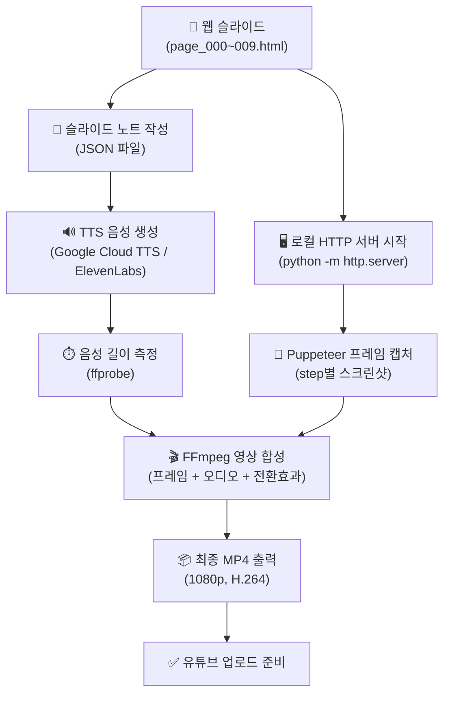

# 260322 웹기반 발표 슬라이드를 유튜브 동영상으로 변환하는 솔루션

## 📋 목차

1. [슬라이드 구조 분석](#1--슬라이드-구조-분석)
2. [웹 슬라이드 → 동영상 변환 솔루션](#2--웹-슬라이드--동영상-변환-솔루션)
3. [슬라이드 넘김만 있는 동영상의 유튜브 효과](#3--슬라이드-넘김만-있는-동영상의-유튜브-효과)
4. [나레이션 유무 비교](#4--나레이션-유무-비교)
5. [TTS 솔루션 추천](#5--tts-솔루션-추천)
6. [유사 채널/솔루션 사례](#6--유사-채널솔루션-사례)
7. [추천 파이프라인 설계](#7--추천-파이프라인-설계)
8. [최종 결론](#8--최종-결론)

---

## 1. 🔍 슬라이드 구조 분석

### 1.1 대상 슬라이드 개요

분석 대상: `C:\Users\hhd20\project\hhddoc\260322_0100_slide_test\`

| 항목 | 내용 |
|------|------|
| **주제** | 한경 미국증시 실시간 AI 콘텐츠 발표 슬라이드 |
| **슬라이드 수** | 10장 (page_000.html ~ page_009.html) |
| **구성 기술** | HTML5 + Tailwind CSS + Chart.js + Mermaid.js |
| **네비게이션** | 키보드(Space/Arrow), 마우스 클릭 기반 step 진행 |
| **해상도** | 16:9 aspect ratio, 반응형 (min(96vw, calc(96vh * 16/9))) |
| **폰트** | D2Coding (모노스페이스), Material Symbols Rounded |
| **테마** | 다크 테마 (배경 #0a0f14, 텍스트 #e9eef6, 액센트 #5fd1c3) |

### 1.2 핵심 아키텍처 특성

```
index.html (런처)
    |
    +-- common.css (공통 스타일, CSS 변수, 애니메이션)
    +-- common.js  (step 기반 진행 엔진, 차트/Mermaid 렌더)
    |
    +-- page_000.html ~ page_009.html (각 슬라이드)
         |
         +-- data-step="0~4" (슬라이드 내 순차 노출 요소)
         +-- Chart.js canvas (data-chart JSON 기반 차트)
         +-- Mermaid flowchart (코드 블록 기반 다이어그램)
         +-- SVG 삽화 (assets/svg/)
```

### 1.3 동영상 변환 시 고려해야 할 특성

| 특성 | 설명 | 변환 난이도 |
|------|------|------------|
| **step 기반 애니메이션** | data-step 속성으로 요소가 순차 노출, CSS `reveal` 애니메이션(opacity + translateY) | 중 |
| **Chart.js 동적 차트** | canvas 기반 차트가 step에 따라 렌더링 | 중 |
| **Mermaid 다이어그램** | SVG로 런타임 렌더링되는 flowchart | 중 |
| **CDN 의존성** | Tailwind, Chart.js, Mermaid, Google Fonts 모두 CDN 로드 | 하 (네트워크 필요) |
| **페이지 간 네비게이션** | href 기반 페이지 이동 (SPA가 아닌 MPA 구조) | 상 |
| **HUD 오버레이** | 진행률 바, 도트 인디케이터, 힌트 텍스트 | 하 (제거/유지 선택) |

---

## 2. 🎬 웹 슬라이드 → 동영상 변환 솔루션

### 2.1 솔루션 비교 종합표

| 솔루션 | 접근 방식 | 출력 품질 | 난이도 | 애니메이션 지원 | 비용 |
|--------|-----------|-----------|--------|----------------|------|
| **Puppeteer + FFmpeg** | 브라우저 스크린샷 → 프레임 합성 | ⭐⭐⭐⭐⭐ (8K까지) | 중상 | 완벽 (모든 CSS/JS) | 무료 |
| **Playwright 녹화** | 브라우저 내장 녹화 | ⭐⭐⭐⭐ | 중 | 완벽 | 무료 |
| **FFmpeg 이미지 슬라이드쇼** | 정적 이미지 → 전환 효과 | ⭐⭐⭐ | 하 | 제한적 (xfade만) | 무료 |
| **Remotion (React)** | React 컴포넌트 → 비디오 렌더 | ⭐⭐⭐⭐⭐ | 중상 | 완벽 (React 기반) | 무료(OSS) |
| **Slidev export** | Markdown → PDF/PNG 내보내기 | ⭐⭐⭐ | 하 | 제한적 | 무료 |
| **SaaS (Lumen5 등)** | 클라우드 기반 자동 변환 | ⭐⭐⭐⭐ | 하 | 템플릿 기반 | 유료 |

### 2.2 솔루션별 상세 분석

#### 🥇 A. Puppeteer + FFmpeg (가장 적합한 솔루션)

사용자의 기존 HTML 슬라이드와 **가장 호환성이 높은 솔루션**이다. 기존 HTML/CSS/JS를 그대로 브라우저에서 렌더링하고, 프레임 단위로 캡처하여 동영상을 합성한다.

**핵심 파이프라인 (3단계)**

```
[웹 슬라이드 렌더링] → [Puppeteer 프레임 캡처] → [FFmpeg 비디오 인코딩]
     (Chrome)              (page.screenshot)         (libx264 MP4)
```

**기술 구현 핵심**

1. **Puppeteer가 각 슬라이드 페이지를 순회**하며, `page.evaluate()`로 step을 순차적으로 진행
2. 각 step 상태에서 `page.screenshot({type: 'png'})`으로 프레임 캡처
3. step 간 대기 시간으로 애니메이션 완료 보장 (CSS reveal 애니메이션 350ms)
4. 캡처된 프레임을 FFmpeg의 `image2pipe`로 스트리밍하여 실시간 인코딩

**참고 구현체**: [robinz.in - Convert an HTML5 slideshow to a video](https://robinz.in/convert-an-html5-slideshow-to-a-video/)

이 블로그에서는 Puppeteer runner와 FFmpeg executer를 child_process로 분리하여, Puppeteer stdout을 FFmpeg stdin으로 파이프하는 구조를 소개한다. 이렇게 하면 디스크에 개별 이미지를 저장하지 않고 실시간으로 영상을 생성할 수 있다.

**FFmpeg 인코딩 설정 예시**

```bash
ffmpeg -y -framerate 30 -f image2pipe -i - \
  -c:v libx264 -pix_fmt yuv420p -crf 20 \
  -preset medium -movflags +faststart \
  output.mp4
```

| 파라미터 | 설명 |
|----------|------|
| `-framerate 30` | 30fps (슬라이드 동영상에는 24~30fps 적합) |
| `-crf 20` | 품질 설정 (18=높음, 23=기본, 28=낮음) |
| `-preset medium` | 인코딩 속도/품질 균형 |
| `-movflags +faststart` | 유튜브 스트리밍 호환성 |

**장점**
- 기존 HTML 슬라이드를 **수정 없이** 그대로 사용 가능
- Chart.js, Mermaid.js 등 동적 요소 완벽 렌더링
- CSS 애니메이션(reveal) 캡처 가능
- 해상도 제한 없음 (1080p ~ 8K)

**단점**
- Node.js + Puppeteer + FFmpeg 설치 필요
- step 진행 타이밍을 스크립트로 제어해야 함
- MPA 구조(페이지 간 이동)에 대한 네비게이션 핸들링 필요

> 참고: [From HTML to 8K Video (Medium)](https://medium.com/@BBSRGUY/from-html-to-8k-video-turning-websites-web-animations-into-cinematic-movies-with-puppeteer-34c3b6d1349f) - Puppeteer + FFmpeg + AI 업스케일링으로 1080p 노트북에서 8K 영상까지 생성 가능

#### 🥈 B. Playwright 내장 녹화

Playwright는 테스트 용도로 설계된 브라우저 자동화 도구이지만, 내장 비디오 녹화 기능을 제공한다.

```javascript
const context = await browser.newContext({
  recordVideo: {
    dir: './videos/',
    size: { width: 1920, height: 1080 }
  }
});
```

**장점**
- 설정이 간단 (recordVideo 옵션 한 줄)
- WebM 형식으로 자동 저장

**단점**
- Puppeteer 대비 프레임 제어가 덜 세밀함
- WebM 출력 → MP4 변환 추가 단계 필요
- 녹화 품질 조정 옵션이 제한적

> 참고: [Playwright Videos Documentation](https://playwright.dev/docs/videos)

#### 🥉 C. FFmpeg 이미지 시퀀스 → 슬라이드쇼

각 슬라이드를 정적 이미지(PNG)로 캡처한 후, FFmpeg의 xfade 필터로 전환 효과를 넣어 동영상을 생성한다.

**기본 슬라이드쇼 명령**

```bash
ffmpeg -framerate 1/5 -i slide_%03d.png \
  -r 25 -c:v libx264 -pix_fmt yuv420p \
  output_basic.mp4
```

**xfade 전환 효과 적용 (40+ 트랜지션 지원)**

```bash
ffmpeg \
  -loop 1 -t 5 -i slide_000.png \
  -loop 1 -t 5 -i slide_001.png \
  -loop 1 -t 5 -i slide_002.png \
  -filter_complex \
  "[0][1]xfade=transition=fade:duration=1:offset=4[f0]; \
   [f0][2]xfade=transition=slideleft:duration=1:offset=8[f1]" \
  -map "[f1]" -r 25 -pix_fmt yuv420p -vcodec libx264 \
  output_xfade.mp4
```

| xfade 전환 효과 예시 | 설명 |
|----------------------|------|
| `fade` | 페이드 인/아웃 |
| `slideleft` / `slideright` | 슬라이드 밀기 |
| `circlecrop` | 원형 마스크 전환 |
| `pixelize` | 픽셀화 전환 |
| `wipeleft` | 좌측 와이프 |
| `dissolve` | 디졸브 |

**장점**
- 가장 간단한 구현 (이미지만 있으면 됨)
- 다양한 전환 효과 내장
- 처리 속도 빠름

**단점**
- step 내 애니메이션 표현 불가 (정적 스냅샷만)
- Chart.js/Mermaid 동적 요소의 렌더링 타이밍 문제
- xfade 사용 시 모든 입력 이미지 해상도가 동일해야 함

> 참고: [FFmpeg Slideshow Guide (Bannerbear)](https://www.bannerbear.com/blog/how-to-create-a-slideshow-from-images-with-ffmpeg/)

#### D. Remotion (React 기반 프로그래매틱 비디오)

React 컴포넌트를 프레임 단위로 렌더링하여 비디오를 생성하는 프레임워크이다. 기존 HTML 슬라이드를 React로 **재구성**해야 한다는 점이 핵심 차이다.

```
[기존 HTML 슬라이드] → [React 컴포넌트로 변환] → [Remotion 렌더링] → [MP4]
```

**2Slides + Remotion 파이프라인 (참고)**

| 단계 | 내용 |
|------|------|
| 1 | 슬라이드 이미지 생성 (001.jpg, 002.jpg...) |
| 2 | 나레이션 음성 생성 (001.mp3, 002.mp3...) |
| 3 | Remotion 프로젝트에서 시퀀싱 (슬라이드 duration = 오디오 길이 + 패딩) |
| 4 | H.264, 1080p, 8~12 Mbps로 렌더링 |

**핵심 스펙**: 크로스페이드 6~12 프레임, 배경 음악 -28~-32dB, 오디오 정규화 -16 LUFS

**장점**
- 프로그래매틱 제어력 최강 (React의 모든 기능 활용)
- 전환 효과, 타이밍, 오디오 동기화 정밀 제어
- 서버리스 렌더링 지원 (Lambda)

**단점**
- 기존 HTML을 React로 **재작성** 필요 (가장 큰 단점)
- React + Remotion 학습 곡선
- 초기 설정 시간이 가장 김

> 참고: [2Slides + Remotion 파이프라인 (DEV Community)](https://dev.to/2slide_zhou_d21a141aa59f6/slides-narration-video-best-practices-2slides-remotion-from-one-prompt-to-a-ready-to-share-mp4-44gb)

#### E. Slidev Export

Slidev는 Markdown 기반 발표 도구로, `slidev export` 명령으로 PDF/PNG/PPTX 내보내기를 지원한다.

```bash
slidev export --format png --with-clicks
```

**한계**: 사용자의 슬라이드는 Slidev 형식이 아닌 **커스텀 HTML**이므로, Slidev로 마이그레이션해야 사용 가능. 비디오 직접 내보내기는 미지원이며, PNG 내보내기 후 FFmpeg으로 합성해야 한다.

> 참고: [Slidev Exporting Guide](https://sli.dev/guide/exporting.html)

---

## 3. 📺 슬라이드 넘김만 있는 동영상의 유튜브 효과

### 3.1 유튜브 알고리즘이 중시하는 지표

유튜브 알고리즘은 2025-2026년 기준으로 다음 지표를 핵심으로 평가한다:

| 지표 | 가중치 | 나레이션 없는 슬라이드 영향 |
|------|--------|---------------------------|
| **시청 지속시간 (Watch Time)** | ⭐⭐⭐⭐⭐ | ❌ 매우 불리 - 텍스트만 읽히면 이탈률 급증 |
| **클릭률 (CTR)** | ⭐⭐⭐⭐ | ⚠️ 썸네일/제목에 따라 다름 |
| **시청자 유지율 (Retention)** | ⭐⭐⭐⭐⭐ | ❌ 불리 - 평균 유지율 23.7%, 55% 시청자가 60초 내 이탈 |
| **참여도 (Likes/Comments)** | ⭐⭐⭐ | ❌ 불리 - 음성 없으면 감정적 연결 약함 |
| **자동 자막/전사** | ⭐⭐⭐ | ❌ 불가 - 음성이 없으므로 자동 자막 생성 불가 |

> 참고: [YouTube Algorithm 2025 (Dataslayer)](https://www.dataslayer.ai/blog/youtube-algorithm-2025-how-to-get-your-videos-recommended) | [YouTube SEO Guide 2026 (SocialBee)](https://socialbee.com/blog/youtube-seo/)

### 3.2 나레이션 없는 슬라이드 동영상의 현실

**결론: 나레이션 없는 슬라이드 동영상은 유튜브에서 효과가 극히 제한적이다.**

근거:
- 유튜브 알고리즘은 **음성 전사(transcript)**를 분석하여 영상 주제를 파악한다. 나레이션이 없으면 제목/설명/태그에만 의존해야 하므로 SEO 불리
- 시청자는 **"읽기"보다 "듣기"**를 위해 유튜브를 방문한다. 텍스트만 있는 영상은 블로그 포스트와 차별점이 없음
- 유튜브 내부 데이터에 따르면 **시청자 유지율이 가장 중요한 추천 시그널**인데, 나레이션 없는 슬라이드는 유지율이 현저히 낮음

### 3.3 SlideShare vs YouTube 비교

| 항목 | YouTube | SlideShare |
|------|---------|-----------|
| **월간 방문** | ~47억 회 (2026 기준) | 트래픽 감소 추세 (2025 이후 데이터 불명확) |
| **콘텐츠 형태** | 동영상 (음성 + 영상) | 정적 프레젠테이션 (PDF/PPT) |
| **검색 노출** | Google 검색 결과 상위 노출, AI Overview 통합 | Organic Search 80.17% 의존 |
| **모바일 경험** | 네이티브 앱, 자동 재생 | 웹 기반, 능동적 넘김 필요 |
| **수익화** | 광고 수익 가능 | 불가 |
| **SEO 가치** | Google AI Overview에 YouTube 영상 직접 포함 추세 | 점차 감소 |

> YouTube가 Google AI Overview 시대에서 SEO 가치가 더욱 증가하고 있다. "YouTube is no longer optional for SEO in the age of AI Overviews" - [Search Engine Land](https://searchengineland.com/youtube-seo-ai-overviews-467253)

---

## 4. 🎙️ 나레이션 유무 비교

### 4.1 데이터 기반 비교

| 지표 | 나레이션 없음 | 나레이션 있음 (인간) | AI 나레이션 (고품질) | AI 나레이션 (저품질) |
|------|-------------|-------------------|-------------------|-------------------|
| **60초 내 이탈률** | ~70% | ~45% | ~50% | ~80% |
| **평균 시청 유지율** | 15~18% | 30~40% | 25~35% | 10~15% |
| **시청시간 배수** | 1x (기준) | 3x | 2~2.5x | 0.5x |
| **자동 자막 생성** | ❌ 불가 | ✅ 완벽 | ✅ 가능 | ✅ 가능 (오류 다수) |
| **알고리즘 키워드 인식** | 제목/설명만 | 음성+제목+설명 | 음성+제목+설명 | 음성+제목+설명 |

> 참고: [2025 YouTube Audience Retention Report (Retention Rabbit)](https://www.retentionrabbit.com/blog/2025-youtube-audience-retention-benchmark-report)

### 4.2 핵심 인사이트

**"단조로운 AI 나레이션은 처음 45초 내에 35% 시청자 이탈을 유발한다"**

반면, **감정적으로 공감되는 음성**의 효과:
- 시청자 유지율 **34% 향상**
- 시청시간 **3배 증가**
- "AI 저품질 콘텐츠"로 인식되면 유지율 **70% 하락**

> 참고: [Retention Benchmarks for Animated YouTube Videos (Long Stories AI)](https://longstories.ai/blog/retention-benchmarks-animated-youtube-videos)

### 4.3 결론

```
나레이션 없음 <<< 저품질 AI 나레이션 <<< 고품질 AI 나레이션 < 인간 나레이션
     ❌              ❌❌               ✅ (권장)           ✅✅ (최적)
```

- **나레이션은 반드시 포함해야 한다** - 유튜브에서 의미 있는 트래픽을 얻으려면 필수
- **저품질 AI 나레이션은 없는 것보다 나쁘다** - "AI slop"으로 인식되면 알고리즘 페널티
- **고품질 AI TTS가 현실적 선택** - ElevenLabs 수준의 자연스러운 TTS 추천
- 슬라이드에 **발표 노트(speaker notes)**를 추가하여 TTS 원고로 활용하는 것이 효율적

---

## 5. 🔊 TTS(Text-to-Speech) 솔루션 추천

### 5.1 주요 TTS 서비스 종합 비교

| 서비스 | 영어 품질 | 한국어 품질 | 가격 (1M chars) | 음성 수 | 언어 수 | 지연시간 | 무료 티어 |
|--------|----------|-----------|----------------|---------|---------|---------|----------|
| **ElevenLabs** | ⭐⭐⭐⭐⭐ | ⭐⭐⭐⭐ | $300 | 1,200+ | 70+ | 400~800ms | 10K chars/월 |
| **OpenAI TTS** | ⭐⭐⭐⭐ | ⭐⭐⭐ | $15~30 | 13 | 30+ | 80~150ms | 없음 |
| **Google Cloud TTS** | ⭐⭐⭐⭐ | ⭐⭐⭐⭐ | $16 (Neural) | 220+ | 50+ | 150~300ms | 1M chars/월 |
| **Azure TTS** | ⭐⭐⭐⭐ | ⭐⭐⭐⭐ | $16 | 400+ | 140+ | 200~400ms | 500K chars/월 |
| **Amazon Polly** | ⭐⭐⭐ | ⭐⭐⭐ | $16 (Neural) | 60+ | 29 | 낮음 | 5M chars/월 (1년) |
| **Kokoro (오픈소스)** | ⭐⭐⭐⭐⭐ | ❌ | 무료 | 제한적 | 3~5 | 50~150ms | 완전 무료 |

> 참고: [Best TTS APIs in 2026 (Speechmatics)](https://www.speechmatics.com/company/articles-and-news/best-tts-apis-in-2025-top-12-text-to-speech-services-for-developers) | [TTS APIs Comparison 2026 (DEV Community)](https://dev.to/pocket_linguist/text-to-speech-in-2026-comparing-5-tts-apis-for-language-apps-606)

### 5.2 한국어 TTS 특화 분석

한국어 콘텐츠에서 **CJK(중국어/일본어/한국어) 품질**이 중요하다:

| 서비스 | CJK 품질 평가 | SSML 지원 | 발음 제어 | 한국어 특화 노트 |
|--------|-------------|-----------|----------|----------------|
| **Google Cloud TTS** | ⭐⭐⭐⭐ (Very Good) | 완전 지원 | IPA 음소 제어 | 한국어 WaveNet 음성 다수, 안정적 |
| **Azure TTS** | ⭐⭐⭐⭐ (Good) | 완전 지원 | IPA 음소 제어 | 140+ 언어 최다 지원, 커스텀 음성 |
| **ElevenLabs** | ⭐⭐⭐ (개선 중) | 제한적 | 제한적 | 한국 시장 진출 (MBC, Krafton 등과 협업) |
| **OpenAI TTS** | ⭐⭐⭐ (Poor~Fair) | 미지원 | 미지원 | 영어 최적화, 한국어는 부족 |

> ElevenLabs는 2025년 한국 시장에 적극 진출하여 MBC C&I, ESTsoft, Krafton, SBS 등과 협업 중이며, 한국어 품질을 지속 개선하고 있다.
> 참고: [ElevenLabs Korea Expansion](https://elevenlabs.io/blog/expanding-into-korea)

### 5.3 용도별 추천

| 용도 | 1순위 추천 | 2순위 추천 | 이유 |
|------|-----------|-----------|------|
| **한국어 나레이션** | Google Cloud TTS | Azure TTS | CJK 품질 최고, SSML 발음 제어 |
| **영어 나레이션** | ElevenLabs | OpenAI TTS | 자연스러움 최고, 감정 표현력 |
| **비용 최소화** | Google Cloud TTS | Amazon Polly | 무료 티어 넉넉 (1M chars/월) |
| **개발 편의성** | OpenAI TTS | ElevenLabs | API 간결, 낮은 지연시간 |
| **대량 생산** | Azure TTS | Google Cloud TTS | 가격 대비 성능, 커스텀 음성 |

### 5.4 슬라이드별 TTS 파이프라인


**슬라이드 노트 구조 예시**

```json
{
  "slides": [
    {
      "page": "page_000.html",
      "steps": [
        {"step": 0, "note": "안녕하세요, 한경 미국증시 실시간 AI 콘텐츠 발표를 시작하겠습니다."},
        {"step": 1, "note": "먼저 궁금한 점이 있습니다. 이 서비스가 인기가 있을까요?"},
        {"step": 2, "note": "실제로 유용할까요?"},
        {"step": 3, "note": "그리고 경제성은 맞을까요?"},
        {"step": 4, "note": "오늘은 시장성, 경쟁력, 기술 아키텍처, 비용, 실행 로드맵까지 압축해서 설명드리겠습니다."}
      ]
    }
  ]
}
```

**TTS 호출 예시 (Google Cloud TTS - Python)**

```python
from google.cloud import texttospeech

client = texttospeech.TextToSpeechClient()

synthesis_input = texttospeech.SynthesisInput(text="안녕하세요, 발표를 시작하겠습니다.")
voice = texttospeech.VoiceSelectionParams(
    language_code="ko-KR",
    name="ko-KR-Neural2-A",  # 한국어 Neural 음성
)
audio_config = texttospeech.AudioConfig(
    audio_encoding=texttospeech.AudioEncoding.MP3,
    speaking_rate=1.0,  # 140~170 WPM 권장
    pitch=0.0,
)

response = client.synthesize_speech(
    input=synthesis_input, voice=voice, audio_config=audio_config
)

with open("slide_000_step_0.mp3", "wb") as out:
    out.write(response.audio_content)
```

**TTS 호출 예시 (ElevenLabs - Python)**

```python
from elevenlabs import ElevenLabs

client = ElevenLabs(api_key="YOUR_API_KEY")

audio = client.text_to_speech.convert(
    voice_id="Korean_Voice_ID",
    text="안녕하세요, 발표를 시작하겠습니다.",
    model_id="eleven_multilingual_v2",
    output_format="mp3_44100_128",
)

with open("slide_000_step_0.mp3", "wb") as f:
    for chunk in audio:
        f.write(chunk)
```

---

## 6. 📡 유사 채널/솔루션 사례

### 6.1 슬라이드 기반 유튜브 채널 사례

| 채널/유형 | 형태 | 특징 | 월 수익 추정 |
|-----------|------|------|-------------|
| **Abhinav Rawal** | PPT 기반 설명 영상 | 슬라이드 + 나레이션, 기술/비즈니스 | - |
| **TopTechNow** | 기술 가이드 | 슬라이드쇼 + AI 나레이션, 1.5M+ 조회 | $10,000+ |
| **Urim Berisha** | PC 최적화 튜토리얼 | 슬라이드 + 화면 녹화, 5M+ 조회 | - |
| **Faceless Tech Channels** | 자동화 콘텐츠 | AI 스크립트 + AI 나레이션 + 스톡 영상 | 다양 |

> 참고: [Quora - YouTube channels using slideshow presentations](https://www.quora.com/What-are-some-examples-of-YouTube-channels-that-are-making-their-videos-based-on-PowerPoint-or-slideshow-video-presentations) | [Faceless YouTube Guide (Clippie AI)](https://clippie.ai/blog/ultimate-guide-to-faceless-youtube-automation-in-2025)

### 6.2 자동화 파이프라인 SaaS 도구

| 도구 | 유형 | 핵심 기능 | 가격 | 적합도 |
|------|------|----------|------|--------|
| **Lumen5** | 텍스트→영상 | 블로그/텍스트를 자동으로 슬라이드쇼 영상 변환 | $29/월~ | ⭐⭐⭐ |
| **Synthesia** | AI 아바타 | AI 아바타가 대본을 읽어주는 프레젠터 영상 | $29/월~ | ⭐⭐ |
| **Pictory** | 텍스트→영상 | 긴 글을 짧은 영상으로 자동 변환 | $23/월~ | ⭐⭐⭐ |
| **Flixier** | 온라인 편집기 | 브라우저 기반 슬라이드쇼 → MP4 변환 | 무료~ | ⭐⭐ |
| **VEED.IO** | 온라인 편집기 | 슬라이드 업로드 → 웹캠 녹화 합성 | 무료~ | ⭐⭐ |
| **Canva Video** | 디자인+영상 | 프레젠테이션 → 영상 내보내기 | 무료~ | ⭐⭐⭐ |

> 참고: [Lumen5 vs Synthesia Comparison](https://www.mootion.com/use-cases/en/compare/synthesia-vs-lumen) | [Faceless YouTube with AI Tools (Medium)](https://medium.com/@exploretechnology/start-a-faceless-youtube-channel-in-2025-with-ai-tools-d4744c912b3e)

### 6.3 개발자 친화적 도구

| 도구 | 기술 스택 | 설명 |
|------|-----------|------|
| **Remotion** | React + FFmpeg | 코드로 영상 제작, 가장 유연함 |
| **2Slides + Remotion** | AI + React | 프롬프트 한 번으로 슬라이드→나레이션→MP4 |
| **puppeteer-screen-recorder** | Node.js | Puppeteer 기반 녹화 라이브러리 |
| **puppeteer-capture** | Node.js | 프레임 단위 정밀 캡처 |
| **Slidev** | Vue.js + Markdown | Markdown→프레젠테이션→PNG/PDF |

---

## 7. 🏗️ 추천 파이프라인 설계

### 7.1 사용자 슬라이드에 최적화된 End-to-End 파이프라인

사용자의 슬라이드 특성(HTML5 + Tailwind + Chart.js + Mermaid + step 기반 진행)을 고려하면, **Puppeteer + FFmpeg + TTS** 조합이 가장 적합하다.



### 7.2 상세 파이프라인 (5단계)

#### 📌 Stage 1: 슬라이드 노트 준비

슬라이드별 발표 노트를 JSON으로 작성한다. 각 step에 대응하는 나레이션 텍스트를 포함한다.

```json
{
  "config": {
    "tts_provider": "google",
    "language": "ko-KR",
    "voice": "ko-KR-Neural2-A",
    "speaking_rate": 1.0,
    "output_resolution": "1920x1080",
    "fps": 30,
    "step_padding_ms": 300,
    "transition_type": "fade",
    "transition_duration_ms": 500
  },
  "slides": [
    {
      "page": "page_000.html",
      "title": "오프닝",
      "steps": [
        {"step": 0, "note": "SEC 공시를 한국어 스토리텔링으로 전환해 투자 의사결정 시간을 단축하는 서비스입니다.", "pause_after_ms": 500},
        {"step": 1, "note": "첫 번째 질문입니다. 이 서비스가 인기가 있을까요?", "pause_after_ms": 300},
        {"step": 2, "note": "두 번째, 실제로 유용할까요?", "pause_after_ms": 300},
        {"step": 3, "note": "세 번째, 경제성은 맞는가?", "pause_after_ms": 300},
        {"step": 4, "note": "오늘 발표에서 시장성부터 로드맵까지 모두 답변드리겠습니다.", "pause_after_ms": 800}
      ]
    }
  ]
}
```

#### 📌 Stage 2: TTS 음성 생성

```python
# generate_tts.py (개요)
import json
from pathlib import Path

def generate_all_narrations(config_path: str, output_dir: str):
    """슬라이드 노트 JSON을 읽어 각 step별 음성 파일 생성"""
    config = json.loads(Path(config_path).read_text(encoding="utf-8"))

    for slide in config["slides"]:
        for step_info in slide["steps"]:
            audio_path = f"{output_dir}/{slide['page']}_{step_info['step']:02d}.mp3"
            # TTS API 호출 (Google / ElevenLabs / Azure)
            synthesize_speech(
                text=step_info["note"],
                voice=config["config"]["voice"],
                output_path=audio_path
            )

    # 각 음성 파일의 duration 측정 (ffprobe)
    measure_durations(output_dir)
```

#### 📌 Stage 3: Puppeteer 프레임 캡처

```javascript
// capture_frames.js (개요)
const puppeteer = require('puppeteer');
const fs = require('fs');

async function captureSlideFrames(config) {
  const browser = await puppeteer.launch({
    headless: true,
    args: ['--window-size=1920,1080']
  });

  const page = await browser.newPage();
  await page.setViewport({ width: 1920, height: 1080 });

  for (const slide of config.slides) {
    // 각 슬라이드 페이지로 이동
    await page.goto(`http://localhost:8000/${slide.page}`, {
      waitUntil: 'networkidle0'
    });

    // HUD 오버레이 제거 (선택적)
    await page.evaluate(() => {
      document.getElementById('common-root').style.display = 'none';
    });

    for (const stepInfo of slide.steps) {
      // step 진행 (CSS reveal 애니메이션 대기)
      await page.evaluate((targetStep) => {
        // data-step 요소에 step-visible 클래스 토글
        document.querySelectorAll('[data-step]').forEach(node => {
          const stepVal = Number(node.dataset.step || '0');
          node.classList.toggle('step-visible', stepVal <= targetStep);
        });
      }, stepInfo.step);

      // CSS 애니메이션 완료 대기 (350ms reveal + 여유)
      await new Promise(r => setTimeout(r, 500));

      // 프레임 캡처
      const framePath = `./frames/${slide.page}_step${stepInfo.step}.png`;
      await page.screenshot({ path: framePath, type: 'png' });
    }
  }

  await browser.close();
}
```

#### 📌 Stage 4: FFmpeg 영상 합성

```bash
#!/bin/bash
# build_video.sh (개요)

# 1. 각 step 프레임을 음성 길이만큼 반복하여 비디오 세그먼트 생성
for frame in frames/*.png; do
  duration=$(cat "durations/${frame%.png}.txt")  # 음성 길이 (초)
  audio_file="audio/${frame%.png}.mp3"
  segment_file="segments/${frame%.png}.mp4"

  ffmpeg -loop 1 -t "$duration" -i "$frame" \
    -i "$audio_file" \
    -c:v libx264 -tune stillimage -pix_fmt yuv420p \
    -c:a aac -b:a 192k \
    -shortest "$segment_file"
done

# 2. 모든 세그먼트를 xfade로 연결
ffmpeg -i seg_000.mp4 -i seg_001.mp4 -i seg_002.mp4 ... \
  -filter_complex \
  "[0][1]xfade=transition=fade:duration=0.5:offset=...[f0]; \
   [f0][2]xfade=transition=fade:duration=0.5:offset=...[f1]; ..." \
  -c:v libx264 -crf 20 -preset medium \
  -movflags +faststart \
  final_output.mp4
```

#### 📌 Stage 5: 후처리 및 출력

| 후처리 항목 | 설명 | 명령 |
|------------|------|------|
| 오디오 정규화 | -16 LUFS (유튜브 권장) | `ffmpeg -i input.mp4 -af loudnorm=I=-16 output.mp4` |
| 배경 음악 추가 | -28~-32 dB로 믹싱 | `ffmpeg -i video.mp4 -i bgm.mp3 -filter_complex amix output.mp4` |
| 해상도 확인 | 1920x1080 (16:9) | `ffprobe -v error -select_streams v:0 -show_entries stream=width,height` |
| 메타데이터 | 제목, 설명 | `ffmpeg -i input.mp4 -metadata title="..." output.mp4` |

### 7.3 대안 파이프라인 (간소화 버전)

기존 step 애니메이션을 포기하고 **정적 이미지 기반**으로 빠르게 만들 경우:

```
Puppeteer (전체 step 완료 후 1장 캡처) → FFmpeg xfade 슬라이드쇼 + TTS 오디오
```

이 방식은 10장 슬라이드 기준 약 30분 내에 영상 제작이 가능하다.

### 7.4 기술 스택 요약

```
📦 필수 설치
├── Node.js 18+ (Puppeteer 실행)
├── Puppeteer (npm install puppeteer)
├── FFmpeg (시스템 설치)
├── Python 3.10+ (TTS 스크립트, HTTP 서버)
└── TTS SDK (google-cloud-texttospeech 또는 elevenlabs)

📁 프로젝트 구조
├── slides/              # 기존 웹 슬라이드 (page_000~009.html)
├── notes.json           # 슬라이드별 나레이션 텍스트
├── generate_tts.py      # TTS 음성 생성 스크립트
├── capture_frames.js    # Puppeteer 프레임 캡처 스크립트
├── build_video.sh       # FFmpeg 영상 합성 스크립트
├── audio/               # 생성된 TTS 음성 파일
├── frames/              # 캡처된 프레임 이미지
├── segments/            # 중간 영상 세그먼트
└── output/              # 최종 MP4 출력
```

---

## 8. 🎯 최종 결론

### 8.1 핵심 요약

| 질문 | 답변 |
|------|------|
| 슬라이드만 넘기는 영상이 유튜브에서 의미가 있는가? | **❌ 거의 없다.** 나레이션 없으면 SEO/유지율/참여도 모두 불리 |
| 나레이션은 필수인가? | **✅ 사실상 필수.** 고품질 AI TTS로도 충분한 효과 |
| 어떤 TTS를 쓸 것인가? | **한국어: Google Cloud TTS 또는 Azure TTS** / 영어: ElevenLabs |
| 어떤 변환 솔루션이 최적인가? | **Puppeteer + FFmpeg** (기존 HTML 슬라이드 수정 불필요) |
| 비용은 얼마나 드는가? | 도구 무료 (오픈소스), TTS만 유료 (Google 무료 티어 1M chars/월) |

### 8.2 권장 실행 순서

```
1단계: 슬라이드 10장에 대한 나레이션 노트 작성 (1~2시간)
    ↓
2단계: Google Cloud TTS로 한국어 음성 생성 (무료 티어 활용, 30분)
    ↓
3단계: Puppeteer로 각 step 프레임 캡처 (자동화, 10분)
    ↓
4단계: FFmpeg로 프레임 + 오디오 합성 (자동화, 5분)
    ↓
5단계: 후처리 (오디오 정규화, 배경 음악) → MP4 완성
    ↓
6단계: 유튜브 업로드 (제목/설명/태그/썸네일 최적화)
```

### 8.3 향후 자동화 확장

이 파이프라인이 안정화되면, 새로운 슬라이드가 추가될 때마다 **자동으로 동영상을 생성**하는 CI/CD 파이프라인으로 확장할 수 있다:

```
[슬라이드 HTML 커밋] → [GitHub Actions] → [TTS 생성] → [Puppeteer 캡처] → [FFmpeg 합성] → [MP4 아티팩트 저장]
```

---

## 📚 참고 자료

### 변환 솔루션
- [Convert an HTML5 slideshow to a video - robinz.in](https://robinz.in/convert-an-html5-slideshow-to-a-video/)
- [From HTML to 8K Video - Medium (BBSRGUY)](https://medium.com/@BBSRGUY/from-html-to-8k-video-turning-websites-web-animations-into-cinematic-movies-with-puppeteer-34c3b6d1349f)
- [FFmpeg Slideshow from Images - Bannerbear](https://www.bannerbear.com/blog/how-to-create-a-slideshow-from-images-with-ffmpeg/)
- [FFmpeg xfade Filter - OTTVerse](https://ottverse.com/crossfade-between-videos-ffmpeg-xfade-filter/)
- [Puppeteer Screen Recorder - GitHub](https://github.com/prasanaworld/puppeteer-screen-recorder)
- [Playwright Videos Documentation](https://playwright.dev/docs/videos)
- [Remotion Official](https://www.remotion.dev/)
- [2Slides + Remotion Pipeline - DEV Community](https://dev.to/2slide_zhou_d21a141aa59f6/slides-narration-video-best-practices-2slides-remotion-from-one-prompt-to-a-ready-to-share-mp4-44gb)
- [Slidev Exporting Guide](https://sli.dev/guide/exporting.html)

### 유튜브 SEO/알고리즘
- [YouTube Algorithm 2025 - Dataslayer](https://www.dataslayer.ai/blog/youtube-algorithm-2025-how-to-get-your-videos-recommended)
- [YouTube SEO Guide 2026 - SocialBee](https://socialbee.com/blog/youtube-seo/)
- [YouTube SEO in AI Overviews Era - Search Engine Land](https://searchengineland.com/youtube-seo-ai-overviews-467253)
- [YouTube SEO - Semrush](https://www.semrush.com/blog/youtube-seo/)
- [Ultimate YouTube SEO Guide 2026 - Keyword Tool Dominator](https://www.keywordtooldominator.com/youtube-seo)

### 나레이션/시청 지속시간
- [2025 YouTube Audience Retention Report - Retention Rabbit](https://www.retentionrabbit.com/blog/2025-youtube-audience-retention-benchmark-report)
- [Retention Benchmarks for Animated Videos - Long Stories AI](https://longstories.ai/blog/retention-benchmarks-animated-youtube-videos)
- [Best AI Voices for YouTube - Narration Box](https://narrationbox.com/blog/best-ai-voices-for-youtube-videos-in-2025)

### TTS 비교
- [Best TTS APIs in 2026 - Speechmatics](https://www.speechmatics.com/company/articles-and-news/best-tts-apis-in-2025-top-12-text-to-speech-services-for-developers)
- [TTS APIs Comparison 2026 - DEV Community](https://dev.to/pocket_linguist/text-to-speech-in-2026-comparing-5-tts-apis-for-language-apps-606)
- [ElevenLabs vs OpenAI TTS](https://elevenlabs.io/blog/elevenlabs-vs-openai)
- [ElevenLabs Korea Expansion](https://elevenlabs.io/blog/expanding-into-korea)
- [ElevenLabs Korean TTS](https://elevenlabs.io/text-to-speech/korean)
- [Cloud TTS Voice Comparison](https://cloudtts.com/compare-voices/)

### 유사 채널/SaaS
- [Faceless YouTube Automation Guide - Clippie AI](https://clippie.ai/blog/ultimate-guide-to-faceless-youtube-automation-in-2025)
- [Creating Slideshow Videos for Faceless Channel - TelescopeGrowth](https://www.telescopegrowth.com/blog/creating-slideshow-presentation-videos-for-your-faceless-youtube-channel)
- [Lumen5 vs Synthesia - Mootion](https://www.mootion.com/use-cases/en/compare/synthesia-vs-lumen)
- [Start Faceless YouTube with AI - Medium](https://medium.com/@exploretechnology/start-a-faceless-youtube-channel-in-2025-with-ai-tools-d4744c912b3e)
- [Faceless YouTube Channel Ideas 2025 - InVideo](https://invideo.io/blog/faceless-youtube-channel-ideas/)

---

## 💬 사용자 질문 프롬프트

```text
# 리서치 주제: 웹기반 발표 슬라이드를 유튜브 동영상으로 변환하는 솔루션

## 배경
- 사용자가 웹기반 발표 슬라이드(HTML/CSS/JS)를 이미 보유
- 참고 슬라이드 위치: C:\Users\hhd20\project\hhddoc\260322_0100_slide_test\ (먼저 이 디렉토리의 파일들을 읽어서 어떤 형태의 슬라이드인지 파악할 것)
- 이 슬라이드들을 동영상으로 변환하여 유튜브에 업로드하고 싶음
- 유튜브 업로드 자동화는 불필요, 동영상 파일 출력만 필요

## 리서치 항목 (모두 깊이있게 조사)

### 1. 웹 슬라이드 → 동영상 변환 솔루션
- 슬라이드 이미지를 일정 간격으로 배치하여 동영상으로 렌더링하는 방법
- 슬라이드 넘김 애니메이션(fade, slide 등) 포함 가능한 솔루션
- Puppeteer/Playwright 기반 녹화, FFmpeg 기반 이미지→영상 변환, Remotion(React), Slidev export 등
- 각 솔루션의 장단점, 난이도, 출력 품질 비교

### 2. 슬라이드 넘김만 있는 동영상의 유튜브 효과
- 나레이션 없이 슬라이드만 넘기는 동영상이 유튜브에서 의미가 있는지?
- 유튜브 SEO/알고리즘 관점에서의 효과
- SlideShare vs YouTube 트래픽 비교 관점

### 3. 나레이션 유무 비교
- 나레이션 없는 슬라이드 동영상 vs 나레이션 포함 동영상
- 유튜브 시청 지속시간, 참여도 관점에서 어느 것이 나은지
- 자동 자막 생성 관점

### 4. TTS(Text-to-Speech) 솔루션 추천
- 나레이션이 필요하다면 자동 TTS 솔루션
- 자연스럽고 널리 사용되는 TTS: Google Cloud TTS, Amazon Polly, ElevenLabs, OpenAI TTS, Microsoft Azure TTS, Coqui 등
- 한국어/영어 지원 여부, 가격, 품질, API 접근성 비교
- 슬라이드별 노트를 TTS로 변환하여 동영상과 합성하는 파이프라인

### 5. 유사 채널/솔루션 사례
- 웹 기반 지식 콘텐츠를 유튜브에 자동화/대량 업로드하는 채널 사례
- 프로그래밍/기술 콘텐츠를 슬라이드 기반으로 올리는 유튜브 채널
- 이런 자동화 파이프라인을 제공하는 도구나 SaaS

### 6. 추천 파이프라인 설계
- 사용자의 웹 슬라이드 구조를 분석한 후, 가장 적합한 end-to-end 파이프라인 제안
- 웹슬라이드 → 스크린샷 캡처 → 동영상 렌더링 (+ 선택적 TTS 나레이션) → MP4 출력
```
