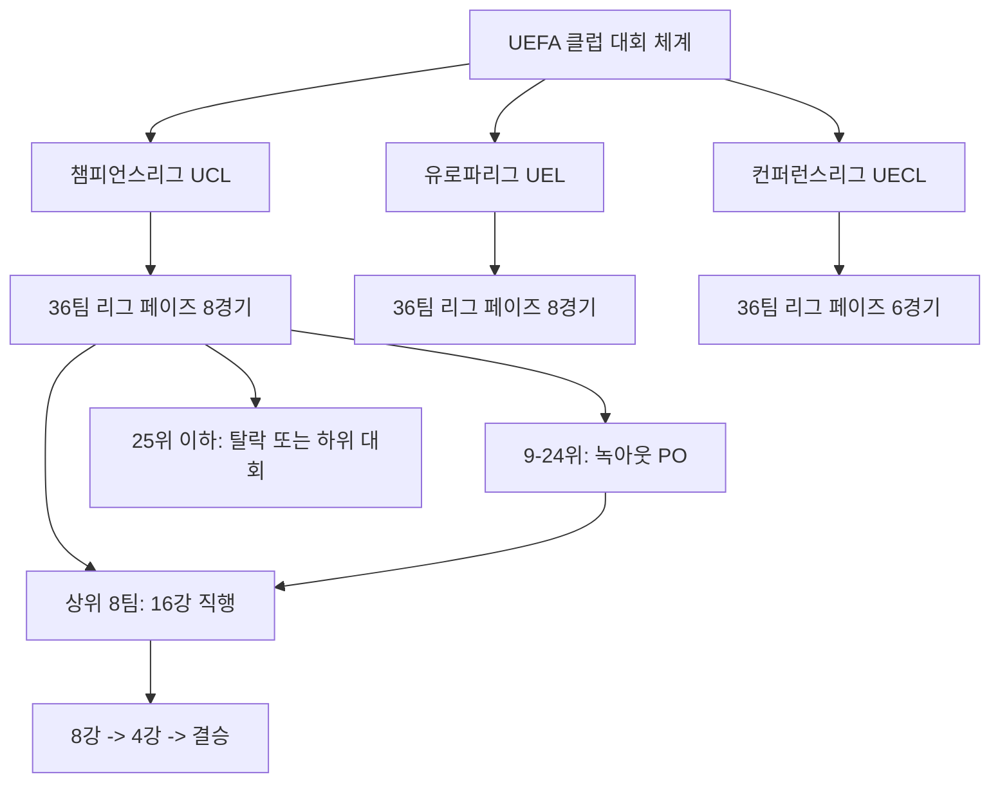
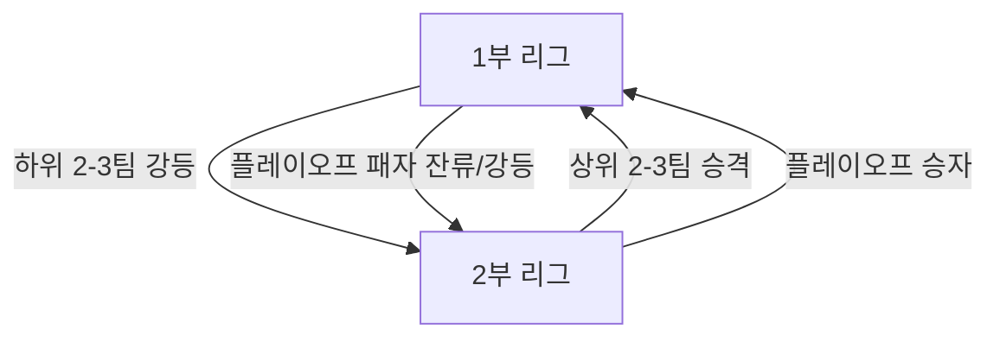
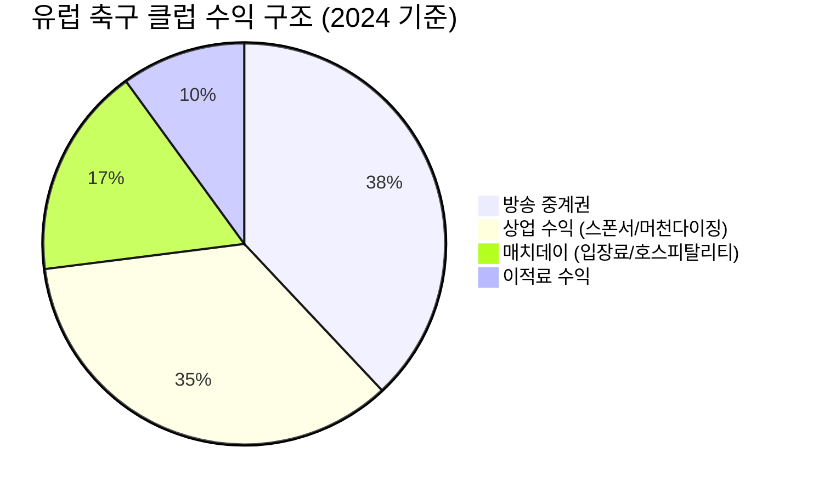
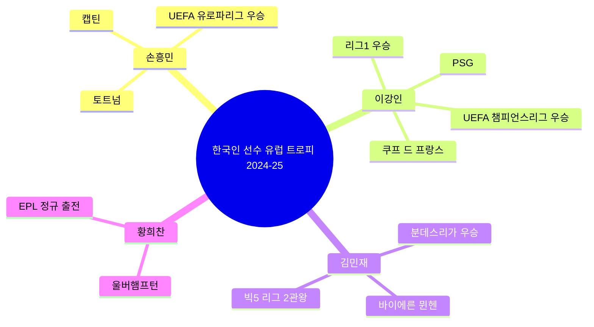
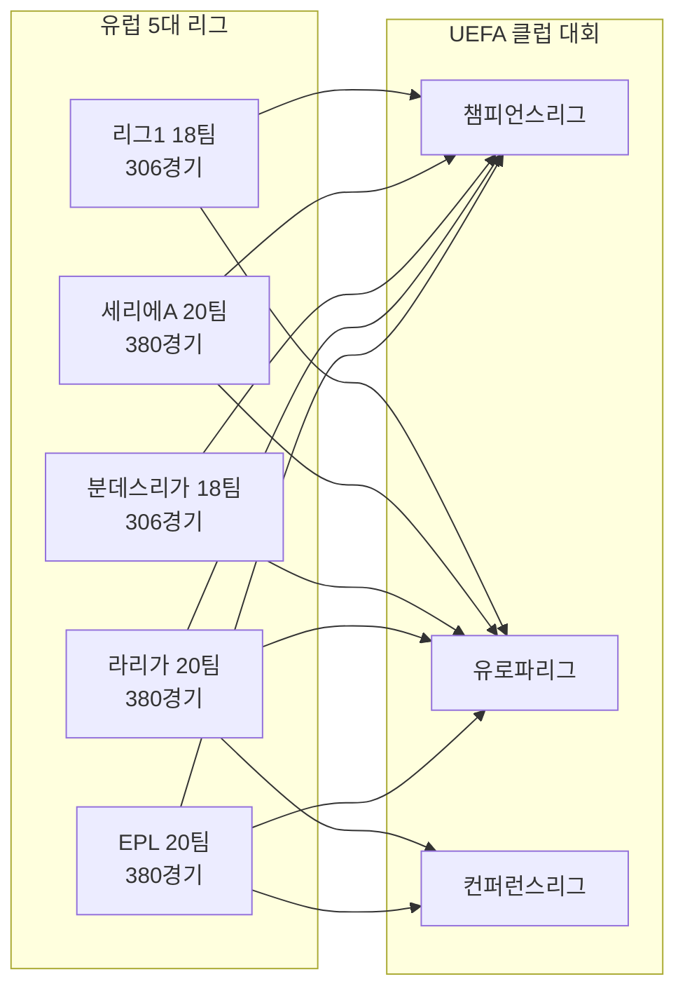

# 260322 유럽축구 5대 리그 종합 리서치

> **작성일**: 2026-03-22
> **대상**: EPL(잉글랜드), 라리가(스페인), 분데스리가(독일), 세리에A(이탈리아), 리그1(프랑스)
> **시즌 기준**: 2024-2025 / 2025-2026

---

## 목차

1. [메이저 대회 (UEFA 클럽 대회 & 국가 대회)](#1-메이저-대회)
2. [메이저 리그 (5대 리그 구조 & 시즌 일정)](#2-메이저-리그-5대-리그-구조--시즌-일정)
3. [승격/강등 시스템](#3-승격강등-시스템)
4. [구단 비즈니스 모델 (BM)](#4-구단-비즈니스-모델-bm)
5. [각 리그별 주요 팀 소개](#5-각-리그별-주요-팀-소개)
6. [팀별 주요 선수 소개 (2024-2025)](#6-팀별-주요-선수-소개-2024-2025)
7. [주요 선수별 연봉 & 실력 (한국인 선수 포함)](#7-주요-선수별-연봉--실력-한국인-선수-포함)

---

## 1. 메이저 대회

유럽 축구의 대회 체계는 크게 **클럽 대회**와 **국가 대항전**으로 나뉜다.

### 1-1. UEFA 클럽 대회 (3대 대회)

2024-25 시즌부터 UEFA 클럽 대회는 기존 그룹 스테이지를 폐지하고, **36팀 리그 페이즈** 방식으로 전면 개편되었다.

#### UEFA 챔피언스리그 (UCL)

| 항목 | 내용 |
|------|------|
| **참가팀** | 36팀 (리그 페이즈) |
| **포맷** | 각 팀이 8개 상대와 홈/원정 각 4경기씩 총 8경기 |
| **결선** | 녹아웃 플레이오프 -> 16강 -> 8강 -> 4강 -> 결승 |
| **2024-25 우승** | **파리 생제르맹 (PSG)** - 인테르 밀란 5-0 격파 (뮌헨 알리안츠 아레나, 2025.5.31) |
| **2025-26 결승** | 2026년 5월 30일, 부다페스트 |

> PSG는 클럽 역사상 **최초 챔피언스리그 우승**을 달성하며, 프랑스 클럽으로는 1993년 마르세유 이후 두 번째 우승팀이 되었다. 루이스 엔리게 감독은 펩 과르디올라에 이어 **트레블을 두 번 달성한 두 번째 감독**이 되었다.

#### 2025-26 챔피언스리그 주요 일정

| 라운드 | 일정 |
|--------|------|
| 리그 페이즈 MD1 | 2025년 9월 16-18일 |
| 리그 페이즈 MD8 | 2026년 1월 28일 |
| 녹아웃 PO | 2026년 2월 17-25일 |
| 16강 | 2026년 3월 10-18일 |
| 8강 | 2026년 4월 7-15일 |
| 4강 | 2026년 4월 28일 ~ 5월 6일 |
| **결승** | **2026년 5월 30일 (부다페스트)** |

#### UEFA 유로파리그 (UEL)

| 항목 | 내용 |
|------|------|
| **참가팀** | 36팀 (리그 페이즈) |
| **포맷** | 챔피언스리그와 동일한 36팀 리그 페이즈 |
| **2024-25 우승** | **토트넘 홋스퍼** - 손흥민 캡틴이 이끈 우승 (17년 만의 메이저 트로피) |
| **2025-26 결승** | 2026년 5월 20일, 이스탄불 베식타쉬 파크 |

#### UEFA 컨퍼런스리그 (UECL)

| 항목 | 내용 |
|------|------|
| **참가팀** | 36팀 (리그 페이즈) |
| **포맷** | 리그 페이즈 6경기 (UCL/UEL은 8경기) |
| **2025-26 결승** | 2026년 5월 27일, 라이프치히 |



> **근거**: [UEFA Champions League 2025-26](https://www.uefa.com/uefachampionsleague/news/0296-1d21e9bdf7e4-808a7511165c-1000--2025-26-champions-league-teams-format-dates-draws-final/), [UEFA Europa League 2025-26](https://www.uefa.com/uefaeuropaleague/news/0296-1d21e9c10031-f10e483164b3-1000--2025-26-europa-league-teams-dates-draws-format-final/), [UEFA Conference League 2025-26](https://www.uefa.com/uefaconferenceleague/news/0296-1d21e9c765e0-02d32ee0d103-1000--2025-26-conference-league-format-dates-draws-final/)

---

### 1-2. 국가 대항전

#### UEFA 유로 (유럽축구선수권대회)

| 항목 | 내용 |
|------|------|
| **주기** | 4년마다 개최 |
| **직전 대회** | UEFA EURO 2024 (독일 개최) |
| **우승** | **스페인** - 잉글랜드 2-1 격파 (2024.7.14, 베를린 올림피아슈타디온) |
| **특이사항** | 스페인은 역대 최다 **4회 우승** (1964, 2008, 2012, 2024), 전 7경기 전승 |
| **득점자** | 니코 윌리엄스(47분), 미켈 오야르사발(86분) / 콜 팔머(73분) |
| **차기 대회** | UEFA EURO 2028 (영국 & 아일랜드 공동 개최) |

#### FIFA 월드컵

| 항목 | 내용 |
|------|------|
| **차기 대회** | **2026 FIFA 월드컵** (미국, 캐나다, 멕시코 공동 개최) |
| **참가국** | 역대 최초 **48개국** 참가 (기존 32개국에서 확대) |
| **UEFA 지역 예선** | 12개 조 1위 자동 본선 진출, 2위 + 네이션스리그 성적 우수팀 -> 플레이오프 |
| **UEFA 자동 진출** | 잉글랜드, 프랑스, 크로아티아, 포르투갈, 독일, 네덜란드, 노르웨이, 스페인, 스위스, 벨기에, 오스트리아, 스코틀랜드 |
| **플레이오프** | 2026년 3월 26일(준결승), 3월 31일(결승) - 단판 홈경기 |

> **근거**: [UEFA Euro 2024 결과](https://www.uefa.com/euro2024/news/0288-1999d787a5d3-a495d63ec483-1000--euro-2024-results-spain-s-route-to-the-top/), [2026 월드컵 UEFA 예선](https://www.uefa.com/european-qualifiers/news/0294-1c916a81655d-47c1bac26fb9-1000--european-qualifiers-for-2026-world-cup-all-the-fixtures-a/)

---

## 2. 메이저 리그 (5대 리그 구조 & 시즌 일정)

유럽 5대 리그는 세계 축구의 최정상급 리그로, 각기 다른 구조와 특성을 가지고 있다.

### 2-1. 5대 리그 기본 구조 비교

| 리그 | 국가 | 팀 수 | 경기 수(팀당) | 총 경기 수 | 기본 경기일 |
|------|------|-------|--------------|-----------|------------|
| **프리미어리그 (EPL)** | 잉글랜드 | 20팀 | 38경기 | 380경기 | 토요일 |
| **라리가 (La Liga)** | 스페인 | 20팀 | 38경기 | 380경기 | 일요일 |
| **분데스리가 (Bundesliga)** | 독일 | 18팀 | 34경기 | 306경기 | 토요일 |
| **세리에A (Serie A)** | 이탈리아 | 20팀 | 38경기 | 380경기 | 일요일 |
| **리그1 (Ligue 1)** | 프랑스 | 18팀 | 34경기 | 306경기 | 일요일 |

> **포인트 시스템**: 전 리그 공통으로 승리 3점, 무승부 1점, 패배 0점

### 2-2. 2025-2026 시즌 개막일

| 리그 | 개막일 |
|------|--------|
| **프리미어리그** | 2025년 8월 15일 (금) |
| **라리가** | 2025년 8월 15일 (금) |
| **리그1** | 2025년 8월 15일 (금) |
| **분데스리가** | 2025년 8월 22일 (금) |
| **세리에A** | 2025년 8월 23일 (토) |

> 시즌은 통상 8월에 개막하여 이듬해 5월에 종료되며, 12월~1월에 약 2주간의 겨울 휴식기가 있다 (분데스리가가 가장 긴 겨울 휴식).

### 2-3. 각 리그 포맷 상세

#### 프리미어리그 (EPL)
- **더블 라운드 로빈**: 20팀이 홈/원정 각 1회씩, 총 38경기
- **동률 시**: 골득실차 -> 다득점 -> 승자승 순으로 결정
- **시즌**: 8월 ~ 5월
- 별도 플레이오프 없이 **최종 순위 확정**

#### 분데스리가
- **18팀 체제**: 유일하게 18팀 운영 (34경기)
- **50+1 룰**: 구단 의결권의 과반수를 팬(회원)이 보유해야 하는 규정
- 레버쿠젠, 호펜하임, 볼프스부르크, 라이프치히는 예외

#### 리그1
- **18팀 체제**: 2024-25 시즌부터 20팀에서 **18팀으로 축소**
- PSG의 압도적 우위 (4연속 우승 중)

> **근거**: [5대 리그 개막일](https://onefootball.com/en/news/start-dates-for-the-5-major-european-leagues-2025-2026-season-41434571), [프리미어리그 구조](https://www.premierleague.com/en/premier-league-explained), [분데스리가 구조](https://www.bundesliga.com/en/faq/what-are-the-rules-and-regulations-of-soccer/how-is-european-soccer-structured-with-leagues-and-cup-competitions-10568)

---

## 3. 승격/강등 시스템

유럽 축구의 핵심 시스템인 **프로모션/릴레게이션(승강제)**은 리그의 경쟁력을 유지하는 핵심 장치이다.



### 3-1. 리그별 승강 시스템 비교

| 리그 | 자동 강등 | 자동 승격 | 플레이오프 | 특이사항 |
|------|----------|----------|-----------|---------|
| **EPL** | 하위 3팀 | 챔피언십 상위 2팀 | 챔피언십 3~6위 플레이오프 승자 1팀 | 총 3팀 교체 |
| **라리가** | 하위 3팀 | 세군다 상위 2팀 | 세군다 3~6위 플레이오프 승자 1팀 | 총 3팀 교체 |
| **분데스리가** | 하위 2팀 | 2부 상위 2팀 | **16위 vs 2부 3위** 홈앤어웨이 | 총 2~3팀 교체 |
| **세리에A** | 하위 3팀 | 세리에B 상위 2팀 | 세리에B 플레이오프 승자 1팀 | 총 3팀 교체 |
| **리그1** | 하위 2팀 | 리그2 상위 2팀 | **16위 vs 리그2 3~5위 PO 승자** | 총 2~3팀 교체 |

### 3-2. 주요 특징

#### EPL 챔피언십 플레이오프
- 챔피언십 3위~6위 4개 팀이 준결승(홈앤어웨이) + 결승(웸블리 단판)
- **"세계에서 가장 비싼 경기"**로 불림 (승격 시 TV 수익만 1억 파운드 이상)

#### 분데스리가 승강 플레이오프
- 1부 16위 vs 2부 3위, 홈앤어웨이 2경기
- 독일만의 독특한 시스템으로 **단 2팀만 자동 교체**

#### 2024-25 시즌 주요 승강 결과
- **라리가**: 레반테, 엘체 자동 승격
- **세리에A**: 사수올로(세리에B 우승), 피사(준우승) 자동 승격

> **근거**: [분데스리가 승강제](https://www.bundesliga.com/en/faq/what-are-the-rules-and-regulations-of-soccer/how-does-promotion-and-relegation-work-in-the-bundesliga-10645), [EPL 승강제](https://groundhopperguides.com/english-football-promotions-and-relegations-2024-25-season/), [5대 리그 승강 비교](https://www.cbssports.com/soccer/news/premier-league-la-liga-bundesliga-serie-a-ligue-1-tiebreakers-and-table-including-promotion-relegation/)

---

## 4. 구단 비즈니스 모델 (BM)

### 4-1. 수익 구조 개요

유럽 축구 클럽의 총 수익은 2024년 기준 **284억 유로(약 40조 원)**를 돌파하며 사상 최고치를 기록했다. 2015년 이후 10년간 **130억 유로 이상** 성장하였다.



### 4-2. TV 중계권 비교 (연간 기준)

| 리그 | 연간 중계권 수익 | 계약 기간 | 주요 방송사 |
|------|----------------|----------|------------|
| **EPL** | **약 38억 파운드 (약 6.5조 원)** | 2025-2029 | Sky Sports, TNT Sports |
| **라리가** | 약 10.5억 유로 | 2027-2032 (신규) | DAZN, Movistar |
| **분데스리가** | 약 11.2억 유로 | 2025-2029 | Sky, DAZN |
| **세리에A** | 약 9억 유로 | ~2028 | DAZN, Sky Italia |
| **리그1** | 약 5억 유로 | 현행 | DAZN, beIN Sports |

> **EPL의 압도적 우위**: EPL은 국내 중계권만 46.7억 파운드(4년), 해외 중계권 65억 파운드(4년)로 **총 132억 파운드(약 22조 원)**에 달하는 역대 최대 규모의 중계권 계약을 체결했다.

#### EPL 클럽별 TV 수익 분배
- 우승팀: 약 **1억 7,640만 파운드**/시즌
- 최하위팀: 약 **1억 670만 파운드**/시즌
- 최하위팀도 1억 파운드 이상 보장 -> EPL의 경쟁력 원천

### 4-3. 재정 공정 플레이 (FFP) / 지속가능성 규정

| 항목 | 내용 |
|------|------|
| **명칭 변경** | FFP -> **UEFA 재정 지속가능성 규정** (2022년 개편) |
| **스쿼드 코스트 규정** | 선수 인건비가 클럽 수입의 **70%**를 초과할 수 없음 |
| **효과** | 선수 임금 상승률이 연 2~3%로 안정화 |
| **2024년 성과** | 유럽 1부 리그 클럽들이 **5년 만에 영업 흑자** 복귀 |
| **위반 시** | 벌금, 선수 등록 제한, 대회 출전 금지 등 |

### 4-4. 이적 시장

| 항목 | 2025 수치 |
|------|----------|
| **2025 여름 이적시장 총액** | **97.6억 달러** (역대 최고) |
| **전년 대비** | 50% 이상 증가 |
| **최대 투자국** | 잉글랜드 (30억 달러 이상, 역대 최고) |
| **역대 최고 이적료** | 네이마르 2.22억 유로 (PSG, 2017) |
| **2025 최고 이적료** | 알렉산더 이삭 1.25억 파운드 (리버풀) |

### 4-5. 스타디움 수익

주요 클럽 스타디움 수용 인원:

| 클럽 | 스타디움 | 수용 인원 |
|------|---------|----------|
| 바르셀로나 | 캄프 누 (리모델링 중) | 105,000 |
| 도르트문트 | 시그날 이두나 파크 | 81,365 |
| 레알 마드리드 | 산티아고 베르나베우 (리모델링 완료) | 78,297 |
| AC 밀란 / 인테르 | 산 시로 | 75,923 |
| 아스널 | 에미레이츠 스타디움 | 60,704 |
| 리버풀 | 안필드 (확장 완료) | 61,276 |
| 토트넘 | 토트넘 홋스퍼 스타디움 | 62,850 |

> **근거**: [UEFA 재정 보고서](https://www.uefa.com/news-media/news/02a2-200452a66064-0cfd3f86b94f-1000--new-report-highlights-record-revenues-and-increasing-inv/), [EPL 중계권 분석](https://arthnova.com/premier-league-broadcast-rights-economics-12-billion/), [UEFA BM](https://www.uefa.com/running-competitions/financial-distribution/our-business-model/), [이적시장 보고서](https://inside.fifa.com/transfer-system/media-releases/global-transfer-market-new-all-time-highs-2025-mid-year-window), [라리가 중계권](https://www.sportingpedia.com/2025/11/28/la-liga-sets-new-benchmark-with-e6-135-billion-tv-rights-agreement-for-2027-2032/)

---

## 5. 각 리그별 주요 팀 소개

### 5-1. 프리미어리그 (EPL) - 잉글랜드

| 클럽 | 창단 | 리그 우승 | UCL 우승 | 특징 |
|------|------|----------|---------|------|
| **맨체스터 유나이티드** | 1878 | 20회 | 3회 | 역대 최다 우승, 퍼거슨 왕조, 글로벌 최대 팬덤 |
| **리버풀** | 1892 | 19회 | 6회 | 안필드의 "You'll Never Walk Alone", 2024-25 EPL 우승 |
| **아스널** | 1886 | 13회 | 0회 | 벵거 시대 무패 우승(2003-04), 신세대 재건 중 |
| **맨체스터 시티** | 1880 | 10회 | 1회 | 아부다비 투자 이후 급성장, 과르디올라 시대 |
| **첼시** | 1905 | 6회 | 2회 | 아브라모비치 시대 이후 빅클럽 도약, 현재 재건 중 |
| **토트넘** | 1882 | 2회 | 0회 | 손흥민 캡틴, 2024-25 유로파리그 우승 |

> **2024-25 시즌**: 리버풀이 아르네 슬롯 감독 부임 첫 시즌에 맨시티의 4연패를 끊고 우승

### 5-2. 라리가 (La Liga) - 스페인

| 클럽 | 창단 | 리그 우승 | UCL 우승 | 특징 |
|------|------|----------|---------|------|
| **레알 마드리드** | 1902 | 36회 | 15회 | UCL 최다 우승, "은하계 군단", 베르나베우 리모델링 완료 |
| **FC 바르셀로나** | 1899 | 27회 | 5회 | 티키타카 철학, 라 마시아 유소년, 캄프 누 리모델링 중 |
| **아틀레티코 마드리드** | 1903 | 11회 | 0회 | 디에고 시메오네 장기 체제, 수비적 실용주의 |
| **세비야** | 1890 | 1회 | 0회 | 유로파리그 역대 최다 우승(7회) |
| **비야레알** | 1923 | 0회 | 0회 | "옐로우 서브마린", 소도시 팀의 기적 |

### 5-3. 분데스리가 (Bundesliga) - 독일

| 클럽 | 창단 | 리그 우승 | UCL 우승 | 특징 |
|------|------|----------|---------|------|
| **바이에른 뮌헨** | 1900 | 33회 | 6회 | 독일 최강, 11연속 우승(2012-2023) 기록, 2024-25 우승 |
| **보루시아 도르트문트** | 1909 | 8회 | 1회 | "노란 벽" 팬덤, 유소년 육성 명가 |
| **바이어 레버쿠젠** | 1904 | 2회 | 0회 | 2023-24 무패 우승의 주역, 차비 알론소 감독 |
| **RB 라이프치히** | 2009 | 0회 | 0회 | 레드불 자본, 50+1 논란, 급성장 |
| **보루시아 묀헨글라트바흐** | 1900 | 5회 | 0회 | 1970년대 황금기, 전통 명문 |

> **분데스리가 특이사항**: "50+1 룰"로 팬 중심 운영, 전 세계에서 **경기당 평균 관중 최다** 리그

### 5-4. 세리에A (Serie A) - 이탈리아

| 클럽 | 창단 | 리그 우승 | UCL 우승 | 특징 |
|------|------|----------|---------|------|
| **유벤투스** | 1897 | 36회 | 2회 | 이탈리아 최다 우승, "라 베키아 시뇨라(노부인)" |
| **인테르 밀란** | 1908 | 20회 | 3회 | 2023-24 우승, 밀라노 더비의 한 축 |
| **AC 밀란** | 1899 | 19회 | 7회 | UCL 두 번째 최다 우승, 글로벌 브랜드 |
| **나폴리** | 1926 | 3회 | 0회 | 마라도나의 도시, 2022-23 스쿠데토 |
| **AS 로마** | 1927 | 3회 | 0회 | 수도 로마의 자존심, 2021-22 컨퍼런스리그 초대 우승 |

### 5-5. 리그1 (Ligue 1) - 프랑스

| 클럽 | 창단 | 리그 우승 | UCL 우승 | 특징 |
|------|------|----------|---------|------|
| **파리 생제르맹 (PSG)** | 1970 | 12회 | 1회 | 카타르 투자, 2024-25 UCL 최초 우승, 4연속 리그 우승 |
| **올림피크 마르세유** | 1899 | 10회 | 1회 | 1993 UCL 우승, 프랑스 유일 UCL 우승팀(PSG 이전) |
| **AS 모나코** | 1924 | 8회 | 0회 | 모나코 공국 소속, 유소년 육성 명문 |
| **올림피크 리옹** | 1950 | 7회 | 0회 | 2002-2008 리그1 7연패, 여자 팀 세계 최강 |
| **릴 OSC** | 1944 | 4회 | 0회 | 2020-21 PSG 아성 무너뜨린 우승 |

> **근거**: [EPL 2024-25](https://en.wikipedia.org/wiki/2024%E2%80%9325_Premier_League), [PSG UCL 우승](https://www.olympics.com/en/news/psg-win-mens-champions-league-final-2025-final-result), [분데스리가](https://www.bundesliga.com/en/bundesliga)

---

## 6. 팀별 주요 선수 소개 (2024-2025)

### 6-1. EPL 주요 선수

| 클럽 | 선수 | 포지션 | 주요 기록 |
|------|------|--------|----------|
| **리버풀** | 모하메드 살라 | RW | 리그 최다 골+어시, 올해의 선수급 활약 |
| **리버풀** | 라이언 흐라벤베르흐 | MF | 176 듀얼 승리, 67 태클, 57 인터셉트 |
| **리버풀** | 피르질 반 다이크 | CB | 리그 최다 14 클린시트, 전경기 출전 |
| **아스널** | 데클란 라이스 | MF | 골+어시 두 자릿수, 112 듀얼 승리, 56 찬스 창출 |
| **아스널** | 부카요 사카 | RW | 팀 핵심 공격수, 주급 30만 파운드 |
| **뉴캐슬** | 알렉산더 이삭 | ST | 23골 (리그 2위), 총 29 골 관여 |
| **맨시티** | 엘링 홀란 | ST | 세계 최고 연봉 공격수 |
| **토트넘** | 손흥민 | LW/ST | 7골 9어시, 유로파리그 우승 캡틴 |

### 6-2. 라리가 주요 선수

| 클럽 | 선수 | 포지션 | 주요 기록 |
|------|------|--------|----------|
| **레알 마드리드** | 킬리안 음바페 | ST/LW | 라리가 **31골** (득점왕), 이적 첫 시즌 |
| **레알 마드리드** | 주드 벨링엄 | MF | 팀 내 가장 완성도 높은 선수 |
| **레알 마드리드** | 비니시우스 주니오르 | LW | 시즌 10골 이상 연속 4시즌째 |
| **바르셀로나** | 하피냐 | LW | 시즌 **34골 23어시** |
| **바르셀로나** | 라민 야말 | RW | 리그 최다 7어시, 17세 천재 |
| **아틀레티코** | 줄리안 알바레스 | ST | 시즌 **29골** |

### 6-3. 분데스리가 주요 선수

| 클럽 | 선수 | 포지션 | 주요 기록 |
|------|------|--------|----------|
| **바이에른** | 해리 케인 | ST | 리그 **26골**, 득점 1위 |
| **바이에른** | 야말 무시알라 | MF/RW | 시장 가치 **1.4억 유로** (리그 최고) |
| **바이에른** | 마이클 올리제 | RW | 4월 이달의 선수, 어시스트 1위 |
| **바이에른** | 김민재 | CB | 분데스리가 우승, 두 번째 빅5 리그 우승 |
| **레버쿠젠** | 플로리안 비르츠 | MF | 12월-1월 연속 이달의 선수 |
| **도르트문트** | 세루 기라시 | ST | 리그 **21골** |

### 6-4. 세리에A 주요 선수

| 클럽 | 선수 | 포지션 | 주요 기록 |
|------|------|--------|----------|
| **인테르** | 라우타로 마르티네스 | ST | 시장 가치 **8,500만 유로** |
| **인테르** | 마르쿠스 튀랑 | ST | 시장 가치 **7,500만 유로** |
| **인테르** | 알레산드로 바스토니 | CB | 시장 가치 **8,000만 유로** |
| **나폴리** | 스콧 맥토미니 | MF | 시즌 톱10 선수 선정 |
| **유벤투스** | 두산 블라호비치 | ST | 주급 **42.7만 유로** |
| **AC밀란** | 크리스티안 풀리식 | RW | 팀 내 **11골** 최다 득점 |

### 6-5. 리그1 주요 선수

| 클럽 | 선수 | 포지션 | 주요 기록 |
|------|------|--------|----------|
| **PSG** | 브래들리 바르콜라 | LW | 리그 **21골**, 전 34경기 출전 |
| **PSG** | 이강인 | MF/RW | UCL 우승 핵심 멤버, 리그-컵-UCL 4관왕 |
| **마르세유** | 메이슨 그린우드 | ST/RW | 리그 공동 **21골**, 26 골 관여 |
| **리옹** | 라이언 셰르키 | MF | 리그 공동 최다 **11어시** |

> **근거**: [EPL 톱50 선수](https://www.goal.com/en-us/lists/top-50-premier-league-players-2024-25-season-ranked/blt3ad22f2380961b17), [라리가 톱 선수](https://www.betus.com.pa/soccer/la-liga/news/best-players-in-la-liga/), [분데스리가 통계](https://www.bundesliga.com/en/bundesliga/stats/players/2024-2025), [세리에A 톱10](https://football-italia.net/top-10-serie-a-2024-2025/), [리그1 시즌팀](https://theanalyst.com/articles/ligue-1-team-of-the-season-2024-25-opta)

---

## 7. 주요 선수별 연봉 & 실력 (한국인 선수 포함)

### 7-1. 유럽 5대 리그 주급 TOP 10

| 순위 | 선수 | 클럽 | 주급 | 연봉 환산 |
|------|------|------|------|----------|
| 1 | **엘링 홀란** | 맨체스터 시티 | 52.5만 파운드 | 약 2,730만 파운드 |
| 2 | **킬리안 음바페** | 레알 마드리드 | 51.8만 파운드 | 약 2,694만 파운드 |
| 3 | **모하메드 살라** | 리버풀 | 40만 파운드 | 약 2,080만 파운드 |
| 4 | **해리 케인** | 바이에른 뮌헨 | 48만 유로 | 약 2,500만 유로 |
| 5 | **부카요 사카** | 아스널 | 30만 파운드 | 약 1,560만 파운드 |
| 6 | **브루노 페르난지스** | 맨체스터 유나이티드 | 30만 파운드 | 약 1,560만 파운드 |
| 7 | **두산 블라호비치** | 유벤투스 | 42.7만 유로 | 약 2,220만 유로 |
| 8 | **비니시우스 주니오르** | 레알 마드리드 | 약 35만 파운드 | 약 1,820만 파운드 |
| 9 | **데클란 라이스** | 아스널 | 약 25만 파운드 | 약 1,300만 파운드 |
| 10 | **주드 벨링엄** | 레알 마드리드 | 약 30만 파운드 | 약 1,560만 파운드 |

> EPL 4개 클럽이 TOP 10에 포함 -> **EPL의 압도적 자금력**을 보여주는 지표

### 7-2. 역대 이적료 TOP 5

| 순위 | 선수 | 이적 경로 | 이적료 | 연도 |
|------|------|----------|--------|------|
| 1 | **네이마르** | 바르셀로나 -> PSG | **2.22억 유로** | 2017 |
| 2 | **킬리안 음바페** | 모나코 -> PSG | 1.80억 유로 | 2018 |
| 3 | **알렉산더 이삭** | 뉴캐슬 -> 리버풀 | **1.25억 파운드** | 2025 |
| 4 | **필리프 쿠티뉴** | 리버풀 -> 바르셀로나 | 1.60억 유로 | 2018 |
| 5 | **우스만 뎀벨레** | 도르트문트 -> 바르셀로나 | 1.35억 유로 | 2017 |

### 7-3. 한국인 선수 in 유럽 (2024-2025)

한국 축구 역사상 가장 빛나는 시즌이었다. **3명의 한국 선수가 동시에 유럽 메이저 트로피를 들어올린** 역사적 시즌.

#### 손흥민 (Son Heung-min)

| 항목 | 내용 |
|------|------|
| **클럽** | 토트넘 홋스퍼 (EPL) |
| **포지션** | LW / ST |
| **나이** | 33세 (1992년생) |
| **2024-25 성적** | EPL 7골 9어시, **유로파리그 우승 캡틴** |
| **업적** | 토트넘 **17년 만의 메이저 트로피** 우승을 이끈 캡틴 |
| **시장 가치** | 약 3,000만 유로 |
| **특징** | 아시아 선수 최초 EPL 200경기 이상 출전, 통산 100골+ |

#### 이강인 (Lee Kang-in)

| 항목 | 내용 |
|------|------|
| **클럽** | 파리 생제르맹 (리그1) |
| **포지션** | MF / RW |
| **나이** | 24세 (2001년생) |
| **2024-25 성적** | 리그1 우승 + 쿠프 드 프랑스 + **UCL 최초 우승** + 트로페 데 샹피옹 (4관왕) |
| **업적** | 박지성에 이어 **아시아 역사상 두 번째 UCL 우승 메달** 획득 |
| **특징** | PSG 클럽 역사상 최초 UCL 우승의 핵심 멤버 |

#### 김민재 (Kim Min-jae)

| 항목 | 내용 |
|------|------|
| **클럽** | 바이에른 뮌헨 (분데스리가) |
| **포지션** | CB |
| **나이** | 29세 (1996년생) |
| **2024-25 성적** | **분데스리가 우승** |
| **업적** | 한국인 최초 **빅5 리그 2개 우승** (세리에A with 나폴리 + 분데스리가 with 바이에른) |
| **시장 가치** | 약 5,000만 유로 |
| **특징** | "괴물" 별명, 세계적 CB로 자리매김 |

#### 황희찬 (Hwang Hee-chan)

| 항목 | 내용 |
|------|------|
| **클럽** | 울버햄프턴 원더러스 (EPL) |
| **포지션** | ST / LW |
| **나이** | 30세 (1996년생) |
| **주급** | 7만 파운드 |
| **계약** | 2028년 6월까지 |
| **특징** | EPL 한국인 공격수로 꾸준한 활약 |



> **근거**: [한국인 선수 유럽 활약](https://www.koreaherald.com/article/10507175), [한국인 톱3](https://www.besoccer.com/new/3-best-korean-football-players-in-europe-in-2025-1366102), [2025-26 한국인 해외파 프리뷰](https://www.taegukwarriors.com/the-comprehensive-2025-2026-korean-footballers-abroad-preview/), [황희찬 프로필](https://www.premierleague.com/en/players/184754/hwang-hee-chan/overview), [연봉 순위](https://www.givemesport.com/highest-paid-footballers-in-europes-top-leagues/)

---

## 요약 인포그래픽



---

## 참고 출처 (Sources)

### UEFA 대회
- [UEFA Champions League 2025-26 공식](https://www.uefa.com/uefachampionsleague/news/0296-1d21e9bdf7e4-808a7511165c-1000--2025-26-champions-league-teams-format-dates-draws-final/)
- [UEFA Europa League 2025-26 공식](https://www.uefa.com/uefaeuropaleague/news/0296-1d21e9c10031-f10e483164b3-1000--2025-26-europa-league-teams-dates-draws-format-final/)
- [UEFA Conference League 2025-26 공식](https://www.uefa.com/uefaconferenceleague/news/0296-1d21e9c765e0-02d32ee0d103-1000--2025-26-conference-league-format-dates-draws-final/)
- [PSG UCL 우승 보도](https://www.olympics.com/en/news/psg-win-mens-champions-league-final-2025-final-result)
- [UEFA Euro 2024 결과](https://www.uefa.com/euro2024/news/0288-1999d787a5d3-a495d63ec483-1000--euro-2024-results-spain-s-route-to-the-top/)

### 리그 구조 & 일정
- [5대 리그 개막일 (OneFootball)](https://onefootball.com/en/news/start-dates-for-the-5-major-european-leagues-2025-2026-season-41434571)
- [프리미어리그 공식 설명](https://www.premierleague.com/en/premier-league-explained)
- [분데스리가 리그 구조](https://www.bundesliga.com/en/faq/what-are-the-rules-and-regulations-of-soccer/how-is-european-soccer-structured-with-leagues-and-cup-competitions-10568)

### 승격/강등
- [분데스리가 승강제](https://www.bundesliga.com/en/faq/what-are-the-rules-and-regulations-of-soccer/how-does-promotion-and-relegation-work-in-the-bundesliga-10645)
- [EPL 승강 (Groundhopper)](https://groundhopperguides.com/english-football-promotions-and-relegations-2024-25-season/)
- [5대 리그 타이브레이커 & 승강 (CBS)](https://www.cbssports.com/soccer/news/premier-league-la-liga-bundesliga-serie-a-ligue-1-tiebreakers-and-table-including-promotion-relegation/)

### 비즈니스 & 재정
- [UEFA 재정 보고서](https://www.uefa.com/news-media/news/02a2-200452a66064-0cfd3f86b94f-1000--new-report-highlights-record-revenues-and-increasing-inv/)
- [EPL 중계권 12B 분석](https://arthnova.com/premier-league-broadcast-rights-economics-12-billion/)
- [EPL 중계권 상세 (MatchdayFinance)](https://www.matchdayfinance.com/post/premier-league-broadcast-deals-2025-26-to-2028-29)
- [라리가 중계권 신규 계약](https://www.sportingpedia.com/2025/11/28/la-liga-sets-new-benchmark-with-e6-135-billion-tv-rights-agreement-for-2027-2032/)
- [UEFA BM 공식](https://www.uefa.com/running-competitions/financial-distribution/our-business-model/)
- [FIFA 이적시장 보고서](https://inside.fifa.com/transfer-system/media-releases/global-transfer-market-new-all-time-highs-2025-mid-year-window)
- [유럽 클럽 재정 현황 (ECFIL)](https://ecfil.uefa.com/2024)

### 선수 & 연봉
- [EPL 톱50 선수 2024-25 (Goal.com)](https://www.goal.com/en-us/lists/top-50-premier-league-players-2024-25-season-ranked/blt3ad22f2380961b17)
- [분데스리가 선수 통계](https://www.bundesliga.com/en/bundesliga/stats/players/2024-2025)
- [세리에A 톱10 선수](https://football-italia.net/top-10-serie-a-2024-2025/)
- [리그1 시즌팀 (Opta)](https://theanalyst.com/articles/ligue-1-team-of-the-season-2024-25-opta)
- [유럽 최고 연봉 선수 (GiveMeSport)](https://www.givemesport.com/highest-paid-footballers-in-europes-top-leagues/)
- [최고 연봉 선수 (PlanetFootball)](https://www.planetfootball.com/lists-and-rankings/highest-paid-players-europe-top-five-leagues)

### 한국인 선수
- [한국인 선수 유럽 활약 (코리아헤럴드)](https://www.koreaherald.com/article/10507175)
- [유럽 톱3 한국 선수 (BeSoccer)](https://www.besoccer.com/new/3-best-korean-football-players-in-europe-in-2025-1366102)
- [2025-26 한국인 해외파 프리뷰 (TaegukWarriors)](https://www.taegukwarriors.com/the-comprehensive-2025-2026-korean-footballers-abroad-preview/)
- [황희찬 프로필 (프리미어리그 공식)](https://www.premierleague.com/en/players/184754/hwang-hee-chan/overview)

---

## 프롬프트

```text
해외축구(유럽 주요 리그)에 대해 상세 리서치를 진행해주세요. 웹 검색을 통해 최신 정보를 수집해주세요.

대상 리그: EPL(잉글랜드), 라리가(스페인), 분데스리가(독일), 세리에A(이탈리아), 리그1(프랑스)

조사 항목:
1. 메이저 대회 (UEFA 챔피언스리그, 유로파리그, 컨퍼런스리그, 유로, 월드컵 등)
2. 메이저 리그 (5대 리그 구조, 시즌 일정)
3. 승격/강등 시스템 (각 리그별 승강제, 플레이오프)
4. 구단 BM (비즈니스 모델 - 수익구조, TV중계권, 스타디움, FFP, 이적시장)
5. 각 리그별 주요 팀 소개 (빅클럽, 역사, 특징)
6. 팀별 주요선수 소개 (2024-2025 기준 각 팀 대표선수)
7. 주요선수별 연봉, 실력 소개 (연봉 순위, 이적료, 주요 성적, 한국인 선수 포함)

각 항목마다 근거 URL을 반드시 포함해주세요.
결과를 마크다운 형식으로 정리해서 반환해주세요.
```
