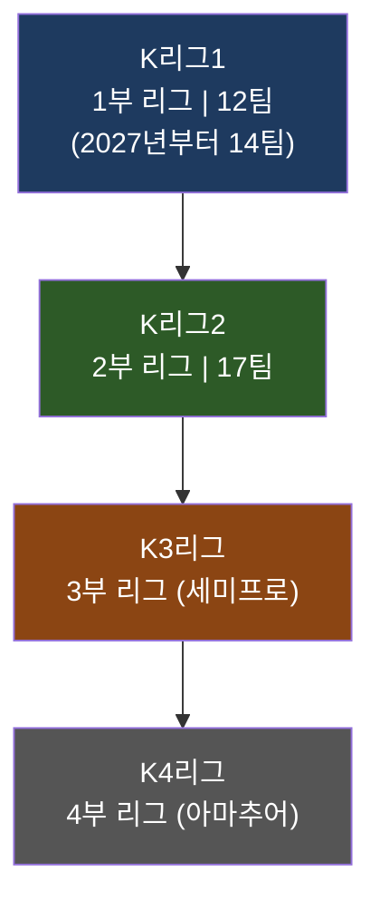
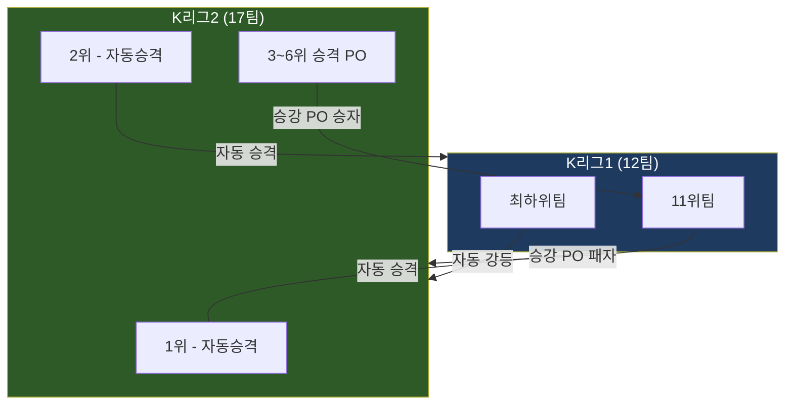
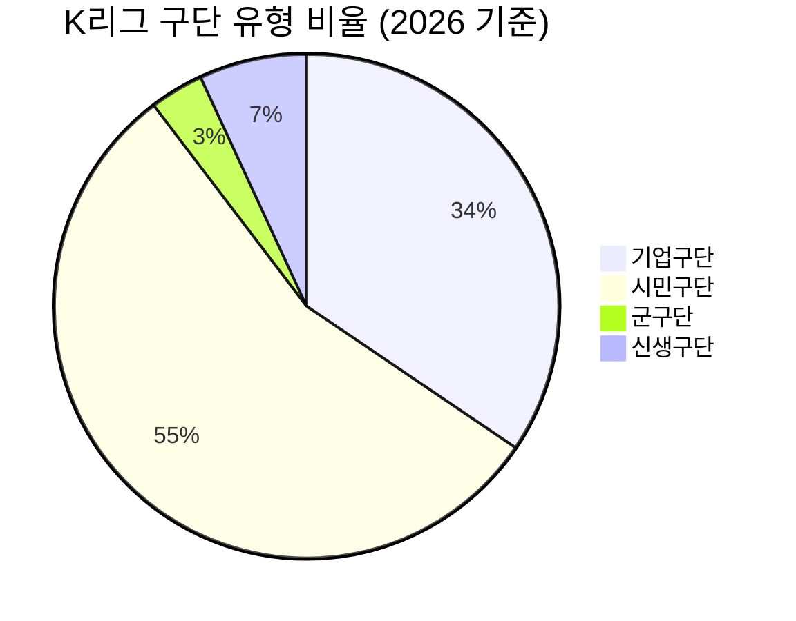

# 260322 한국축구(K리그) 종합 리서치

> 작성일: 2026-03-22 | K리그 2025-2026 시즌 기준 종합 분석

---

## 목차

1. [메이저 대회](#1-메이저-대회)
2. [메이저 리그 구조](#2-메이저-리그-구조)
3. [승격/강등 시스템](#3-승격강등-시스템)
4. [구단 비즈니스 모델](#4-구단-비즈니스-모델)
5. [K리그1 전 팀 소개](#5-k리그1-전-팀-소개)
6. [K리그2 전 팀 소개](#6-k리그2-전-팀-소개)
7. [팀별 주요선수 소개](#7-팀별-주요선수-소개)
8. [주요선수별 연봉과 실력](#8-주요선수별-연봉과-실력)
9. [해외파 선수 현황](#9-해외파-선수-현황)

---

## 1. 메이저 대회

### 1-1. AFC 챔피언스리그 엘리트 (ACL Elite)

아시아 최고 권위의 클럽 대항전으로, 2024-25시즌부터 기존 AFC 챔피언스리그가 **AFC 챔피언스리그 엘리트(ACL Elite)** 로 명칭이 변경되었다.

| 항목 | 내용 |
|------|------|
| 대회 형식 | 리그 스테이지(스위스 시스템) -> 녹아웃 라운드 -> 결승(4강 파이널4) |
| 2025-26 한국 참가팀 | 전북 현대, 대전 하나 시티즌, 포항 스틸러스 |
| 결승 개최지 | 사우디아라비아 (2026년 4-5월) |
| 한국 역대 우승 | 성남 일화(2010), 울산 현대(2012, 2020), 포항 스틸러스(2009), 전북 현대(2006, 2016) 등 |

> 참고: [2025-26 AFC 챔피언스리그 엘리트 - 위키백과](https://ko.wikipedia.org/wiki/2025-26%EB%85%84_AFC_%EC%B1%94%ED%94%BC%EC%96%B8%EC%8A%A4%EB%A6%AC%EA%B7%B8_%EC%97%98%EB%A6%AC%ED%8A%B8), [나무위키](https://namu.wiki/w/2025-26%20AFC%20%EC%B1%94%ED%94%BC%EC%96%B8%EC%8A%A4%20%EB%A6%AC%EA%B7%B8%20%EC%97%98%EB%A6%AC%ED%8A%B8)

### 1-2. 코리아컵 (구 FA컵)

한국 축구의 **녹아웃 방식 컵 대회**로, 2023시즌부터 기존 "FA컵"에서 **"코리아컵"** 으로 명칭이 변경되었다.

| 항목 | 내용 |
|------|------|
| 참가 자격 | K리그1, K리그2, K3리그, K4리그 + 대학 팀 등 |
| 방식 | 단판 녹아웃 토너먼트 |
| 2025 결승 | 광주 FC vs 부천 FC (12월 6일) |
| 역대 최다 우승 | 포항 스틸러스 (6회: 1996, 2008, 2012, 2013, 2023, 2024) |

> 참고: [코리아컵 - 나무위키](https://namu.wiki/w/%EC%BD%94%EB%A6%AC%EC%95%84%EC%BB%B5(%EC%B6%95%EA%B5%AC)), [코리아컵 - 위키백과](https://ko.wikipedia.org/wiki/%EC%BD%94%EB%A6%AC%EC%95%84%EC%BB%B5)

### 1-3. 2026 FIFA 월드컵 (캐나다/멕시코/미국)

| 항목 | 내용 |
|------|------|
| 본선 진출 | 확정 (11회 연속) |
| 예선 성적 | 아시아 3차 예선 B조 **무패 통과** (6승 4무) |
| 감독 | 홍명보 |
| 주요 특징 | 2그룹 시드 유력, 16강 이상 목표 |

홍명보 감독이 이끄는 대한민국은 아시아 최종예선을 **단 한 번의 패배 없이** 통과하며 11회 연속 월드컵 본선 진출이라는 대기록을 세웠다.

> 참고: [FIFA 월드컵 아시아 예선 결과](https://www.olympics.com/ko/news/korea-football-all-results-2026-fifa-world-cup-asian-qualifier-third-round), [나무위키 2026 월드컵 아시아 예선](https://namu.wiki/w/2026%20FIFA%20%EC%9B%94%EB%93%9C%EC%BB%B5/%EC%A7%80%EC%97%AD%EC%98%88%EC%84%A0/%EC%95%84%EC%8B%9C%EC%95%84/3%EC%B0%A8%EC%98%88%EC%84%A0/B%EC%A1%B0)

### 1-4. AFC 아시안컵 / U-23 아시안컵

| 대회 | 연도 | 성적 |
|------|------|------|
| AFC U-23 아시안컵 | 2026 (사우디) | 4위 (준결승 일본전 패배) |
| AFC U-20 아시안컵 | 2025 | 준결승 패배 (사우디에 석패) |
| AFC 아시안컵 | 2024 (카타르) | 준결승 진출 (요르단에 패배) |

> 참고: [AFC U-23 아시안컵 2026 경기 일정](https://www.olympics.com/ko/news/football-fixtures-results-afc-u23-asian-cup-2026), [AFC U-20 아시안컵 2025](https://www.olympics.com/ko/news/football-korea-all-results-afc-u20-asian-cup)

---

## 2. 메이저 리그 구조

### 2-1. K리그 전체 피라미드



### 2-2. K리그1 (1부 리그)

| 항목 | 2025 시즌 | 2026 시즌 |
|------|----------|----------|
| 참가팀 수 | 12팀 | 12팀 |
| 정규 라운드 | 33경기 (3회전) | 33경기 (3회전) |
| 파이널 라운드 | 상위 6팀(A) / 하위 6팀(B) | 상위 6팀(A) / 하위 6팀(B) |
| 총 경기 수 | 198경기 + 파이널 | 198경기 + 파이널 |
| 시즌 기간 | 2월~12월 | 2월 28일~12월 6일 |
| 우승팀 | 전북 현대 (V10) | 진행 중 |

**시즌 운영 방식:**

1. **정규 라운드** (33경기): 12팀이 3회전 리그 진행
2. **파이널 A** (상위 6팀): 추가 5경기로 우승/ACL 진출 결정
3. **파이널 B** (하위 6팀): 추가 5경기로 강등팀 결정

> 참고: [하나은행 K리그1 2026 - 나무위키](https://namu.wiki/w/%ED%95%98%EB%82%98%EC%9D%80%ED%96%89%20K%EB%A6%AC%EA%B7%B81%202026), [2025년 K리그1 - 위키백과](https://ko.wikipedia.org/wiki/2025%EB%85%84_K%EB%A6%AC%EA%B7%B81)

### 2-3. K리그2 (2부 리그)

| 항목 | 2025 시즌 | 2026 시즌 |
|------|----------|----------|
| 참가팀 수 | 14팀 | **17팀** (역대 최다) |
| 경기 방식 | 2회전 | 2회전 (팀당 32경기) |
| 시즌 기간 | 2월~11월 | 2월 28일~11월 29일 |
| 자동 승격 | 1위 | **1, 2위** |
| 승격 PO | 2~5위 -> 결정전 | 3~6위 -> 결정전 |

2026시즌부터 김해 FC 2008, 용인 FC, 파주 프런티어 FC 3팀이 신규 합류하여 **사상 최대 17팀**이 참가한다.

> 참고: [하나은행 K리그2 2026 - 나무위키](https://namu.wiki/w/%ED%95%98%EB%82%98%EC%9D%80%ED%96%89%20K%EB%A6%AC%EA%B7%B82%202026), [2026년 K리그2 완전정리](https://2.1step-note.com/entry/2026%EB%85%84-K%EB%A6%AC%EA%B7%B82-%EC%99%84%EC%A0%84%EC%A0%95%EB%A6%AC-%EC%82%AC%EC%83%81-%EC%B5%9C%EB%8C%80-17%EA%B0%9C-%ED%8C%80%C2%B7%EC%8A%B9%EA%B2%A9-%EC%B5%9C%EB%8C%80-4%ED%8C%80-%EA%B0%80%EB%8A%A5%C2%B7%EC%97%AD%EB%8C%80%EA%B8%89-%EB%8C%80%ED%98%BC%EC%A0%84-%EC%98%88%EA%B3%A0)

### 2-4. 2025 K리그1 최종 결과

| 순위 | 팀명 | 비고 |
|------|------|------|
| 1 | 전북 현대 모터스 | 우승 (통산 10회, 33R 조기 확정) |
| 2 | 김천 상무 | 파이널A 진출 |
| 3 | 대전 하나 시티즌 | 파이널A 진출 |
| 4 | 포항 스틸러스 | 파이널A 진출 |
| 5 | FC 서울 | 파이널A 진출 |
| 6 | 강원 FC | 파이널A 진출 |
| ... | ... | ... |
| 11 | 수원 FC | K리그2 강등 |
| 12 | 대구 FC | K리그2 강등 |

> 참고: [전북 현대 V10 우승 - Olympics.com](https://www.olympics.com/ko/news/football-2025-k-league-weekly-review-round-33), [부활한 전북 V10 - 뉴스1](https://www.news1.kr/sports/soccer/5945468)

---

## 3. 승격/강등 시스템

### 3-1. K리그1 <-> K리그2 승강제



### 2026시즌 승강제 변경사항

| 구분 | 2025시즌 | 2026시즌 |
|------|---------|---------|
| K리그1 자동 강등 | 1팀 (12위) | 1팀 (12위) |
| K리그2 자동 승격 | 1팀 (1위) | **2팀** (1, 2위) |
| 승강 PO | K리그2 2~5위 중 우승팀 vs K리그1 11위 | K리그2 3~6위 중 우승팀 vs K리그1 11위 |
| 특이사항 | - | 김천 상무 협약 종료로 인한 자동 해체/강등 |

**2026시즌 특수 상황:**
- **김천 상무 FC**: 연맹-국군체육부대-김천시 간 연고협약이 2026시즌으로 종료되어, 성적과 무관하게 시즌 후 해체 예정
- 이에 따라 K리그1에서 **실질적으로 강등되는 일반 구단은 0~1팀**
- **2027시즌부터 K리그1이 14팀**으로 확대 운영 확정

### 3-2. K리그2 <-> K3리그 승강제 (2026 신설)

2026시즌부터 **프로-세미프로 간 장벽이 해소**되어, K리그2 최하위팀과 K3리그 1위팀 간 **승강 결정전이 신설**된다.

> 참고: [K리그 승강제 - 나무위키](https://namu.wiki/w/K%EB%A6%AC%EA%B7%B8/%EC%8A%B9%EA%B0%95%EC%A0%9C), [내년 K리그 승강제 변경 - 스타뉴스](https://www.starnewskorea.com/sports/2025/12/02/2025120210002051026)

---

## 4. 구단 비즈니스 모델

### 4-1. 구단 유형 분류



| 유형 | 대표 구단 | 특징 |
|------|----------|------|
| **기업구단** | 전북(현대), 울산(HD/현대), 제주(SK), 포항(포스코), 대전(하나금융), 서울이랜드(이랜드), 부산(HDC) 등 | 모기업 지원, 안정적 재정 |
| **시민구단** | 수원FC, 광주FC, 강원FC, FC안양, 성남FC, 충남아산 등 | 지자체 예산 의존, 재정 불안정 |
| **군구단** | 김천 상무 | 국군체육부대 운영, 2026 종료 |

### 4-2. 수익구조

K리그 구단의 수익원은 크게 5가지로 구분된다:

| 수익원 | 비중 | 설명 |
|--------|------|------|
| 모기업/지자체 지원금 | **최대** | 기업구단: 모기업 지원 / 시민구단: 지자체 예산 |
| 입장 수입 | 중간 | 2025시즌 총 **461억원** (역대 최고) |
| 중계권료 | 중간 | 쿠팡플레이 5년 계약 (2026~) |
| 스폰서십/광고 | 중간 | 유니폼 스폰서, 경기장 네이밍라이츠 등 |
| MD/부대수입 | 적음 | 유니폼 판매, F&B 등 |

### 4-3. 입장 수입 현황 (2025시즌)

2025시즌 K리그 **총 입장 수입 461억원**, 유료관중 **300만명 돌파**로 역대 최고 기록을 경신했다.

**K리그1 구단별 입장 수입 TOP 5:**

| 순위 | 구단 | 입장 수입 | 평균 객단가 |
|------|------|----------|-----------|
| 1 | FC 서울 | 70.4억원 | 15,494원 |
| 2 | 전북 현대 | 52.9억원 | - |
| 3 | 울산 HD | 41.8억원 | - |
| 4 | 대구 FC | - | 17,061원 (최고) |
| 5 | 대전 하나 | - | 15,376원 |

**K리그2 구단별 입장 수입 TOP 3:**

| 순위 | 구단 | 입장 수입 |
|------|------|----------|
| 1 | 수원 삼성 | 44.2억원 |
| 2 | 인천 유나이티드 | 25.2억원 |
| 3 | 전남 드래곤즈 | 8.7억원 |

> 참고: [2025 K리그 입장 수입 발표](https://v.daum.net/v/20251231153140579), [K리그 유료 관중 300만 돌파](https://sports.news.nate.com/view/20251231n09327)

### 4-4. 중계권 현황

| 플랫폼 | 중계 대상 | 계약 기간 |
|--------|----------|----------|
| **쿠팡플레이** | K리그1/2 전 경기 생중계 | 2026~2030 (5년) |
| **쿠팡플레이** | 대한민국 국가대표 경기 | 별도 계약 |
| **티빙** | K리그, 국가대표 일부 | - |
| **SPOTV** | ACL, 유럽 리그(챔스, 세리에A 등) | - |

쿠팡플레이는 **AI 업스케일 장비**를 활용해 K리그1 전 경기와 K리그2 주요 경기를 고화질로 송출할 계획이며, **스포츠 패스 없이도** K리그와 국가대표 경기를 시청할 수 있다.

> 참고: [쿠팡플레이 K리그 5년 연장](https://www.topstarnews.net/news/articleView.html?idxno=15981770), [쿠팡플레이 K리그 파트너십 - 헤럴드경제](https://biz.heraldcorp.com/article/10680460)

### 4-5. 시민구단의 구조적 문제

시민구단은 **재정의 대부분을 지자체 지원과 기업 후원에 의존**하고 있으며, 자립적 수익 창출 능력을 갖춘 시민구단은 사실상 전무하다. 대표적으로 안산 그리너스의 경우 **세금 의존도가 98%**에 달하며 자체 수익은 1억원대에 불과한 것으로 추정된다.

> 참고: [안산 그리너스 재정 - 경기연합신문](https://www.gynews.kr/news/articleView.html?idxno=70133), [시민구단 비판 - 나무위키](https://namu.wiki/w/%EC%8B%9C%EB%AF%BC%20%EA%B5%AC%EB%8B%A8/%EB%B9%84%ED%8C%90)

---

## 5. K리그1 전 팀 소개

### 2026시즌 K리그1 참가 12팀

| No | 팀명 | 연고지 | 홈 경기장 | 감독 | 유형 |
|----|------|--------|----------|------|------|
| 1 | **전북 현대 모터스** | 전주 | 전주월드컵경기장 | 정정용 | 기업 |
| 2 | **대전 하나 시티즌** | 대전 | 대전월드컵경기장 | 황선홍 | 기업 |
| 3 | **김천 상무 FC** | 김천 | 김천종합스포츠타운 | 주승진 | 군 |
| 4 | **포항 스틸러스** | 포항 | 포항스틸야드 | 박태하 | 기업 |
| 5 | **강원 FC** | 강릉 | 강릉하이원아레나 | 정경호 | 시민 |
| 6 | **FC 서울** | 서울 | 서울월드컵경기장 | 김기동 | 기업 |
| 7 | **광주 FC** | 광주 | 광주월드컵경기장 | 이정규 | 시민 |
| 8 | **FC 안양** | 안양 | 안양종합운동장 | 유병훈 | 시민 |
| 9 | **울산 HD FC** | 울산 | 울산문수축구경기장 | 김현석 | 기업 |
| 10 | **제주 유나이티드** | 제주 | 제주월드컵경기장 | 세르지우 코스타 | 기업 |
| 11 | **인천 유나이티드 FC** | 인천 | 인천축구전용경기장 | 윤정환 | 시민 |
| 12 | **부천 FC 1995** | 부천 | 부천종합운동장 | 이영민 | 시민 |

### 각 팀별 상세 소개

#### 1. 전북 현대 모터스 (Jeonbuk Hyundai Motors)

| 항목 | 내용 |
|------|------|
| 창단 | 1994년 |
| 연고지 | 전라북도 전주시 |
| 모기업 | 현대자동차 |
| K리그 우승 | **10회** (최다, 2009/2011/2014/2015/2017/2018/2019/2020/2021/2025) |
| ACL 우승 | 2회 (2006, 2016) |
| 특징 | K리그 최다 우승 명문. 2025시즌 거스 포옛(정정용 전임) 감독 체제에서 21경기 연속 무패, 33R 조기 우승 달성. 코리아컵까지 제패하며 더블 달성 |

#### 2. 대전 하나 시티즌 (Daejeon Hana Citizen)

| 항목 | 내용 |
|------|------|
| 창단 | 1997년 |
| 연고지 | 대전광역시 |
| 모기업 | 하나금융그룹 (2019년 인수) |
| 특징 | 2019년 하나금융 인수 이후 재정 안정. 2025시즌 파이널A 3위 진출. 황선홍 감독 체제. 주민규 중심의 공격력 |

#### 3. 김천 상무 FC (Gimcheon Sangmu FC)

| 항목 | 내용 |
|------|------|
| 창단 | 1984년 (상무) |
| 연고지 | 경상북도 김천시 |
| 운영 | 국군체육부대 |
| 특징 | 군 복무 중인 선수들로 구성. 2026시즌 연고협약 종료로 **시즌 후 해체 예정**. 병역 특례 선수들의 질 높은 전력으로 상위권 경쟁 |

#### 4. 포항 스틸러스 (Pohang Steelers)

| 항목 | 내용 |
|------|------|
| 창단 | 1973년 |
| 연고지 | 경상북도 포항시 |
| 모기업 | 포스코 |
| K리그 우승 | 4회 |
| ACL 우승 | 3회 (1997, 1998, 2009) |
| 코리아컵 우승 | **6회** (최다) |
| 특징 | 한국 축구 최고 명문 중 하나. 4시즌 연속 파이널A 진출. 박태하 감독의 안정적 지휘 |

#### 5. 강원 FC (Gangwon FC)

| 항목 | 내용 |
|------|------|
| 창단 | 2008년 |
| 연고지 | 강원도 (홈: 강릉) |
| 유형 | 시민구단 |
| 특징 | 강원도민 구단. 2025시즌 파이널A 막차 탑승. 양현준 등 젊은 선수 육성에 강점 |

#### 6. FC 서울 (FC Seoul)

| 항목 | 내용 |
|------|------|
| 창단 | 1983년 (안양 LG -> 서울) |
| 연고지 | 서울특별시 |
| 모기업 | GS그룹 |
| K리그 우승 | 6회 |
| ACL 우승 | 1회 (2016 준우승) |
| 특징 | 수도 연고 최대 구단. 2025시즌 입장 수입 **70.4억원으로 K리그 전체 1위**. 서울월드컵경기장(66,704석)이라는 압도적 인프라 보유. 린가드 영입으로 화제 |

#### 7. 광주 FC (Gwangju FC)

| 항목 | 내용 |
|------|------|
| 창단 | 2010년 |
| 연고지 | 광주광역시 |
| 유형 | 시민구단 |
| 특징 | 2025시즌 코리아컵 결승 진출. 유스 시스템 강점. 젊은 선수 발굴 및 이적 수익 모델 |

#### 8. FC 안양 (FC Anyang)

| 항목 | 내용 |
|------|------|
| 창단 | 2013년 |
| 연고지 | 경기도 안양시 |
| 유형 | 시민구단 |
| 특징 | **2025시즌 K리그2 우승으로 창단 후 첫 K리그1 승격**. 승강제 도입 이후 안양 연고 구단의 첫 1부 리그 진출 |

#### 9. 울산 HD FC (Ulsan HD FC)

| 항목 | 내용 |
|------|------|
| 창단 | 1983년 |
| 연고지 | 울산광역시 |
| 모기업 | HD현대 |
| K리그 우승 | 4회 |
| ACL 우승 | 2회 (2012, 2020) |
| 특징 | 2025시즌 연봉 총액 **206억원으로 K리그 최고**. 김영권, 조현우 등 국가대표급 선수 다수 보유. 김현석 감독 체제에서 반등 목표 |

#### 10. 제주 유나이티드 (Jeju United)

| 항목 | 내용 |
|------|------|
| 창단 | 1982년 (유공 -> 부천SK -> 제주) |
| 연고지 | 제주특별자치도 |
| 모기업 | SK그룹 |
| 특징 | 제주도라는 독특한 지역 연고. 외국인 감독(세르지우 코스타) 선임. 원정 이동 거리가 가장 먼 구단 |

#### 11. 인천 유나이티드 FC (Incheon United FC)

| 항목 | 내용 |
|------|------|
| 창단 | 2003년 |
| 연고지 | 인천광역시 |
| 유형 | 시민구단 |
| 특징 | K리그2에서 **승격 팀**으로 2026시즌 K리그1 복귀. 제르소, 무고사 등 고액 외국인 선수 영입. 윤정환 감독 체제 |

#### 12. 부천 FC 1995 (Bucheon FC 1995)

| 항목 | 내용 |
|------|------|
| 창단 | 2007년 (부천SK 후신) |
| 연고지 | 경기도 부천시 |
| 유형 | 시민구단 |
| 특징 | K리그2에서 **승격 팀**으로 2026시즌 K리그1 복귀. 2025 코리아컵 결승 진출. 이영민 감독 체제 |

> 참고: [하나은행 K리그1 2026 - 나무위키](https://namu.wiki/w/%ED%95%98%EB%82%98%EC%9D%80%ED%96%89%20K%EB%A6%AC%EA%B7%B81%202026), [2026 K리그1 시즌 프리뷰 - Olympics.com](https://www.olympics.com/ko/news/football-kleague-season-preview-2026)

---

## 6. K리그2 전 팀 소개

### 2026시즌 K리그2 참가 17팀

| No | 팀명 | 연고지 | 홈 경기장 | 유형 | 비고 |
|----|------|--------|----------|------|------|
| 1 | **수원 FC** | 수원시 | 수원종합운동장 | 시민 | K리그1 강등 |
| 2 | **대구 FC** | 대구광역시 | 대구iM뱅크파크 | 시민 | K리그1 강등 |
| 3 | **수원 삼성 블루윙즈** | 수원시 | 수원월드컵경기장 | 기업(삼성) | 전통 명문, K리그2 입장수입 1위 |
| 4 | **서울 이랜드 FC** | 서울 | 목동종합운동장 | 기업(이랜드) | 수도권 K리그2 구단 |
| 5 | **성남 FC** | 성남시 | 탄천종합운동장 | 시민 | 구 성남 일화 후신 |
| 6 | **전남 드래곤즈** | 광양시 | 광양축구전용구장 | 시민 | K리그 원년 멤버 |
| 7 | **김포 FC** | 김포시 | 김포솔터축구장 | 시민 | 2022년 K리그 합류 |
| 8 | **부산 아이파크** | 부산광역시 | 구덕운동장 | 기업(HDC) | 부산 연고 전통 구단 |
| 9 | **충남 아산 FC** | 아산시 | 이순신종합운동장 | 시민 | - |
| 10 | **화성 FC** | 화성시 | 화성종합경기타운 | 시민 | 2025년 K리그 합류 |
| 11 | **경남 FC** | 창원시 | 창원축구센터 | 시민 | 구 경남 도민 구단 |
| 12 | **충북 청주 FC** | 청주시 | 청주종합경기장 | 시민 | - |
| 13 | **천안 시티 FC** | 천안시 | 천안종합운동장 | 시민 | 2023년 K리그 합류 |
| 14 | **안산 그리너스 FC** | 안산시 | 안산와~스타디움 | 시민 | 세금 의존도 98% |
| 15 | **용인 FC** | 용인시 | 용인미르스타디움 | 시민 | **2026 신규** |
| 16 | **파주 프런티어 FC** | 파주시 | 파주스타디움 | 시민 | **2026 신규** |
| 17 | **김해 FC 2008** | 김해시 | 김해종합운동장 | 시민 | **2026 신규** (K3 우승) |

> 참고: [2026년 K리그2 - 위키백과](https://ko.wikipedia.org/wiki/2026%EB%85%84_K%EB%A6%AC%EA%B7%B82), [하나은행 K리그2 2026 - 나무위키](https://namu.wiki/w/%ED%95%98%EB%82%98%EC%9D%80%ED%96%89%20K%EB%A6%AC%EA%B7%B82%202026)

---

## 7. 팀별 주요선수 소개

### K리그1 팀별 대표선수 (2025-2026 기준)

#### 전북 현대 모터스

| 선수명 | 포지션 | 연봉 | 특징 |
|--------|--------|------|------|
| **이승우** | MF/FW | 15.9억 | 국내선수 연봉킹, 바르셀로나 유스 출신 |
| **박진섭** | MF | 12.3억 | 팀 핵심 미드필더 |
| **콤파뇨** (외국인) | FW | 13.4억 | 주전 스트라이커, 2025 우승 시즌 핵심 |
| **티아고** (외국인) | FW | - | 2025 우승 결정전 추가골 |

#### 울산 HD FC

| 선수명 | 포지션 | 연봉 | 특징 |
|--------|--------|------|------|
| **김영권** | DF | 14.8억 | 국가대표 수비수, 2018 월드컵 독일전 골 |
| **조현우** | GK | 14.6억 | 국가대표 골키퍼, K리그 대표 GK |
| **김민혁** | FW | - | 주전 공격수 |

#### 대전 하나 시티즌

| 선수명 | 포지션 | 연봉 | 특징 |
|--------|--------|------|------|
| **주민규** | FW | 11.2억 | 국내 연봉 5위, 득점 머신 |
| **윤도영** | MF | - | 핵심 미드필더 |

#### FC 서울

| 선수명 | 포지션 | 연봉 | 특징 |
|--------|--------|------|------|
| **린가드** (외국인) | MF | 19.5억 | 전 맨유, K리그 최대 화제 영입 |
| **기성용** | MF | - | 전 대표팀 주장, 레전드 |

#### 포항 스틸러스

| 선수명 | 포지션 | 연봉 | 특징 |
|--------|--------|------|------|
| **이호재** | MF | - | 핵심 미드필더 |
| **알렉스 그랜트** (외국인) | DF | - | 외국인 수비수 |

#### 인천 유나이티드

| 선수명 | 포지션 | 연봉 | 특징 |
|--------|--------|------|------|
| **제르소** (외국인) | FW | 15.4억 | 외국인 연봉 3위 |
| **무고사** (외국인) | FW | 15.4억 | 외국인 연봉 4위 |

> 참고: [2025 K리그 연봉 현황 - ISSUE ON](https://www.issueon.co.kr/news/articleView.html?idxno=11322), [K리그 최고 연봉팀 울산 - 뉴데일리](https://www.newdaily.co.kr/site/data/html/2025/12/30/2025123000047.html)

---

## 8. 주요선수별 연봉과 실력

### 8-1. 2025시즌 국내선수 연봉 TOP 10

| 순위 | 선수명 | 소속팀 | 연봉 | 포지션 |
|------|--------|--------|------|--------|
| 1 | **이승우** | 전북 현대 | **15.9억원** | MF/FW |
| 2 | **김영권** | 울산 HD | **14.8억원** | DF |
| 3 | **조현우** | 울산 HD | **14.6억원** | GK |
| 4 | **박진섭** | 전북 현대 | **12.3억원** | MF |
| 5 | **주민규** | 대전 하나 | **11.2억원** | FW |

### 8-2. 2025시즌 외국인선수 연봉 TOP 5

| 순위 | 선수명 | 소속팀 | 연봉 | 국적 |
|------|--------|--------|------|------|
| 1 | **세징야** | 대구 FC | **21.0억원** | 브라질 |
| 2 | **린가드** | FC 서울 | **19.5억원** | 잉글랜드 |
| 3 | **제르소** | 인천 유나이티드 | **15.4억원** | 브라질 |
| 4 | **무고사** | 인천 유나이티드 | **15.4억원** | 나이지리아 |
| 5 | **콤파뇨** | 전북 현대 | **13.4억원** | 벨기에 |

### 8-3. 구단별 연봉 총액 TOP 5

| 순위 | 구단 | 연봉 총액 |
|------|------|----------|
| 1 | **울산 HD** | 206.5억원 |
| 2 | **전북 현대** | 201.4억원 |
| 3 | **대전 하나** | 199.3억원 |

### 8-4. K리그 전체 연봉 통계

| 항목 | 수치 |
|------|------|
| K리그1+2 연봉 총액 | **2,097.8억원** (역대 최고) |
| 전년 대비 증가율 | +5.8% |
| K리그1 국내선수 평균 연봉 | **2.3억원** |

> 참고: [K리그 연봉킹 이승우-세징야 - 네이트](https://sports.news.nate.com/view/20251230n19455), [K리그 구단별 연봉 현황 - K LEAGUE 공식](https://www.kleague.com/news_view.do?orderBy=seq&viewOption=album&seq=93936)

---

## 9. 해외파 선수 현황

### 9-1. 주요 해외파 선수 (2025-26시즌)

#### 빅리그 소속 핵심 선수

| 선수명 | 소속팀 | 리그 | 포지션 | 주요 성적/특징 |
|--------|--------|------|--------|---------------|
| **손흥민** | LA FC | MLS | FW | A매치 140경기 54골. 2026시즌 MLS 2년차. 전 토트넘 레전드 |
| **김민재** | 바이에른 뮌헨 | 분데스리가 | CB | IFFHS AFC 올해의 팀 4년 연속 선정. 바이에른 수비 핵심, 주장 완장 |
| **이강인** | 파리 생제르맹 | 리그1 | MF | PSG 트레블 경험, 올해의 선수 선정. 핵심 미드필더 |
| **황희찬** | 울버햄프턴 | EPL | FW | 프리미어리그 공격수 |

#### 기타 유럽 리그 소속 선수

| 선수명 | 소속팀 | 리그 | 포지션 |
|--------|--------|------|--------|
| **황인범** | 페예노르트 | 에레디비시 | MF |
| **이한범** | 미트윌란 | 덴마크 수페르리가 | CB |
| **조규성** | 미트윌란 | 덴마크 수페르리가 | FW |
| **배준호** | 스토크 시티 | EFL 챔피언십 | MF |
| **백승호** | 버밍엄 시티 | EFL 챔피언십 | MF |
| **이태석** | 아우스트리아 빈 | 오스트리아 분데스리가 | MF |
| **설영우** | 츠르베나 즈베즈다 | 세르비아 수페르리가 | MF |

### 9-2. 2026 월드컵 예상 베스트 11

```
              황희찬 (울버햄프턴)
    손흥민 (LAFC)        이강인 (PSG)
         황인범        이태석
    (페예노르트)    (아우스트리아 빈)
              백승호 (버밍엄)
    좌측백          김민재       우측백
              (뮌헨)
              GK 조현우 (울산)
```

> 참고: [해외파 축구선수 2025-26 시즌 - 나무위키](https://namu.wiki/w/%ED%95%B4%EC%99%B8%ED%8C%8C/%EC%B6%95%EA%B5%AC%20%EC%84%A0%EC%88%98/%EC%8B%9C%EC%A6%8C%EB%B3%84%20%EC%A0%95%EB%A6%AC/2020%EB%85%84%EB%8C%80/2025-26%20%EC%8B%9C%EC%A6%8C), [손흥민 LAFC 2026시즌 - 네이트](https://sports.news.nate.com/view/20251121n01811), [월드컵 예상 베스트11 - Daum](https://v.daum.net/v/20260119000844326)

---

## 부록: 2027시즌 주요 변화 예고

| 변경사항 | 내용 |
|---------|------|
| K리그1 팀 수 | 12팀 -> **14팀** 확대 |
| K리그2 팀 수 | 17팀 -> **15+@팀** |
| 김천 상무 | 해체 (2026시즌 종료 후) |
| 외국인 선수 | 보유 한도 **전면 폐지** (2026시즌부터 적용) |
| K리그2-K3 승강제 | 본격 시행 |

> 참고: [2027시즌 K리그1 14개 팀 확대 - Goal.com](https://www.goal.com/kr/%EB%89%B4%EC%8A%A4/2027%E1%84%89%E1%85%B5%E1%84%8C%E1%85%B3%E1%86%AB%E1%84%87%E1%85%AE%E1%84%90%E1%85%A5-k%E1%84%85%E1%85%B5%E1%84%80%E1%85%B31-%E1%84%8F%E1%85%B3%E1%86%AF%E1%84%85%E1%85%A5%E1%86%B8-%E1%84%89%E1%85%AE-14%E1%84%80%E1%85%A2%E1%84%85%E1%85%A9-%E1%84%92%E1%85%AA%E1%86%A8%E1%84%83%E1%85%A2--%E1%84%91%E1%85%B3%E1%84%85%E1%85%A9%E1%84%8E%E1%85%AE%E1%86%A8%E1%84%80%E1%85%AE%E1%84%8B%E1%85%A7%E1%86%AB%E1%84%86%E1%85%A2%E1%86%BC-2025%E1%84%82%E1%85%A7%E1%86%AB%E1%84%83%E1%85%A9-%E1%84%8C%E1%85%A66%E1%84%8E%E1%85%A1-%E1%84%8B%E1%85%B5%E1%84%89%E1%85%A1%E1%84%92%E1%85%AC-%E1%84%80%E1%85%A7%E1%86%AF%E1%84%80%E1%85%AA-%E1%84%87%E1%85%A1%E1%86%AF%E1%84%91%E1%85%AD/bltbe766565328d2cd6)

---

## 종합 Sources

- [하나은행 K리그1 2026 - 나무위키](https://namu.wiki/w/%ED%95%98%EB%82%98%EC%9D%80%ED%96%89%20K%EB%A6%AC%EA%B7%B81%202026)
- [하나은행 K리그2 2026 - 나무위키](https://namu.wiki/w/%ED%95%98%EB%82%98%EC%9D%80%ED%96%89%20K%EB%A6%AC%EA%B7%B82%202026)
- [2026년 K리그1 - 위키백과](https://ko.wikipedia.org/wiki/2026%EB%85%84_K%EB%A6%AC%EA%B7%B81)
- [2026년 K리그2 - 위키백과](https://ko.wikipedia.org/wiki/2026%EB%85%84_K%EB%A6%AC%EA%B7%B82)
- [2025년 K리그1 - 위키백과](https://ko.wikipedia.org/wiki/2025%EB%85%84_K%EB%A6%AC%EA%B7%B81)
- [K리그 승강제 - 나무위키](https://namu.wiki/w/K%EB%A6%AC%EA%B7%B8/%EC%8A%B9%EA%B0%95%EC%A0%9C)
- [2025-26 AFC 챔피언스리그 엘리트 - 위키백과](https://ko.wikipedia.org/wiki/2025-26%EB%85%84_AFC_%EC%B1%94%ED%94%BC%EC%96%B8%EC%8A%A4%EB%A6%AC%EA%B7%B8_%EC%97%98%EB%A6%AC%ED%8A%B8)
- [코리아컵 - 나무위키](https://namu.wiki/w/%EC%BD%94%EB%A6%AC%EC%95%84%EC%BB%B5(%EC%B6%95%EA%B5%AC))
- [FIFA 월드컵 아시아 예선 - Olympics.com](https://www.olympics.com/ko/news/korea-football-all-results-2026-fifa-world-cup-asian-qualifier-third-round)
- [2026 K리그1 시즌 프리뷰 - Olympics.com](https://www.olympics.com/ko/news/football-kleague-season-preview-2026)
- [2025 K리그 연봉 현황 - ISSUE ON](https://www.issueon.co.kr/news/articleView.html?idxno=11322)
- [K리그 최고 연봉팀 울산 - 뉴데일리](https://www.newdaily.co.kr/site/data/html/2025/12/30/2025123000047.html)
- [K리그 구단별 연봉 현황 - K LEAGUE 공식](https://www.kleague.com/news_view.do?orderBy=seq&viewOption=album&seq=93936)
- [2025 K리그 입장 수입 역대 최고 - 서울경제](https://www.sedaily.com/NewsView/2H1XZM4ZCI)
- [K리그 유료관중 300만 돌파 - 네이트](https://sports.news.nate.com/view/20251231n09327)
- [쿠팡플레이 K리그 5년 연장 - TopstarNews](https://www.topstarnews.net/news/articleView.html?idxno=15981770)
- [쿠팡플레이 K리그 파트너십 - 헤럴드경제](https://biz.heraldcorp.com/article/10680460)
- [시민구단 비판 - 나무위키](https://namu.wiki/w/%EC%8B%9C%EB%AF%BC%20%EA%B5%AC%EB%8B%A8/%EB%B9%84%ED%8C%90)
- [안산 그리너스 재정 - 경기연합신문](https://www.gynews.kr/news/articleView.html?idxno=70133)
- [해외파 축구선수 2025-26시즌 - 나무위키](https://namu.wiki/w/%ED%95%B4%EC%99%B8%ED%8C%8C/%EC%B6%95%EA%B5%AC%20%EC%84%A0%EC%88%98/%EC%8B%9C%EC%A6%8C%EB%B3%84%20%EC%A0%95%EB%A6%AC/2020%EB%85%84%EB%8C%80/2025-26%20%EC%8B%9C%EC%A6%8C)
- [손흥민 LAFC - 나무위키](https://namu.wiki/w/%EC%86%90%ED%9D%A5%EB%AF%BC/%ED%81%B4%EB%9F%BD%20%EA%B2%BD%EB%A0%A5/2026%20%EC%8B%9C%EC%A6%8C)
- [월드컵 예상 베스트11 - Daum](https://v.daum.net/v/20260119000844326)
- [2027시즌 K리그1 14팀 확대 - Goal.com](https://www.goal.com/kr/%EB%89%B4%EC%8A%A4/2027%E1%84%89%E1%85%B5%E1%84%8C%E1%85%B3%E1%86%AB%E1%84%87%E1%85%AE%E1%84%90%E1%85%A5-k%E1%84%85%E1%85%B5%E1%84%80%E1%85%B31-%E1%84%8F%E1%85%B3%E1%86%AF%E1%84%85%E1%85%A5%E1%86%B8-%E1%84%89%E1%85%AE-14%E1%84%80%E1%85%A2%E1%84%85%E1%85%A9-%E1%84%92%E1%85%AA%E1%86%A8%E1%84%83%E1%85%A2--%E1%84%91%E1%85%B3%E1%84%85%E1%85%A9%E1%84%8E%E1%85%AE%E1%86%A8%E1%84%80%E1%85%AE%E1%84%8B%E1%85%A7%E1%86%AB%E1%84%86%E1%85%A2%E1%86%BC-2025%E1%84%82%E1%85%A7%E1%86%AB%E1%84%83%E1%85%A9-%E1%84%8C%E1%85%A66%E1%84%8E%E1%85%A1-%E1%84%8B%E1%85%B5%E1%84%89%E1%85%A1%E1%84%92%E1%85%AC-%E1%84%80%E1%85%A7%E1%86%AF%E1%84%80%E1%85%AA-%E1%84%87%E1%85%A1%E1%86%AF%E1%84%91%E1%85%AD/bltbe766565328d2cd6)
- [전북 현대 V10 우승 - 뉴스1](https://www.news1.kr/sports/soccer/5945468)
- [내년 K리그 승강제 변경 - 스타뉴스](https://www.starnewskorea.com/sports/2025/12/02/2025120210002051026)

---

## 프롬프트

```text
한국축구(K리그)에 대해 상세 리서치를 진행해주세요. 웹 검색을 통해 최신 정보를 수집해주세요.

조사 항목:
1. 메이저 대회 (AFC 챔피언스리그, FA컵, 월드컵, 아시안컵 등)
2. 메이저 리그 (K리그1, K리그2 구조, 시즌 일정, 플레이오프)
3. 승격/강등 시스템 (K리그1-K리그2 승강제, 조건)
4. 구단 BM (비즈니스 모델 - 수익구조, 시민구단vs기업구단, 중계권, 입장수입)
5. K리그1, K리그2 전 팀 소개 (각 팀별 연고지, 역사, 특징)
6. 팀별 주요선수 소개 (2024-2025 기준 각 팀 대표선수 3-5명)
7. 주요선수별 연봉, 실력 소개 (연봉 순위, 주요 성적, 해외파 선수 포함)

각 항목마다 근거 URL을 반드시 포함해주세요.
결과를 마크다운 형식으로 정리해서 반환해주세요.
```
