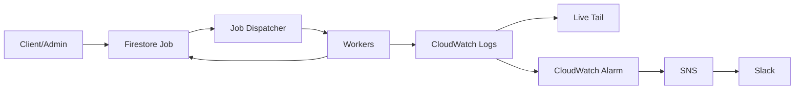
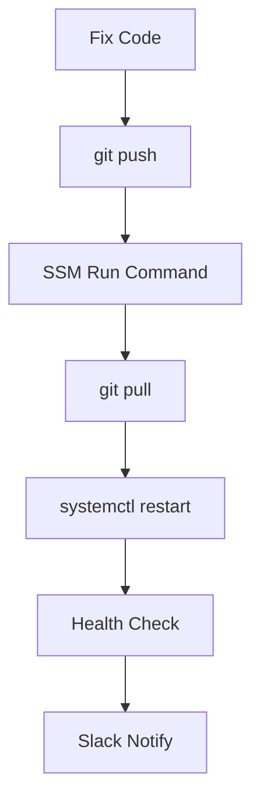

# 260323 AWS 작업 서버 모니터링 개선안

안녕하세요! 👋  
현재 운영 중인 **EC2 + tmux + Python worker + Firestore Job 테이블** 구조를 기준으로, AWS 네이티브 도구를 활용해 안정성과 운영 편의성을 올리는 현실적인 개선안을 정리했습니다.

---

## 1) 현재 구조 빠른 해석

코드 기준으로 이미 핵심 운영 요소는 잘 갖춰져 있습니다 ✅

- `z_job_mgr.py` 에서 `NOT_STARTED` 잡을 조회해 idle worker에 할당
- worker heartbeat(`dt_update`) 기준 30분 이상 지연 시 down 판정
- `z_svc_health.py` 에서 svc/worker/job 상태를 집계하고 Slack 알림 전송
- `ZtJob` 테이블에서 상태(`NOT_STARTED/RUNNING/FINISHED/FAILED/CANCELED`), 진행률, req/res를 보존

즉, 현재는 **잘 동작하는 커스텀 오케스트레이터**를 직접 운영하고 있는 형태입니다.

---

## 2) 요구사항 매핑

요구사항을 기술 요소로 바꾸면 다음 4가지입니다.

1. **실시간 로그 가시성** (tmux 느낌)
2. **장애 알림(Slack)**
3. **간단한 배포 흐름** (ssh 접속 후 `git pull` 수준)
4. **job 유실 방지** (Firestore 같은 영속성)

---

## 3) AWS 대안 옵션 비교

## 옵션 A. EC2 유지 + 운영 표준화 (가장 추천) ⭐

현재 구조를 유지하면서 운영 레이어만 AWS 네이티브로 강화합니다.

- 프로세스 실행: `tmux` → `systemd` 서비스(워커/디스패처/헬스체크)
- 로그: CloudWatch Logs 수집
- 실시간 tail: CloudWatch Live Tail (`aws logs start-live-tail`)
- 알림: CloudWatch Alarm + SNS + Amazon Q Developer(chat apps, 구 Chatbot)로 Slack 전송
- 원격 운영/배포: Session Manager + Run Command (필요 시 기존 SSH 병행)
- Job 저장소: Firestore 유지 (무중단/저리스크)

### 장점
- 코드 변경이 가장 적음 🧩
- 운영 안정성(재시작/로그/알림) 크게 향상
- 기존 배포 습관과 유사한 UX 유지 가능

### 단점
- 장기적으로는 EC2 관리 부담(패치/용량 계획)이 남음

---

## 옵션 B. ECS on EC2 (중기 추천)

worker/dispatcher를 컨테이너 서비스로 전환합니다.

- 서비스별 desired count 관리
- `awslogs` 드라이버로 표준 로그 수집
- ECS Exec로 컨테이너 진단
- 배포는 이미지 갱신 + `update-service --force-new-deployment`

### 장점
- 프로세스 생명주기/스케일/헬스 관리 자동화
- 표준화된 운영 모델

### 단점
- `ssh + git pull` 방식에서 **이미지 배포 방식**으로 사고 전환 필요

---

## 옵션 C. AWS Batch (장기 후보)

배치 워크로드에는 매우 강력하지만, 현재처럼 커스텀 디스패처 로직이 있는 구조에서는 초기에 마이그레이션 비용이 큽니다.

### 장점
- 큐/스케줄/컴퓨트 할당을 관리형으로 처리
- 대규모 배치 확장에 유리

### 단점
- 기존 dispatcher/worker 계약(프로토콜, 상태 갱신, 워커 타입 매칭) 재설계 부담

---

## 4) 권장 로드맵 (현실형)

## Phase 1 (1~2주): EC2 유지, 운영 강화

1. `systemd`로 워커/디스패처/헬스체크 등록 (`Restart=always`)
2. CloudWatch Agent 또는 앱 로그를 CloudWatch Logs로 집계
3. Live Tail 기반 운영 대시보드/필터 패턴 확정
4. 핵심 지표 알람 설정
   - worker heartbeat 지연
   - 대기 job 폭증
   - old job 발생
5. SNS → Slack 채널 연동
6. 배포 커맨드 표준화
   - 예: `git pull && systemctl restart zebra-worker@*`

## Phase 2 (2~6주): ECS on EC2 점진 이관

1. worker 1개 타입부터 컨테이너화
2. 기존 Firestore Job 테이블은 그대로 사용
3. canary 비율로 점진 전환(예: 10% → 50% → 100%)
4. 장애 시 EC2 systemd 경로로 즉시 롤백 가능하게 유지

---

## 5) Job 유실 방지 원칙 (중요)

핵심은 **저장소와 전달 채널의 역할 분리**입니다.

- **저장소(Source of Truth)**: Firestore Job 문서
- **전달 채널(선택)**: SQS 등 큐

SQS는 at-least-once 전달 특성이 있어 중복 수신이 가능하므로, worker는 반드시 idempotent 처리로 설계해야 합니다. 실패 메시지는 DLQ로 보내 원인 분석 및 재처리합니다.

---

## 6) 운영 모습 예시 (삽화)





---

## 7) 최종 제안 한 줄 요약

지금은 **옵션 A(EC2 유지 + CloudWatch/SSM/Alarm 표준화)**가 가장 안전하고 빠릅니다.  
그 다음 운영 안정화가 끝나면 **옵션 B(ECS on EC2)**로 단계적으로 넘어가는 전략이, 기능/리스크/속도 균형이 가장 좋습니다. 🚀

---

## 참고 URL (검증 근거)

- CloudWatch Logs Live Tail: https://docs.aws.amazon.com/AmazonCloudWatch/latest/logs/CloudWatchLogs_LiveTail.html
- CloudWatch Logs 그룹/스트림: https://docs.aws.amazon.com/AmazonCloudWatch/latest/logs/Working-with-log-groups-and-streams.html
- CloudWatch Alarms: https://docs.aws.amazon.com/AmazonCloudWatch/latest/monitoring/AlarmThatSendsEmail.html
- ECS 로그를 CloudWatch로 전송: https://docs.aws.amazon.com/AmazonECS/latest/developerguide/using_awslogs.html
- ECS Exec: https://docs.aws.amazon.com/AmazonECS/latest/developerguide/ecs-exec.html
- ECS 서비스 업데이트: https://docs.aws.amazon.com/AmazonECS/latest/developerguide/update-service-console-v2.html
- AWS Systems Manager Session Manager: https://docs.aws.amazon.com/systems-manager/latest/userguide/session-manager.html
- AWS Systems Manager Run Command: https://docs.aws.amazon.com/systems-manager/latest/userguide/run-command.html
- Amazon Q Developer in chat applications (구 AWS Chatbot): https://docs.aws.amazon.com/chatbot/latest/adminguide/what-is.html
- Amazon SQS 개요: https://docs.aws.amazon.com/AWSSimpleQueueService/latest/SQSDeveloperGuide/welcome.html
- SQS at-least-once 전달: https://docs.aws.amazon.com/AWSSimpleQueueService/latest/SQSDeveloperGuide/standard-queues-at-least-once-delivery.html
- SQS DLQ: https://docs.aws.amazon.com/AWSSimpleQueueService/latest/SQSDeveloperGuide/sqs-dead-letter-queues.html
- AWS Batch 개요: https://docs.aws.amazon.com/batch/latest/userguide/what-is-batch.html
- AWS Batch Job Queue: https://docs.aws.amazon.com/batch/latest/userguide/job_queues.html
- AWS Batch EventBridge 이벤트: https://docs.aws.amazon.com/batch/latest/userguide/batch_cwe_events.html

---

## 작성 시 사용한 사용자 질문 프롬프트

```text
hhd-research

주제
- 여러 작업 서버 인스턴스들과 그 모니터링 도구 솔루션

현재상황
- ec2 에 ubuntu 인스턴스 여러개를 잡아두고, 혹은 한대의 인스턴스에 tmux 로 여러 윈도우를 두고
- 다수의 python 스크립트를 실행한 상태
- 이를 worker 프로세스라 하고 있음.
- 클라이언트나 어드민에서 작업을 요청하면, firestore 의 job 테이블에 item이 insert 되고, job dispatcher 가 이를 worker에 할당하면, worker 들은 자신이 할당받은 job을 해석하여 작업수행하고 결과를 다시 job item 을 업데이트 함.
- 이를 위해 worker process 다수, job dispatcher process 1, health check process 1, job table 등을 모두 구현했음.

현재상황 참고 소스코드
- job dispatcher process : C:\Users\hhd20\project\ZebraSvr\z_job_mgr.py
- health check process : C:\Users\hhd20\project\ZebraSvr\maintain\z_svc_health.py
- job table : C:\Users\hhd20\project\ZebraSvr\dao\impl\zt_job.py

요구사항
- 이 작업들은 오랫동안 문제없이 운영해 오긴 했음.
- 그렇지만 혹시 이를 aws 기반 더 좋은 솔루션이 있을까요?
- tmux 처럼 실시간으로 출력되는 로그를 볼수 있어야 함.
- 문제가 생기면 health check가 slack으로 알람을 보내주는데 이것도 필요함.
- 문제를 수정하면, 이를 배포하는것도 기존처럼 ssh로 접속해서 tmux에서 git pull 처럼 간단해야 함.
- job 자체도 의미가 있어서 firestore 에 저장하는 것 처럼, job 들도 잃지 않아야 함.

hhd-md 진행
```
