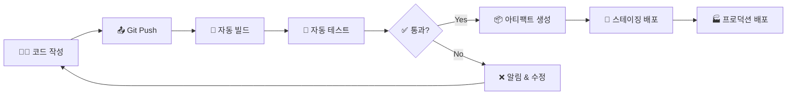
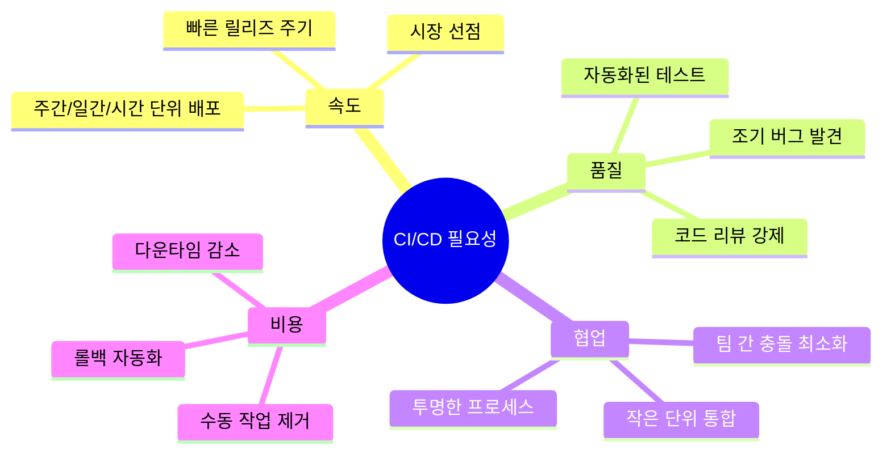
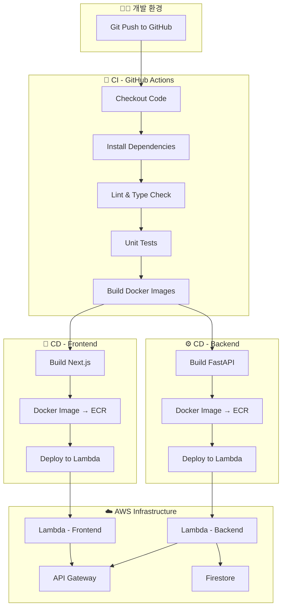
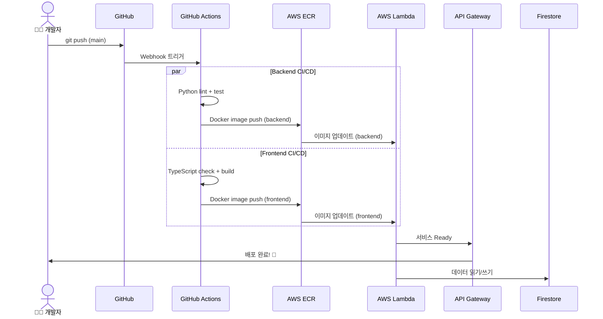
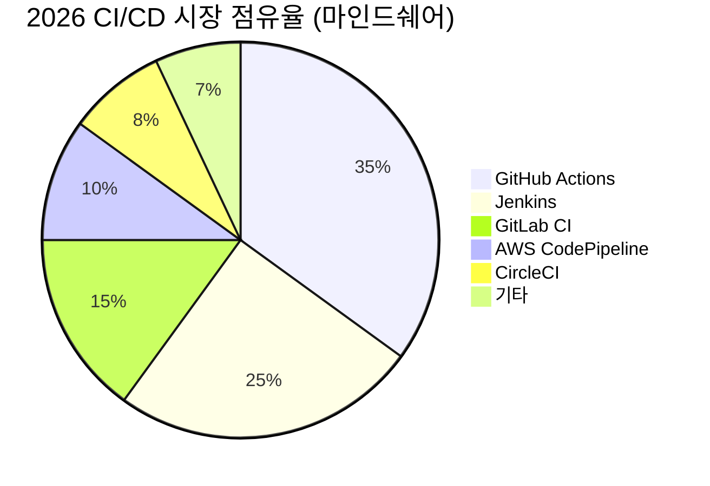
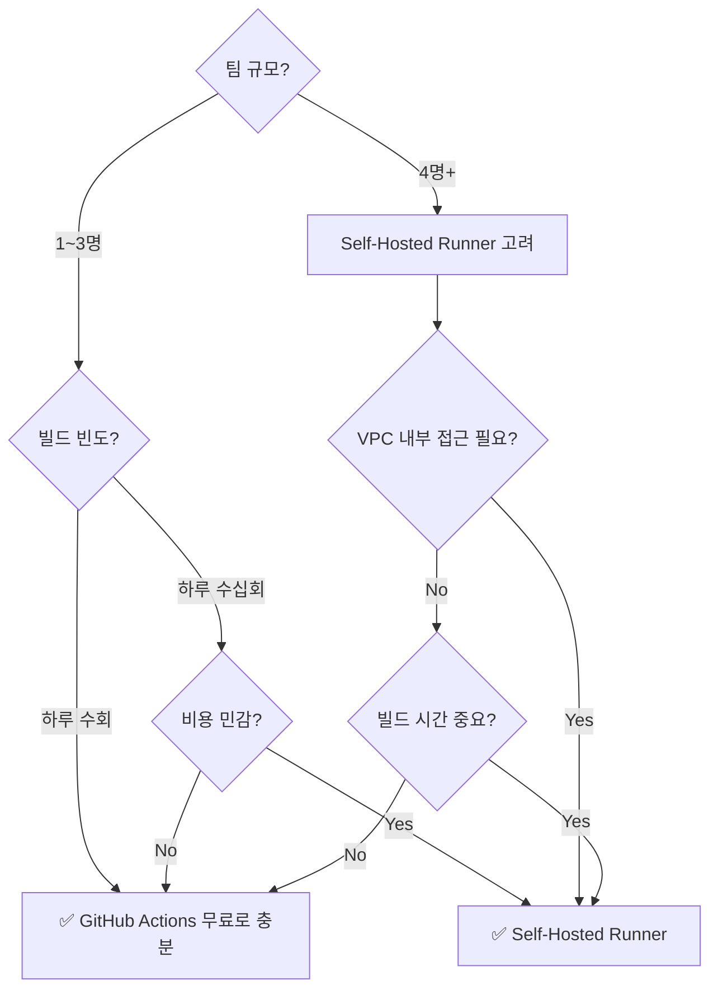

# 260323 CI/CD 파이프라인 종합 리서치 🚀

## 📌 목차

1. [CI/CD 소개](#1-cicd-소개-)
2. [필요성](#2-필요성-)
3. [장단점](#3-장단점-)
4. [내 프로젝트에 적용](#4-내-프로젝트에-적용-)
5. [간단 예제](#5-간단-예제-)
6. [실용 예제](#6-실용-예제-)
7. [CI/CD 클라우드 플랫폼 추천](#7-cicd-클라우드-플랫폼-추천-)

---

## 1. CI/CD 소개 🎯

### CI/CD란?

**CI/CD**는 **Continuous Integration(지속적 통합)** 과 **Continuous Delivery/Deployment(지속적 전달/배포)** 의 약자로, 소프트웨어 개발 라이프사이클을 자동화하는 핵심 DevOps 관행입니다.

| 용어 | 의미 | 핵심 활동 |
|------|------|-----------|
| **CI** (Continuous Integration) | 지속적 통합 | 코드 변경 → 자동 빌드 → 자동 테스트 |
| **CD** (Continuous Delivery) | 지속적 전달 | 테스트 통과 → 배포 준비 상태 유지 (수동 승인 후 배포) |
| **CD** (Continuous Deployment) | 지속적 배포 | 테스트 통과 → 프로덕션 자동 배포 |

### CI/CD 파이프라인 흐름



### 2026년 CI/CD 트렌드

- 🔒 **Shift-Left Security**: 보안 검사를 파이프라인 초기 단계에 통합
- 🤖 **AI 기반 테스트**: AI가 테스트 케이스 자동 생성 및 최적화
- 📊 **Observability-Driven**: 모니터링·로깅·트레이싱을 파이프라인에 내장
- 🏗️ **Infrastructure as Code (IaC)**: Terraform, CDK 등으로 인프라를 코드로 관리
- ⚡ **병렬 테스트 실행**: 15분 이내 전체 테스트 완료 목표

> 📖 참고: [CI/CD Pipeline Explained: Stages, Tools & Examples (2026)](https://www.netcomlearning.com/blog/ci-cd-pipeline) | [DevOps Engineering in 2026: Top CI/CD Tools](https://www.refontelearning.com/blog/devops-engineering-in-2026-top-ci-cd-tools-trends-and-best-practices-github-actions-vs-jenkins)

---

## 2. 필요성 💡

### 왜 CI/CD가 필요한가?



### CI/CD 없이 개발할 때의 문제점 😰

| 문제 | 설명 | CI/CD로 해결 |
|------|------|-------------|
| **통합 지옥** | 여러 개발자 코드를 한 번에 합치면 대규모 충돌 발생 | 작은 단위로 자주 통합 |
| **수동 배포 실수** | 사람이 직접 배포하면 실수 가능성 ↑ | 자동화된 배포 프로세스 |
| **느린 피드백** | 버그를 며칠 후에야 발견 | 커밋 즉시 테스트 실행 |
| **배포 공포** | "금요일엔 배포 금지" 문화 | 언제든 안전하게 배포 가능 |
| **환경 불일치** | "내 PC에선 되는데..." 문제 | Docker로 환경 통일 |

### 도입 효과 수치 📊

- 배포 시간: **수시간 → 수분** (최대 95% 단축)
- 배포 빈도: **월 1회 → 일 수회** (10x~100x 증가)
- 버그 발견 시간: **수일 → 수분** (조기 탐지)
- 롤백 시간: **수시간 → 수분** (자동 롤백)

> 📖 참고: [12 Benefits of CI/CD | JetBrains](https://www.jetbrains.com/teamcity/ci-cd-guide/benefits-of-ci-cd/) | [Best Practices for Awesome CI/CD | Harness](https://www.harness.io/blog/best-practices-for-awesome-ci-cd)

---

## 3. 장단점 ⚖️

### ✅ 장점

| 카테고리 | 장점 | 설명 |
|----------|------|------|
| 🚀 **속도** | 빠른 릴리즈 사이클 | 주간·일간·시간 단위 배포로 시장 대응력 극대화 |
| 🧪 **품질** | 자동화된 테스트 | 모든 빌드에 unit/integration/E2E 테스트 자동 실행 |
| 🐛 **안정성** | 조기 버그 탐지 | 작은 변경 단위로 문제 범위를 좁혀 빠른 해결 |
| 👥 **협업** | 팀 효율 향상 | 공유 파이프라인으로 개발·운영·QA 간 투명성 확보 |
| 🔒 **보안** | Shift-Left Security | 보안 스캔·정적 분석·의존성 취약점 검사 자동화 |
| 💰 **비용** | 운영비 절감 | 수동 작업 제거, 다운타임 최소화 |
| 🔄 **복구** | 빠른 롤백 | 자동 롤백 메커니즘으로 장애 시간 최소화 |

### ❌ 단점

| 카테고리 | 단점 | 대응 방안 |
|----------|------|-----------|
| 🏗️ **초기 비용** | 파이프라인 구축에 시간·비용 소요 | 단계적 도입, GitHub Actions 같은 관리형 서비스 활용 |
| 📚 **학습 곡선** | DevOps 도구 학습 필요 | 팀 교육, 문서화, 템플릿 공유 |
| 🧪 **테스트 의존** | 자동 테스트가 부실하면 무용지물 | 테스트 커버리지 기준 설정, TDD 문화 |
| 🔧 **유지보수** | 파이프라인 자체도 관리 대상 | IaC로 파이프라인을 코드로 관리 |
| 📢 **UX 커뮤니케이션** | 잦은 변경으로 사용자 혼란 가능 | 릴리즈 노트 자동화, Feature Flag 활용 |
| 🔐 **보안 리스크** | 시크릿·환경변수 관리 복잡 | Secret Manager, Vault 등 전용 도구 사용 |

> 📖 참고: [Pros and Cons of CI/CD | BairesDev](https://www.bairesdev.com/blog/pros-and-cons-of-ci-cd-pipelines/) | [Benefits and Challenges of CI/CD | TechTarget](https://www.techtarget.com/searchsoftwarequality/tip/The-pros-and-cons-of-CI-CD-pipelines)

---

## 4. 내 프로젝트에 적용 🏠

### 프로젝트 기술 스택

```
┌─────────────────────────────────────────────────────────┐
│                    🌐 Frontend                          │
│   Next.js + TypeScript + Tailwind CSS                   │
│   → AWS Lambda (Docker 컨테이너)                         │
├─────────────────────────────────────────────────────────┤
│                    ⚙️ Backend                            │
│   Python FastAPI                                        │
│   → AWS Lambda (Docker 컨테이너)                         │
├─────────────────────────────────────────────────────────┤
│                    🗄️ Database                           │
│   Google Firestore (NoSQL)                              │
└─────────────────────────────────────────────────────────┘
```

### 프로젝트 맞춤 CI/CD 아키텍처



### 각 컴포넌트별 CI/CD 전략

#### 🎨 Frontend (Next.js + TypeScript + Tailwind CSS)

| 단계 | 도구 | 설명 |
|------|------|------|
| Lint | ESLint | 코드 스타일 검사 |
| Type Check | `tsc --noEmit` | TypeScript 타입 검사 |
| Test | Jest + React Testing Library | 컴포넌트 테스트 |
| Build | `next build` | 프로덕션 빌드 |
| Docker | Multi-stage Dockerfile | 경량 이미지 생성 |
| Deploy | ECR → Lambda | 컨테이너 이미지 배포 |

#### ⚙️ Backend (Python FastAPI)

| 단계 | 도구 | 설명 |
|------|------|------|
| Lint | Ruff / Flake8 | Python 코드 스타일 검사 |
| Type Check | mypy | 타입 힌트 검증 |
| Test | pytest | API 엔드포인트 테스트 |
| Build | Docker | FastAPI + Mangum 패키징 |
| Deploy | ECR → Lambda | 컨테이너 이미지 배포 |

#### 🗄️ Firestore 연동 고려사항

- CI 환경에서 **Firestore Emulator** 사용하여 테스트
- 프로덕션 Firestore 접근에는 **GitHub Secrets**에 서비스 계정 키 저장
- 환경별(dev/staging/prod) **Firestore 프로젝트 분리** 권장

> 📖 참고: [Deploy FastAPI on AWS Lambda with Docker](https://dev.to/dev_insights/deploy-fastapi-on-aws-lambda-with-docker-2025-3a3a) | [Next.js Deployment on AWS Lambda](https://dev.to/aws-builders/nextjs-deployment-on-aws-lambda-ecs-amplify-and-vercel-what-i-learned-nmc)

---

## 5. 간단 예제 📝

### 5-1. 가장 기본적인 CI 워크플로우 (GitHub Actions)

> main 브랜치에 PR이 올라오면 자동으로 테스트를 실행하는 예제

```yaml
# .github/workflows/ci.yml
name: CI Pipeline

on:
  pull_request:
    branches: [main]

jobs:
  test:
    runs-on: ubuntu-latest
    steps:
      - name: Checkout code
        uses: actions/checkout@v4

      - name: Set up Python
        uses: actions/setup-python@v5
        with:
          python-version: '3.12'

      - name: Install dependencies
        run: |
          python -m pip install --upgrade pip
          pip install -r requirements.txt

      - name: Run tests
        run: pytest
```

### 5-2. 가장 기본적인 CD 워크플로우

> main에 merge되면 자동으로 EC2에 배포하는 예제

```yaml
# .github/workflows/cd.yml
name: CD Pipeline

on:
  push:
    branches: [main]

jobs:
  deploy:
    runs-on: ubuntu-latest
    steps:
      - name: Checkout code
        uses: actions/checkout@v4

      - name: Deploy via SSH
        uses: appleboy/ssh-action@master
        with:
          host: ${{ secrets.EC2_HOST }}
          username: ${{ secrets.EC2_USER }}
          key: ${{ secrets.EC2_SSH_KEY }}
          script: |
            cd /home/ubuntu/my-app
            git pull origin main
            docker-compose down
            docker-compose up -d --build
```

### 5-3. 워크플로우 파일 구조

```
my-project/
├── .github/
│   └── workflows/
│       ├── ci.yml          ← PR 시 자동 테스트
│       └── cd.yml          ← merge 시 자동 배포
├── Dockerfile
├── docker-compose.yml
├── requirements.txt
└── app/
    └── main.py
```

> 📖 참고: [How to Build Your First CI/CD Pipeline in 2026](https://www.nwkings.com/how-to-build-your-first-ci-cd-pipeline) | [CI/CD Pipelines Explained: A Practical Guide](https://www.jeeviacademy.com/ci-cd-pipelines-explained-a-practical-guide-for-2026/)

---

## 6. 실용 예제 🔥

### 내 프로젝트 (Next.js + FastAPI + Lambda) 전체 CI/CD 구성

#### 6-1. FastAPI Backend - Dockerfile

```dockerfile
# backend/Dockerfile
FROM public.ecr.aws/lambda/python:3.12

# 의존성 설치
COPY requirements.txt ${LAMBDA_TASK_ROOT}
RUN pip install -r requirements.txt

# 앱 코드 복사
COPY ./app ${LAMBDA_TASK_ROOT}/app

# Mangum 핸들러 지정 (FastAPI → Lambda 어댑터)
CMD ["app.main.handler"]
```

#### 6-2. FastAPI main.py (Lambda 호환)

```python
# app/main.py
from fastapi import FastAPI
from mangum import Mangum

app = FastAPI(title="My API")

@app.get("/health")
async def health_check():
    return {"status": "healthy"}

@app.get("/api/stocks")
async def get_stocks():
    # Firestore에서 주식 데이터 조회
    ...

# Lambda 핸들러 (Mangum이 API Gateway ↔ FastAPI 변환)
handler = Mangum(app, lifespan="off")
```

#### 6-3. Next.js Frontend - Dockerfile

```dockerfile
# frontend/Dockerfile
FROM public.ecr.aws/lambda/nodejs:20 AS builder

WORKDIR /app
COPY package*.json ./
RUN npm ci
COPY . .
RUN npm run build

FROM public.ecr.aws/lambda/nodejs:20
COPY --from=builder /app/.next/standalone ${LAMBDA_TASK_ROOT}
COPY --from=builder /app/.next/static ${LAMBDA_TASK_ROOT}/.next/static
COPY --from=builder /app/public ${LAMBDA_TASK_ROOT}/public

CMD ["server.handler"]
```

#### 6-4. 통합 CI/CD 워크플로우 (GitHub Actions)

```yaml
# .github/workflows/deploy.yml
name: 🚀 Build & Deploy Pipeline

on:
  push:
    branches: [main]
  pull_request:
    branches: [main]

env:
  AWS_REGION: ap-northeast-2
  ECR_REGISTRY: ${{ secrets.AWS_ACCOUNT_ID }}.dkr.ecr.ap-northeast-2.amazonaws.com

jobs:
  # ━━━━━━━━━━━━━━━━━━━━━━━━━━━━━━━━━━
  # 🧪 CI: 테스트 & 검증
  # ━━━━━━━━━━━━━━━━━━━━━━━━━━━━━━━━━━
  ci-backend:
    name: 🐍 Backend CI
    runs-on: ubuntu-latest
    steps:
      - uses: actions/checkout@v4

      - name: Set up Python
        uses: actions/setup-python@v5
        with:
          python-version: '3.12'

      - name: Install dependencies
        run: |
          cd backend
          pip install -r requirements.txt
          pip install pytest ruff mypy

      - name: Lint (Ruff)
        run: cd backend && ruff check .

      - name: Type Check (mypy)
        run: cd backend && mypy app/

      - name: Run Tests
        run: cd backend && pytest --tb=short -q
        env:
          FIRESTORE_EMULATOR_HOST: localhost:8080

  ci-frontend:
    name: 🎨 Frontend CI
    runs-on: ubuntu-latest
    steps:
      - uses: actions/checkout@v4

      - name: Set up Node.js
        uses: actions/setup-node@v4
        with:
          node-version: '20'
          cache: 'npm'
          cache-dependency-path: frontend/package-lock.json

      - name: Install dependencies
        run: cd frontend && npm ci

      - name: Lint (ESLint)
        run: cd frontend && npm run lint

      - name: Type Check (TypeScript)
        run: cd frontend && npx tsc --noEmit

      - name: Run Tests
        run: cd frontend && npm test -- --ci

      - name: Build
        run: cd frontend && npm run build

  # ━━━━━━━━━━━━━━━━━━━━━━━━━━━━━━━━━━
  # 🚀 CD: Docker 빌드 & Lambda 배포
  # ━━━━━━━━━━━━━━━━━━━━━━━━━━━━━━━━━━
  cd-backend:
    name: 🐍 Backend Deploy
    needs: [ci-backend]
    if: github.event_name == 'push' && github.ref == 'refs/heads/main'
    runs-on: ubuntu-latest
    steps:
      - uses: actions/checkout@v4

      - name: Configure AWS Credentials
        uses: aws-actions/configure-aws-credentials@v4
        with:
          aws-access-key-id: ${{ secrets.AWS_ACCESS_KEY_ID }}
          aws-secret-access-key: ${{ secrets.AWS_SECRET_ACCESS_KEY }}
          aws-region: ${{ env.AWS_REGION }}

      - name: Login to ECR
        id: ecr-login
        uses: aws-actions/amazon-ecr-login@v2

      - name: Build & Push Docker Image
        run: |
          IMAGE_TAG="${{ env.ECR_REGISTRY }}/backend:${{ github.sha }}"
          docker build -t $IMAGE_TAG ./backend
          docker push $IMAGE_TAG

      - name: Update Lambda Function
        run: |
          aws lambda update-function-code \
            --function-name my-backend-api \
            --image-uri "${{ env.ECR_REGISTRY }}/backend:${{ github.sha }}"

      - name: Wait for Lambda Update
        run: |
          aws lambda wait function-updated \
            --function-name my-backend-api

  cd-frontend:
    name: 🎨 Frontend Deploy
    needs: [ci-frontend]
    if: github.event_name == 'push' && github.ref == 'refs/heads/main'
    runs-on: ubuntu-latest
    steps:
      - uses: actions/checkout@v4

      - name: Configure AWS Credentials
        uses: aws-actions/configure-aws-credentials@v4
        with:
          aws-access-key-id: ${{ secrets.AWS_ACCESS_KEY_ID }}
          aws-secret-access-key: ${{ secrets.AWS_SECRET_ACCESS_KEY }}
          aws-region: ${{ env.AWS_REGION }}

      - name: Login to ECR
        id: ecr-login
        uses: aws-actions/amazon-ecr-login@v2

      - name: Build & Push Docker Image
        run: |
          IMAGE_TAG="${{ env.ECR_REGISTRY }}/frontend:${{ github.sha }}"
          docker build -t $IMAGE_TAG ./frontend
          docker push $IMAGE_TAG

      - name: Update Lambda Function
        run: |
          aws lambda update-function-code \
            --function-name my-frontend-app \
            --image-uri "${{ env.ECR_REGISTRY }}/frontend:${{ github.sha }}"
```

#### 6-5. 필요한 GitHub Secrets 설정

| Secret Name | 설명 | 예시 |
|-------------|------|------|
| `AWS_ACCOUNT_ID` | AWS 계정 ID | `123456789012` |
| `AWS_ACCESS_KEY_ID` | IAM 액세스 키 | `AKIA...` |
| `AWS_SECRET_ACCESS_KEY` | IAM 시크릿 키 | `wJalr...` |
| `GOOGLE_CREDENTIALS` | Firestore 서비스 계정 JSON | `{"type":"service_account",...}` |

#### 6-6. 배포 파이프라인 시퀀스 다이어그램



> 📖 참고: [FastAPI + Docker + AWS Lambda (2025)](https://dev.to/dev_insights/deploy-fastapi-on-aws-lambda-with-docker-2025-3a3a) | [AWS Lambda FastAPI CI/CD Pipeline](https://github.com/azzan-amin-97/aws-serverless-fastapi-cicd-pipeline) | [FastAPI CI/CD: GitHub Actions, Docker & AWS EC2](https://dev.to/tony_uketui_6cca68c7eba02/deploying-a-fastapi-app-with-cicd-github-actions-docker-nginx-aws-ec2-6p8)

---

## 7. CI/CD 클라우드 플랫폼 추천 ☁️

### 7-1. 플랫폼 비교 총정리



| 플랫폼 | 장점 | 단점 | 월 비용 (소규모) | 추천 대상 |
|--------|------|------|-----------------|-----------|
| **GitHub Actions** ⭐ | GitHub 네이티브, YAML 설정 간편, 거대 마켓플레이스 | GitHub 종속, 복잡한 워크플로우 디버깅 어려움 | 무료 (2,000분/월) | 대부분의 프로젝트 |
| **AWS CodePipeline** | AWS 서비스 완벽 통합, IAM 보안 | 설정 복잡, 제한적 유연성 | ~$1/파이프라인 + CodeBuild 비용 | AWS 올인 프로젝트 |
| **Jenkins** | 최고의 유연성, 1,800+ 플러그인 | 자체 관리 필요, 보안 패치 부담 | EC2 비용 (~$30~) | 커스텀 요구사항 多 |
| **GitLab CI** | GitLab 일체형, 내장 컨테이너 레지스트리 | GitHub보다 생태계 작음 | 무료 (400분/월) | GitLab 사용 팀 |
| **CircleCI** | 빠른 빌드, 캐싱 우수 | 비용이 빠르게 증가 | 무료 (6,000크레딧/월) | 고성능 필요 팀 |

### 7-2. AWS 내에서의 추천 💎

#### 🏆 Option A: GitHub Actions + AWS (⭐ 가장 추천)

```
GitHub Actions → ECR → Lambda
```

**왜 추천?**
- 설정이 가장 간편 (YAML 파일 하나로 끝)
- GitHub 무료 플랜으로 소규모 프로젝트 충분
- AWS 서비스 연동 액션이 마켓플레이스에 풍부
- 현재 프로젝트(GitHub 기반)에 가장 자연스러운 선택

**비용**: 무료 ~ $4/월 (소규모 기준)

#### 🥈 Option B: AWS CodePipeline + CodeBuild

```
CodePipeline → CodeBuild → ECR → Lambda
```

**장점:**
- AWS 네이티브로 IAM 역할 기반 보안 우수
- CloudWatch와 연동으로 모니터링 편리
- 2026년 GitHub App 통합으로 설정 간소화

**단점:**
- 초기 설정이 GitHub Actions보다 복잡
- CodeBuild 빌드 환경 커스텀에 시간 소요

**비용**: ~$1/파이프라인/월 + CodeBuild $0.005/분

#### 🥉 Option C: Jenkins on EC2 (자체 호스팅)

```
Jenkins (EC2) → ECR → Lambda
```

**장점:**
- 완전한 커스텀 제어
- 플러그인 생태계 (1,800개+)
- 복잡한 빌드 로직 구현 가능

**단점:**
- EC2 인스턴스 직접 관리 (패치, 백업, 스케일링)
- Jenkins 자체 보안 관리 부담
- 1인/소규모 팀에는 오버스펙

**비용**: t3.medium ~$30/월 + EBS 비용

### 7-3. EC2로 직접 CI/CD 구축하기 🖥️

#### 방법 1: EC2에 Jenkins 설치

```bash
# EC2 인스턴스에 Jenkins 설치 (Amazon Linux 2023)
sudo dnf update -y
sudo dnf install java-17-amazon-corretto -y

# Jenkins 저장소 추가 및 설치
sudo wget -O /etc/yum.repos.d/jenkins.repo \
  https://pkg.jenkins.io/redhat-stable/jenkins.repo
sudo rpm --import https://pkg.jenkins.io/redhat-stable/jenkins.io-2023.key
sudo dnf install jenkins -y

# Jenkins 시작
sudo systemctl start jenkins
sudo systemctl enable jenkins

# 방화벽 설정
sudo ufw allow 8080
```

#### 방법 2: EC2에 GitHub Actions Self-Hosted Runner 설치

> GitHub Actions의 편리함 + EC2의 성능을 결합하는 하이브리드 방식 ⭐

```bash
# EC2 인스턴스에서 실행
# 1. Runner 다운로드
mkdir actions-runner && cd actions-runner
curl -o actions-runner-linux-x64-2.321.0.tar.gz -L \
  https://github.com/actions/runner/releases/download/v2.321.0/actions-runner-linux-x64-2.321.0.tar.gz
tar xzf ./actions-runner-linux-x64-2.321.0.tar.gz

# 2. Runner 등록
./config.sh --url https://github.com/YOUR_ORG/YOUR_REPO \
  --token YOUR_TOKEN

# 3. 서비스로 실행
sudo ./svc.sh install
sudo ./svc.sh start
```

워크플로우에서 Self-Hosted Runner 사용:

```yaml
jobs:
  build:
    runs-on: self-hosted  # ← GitHub 호스팅 대신 EC2 사용
    steps:
      - uses: actions/checkout@v4
      - run: docker build -t my-app .
      - run: docker push ...
```

#### Self-Hosted Runner 장점 🚀

| 비교 항목 | GitHub-Hosted | Self-Hosted (EC2) |
|----------|---------------|-------------------|
| 빌드 속도 | 보통 | **6x 빠름** (Docker 캐시 공유) |
| 비용 | 무료 2,000분 후 과금 | EC2 비용만 (~$30/월) |
| 커스텀 | 제한적 | **완전 커스텀** |
| 관리 부담 | 없음 | EC2 관리 필요 |
| 네트워크 | 외부 | **VPC 내부 접근 가능** |

#### EC2 직접 구축 추천 여부 판단 기준



### 7-4. 🎯 내 프로젝트 최종 추천

| 기준 | 추천 | 이유 |
|------|------|------|
| **가장 간편** | ⭐ GitHub Actions | YAML 하나로 끝, 무료, 바로 시작 |
| **AWS 최적화** | AWS CodePipeline | IAM 통합, CloudWatch 모니터링 |
| **비용 최소화** | GitHub Actions (무료 플랜) | 월 2,000분 무료, 소규모 충분 |
| **성능 최대화** | Self-Hosted Runner on EC2 | Docker 캐시 공유로 6x 빠른 빌드 |

> **💡 결론**: 현재 프로젝트 규모(Next.js + FastAPI + Lambda)에서는 **GitHub Actions**가 최적입니다. 프로젝트가 성장하면 Self-Hosted Runner로 전환하면 됩니다.

> 📖 참고: [GitHub Actions vs AWS CodePipeline (2025)](https://thecloudguru.medium.com/github-actions-vs-aws-codepipeline-which-one-should-you-choose-in-2025-ba0019486aca) | [AWS CodePipeline vs Jenkins vs GitHub Actions (2026)](https://medium.com/@tams67680/aws-codepipeline-vs-jenkins-vs-github-actions-a-practical-ci-cd-comparison-588827990a2e) | [Self-Hosted Runners: 6x Faster Builds](https://www.kubeblogs.com/fixing-slow-ci-cd-pipelines-after-migrating-from-jenkins-to-github-actions/) | [CI/CD with GitHub Actions Self-Hosted Runner](https://dev.to/patil_sai/cicd-with-github-actions-using-aws-self-hosted-runner-1gap)

---

## 📎 전체 참고 자료

| 카테고리 | 출처 |
|----------|------|
| CI/CD 개요 | [CI/CD Pipeline Explained (2026) - NetcomLearning](https://www.netcomlearning.com/blog/ci-cd-pipeline) |
| CI/CD 개요 | [What Is CI/CD? Complete Guide - Octopus Deploy](https://octopus.com/devops/ci-cd/) |
| 베스트 프랙티스 | [Top 10 CI/CD Best Practices (2026)](https://www.tekrecruiter.com/post/top-10-ci-cd-pipeline-best-practices-for-engineering-leaders-in-2026) |
| 베스트 프랙티스 | [16 CI/CD Best Practices - TestMu AI](https://www.testmuai.com/blog/best-practices-of-ci-cd-pipelines-for-speed-test-automation/) |
| 장단점 | [Pros and Cons of CI/CD - BairesDev](https://www.bairesdev.com/blog/pros-and-cons-of-ci-cd-pipelines/) |
| 장단점 | [Benefits of CI/CD - JetBrains](https://www.jetbrains.com/teamcity/ci-cd-guide/benefits-of-ci-cd/) |
| FastAPI 배포 | [FastAPI + Docker + AWS Lambda](https://dev.to/dev_insights/deploy-fastapi-on-aws-lambda-with-docker-2025-3a3a) |
| FastAPI CI/CD | [FastAPI CI/CD: GitHub Actions + Docker + EC2](https://dev.to/tony_uketui_6cca68c7eba02/deploying-a-fastapi-app-with-cicd-github-actions-docker-nginx-aws-ec2-6p8) |
| Next.js 배포 | [Next.js CI/CD on AWS](https://dev.to/aws-builders/nextjs-deployment-on-aws-lambda-ecs-amplify-and-vercel-what-i-learned-nmc) |
| Next.js CI/CD | [Next.js CI/CD with GitHub Actions](https://eastondev.com/blog/en/posts/dev/20251220-nextjs-cicd-github-actions/) |
| 플랫폼 비교 | [GitHub Actions vs AWS CodePipeline (2025)](https://thecloudguru.medium.com/github-actions-vs-aws-codepipeline-which-one-should-you-choose-in-2025-ba0019486aca) |
| 플랫폼 비교 | [CodePipeline vs Jenkins vs GitHub Actions (2026)](https://medium.com/@tams67680/aws-codepipeline-vs-jenkins-vs-github-actions-a-practical-ci-cd-comparison-588827990a2e) |
| EC2 Self-Hosted | [Self-Hosted Runners: 6x Faster Builds](https://www.kubeblogs.com/fixing-slow-ci-cd-pipelines-after-migrating-from-jenkins-to-github-actions/) |
| AWS CI/CD 가이드 | [CI/CD Pipeline on AWS (2026)](https://kodekloud.com/blog/how-to-build-a-ci-cd-pipeline-on-aws-in-2026-step-by-step-guide/) |

---

## 프롬프트

```text
주제 : CI/CD

- 소개
- 필요성
- 장단점
- 내 프로젝트
  - next.js, typescript, tailwind.css
  - aws lambda 에 docker 배포
  - python fastapi backend
  - firestore 사용
- 간단 예제
- 실용 예제
- CI/CD 구축하는 실무 클라우드 플랫폼 추천
  - in aws
  - ec2로 직접하는 방식?
```
