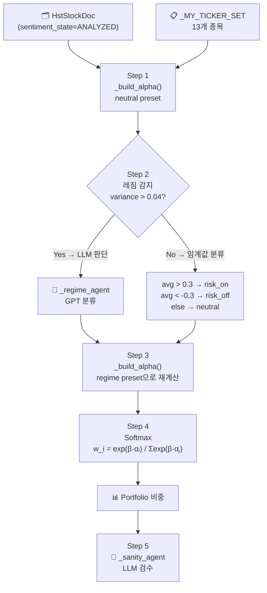

# 260327 024_portfolio_rebalancing 코드 분석 — 종목 구성이 결과에 미치는 영향

> 핵심 질문: 포트폴리오 종목 구성이 달라지면 최종 결과가 달라지는가?
> 그리고 그것이 실제 포트폴리오 이론처럼 종목 간 구성에 따른 차별인가?

---

## 🗂️ 알고리즘 전체 구조

`024_portfolio_rebalancing.py` 는 5단계로 구성된 감성 기반 포트폴리오 리밸런싱 파이프라인이다.



---

## 🔬 알파(α) 계산 수식

각 종목의 알파는 다음 수식으로 계산된다:

$$S_d = w_R \cdot R_d + w_T \cdot T_d + w_E \cdot E_d + w_P \cdot P_d + w_V \cdot V_d$$

$$\alpha_i^{\text{raw}} = \frac{\sum_d S_d \cdot \text{score}_{d,i}}{\sum_d S_d}$$

$$\alpha_i = \alpha_i^{\text{raw}} \times \underbrace{\frac{n_i}{n_i + K}}_{\text{shrinkage confidence}}$$

| 변수 | 의미 | 값 |
|------|------|----|
| $R_d$ | 문서 신뢰도 (FILING=1.0 ~ SOCIAL=0.2) | 문서 타입별 고정 |
| $T_d$ | 최신성 감쇠 $e^{-\Delta h / \tau}$ | 시간에 따라 감소 |
| $E_d$ | 감성 강도 (절댓값 평균) | 문서 내 전체 종목 기준 |
| $P_d$ | 인기도 (좋아요+댓글, log) | doc_list 전체 max 기준 |
| $V_d$ | 정보량 (문서 수, log) | **ticker_set 내 max 기준** ← 핵심 |
| $K$ | Shrinkage 계수 (K=20) | 문서 부족 시 alpha 0 수렴 |

---

## 🔍 2단계 — ticker_set 변경 시 변동 경로 추적

각 변수가 ticker_set에 의존하는지 분석한다.

### ✅ `pop_max` — ticker_set과 독립

```python
pop_raw_list = [math.log1p(d.like_count + 0.5 * d.comment_count) for d in doc_list]
pop_max = max(pop_raw_list)  # doc_list 전체, ticker_set 무관
```

- `doc_list`는 `sentiment_state=ANALYZED` 전체 쿼리 → ticker_set이 바뀌어도 변동 없음

---

### ✅ `E_d` — ticker_set과 독립

```python
abs_scores = [abs(s.score) for s in doc.sentiment_list if s.score != 0.0]
e_d = sum(abs_scores) / len(abs_scores)
```

- 문서 내 **전체 sentiment_list** 기준 계산 → ticker_set 필터 없음

---

### ⚠️ `v_max` — **ticker_set에 의존** (핵심 변동 지점)

```python
ticker_doc_cnt = {t: 0 for t in ticker_set}       # ticker_set으로 초기화
for doc in doc_list:
    for s in doc.sentiment_list:
        if s.ticker in ticker_set:                  # ticker_set 필터
            ticker_doc_cnt[s.ticker] += 1
v_max = math.log1p(max(ticker_doc_cnt.values()))   # ticker_set 전체의 max
```

> 🔴 **문서량이 많은 종목을 추가/제거하면 `v_max`가 바뀐다 → 전체 종목의 `V_d` 스케일이 바뀐다 → 모든 종목의 `doc_weight`가 바뀐다 → 모든 alpha 값 변동**

---

### ⚠️ 레짐 감지 — ticker_set에 간접 의존

```python
vals = list(asset_alpha.values())
sentiment_avg = sum(vals) / len(vals)          # 전체 alpha 평균
variance = sum((v - sentiment_avg)**2 ...) / len(vals)  # 전체 alpha 분산
```

- alpha가 바뀌면 `sentiment_avg`, `variance` 변동
- `variance > 0.04` 임계값을 넘으면 LLM 레짐 분류 호출
- **레짐이 달라지면 Step3 가중치 프리셋이 바뀌어 alpha 전체 재계산**

---

### ⚠️ Softmax 분모 — ticker_set에 직접 의존

$$w_i = \frac{e^{\beta \alpha_i}}{\sum_{j \in \text{ticker\_set}} e^{\beta \alpha_j}}$$

- 종목 추가 → 분모 증가 → 기존 종목 비중 감소
- 이것은 "파이 나누기(pie splitting)" 효과로, 포트폴리오 이론적 분산 효과와는 무관

---

## 🏛️ 3단계 — 종목 간 상호작용 존재 여부

### Modern Portfolio Theory (Markowitz, 1952) 의 핵심

$$\sigma_p^2 = \sum_i \sum_j w_i w_j \sigma_{ij}$$

- **공분산 행렬** $\Sigma$가 종목 간 상관관계를 집약
- 저상관 종목 추가 → 포트폴리오 리스크 **직접 감소** (Diversification Effect)
- 최적화: $\min_w \; w^T \Sigma w$ (이차계획법)

> 📖 참고: [Modern Portfolio Theory - Wikipedia](https://en.wikipedia.org/wiki/Modern_portfolio_theory)

---

### 이 코드의 alpha 계산 구조

```
alpha_A ← A의 문서 감성 점수만 반영
alpha_B ← B의 문서 감성 점수만 반영
                              ← A와 B 사이 공분산: ❌ 없음
```

각 ticker의 alpha는 **독립적으로 계산**된다. 종목 간 수익률 상관계수나 공분산이 어디에도 나타나지 않는다.

---

## 📊 4단계 — MPT vs 이 코드 비교

| 항목 | MPT (Markowitz) | 이 코드 (Sentiment Softmax) |
|------|-----------------|--------------------------|
| 이론 기반 | Markowitz (1952) | 행동재무학 + 감성 분석 |
| 핵심 입력 | 과거 수익률 + 공분산 행렬 | 감성 점수 (alpha) |
| 최적화 방식 | 이차계획법 (QP) | Softmax 정규화 |
| 리스크 고려 | 명시적 분산 최소화 | 간접 반영 (레짐 기반) |
| 종목 간 상관 | ✅ 핵심 (공분산 행렬) | ❌ 없음 |
| 종목 구성 변경 효과 | 분산 효과 (이론적) | 정규화 아티팩트 (부수적) |

> 📖 참고: [Parametric portfolio with momentum sentiment - PLOS ONE](https://journals.plos.org/plosone/article?id=10.1371/journal.pone.0335462)

---

## ✅ 최종 결론

**Q: 종목 구성이 달라지면 최종 결과가 달라지는가?**
→ ✅ **달라진다**

**Q: 그것이 포트폴리오 이론처럼 종목 간 구성에 따른 차별인가?**
→ ❌ **아니다**

### 변동의 실제 원인 (3가지 아티팩트)

```
1. v_max 변동      → 정규화 스케일 변동 (의도치 않은 부작용)
2. 레짐 변동       → 전체 alpha 분포가 바뀌어 regime 분류 영향
3. Softmax 분모    → 파이 나누기 (종목 추가 = 파이 조각 재분배)
```

### 이 코드의 본질

> 이 코드는 **감성 기반 모멘텀 모델**이다.
> 종목 구성이 "분산 효과"나 "리스크 조정"에 영향을 주지 않으며,
> 포트폴리오 이론의 핵심인 **공분산 행렬이 존재하지 않는다.**

---

## 💡 개선 방향 (참고)

실제 포트폴리오 이론처럼 종목 간 구성 차별을 만들려면:

1. **수익률 시계열 수집** → 공분산 행렬 계산
2. **alpha를 기대수익률로 활용** → Mean-Variance 최적화
3. **MV_MS 하이브리드 모델**: 감성 알파로 종목 선별 후, MPT로 비중 최적화

> 📖 참고: [Fusion of Sentiment and Asset Price Predictions - arXiv](https://arxiv.org/pdf/2203.05673)

---

## 📚 참고 자료

- [Modern Portfolio Theory - Wikipedia](https://en.wikipedia.org/wiki/Modern_portfolio_theory)
- [Portfolio Variance: Covariance Matrix - QuantInsti](https://blog.quantinsti.com/calculating-covariance-matrix-portfolio-variance/)
- [Parametric Portfolio + Momentum Sentiment - PLOS ONE](https://journals.plos.org/plosone/article?id=10.1371/journal.pone.0335462)
- [Sentiment + Price Fusion for Portfolio - arXiv](https://arxiv.org/pdf/2203.05673)

---

## 📝 작성 시 사용한 프롬프트

```text
C:\Users\hhd20\project\HhdStock\py\study\024_portfolio_rebalancing.py

이 로직을 분석해 보면
입력의 포트폴리오 종목 구성이 달라지면 최종결과에 변동이 있는가?
즉 실제 포트폴리오 이론처럼 종목간 구성에 따른 차별이 있는가?
```
