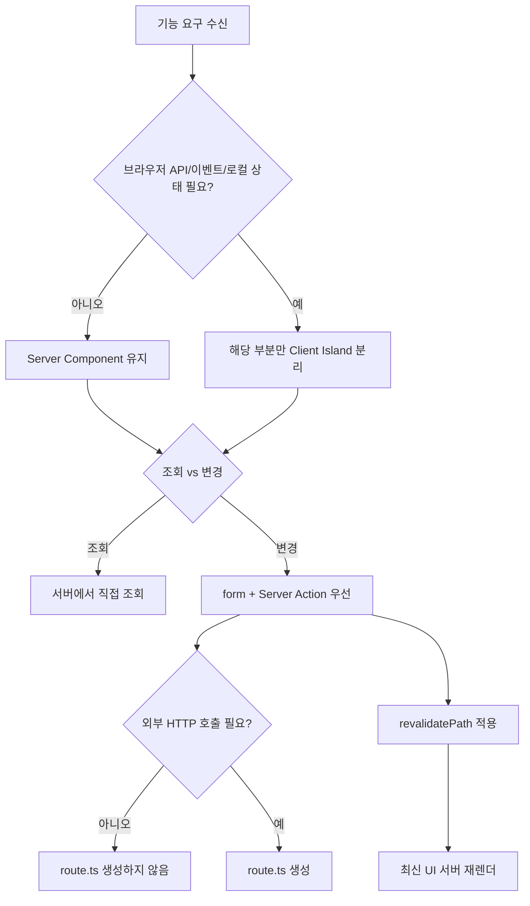

# 260331 Next.js SSR 최대화 LLM 실행 규칙

Next.js App Router를 사용할 때, SSR을 최대화하는 방법은 복잡하지 않습니다.  
핵심은 한 줄입니다.

> 기본은 서버에서 렌더링하고, 클라이언트는 꼭 필요한 만큼만 사용한다.

이 문서는 사람이 읽는 설명서가 아니라, **LLM이 일관된 의사결정으로 코드를 생성/수정**하도록 돕는 실행 규칙 문서입니다.

---

## 왜 이 규칙이 중요한가

App Router는 React Server Components(RSC)를 기본 모델로 삼습니다.  
즉, SSR 친화적인 구조는 "옵션"이 아니라 "기본 동작"에 가깝습니다.

이 기본값을 유지하면 다음 이점이 큽니다.

- 초기 렌더링 성능과 SEO 개선
- 서버 자원(DB, 비밀키, 권한체크) 활용 용이
- 클라이언트 번들 크기 감소
- 데이터 일관성 유지(재검증 중심)

---

## 실행 우선순위 (LLM 의사결정 기준)

1. 서버 우선 렌더링 유지
2. 서버에서 조회/변경 처리
3. 클라이언트 경계 최소화
4. 재검증 중심의 UI 동기화
5. 보안 정보 서버 고정

---

## 핵심 규칙 12가지

### 1) 페이지는 Server Component로 시작

- `page.tsx`, `layout.tsx`에는 기본적으로 `'use client'`를 붙이지 않는다.
- 초기 데이터 조회, 권한 체크, 비밀키 사용은 서버에서 처리한다.

### 2) 조회(Read)는 서버 직접 조회 우선

- 목록/상세/대시보드 첫 렌더 데이터는 서버에서 가져온다.
- `useEffect` 재조회는 실시간성/고급 캐시가 필요한 경우에만 사용한다.

### 3) 변경(Write)은 `form + Server Action` 우선

- 생성/수정/삭제는 `<form action={serverAction}>` 패턴을 먼저 고려한다.
- JS 비활성 환경에서도 동작하는 기본 흐름을 우선한다.

### 4) `'use client'`는 작은 섬(Island)으로 제한

- `useState`, 이벤트 핸들러, 브라우저 API가 필요한 부분만 분리한다.
- 페이지 전체를 클라이언트 컴포넌트로 바꾸지 않는다.

### 5) SWR/React Query/axios는 필요 시에만

- 초기 렌더는 서버 중심으로 처리한다.
- 실시간 갱신, 복잡한 캐시 시나리오에서만 도입한다.

### 6) `route.ts`는 외부 HTTP API가 필요할 때만

- 내부 전용 로직은 Server Action/서버 함수로 처리한다.
- 외부 시스템 호출 요구가 있을 때만 Route Handler를 만든다.

### 7) 다중 버튼은 `formAction`으로 분기

- 임시저장/발행/삭제처럼 버튼별 서버 액션이 다를 때 활용한다.
- 클라이언트 클릭 핸들러 없이 서버 중심 구조를 유지한다.

### 8) 예상 가능한 에러는 반환값으로 모델링

- 검증 실패 등은 무조건 `throw`하지 않는다.
- 예: `{ success: false, message: '제목을 입력하세요.' }`

### 9) 폼 상태는 `useActionState`로 국소 처리

- pending/success/fail UI가 필요하면 폼만 작은 클라이언트 컴포넌트로 분리한다.
- 페이지 전체를 `'use client'`로 만들지 않는다.

### 10) Client Component는 async 금지

- 클라이언트 컴포넌트를 `async function`으로 선언하지 않는다.

### 11) 변경 후 재검증으로 최신화

- mutation 이후 `revalidatePath` 등 서버 재검증으로 UI를 갱신한다.
- 클라이언트의 임의 수동 동기화를 기본 전략으로 삼지 않는다.

### 12) 민감값은 서버에만 둔다

- 비밀키/토큰/내부 자격정보는 서버에서만 사용한다.
- `NEXT_PUBLIC_` 접두사 값만 브라우저 노출 가능하다고 간주한다.

---

## 삽화: LLM 의사결정 트리



---

## 실전 체크리스트

- [ ] `page.tsx`에 `'use client'`가 없다.
- [ ] 초기 데이터 조회를 서버에서 처리한다.
- [ ] CRUD를 `form + Server Action` 우선으로 구현한다.
- [ ] `route.ts`는 외부 공개 API 요구 시에만 사용한다.
- [ ] 클라이언트 코드는 작은 조각으로만 분리한다.
- [ ] 예상 가능한 에러를 반환값으로 처리한다.
- [ ] 변경 후 `revalidatePath` 등으로 재검증한다.

---

## LLM 출력 계약 (응답 포맷 고정)

LLM은 구현 결과를 다음 순서로 반드시 보고한다.

1. 서버/클라이언트 경계 설명
2. 데이터 흐름(조회/변경/재검증)
3. 예외/에러 처리 방식
4. 보안 고려사항
5. SSR 체크리스트 충족 여부

---

## 참고 문서(URL)

- https://nextjs.org/docs/app/api-reference/directives/use-client
- https://nextjs.org/docs/app
- https://nextjs.org/docs/app/guides/forms
- https://nextjs.org/docs/app/getting-started/route-handlers
- https://react.dev/reference/react/useActionState
- https://nextjs.org/docs/messages/no-async-client-component
- https://nextjs.org/docs/pages/guides/environment-variables

---

## 작성 시 사용한 사용자 질문 프롬프트

```text
hhd-md

좋습니다.
아래는 Next.js App Router에서 SSR을 최대화할 때 쓰는 패턴 체크리스트입니다.
...
진행
```
