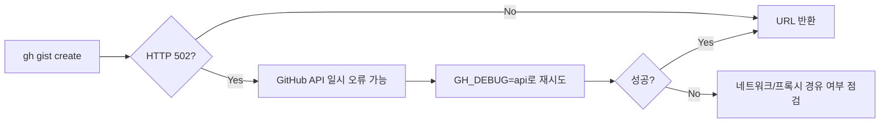

# 260331 tmux 버퍼복사와 secret gist 워크플로우

Ubuntu 원격 세션에서 로그를 빠르게 복사하고, 필요한 경우 GitHub의 secret gist로 공유하는 흐름을 정리했다. 이번 세션의 핵심은 **tmux 버퍼와 시스템 클립보드를 구분해서 쓰는 것**, 그리고 **`gh` 기반 비공개 공유 루틴을 안정화하는 것**이었다.

## 삽화 1) 전체 흐름도

```mermaid
flowchart TD
  A[tmux copy-mode 진입<br/>Ctrl-b []]
  A --> B[텍스트 선택<br/>Ctrl-Space]
  B --> C[복사<br/>Alt-w]
  C --> D[copy-mode 종료<br/>q]
  D --> E[vim log.log 열기]
  E --> F[tmux 버퍼 붙여넣기<br/>Ctrl-b ]]
  F --> G[저장 후 종료<br/>Esc :wq]
  G --> H[gh gist create로 secret gist 생성]
  H --> I[URL 공유]
```

## 1) tmux 버퍼 복사 (emacs 모드)

`tmux` copy-mode 기본값은 `emacs`라서, 기본 환경이면 추가 설정 없이 바로 사용 가능하다.

### 기본 시퀀스

1. `Ctrl-b` `[` : copy-mode 진입
2. `Ctrl-Space` : 선택 시작
3. 커서 이동으로 범위 지정
4. `Alt-w` : 선택 복사
5. `q` : copy-mode 종료
6. `vim log.log` : 대상 파일 열기
7. `Ctrl-b` `]` : tmux 버퍼 붙여넣기
8. `Esc` `:wq` : 저장 후 종료

### 중요한 포인트

- `Ctrl-b` `]`는 **tmux 버퍼 붙여넣기**다.
- `Ctrl-Shift-v`는 **터미널/OS 클립보드 붙여넣기**다.
- 즉, tmux에서 `Alt-w`(또는 동등 동작)로 복사했다면 붙여넣기는 기본적으로 `Ctrl-b` `]`를 사용한다.

## 2) 모드 전환/충돌 트러블슈팅

세션 중 `vi`로 바꿨는데 다시 `emacs`로 보이는 문제가 있었고, 원인은 `~/.tmux.conf`의 중복 설정이었다.

### 진단 포인트

```bash
tmux show-options -w mode-keys
tmux show-options -gw mode-keys
grep -nE 'mode-keys|source-file' ~/.tmux.conf
```

같은 파일에 아래처럼 둘 다 있으면 마지막 줄이 이긴다.

```tmux
setw -g mode-keys vi
setw -g mode-keys emacs
```

## 3) `gh` 설치/로그인/초기 확인

`gh`가 없을 때는 apt로 설치하고, 로그인 후 상태를 확인한다.

```bash
sudo apt update
sudo apt install -y gh
gh --version

gh auth login
gh auth status
```

실제 세션에서도 로그인은 정상 완료되었고(`Logged in as ...`), SSH 키 업로드까지 성공했다.

## 4) secret gist 생성 (private 링크 공유)

로그 파일 업로드는 아래 명령으로 진행한다.

```bash
gh gist create log.log -d "log upload $(date '+%F %T')"
```

### 주의

- `-p`를 쓰면 public gist가 된다.
- `-p`를 **쓰지 않으면 secret gist**다.
- secret gist는 검색 노출은 제한되지만, URL을 아는 사용자는 접근할 수 있다.

## 삽화 2) gist 생성 에러 대응 흐름



이번 세션에서도 한 번 `HTTP 502`가 발생했지만, 디버그 재시도 후 정상 생성되었다.

## 5) 운영 팁 (짧게)

- CRD(Chrome Remote Desktop) 환경에서는 `Alt` 전달이 흔들릴 수 있어 `Alt-w`가 불안정할 수 있다.
- 이 경우 `tmux` 내부 붙여넣기(`Ctrl-b` `]`) 기준으로 작업하면 훨씬 안정적이다.
- 공유 전에는 로그 내 민감정보(토큰/패스워드/API 키) 점검을 권장한다.

## 참고 링크 (웹 검색/검증 출처)

- tmux 매뉴얼: https://man.openbsd.org/tmux
- GitHub CLI `gh auth login`: https://cli.github.com/manual/gh_auth_login
- GitHub CLI `gh gist create`: https://cli.github.com/manual/gh_gist_create
- GitHub Status: https://www.githubstatus.com/
- 서울 현재시각 API(파일명 시각 기준): https://timeapi.io/api/Time/current/zone?timeZone=Asia/Seoul

## 작성에 사용한 사용자 프롬프트

```text
hhd-md

이 세션의 대화 내용 정리해서 문서로 재구성 요청
- tmux 버퍼 복사
  - emacs 설정
  - 기본값이니 이것은 할것 없음
  - ctrl b [
  - ctrl space
  - alt w
  - q
  - vim log.log
  - ctrl b ]
  - esc : wq
- gh 설치, 로그인, 설정 과정....
- gh 로 private gist 생성하는 과정
```
